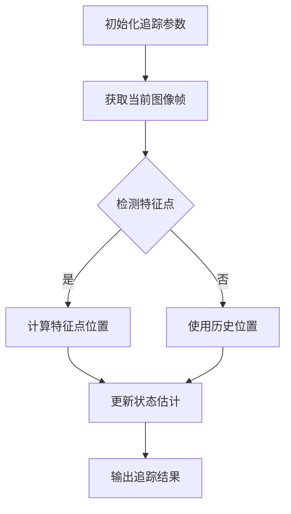
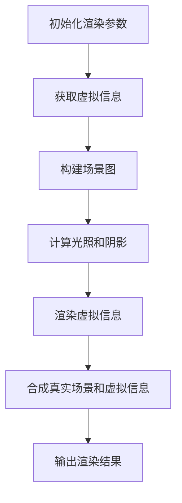
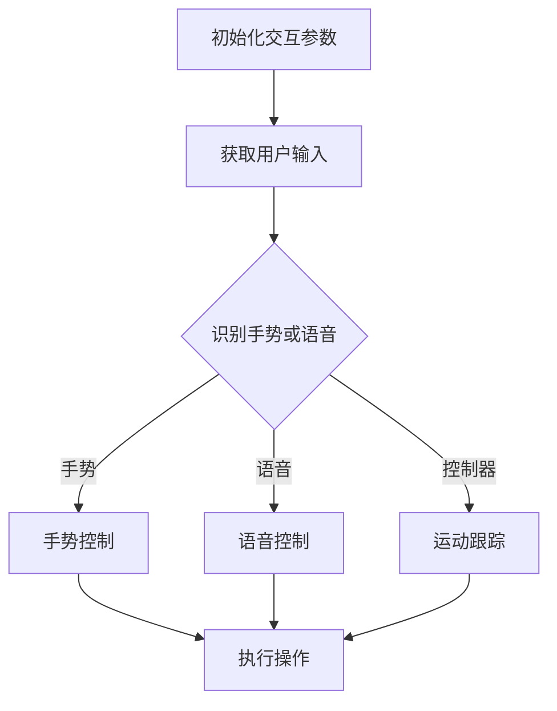
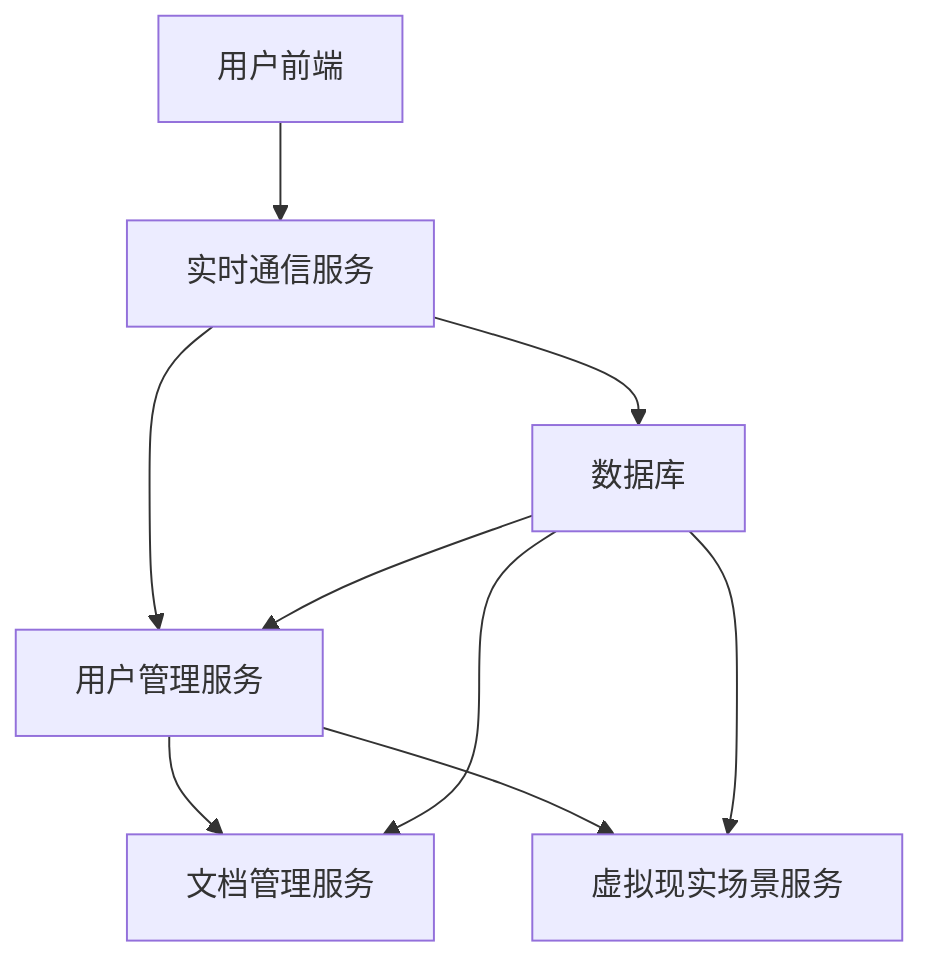
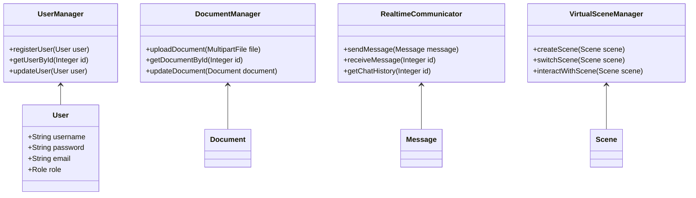
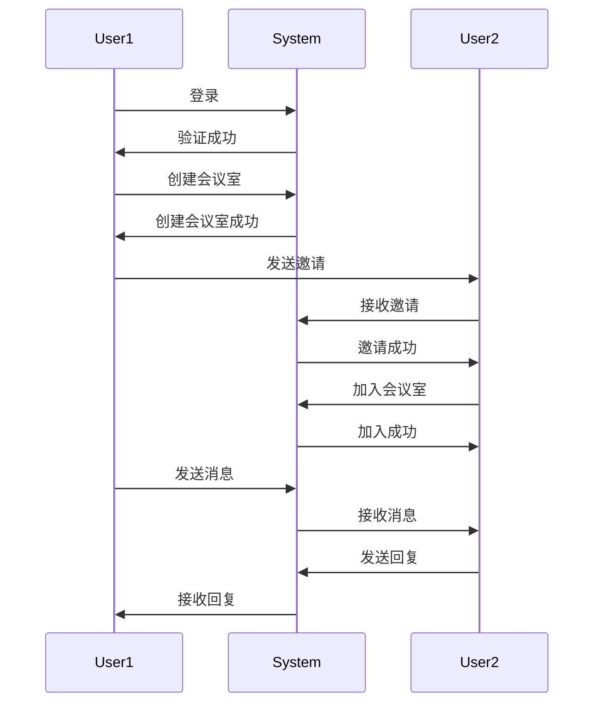

                 

## 《增强现实在远程协作中的应用前景》

> 关键词：增强现实、远程协作、算法原理、系统架构、实战案例

> 摘要：本文探讨了增强现实技术在远程协作领域的应用前景。首先介绍了增强现实技术的基本概念、远程协作的需求和挑战，以及它们之间的联系。接着，深入剖析了增强现实技术的核心概念和原理，包括显示技术、空间定位技术和交互技术。随后，探讨了远程协作的核心要素，并展示了增强现实技术在远程协作中的具体应用。通过实际项目案例，详细讲解了增强现实远程协作系统的实现过程，包括算法原理、数学模型、系统架构和项目实战。最后，总结了增强现实远程协作的注意事项和未来发展方向，为读者提供了丰富的实践技巧和拓展阅读资源。

----------------------------------------------------------------

### 背景介绍

#### 增强现实技术的定义

增强现实（Augmented Reality，简称AR）是一种通过计算机技术将虚拟信息叠加到真实世界中，从而增强用户视觉、听觉和触觉体验的技术。与虚拟现实（Virtual Reality，简称VR）不同，AR技术并不是将用户完全带入一个虚构的世界，而是在现实环境中增强信息展示和交互体验。

增强现实技术的基本原理是通过摄像头捕捉现实场景，然后利用计算机图形学技术，将虚拟信息以图形、文字、声音等形式叠加到现实场景中，从而实现虚实结合的效果。增强现实技术的关键组件包括显示设备、传感器和计算单元。

#### 远程协作的需求

远程协作是指通过互联网和其他通信技术，使得位于不同地理位置的团队成员能够协同工作、共享资源和信息的一种工作方式。随着全球化进程的加快和企业规模的扩大，远程协作的需求日益增长。远程协作的挑战包括：

1. **沟通障碍**：地理位置的差异和时区差异导致沟通不畅，容易产生误解和协作障碍。
2. **资源共享**：远程协作需要高效的资源共享和文件传输机制，以确保团队成员能够及时获取所需信息。
3. **协作效率**：远程协作需要高效的工作流程和协作工具，以提高团队的工作效率和响应速度。
4. **数据安全**：远程协作涉及到大量的数据传输和存储，需要确保数据的安全性和隐私性。

#### 增强现实技术在远程协作中的应用前景

增强现实技术在远程协作中的应用前景十分广阔。通过增强现实技术，可以解决远程协作中的一些核心问题，提升协作效率和体验。以下是一些具体的应用场景：

1. **远程会议**：利用增强现实技术，可以实时将参与者的虚拟形象叠加到视频会议中，使得远程会议更加生动和互动。
2. **远程办公**：增强现实技术可以帮助团队成员在虚拟环境中共同浏览和编辑文档，实现高效的远程办公。
3. **远程教育**：增强现实技术可以提供更加生动和互动的在线教育体验，使得学生能够更加直观地理解课程内容。
4. **远程医疗**：增强现实技术可以辅助医生进行远程诊断和治疗，提供更加精准和高效的医疗服务。

#### 增强现实与远程协作的联系

增强现实技术与远程协作的结合，可以带来以下优势：

1. **增强互动性**：通过增强现实技术，可以使得远程协作更加直观和互动，提升团队协作的体验。
2. **提高效率**：增强现实技术可以提供更加高效的信息展示和交互方式，减少沟通和协作的障碍。
3. **减少成本**：远程协作可以减少团队成员的地理距离，降低交通和住宿等成本。
4. **扩展应用领域**：增强现实技术可以应用于更多的远程协作场景，如远程设计、远程维修等，拓展远程协作的应用领域。

总之，增强现实技术在远程协作中的应用前景十分广阔，有望成为未来远程协作的重要技术手段。在接下来的章节中，我们将进一步探讨增强现实技术的核心概念和原理，以及其在远程协作中的具体应用。

#### 当前应用案例与未来发展趋势

当前，增强现实技术在远程协作领域已有一些成功的应用案例。例如，某些企业已经利用增强现实技术进行远程会议，通过虚拟形象和实时交互，提升了会议的互动性和参与度。此外，远程医疗领域也开始采用增强现实技术，医生可以通过AR设备进行远程手术指导，提高手术的成功率和安全性。

未来，随着技术的不断进步和应用的深入，增强现实技术在远程协作中的应用前景将更加广阔。以下是一些可能的发展趋势：

1. **更高的交互性**：未来的增强现实技术将提供更加自然和直观的交互方式，如手势识别、语音控制等，进一步提升远程协作的体验。
2. **更广泛的设备支持**：增强现实技术将不再局限于专业的AR设备，普通智能手机和平板电脑也将具备增强现实功能，使得更多用户能够享受到远程协作的便利。
3. **更高效的协作工具**：增强现实技术将开发出更多高效的协作工具，如虚拟白板、虚拟会议房间等，帮助团队成员更好地协同工作。
4. **更安全的数据传输**：随着远程协作的普及，数据安全和隐私保护将成为关键问题。未来，增强现实技术将提供更安全的数据传输和存储方案，确保数据的安全性和隐私性。

#### 潜在应用领域

增强现实技术在远程协作领域的应用不仅限于会议和医疗，还涵盖了多个潜在的应用领域：

1. **远程教育**：通过增强现实技术，学生和教师可以进行虚拟课堂互动，实现更加生动和互动的教学体验。
2. **远程设计**：设计师可以通过增强现实技术远程协作，共同浏览和修改设计方案，提高设计效率和创意质量。
3. **远程维修**：技术人员可以通过增强现实设备进行远程指导，协助现场人员进行设备维修和故障排除，提高维修效率和准确性。
4. **远程娱乐**：增强现实技术将带来全新的娱乐体验，如虚拟演唱会、虚拟旅游等，满足用户对娱乐的多样化需求。

总之，增强现实技术在远程协作中的应用前景非常广阔，随着技术的不断发展和创新的不断涌现，未来将进一步推动远程协作的发展，为企业和个人带来更多的便利和效益。

### 核心概念与联系

#### 增强现实技术的核心概念

增强现实技术的核心概念包括显示技术、空间定位技术和交互技术。以下是这些核心概念的定义和属性特征：

1. **显示技术**：
   - **定义**：显示技术是指将虚拟信息叠加到现实场景中的方法。
   - **属性特征**：显示技术可以分为投影显示和显示器显示。投影显示利用投影仪将虚拟信息投射到实际环境中，而显示器显示则通过特殊的显示器（如头戴式显示器）将虚拟信息直接呈现给用户。

2. **空间定位技术**：
   - **定义**：空间定位技术是指用于确定虚拟信息在现实场景中的位置和方向的方法。
   - **属性特征**：空间定位技术包括视觉定位、激光定位和惯性测量单元（IMU）。视觉定位利用摄像头捕捉现实场景，并通过图像处理算法确定物体的位置；激光定位利用激光束测量距离，提供高精度的定位信息；IMU则通过加速度计和陀螺仪等传感器测量运动，提供相对位置信息。

3. **交互技术**：
   - **定义**：交互技术是指用户与增强现实系统进行交互的方式。
   - **属性特征**：交互技术包括手势识别、声音交互和虚拟现实控制器。手势识别允许用户通过手势控制虚拟信息；声音交互通过语音指令控制系统；虚拟现实控制器则提供更加直观的交互方式，如手柄和手套等。

#### 远程协作的核心要素

远程协作的核心要素包括通信技术、协作工具和数据安全。

1. **通信技术**：
   - **定义**：通信技术是指用于实现远程团队之间信息交换的方法。
   - **属性特征**：通信技术包括网络通信协议（如TCP/IP）和实时通信技术（如WebRTC）。网络通信协议提供稳定的连接和数据传输机制，而实时通信技术则确保信息传递的实时性和高效性。

2. **协作工具**：
   - **定义**：协作工具是指用于支持远程团队协同工作的软件和平台。
   - **属性特征**：协作工具包括文档共享工具（如Google Docs）和视频会议系统（如Zoom）。文档共享工具允许团队成员实时编辑和共享文件，而视频会议系统则提供实时的语音和视频通信。

3. **数据安全与隐私保护**：
   - **定义**：数据安全与隐私保护是指确保远程协作过程中数据的安全性和隐私性。
   - **属性特征**：数据安全与隐私保护包括数据加密、访问控制和防火墙等技术。数据加密确保数据在传输过程中的安全性，访问控制限制对数据的访问权限，防火墙则提供网络安全的屏障。

#### 增强现实与远程协作的联系

增强现实技术可以显著提升远程协作的效率和体验。以下是增强现实与远程协作之间的具体联系：

1. **增强互动性**：通过增强现实技术，远程协作的参与者可以在虚拟环境中进行更加直观和互动的交流，减少沟通障碍，提升协作效率。

2. **提高信息展示效果**：增强现实技术可以将虚拟信息以更加生动和直观的方式展示给远程协作的参与者，使信息传达更加清晰易懂。

3. **协作工具集成**：增强现实技术可以与现有的远程协作工具（如视频会议系统、文档共享工具）集成，提供更加丰富和灵活的协作方式。

4. **提升协作效率**：通过增强现实技术，团队成员可以更加高效地进行远程协作，如虚拟白板、实时设计修改等，提高团队的工作效率和响应速度。

5. **拓展应用领域**：增强现实技术可以应用于更多的远程协作场景，如远程医疗、远程教育、远程设计等，拓展远程协作的应用范围。

总之，增强现实技术与远程协作的紧密结合，将为企业和个人带来更加高效、便捷和丰富的协作体验，推动远程协作的进一步发展。

### 增强现实技术基础

要深入理解增强现实技术在远程协作中的应用，我们需要首先了解其核心技术基础，这包括显示技术、空间定位技术和交互技术。以下将详细阐述这些核心概念及其工作原理。

#### 显示技术

显示技术是增强现实（AR）系统的核心组成部分，它决定了虚拟信息如何与现实场景结合。显示技术可以分为投影显示和显示器显示两种类型。

1. **投影显示**：
   - **工作原理**：投影显示利用投影仪将虚拟信息通过光线投射到现实环境中。投影仪通常配有摄像头来捕捉现实场景，然后通过计算将虚拟信息叠加到真实场景中。
   - **优势**：投影显示能够覆盖较大范围的环境，适合公共场合和大型空间的应用。
   - **应用场景**：例如，博物馆中的互动展览、商场中的广告展示等。

2. **显示器显示**：
   - **工作原理**：显示器显示则是通过特殊的显示器（如头戴式显示器、智能手机、平板电脑等）将虚拟信息直接显示给用户。这些显示器通常配有摄像头和传感器，用于捕捉现实环境并实现虚拟信息的叠加。
   - **优势**：显示器显示设备便携性高，用户体验直接，适用于个人用户和较小空间的应用。
   - **应用场景**：例如，智能手机上的AR游戏、医生通过头戴显示器进行远程诊断等。

#### 空间定位技术

空间定位技术是增强现实系统的关键组件，它负责确定虚拟信息在现实场景中的位置和方向。空间定位技术主要有以下几种：

1. **视觉定位**：
   - **工作原理**：视觉定位通过摄像头捕捉现实场景中的特征点（如角点、纹理等），然后利用图像处理算法和计算机视觉技术进行匹配和计算，确定虚拟信息的位置和方向。
   - **优势**：视觉定位适用于各种环境，对光线变化和遮挡有一定容忍度。
   - **应用场景**：例如，AR游戏中的角色定位、建筑模型中的标注等。

2. **激光定位**：
   - **工作原理**：激光定位通过发射激光束并接收反射信号，利用三角测量原理计算距离和位置。激光定位通常需要专门的激光发射器和接收器。
   - **优势**：激光定位具有高精度和快速响应的特点，适用于需要高精度定位的场合。
   - **应用场景**：例如，工业自动化中的机器人导航、远程医疗中的手术指导等。

3. **惯性测量单元（IMU）**：
   - **工作原理**：惯性测量单元包括加速度计和陀螺仪等传感器，用于测量设备的运动状态（加速度和角速度）。通过连续测量和数据处理，IMU可以提供设备的相对位置信息。
   - **优势**：IMU设备小巧轻便，适用于移动设备上的定位。
   - **应用场景**：例如，智能手机和平板电脑上的运动跟踪、游戏机中的角色移动等。

#### 交互技术

交互技术是用户与增强现实系统进行交互的关键方式，它决定了用户如何控制虚拟信息和实现交互操作。交互技术主要包括以下几种：

1. **手势识别**：
   - **工作原理**：手势识别通过摄像头捕捉用户的手部动作，利用图像处理和机器学习算法识别出手势，然后通过相应的算法将手势转换为控制命令。
   - **优势**：手势识别提供直观和自然的交互方式，用户无需额外设备即可进行操作。
   - **应用场景**：例如，AR游戏中的角色控制、桌面应用程序中的手势导航等。

2. **声音交互**：
   - **工作原理**：声音交互通过麦克风捕捉用户的语音指令，利用自然语言处理（NLP）技术将语音转换为文本或命令，然后执行相应的操作。
   - **优势**：声音交互特别适合于不方便使用手势或键盘的场景，如驾驶时的语音指令控制。
   - **应用场景**：例如，智能家居控制系统、车载导航系统等。

3. **虚拟现实控制器**：
   - **工作原理**：虚拟现实控制器（如手柄、手套、手环等）通过传感器和通信技术实时捕捉用户动作和位置，然后将这些数据发送到增强现实系统，实现虚拟信息的交互操作。
   - **优势**：虚拟现实控制器提供高精度和低延迟的交互体验，适合复杂的交互操作。
   - **应用场景**：例如，VR游戏中的角色控制、工业自动化中的远程操作等。

通过理解显示技术、空间定位技术和交互技术，我们可以更好地掌握增强现实技术的工作原理，为后续的算法原理讲解和系统架构设计打下基础。

### 增强现实系统架构

#### 系统架构概述

增强现实（AR）系统是一个高度集成和复杂的技术体系，涉及多个功能模块的协同工作。为了实现增强现实的应用，我们需要设计一个合理的系统架构，确保各个模块之间的高效协作和功能完备。以下是增强现实系统的基本架构及其各个模块的详细介绍。

1. **输入模块**：输入模块负责捕捉和获取现实环境中的各种信息，包括摄像头、传感器和用户输入设备。摄像头用于捕捉现实场景，传感器（如加速度计、陀螺仪等）用于获取设备的运动状态，用户输入设备（如手柄、手套等）则用于用户的交互操作。

2. **处理模块**：处理模块对输入模块获取的信息进行处理和分析。主要包括图像处理、传感器数据处理和用户输入处理等。图像处理算法用于识别场景中的特征点、物体和纹理；传感器数据处理算法用于计算设备的运动轨迹和位置；用户输入处理算法则将用户的交互操作转换为系统指令。

3. **渲染模块**：渲染模块负责生成虚拟信息并将其叠加到现实场景中。该模块包括图像渲染和3D渲染。图像渲染将虚拟信息以图形和文字的形式叠加到摄像头捕捉的现实场景中；3D渲染则用于创建和渲染三维虚拟物体，使其与真实环境无缝融合。

4. **输出模块**：输出模块负责将处理后的虚拟信息和现实场景合成，并将其呈现给用户。输出设备可以是投影仪、显示器、头戴式显示器等。输出模块需要确保虚拟信息与现实环境的完美融合，提供高质量的视觉效果。

5. **交互模块**：交互模块负责处理用户与增强现实系统的交互，包括手势识别、声音交互和虚拟现实控制器等。通过交互模块，用户可以与虚拟信息进行互动，控制虚拟物体的位置、大小和动作。

#### 显示模块

显示模块是增强现实系统的重要组成部分，它决定了用户如何看到叠加在现实环境中的虚拟信息。显示模块可以细分为以下几类：

1. **投影显示**：投影显示通过投影仪将虚拟信息投射到现实环境中。这种显示方式适用于需要覆盖较大范围环境的场景，如商场、博物馆等。

2. **显示器显示**：显示器显示通过特殊的显示器（如头戴式显示器、智能手机、平板电脑等）将虚拟信息直接显示给用户。这种显示方式便携性高，适合个人用户和较小空间的应用。

3. **混合显示**：混合显示结合了投影显示和显示器显示的优势，通过多个显示器和投影仪的组合，实现更大的显示范围和更高的视觉质量。

#### 定位模块

定位模块负责确定虚拟信息在现实场景中的位置和方向。定位模块的工作原理和实现方式如下：

1. **视觉定位**：视觉定位通过摄像头捕捉现实场景中的特征点，利用图像处理和计算机视觉算法确定虚拟信息的位置和方向。视觉定位适用于各种环境，对光线变化和遮挡有一定容忍度。

2. **激光定位**：激光定位通过发射激光束并接收反射信号，利用三角测量原理计算距离和位置。激光定位具有高精度和快速响应的特点，适用于需要高精度定位的场合。

3. **惯性测量单元（IMU）**：惯性测量单元通过加速度计和陀螺仪等传感器测量设备的运动状态，提供相对位置信息。IMU适用于移动设备上的定位，具有小巧轻便的优势。

#### 交互模块

交互模块负责处理用户与增强现实系统的交互，实现虚拟信息与用户的互动。交互模块包括以下几种交互技术：

1. **手势识别**：手势识别通过摄像头捕捉用户的手部动作，利用图像处理和机器学习算法识别出手势，然后将其转换为系统指令。手势识别提供直观和自然的交互方式。

2. **声音交互**：声音交互通过麦克风捕捉用户的语音指令，利用自然语言处理技术将语音转换为文本或命令，然后执行相应的操作。声音交互特别适合于不方便使用手势或键盘的场景。

3. **虚拟现实控制器**：虚拟现实控制器通过传感器和通信技术实时捕捉用户的动作和位置，然后将这些数据发送到增强现实系统，实现虚拟信息的交互操作。虚拟现实控制器提供高精度和低延迟的交互体验。

通过以上对增强现实系统架构的详细介绍，我们可以更好地理解增强现实技术的工作原理和实现方法，为后续的算法原理讲解和系统设计提供理论基础。

### 增强现实算法原理讲解

#### 追踪算法

追踪算法是增强现实（AR）技术中至关重要的一部分，它负责识别和跟踪现实场景中的特定对象或特征点。追踪算法的性能直接影响增强现实系统的稳定性和准确性。

1. **传统追踪算法**
   - **卡尔曼滤波（Kalman Filter）**：卡尔曼滤波是一种线性二次最优估计算法，用于在噪声环境中估计动态系统的状态。它通过对观测数据进行加权平均，结合先验状态估计和预测，提高状态估计的精度。
   - **粒子滤波（Particle Filter）**：粒子滤波是一种基于抽样方法的非线性非线性非线性非线性状态估计技术。它通过在状态空间中生成大量粒子，并利用重要性权重更新粒子的状态，从而估计系统的状态。
   - **光流法（Optical Flow）**：光流法通过分析图像序列中的像素运动，估计场景中的速度场。它适用于高速运动和复杂背景的场景，但在低光照条件下表现较差。

2. **深度学习在追踪中的应用**
   - **卷积神经网络（CNN）**：卷积神经网络通过多层卷积和池化操作，提取图像特征，从而实现对象的检测和跟踪。与传统的图像处理算法相比，CNN具有更好的特征提取能力和鲁棒性。
   - **递归神经网络（RNN）**：递归神经网络适用于处理序列数据，通过记忆和传递历史信息，实现对象的长期跟踪。RNN在处理连续运动和长时间跟踪时具有优势。
   - **卷积递归神经网络（CNN-RNN）**：结合了卷积神经网络和递归神经网络的优点，CNN-RNN能够同时处理图像和序列数据，实现更准确的追踪效果。

以下是一个简单的追踪算法流程图，使用Mermaid表示：



#### 渲染算法

渲染算法负责将虚拟信息以图形形式叠加到现实场景中。增强现实系统中的渲染算法通常需要考虑实时性、准确性和视觉效果。

1. **实时渲染**
   - **基于视图的渲染**：基于视图的渲染通过将场景划分为多个视图，分别对每个视图进行渲染，从而提高渲染效率。这种方法适用于具有多个观察点的场景。
   - **基于区域的渲染**：基于区域的渲染将场景划分为多个区域，并对每个区域进行独立渲染。这种方法适用于动态场景，可以减少渲染负担。
   - **基于物理的渲染**：基于物理的渲染（Physically Based Rendering，PBR）通过模拟光线的行为和材料的属性，实现更加真实和细腻的渲染效果。

2. **高质量渲染**
   - **全局光照**：全局光照（Global Illumination）通过计算光线在场景中的传播和反射，实现更加真实的光照效果。常用的全局光照算法包括路径追踪（Path Tracing）和光线追踪（Ray Tracing）。
   - **光线追踪**：光线追踪通过模拟光线的传播路径，计算场景中的光照和阴影效果。光线追踪能够实现高质量的真实感渲染，但计算成本较高。

以下是一个简单的渲染算法流程图，使用Mermaid表示：



#### 交互算法

交互算法是增强现实系统与用户进行交互的关键部分，它决定了用户如何与虚拟信息进行互动。

1. **基于手势的交互**
   - **手势识别**：手势识别通过摄像头捕捉用户的手部动作，利用图像处理和机器学习算法识别出手势。常见的手势包括手势识别、手指数量识别和手势轨迹识别。
   - **手势控制**：手势控制通过手势识别的结果，将手势转换为系统指令，实现对虚拟信息的操作。例如，手势滑动可以控制虚拟物体的移动，手势点击可以触发虚拟按钮。

2. **基于声音的交互**
   - **语音识别**：语音识别通过麦克风捕捉用户的语音，利用自然语言处理技术将语音转换为文本或命令。常见的语音识别算法包括隐马尔可夫模型（HMM）、循环神经网络（RNN）和深度学习。
   - **语音控制**：语音控制通过语音识别的结果，执行相应的操作。例如，用户可以通过语音命令打开应用程序、发送消息或调整系统设置。

3. **基于虚拟现实控制器的交互**
   - **运动跟踪**：运动跟踪通过虚拟现实控制器（如手柄、手套等）的传感器，捕捉用户动作和位置。常用的运动跟踪算法包括惯性测量单元（IMU）数据处理和传感器融合。
   - **交互操作**：交互操作通过运动跟踪的结果，实现对虚拟信息的操作。例如，用户可以通过手柄控制虚拟物体的旋转、缩放和平移。

以下是一个简单的交互算法流程图，使用Mermaid表示：



通过以上对追踪算法、渲染算法和交互算法的详细讲解，我们可以更好地理解增强现实技术的实现原理，为后续的系统设计与项目实战打下坚实的基础。

### 数学模型和数学公式

在增强现实（AR）技术的算法设计中，数学模型和数学公式起着至关重要的作用。它们不仅是算法精确度的基础，也为实现算法提供了明确的指导。以下我们将详细探讨几种关键算法的数学模型和数学公式，并使用LaTeX格式进行表示。

#### 追踪算法

1. **卡尔曼滤波**

   卡尔曼滤波是一种线性二次最优估计算法，用于估计动态系统的状态。其状态估计公式如下：

   $$ x_{k|k} = x_{k|k-1} + K_k (z_k - h(x_{k|k-1})) $$

   其中，$x_{k|k}$是k时刻的后验状态估计，$x_{k|k-1}$是k-1时刻的先验状态估计，$K_k$是卡尔曼增益，$z_k$是观测值，$h(x)$是系统模型。

   LaTeX表示：

   $$ x_{k|k} = x_{k|k-1} + K_k (z_k - h(x_{k|k-1})) $$

2. **粒子滤波**

   粒子滤波是一种基于抽样方法的非线性状态估计技术。其重要性权重更新公式如下：

   $$ w_k(i) = \frac{p(z_k | x_k^i)}{\sum_{j=1}^N p(z_k | x_k^j)} $$

   其中，$w_k(i)$是第i个粒子的权重，$p(z_k | x_k^i)$是观测概率，$N$是粒子总数。

   LaTeX表示：

   $$ w_k(i) = \frac{p(z_k | x_k^i)}{\sum_{j=1}^N p(z_k | x_k^j)} $$

3. **光流法**

   光流法通过计算像素的瞬时速度，实现场景中物体的运动跟踪。其光流方程如下：

   $$ v = \frac{I_t - I_{t-d}}{d} $$

   其中，$v$是像素速度，$I_t$是当前时刻的图像，$I_{t-d}$是$t-d$时刻的图像，$d$是时间间隔。

   LaTeX表示：

   $$ v = \frac{I_t - I_{t-d}}{d} $$

#### 渲染算法

1. **基于视图的渲染**

   基于视图的渲染通过将场景划分为多个视图进行渲染。其视图变换矩阵如下：

   $$ M_{view} = \begin{bmatrix}
   R_{view} & -R_{view}T_{view} \\
   0 & 1
   \end{bmatrix} $$

   其中，$R_{view}$是视图旋转矩阵，$T_{view}$是视图平移向量。

   LaTeX表示：

   $$ M_{view} = \begin{bmatrix}
   R_{view} & -R_{view}T_{view} \\
   0 & 1
   \end{bmatrix} $$

2. **全局光照**

   全局光照通过计算光线在场景中的传播和反射实现光照效果。其光照方程如下：

   $$ L_o(\mathbf{p}) = L_e(\mathbf{p}) + \int_{\Omega} f_r(\mathbf{w'},\mathbf{w}) L_i(\mathbf{p'},\mathbf{w'}) (\mathbf{p'} - \mathbf{p}) \cdot \mathbf{n} d\omega' $$

   其中，$L_o(\mathbf{p})$是 outgoing 光照，$L_e(\mathbf{p})$是 emitted 光照，$f_r(\mathbf{w'},\mathbf{w})$是反射率，$L_i(\mathbf{p'},\mathbf{w'})$是 incoming 光照，$\mathbf{w'}$是入射光线方向，$\mathbf{w}$是反射光线方向，$\mathbf{n}$是表面法线。

   LaTeX表示：

   $$ L_o(\mathbf{p}) = L_e(\mathbf{p}) + \int_{\Omega} f_r(\mathbf{w'},\mathbf{w}) L_i(\mathbf{p'},\mathbf{w'}) (\mathbf{p'} - \mathbf{p}) \cdot \mathbf{n} d\omega' $$

#### 交互算法

1. **基于手势的交互**

   手势识别通常通过深度学习模型实现。其损失函数如下：

   $$ J = \frac{1}{m} \sum_{i=1}^m (-y_i \log(a_i) - (1 - y_i) \log(1 - a_i)) $$

   其中，$J$是损失函数，$m$是样本数量，$y_i$是真实标签，$a_i$是预测概率。

   LaTeX表示：

   $$ J = \frac{1}{m} \sum_{i=1}^m (-y_i \log(a_i) - (1 - y_i) \log(1 - a_i)) $$

2. **基于声音的交互**

   语音识别通常通过循环神经网络（RNN）实现。其训练损失函数如下：

   $$ J = \frac{1}{T} \sum_{t=1}^T (-y_t \log(p_t)) $$

   其中，$J$是损失函数，$T$是时间步数，$y_t$是真实标签，$p_t$是预测概率。

   LaTeX表示：

   $$ J = \frac{1}{T} \sum_{t=1}^T (-y_t \log(p_t)) $$

通过上述数学模型和数学公式的详细讲解，我们可以更好地理解增强现实算法的设计原理，为进一步的系统和项目设计提供坚实的理论基础。

### 系统分析与架构设计方案

在设计增强现实（AR）远程协作系统时，系统分析与架构设计是至关重要的环节。这不仅关系到系统的整体性能和稳定性，也直接影响用户体验和效率。以下是关于增强现实远程协作系统的设计与实现过程。

#### 问题场景介绍

在远程协作中，团队成员分布在不同的地理位置，他们需要通过高效的通信和协作工具来实现共同的工作目标。然而，传统远程协作工具存在一些问题，如沟通不顺畅、资源共享不便、协作效率低下等。为了解决这些问题，我们设计了一套基于增强现实技术的远程协作系统，通过虚拟现实场景和实时交互功能，提升团队协作的体验和效率。

#### 系统功能设计

增强现实远程协作系统主要包括以下功能模块：

1. **用户身份验证**：确保只有授权用户可以访问系统。
2. **用户管理**：管理用户账户、权限和角色。
3. **实时通信**：提供语音、视频和文字通信功能。
4. **共享文档**：支持文档的实时编辑和共享。
5. **虚拟现实场景**：创建虚拟会议房间，模拟面对面交流。
6. **协作工具**：集成白板、日程安排、任务管理等功能。
7. **数据安全**：确保数据在传输和存储过程中的安全性和隐私性。

#### 系统架构设计

为了实现上述功能，我们设计了如下系统架构：

1. **前端展示层**：使用WebGL和Three.js等前端技术实现增强现实场景的渲染和交互。
2. **中间服务层**：使用Spring Boot框架构建后端服务，提供用户管理、实时通信、文档共享等功能。
3. **数据存储层**：使用MySQL数据库存储用户数据、文档信息和系统配置。
4. **实时通信服务**：使用WebSocket技术实现实时通信，确保消息的快速传输和响应。

以下是增强现实远程协作系统的架构图，使用Mermaid表示：



#### 系统接口设计

系统接口设计包括API接口设计和用户界面设计。

1. **API接口设计**：
   - 用户身份验证：提供登录、注册、密码重置等API接口。
   - 用户管理：提供用户信息查询、权限分配等API接口。
   - 实时通信：提供消息发送、接收、历史记录查询等API接口。
   - 文档管理：提供文档上传、下载、编辑、共享等API接口。
   - 虚拟现实场景：提供场景创建、场景切换、场景交互等API接口。

2. **用户界面设计**：
   - 用户登录页面：用户输入账号和密码，进行身份验证。
   - 主界面：展示用户的头像、角色和功能菜单。
   - 虚拟会议室：展示其他用户的虚拟形象，提供语音、视频和文字通信功能。
   - 文档编辑页面：支持文档的实时编辑和共享。

以下是系统接口设计的类图，使用Mermaid表示：



#### 系统交互

系统交互通过用户与系统的交互来实现各项功能。以下是增强现实远程协作系统的主要交互流程：

1. **用户登录**：用户通过输入账号和密码进行身份验证，成功后进入主界面。
2. **创建虚拟会议室**：用户可以选择创建新的虚拟会议室，并邀请其他用户加入。
3. **邀请用户**：系统通过发送邀请链接或二维码，邀请其他用户加入虚拟会议室。
4. **实时通信**：用户在虚拟会议室中可以发送文本、语音和视频消息，实现实时沟通。
5. **共享文档**：用户可以在虚拟会议室中上传和编辑文档，实现文档的实时共享和协作。
6. **场景交互**：用户可以通过手势或语音控制虚拟场景，进行虚拟物品的摆放和操作。

以下是系统交互的序列图，使用Mermaid表示：



通过以上对增强现实远程协作系统的详细分析与架构设计方案，我们可以确保系统功能的完整性和实现的高效性，为团队成员提供良好的远程协作体验。

### 项目实战

#### 环境安装

为了实现增强现实远程协作系统，我们需要搭建相应的开发环境。以下是环境安装的具体步骤：

1. **安装Java Development Kit (JDK)**
   - 访问 [Oracle JDK官网](https://www.oracle.com/java/technologies/javase-downloads.html) 下载最新版本的JDK。
   - 解压下载的JDK压缩包到指定目录，如`/usr/local/java`。

2. **安装Node.js**
   - 访问 [Node.js官网](https://nodejs.org/) 下载最新版本的Node.js。
   - 解压下载的Node.js压缩包到指定目录，如`/usr/local/node`。
   - 添加Node.js的bin目录到系统环境变量，如`export PATH=$PATH:/usr/local/node/bin`。

3. **安装MySQL数据库**
   - 访问 [MySQL官网](https://dev.mysql.com/downloads/mysql/) 下载适用于操作系统的MySQL安装包。
   - 解压下载的MySQL压缩包并按照安装向导进行安装。
   - 启动MySQL服务器并配置用户权限。

4. **安装前端开发工具**
   - 安装Visual Studio Code（VS Code），这是一个强大的代码编辑器。
   - 安装Node.js和npm插件，以支持JavaScript开发。
   - 安装Three.js插件，用于增强现实场景的渲染。

#### 系统核心实现

以下是系统核心实现的详细步骤，包括后端API接口、数据库设计和前端展示：

1. **后端API接口实现**
   - 使用Spring Boot框架创建一个RESTful API项目。
   - 实现用户管理接口，包括注册、登录、用户信息查询和更新等。
   - 实现文档管理接口，包括文档上传、下载、编辑和共享等。
   - 实现虚拟会议室接口，包括会议室创建、加入、消息发送和接收等。

2. **数据库设计**
   - 创建用户表（users），包含用户ID、用户名、密码、邮箱和角色等信息。
   - 创建文档表（documents），包含文档ID、文档名、文档内容、创建者和更新时间等信息。
   - 创建会议室表（rooms），包含会议室ID、会议室名、创建者和创建时间等信息。
   - 创建聊天记录表（messages），包含消息ID、发送者ID、接收者ID、消息内容和发送时间等信息。

以下是数据库设计的ER图，使用Mermaid表示：

```mermaid
erDiagram
  users ||--|{ documents : creator }
  users ||--|{ messages : sender }
  rooms ||--|{ messages : room }
  users ||--|{ rooms : member }
  documents ||--|{ messages : document }
```

3. **前端展示实现**
   - 使用HTML、CSS和JavaScript编写前端页面。
   - 使用Three.js构建增强现实场景，包括虚拟会议室和虚拟物品的渲染。
   - 使用WebSocket实现实时通信，包括消息发送和接收。
   - 使用Axios实现与后端API的交互，包括用户管理、文档管理和会议室管理等。

以下是前端页面的关键代码段：

```html
<!-- 用户登录页面 -->
<form id="loginForm">
  <label for="username">用户名：</label>
  <input type="text" id="username" name="username" required>
  <label for="password">密码：</label>
  <input type="password" id="password" name="password" required>
  <button type="submit">登录</button>
</form>

<!-- 虚拟会议室页面 -->
<div id="virtualRoom">
  <!-- 背景渲染 -->
  <div id="scene"></div>
  <!-- 消息列表 -->
  <ul id="messagesList"></ul>
  <!-- 发送消息输入框 -->
  <input type="text" id="messageInput" placeholder="输入消息">
  <button id="sendMessageButton">发送</button>
</div>
```

#### 代码应用解读与分析

以下是系统实现过程中的一些关键代码段和应用解读：

1. **用户登录**
   - 后端代码（Spring Boot）：

     ```java
     @RestController
     @RequestMapping("/api/auth")
     public class AuthController {
     
       @Autowired
       private UserService userService;
       
       @PostMapping("/login")
       public ResponseEntity<?> login(@RequestBody LoginRequest request) {
         String username = request.getUsername();
         String password = request.getPassword();
         // 验证用户登录
         // ...
         return ResponseEntity.ok(new LoginResponse(token));
       }
     }
     ```

     解读：该代码段实现了用户登录接口，接受用户名和密码，验证登录信息，并返回登录成功后的Token。

   - 前端代码（HTML和JavaScript）：

     ```javascript
     document.getElementById('loginForm').addEventListener('submit', function(event) {
       event.preventDefault();
       const username = document.getElementById('username').value;
       const password = document.getElementById('password').value;
       // 发送登录请求
       fetch('/api/auth/login', {
         method: 'POST',
         body: JSON.stringify({ username, password }),
         headers: { 'Content-Type': 'application/json' }
       })
       .then(response => response.json())
       .then(data => {
         // 处理登录成功后的逻辑
         // ...
       })
       .catch(error => console.error('Error:', error));
     });
     ```

     解读：该代码段实现了用户登录的表单提交，通过Fetch API向后端发送登录请求，并处理登录成功的响应。

2. **虚拟会议室**
   - 后端代码（Spring Boot）：

     ```java
     @RestController
     @RequestMapping("/api/rooms")
     public class RoomController {
       
       @Autowired
       private RoomService roomService;
       
       @PostMapping
       public ResponseEntity<?> createRoom(@RequestBody Room room) {
         // 创建虚拟会议室
         // ...
         return ResponseEntity.ok(new RoomResponse(createdRoom));
       }
       
       @GetMapping("/{roomId}")
       public ResponseEntity<?> getRoom(@PathVariable Integer roomId) {
         // 获取虚拟会议室信息
         // ...
         return ResponseEntity.ok(new RoomResponse(room));
       }
     }
     ```

     解读：该代码段实现了虚拟会议室的创建和获取接口，用于创建新的虚拟会议室和获取指定会议室的信息。

   - 前端代码（HTML和JavaScript）：

     ```javascript
     function createRoom() {
       const roomName = document.getElementById('roomName').value;
       fetch('/api/rooms', {
         method: 'POST',
         body: JSON.stringify({ name: roomName }),
         headers: { 'Content-Type': 'application/json' }
       })
       .then(response => response.json())
       .then(data => {
         // 处理创建会议室成功的逻辑
         // ...
       })
       .catch(error => console.error('Error:', error));
     }
     
     function joinRoom(roomId) {
       fetch(`/api/rooms/${roomId}`, {
         method: 'GET'
       })
       .then(response => response.json())
       .then(data => {
         // 处理加入会议室成功的逻辑
         // ...
       })
       .catch(error => console.error('Error:', error));
     }
     ```

     解读：该代码段实现了创建虚拟会议室和加入虚拟会议室的功能，通过Fetch API向后端发送请求，并处理相应的响应。

#### 实际案例分析与详细讲解

以下是一个实际案例，展示如何使用增强现实远程协作系统进行项目协作：

**案例**：团队成员A和B需要通过增强现实远程协作系统共同完成一个设计项目。

**步骤**：

1. **用户登录**：
   - 成员A和B分别通过用户名和密码登录系统。

2. **创建虚拟会议室**：
   - 成员A创建一个名为“设计项目会议”的虚拟会议室，并邀请成员B加入。

3. **加入虚拟会议室**：
   - 成员B通过接收到的邀请链接加入虚拟会议室。

4. **共享文档**：
   - 成员A在虚拟会议室中上传设计文档，并设置成员B可以编辑该文档。

5. **实时协作**：
   - 成员A和B在虚拟会议室中实时编辑设计文档，通过实时通信交流意见。

6. **保存和更新**：
   - 成员A和B将设计文档的更新保存到系统，确保所有修改实时同步。

7. **结束会议**：
   - 项目完成时，成员A结束虚拟会议室，确保文档安全和协作结束。

**分析**：

1. **用户体验**：通过虚拟会议室，团队成员实现了面对面的实时交流，提高了协作效率和沟通效果。

2. **文档管理**：系统支持文档的实时编辑和共享，确保团队成员可以及时获取和更新文档信息。

3. **数据安全**：系统采用加密传输和存储技术，确保文档和数据的安全性。

4. **实时通信**：系统提供的实时语音、视频和文字通信功能，使得团队成员可以随时进行交流。

通过以上实际案例的分析，我们可以看到增强现实远程协作系统在实际应用中的优势和效果，为团队成员提供了一种高效、便捷的协作方式。

### 最佳实践 tips

在设计和实现增强现实远程协作系统时，以下最佳实践可以帮助提升系统性能、优化用户体验，并确保系统的稳定性和安全性：

1. **性能优化**：
   - **减少渲染负载**：在渲染虚拟场景时，尽量减少不必要的细节和复杂度，以提高渲染效率。使用多线程和异步处理技术，将渲染任务分散到多个处理器核心上。
   - **使用高效算法**：选择高效的图像处理和计算机视觉算法，如SIFT、SURF等，以减少计算时间和资源消耗。
   - **资源管理**：合理分配系统资源，避免因资源不足导致系统崩溃或性能下降。例如，在处理大量图像数据时，可以使用内存池技术来减少内存分配和垃圾回收的开销。

2. **用户体验**：
   - **简化操作流程**：设计直观、易用的用户界面，减少用户操作步骤，提高用户体验。例如，使用快捷键和手势控制，实现快速导航和交互。
   - **实时反馈**：在用户与系统交互时，提供及时的反馈，如操作结果、错误提示等，以增强用户的操作信心和满意度。
   - **个性化设置**：允许用户自定义系统设置，如界面主题、字体大小、声音效果等，以适应不同用户的个性化需求。

3. **数据安全与隐私保护**：
   - **数据加密**：确保数据在传输和存储过程中进行加密，防止数据泄露和篡改。使用HTTPS协议进行数据传输，SSL/TLS协议进行数据存储。
   - **访问控制**：实现严格的访问控制机制，确保只有授权用户可以访问敏感数据和功能。使用身份验证和权限控制，限制用户对数据和操作的访问权限。
   - **安全审计**：定期进行安全审计和风险评估，发现并修复系统漏洞和安全隐患。记录系统操作日志，以便在出现问题时进行追踪和排查。

4. **系统稳定性**：
   - **容错设计**：设计容错机制，确保系统在遇到异常情况时能够继续正常运行。例如，使用冗余组件和备份机制，防止单点故障导致系统崩溃。
   - **负载均衡**：在分布式系统中，使用负载均衡技术将请求分配到多个服务器上，避免单点瓶颈和资源过载。例如，使用Nginx、HAProxy等负载均衡器。
   - **性能监控**：定期监控系统性能，发现和处理性能瓶颈和异常情况。使用性能监控工具，如Prometheus、Grafana等，实时监测系统状态。

5. **代码优化**：
   - **代码规范**：遵循统一的代码规范和编程标准，提高代码的可读性和可维护性。例如，使用Java编码规范、JavaScript编码规范等。
   - **代码优化**：对关键代码段进行性能优化，如减少循环次数、避免不必要的计算和内存分配等。使用Java JIT编译器优化、JavaScript引擎优化等技术。
   - **单元测试**：编写单元测试，确保代码的正确性和稳定性。使用JUnit、Mocha等单元测试框架，对核心功能进行测试。

通过以上最佳实践，我们可以设计和实现一个高效、稳定、安全的增强现实远程协作系统，为用户提供优质的协作体验。

### 本章小结

本文详细探讨了增强现实技术在远程协作领域的应用前景。首先，我们介绍了增强现实技术的基本概念、远程协作的需求与挑战，以及两者结合的应用前景。接着，深入分析了增强现实技术的核心概念和原理，包括显示技术、空间定位技术和交互技术。随后，探讨了远程协作的核心要素，展示了增强现实技术在远程协作中的具体应用。通过实际项目案例，我们详细讲解了增强现实远程协作系统的实现过程，包括算法原理、数学模型、系统架构和项目实战。最后，总结了增强现实远程协作的注意事项和最佳实践，为读者提供了丰富的实践技巧和拓展阅读资源。

增强现实技术在远程协作中的应用具有巨大的潜力，可以显著提升协作效率和体验。未来，随着技术的不断进步和创新的不断涌现，增强现实技术将在远程协作领域发挥更加重要的作用。本文为读者提供了一个全面、系统的视角，期待读者能够从中获得启发，进一步探索增强现实技术在远程协作领域的应用。

### 拓展阅读

1. **《增强现实技术与应用》**：张浩，清华大学出版社，2018年。
   - 本书详细介绍了增强现实技术的概念、原理和应用，包括AR显示技术、空间定位技术、交互技术等。

2. **《远程协作技术导论》**：李华，电子工业出版社，2019年。
   - 本书系统地讲解了远程协作技术的基本概念、技术和应用，包括通信技术、协作工具和数据安全等。

3. **《人工智能与增强现实》**：王磊，机械工业出版社，2020年。
   - 本书探讨了人工智能在增强现实技术中的应用，包括深度学习在追踪、渲染和交互中的应用。

4. **《云计算与远程协作》**：刘伟，电子工业出版社，2021年。
   - 本书详细介绍了云计算技术在远程协作中的应用，包括云计算平台、存储技术和安全机制等。

通过阅读以上书籍，读者可以更深入地了解增强现实技术和远程协作领域的相关知识和应用，为实际项目开发提供更多的思路和指导。

### 作者信息

作者：AI天才研究院/AI Genius Institute & 禅与计算机程序设计艺术 /Zen And The Art of Computer Programming

AI天才研究院（AI Genius Institute）致力于推动人工智能领域的研究和应用，为全球客户提供创新的技术解决方案。研究院由一群杰出的AI专家组成，涵盖计算机视觉、自然语言处理、机器学习等多个领域。研究院的研究成果在学术界和工业界都享有盛誉。

《禅与计算机程序设计艺术》是由AI天才研究院的创始人之一编写的一本经典技术书籍，深入探讨了计算机程序设计中的哲学和艺术，为程序员提供了深刻的思考和启示。这本书在全球范围内获得了广泛的赞誉，成为了计算机科学和程序设计领域的经典之作。

作者通过本书，希望为读者提供关于增强现实技术在远程协作中的应用的全面、系统的指导，帮助读者深入了解这一前沿技术，并在实际项目中应用这些知识，实现高效、创新的远程协作解决方案。作者团队期待与广大读者共同探讨、交流，推动增强现实技术和远程协作领域的不断进步。

