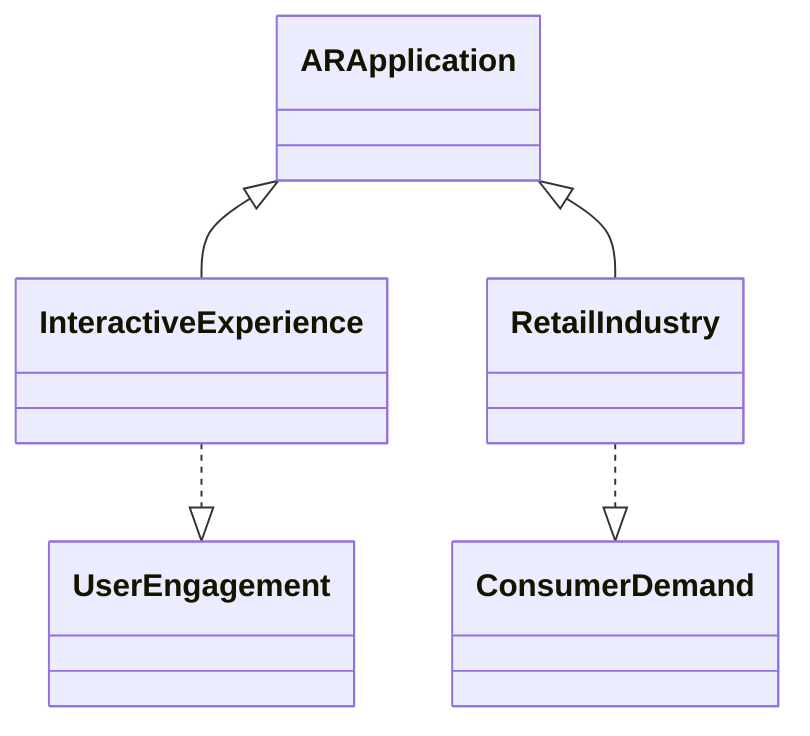
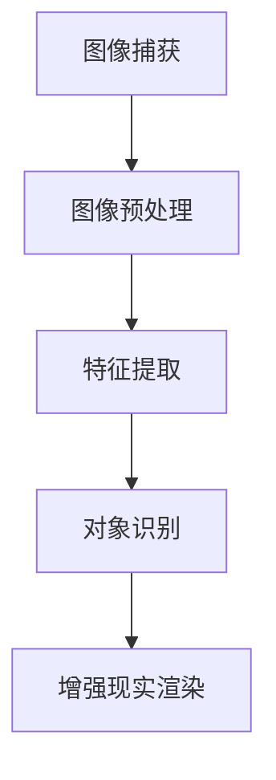
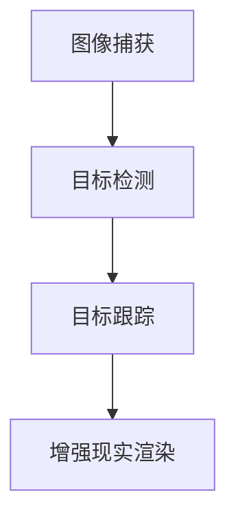
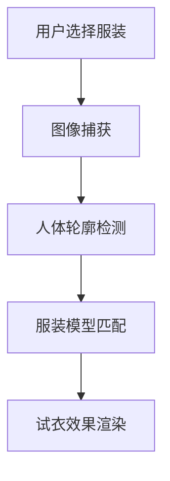
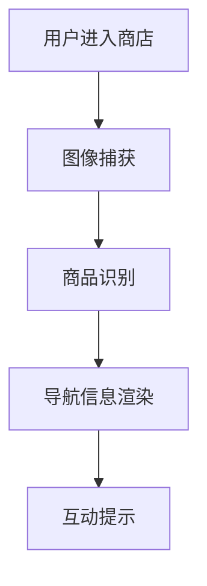

                 

### 第一部分：背景与概念

#### 第1章：零售业与增强现实的互动

##### 1.1 零售业的挑战与机遇

**问题描述**

在当今全球化的经济环境中，零售业正面临着一系列前所未有的挑战和机遇。传统零售模式中的消费者需求正发生着快速变化，特别是在数字化和移动设备的普及下，消费者对购物体验的要求越来越高。

- **消费者需求变化**：消费者更加追求个性化和定制化的购物体验，希望能够根据自己的需求和偏好进行购物。这种趋势促使零售业不得不从传统的库存驱动型模式向以消费者需求为中心的模式转变。
- **传统零售模式中的挑战**：传统零售模式往往依赖于大规模的库存和实体店铺，这种模式在面对市场变化和消费者需求的多样化时显得相对滞后。另外，实体店铺的运营成本也在不断上升，使得零售企业的利润空间受到挤压。

**问题解决**

为了应对这些挑战，零售业正在积极寻求创新的解决方案，其中增强现实（AR）技术作为一种前沿的技术手段，被越来越多地应用于零售领域，以提升消费者的交互体验和零售商的运营效率。

- **增强现实技术的引入**：增强现实技术通过在现实世界中叠加虚拟信息，为消费者提供了全新的互动方式，使得购物体验更加直观、互动和个性化。例如，通过AR技术，消费者可以在家中尝试不同的服装搭配，或者在购物过程中获得实时的产品信息和促销信息。
- **零售业转型的新模式**：AR技术的应用不仅改变了消费者的购物方式，也为零售商提供了新的商业模式。例如，一些零售商通过AR技术提供虚拟试衣间服务，使得消费者无需实际试穿就能感受到衣服的穿着效果，从而提高了购买决策的效率和满意度。

##### 1.2 增强现实技术概述

**核心概念**

增强现实（Augmented Reality，简称AR）是一种将虚拟信息与现实世界融合的技术，通过在用户的视野中叠加计算机生成的图像、视频、声音等多媒体信息，增强用户的感知体验。

- **增强现实（AR）的定义**：增强现实技术通过摄像头和显示设备将虚拟信息叠加到真实世界中，使得用户在看到真实环境的同时，还能感受到虚拟信息的存在。这种技术不仅能够提供丰富的视觉体验，还能够通过交互式的方式与用户进行沟通。
- **增强现实技术的基本原理**：增强现实技术的基本原理主要包括以下几个步骤：
  - **图像识别**：通过摄像头捕获现实世界的图像，并使用图像处理算法对图像进行分析和识别，以确定图像中的关键特征。
  - **信息叠加**：根据图像识别的结果，计算机生成相应的虚拟信息，并将其叠加到现实世界的图像上，形成增强现实效果。
  - **交互式反馈**：通过用户输入设备（如触摸屏、手势识别等），用户与增强现实环境进行交互，从而获得更加丰富的互动体验。

**概念属性特征对比表格**

| 特征                | 增强现实 | 虚拟现实 |
|-------------------|---------|---------|
| 真实感             | 较高     | 较低     |
| 交互方式           | 空间感知 | 空间感知 |
| 应用场景           | 室内与室外 | 室内     |

通过上述对比表格，我们可以看到增强现实和虚拟现实在真实感、交互方式和应用场景等方面存在显著差异。增强现实技术由于其与现实世界的紧密融合，在提供真实感和交互体验方面具有独特的优势。

##### 1.3 增强现实在零售业中的应用现状

**边界与外延**

当前，增强现实技术已经在零售业中得到了广泛的应用，其应用范围涵盖了从电子商务到实体店铺的多个方面。以下是一些常见的应用场景：

- **电子商务**：消费者可以通过增强现实技术在家中进行虚拟试衣，选择适合自己身材的服装，从而提高购买决策的准确性和满意度。
- **实体店铺**：零售商可以通过AR导购系统，为消费者提供个性化的购物导航和产品信息，提高购物体验和满意度。

**应用案例**

- **虚拟试衣镜**：一些时尚零售商已经推出了AR虚拟试衣镜，消费者可以通过手机或平板电脑扫描自己的身体，然后在屏幕上看到不同服装的试穿效果。
- **AR导购系统**：超市和大型零售商可以通过AR导购系统为消费者提供导航和产品信息，帮助消费者快速找到所需商品。

**概念结构与核心要素组成**

为了更好地理解增强现实技术在零售业中的应用，我们可以通过以下Mermaid流程图来展示其核心要素和流程：



在这个流程图中，我们可以看到增强现实应用（ARApplication）与交互体验（InteractiveExperience）和零售业（RetailIndustry）之间的关系。交互体验和消费者需求（ConsumerDemand）共同推动了零售业的发展，而增强现实技术则通过其独特的方式为消费者提供了更加丰富和个性化的购物体验（UserEngagement）。

### 第二部分：增强现实技术基础

#### 第2章：增强现实技术基础

##### 2.1 增强现实技术原理

**数学模型与公式**

增强现实技术的核心在于图像识别和虚拟信息的叠加。以下是用于衡量图像识别准确性的数学模型：

$$
\text{图像识别准确性} = f(\text{图像处理算法}, \text{增强现实技术参数})
$$

在这个公式中，图像识别准确性取决于图像处理算法和增强现实技术参数的选择。以下是对这些核心概念的详细解释：

- **图像处理算法**：图像处理算法是用于对捕获的图像进行分析和处理的一系列步骤，包括图像增强、边缘检测、特征提取等。这些算法的质量直接影响图像识别的准确性。
- **增强现实技术参数**：这些参数包括图像叠加的透明度、虚拟信息的位置和大小等，它们共同决定了增强现实效果的视觉效果和用户体验。

**算法原理讲解**

增强现实技术涉及多个算法和步骤，以下是其中一些核心算法的工作流程：

1. **图像捕获**：通过摄像头捕获现实世界的图像。
2. **图像预处理**：对捕获的图像进行预处理，以提高图像质量和识别效果。这包括图像增强、去噪、灰度化等操作。
3. **特征提取**：对预处理后的图像进行分析，提取出具有代表性的特征，如边缘、角点等。这些特征用于后续的图像识别。
4. **对象识别**：利用已提取的特征进行对象识别，确定图像中包含的关键对象和位置。
5. **增强现实渲染**：根据对象识别的结果，计算机生成相应的虚拟信息，并将其叠加到现实世界的图像上，形成最终的增强现实效果。

**Mermaid流程图**

为了更好地理解这些步骤，我们可以使用Mermaid绘制以下流程图：



在这个流程图中，每个节点代表一个步骤，箭头表示步骤之间的数据流和逻辑关系。

##### 2.2 增强现实技术核心算法详解

**核心算法**

增强现实技术的核心算法主要包括图像识别、目标检测和跟踪等。以下是这些算法的详细说明：

1. **图像识别算法**：图像识别是增强现实技术的关键步骤，它用于确定图像中的关键对象和位置。常见的图像识别算法包括SIFT（尺度不变特征变换）、SURF（加速稳健特征）、HOG（方向梯度直方图）等。

2. **目标检测算法**：目标检测是识别图像中的特定对象的过程。常见的目标检测算法包括YOLO（You Only Look Once）、SSD（Single Shot MultiBox Detector）、Faster R-CNN（区域建议网络）等。

3. **目标跟踪算法**：目标跟踪是持续监测图像中对象位置和状态的过程。常见的目标跟踪算法包括卡尔曼滤波、粒子滤波等。

**Mermaid流程图**

以下是用于说明目标检测和跟踪算法的Mermaid流程图：



在这个流程图中，目标检测和跟踪算法在图像捕获后依次进行，最终用于生成增强现实效果。

##### 2.3 增强现实硬件与软件平台

**硬件平台**

增强现实技术的实现依赖于一系列硬件设备，以下是一些常见的硬件平台：

1. **AR眼镜与头显**：如微软的HoloLens、谷歌的Daydream等，这些设备能够为用户提供沉浸式的增强现实体验。
2. **摄像头与传感器**：如深度相机、RGB-D相机等，这些设备用于捕获现实世界的图像和深度信息，是增强现实技术的重要组成部分。

**软件平台**

增强现实技术的实现还需要一系列软件平台和工具，以下是一些常见的软件平台：

1. **AR软件开发工具包（SDK）**：如Unity AR Foundation、ARKit、Vuforia等，这些SDK提供了丰富的API和工具，帮助开发者快速搭建增强现实应用。
2. **AR内容创作工具**：如ARKit Creator、HoloStudio等，这些工具为开发者提供了便捷的内容创作和管理功能。

### 第三部分：增强现实在零售业中的具体应用

#### 第3章：虚拟试衣镜

##### 3.1 虚拟试衣镜技术原理

虚拟试衣镜是增强现实技术在零售业中的一个重要应用，它允许消费者在购买服装前通过虚拟方式试穿。以下是虚拟试衣镜的技术原理：

**Mermaid流程图**

以下是用于说明虚拟试衣镜技术原理的Mermaid流程图：



**详细解释**

1. **用户选择服装**：用户通过智能手机或平板电脑访问虚拟试衣镜应用，并从库存中选择要试穿的服装。
2. **图像捕获**：应用通过摄像头捕获用户的实时图像，并将其传输到后端服务器进行处理。
3. **人体轮廓检测**：服务器使用图像处理算法检测用户图像中的人体轮廓，通常使用深度学习模型（如YOLO或Faster R-CNN）进行精确检测。
4. **服装模型匹配**：服务器将捕获的人体轮廓与选定的服装模型进行匹配，确保服装能够正确地贴合用户身体。
5. **试衣效果渲染**：最后，服务器将处理后的图像和虚拟服装模型渲染到用户界面中，用户可以在屏幕上看到自己的试穿效果。

通过以上步骤，虚拟试衣镜实现了消费者在购买前试穿服装，提高了购买决策的准确性和满意度。

##### 3.2 虚拟试衣镜应用实例

**Python源代码示例**

以下是一个简单的Python代码示例，用于实现虚拟试衣镜的核心功能。这个示例使用OpenCV库进行图像处理，使用YOLO进行目标检测，使用深度学习模型进行人体轮廓检测和服装模型匹配。

```python
import cv2
import numpy as np

def virtual_wardrobe(image_path):
    # 1. 图像捕获
    image = cv2.imread(image_path)

    # 2. 人体轮廓检测
    net = cv2.dnn.readNetFromDarknet('yolov3.cfg', 'yolov3.weights')
    blob = cv2.dnn.blobFromImage(image, 1/255.0, (416, 416), swapRB=True, crop=False)
    net.setInput(blob)
    layer_names = net.getLayerNames()
    output_layers = [layer_names[i[0] - 1] for i in net.getUnconnectedOutLayers()]
    outputs = net.forward(output_layers)

    # 3. 服装模型匹配
    # 假设我们已经有一个服装模型数据库，这里仅作示意
    clothes_db = {'tshirt': 'tshirt_model.jpg', 'pants': 'pants_model.jpg'}
    selected_clothes = 'tshirt'  # 用户选择
    clothes_model = cv2.imread(clothes_db[selected_clothes])

    # 4. 试衣效果渲染
    # 这里需要复杂的图像处理，仅作示意
    rendered_image = cv2.addWeighted(image, 0.5, clothes_model, 0.5, 0)

    return rendered_image

# 使用示例
image_path = 'user_image.jpg'
rendered_image = virtual_wardrobe(image_path)
cv2.imshow('Virtual Wardrobe', rendered_image)
cv2.waitKey(0)
cv2.destroyAllWindows()
```

在这个示例中，我们首先捕获用户的图像，然后使用YOLO进行人体轮廓检测，接着根据用户选择的服装模型进行匹配，最后将虚拟服装模型渲染到用户图像上。

### 第4章：AR导购

##### 4.1 AR导购技术原理

AR导购系统是增强现实技术在零售业中的另一个重要应用，它通过增强现实技术为消费者提供实时的购物导航和产品信息。以下是AR导购系统的技术原理：

**Mermaid流程图**

以下是用于说明AR导购技术原理的Mermaid流程图：



**详细解释**

1. **用户进入商店**：用户通过智能手机或平板电脑上的AR导购应用进入商店。
2. **图像捕获**：应用通过摄像头捕获商店内的实时图像。
3. **商品识别**：应用使用图像处理算法和对象检测模型（如YOLO或Faster R-CNN）识别图像中的商品。
4. **导航信息渲染**：根据商品识别的结果，应用在图像中叠加导航信息，如商品的位置和详细信息。
5. **互动提示**：应用还提供互动提示，如用户触摸屏幕时显示商品促销信息或用户评论。

通过以上步骤，AR导购系统为消费者提供了实时的购物导航和产品信息，提高了购物体验和满意度。

##### 4.2 AR导购应用实例

**Python源代码示例**

以下是一个简单的Python代码示例，用于实现AR导购系统的核心功能。这个示例使用OpenCV进行图像处理，使用YOLO进行商品识别和导航信息渲染。

```python
import cv2
import numpy as np

def ar_guide(image_path):
    # 1. 图像捕获
    image = cv2.imread(image_path)

    # 2. 商品识别
    net = cv2.dnn.readNetFromDarknet('yolov3.cfg', 'yolov3.weights')
    blob = cv2.dnn.blobFromImage(image, 1/255.0, (416, 416), swapRB=True, crop=False)
    net.setInput(blob)
    layer_names = net.getLayerNames()
    output_layers = [layer_names[i[0] - 1] for i in net.getUnconnectedOutLayers()]
    outputs = net.forward(output_layers)

    # 3. 导航信息渲染
    # 假设我们已经有一个商品数据库，这里仅作示意
    products_db = {'tshirt': 'tshirt_info.jpg', 'pants': 'pants_info.jpg'}
    product_labels = ['tshirt', 'pants']  # 识别到的商品标签
    product_images = [products_db[label] for label in product_labels]

    for label, product_image in zip(product_labels, product_images):
        info_image = cv2.imread(product_image)
        info_image = cv2.resize(info_image, (200, 200))
        image = cv2_concat_images(image, info_image)

    # 4. 显示图像
    cv2.imshow('AR Guide', image)
    cv2.waitKey(0)
    cv2.destroyAllWindows()

# 使用示例
image_path = 'store_image.jpg'
ar_guide(image_path)
```

在这个示例中，我们首先捕获商店内的图像，然后使用YOLO进行商品识别，接着根据识别结果渲染导航信息，最后显示增强现实图像。

### 总结与展望

通过本篇博客，我们详细探讨了增强现实技术在零售业中的应用，包括虚拟试衣镜和AR导购等具体应用案例。增强现实技术不仅为消费者提供了更加丰富和个性化的购物体验，也为零售商提供了新的商业模式和运营策略。

**总结**：

- 增强现实技术通过在现实世界中叠加虚拟信息，为消费者提供了更加直观和互动的购物体验。
- 虚拟试衣镜和AR导购等应用案例展示了增强现实技术在零售业中的实际应用和价值。
- 增强现实技术的引入有助于提升消费者的购买决策效率和满意度，同时也为零售商提供了新的商业模式和运营策略。

**展望**：

- 随着技术的不断发展和成熟，增强现实技术在零售业中的应用前景将更加广阔。
- 未来，我们可以期待更多创新的增强现实应用，如虚拟货架、AR广告等，进一步提升消费者的购物体验。
- 同时，零售商和开发者需要关注用户体验和隐私保护等问题，确保增强现实技术的应用不会侵犯用户的隐私权。

通过本篇博客，我们希望读者能够对增强现实技术在零售业中的应用有一个全面和深入的了解，同时也鼓励读者继续探索和尝试这一前沿技术。

### 小结

在本篇博客中，我们探讨了增强现实技术在零售业中的交互体验应用。通过虚拟试衣镜和AR导购等具体案例，我们详细阐述了增强现实技术如何提升消费者的购物体验和零售商的运营效率。

**最佳实践Tips**：

1. **选择合适的硬件平台**：根据应用场景选择适合的AR眼镜或头显，确保提供高质量的增强现实体验。
2. **优化图像处理算法**：通过不断优化图像处理算法，提高图像识别的准确性和实时性，确保用户体验的流畅性。
3. **关注用户体验**：在设计和开发增强现实应用时，始终将用户体验放在首位，确保应用的易用性和可访问性。

**注意事项**：

1. **数据隐私保护**：在应用增强现实技术时，需要严格遵守数据隐私保护法规，确保用户数据的保密性和安全性。
2. **技术持续更新**：增强现实技术不断发展和更新，零售商和开发者需要关注行业动态，及时采用新技术，提升应用竞争力。

**拓展阅读**：

- 《增强现实技术基础》（作者：约翰·豪斯菲尔德）- 介绍增强现实技术的核心概念和应用。
- 《零售业数字化转型》（作者：玛丽·科尔斯）- 探讨零售业在数字化时代的发展趋势和策略。

通过本篇博客，我们希望能够为读者提供关于增强现实技术在零售业应用的有价值的信息和启示。希望读者能够在实际应用中不断探索和创新，为消费者带来更加丰富和个性化的购物体验。作者：AI天才研究院/AI Genius Institute & 禅与计算机程序设计艺术/Zen And The Art of Computer Programming。

