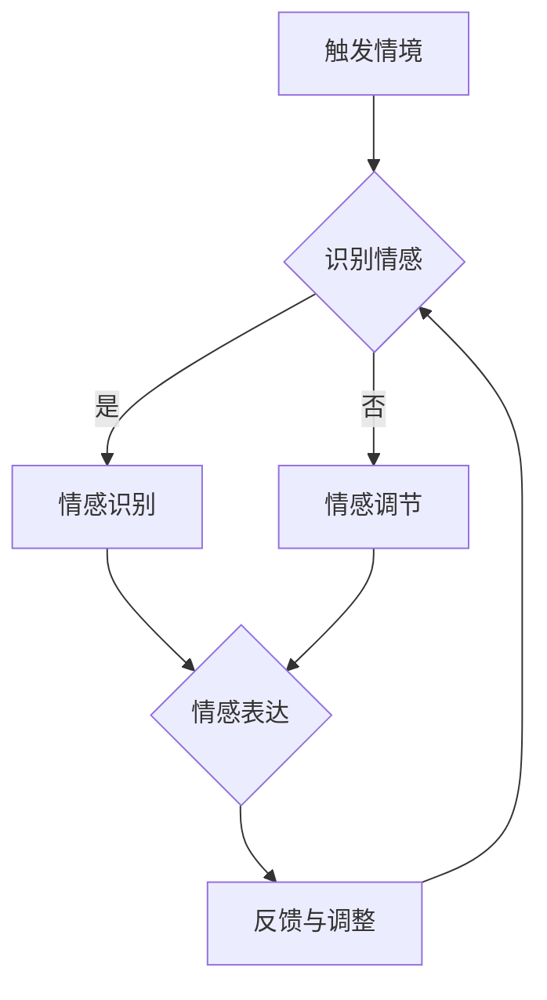
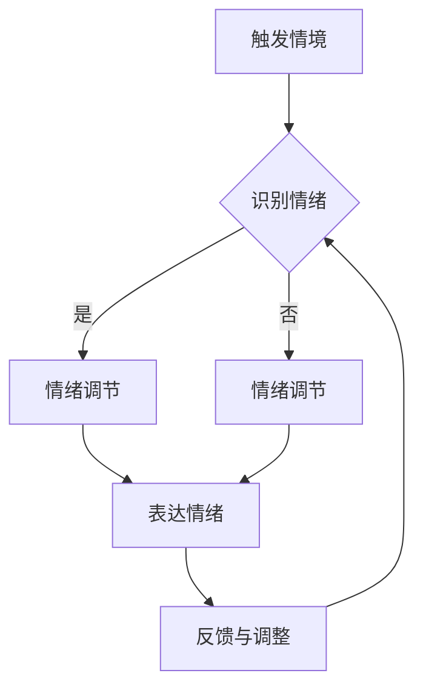
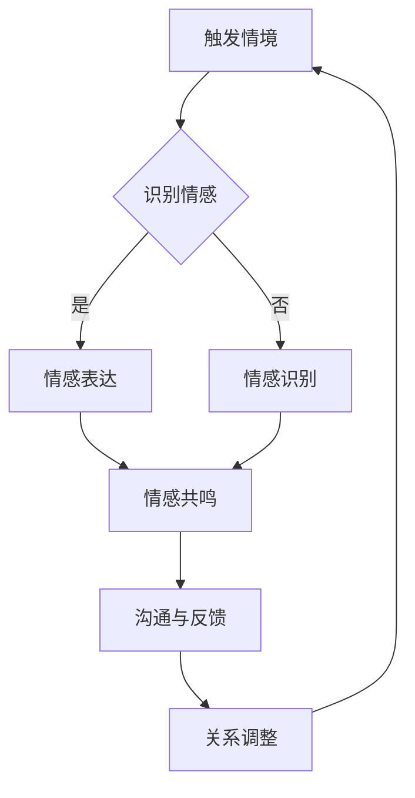
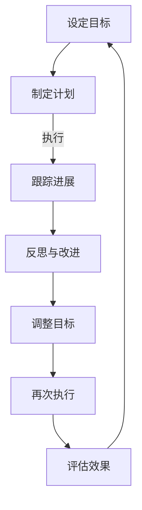

                 

## 引言：探寻情感深度的意义

### 1.1 书籍背景与目的

在快节奏的现代生活中，人们常常感到压力重重，情感需求被忽视。本书旨在帮助读者重新审视自己的情感世界，通过一系列科学的方法和技巧，提升情感认知，改善心理状态，建立健康的人际关系，最终实现情感深度丰富的人生。《增添生活的温度：构建情感深度丰富的人生》以情感心理学为基础，结合实际生活中的案例和实用技巧，为广大读者提供了一本既有理论深度，又具操作性的指南。

### 1.2 读者对象与期望收获

本书适合所有希望提升生活质量、改善情感状态的人群，包括但不限于职场人士、学生、家庭主妇以及心理健康工作者。通过阅读本书，读者可以：
- 深入理解情感的本质和作用。
- 学会识别、表达和调节自己的情感。
- 建立积极的心理状态，提高抗压能力。
- 改善人际关系，增进社交技巧。
- 提升生活质量，拥有更加丰富和满足的人生体验。

### 1.3 本书结构安排

本书共分为七个主要章节，每个章节都有明确的主题和目标，结构安排如下：

1. **引言：探寻情感深度的意义** - 介绍书籍的背景、目的和读者对象。
2. **情感认知：感知生活的温度** - 探讨情感认知的重要性，提供方法和技巧。
3. **心理调适：管理情绪的技巧** - 讲解情绪管理的基础、策略和实践。
4. **人际关系：情感交流的艺术** - 分析人际关系的重要性，分享情感交流的技巧。
5. **生活品质：提升幸福感的策略** - 提供提升生活质量的策略和方法。
6. **职场情感：情感效能的提升** - 讨论职场中情感处理的方法和技巧。
7. **情感成长：走向自我实现** - 提供情感成长的方法和路径。

每个章节都通过具体的案例、实践和深入分析，帮助读者逐步理解和掌握相关技能，最终实现情感深度的提升。

## 情感认知：感知生活的温度

### 2.1 情感认知的重要性

情感认知是指个体识别、理解和表达自身情感的能力。在心理学中，情感认知被认为是一个人心理健康的重要组成部分，它直接影响个体的生活质量和社会交往。以下是情感认知在生活中的几个关键作用：

#### 情感认知与情绪调节

首先，情感认知有助于个体更好地调节情绪。当人们能够准确识别和理解自己的情感状态时，他们就更容易采取有效的策略来管理这些情绪，避免情绪失控。例如，当一个人感受到焦虑时，通过情感认知，他们可以识别出焦虑的来源，并采取深呼吸、放松训练等方法来缓解焦虑。

#### 情感认知与人际关系

其次，情感认知对于建立和维护健康的人际关系至关重要。通过情感认知，人们可以更好地理解他人的情感状态，从而更有效地进行沟通和交流。例如，在沟通中，通过识别对方的情感表达，人们可以调整自己的沟通方式，使其更加贴近对方的需求，从而建立更深层次的连接。

#### 情感认知与生活质量

最后，情感认知对提升生活质量有显著影响。一个具备良好情感认知能力的人，能够更好地享受生活中的美好时刻，也能够更好地应对生活中的挑战。他们能够从日常小事中找到乐趣，拥有更高的生活满意度和幸福感。

### 2.2 情感认知的方法与技巧

要提升情感认知能力，可以采取以下几种方法和技巧：

#### 自我观察与反思

自我观察是情感认知的基础。通过定期记录自己的情感体验，人们可以更加清晰地识别和理解自己的情感。反思则是将情感体验转化为洞察和知识的重要步骤。通过反思，人们可以深入分析情感的起因和影响，从而更好地掌握情感认知技巧。

#### 情感识别与表达

情感识别是指识别自己和他人的情感状态。这一能力可以通过多种方式培养，例如观察他人的表情、语调和行为，以及通过阅读情感相关的书籍和参加情感认知课程。情感表达则是将情感准确地传达给他人。良好的情感表达能力有助于减少误解和冲突，增进人际关系的和谐。

#### 情感调节与疏导

情感调节是指管理自己的情绪，使其保持在健康范围内。调节情感的方法包括深呼吸、放松训练、认知重构等。疏导情感则是通过倾诉、写日记或进行心理咨询等方式，释放内心的负面情绪，从而减轻情感压力。

### 2.3 情感认知实践

为了更好地掌握情感认知技巧，以下是一些具体的实践方法：

#### 情感日记的撰写

情感日记是一种有效的自我观察和反思工具。通过定期记录自己的情感体验，人们可以更加清晰地了解自己的情感状态，并从中获得洞察和启示。情感日记的撰写可以分为以下几个步骤：

1. **日期与时间**：记录情感体验发生的具体日期和时间。
2. **情境描述**：描述触发情感的具体情境，包括地点、人物和事件。
3. **情感识别**：识别自己当时所体验的情感，并尽可能详细地描述这种情感的感觉和表现。
4. **反思与思考**：反思这种情感对个人生活的影响，以及可能的改善方法。

#### 情感分享与讨论

情感分享与讨论是一种重要的社交技巧，有助于增强情感认知。通过与他人分享自己的情感体验，人们可以获得不同的视角和反馈，从而更好地理解和处理自己的情感。情感分享的步骤如下：

1. **选择合适的人**：选择可以信任和愿意倾听的人。
2. **准备与分享**：在分享之前，准备自己的情感体验，并确定想要传达的信息。
3. **倾听与反馈**：在分享过程中，倾听对方的反馈，并对其提供积极的反馈。
4. **总结与反思**：在讨论结束后，总结讨论的内容，并反思自己如何应用这些反馈来提升情感认知。

### 2.4 情感认知的挑战与应对

尽管情感认知对个人发展至关重要，但在实践中仍会面临一系列挑战。以下是一些常见的挑战和应对策略：

#### 常见情感认知误区

误区1：过度分析

有些人在尝试提升情感认知时，会陷入过度分析的陷阱，试图用理性思维来理解情感。这种方法往往导致情感认知的困难和情感的压抑。应对策略：尝试接受情感的复杂性，允许自己体验和表达情感，而不是过度分析。

误区2：情感否认

一些人倾向于否认自己的情感，认为表达情感是软弱的表现。这种态度会阻碍情感认知的发展。应对策略：认识到情感是人的自然反应，每个人都有表达情感的权利，学会坦然面对和表达自己的情感。

#### 情感认知的难题与解决策略

难题1：情感冲突

当个人同时体验多种情感时，可能会产生情感冲突，导致情绪困扰。应对策略：通过情感认知技巧，如自我观察和情感调节，识别冲突的情感，并找到平衡点。

难题2：社交焦虑

社交焦虑是情感认知中的一个常见问题，可能导致人际关系的障碍。应对策略：通过情感认知和实践，增强自信，学习有效的沟通技巧，减少社交焦虑的影响。

### 2.5 情感认知的Mermaid流程图

为了更好地理解情感认知的过程，我们可以使用Mermaid绘制一个简单的流程图。以下是一个情感认知的Mermaid流程图示例：

在这个流程图中，触发情境导致情感的产生，个体通过情感识别和理解情感，然后进行情感表达和调整，最终得到反馈，进一步优化情感认知过程。

## 心理调适：管理情绪的技巧

### 3.1 情绪管理的基础

情绪管理是情感深度丰富的重要环节，它关乎个体的心理健康和生活质量。情绪管理的基础在于理解情绪的类型和特点，以及如何通过有效的策略来调节情绪。

#### 情绪的类型与特点

情绪可以分为基本情绪和复杂情绪。基本情绪包括快乐、愤怒、悲伤、恐惧和惊讶等，它们是人类共有的基本情感体验。复杂情绪则是由基本情绪的组合或演变而来，如羞愧、焦虑、厌恶和挫败感等。

每种情绪都有其独特的生理和心理特征。例如，愤怒通常伴随着紧张和攻击性行为，悲伤则可能导致情绪低落和失去活力，而恐惧则会引发逃避行为或战或逃反应。

#### 情绪管理的目标

情绪管理的核心目标是提升个体的情感智力，使其能够更加理性地应对各种情绪刺激，保持心理平衡。具体来说，情绪管理的目标包括：

1. **情绪识别**：能够准确识别和理解自己的情绪状态。
2. **情绪表达**：能够以适当的方式表达情绪，避免负面情绪的积累和爆发。
3. **情绪调节**：能够通过有效的方法调节情绪，使其保持在健康范围内。
4. **情绪适应**：能够适应不同的情绪情境，保持心理弹性。

### 3.2 情绪调节的策略

情绪调节的策略多种多样，以下是一些常见的情绪调节方法：

#### 深呼吸与放松训练

深呼吸是一种简单而有效的情绪调节方法。通过深呼吸，可以降低心跳和血压，减少紧张和焦虑。放松训练则包括渐进性肌肉放松、瑜伽和冥想等，这些方法有助于放松身体和心理，减轻情绪压力。

#### 认知重构与积极思维

认知重构是一种心理技巧，通过改变对情境的看法和解释，来调节情绪。例如，当面临失败时，通过认知重构，可以将注意力从失败本身转移到从失败中获得的教训和经验上，从而减少负面情绪。

积极思维也是一种有效的情绪调节策略。通过培养积极思维习惯，如感恩、乐观和自我肯定，可以帮助个体更好地应对压力和挑战。

#### 焦点转移与时间管理

焦点转移是指将注意力从负面情绪转移到其他事物上，以减少情绪困扰。时间管理则是通过合理安排时间，避免过度焦虑和压力。例如，通过设定合理的目标和优先级，可以有效减少拖延和焦虑。

### 3.3 情绪调节的实践

为了更好地掌握情绪调节技巧，可以采取以下实践方法：

#### 情绪调节日记的记录

情绪调节日记是一种有效的实践工具，通过记录自己的情绪状态、触发情境和应对策略，可以帮助个体更好地理解和调节情绪。以下是情绪调节日记的记录步骤：

1. **日期与时间**：记录情绪体验发生的具体日期和时间。
2. **情境描述**：描述触发情绪的具体情境，包括地点、人物和事件。
3. **情绪状态**：记录当时所体验的主要情绪，如愤怒、悲伤或焦虑等。
4. **应对策略**：记录采取的应对策略，如深呼吸、认知重构或焦点转移等。
5. **效果评估**：评估应对策略的有效性，并记录反馈和改进意见。

#### 情绪调节小组的组建

情绪调节小组是一种社交支持的形式，通过与他人分享情绪体验和应对策略，可以获得不同的视角和建议，从而提高情绪调节能力。组建情绪调节小组的步骤如下：

1. **寻找伙伴**：寻找信任的朋友或同事，共同参与情绪调节实践。
2. **定期交流**：设定固定的时间进行交流，分享各自的情绪体验和应对策略。
3. **相互支持**：在交流中，互相鼓励和支持，共同面对情绪挑战。
4. **反馈与改进**：在交流结束后，提供反馈和改进意见，帮助彼此更好地调节情绪。

### 3.4 情绪管理的挑战与应对

情绪管理过程中，个体可能会面临各种挑战，以下是一些常见挑战和应对策略：

#### 情绪暴发的处理

情绪暴发是指在特定情境下，情绪失控并表现出攻击性或消极行为。处理情绪暴发的方法包括：

1. **冷静下来**：在情绪暴发时，首先尝试冷静下来，通过深呼吸或离开现场来降低情绪。
2. **反思原因**：冷静下来后，反思情绪暴发的原因，寻找解决问题的方法。
3. **表达情绪**：在适当的时候，通过合理的方式表达情绪，如与信任的人倾诉或写日记。

#### 情绪依赖的克服

情绪依赖是指个体过度依赖某些情绪，如焦虑或兴奋，来满足心理需求。克服情绪依赖的方法包括：

1. **认知重构**：通过改变对情境的看法和解释，减少对特定情绪的依赖。
2. **替代活动**：找到其他活动或兴趣来替代依赖的情绪，如运动、绘画或阅读等。
3. **心理治疗**：寻求专业心理治疗帮助，如认知行为疗法或情绪调节疗法。

### 3.5 情绪调节的Mermaid流程图

为了更好地理解情绪调节的过程，我们可以使用Mermaid绘制一个简单的流程图。以下是一个情绪调节的Mermaid流程图示例：

在这个流程图中，触发情境导致情绪的产生，个体通过情绪识别和调节，然后表达情绪，并得到反馈，最终实现情绪的平衡和管理。

### 人际关系：情感交流的艺术

#### 4.1 人际关系的重要性

人际关系是情感深度丰富的重要基石，它关乎个体的社交满足感和心理健康。健康的人际关系能够带来支持、理解和幸福感，反之，不良的人际关系则可能导致孤独、焦虑和情感困扰。

人际关系的重要性体现在以下几个方面：

1. **社交支持**：良好的人际关系可以提供社交支持，帮助个体在困难时刻获得帮助和鼓励。
2. **情感共鸣**：通过人际关系，个体可以与他人建立深厚的情感联系，分享快乐和悲伤，获得情感共鸣。
3. **自我认知**：与他人互动的过程中，个体可以更好地了解自己的需求和情感，从而促进自我成长。
4. **心理健康**：良好的人际关系有助于降低压力水平，提高心理韧性，促进心理健康。

#### 4.2 情感交流的技巧

情感交流是人际关系中至关重要的环节，它关乎信息的准确传递和情感的深度沟通。以下是一些提升情感交流技巧的方法：

##### 倾听与表达

倾听是情感交流的基础。通过倾听，个体可以更好地理解对方的情感和需求，从而做出更合适的回应。以下是一些建议：

1. **专注聆听**：在交流过程中，保持注意力集中，避免分心。
2. **情感共鸣**：尝试从对方的角度理解情感，表达同情和理解。
3. **非语言沟通**：通过肢体语言、面部表情和语调变化，传达关注和理解。

表达则是将自身的情感准确地传达给他人。以下是一些建议：

1. **清晰表达**：使用简单明了的语言表达自己的情感和想法。
2. **情感诚实**：诚实地表达自己的情感，避免压抑或掩饰。
3. **适度表达**：避免过度表达，以免造成对方的困扰或压力。

##### 非语言沟通

非语言沟通在情感交流中扮演着重要角色。它包括肢体语言、面部表情、语调和触摸等。以下是一些提升非语言沟通技巧的方法：

1. **肢体语言**：保持开放的姿势，避免交叉双臂或紧握拳头等防御性姿态。
2. **面部表情**：通过微笑、眼神交流和表情变化，传达情感和态度。
3. **语调**：通过语速、音量和语调的变化，强调情感和意图。
4. **触摸**：适当的触摸可以表达关心和支持，如轻拍肩膀或握手。

##### 情感冲突的处理

在人际关系中，情感冲突是不可避免的。处理情感冲突的关键在于沟通和理解。以下是一些建议：

1. **冷静下来**：在冲突发生时，先尝试冷静下来，避免情绪失控。
2. **主动沟通**：主动与对方交流，表达自己的感受和需求。
3. **倾听对方**：认真倾听对方的观点和感受，避免打断或评判。
4. **寻找共识**：通过讨论和妥协，寻找双方都能接受的解决方案。
5. **寻求第三方帮助**：在必要时，可以寻求专业人士或第三方的帮助，以中立的角度处理冲突。

#### 4.3 人际关系的实践

为了更好地掌握情感交流技巧，可以采取以下实践方法：

##### 情感交流训练

情感交流训练是一种通过模拟情境和角色扮演来提升交流技巧的方法。以下是一些步骤：

1. **情境设定**：设定一个具体的交流情境，如家庭聚会或工作讨论。
2. **角色分配**：参与者分为两个角色，一个扮演说话者，另一个扮演倾听者。
3. **训练过程**：说话者表达情感和想法，倾听者认真倾听并给予反馈。
4. **反馈与改进**：在训练结束后，参与者互相提供反馈，讨论改进方法。

##### 人际关系改善计划

人际关系改善计划是一种通过有意识的行动来提升人际关系的策略。以下是一些步骤：

1. **目标设定**：设定一个具体的人际关系改善目标，如加强与朋友的联系或改善与同事的关系。
2. **行动计划**：制定具体的行动计划，包括交流频率、交流方式和交流内容。
3. **执行与跟踪**：按照行动计划执行，并定期跟踪进展和效果。
4. **评估与调整**：在计划执行过程中，评估效果，并根据实际情况进行调整。

##### 情感分享与讨论小组

情感分享与讨论小组是一种通过集体交流来提升情感交流技巧的方法。以下是一些步骤：

1. **组建小组**：邀请信任的朋友或同事组成小组。
2. **固定时间**：设定固定的时间进行交流，确保参与者有充足的时间。
3. **主题讨论**：每次讨论一个具体的主题，如情感表达或冲突处理。
4. **轮流发言**：每位参与者轮流分享自己的情感体验和想法。
5. **反馈与支持**：在分享结束后，提供反馈和支持，帮助彼此提升情感交流技巧。

#### 4.4 人际关系的挑战与应对

在人际关系中，个体可能会面临各种挑战。以下是一些常见的挑战和应对策略：

##### 社交焦虑

社交焦虑是人际关系中的一个常见问题，可能导致个体在社交场合中感到紧张和不安。以下是一些应对策略：

1. **逐步暴露**：逐渐增加社交情境的难度，从与熟悉的人交流开始，逐渐扩展到与陌生人交流。
2. **认知重构**：通过改变对社交场合的看法和解释，减少社交焦虑的影响。
3. **放松训练**：通过深呼吸、渐进性肌肉放松等方法，减轻社交焦虑。

##### 人际冲突

人际冲突是人际关系中的常态，但如何处理冲突是一个挑战。以下是一些应对策略：

1. **冷静处理**：在冲突发生时，先冷静下来，避免情绪失控。
2. **有效沟通**：通过倾听和表达，建立有效的沟通渠道，理解对方的需求和感受。
3. **寻求共识**：通过讨论和妥协，寻找双方都能接受的解决方案。
4. **寻求第三方帮助**：在必要时，可以寻求专业人士或第三方的帮助，以中立的角度处理冲突。

#### 4.5 人际关系的Mermaid流程图

为了更好地理解人际关系中的情感交流过程，我们可以使用Mermaid绘制一个简单的流程图。以下是一个人际关系中的情感交流Mermaid流程图示例：

在这个流程图中，触发情境导致情感的产生，个体通过情感识别和表达，与他人建立情感共鸣，通过沟通与反馈调整关系，最终实现人际关系的优化。

### 生活品质：提升幸福感的策略

#### 5.1 生活品质的定义与重要性

生活品质是指个体在日常生活中所体验到的幸福感和满足感。它不仅关乎物质条件，还涉及心理、社会和环境等多个方面。提升生活品质是每个人追求的目标，因为它直接影响个体的幸福感和生活质量。

生活品质的重要性体现在以下几个方面：

1. **心理健康**：高品质的生活能够提供心理上的安全感、满足感和幸福感，有助于减少焦虑和抑郁等心理问题。
2. **社会关系**：良好的生活品质有助于建立和维护健康的人际关系，增强社交支持。
3. **身体健康**：高品质的生活包括良好的饮食习惯、适度的锻炼和充足的休息，这些都对身体健康有益。
4. **职业成就**：高品质的生活能够为职业发展提供良好的基础，增强个人的自信心和成就感。

#### 5.2 提升生活质量的策略

为了提升生活品质，可以采取以下策略：

##### 健康饮食

健康饮食是提升生活品质的基础。以下是一些建议：

1. **多样化饮食**：摄入多种食物，确保营养均衡。
2. **适量饮食**：控制食物摄入量，避免过度饮食。
3. **减少加工食品**：减少加工食品和含糖食品的摄入，增加新鲜蔬果的比例。

##### 适量运动

适量运动有助于保持身体健康和心理愉悦。以下是一些建议：

1. **规律运动**：每周至少进行150分钟的中等强度运动，如快走、游泳或骑自行车。
2. **多样化运动**：尝试不同的运动形式，如瑜伽、健身或跑步，以保持兴趣和动力。
3. **家庭运动**：与家人一起进行运动，增加家庭互动和幸福感。

##### 管理时间

时间管理是提升生活品质的关键。以下是一些建议：

1. **制定计划**：每天或每周制定计划，明确目标和任务。
2. **优先排序**：将任务按照重要性和紧急性进行排序，优先处理重要且紧急的任务。
3. **避免拖延**：设定具体的时间表，避免拖延，提高工作效率。

##### 心理调适

心理调适是提升生活品质的重要方面。以下是一些建议：

1. **放松技巧**：学习放松技巧，如深呼吸、冥想或瑜伽，减轻压力和焦虑。
2. **积极心态**：培养积极心态，关注生活中的积极方面，减少负面情绪。
3. **自我反思**：定期进行自我反思，了解自己的需求和价值观，调整生活方式。

##### 社交互动

社交互动是提升生活品质的重要因素。以下是一些建议：

1. **积极参与**：积极参与社区活动、兴趣爱好小组或社交俱乐部，扩大社交圈子。
2. **倾听他人**：倾听他人的需求和感受，建立互信和友谊。
3. **分享经验**：与他人分享自己的经验和知识，增强社交互动的质量。

##### 环境改善

环境改善是提升生活品质的另一个重要方面。以下是一些建议：

1. **家庭装修**：对家庭环境进行适当的装修和布置，创造舒适和温馨的氛围。
2. **绿色空间**：增加绿色植物，创造自然和清新的环境。
3. **清洁与整理**：定期清洁和整理家庭和工作环境，保持整洁和有序。

#### 5.3 提升生活质量的实践

为了更好地提升生活质量，可以采取以下实践方法：

##### 生活质量提升计划

生活质量提升计划是一种通过有意识的行为来改善生活品质的方法。以下是一些步骤：

1. **目标设定**：设定具体的生活质量提升目标，如健康饮食、适量运动或减少压力等。
2. **行动计划**：制定具体的行动计划，包括具体的目标、实现方法和时间表。
3. **执行与跟踪**：按照行动计划执行，并定期跟踪进展和效果。
4. **评估与调整**：在计划执行过程中，评估效果，并根据实际情况进行调整。

##### 生活品质提升日记

生活品质提升日记是一种记录和反思生活质量的方法。以下是一些步骤：

1. **记录日常**：记录每天的饮食、运动、心理调适和社交互动等方面的情况。
2. **反思与改进**：定期反思自己的生活品质，找出需要改进的地方，并制定改进计划。
3. **目标调整**：根据反思和改进的情况，调整生活质量提升目标，使其更加符合实际需求。

##### 生活品质提升小组

生活品质提升小组是一种通过集体交流和分享来提升生活质量的方法。以下是一些步骤：

1. **组建小组**：邀请志同道合的朋友或同事组成小组。
2. **定期交流**：设定固定的时间进行交流，分享各自的生活质量提升经验和技巧。
3. **相互支持**：在交流中，互相鼓励和支持，共同面对生活品质提升的挑战。
4. **反馈与改进**：在交流结束后，提供反馈和改进意见，帮助彼此提升生活品质。

#### 5.4 生活品质提升的Mermaid流程图

为了更好地理解提升生活品质的过程，我们可以使用Mermaid绘制一个简单的流程图。以下是一个生活品质提升的Mermaid流程图示例：

在这个流程图中，设定目标后，通过制定计划、执行、跟踪进展、反思与改进、调整目标，并再次执行，最终实现生活品质的提升。

### 职场情感：情感效能的提升

#### 6.1 职场情感的重要性

职场情感是指个体在工作环境中体验到的情感状态，包括工作满意度、压力水平、团队合作和领导关系等。职场情感对个人和组织的效能有着重要影响。

职场情感的重要性体现在以下几个方面：

1. **工作效率**：积极的职场情感可以提高工作效率和生产力，减少错误和失误。
2. **团队合作**：良好的职场情感有助于建立和谐的人际关系，增强团队合作和沟通效果。
3. **员工满意度**：职场情感直接影响员工的工作满意度和忠诚度，从而影响组织的稳定性和发展。
4. **领导效能**：有效的领导需要良好的职场情感管理能力，以激发员工的潜能和创造力。

#### 6.2 职场情感管理的策略

为了提升职场情感效能，可以采取以下策略：

##### 情绪调节

情绪调节是指通过一系列方法来管理和调整工作中的情绪。以下是一些建议：

1. **深呼吸**：在感到压力或紧张时，尝试进行深呼吸练习，有助于放松身心。
2. **积极思考**：培养积极思考的习惯，关注工作中的成就和进步，减少负面情绪的影响。
3. **认知重构**：通过改变对工作情境的看法和解释，重新评估压力源，从而降低负面情绪。

##### 沟通技巧

沟通技巧在职场情感管理中起着关键作用。以下是一些建议：

1. **倾听**：倾听同事的意见和需求，建立信任和理解，有助于缓解冲突和改善人际关系。
2. **表达**：清晰、准确地表达自己的意见和感受，避免误解和沟通障碍。
3. **非语言沟通**：通过肢体语言、面部表情和语调变化，传达自己的情感和态度。

##### 团队合作

团队合作是职场情感管理的重要方面。以下是一些建议：

1. **共同目标**：确保团队成员有共同的目标和愿景，增强团队凝聚力。
2. **角色分配**：明确每个成员的角色和责任，确保任务分配合理。
3. **相互支持**：在团队工作中，互相支持和鼓励，共同应对挑战。

##### 领导风格

有效的领导风格对职场情感有重要影响。以下是一些建议：

1. **鼓励与支持**：鼓励员工表达自己的意见和感受，提供必要的支持和资源。
2. **公正与透明**：建立公正和透明的管理制度，确保员工的权益和利益。
3. **激励与奖励**：通过适当的激励和奖励机制，激发员工的积极性和创造力。

#### 6.3 职场情感管理的实践

为了更好地掌握职场情感管理技巧，可以采取以下实践方法：

##### 职场情感管理计划

职场情感管理计划是一种通过有意识的行为来提升职场情感效能的方法。以下是一些步骤：

1. **目标设定**：设定具体的职场情感管理目标，如提高工作效率、改善人际关系或增强团队合作。
2. **行动计划**：制定具体的行动计划，包括具体的目标、实现方法和时间表。
3. **执行与跟踪**：按照行动计划执行，并定期跟踪进展和效果。
4. **评估与调整**：在计划执行过程中，评估效果，并根据实际情况进行调整。

##### 职场情感管理日记

职场情感管理日记是一种记录和反思职场情感状态的方法。以下是一些步骤：

1. **记录日常**：记录每天的工作情境、情绪状态和应对策略。
2. **反思与改进**：定期反思职场情感管理的情况，找出需要改进的地方，并制定改进计划。
3. **目标调整**：根据反思和改进的情况，调整职场情感管理目标，使其更加符合实际需求。

##### 职场情感管理小组

职场情感管理小组是一种通过集体交流和分享来提升职场情感效能的方法。以下是一些步骤：

1. **组建小组**：邀请志同道合的同事组成小组。
2. **定期交流**：设定固定的时间进行交流，分享各自的职场情感管理经验和技巧。
3. **相互支持**：在交流中，互相鼓励和支持，共同面对职场情感管理的挑战。
4. **反馈与改进**：在交流结束后，提供反馈和改进意见，帮助彼此提升职场情感效能。

#### 6.4 职场情感管理的Mermaid流程图

为了更好地理解职场情感管理的过程，我们可以使用Mermaid绘制一个简单的流程图。以下是一个职场情感管理的Mermaid流程图示例：

在这个流程图中，设定目标后，通过制定计划、执行、跟踪进展、反思与改进、调整目标，并再次执行，最终实现职场情感效能的提升。

### 情感成长：走向自我实现

#### 7.1 情感成长的意义

情感成长是指个体在情感认知、情感调节和情感表达等方面的不断提升，从而实现自我实现和幸福人生。情感成长不仅仅关乎个人的心理健康，还涉及到人际关系、职业发展和社会参与等多个层面。

情感成长的意义体现在以下几个方面：

1. **自我认知**：情感成长有助于个体更好地了解自己的情感需求、价值观和信念，从而实现自我认知和自我接纳。
2. **情绪调节**：通过情感成长，个体能够更好地管理和调节情绪，减少情感困扰和压力，提升生活质量。
3. **人际关系**：情感成长有助于建立和维护健康的人际关系，增强社交支持和团队合作能力。
4. **职业发展**：情感成长有助于提升职场情感效能，增强工作效率和职业成就。
5. **社会参与**：情感成长使个体能够更好地参与社会活动，发挥积极作用，实现社会责任。

#### 7.2 情感成长的方法

要实现情感成长，可以采取以下几种方法和途径：

##### 自我反思

自我反思是情感成长的基础。通过定期进行自我反思，个体可以深入了解自己的情感状态、行为模式和思维习惯。以下是一些建议：

1. **日记记录**：每天或每周写日记，记录自己的情感体验、思考和行为。
2. **提问与回答**：对自己提出问题，如“今天我学到了什么？”“我在哪些方面需要改进？”并尝试回答这些问题。
3. **定期回顾**：定期回顾日记内容，分析情感变化和成长过程。

##### 情感教育

情感教育是一种通过学习和实践来提升情感认知和调节能力的方法。以下是一些建议：

1. **情感课程**：参加情感心理学、人际沟通技巧或情感调节等方面的课程。
2. **阅读书籍**：阅读有关情感心理学、情感管理和人际关系方面的书籍。
3. **实践活动**：通过角色扮演、情景模拟和小组讨论等活动，提升情感认知和表达技巧。

##### 心理咨询

心理咨询是一种专业的情感成长途径，可以帮助个体解决情感困扰和提升情感能力。以下是一些建议：

1. **寻求专业帮助**：在遇到情感问题时，寻求心理咨询师的帮助。
2. **定期咨询**：定期与心理咨询师进行咨询，探讨情感问题和成长路径。
3. **实践建议**：根据心理咨询师的建议，进行情感调节和自我提升的实践。

##### 社交互动

社交互动是情感成长的重要途径。通过与他人交流和互动，个体可以拓展人际关系，提升情感表达能力。以下是一些建议：

1. **参与社交活动**：参加社交俱乐部、兴趣小组或社区活动，扩大社交圈子。
2. **主动沟通**：主动与他人建立联系，分享自己的情感体验和成长故事。
3. **倾听他人**：倾听他人的需求和感受，建立互信和友谊。

##### 自我实现

自我实现是情感成长的高级阶段，它关乎个体的价值观和人生目标。以下是一些建议：

1. **明确目标**：设定具体的人生目标和价值观，明确自己的方向和追求。
2. **持续学习**：通过不断学习和提升自己的能力，实现自我价值和成长。
3. **积极实践**：将情感成长的理念和实践应用到日常生活中，实现自我实现。

#### 7.3 情感成长的实践

为了更好地实现情感成长，可以采取以下实践方法：

##### 情感成长计划

情感成长计划是一种通过有意识的行为来提升情感能力的方法。以下是一些步骤：

1. **目标设定**：设定具体的情感成长目标，如提升情绪调节能力、改善人际关系或实现自我价值。
2. **行动计划**：制定具体的行动计划，包括具体的目标、实现方法和时间表。
3. **执行与跟踪**：按照行动计划执行，并定期跟踪进展和效果。
4. **评估与调整**：在计划执行过程中，评估效果，并根据实际情况进行调整。

##### 情感成长日记

情感成长日记是一种记录和反思情感成长的方法。以下是一些步骤：

1. **记录日常**：记录每天的

