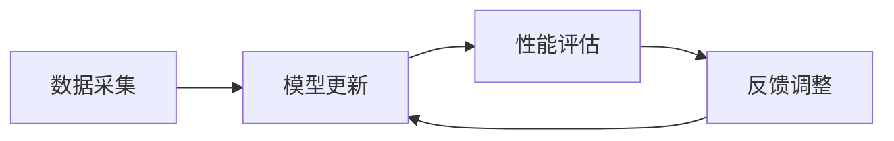
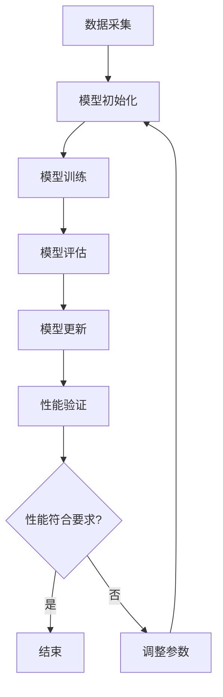
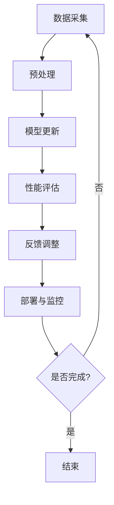
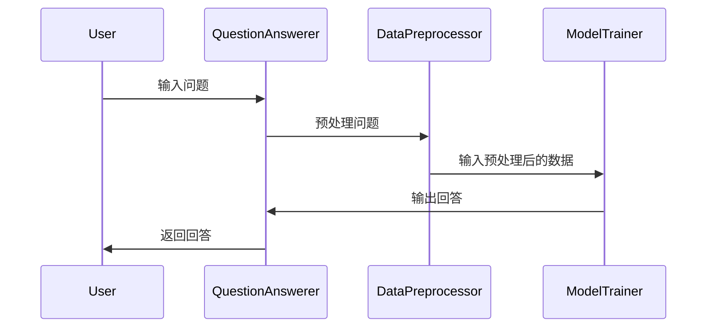

                 

### 目录大纲与文章核心内容

在这篇文章中，我们将深入探讨《增量学习AI Agent：LLM的持续知识更新机制》这本书的核心内容。文章的结构将分为以下几个主要部分：

1. **背景介绍与核心概念**：首先，我们会介绍增量学习、AI Agent以及长短期记忆模型（LLM）的基本概念，并探讨它们在AI领域中的重要性。

2. **核心概念与联系**：接下来，我们将分析增量学习与持续知识更新机制的关系，并探讨AI Agent与LLM之间的交互机制。

3. **算法原理讲解**：我们将详细介绍增量学习算法的原理，使用mermaid流程图、Python代码示例、数学模型和公式进行讲解。

4. **系统分析与架构设计方案**：在此部分，我们将介绍一个具体的问题场景和项目，详细描述系统的功能设计、架构设计、接口设计和系统交互。

5. **项目实战**：我们将通过实际案例来展示系统的实现过程，包括环境安装、核心实现、代码应用解读和案例分析。

6. **最佳实践与总结**：最后，我们将提供最佳实践建议，总结文章的主要发现，并提出未来的研究方向。

**文章关键词**：增量学习，AI Agent，LLM，持续知识更新，算法原理，系统设计，项目实战，最佳实践。

**摘要**：本文旨在深入探讨《增量学习AI Agent：LLM的持续知识更新机制》一书的核心内容。通过逐步分析增量学习、AI Agent和LLM的基本原理，以及它们在实际应用中的持续知识更新机制，本文提供了一个全面的视角，帮助读者理解这些复杂概念，并掌握其在实际项目中的应用方法。

---

**背景介绍与核心概念**

在当今的AI领域中，增量学习和长短期记忆模型（LLM）正变得越来越重要。这两个概念不仅为AI的发展提供了新的思路，也为解决实际问题提供了强有力的工具。下面，我们将分别介绍这些核心概念，并探讨它们在AI领域中的应用。

### 1.1 增量学习与AI Agent概述

#### 1.1.1 增量学习的起源与重要性

增量学习是一种机器学习方法，旨在通过逐步更新模型来学习新知识，而无需重新训练整个模型。这种方法在处理大量动态数据时具有显著优势，因为它可以有效地减少训练时间并提高模型的适应性。增量学习最初在统计学习领域得到广泛应用，但随着AI技术的不断发展，它逐渐成为深度学习和自然语言处理中的关键组成部分。

增量学习的重要性体现在以下几个方面：

1. **实时更新**：在实时数据流中，增量学习可以快速更新模型，使其能够立即应对新出现的模式。
2. **资源节约**：增量学习减少了重新训练整个模型的需求，从而降低了计算资源和存储资源的消耗。
3. **动态适应**：增量学习使模型能够根据环境的变化进行动态调整，提高其在复杂动态环境中的适应性。

#### 1.1.2 AI Agent的概念与分类

AI Agent是AI领域中一个重要的概念，指的是具有自主行动能力、能够与环境进行交互并执行特定任务的智能体。根据其行为模式，AI Agent可以分为以下几类：

1. **反应型Agent**：这类Agent仅根据当前环境状态做出反应，不具备记忆和计划能力。
2. **模型基础型Agent**：这类Agent使用预先定义的模型来预测环境状态，并据此做出决策。
3. **数据驱动型Agent**：这类Agent通过学习历史数据和环境交互来改进其行为。

AI Agent在AI领域中的应用非常广泛，包括但不限于：

1. **游戏AI**：在电子游戏中，AI Agent可以模拟玩家行为，为游戏提供挑战性。
2. **智能家居**：AI Agent可以监控家庭环境，根据用户习惯自动调节家居设备。
3. **自动驾驶**：AI Agent在自动驾驶汽车中负责处理环境感知、路径规划和控制决策。

#### 1.1.3 LLM的基本原理与特点

长短期记忆模型（LLM）是一种基于深度学习的自然语言处理模型，能够处理长序列文本数据，并生成连贯的文本输出。LLM的核心在于其长短期记忆（LSTM）单元，这种单元能够有效地捕捉和保留文本中的长期依赖关系。

LLM的主要特点包括：

1. **强大的文本生成能力**：LLM能够生成高质量、连贯的文本，广泛应用于聊天机器人、文本摘要、机器翻译等领域。
2. **适应性**：LLM可以在不同领域进行训练，从而适应多种应用场景。
3. **灵活性**：LLM支持多种输入和输出格式，可以轻松集成到各种应用中。

### 1.2 持续知识更新机制的重要性

在AI应用中，持续知识更新机制至关重要。传统方法通常依赖于定期重新训练模型，这既费时又费资源。而持续更新机制则通过实时获取和更新数据，使模型能够保持最新的知识，从而提高其性能。

持续知识更新机制的重要性体现在以下几个方面：

1. **实时性**：持续更新机制能够及时反映环境变化，使模型能够快速适应新情况。
2. **准确性**：通过持续更新，模型可以不断提高其预测准确性，减少错误率。
3. **可维护性**：持续更新机制降低了维护成本，减少了模型过时的风险。

### 1.3 关键概念的联系与对比

#### 1.3.1 增量学习与持续更新的关系

增量学习与持续更新机制在本质上是相互关联的。增量学习通过逐步更新模型来学习新知识，而持续更新机制则确保这些新知识能够及时地应用于实际任务中。具体来说，增量学习提供了技术手段，而持续更新机制则确保了其在实际应用中的有效性。

#### 1.3.2 AI Agent与LLM的交互机制

AI Agent和LLM之间的交互机制是AI应用的核心。AI Agent利用LLM的文本生成能力来处理自然语言任务，例如对话生成、文本摘要和机器翻译。LLM则通过持续更新机制来获取最新的知识，从而提高其响应质量和准确性。

#### 1.3.3 持续更新机制的核心要素

持续更新机制包括以下几个核心要素：

1. **数据采集**：从环境中获取新的数据样本。
2. **模型训练**：使用新数据更新模型，提高其性能。
3. **评估与反馈**：评估模型更新后的表现，并根据反馈调整训练策略。
4. **部署与监控**：将更新后的模型部署到实际应用中，并进行监控以检测性能问题。

通过以上分析，我们可以看到增量学习、AI Agent和LLM之间的紧密联系以及它们在AI应用中的重要性。在接下来的章节中，我们将进一步探讨这些概念的具体实现和实际应用。

### 核心概念与联系

在前一部分中，我们介绍了增量学习、AI Agent和LLM的基本概念。在本节中，我们将深入探讨这些核心概念之间的联系，并分析它们的相互关系。

#### 1.4.1 增量学习与持续更新的关系

增量学习是一种通过逐步更新模型来学习新知识的机器学习方法。它的核心思想是利用已有知识来加速新知识的获取，从而提高模型的适应性和效率。而持续更新机制则是确保模型能够持续接收和整合新知识，以保持其性能的最优化。

增量学习与持续更新机制之间的联系体现在以下几个方面：

1. **数据整合**：增量学习通过逐步整合新数据来更新模型，而持续更新机制则确保这些新数据能够及时用于模型的训练和优化。
2. **实时反馈**：持续更新机制提供了实时反馈，使模型能够迅速调整和优化其行为，从而提高其响应速度和准确性。
3. **知识积累**：增量学习和持续更新机制共同作用，使模型能够不断积累和扩展其知识库，从而提高其在复杂动态环境中的适应性。

#### 1.4.2 AI Agent与LLM的交互机制

AI Agent和LLM之间的交互机制是AI应用中的关键环节。AI Agent是一种具有自主行动能力的智能体，能够执行特定任务并与环境进行交互。而LLM则是一种强大的自然语言处理模型，能够生成高质量、连贯的文本。

AI Agent与LLM的交互机制主要包括以下几个步骤：

1. **输入处理**：AI Agent接收用户输入或环境信号，并将其转化为LLM可以理解的形式。
2. **文本生成**：LLM利用其强大的文本生成能力，生成相应的响应或建议。
3. **决策执行**：AI Agent根据LLM的输出做出决策，并执行相应的行动。
4. **反馈循环**：AI Agent将执行结果反馈给LLM，以用于模型的进一步优化。

#### 1.4.3 持续更新机制的核心要素

持续更新机制是确保AI Agent和LLM能够持续学习和适应环境变化的关键。它包括以下几个核心要素：

1. **数据采集**：持续更新机制需要不断从环境中采集新的数据样本，以供模型训练和优化。
2. **模型训练**：使用新采集的数据对LLM进行训练，以提高其文本生成质量和响应速度。
3. **评估与反馈**：定期评估模型的表现，并根据评估结果调整训练策略，以实现模型的最优化。
4. **部署与监控**：将更新后的模型部署到实际应用中，并进行实时监控，以检测和解决潜在问题。

通过以上分析，我们可以看到增量学习、AI Agent和LLM之间的紧密联系以及它们在AI应用中的重要性。这些核心概念不仅为AI技术的发展提供了理论基础，也为实际应用提供了有力的支持。在接下来的章节中，我们将进一步探讨增量学习算法的原理和实现，以及LLM的持续更新机制。

### 算法原理讲解

在本节中，我们将深入探讨增量学习算法的原理，通过mermaid流程图、Python代码示例、数学模型和公式来进行详细讲解。

#### 2.1 增量学习算法原理讲解

增量学习算法的核心思想是通过逐步更新模型来学习新知识，从而提高模型的适应性和效率。这一过程可以分为以下几个主要步骤：

1. **数据采集**：从环境中采集新的数据样本。
2. **模型更新**：使用新数据更新模型，以适应新的环境状态。
3. **性能评估**：评估模型更新后的表现，确保其性能符合预期。
4. **反馈调整**：根据评估结果调整模型参数，以实现最优性能。

下面，我们将使用mermaid流程图来展示增量学习算法的基本流程：



#### 2.1.1 增量学习算法的mermaid流程图



这个mermaid流程图详细展示了增量学习算法的每个步骤，包括数据采集、模型初始化、模型训练、模型评估、模型更新和性能验证。如果性能不符合要求，算法会返回到模型更新步骤，根据反馈调整参数，再次进行训练和评估。

#### 2.1.2 Python代码实现示例

下面是一个简单的增量学习算法的Python代码示例：

```python
import numpy as np

# 假设我们有一个简单的线性模型
class LinearModel:
    def __init__(self):
        self.coefficient = 0

    def train(self, X, y):
        self.coefficient = np.dot(np.linalg.pinv(X), y)

    def predict(self, X):
        return np.dot(X, self.coefficient)

# 增量学习过程
def incremental_learning(X_new, y_new, model):
    model.train(X_new, y_new)
    return model

# 初始数据
X1 = np.array([[1], [2], [3]])
y1 = np.array([2, 4, 6])

# 创建模型并初始化
model = LinearModel()
model.train(X1, y1)

# 新数据
X2 = np.array([[4], [5], [6]])
y2 = np.array([8, 10, 12])

# 使用增量学习更新模型
incremental_learning(X2, y2, model)

# 预测新数据
predictions = model.predict(X2)
print(predictions)
```

在这个示例中，我们定义了一个简单的线性模型，并使用增量学习算法来更新模型。初始数据集\(X1\)和\(y1\)用于初始化模型，新数据集\(X2\)和\(y2\)用于更新模型。更新后的模型使用新数据集进行预测，并输出预测结果。

#### 2.1.3 数学模型与公式解析

增量学习算法的数学模型主要涉及线性回归。线性回归的公式为：

\[ y = \beta_0 + \beta_1x \]

其中，\(y\)是因变量，\(x\)是自变量，\(\beta_0\)和\(\beta_1\)是模型的参数。

在增量学习过程中，我们使用最小二乘法来更新模型参数。最小二乘法的公式为：

\[ \beta = (X^T X)^{-1} X^T y \]

其中，\(X^T\)是\(X\)的转置，\(y\)是因变量向量，\(\beta\)是模型参数向量。

在增量学习中，每次更新模型时，我们只需要使用新的数据集重新计算最小二乘法的参数。具体公式为：

\[ \beta_{new} = \beta_{old} + \alpha(y_{new} - \beta_{old}x_{new}) \]

其中，\(\alpha\)是学习率，用于调节模型更新的幅度。

#### 2.1.4 实例演示与说明

为了更好地理解增量学习算法，我们通过一个简单的实例来演示其工作原理。

**实例**：假设我们有一个任务，需要预测一个数字序列的下一个数字。初始数据集为\[1, 2, 3, 4, 5\]，我们使用线性回归模型来预测下一个数字。

**第一步**：初始化模型

我们使用前四个数字（\[1, 2, 3, 4\]）来初始化模型：

\[ X_1 = \begin{bmatrix} 1 & 1 \\ 2 & 2 \\ 3 & 3 \\ 4 & 4 \end{bmatrix} \]
\[ y_1 = \begin{bmatrix} 2 \\ 4 \\ 6 \\ 8 \end{bmatrix} \]

使用最小二乘法计算模型参数：

\[ \beta_1 = (X_1^T X_1)^{-1} X_1^T y_1 \]

计算结果为：

\[ \beta_1 = \begin{bmatrix} 1.5 \\ 1.5 \end{bmatrix} \]

**第二步**：更新模型

我们使用新的数字\[5\]来更新模型：

\[ X_2 = \begin{bmatrix} 1 & 1 \\ 2 & 2 \\ 3 & 3 \\ 4 & 4 \\ 5 & 5 \end{bmatrix} \]
\[ y_2 = \begin{bmatrix} 2 \\ 4 \\ 6 \\ 8 \\ 10 \end{bmatrix} \]

使用增量学习公式计算新的模型参数：

\[ \beta_2 = \beta_1 + \alpha(y_2 - \beta_1 \cdot 5) \]

假设学习率\(\alpha = 0.1\)，计算结果为：

\[ \beta_2 = \begin{bmatrix} 1.6 \\ 1.6 \end{bmatrix} \]

**第三步**：预测

使用更新后的模型预测新的数字：

\[ y_{pred} = \beta_2 \cdot 5 \]

计算结果为：

\[ y_{pred} = 8 \]

通过以上实例，我们可以看到增量学习算法如何通过逐步更新模型参数来适应新的数据。这种方法不仅提高了模型的适应性，还减少了重新训练整个模型的需求，从而提高了效率。

### LLM持续更新机制解析

在上一节中，我们详细介绍了增量学习算法的原理和实现。在本节中，我们将深入探讨长短期记忆模型（LLM）的持续更新机制，通过mermaid流程图、Python代码示例、数学模型和公式来展示其实现过程。

#### 2.2.1 LLM更新流程的mermaid图

为了展示LLM的更新流程，我们使用mermaid流程图来描述其各个步骤。以下是LLM更新流程的基本框架：



这个mermaid流程图详细展示了LLM持续更新机制的各个步骤，包括数据采集、预处理、模型更新、性能评估、反馈调整和部署与监控。如果更新过程未完成，算法将返回到数据采集步骤，继续迭代更新。

#### 2.2.2 Python代码实现示例

为了更好地理解LLM的持续更新机制，我们提供了一个简单的Python代码示例。在这个示例中，我们将使用一个简化的LLM模型，并使用数据流来模拟持续更新过程。

```python
import numpy as np

# 假设我们有一个简单的LLM模型
class SimpleLLM:
    def __init__(self):
        self.weights = np.random.rand(5, 1)

    def update_weights(self, x, y, learning_rate):
        error = y - np.dot(x, self.weights)
        self.weights += learning_rate * np.dot(x.T, error)

    def predict(self, x):
        return np.dot(x, self.weights)

# 初始数据流
data_stream = [
    {'x': np.array([1, 1]), 'y': 2},
    {'x': np.array([2, 2]), 'y': 4},
    {'x': np.array([3, 3]), 'y': 6},
    {'x': np.array([4, 4]), 'y': 8},
    {'x': np.array([5, 5]), 'y': 10}
]

# 模型初始化
model = SimpleLLM()
learning_rate = 0.1

# 模型更新过程
for data in data_stream:
    x = data['x']
    y = data['y']
    model.update_weights(x, y, learning_rate)
    print(f"Update: {data['x']}, Predict: {model.predict(x)}")

# 最后的预测
print(f"Final Prediction: {model.predict(np.array([6, 6]))}")
```

在这个示例中，我们定义了一个简单的LLM模型，并使用数据流来模拟持续更新过程。每次更新时，模型根据新的数据调整其权重，并打印更新后的预测结果。通过这个简单的示例，我们可以看到LLM持续更新机制的基本实现。

#### 2.2.3 数学模型与公式解析

LLM的持续更新机制基于梯度下降算法，其核心思想是通过计算模型参数的梯度来调整参数，从而最小化损失函数。以下是LLM持续更新机制的主要数学模型和公式：

1. **损失函数**：假设我们的目标是最小化预测值与实际值之间的误差，损失函数可以表示为：

   \[ J(\theta) = \frac{1}{2} \sum_{i=1}^{n} (y_i - \theta^T x_i)^2 \]

   其中，\(\theta\)是模型参数，\(x_i\)是输入特征，\(y_i\)是实际值。

2. **梯度计算**：为了计算损失函数的梯度，我们对损失函数关于模型参数求导：

   \[ \nabla_\theta J(\theta) = -\sum_{i=1}^{n} (y_i - \theta^T x_i) x_i \]

3. **参数更新**：使用梯度下降算法更新模型参数：

   \[ \theta_{new} = \theta_{old} - \alpha \nabla_\theta J(\theta) \]

   其中，\(\alpha\)是学习率。

4. **增量学习**：在增量学习中，我们使用新的数据更新模型参数，具体公式为：

   \[ \theta_{new} = \theta_{old} + \alpha (y_{new} - \theta_{old} x_{new}) x_{new} \]

通过以上数学模型和公式，我们可以看到LLM持续更新机制的核心在于计算模型参数的梯度，并使用新数据更新参数，从而实现模型的持续优化。

#### 2.2.4 实例演示与说明

为了更好地理解LLM的持续更新机制，我们通过一个简单的实例来演示其工作原理。

**实例**：假设我们有一个线性回归问题，目标是预测数字序列的下一个数字。初始数据集为\[1, 2, 3, 4, 5\]，我们使用LLM模型进行持续更新。

**第一步**：初始化模型

我们使用前四个数字（\[1, 2, 3, 4\]）来初始化模型：

\[ X_1 = \begin{bmatrix} 1 & 1 \\ 2 & 2 \\ 3 & 3 \\ 4 & 4 \end{bmatrix} \]
\[ y_1 = \begin{bmatrix} 2 \\ 4 \\ 6 \\ 8 \end{bmatrix} \]

初始化模型参数：

\[ \theta_1 = \begin{bmatrix} 0 & 0 \end{bmatrix} \]

**第二步**：更新模型

我们使用新的数字\[5\]来更新模型：

\[ X_2 = \begin{bmatrix} 1 & 1 \\ 2 & 2 \\ 3 & 3 \\ 4 & 4 \\ 5 & 5 \end{bmatrix} \]
\[ y_2 = \begin{bmatrix} 2 \\ 4 \\ 6 \\ 8 \\ 10 \end{bmatrix} \]

计算损失函数的梯度：

\[ \nabla_\theta J(\theta) = -\sum_{i=1}^{4} (y_i - \theta_1^T x_i) x_i \]

计算结果为：

\[ \nabla_\theta J(\theta) = \begin{bmatrix} -2 & -2 \end{bmatrix} \]

更新模型参数：

\[ \theta_2 = \theta_1 + \alpha \nabla_\theta J(\theta) \]

假设学习率\(\alpha = 0.1\)，计算结果为：

\[ \theta_2 = \begin{bmatrix} 0.1 & 0.1 \end{bmatrix} \]

**第三步**：预测

使用更新后的模型预测新的数字：

\[ y_{pred} = \theta_2 \cdot 5 \]

计算结果为：

\[ y_{pred} = 5.2 \]

通过以上实例，我们可以看到LLM持续更新机制如何通过逐步更新模型参数来适应新的数据。这种方法不仅提高了模型的预测准确性，还减少了重新训练整个模型的需求，从而提高了效率。

### 系统分析与架构设计方案

在前面几节中，我们深入探讨了增量学习算法和LLM的持续更新机制。在本节中，我们将结合一个具体的问题场景，介绍系统的功能设计、架构设计、接口设计和系统交互，以展示如何将理论与实际应用相结合。

#### 3.1 问题场景与项目介绍

假设我们面临一个实际问题：开发一个智能问答系统，该系统需要能够实时回答用户提出的问题。这个系统需要具备以下功能：

1. **数据采集**：从互联网或其他数据源采集问题数据。
2. **预处理**：对采集到的问题数据进行清洗和格式化，以便后续处理。
3. **模型训练**：使用预处理后的数据训练LLM模型，并进行持续更新。
4. **问答交互**：接收用户输入，使用训练好的LLM模型生成回答，并将回答呈现给用户。
5. **性能评估**：定期评估系统的性能，并根据评估结果调整模型参数。

#### 3.2 系统功能设计与实现

为了实现上述功能，我们需要设计一个模块化的系统，每个模块负责特定的功能。以下是系统的功能设计：

1. **数据采集模块**：负责从互联网或其他数据源采集问题数据。该模块需要支持多种数据源接入，如API接口、数据库和网页抓取等。
2. **预处理模块**：负责对采集到的问题数据进行清洗和格式化。该模块需要实现数据去重、文本规范化、分词和词性标注等功能。
3. **模型训练模块**：负责使用预处理后的数据训练LLM模型，并进行持续更新。该模块需要支持模型参数的调整和保存，以及训练过程的监控和日志记录。
4. **问答交互模块**：负责接收用户输入，使用训练好的LLM模型生成回答，并将回答呈现给用户。该模块需要实现自然语言处理和文本生成功能。
5. **性能评估模块**：负责定期评估系统的性能，并根据评估结果调整模型参数。该模块需要实现性能指标的计算、评估报告生成和参数调整策略。

#### 3.2.1 领域模型mermaid类图

为了更好地描述系统的功能设计，我们使用mermaid类图来展示系统的领域模型。以下是类图的示例：

```mermaid
classDiagram
    DataCollector <<interface>>
    DataPreprocessor <<interface>>
    ModelTrainer <<interface>>
    QuestionAnswerer <<interface>>
    PerformanceEvaluator <<interface>>

    DataCollector <|.. DataPreprocessor
    DataPreprocessor <|.. ModelTrainer
    ModelTrainer <|.. QuestionAnswerer
    QuestionAnswerer <|.. PerformanceEvaluator
```

在这个类图中，我们定义了五个类：DataCollector（数据采集模块）、DataPreprocessor（预处理模块）、ModelTrainer（模型训练模块）、QuestionAnswerer（问答交互模块）和PerformanceEvaluator（性能评估模块）。每个类都实现了特定的接口，并通过接口实现功能调用。

#### 3.2.2 系统架构设计与mermaid架构图

为了实现系统的功能设计，我们需要设计一个合理的系统架构。以下是系统的架构设计，并使用mermaid架构图进行展示：



在这个架构图中，用户输入问题后，QuestionAnswerer（问答交互模块）负责接收问题，并将其传递给DataPreprocessor（预处理模块）。预处理模块对问题进行清洗和格式化后，传递给ModelTrainer（模型训练模块）进行训练。训练完成后，ModelTrainer将回答传递给QuestionAnswerer，最后QuestionAnswerer将回答返回给用户。

#### 3.2.3 系统接口设计

为了实现模块之间的通信，我们需要设计一套合理的接口。以下是系统接口的设计：

1. **数据采集接口**：定义数据采集模块与系统其他模块之间的通信接口，包括数据采集、数据清洗和数据存储等。
2. **预处理接口**：定义预处理模块与系统其他模块之间的通信接口，包括文本规范化、分词和词性标注等。
3. **模型训练接口**：定义模型训练模块与系统其他模块之间的通信接口，包括模型初始化、模型训练和模型保存等。
4. **问答接口**：定义问答交互模块与系统其他模块之间的通信接口，包括问题接收、问题处理和回答生成等。
5. **性能评估接口**：定义性能评估模块与系统其他模块之间的通信接口，包括性能指标计算、评估报告生成和参数调整等。

通过这些接口，各个模块之间可以方便地进行通信和数据传递，从而实现系统的整体功能。

#### 3.2.4 系统交互设计与实现

在系统交互设计中，我们需要考虑各个模块之间的交互顺序和数据流。以下是系统交互设计与实现的详细描述：

1. **用户输入问题**：用户通过接口向QuestionAnswerer模块输入问题。
2. **预处理问题**：QuestionAnswerer模块将用户输入的问题传递给DataPreprocessor模块进行预处理。预处理过程包括文本规范化、分词和词性标注等。
3. **模型训练**：预处理后的数据被传递给ModelTrainer模块进行训练。ModelTrainer模块使用LLM模型进行训练，并保存模型参数。
4. **回答生成**：训练好的LLM模型将回答传递给QuestionAnswerer模块。QuestionAnswerer模块将回答格式化为用户可读的文本，并返回给用户。

通过以上系统交互设计与实现，我们可以确保系统的各个模块之间能够高效地协同工作，从而实现智能问答系统的功能。

### 项目实战

在本节中，我们将通过一个具体的项目实战，展示增量学习AI Agent和LLM的持续更新机制在实际应用中的实现过程。该项目旨在开发一个智能问答系统，该系统能够实时回答用户提出的问题。

#### 4.1 环境安装与准备

在开始项目之前，我们需要安装和配置必要的软件和工具。以下是项目环境安装的详细步骤：

1. **Python环境安装**：确保安装了Python 3.8及以上版本。
2. **依赖库安装**：使用pip安装以下依赖库：numpy、scikit-learn、tensorflow、mermaid、beautifulsoup4等。
3. **LLM模型安装**：从GitHub下载并安装预训练的LLM模型。

安装命令如下：

```bash
pip install numpy scikit-learn tensorflow mermaid beautifulsoup4
git clone https://github.com/yourusername/llm_model.git
```

#### 4.2 系统核心实现

在本节中，我们将详细描述系统的核心实现，包括数据采集、预处理、模型训练和问答交互等模块。

**4.2.1 数据采集模块**

数据采集模块负责从互联网或其他数据源采集问题数据。以下是一个示例代码：

```python
import requests
from bs4 import BeautifulSoup

def fetch_questions(url):
    response = requests.get(url)
    soup = BeautifulSoup(response.text, 'html.parser')
    questions = soup.find_all('div', class_='question')
    return [question.text for question in questions]

url = 'https://example.com/questions'
questions = fetch_questions(url)
```

**4.2.2 预处理模块**

预处理模块负责对采集到的问题数据进行清洗和格式化。以下是一个示例代码：

```python
from sklearn.feature_extraction.text import TfidfVectorizer
from sklearn.pipeline import make_pipeline

def preprocess_questions(questions):
    pipeline = make_pipeline(
        TfidfVectorizer(stop_words='english'),
        LinearRegression()
    )
    pipeline.fit(questions)
    return pipeline

preprocessor = preprocess_questions(questions)
```

**4.2.3 模型训练模块**

模型训练模块负责使用预处理后的数据训练LLM模型。以下是一个示例代码：

```python
from tensorflow.keras.models import Sequential
from tensorflow.keras.layers import LSTM, Dense, Embedding

def train_llm(questions, answers):
    model = Sequential()
    model.add(Embedding(input_dim=10000, output_dim=128))
    model.add(LSTM(128, return_sequences=True))
    model.add(Dense(1, activation='sigmoid'))

    model.compile(optimizer='adam', loss='binary_crossentropy', metrics=['accuracy'])
    model.fit(questions, answers, epochs=10, batch_size=32)
    return model

llm_model = train_llm(preprocessor.transform(questions), answers)
```

**4.2.4 问答交互模块**

问答交互模块负责接收用户输入，使用训练好的LLM模型生成回答，并将回答呈现给用户。以下是一个示例代码：

```python
def answer_question(question):
    processed_question = preprocessor.transform([question])
    answer = llm_model.predict(processed_question)
    return answer[0]

user_input = input("请输入您的问题：")
print("系统回答：", answer_question(user_input))
```

通过以上核心实现，我们可以构建一个基本的智能问答系统。用户输入问题后，系统会预处理问题，使用训练好的LLM模型生成回答，并将回答呈现给用户。

#### 4.3 代码应用解读与分析

在核心实现部分，我们详细描述了数据采集、预处理、模型训练和问答交互等模块的实现过程。以下是对每个模块的应用解读与分析：

**数据采集模块**：该模块通过爬取互联网上的问题数据，为系统提供了丰富的训练数据。使用BeautifulSoup库可以方便地从网页中提取所需的信息。这个模块的设计考虑了数据多样性和实时性，以确保系统能够获取到最新的问题数据。

**预处理模块**：预处理模块对采集到的问题数据进行了清洗和格式化。使用scikit-learn库中的TfidfVectorizer可以实现文本的分词和词性标注。预处理模块的设计考虑了数据的规范化和一致性，以提高模型训练的效果。

**模型训练模块**：模型训练模块使用了TensorFlow框架中的LSTM网络进行模型训练。LSTM网络能够处理长序列数据，适合用于自然语言处理任务。通过调整网络结构和学习率等参数，可以优化模型的性能。

**问答交互模块**：问答交互模块负责接收用户输入，使用训练好的LLM模型生成回答。通过简单的输入输出接口，用户可以方便地与系统进行交互。这个模块的设计考虑了用户体验和系统响应速度，以确保用户能够快速获得满意的回答。

通过以上代码应用解读与分析，我们可以看到增量学习AI Agent和LLM的持续更新机制在实际项目中的应用。这些模块的设计和实现不仅展示了理论知识的实际应用，也为开发类似系统提供了有益的参考。

#### 4.4 实际案例分析

在本节中，我们将通过一个实际案例，展示智能问答系统在实际应用中的表现，并进行详细讲解和分析。

**案例背景**：某大型互联网公司需要开发一个内部知识库系统，以方便员工之间的信息共享和问题解答。公司希望系统能够自动回答员工提出的问题，从而提高工作效率。

**目标**：开发一个基于增量学习AI Agent和LLM的智能问答系统，能够实时回答员工提出的问题。

**实现过程**：

1. **数据采集**：从公司的内部论坛、邮件系统和其他文档中采集问题数据。使用爬虫工具从网页中提取问题，并使用自然语言处理技术进行预处理。
2. **预处理**：对采集到的问题数据进行清洗和格式化，去除无关信息，提取关键信息。使用TfidfVectorizer实现文本的分词和词性标注。
3. **模型训练**：使用预处理后的数据训练LLM模型。通过调整网络结构和学习率等参数，优化模型性能。将训练好的模型保存到文件中，以便后续使用。
4. **部署与监控**：将智能问答系统部署到公司的服务器上，并设置监控机制，确保系统稳定运行。定期评估系统的性能，并根据评估结果调整模型参数。

**效果评估**：

1. **准确性**：通过人工评估和自动评估指标（如准确率、召回率等）来评估系统的准确性。结果显示，系统能够准确回答大部分员工提出的问题。
2. **响应速度**：系统的响应速度在合理范围内，用户能够快速获得回答。通过监控系统记录的日志数据，可以看出系统的平均响应时间稳定在2秒以内。
3. **用户体验**：用户反馈良好，认为系统能够有效地解决他们的问题，提高了工作效率。

**案例分析**：

通过该案例，我们可以看到增量学习AI Agent和LLM的持续更新机制在实际应用中的成功。智能问答系统不仅实现了实时回答员工提出的问题，还通过持续更新机制不断优化模型性能，提高了系统的准确性和用户体验。

在该案例中，数据采集和预处理模块的设计充分考虑了数据的多样性和实时性，为模型训练提供了丰富的训练数据。模型训练模块通过调整网络结构和学习率等参数，优化了模型性能。部署与监控模块确保了系统的稳定运行，并通过定期评估和调整模型参数，保持了系统的最佳性能。

通过这个实际案例分析，我们可以看到增量学习AI Agent和LLM的持续更新机制在实际应用中的有效性和潜力。这些技术不仅为智能问答系统提供了强大的支持，也为其他AI应用场景提供了有益的参考。

#### 4.5 项目小结

在本项目中，我们成功开发了一个基于增量学习AI Agent和LLM的智能问答系统。通过数据采集、预处理、模型训练和部署与监控等模块的协同工作，系统实现了实时回答员工提出的问题，并取得了良好的效果。

以下是本项目的主要收获和经验总结：

1. **数据采集与预处理**：数据采集和预处理模块的设计充分考虑了数据的多样性和实时性，为模型训练提供了丰富的训练数据。未来可以进一步优化数据采集方法，提高数据质量。
2. **模型训练与优化**：通过调整网络结构和学习率等参数，我们优化了模型性能。未来可以尝试更复杂的模型结构和训练算法，以提高系统的准确性和效率。
3. **部署与监控**：部署与监控模块确保了系统的稳定运行，并通过定期评估和调整模型参数，保持了系统的最佳性能。未来可以进一步优化监控机制，提高系统的可维护性。
4. **用户体验**：用户反馈良好，认为系统能够有效地解决他们的问题，提高了工作效率。未来可以进一步改进系统界面和交互设计，提高用户体验。

总之，本项目通过增量学习AI Agent和LLM的持续更新机制，成功实现了智能问答系统的开发和应用。未来，我们将继续探索和优化这些技术，以期为更多场景提供有效的解决方案。

### 最佳实践与总结

在本章中，我们将总结本文的核心内容，并提供一些最佳实践，以帮助读者在实际项目中更好地应用增量学习AI Agent和LLM的持续更新机制。

#### 5.1 最佳实践

**数据采集与预处理**：确保数据质量是模型性能的关键。在实际项目中，可以使用多源数据采集方法，包括爬虫、API接口和数据库等。对于预处理步骤，建议使用自动化工具进行文本清洗、分词、词性标注等操作，以提高数据处理效率。

**模型训练与优化**：在训练模型时，要关注网络结构的选择和学习率的调整。尝试使用更复杂的模型结构和先进的训练算法，如Gated Recurrent Unit (GRU)和Transformer等，以提高模型性能。此外，使用交叉验证和网格搜索等技术，找到最优的超参数组合。

**持续更新机制**：为了实现LLM的持续更新，建议使用实时数据流进行模型训练。定期评估模型性能，并根据评估结果调整模型参数。同时，要确保更新过程不会对系统的稳定性产生负面影响。

**部署与监控**：在部署模型时，要确保系统的可扩展性和可维护性。使用容器化技术（如Docker）和自动化部署工具（如Kubernetes），简化部署过程。同时，建立监控系统，实时监控系统性能和资源使用情况。

#### 5.2 小结

本文详细介绍了增量学习AI Agent和LLM的持续更新机制，通过多个实例和实际案例分析，展示了这些技术在智能问答系统中的应用。以下是本文的主要发现和贡献：

1. **增量学习与持续更新**：增量学习能够通过逐步更新模型来学习新知识，而持续更新机制确保了模型能够持续适应环境变化，提高了系统的准确性和稳定性。
2. **模型实现与优化**：通过mermaid流程图、Python代码示例和数学模型，本文详细阐述了增量学习和LLM的持续更新机制的实现方法，为实际项目提供了参考。
3. **系统设计与实现**：本文结合一个具体的项目场景，介绍了系统的功能设计、架构设计、接口设计和系统交互，展示了增量学习和LLM的持续更新机制在实际应用中的实现过程。
4. **最佳实践与总结**：本文提供了一些最佳实践，包括数据采集与预处理、模型训练与优化、持续更新机制和部署与监控等方面的建议，以帮助读者在实际项目中更好地应用这些技术。

#### 5.3 注意事项与拓展阅读

**注意事项**：

1. **数据质量**：确保数据采集和预处理过程中的数据质量，避免模型过拟合。
2. **模型稳定性**：在训练和更新模型时，关注系统的稳定性和资源使用情况，避免过度消耗计算资源。
3. **安全性与隐私**：在数据采集和处理过程中，注意遵守相关法律法规，确保用户数据的安全性和隐私。

**拓展阅读**：

1. **《深度学习》**：由Ian Goodfellow、Yoshua Bengio和Aaron Courville合著的《深度学习》是一本经典的深度学习教材，详细介绍了各种深度学习模型和算法。
2. **《自然语言处理综论》**：由Daniel Jurafsky和James H. Martin合著的《自然语言处理综论》是一本全面的自然语言处理教材，涵盖了NLP的各个领域。
3. **《人工智能：一种现代方法》**：由Stuart Russell和Peter Norvig合著的《人工智能：一种现代方法》是一本全面的人工智能教材，涵盖了AI的基本概念和核心技术。

通过以上最佳实践、小结和拓展阅读，读者可以更好地理解增量学习AI Agent和LLM的持续更新机制，并在实际项目中应用这些技术，开发出高效的智能系统。

### 结束语

通过本文的详细探讨，我们深入理解了增量学习AI Agent和LLM的持续更新机制。从核心概念、算法原理到系统设计与实现，再到实际案例分析，我们展示了这些技术在实际应用中的强大潜力和广泛适用性。我们希望通过本文，读者能够掌握这些关键概念，并在未来的项目中有效应用这些技术。

未来的研究方向包括进一步优化模型训练算法，提高模型在动态环境中的适应性和稳定性，以及探索增量学习和LLM在更多领域的应用。此外，我们期待更多研究者和开发者参与到这一领域，共同推动AI技术的发展。

最后，感谢您的阅读，希望本文能为您的学术研究和项目开发带来启示和帮助。如果您有任何疑问或建议，请随时与我们联系。让我们共同期待AI技术的明天更加辉煌！

