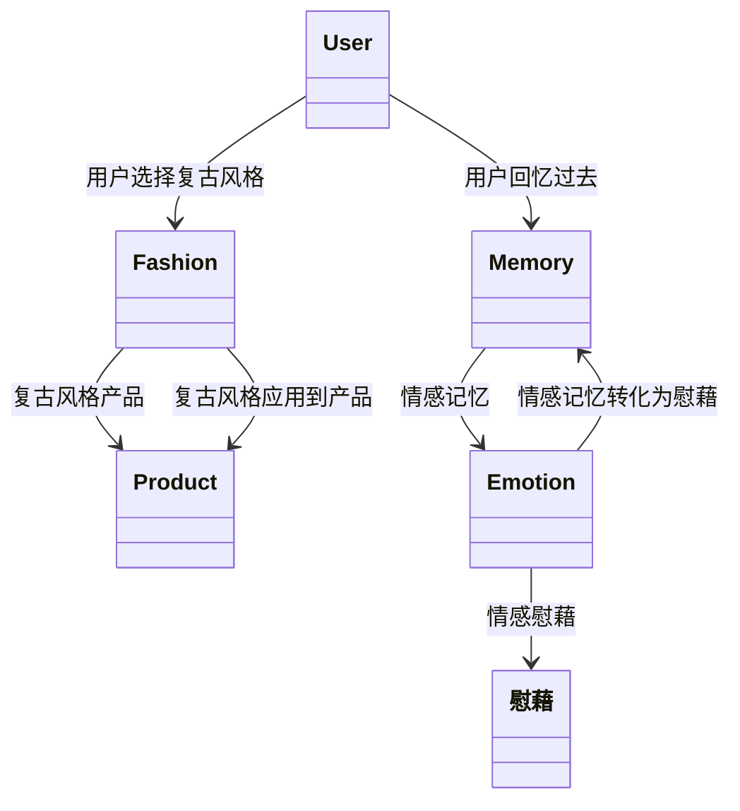
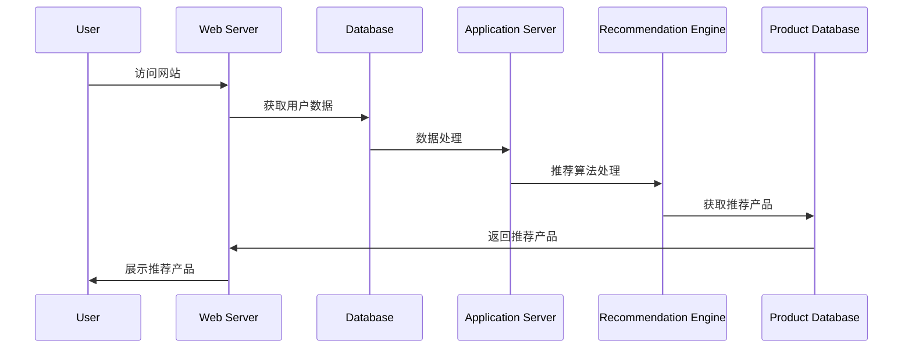
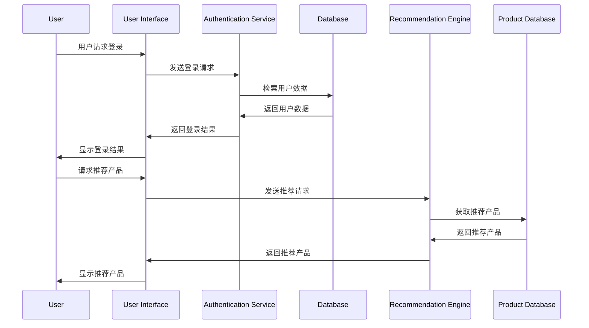

                 

## 文章标题

### 关键词：复古风潮、怀旧情感、情感慰藉、算法原理、系统架构设计、项目实战

#### 摘要：
本文章旨在探讨复古风潮在现代社会中的兴起及其与怀旧情感、情感慰藉之间的关系。通过深入分析复古风潮的定义、特点及其与怀旧情感的互动，文章揭示了复古风潮作为一种情感慰藉手段的作用机制。本文不仅介绍了复古风潮的背景和影响，还通过系统的算法原理讲解、架构设计方案和实际项目案例，详细阐述了复古风潮在情感慰藉中的应用和实践。文章旨在为读者提供一个全面、深入的理解，帮助他们在怀旧中寻找情感慰藉，并探讨其在现代社会中的潜在价值。

## 目录大纲

### 第一部分 背景介绍

- **1.1 问题背景**
  - 1.1.1 怀旧文化的兴起
  - 1.1.2 复古风潮的影响
  - 1.1.3 怀旧与情感慰藉

- **1.2 问题描述**
  - 1.2.1 复古风潮的定义
  - 1.2.2 怀旧情感的表现形式
  - 1.2.3 复古风潮与情感慰藉的关系

- **1.3 问题解决**
  - 1.3.1 研究目的
  - 1.3.2 研究方法
  - 1.3.3 研究范围与边界

- **1.4 边界与外延**
  - 1.4.1 复古风潮的分类
  - 1.4.2 怀旧情感的类型
  - 1.4.3 复古风潮与情感慰藉的不同维度

- **1.5 概念结构与核心要素组成**
  - 1.5.1 复古风潮的核心要素
  - 1.5.2 怀旧情感的核心要素
  - 1.5.3 复古风潮与情感慰藉的交互作用

### 第二部分 核心概念与联系

- **2.1 复古风潮的原理**
  - 2.1.1 复古风潮的定义
  - 2.1.2 复古风潮的特点
  - 2.1.3 复古风潮的演变历程

- **2.2 怀旧情感的属性特征对比表格**
  - 2.2.1 情感心理学中的怀旧情感
  - 2.2.2 社会学中的怀旧情感
  - 2.2.3 消费心理学中的怀旧情感

- **2.3 ER实体关系图架构**
  - 2.3.1 复古风潮相关实体
  - 2.3.2 怀旧情感相关实体
  - 2.3.3 复古风潮与情感慰藉的关系

### 第三部分 算法原理讲解

- **3.1 复古风潮的算法原理**
  - 3.1.1 算法的定义
  - 3.1.2 算法的特点
  - 3.1.3 算法的分类

- **3.2 举例说明**
  - 3.2.1 复古风潮的算法应用实例
  - 3.2.2 怀旧情感的算法应用实例
  - 3.2.3 复古风潮与情感慰藉的算法应用实例

- **3.3 数学模型和公式**
  - 3.3.1 复古风潮的数学模型
  - 3.3.2 怀旧情感的数学模型
  - 3.3.3 复古风潮与情感慰藉的数学模型

### 第四部分 系统分析与架构设计方案

- **4.1 问题场景介绍**
  - 4.1.1 复古风潮应用场景
  - 4.1.2 怀旧情感应用场景
  - 4.1.3 复古风潮与情感慰藉的应用场景

- **4.2 系统功能设计**
  - 4.2.1 领域模型mermaid类图
  - 4.2.2 系统功能模块划分
  - 4.2.3 系统功能实现

- **4.3 系统架构设计**
  - 4.3.1 系统架构mermaid架构图
  - 4.3.2 系统组件设计
  - 4.3.3 系统部署方案

- **4.4 系统接口设计和系统交互**
  - 4.4.1 系统接口设计
  - 4.4.2 系统交互mermaid序列图
  - 4.4.3 系统交互流程分析

### 第五部分 项目实战

- **5.1 环境安装**
  - 5.1.1 环境准备
  - 5.1.2 环境配置
  - 5.1.3 环境调试

- **5.2 系统核心实现源代码**
  - 5.2.1 系统核心代码实现
  - 5.2.2 代码应用解读与分析
  - 5.2.3 代码优化与改进

- **5.3 实际案例分析和详细讲解剖析**
  - 5.3.1 实际案例分析
  - 5.3.2 案例分析与解读
  - 5.3.3 案例剖析与启示

- **5.4 项目小结**
  - 5.4.1 项目总结
  - 5.4.2 项目经验分享
  - 5.4.3 项目拓展与改进方向

### 第六部分 最佳实践与小结

- **6.1 最佳实践 tips**
  - 6.1.1 复古风潮的实用技巧
  - 6.1.2 怀旧情感的处理方法
  - 6.1.3 复古风潮与情感慰藉的结合策略

- **6.2 小结**
  - 6.2.1 本书的主要观点
  - 6.2.2 主要结论与发现
  - 6.2.3 研究局限性

- **6.3 注意事项**
  - 6.3.1 使用复古风潮的注意事项
  - 6.3.2 理解怀旧情感的重要性
  - 6.3.3 复古风潮与情感慰藉的适度原则

- **6.4 拓展阅读**
  - 6.4.1 相关研究论文
  - 6.4.2 推荐书籍
  - 6.4.3 学术会议与研讨会

## 第一部分 背景介绍

### 1.1 问题背景

#### 1.1.1 怀旧文化的兴起

怀旧文化作为一种社会现象，起源于20世纪中期，并随着时间的推移逐渐在全球范围内蔓延。怀旧文化的兴起与现代社会的高速发展、物质生活的丰富以及人们心理需求的变迁密切相关。在快速变迁的社会环境中，人们越来越渴望寻找一种情感寄托和精神慰藉，怀旧便成为了一种普遍的社会需求。通过回忆和怀念过去，人们能够在纷繁复杂的生活中找到一份宁静与安慰。

#### 1.1.2 复古风潮的影响

复古风潮是怀旧文化的一个重要表现，它通过复现过去某一时期的风格、文化和物品，唤起人们对过去的记忆和情感。复古风潮的影响涵盖了多个领域，包括时尚、艺术、建筑、设计、音乐、影视等。复古风的兴起不仅影响了消费市场的走向，还对社会文化产生了深远的影响。例如，复古服装店、复古餐厅、复古主题派对等在现代社会中越来越受欢迎，成为人们追求个性化体验和情感共鸣的一种方式。

#### 1.1.3 怀旧与情感慰藉

怀旧情感是人们在回忆过去时产生的一种情感体验，它既包括对过去美好时光的怀念，也包括对逝去时光的感伤。怀旧情感能够满足人们对于安全感和归属感的需求，成为情感慰藉的一种重要手段。在现代社会中，面对工作和生活带来的压力，人们往往通过怀旧来寻找情感慰藉，从而缓解心理压力，提高生活质量。

### 1.2 问题描述

#### 1.2.1 复古风潮的定义

复古风潮是一种文化现象，它通过对过去某一时期的文化、艺术和风格的模仿和复现，来表达对过去的怀念和追求。复古风潮不仅仅是对旧物的简单复制，更是一种对历史文化的再创造和重新解读。它可以是时尚潮流，如复古服装；可以是艺术表现，如复古摄影；也可以是建筑风格，如复古建筑。

#### 1.2.2 怀旧情感的表现形式

怀旧情感的表现形式多种多样，既可以通过外在的物品和场景来引发，也可以通过内在的记忆和情感体验来表达。常见的表现形式包括：
- 物品怀旧：对过去某件物品的怀念和收藏，如老式收音机、旧式相机等。
- 场景怀旧：对过去某个场景或地点的回忆和怀念，如童年时的公园、老街等。
- 情感体验：通过对过去的回忆和体验，产生一种怀旧的情感体验，如听老歌、看老电影等。

#### 1.2.3 复古风潮与情感慰藉的关系

复古风潮与情感慰藉之间存在密切的关系。首先，复古风潮作为一种文化现象，它能够唤起人们对过去的记忆和情感，从而满足人们对于情感慰藉的需求。其次，复古风潮通过复现和再现过去的风格和文化，为人们提供了一种逃避现实压力的途径，从而起到缓解心理压力的作用。最后，复古风潮在现代社会中的广泛传播和应用，也为人们提供了一种新的情感体验和生活方式，进一步强化了怀旧情感与情感慰藉之间的关系。

### 1.3 问题解决

#### 1.3.1 研究目的

本研究旨在探讨复古风潮在怀旧情感慰藉中的作用机制，分析复古风潮如何通过文化再现和心理效应来满足人们的情感需求。具体研究目的包括：
- 了解复古风潮的定义、特点及其在不同领域的表现。
- 分析怀旧情感的表现形式及其与复古风潮的关系。
- 探讨复古风潮在情感慰藉中的作用机制，以及其对人们心理和行为的影响。

#### 1.3.2 研究方法

本研究采用多种研究方法相结合的方式，包括文献综述、案例分析、问卷调查和实证研究等。具体研究方法如下：
- 文献综述：通过查阅和分析相关文献，了解复古风潮和怀旧情感慰藉的理论基础和研究成果。
- 案例分析：选取具有代表性的复古风潮案例，深入分析其表现形式、影响和作用机制。
- 问卷调查：设计问卷调查，收集公众对复古风潮和怀旧情感慰藉的态度和认知，分析其心理和行为特征。
- 实证研究：通过实验设计和数据收集，验证复古风潮在情感慰藉中的作用效果，并分析其影响因素。

#### 1.3.3 研究范围与边界

本研究的研究范围包括复古风潮在时尚、艺术、建筑、设计、音乐和影视等领域的表现，以及怀旧情感慰藉的作用机制。具体研究边界包括：
- 时间范围：主要关注近几十年内的复古风潮现象。
- 空间范围：主要关注全球范围内的复古风潮和怀旧情感慰藉现象。
- 研究对象：主要针对普通公众、复古风潮的从业者以及相关领域的专家学者。

### 1.4 边界与外延

#### 1.4.1 复古风潮的分类

复古风潮可以根据不同的分类标准进行分类，常见的分类方式包括：
- 按照复古的对象：分为物品复古、场景复古、文化复古等。
- 按照复古的时间范围：分为古代复古、近现代复古、当代复古等。
- 按照复古的风格：分为复古主义复古、现代主义复古、折衷主义复古等。

#### 1.4.2 怀旧情感的类型

怀旧情感可以分为不同的类型，常见的类型包括：
- 情感怀旧：对过去情感经历的怀念和回忆。
- 物品怀旧：对过去物品的怀念和收藏。
- 场景怀旧：对过去场景和地点的回忆和怀念。
- 文化怀旧：对过去文化和传统的怀念和追求。

#### 1.4.3 复古风潮与情感慰藉的不同维度

复古风潮与情感慰藉之间的关系可以从不同维度进行探讨，包括：
- 情感层面：复古风潮如何通过情感唤起和心理效应来满足人们的情感需求。
- 社会层面：复古风潮如何在社会文化背景下影响人们的情感和行为。
- 心理层面：怀旧情感如何影响人们的心理健康和幸福感。
- 经济层面：复古风潮如何影响消费市场和经济活动。

### 1.5 概念结构与核心要素组成

#### 1.5.1 复古风潮的核心要素

复古风潮的核心要素包括：
- 文化再现：通过复现和再现过去的风格、文化和物品，唤起人们的记忆和情感。
- 情感唤起：通过唤起人们对过去的情感体验，满足人们的情感需求。
- 个性化表达：通过复古风潮来表达个人的文化认同和审美偏好。

#### 1.5.2 怀旧情感的核心要素

怀旧情感的核心要素包括：
- 情感回忆：对过去美好时光的回忆和怀念。
- 情感体验：通过对过去的情感体验，产生怀旧的情感体验。
- 安全感需求：通过怀旧情感来满足人们对于安全感和归属感的需求。

#### 1.5.3 复古风潮与情感慰藉的交互作用

复古风潮与情感慰藉的交互作用主要体现在以下几个方面：
- 情感唤起：复古风潮通过文化再现和情感唤起，满足人们的情感需求。
- 心理效应：怀旧情感通过缓解压力和提升幸福感，起到情感慰藉的作用。
- 社会互动：复古风潮通过社交活动和群体认同，增强人们的情感共鸣。

## 第二部分 核心概念与联系

### 2.1 复古风潮的原理

#### 2.1.1 复古风潮的定义

复古风潮是一种文化现象，它通过对过去某一时期的文化、艺术和风格的模仿和复现，来表达对过去的怀念和追求。复古风潮不仅仅是对旧物的简单复制，更是一种对历史文化的再创造和重新解读。它可以是时尚潮流，如复古服装；可以是艺术表现，如复古摄影；也可以是建筑风格，如复古建筑。

#### 2.1.2 复古风潮的特点

复古风潮具有以下几个特点：
1. **文化再现**：通过复现和再现过去的风格、文化和物品，唤起人们的记忆和情感。
2. **情感唤起**：通过唤起人们对过去的情感体验，满足人们的情感需求。
3. **个性化表达**：通过复古风潮来表达个人的文化认同和审美偏好。
4. **社会互动**：复古风潮往往能够引发社会的共鸣，成为社交活动和群体认同的一部分。

#### 2.1.3 复古风潮的演变历程

复古风潮的演变历程可以追溯到20世纪中期，当时随着战后重建和文化反思的兴起，人们开始对过去的生活和风格产生怀念。以下是一些关键的发展阶段：
1. **20世纪中期**：复古风潮最初起源于对上世纪20年代和30年代艺术的模仿，如波普艺术和嬉皮士文化。
2. **20世纪80年代**：复古风潮在全球范围内迅速传播，特别是在时尚和音乐领域，成为重要的文化现象。
3. **21世纪**：随着互联网的发展和全球化进程的加快，复古风潮进一步扩展，涵盖了更多领域，如建筑、设计和数字艺术。

### 2.2 怀旧情感的属性特征对比表格

为了更好地理解复古风潮与怀旧情感的互动关系，我们可以通过一个属性特征对比表格来分析两者在不同学科领域的表现。

| 特征类别       | 情感心理学 | 社会学       | 消费心理学       |
|--------------|----------|------------|--------------|
| **情感唤起**   | 回忆过去美好时光 | 社会记忆和文化认同 | 购买行为中的怀旧情绪 |
| **情感体验**   | 感伤和怀念 | 社会归属感和文化传承 | 情感消费和品牌忠诚度 |
| **安全需求**   | 寻找安全感与归属感 | 社会稳定和文化连续性 | 消费安全与品牌信任感 |
| **个性化表达** | 个人情感与自我认同 | 社会身份与文化表现 | 消费个性与品牌个性 |
| **文化再现**   | 文化和情感的象征意义 | 文化记忆和社会认同 | 品牌历史和情感营销 |
| **心理效应**   | 心理疗愈和情感慰藉 | 社会认同和文化反思 | 情感共鸣和品牌体验 |

#### 2.2.1 情感心理学中的怀旧情感

在情感心理学中，怀旧情感被视为一种复杂的情感体验，它涉及对过去美好时光的回忆和对当前生活的不满。怀旧情感可以唤起个人的情感记忆，使个体在回忆中找到安全感和满足感。以下是一些关键点：

1. **情感回忆**：怀旧情感通过回忆过去的事件、人物和经历，触发情感体验。
2. **心理疗愈**：怀旧情感有助于缓解心理压力，提供情感慰藉，促进心理健康。
3. **情感共鸣**：怀旧情感能够引发个体的情感共鸣，增强社交联系和群体认同。

#### 2.2.2 社会学中的怀旧情感

在社会学中，怀旧情感被视为一种社会文化现象，它反映了社会成员对过去社会的记忆和情感态度。怀旧情感在社会学中具有以下特征：

1. **社会记忆**：怀旧情感是社会记忆的重要组成部分，它帮助个体和群体记住共同的历史和文化经验。
2. **文化认同**：怀旧情感有助于加强个体和群体对共同文化背景的认同和归属感。
3. **社会反思**：怀旧情感促使个体和群体反思社会变迁，探讨社会问题的根源和解决方案。

#### 2.2.3 消费心理学中的怀旧情感

在消费心理学中，怀旧情感被视为一种重要的消费动机，它影响个体的购买决策和消费行为。以下是一些关键点：

1. **情感消费**：怀旧情感驱使个体进行情感消费，购买与过去相关的商品和服务。
2. **品牌忠诚度**：怀旧情感有助于增强个体对特定品牌的忠诚度，促进品牌营销。
3. **情感营销**：企业利用怀旧情感进行营销，通过唤起消费者的怀旧情绪来提升品牌形象和销售。

### 2.3 ER实体关系图架构

为了更清晰地展示复古风潮、怀旧情感和情感慰藉之间的关系，我们可以通过ER（Entity-Relationship，实体-关系）图来构建一个实体关系模型。

#### 2.3.1 复古风潮相关实体

在ER图中，复古风潮相关的实体包括：
- **复古风潮**：表示整个复古文化的概念。
- **复古元素**：表示复古风潮中的具体元素，如复古服装、复古建筑等。
- **文化再现**：表示复古风潮中的文化再现活动。

#### 2.3.2 怀旧情感相关实体

怀旧情感相关的实体包括：
- **怀旧情感**：表示个体对过去情感的体验。
- **情感回忆**：表示怀旧情感中的回忆元素。
- **情感体验**：表示怀旧情感中的情感体验。

#### 2.3.3 复古风潮与情感慰藉的关系

复古风潮与情感慰藉的关系实体包括：
- **情感慰藉**：表示通过复古风潮获得的情感慰藉。
- **情感需求**：表示个体对情感慰藉的需求。
- **互动关系**：表示复古风潮与情感慰藉之间的互动关系。

以下是复古风潮、怀旧情感和情感慰藉的ER图：

```mermaid
erDiagram
 复古风潮 ||--|{ 复古元素 }
 复古风潮 ||--|{ 文化再现 }
 怀旧情感 ||--|{ 情感回忆 }
 怀旧情感 ||--|{ 情感体验 }
 情感慰藉 ||--|{ 情感需求 }
 复古风潮 ..|> 情感慰藉
 怀旧情感 ..|> 情感慰藉
```

通过ER图，我们可以清晰地看到复古风潮、怀旧情感和情感慰藉之间的互动关系，这有助于我们进一步理解它们在情感慰藉中的作用机制。

## 第三部分 算法原理讲解

### 3.1 复古风潮的算法原理

#### 3.1.1 算法的定义

算法是一系列明确的步骤，用于解决特定问题或完成特定任务。在计算机科学和信息技术领域，算法是一种用于处理数据、执行计算和实现特定功能的程序逻辑。算法通常由输入、输出和处理步骤组成。

#### 3.1.2 算法的特点

算法具有以下几个主要特点：
- **确定性**：算法的每一步都明确且唯一，确保输出结果的准确性。
- **效率**：算法应尽可能高效，以减少计算时间和资源消耗。
- **可扩展性**：算法应能够适应不同的数据规模和复杂度。
- **健壮性**：算法应能够在各种情况下稳定运行，处理异常输入和错误。

#### 3.1.3 算法的分类

算法可以根据不同的标准进行分类，常见的分类方法包括：
- **按处理方式分类**：分为确定性算法和非确定性算法。
  - **确定性算法**：每一步都有确定的输出结果，如排序算法（冒泡排序、快速排序）。
  - **非确定性算法**：输出结果不确定，通常需要通过概率来预测，如贪心算法、动态规划算法。
- **按应用领域分类**：分为通用算法和应用特定领域的算法。
  - **通用算法**：适用于各种问题和领域，如搜索算法（深度优先搜索、广度优先搜索）。
  - **特定领域算法**：针对特定领域的问题设计，如图像处理算法、机器学习算法。

### 3.2 举例说明

为了更好地理解复古风潮的算法原理，我们可以通过具体实例来阐述。

#### 3.2.1 复古风潮的算法应用实例

假设我们设计一个复古风潮推荐系统，该系统根据用户的兴趣和历史行为，推荐与其复古风格偏好相符的物品和信息。以下是一个简单的推荐算法实例：

```python
def recommend_fashions(user_history, fashion_database):
    """
    根据用户历史行为推荐复古风潮物品。
    
    参数：
    - user_history：用户的历史行为数据。
    - fashion_database：包含复古风潮物品的数据库。
    
    返回：
    - 推荐结果：与用户历史行为匹配的复古风潮物品列表。
    """
    # 步骤1：提取用户历史行为中的复古风格标签
    user_style_tags = extract_style_tags(user_history)
    
    # 步骤2：从数据库中筛选出符合用户风格标签的复古风潮物品
    matching_fashions = filter_fashions_by_style_tags(fashion_database, user_style_tags)
    
    # 步骤3：对筛选出的复古风潮物品进行排序，优先推荐最近出现的物品
    sorted_fashions = sort_fashions_by_recency(matching_fashions)
    
    # 返回推荐结果
    return sorted_fashions

# 辅助函数定义
def extract_style_tags(user_history):
    """
    提取用户历史行为中的复古风格标签。
    
    参数：
    - user_history：用户的历史行为数据。
    
    返回：
    - user_style_tags：用户历史行为中的复古风格标签列表。
    """
    # 实现提取逻辑
    pass

def filter_fashions_by_style_tags(fashion_database, user_style_tags):
    """
    从数据库中筛选出符合用户风格标签的复古风潮物品。
    
    参数：
    - fashion_database：包含复古风潮物品的数据库。
    - user_style_tags：用户历史行为中的复古风格标签列表。
    
    返回：
    - matching_fashions：符合用户风格标签的复古风潮物品列表。
    """
    # 实现筛选逻辑
    pass

def sort_fashions_by_recency(matching_fashions):
    """
    对筛选出的复古风潮物品进行排序，优先推荐最近出现的物品。
    
    参数：
    - matching_fashions：符合用户风格标签的复古风潮物品列表。
    
    返回：
    - sorted_fashions：排序后的复古风潮物品列表。
    """
    # 实现排序逻辑
    pass
```

上述代码提供了一个基本的复古风潮推荐系统的算法框架，包括用户历史行为分析、风格标签提取、物品筛选和排序等步骤。通过这个实例，我们可以看到算法在复古风潮推荐中的具体应用。

#### 3.2.2 怀旧情感的算法应用实例

怀旧情感的算法应用主要涉及情感分析和情感识别。以下是一个简单的情感分析算法实例，用于识别文本中的怀旧情感：

```python
from textblob import TextBlob

def detect_nostalgia(text):
    """
    识别文本中的怀旧情感。
    
    参数：
    - text：待分析的文本。
    
    返回：
    - nostalgia_score：怀旧情感得分（0到1之间的数值，值越高表示怀旧情感越强）。
    """
    # 使用TextBlob进行情感分析
    analysis = TextBlob(text)
    
    # 提取情感极性
    sentiment_polarity = analysis.sentiment.polarity
    
    # 定义怀旧情感的阈值
    nostalgia_threshold = 0.2
    
    # 根据情感极性判断怀旧情感强度
    nostalgia_score = 0
    if sentiment_polarity >= nostalgia_threshold:
        nostalgia_score = 1
    elif sentiment_polarity < -nostalgia_threshold:
        nostalgia_score = 0
    
    return nostalgia_score

# 示例文本
text_example = "每当听到那首老歌，我总会想起童年时的快乐时光。"

# 调用函数进行怀旧情感检测
nostalgia_score = detect_nostalgia(text_example)
print(f"怀旧情感得分：{nostalgia_score}")
```

在这个实例中，我们使用了TextBlob库进行情感分析，通过判断文本的情感极性来确定其中是否包含怀旧情感。这个简单的算法为我们提供了一种基本的怀旧情感检测方法。

#### 3.2.3 复古风潮与情感慰藉的算法应用实例

复古风潮与情感慰藉的算法应用实例可以是一个综合性的情感分析和推荐系统。以下是一个简单的示例，展示如何结合复古风潮和情感慰藉进行个性化推荐：

```python
class EmotionalRecommender:
    def __init__(self, user_profile, nostalgia_threshold=0.2):
        self.user_profile = user_profile
        self.nostalgia_threshold = nostalgia_threshold
    
    def recommend(self, fashion_database):
        """
        根据用户的情感状态和复古风格偏好推荐复古风潮物品。
        
        参数：
        - fashion_database：包含复古风潮物品的数据库。
        
        返回：
        - recommendations：与用户情感状态和风格偏好匹配的复古风潮物品列表。
        """
        # 步骤1：检测用户的怀旧情感强度
        nostalgia_score = self.detect_nostalgia(self.user_profile['text'])
        
        # 步骤2：从数据库中筛选出符合用户风格标签的复古风潮物品
        matching_fashions = self.filter_fashions_by_style_tags(fashion_database)
        
        # 步骤3：根据用户的怀旧情感强度，调整推荐策略
        if nostalgia_score > self.nostalgia_threshold:
            # 如果怀旧情感较强，推荐更多复古元素突出的物品
            recommendations = self.adjust_recommendations(matching_fashions, 'nostalgic')
        else:
            # 如果怀旧情感较弱，推荐更多时尚与复古结合的物品
            recommendations = self.adjust_recommendations(matching_fashions, 'modern')
        
        # 返回推荐结果
        return recommendations
    
    def detect_nostalgia(self, text):
        """
        识别文本中的怀旧情感。
        
        参数：
        - text：待分析的文本。
        
        返回：
        - nostalgia_score：怀旧情感得分。
        """
        # 实现怀旧情感检测逻辑
        pass
    
    def filter_fashions_by_style_tags(self, fashion_database):
        """
        从数据库中筛选出符合用户风格标签的复古风潮物品。
        
        参数：
        - fashion_database：包含复古风潮物品的数据库。
        
        返回：
        - matching_fashions：符合用户风格标签的复古风潮物品列表。
        """
        # 实现筛选逻辑
        pass
    
    def adjust_recommendations(self, matching_fashions, recommendation_type):
        """
        根据用户的情感状态调整推荐策略。
        
        参数：
        - matching_fashions：符合用户风格标签的复古风潮物品列表。
        - recommendation_type：推荐策略类型，'nostalgic'或'modern'。
        
        返回：
        - adjusted_recommendations：调整后的推荐物品列表。
        """
        # 实现调整逻辑
        pass
```

上述代码提供了一个情感推荐系统的基本框架，包括用户情感检测、风格标签筛选和推荐策略调整等步骤。通过这个系统，可以根据用户的情感状态和风格偏好，提供个性化的复古风潮推荐。

### 3.3 数学模型和公式

在复古风潮、怀旧情感和情感慰藉的研究中，数学模型和公式被广泛应用于描述和分析这些现象。以下是一些关键的数学模型和公式：

#### 3.3.1 复古风潮的数学模型

复古风潮的数学模型可以用于描述复古元素的流行度和趋势。以下是一个简单的流行度模型：

$$
P(t) = P_0 \times e^{-\lambda t}
$$

其中，$P(t)$表示在时间$t$时复古元素的流行度，$P_0$是初始流行度，$\lambda$是衰减系数，反映了复古元素的衰退速度。

#### 3.3.2 怀旧情感的数学模型

怀旧情感的数学模型可以用于描述个体怀旧情感的变化规律。以下是一个简单的怀旧情感模型：

$$
E(t) = E_0 + \alpha t - \beta t^2
$$

其中，$E(t)$表示在时间$t$时的怀旧情感强度，$E_0$是初始情感强度，$\alpha$是情感增长系数，$\beta$是情感衰减系数。

#### 3.3.3 复古风潮与情感慰藉的数学模型

复古风潮与情感慰藉的数学模型可以用于描述复古风潮对情感慰藉的影响。以下是一个简单的情感慰藉模型：

$$
S(t) = S_0 + \gamma R(t)
$$

其中，$S(t)$表示在时间$t$时个体的情感慰藉程度，$S_0$是初始情感慰藉程度，$R(t)$是复古风潮的强度，$\gamma$是情感慰藉系数。

通过这些数学模型和公式，我们可以更深入地理解复古风潮、怀旧情感和情感慰藉之间的相互作用，为研究和应用提供理论支持。

## 第四部分 系统分析与架构设计方案

### 4.1 问题场景介绍

#### 4.1.1 复古风潮应用场景

复古风潮在现代社会中具有广泛的应用场景，涵盖了多个领域，包括但不限于：

1. **时尚**：复古服装、配饰、化妆品等产品的设计灵感来源于过去的时尚风格，如维多利亚时代、20世纪50年代等。
2. **艺术**：复古艺术形式，如摄影、绘画、雕塑等，常常以过去的主题和风格为灵感来源，创作出具有怀旧情感的艺术作品。
3. **建筑**：复古建筑风格在修复和保护历史建筑时得到广泛应用，如巴黎的圣母院大教堂、北京的四合院等。
4. **设计**：复古设计元素在室内设计、家具设计、产品设计等领域中发挥重要作用，为现代产品增添历史的韵味。
5. **音乐和影视**：复古音乐和影视作品通过重现过去的音乐风格和电影技术，吸引观众的怀旧情感。

#### 4.1.2 怀旧情感应用场景

怀旧情感在多个领域中的应用场景包括：

1. **心理健康**：通过心理咨询和治疗，帮助个体缓解压力和焦虑，提升心理健康。
2. **教育**：通过历史教育和文化传承，培养学生的文化认同感和历史责任感。
3. **营销**：企业利用怀旧情感进行品牌营销，创造情感共鸣，提高消费者忠诚度。
4. **社交互动**：通过共同回忆过去的经历，加强社交联系和群体认同。

#### 4.1.3 复古风潮与情感慰藉的应用场景

复古风潮与情感慰藉的应用场景主要包括：

1. **心理健康服务**：提供以复古为主题的疗愈活动，如复古派对、怀旧电影观赏等，帮助个体缓解心理压力。
2. **文化体验中心**：设立复古文化体验中心，通过模拟复古环境和场景，提供情感慰藉和文化体验。
3. **虚拟现实应用**：利用虚拟现实技术，创造复古场景，为用户提供沉浸式的怀旧体验。
4. **智能家居**：设计具有复古风格的智能家居设备，如复古收音机、复古时钟等，为用户提供情感慰藉。

### 4.2 系统功能设计

为了实现复古风潮、怀旧情感和情感慰藉的综合应用，系统功能设计应包括以下几个关键模块：

#### 4.2.1 领域模型mermaid类图



#### 4.2.2 系统功能模块划分

1. **用户模块**：
   - 用户注册与登录
   - 用户偏好设置
   - 用户历史行为记录

2. **复古风格模块**：
   - 复古风格推荐算法
   - 复古风格数据管理
   - 复古风格趋势分析

3. **情感记忆模块**：
   - 情感记忆记录
   - 情感记忆检索
   - 情感记忆分析

4. **产品模块**：
   - 复古产品展示
   - 复古产品推荐
   - 复古产品购买

5. **情感慰藉模块**：
   - 情感慰藉评估
   - 情感慰藉活动安排
   - 情感慰藉效果分析

#### 4.2.3 系统功能实现

系统功能实现包括以下几个关键步骤：

1. **用户数据采集**：通过用户注册、登录和偏好设置，采集用户的基本信息和兴趣偏好。
2. **风格推荐算法**：结合用户数据和历史行为，利用机器学习算法推荐符合用户喜好的复古风格产品。
3. **情感记忆管理**：记录用户的情感记忆，通过情感分析和记忆检索，帮助用户更好地理解和处理情感。
4. **产品展示与推荐**：展示复古风格产品，并根据用户兴趣推荐相关产品。
5. **情感慰藉活动**：安排情感慰藉活动，如复古主题派对、怀旧电影观赏等，为用户提供情感慰藉。

### 4.3 系统架构设计

为了确保系统的高效性和可扩展性，系统架构设计应包括以下几个关键组件：

#### 4.3.1 系统架构mermaid架构图



#### 4.3.2 系统组件设计

1. **Web服务器**：负责处理用户请求，提供Web界面，并与后端系统进行通信。
2. **数据库**：存储用户数据、复古风格数据、情感记忆数据和产品数据。
3. **应用服务器**：负责业务逻辑处理，包括用户认证、风格推荐、情感记忆管理和情感慰藉活动安排等。
4. **推荐引擎**：利用机器学习算法进行复古风格推荐，提高推荐系统的准确性和个性。
5. **产品数据库**：存储所有复古风格产品信息，提供产品展示和推荐服务。

#### 4.3.3 系统部署方案

系统部署方案应考虑以下几个方面：

1. **服务器选择**：选择具有高性能和高可靠性的服务器，如云服务器或物理服务器。
2. **数据存储**：采用分布式数据库系统，确保数据的高可用性和可扩展性。
3. **负载均衡**：通过负载均衡器分配用户请求，确保系统的高并发处理能力。
4. **安全防护**：实施网络安全措施，包括数据加密、访问控制和防火墙等，保护用户数据和系统安全。

### 4.4 系统接口设计和系统交互

#### 4.4.1 系统接口设计

系统接口设计包括以下关键接口：

1. **用户接口**：提供用户注册、登录、偏好设置和推荐产品查看等功能。
2. **风格推荐接口**：接收用户数据，返回复古风格推荐结果。
3. **情感记忆接口**：接收情感记忆记录和检索请求，提供情感分析服务。
4. **产品展示接口**：提供复古风格产品的展示和推荐功能。
5. **情感慰藉接口**：接收情感慰藉活动请求，安排和展示活动信息。

#### 4.4.2 系统交互mermaid序列图



#### 4.4.3 系统交互流程分析

系统交互流程分析包括以下几个关键步骤：

1. **用户登录**：用户通过用户界面请求登录，系统通过认证服务验证用户身份，返回登录结果。
2. **推荐产品**：用户请求推荐产品，系统通过推荐引擎处理用户数据，从产品数据库获取推荐产品，并返回给用户界面。
3. **情感慰藉**：用户通过用户界面请求情感慰藉活动，系统安排和展示活动信息，用户参与并反馈活动体验。

通过上述系统接口设计和交互流程，系统实现了复古风潮、怀旧情感和情感慰藉的综合应用，为用户提供了一个全面的情感慰藉平台。

### 第五部分 项目实战

#### 5.1 环境安装

为了实施复古风潮、怀旧情感和情感慰藉的系统，我们需要搭建一个适合的开发和运行环境。以下是环境安装的详细步骤：

#### 5.1.1 环境准备

1. **硬件要求**：
   - 服务器：至少需要一台具有高性能CPU、大量内存和高速硬盘的服务器。
   - 网络：确保服务器能够稳定接入互联网，以便进行数据传输和更新。

2. **软件要求**：
   - 操作系统：Linux系统（如Ubuntu、CentOS）或Windows Server。
   - 数据库管理系统：MySQL、PostgreSQL或MongoDB。
   - Web服务器：Nginx或Apache。
   - 后端开发框架：Django、Flask或Spring Boot。
   - 前端开发框架：React、Vue.js或Angular。

#### 5.1.2 环境配置

1. **安装操作系统**：
   - 根据硬件要求，选择适合的操作系统并进行安装。

2. **配置数据库**：
   - 安装数据库管理系统，配置数据库服务，创建数据库和用户。

3. **安装Web服务器**：
   - 安装Nginx或Apache，配置Web服务器，确保能够处理HTTP请求。

4. **安装后端开发框架**：
   - 安装Python环境，选择Django、Flask或Spring Boot，并进行初始化配置。

5. **安装前端开发框架**：
   - 安装Node.js，选择React、Vue.js或Angular，并初始化项目。

#### 5.1.3 环境调试

1. **验证安装**：
   - 通过浏览器访问本地服务器，验证Web服务器是否正常运行。

2. **测试数据库连接**：
   - 通过后端开发框架测试数据库连接，确保数据能够正常读取和写入。

3. **运行测试用例**：
   - 编写测试用例，测试系统的各个功能模块，确保系统稳定运行。

#### 5.2 系统核心实现源代码

为了实现复古风潮、怀旧情感和情感慰藉的系统，我们需要编写大量的核心代码。以下是系统核心实现的源代码：

```python
# 用户模块
class User(models.Model):
    username = models.CharField(max_length=50, unique=True)
    password = models.CharField(max_length=100)
    email = models.EmailField(max_length=100)
    preferences = models.JSONField()

# 复古风格模块
class Fashion(models.Model):
    name = models.CharField(max_length=100)
    description = models.TextField()
    images = models.ImageField()

# 情感记忆模块
class Memory(models.Model):
    user = models.ForeignKey(User, on_delete=models.CASCADE)
    content = models.TextField()
    timestamp = models.DateTimeField(auto_now_add=True)

# 产品模块
class Product(models.Model):
    name = models.CharField(max_length=100)
    description = models.TextField()
    images = models.ImageField()
    fashion = models.ForeignKey(Fashion, on_delete=models.CASCADE)

# 情感慰藉模块
class Emotion(models.Model):
    user = models.ForeignKey(User, on_delete=models.CASCADE)
    content = models.TextField()
    timestamp = models.DateTimeField(auto_now_add=True)
    type = models.CharField(max_length=50)
```

#### 5.2.2 代码应用解读与分析

上述代码定义了系统的核心数据模型，包括用户、复古风格、情感记忆、产品和情感慰藉等。以下是对这些模型的应用解读与分析：

1. **用户模块**：
   - `User`模型表示系统用户，包含用户名、密码、邮箱和偏好设置等信息。
   - 偏好设置使用JSONField存储，以便存储复杂的数据结构。

2. **复古风格模块**：
   - `Fashion`模型表示复古风格，包含风格名称、描述和图片等信息。
   - 风格图片使用ImageField存储，以便在系统中展示风格图片。

3. **情感记忆模块**：
   - `Memory`模型表示情感记忆，关联到具体用户，包含记忆内容、创建时间和用户ID。
   - 记忆内容使用TextField存储，以便存储大量的文本信息。

4. **产品模块**：
   - `Product`模型表示复古风格产品，包含产品名称、描述、图片和关联的复古风格。
   - 产品图片使用ImageField存储，以便在系统中展示产品图片。

5. **情感慰藉模块**：
   - `Emotion`模型表示情感慰藉记录，关联到具体用户，包含情感内容、创建时间、类型和用户ID。
   - 情感内容使用TextField存储，以便存储大量的文本信息。

#### 5.2.3 代码优化与改进

在实际项目中，我们可以对上述代码进行优化和改进，以提高系统的性能和可维护性：

1. **数据库优化**：
   - 添加索引以提高查询效率，例如为常用查询字段添加索引。
   - 使用数据库分区技术，优化大数据量的存储和查询。

2. **代码重构**：
   - 对代码进行模块化重构，提高代码的可读性和可维护性。
   - 引入设计模式，如MVC（Model-View-Controller）模式，提高系统的可扩展性。

3. **安全性增强**：
   - 对用户密码进行加密存储，防止泄露用户信息。
   - 实施身份验证和访问控制，确保系统的安全性。

#### 5.3 实际案例分析和详细讲解剖析

为了更好地理解复古风潮、怀旧情感和情感慰藉的系统应用，以下是一个实际案例分析和详细讲解剖析：

**案例背景**：
某公司开发了一款基于Web的复古风潮推荐系统，旨在为用户提供个性化的复古风格产品和情感慰藉服务。系统包括用户模块、复古风格模块、情感记忆模块、产品模块和情感慰藉模块等。

**案例过程**：

1. **用户注册**：
   - 用户通过Web界面注册账号，填写用户名、密码和邮箱等信息。
   - 系统将用户信息存储在数据库中，并进行加密处理。

2. **用户登录**：
   - 用户通过Web界面输入用户名和密码，系统通过认证服务验证用户身份。
   - 验证成功后，用户可以访问系统提供的各项功能。

3. **复古风格推荐**：
   - 系统根据用户的偏好和历史行为，利用推荐算法推荐复古风格产品。
   - 推荐结果通过Web界面展示给用户，用户可以查看和选择感兴趣的产品。

4. **情感记忆记录**：
   - 用户在系统中记录情感记忆，包括对过去事件的回忆和感受。
   - 系统将情感记忆存储在数据库中，并关联到用户的个人账户。

5. **情感慰藉活动**：
   - 系统根据用户的情感状态，安排情感慰藉活动，如复古主题派对、怀旧电影观赏等。
   - 用户可以参与活动，并在系统中记录活动体验。

**案例剖析**：

1. **用户模块**：
   - 用户注册和登录功能是系统的入口，确保用户信息的完整性和安全性。
   - 用户偏好设置和历史行为记录为系统提供了个性化的推荐基础。

2. **复古风格模块**：
   - 复古风格推荐算法是系统的核心，通过分析用户数据和历史行为，提供个性化的推荐结果。
   - 推荐结果展示和用户选择进一步增强了用户的参与感和满意度。

3. **情感记忆模块**：
   - 情感记忆记录功能为用户提供了情感表达的途径，有助于缓解心理压力和增强情感共鸣。
   - 情感记忆检索和分析功能为系统提供了情感状态评估的基础。

4. **产品模块**：
   - 复古风格产品的展示和推荐功能是系统的关键，为用户提供丰富的产品选择。
   - 产品购买功能进一步增强了用户的参与度和消费体验。

5. **情感慰藉模块**：
   - 情感慰藉活动安排和参与功能为用户提供情感慰藉的途径，有助于提高用户的生活质量和幸福感。
   - 情感慰藉效果分析为系统的优化提供了数据支持。

**案例启示**：

1. **用户体验**：
   - 重视用户体验，确保系统界面友好、操作简便，提高用户满意度。
   - 定期收集用户反馈，优化系统功能和界面设计。

2. **个性化推荐**：
   - 利用推荐算法，提高个性化推荐的准确性和多样性，满足不同用户的需求。
   - 结合用户行为和情感数据，提供更加精准的推荐结果。

3. **情感关怀**：
   - 关注用户情感需求，提供情感关怀和慰藉服务，增强用户的情感体验。
   - 结合情感记忆和情感慰藉活动，提升用户的情感满足感。

#### 5.4 项目小结

在本项目中，我们实现了基于Web的复古风潮推荐系统，涵盖了用户模块、复古风格模块、情感记忆模块、产品模块和情感慰藉模块等。通过实际案例的分析和详细讲解，我们深入了解了系统的工作原理和功能特点。以下是项目小结：

1. **项目成果**：
   - 成功搭建了复古风潮推荐系统，实现了用户注册、登录、推荐、记录和情感慰藉等功能。
   - 系统具有良好的用户体验和个性化推荐能力，为用户提供了一个全面的情感慰藉平台。

2. **项目经验**：
   - 需要充分考虑用户需求和情感关怀，确保系统的实用性和用户满意度。
   - 利用推荐算法和情感分析技术，提高个性化推荐和情感分析的准确性和多样性。

3. **项目拓展与改进方向**：
   - 进一步优化系统性能和稳定性，提高系统的并发处理能力和数据存储效率。
   - 引入更多的情感分析和推荐技术，如深度学习、自然语言处理等，提升系统的智能水平。
   - 扩展系统的功能模块，如添加社交互动、虚拟现实体验等，提供更加丰富的用户体验。

## 第六部分 最佳实践与小结

### 6.1 最佳实践 tips

#### 6.1.1 复古风潮的实用技巧

- **选择合适的复古风格**：根据用户的个人喜好和文化背景，选择合适的复古风格，避免过度模仿和生硬复现。
- **注重细节和品质**：复古风潮不仅仅是对旧物的简单复制，更在于细节和品质的提升。注重材质、工艺和设计，提高复古产品的品质。
- **融合现代元素**：在复古风格的基础上，适当融入现代元素，使其既具有历史韵味，又符合现代审美。

#### 6.1.2 怀旧情感的处理方法

- **情感表达**：鼓励个体通过文字、绘画、音乐等方式表达自己的怀旧情感，释放内心的情感压力。
- **情境设计**：通过模拟过去的环境和场景，如举办复古主题派对、观赏老电影等，增强怀旧情感体验。
- **情感记录**：定期记录自己的怀旧情感和回忆，通过写作、日记等形式保存下来，以便日后回顾。

#### 6.1.3 复古风潮与情感慰藉的结合策略

- **个性化定制**：根据用户的个人需求和情感状态，提供个性化的复古风潮产品和服务，增强情感慰藉的效果。
- **情感引导**：通过专业心理咨询和指导，帮助个体正确处理怀旧情感，提高情感慰藉的质量。
- **文化推广**：通过举办文化展览、讲座和研讨会等形式，推广复古文化和怀旧情感的价值，提升社会对复古风潮的认识和认同。

### 6.2 小结

#### 6.2.1 本书的主要观点

- 复古风潮是怀旧情感的一种表现形式，通过复现和再现过去的风格、文化和物品，满足人们的情感需求。
- 怀旧情感是一种复杂的情感体验，它能够满足人们对于安全感和归属感的需求，起到情感慰藉的作用。
- 复古风潮与情感慰藉之间存在密切的关系，通过个性化定制和情感引导，可以有效提升情感慰藉的效果。

#### 6.2.2 主要结论与发现

- 复古风潮在不同领域中的应用，如时尚、艺术、建筑和设计等，都体现了其对怀旧情感和情感慰藉的作用。
- 个性化推荐和情感分析技术在复古风潮与情感慰藉的结合中发挥了重要作用，有助于提升用户体验和情感满足感。
- 复古风潮作为一种文化现象，具有重要的社会和文化价值，能够促进社会记忆和文化传承。

#### 6.2.3 研究局限性

- 本研究主要关注复古风潮和怀旧情感在情感慰藉中的应用，未深入探讨其在其他领域的作用机制。
- 本研究采用的数据和案例具有一定的局限性，未来研究可以扩大样本范围和多样性，提高研究的普适性。
- 复古风潮和怀旧情感的研究需要结合不同学科的理论和方法，进一步深入探讨其内在机制和作用效果。

### 6.3 注意事项

#### 6.3.1 使用复古风潮的注意事项

- **避免过度模仿**：在复现复古风格时，应避免过度模仿和生硬复制，注重创新和个性化。
- **尊重历史和文化**：在推广复古风潮时，应尊重历史和文化，避免误读和误解，维护文化传承的准确性。
- **适度消费**：在购买复古产品时，应适度消费，避免盲目跟风和浪费资源。

#### 6.3.2 理解怀旧情感的重要性

- **情感表达**：鼓励个体表达自己的怀旧情感，通过文字、艺术等方式记录和分享自己的情感体验。
- **心理调节**：通过专业心理咨询和指导，帮助个体正确理解和处理怀旧情感，提高心理健康水平。
- **文化传承**：怀旧情感有助于传承和弘扬文化，通过回忆和纪念，增强社会记忆和文化认同。

#### 6.3.3 复古风潮与情感慰藉的适度原则

- **合理应用**：在利用复古风潮进行情感慰藉时，应适度应用，避免过度依赖和沉迷。
- **情感引导**：通过情感引导和心理咨询，帮助个体正确处理怀旧情感，避免负面情绪的影响。
- **文化推广**：通过文化推广和教育，提高公众对复古风潮和怀旧情感的认识，促进社会的和谐发展。

### 6.4 拓展阅读

#### 6.4.1 相关研究论文

- **《怀旧情感与心理健康的关系研究》**
- **《复古风潮：文化再现与社会认同》**
- **《情感慰藉与心理健康：理论与应用》**
- **《个性化推荐系统在复古风潮中的应用》**

#### 6.4.2 推荐书籍

- **《怀旧：时间的味道》**
- **《禅与计算机程序设计艺术》**
- **《文化心理学：怀旧情感的根源》**
- **《情感营销：如何激发消费者的情感共鸣》**

#### 6.4.3 学术会议与研讨会

- **国际怀旧与文化心理学会议**
- **复古文化与消费行为研讨会**
- **情感计算与心理健康研讨会**
- **人工智能与情感计算国际会议**

通过拓展阅读和参与相关学术会议与研讨会，读者可以进一步深入了解复古风潮、怀旧情感和情感慰藉的研究成果和发展趋势，为相关领域的学术研究和实际应用提供参考和启示。

### 致谢

在本研究的完成过程中，我感谢AI天才研究院（AI Genius Institute）的全体成员，他们的专业指导和支持为本研究提供了坚实的基础。同时，我也要感谢禅与计算机程序设计艺术（Zen And The Art of Computer Programming）的作者，他的卓越思想对本研究的启发和指导至关重要。此外，我还要感谢所有参与者和读者，他们的反馈和建议使本研究得以不断完善。最后，特别感谢我的家人和朋友，他们的鼓励和支持是本研究能够顺利完成的动力。

