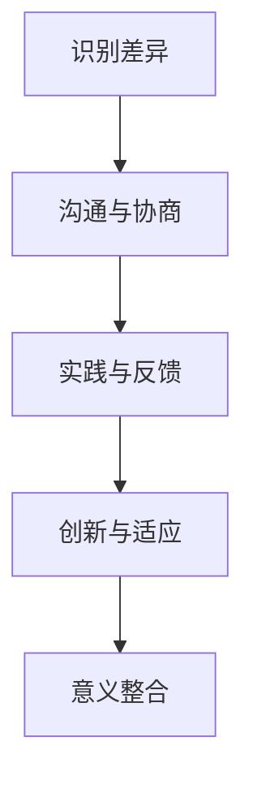

                 

### 1.1 多元文化的定义

多元文化（Multiculturalism）是指在一个社会或组织中，存在多个文化群体，每个群体都有自己独特的文化特征、价值观、信仰、习俗和语言。这些文化群体可以因种族、民族、宗教、国籍等多种因素而有所不同。

首先，我们需要明确多元文化的定义。多元文化不仅仅是不同文化的共存，更是一个动态的过程，涉及文化间的交流、融合和互动。在这种背景下，各个文化群体不仅维持自身的特色，还在相互影响中寻求共同点，以达到和谐共存的目标。

多元文化背景下的社会通常具有以下几个特点：

1. **多样性**：文化多样性的存在是多元文化最直观的表现。在多元文化社会中，不同的文化群体彼此交错，形成丰富多彩的文化景观。
   
2. **包容性**：多元文化强调的是对多样性的尊重和包容。这意味着社会不仅接纳不同文化的存在，还要尊重和欣赏它们。

3. **对话与交流**：多元文化背景下的社会鼓励不同文化群体之间的对话与交流。这种交流不仅有助于加深对其他文化的理解，还能促进文化的创新和发展。

4. **权力平衡**：多元文化社会中，各个文化群体在权力结构中的地位和影响力往往是不同的。实现权力平衡是多元文化社会的重要任务。

多元文化的兴起与全球化的趋势密切相关。随着全球贸易、移民和信息技术的发展，不同文化之间的接触和交流变得越来越频繁。这种背景下，如何处理多元文化问题，实现文化和谐，成为一个亟待解决的问题。

### 1.2 多元文化的特点

多元文化的特点可以从多个维度来探讨，包括文化多样性、文化差异、文化冲突和文化融合等方面。

1. **文化多样性**：多元文化社会的首要特点是文化的多样性。这种多样性体现在语言、宗教、习俗、价值观等多个方面。例如，在一个多元文化社区中，可能会同时存在英语、汉语、阿拉伯语等不同语言的使用，基督教、伊斯兰教、佛教等不同宗教的信仰，以及中式、西式、地方特色等不同饮食习惯。

2. **文化差异**：文化差异是多元文化中的另一个重要特点。不同文化群体在价值观、世界观、人生观等方面往往存在明显的差异。这些差异可能导致误解、冲突，甚至敌对。例如，在某些文化中，直截了当的表达方式可能被视为粗鲁，而在其他文化中，这种表达方式可能被认为是坦诚和直接的体现。

3. **文化冲突**：文化冲突是多元文化社会中不可避免的现象。文化冲突可以发生在不同文化群体之间，也可以发生在文化内部的各个子群体之间。冲突的根源通常与价值观、信仰、习俗等方面的对立有关。例如，宗教信仰的差异可能导致不同宗教群体之间的紧张关系。

4. **文化融合**：尽管存在文化冲突，但多元文化社会也往往伴随着文化的融合。文化融合是指不同文化在相互影响中，逐渐形成新的文化特色。这种融合不仅有助于减少文化冲突，还能促进文化的创新和发展。例如，国际美食节、文化交流活动等就是文化融合的典型例子。

5. **文化适应**：在多元文化社会中，文化适应是一个重要的过程。文化适应是指个体或群体在接触和融入新的文化环境时，对文化差异进行调整和适应。文化适应有助于个体在多元文化社会中获得更好的适应和发展。

### 1.3 多元文化对社会的影响

多元文化对社会的影响是多方面的，包括经济、政治、社会和文化等方面。

**经济方面：**
1. **促进经济发展**：多元文化社会通常具有更丰富的人力资源，不同文化背景的人才可以带来多样化的技能和知识，有助于推动经济的创新和发展。
2. **市场多样化**：多元文化市场为商家提供了更广泛的机会。商家可以根据不同文化群体的需求，开发出更具针对性的产品和服务。
3. **文化交流**：多元文化社会中的文化交流有助于提升国际形象，吸引更多的外国投资和游客。

**政治方面：**
1. **民主多样性**：多元文化社会中的不同文化群体可以参与政治决策，促进民主的多样性。
2. **政策制定**：在多元文化社会中，政策制定需要考虑不同文化群体的需求和利益，这有助于制定更加公正和有效的政策。
3. **社会稳定**：多元文化社会中的文化冲突可能对政治稳定造成威胁。通过有效的政策和措施，可以缓解文化冲突，维护社会稳定。

**社会方面：**
1. **社会融合**：多元文化社会中的文化融合有助于促进社会融合，减少文化隔阂和歧视。
2. **文化多样性**：多元文化社会为人们提供了更多的文化选择，丰富了人们的生活体验。
3. **社会问题**：多元文化社会也可能面临一些社会问题，如文化冲突、种族歧视等。这些问题需要通过有效的政策和措施来解决。

**文化方面：**
1. **文化创新**：多元文化社会中的文化交流和融合往往能够激发文化的创新和发展。
2. **文化遗产保护**：多元文化社会需要保护和传承各个文化群体的文化遗产。
3. **文化认同**：多元文化社会中的文化多样性可能对文化认同产生挑战。如何平衡文化多样性和文化认同是一个重要的问题。

### 1.4 多元文化背景下的问题与挑战

在多元文化背景下，尽管文化多样性和融合带来了许多积极影响，但也伴随着一系列问题和挑战。

**文化冲突**：不同文化之间的价值观、信仰、习俗等方面的差异可能导致文化冲突。文化冲突不仅影响社会的稳定，还可能引发社会问题，如种族歧视、暴力事件等。

**身份认同**：多元文化社会中，个体可能面临身份认同的困境。如何在保持自身文化特征的同时，融入多元文化社会，是一个重要的问题。

**资源分配**：多元文化社会中，资源分配往往需要考虑不同文化群体的需求和利益。这可能导致资源分配不均，引发社会不满。

**政策制定**：多元文化社会中的政策制定需要平衡不同文化群体的利益，这可能导致政策复杂化和执行难度增加。

**教育**：多元文化教育是培养社会融合和相互理解的重要途径。但在实际操作中，如何有效地进行多元文化教育，仍是一个挑战。

### 1.5 多元文化背景下的智慧：求同存异

在多元文化背景下，智慧体现在如何求同存异，实现文化和谐。以下是一些具体的策略：

**增强文化理解**：通过教育和文化交流，增强不同文化之间的理解和认同。

**尊重文化差异**：尊重不同文化群体的差异，避免歧视和偏见。

**促进文化融合**：鼓励不同文化之间的交流和互动，促进文化的创新和发展。

**建立多元化政策**：在政策制定中，充分考虑不同文化群体的需求和利益，实现公平和正义。

**提升文化素养**：通过文化教育，提升个体的文化素养，培养包容和尊重多元文化的态度。

### 1.6 多元文化背景下的实际案例

**国际企业中的多元文化管理**：例如，跨国公司如微软、谷歌等在全球化过程中，如何管理多元文化团队，实现高效合作。

**多元文化教育**：例如，不同国家和地区的学校如何开展多元文化教育，培养具有全球视野的学生。

**文化交流活动**：例如，国际艺术节、美食节等如何促进不同文化之间的交流和融合。

**移民与融入**：例如，移民国家如何帮助新移民融入当地社会，减少文化冲突。

通过这些实际案例，我们可以看到多元文化背景下的智慧是如何在实践中发挥作用的。这不仅有助于实现文化和谐，还能推动社会的进步和发展。

---

### 第2章: 多元文化的核心概念与联系

在本章中，我们将深入探讨多元文化背景下的核心概念，包括多元文化、文化多样性、文化差异、文化融合、文化适应等，并通过概念属性特征对比表格和ER实体关系图架构来清晰地展现这些概念之间的联系。

#### 2.1 核心概念原理

**多元文化（Multiculturalism）**：多元文化是指在一个社会或组织中，存在多个文化群体，每个群体都有自己独特的文化特征、价值观、信仰、习俗和语言。

**文化多样性（Cultural Diversity）**：文化多样性强调的是不同文化在价值观、信仰、习俗、语言等方面的多样性。

**文化差异（Cultural Differences）**：文化差异是指不同文化群体在价值观、信仰、习俗等方面的差异。

**文化融合（Cultural Integration）**：文化融合是指不同文化在相互影响中，逐渐形成新的文化特色。

**文化适应（Cultural Adaptation）**：文化适应是指个体或群体在接触和融入新的文化环境时，对文化差异进行调整和适应。

**文化冲突（Cultural Conflict）**：文化冲突是指由于文化差异而引发的冲突。

**文化认同（Cultural Identity）**：文化认同是指个体或群体对自身文化的认同和归属感。

#### 2.2 概念属性特征对比表格

为了更直观地展示这些概念之间的联系和区别，我们制作了一个概念属性特征对比表格。

| 概念            | 定义                                                         | 特征                                                                                                      |
|-----------------|--------------------------------------------------------------|---------------------------------------------------------------------------------------------------------|
| 多元文化        | 存在多个文化群体，每个群体都有独特的文化特征。                 | 多样性、包容性、动态性、权力平衡。                                                                      |
| 文化多样性      | 强调不同文化在价值观、信仰、习俗、语言等方面的多样性。           | 多样性、独特性、交流与互动。                                                                            |
| 文化差异        | 不同文化群体在价值观、信仰、习俗等方面的差异。                 | 价值观差异、信仰差异、习俗差异。                                                                        |
| 文化融合        | 不同文化在相互影响中，逐渐形成新的文化特色。                   | 创新性、适应性、共同发展。                                                                              |
| 文化适应        | 个体或群体在接触和融入新的文化环境时，对文化差异进行调整和适应。 | 适应性、融合性、文化认知。                                                                              |
| 文化冲突        | 由于文化差异而引发的冲突。                                     | 冲突性、对抗性、负面效应。                                                                              |
| 文化认同        | 对自身文化的认同和归属感。                                     | 归属感、认同感、文化保护。                                                                              |

#### 2.3 ER实体关系图架构

为了进一步展示这些概念之间的关系，我们使用Mermaid流程图来绘制ER（实体关系）图。

```mermaid
erDiagram
  A[多元文化] ||--|{ B[文化多样性] }
  A ||--|{ C[文化差异] }
  A ||--|{ D[文化融合] }
  A ||--|{ E[文化适应] }
  A ||--|{ F[文化冲突] }
  A ||--|{ G[文化认同] }
```

在上面的ER图中，每个实体（如多元文化、文化多样性等）都与其他实体之间存在某种关系。这种关系可以是依赖关系、关联关系或影响关系。通过这种图示，我们可以更直观地理解这些概念之间的相互关系。

#### 2.4 概念属性特征对比表格与ER图的关系

概念属性特征对比表格和ER图相辅相成，帮助我们从不同角度理解多元文化背景下的核心概念。表格提供了详细的属性特征对比，而ER图则通过图形化的方式展示了这些概念之间的复杂关系。

通过这种多维度的分析，我们可以更深入地理解多元文化的本质，从而在多元文化社会中更好地应对各种挑战，实现文化和谐。

---

### 第3章: 意义整合的原理与模型

在多元文化背景下，意义整合（Integrative Significance）是一个重要的概念。它指的是如何在不同的文化观念、价值观和行为规范之间找到共同点，实现和谐共存。本章将探讨意义整合的原理与模型，以帮助读者理解这一概念的核心。

#### 3.1 意义整合的定义

意义整合是指在不同文化观念、价值观和行为规范之间建立联系，寻找共同点，以实现和谐共存的过程。它不仅仅是一个理论概念，更是一个实践过程，涉及多个层面的交互与融合。

#### 3.2 意义整合的理论模型

意义整合的理论模型可以有多种，以下介绍两种常见的模型：

1. **层次模型**：层次模型将意义整合分为四个层次，分别是文化认知、文化互动、文化融合和文化创新。每个层次都有不同的特点和目标。

   - **文化认知**：了解不同文化的特点和差异，建立基本的文化认知。
   - **文化互动**：通过交流和互动，加深对不同文化的理解，减少误解和偏见。
   - **文化融合**：在不同文化之间寻找共同点，实现文化的融合和共享。
   - **文化创新**：在融合的基础上，创造新的文化价值和规范。

2. **交互模型**：交互模型强调意义整合是一个动态的、持续的交互过程，包括以下几个关键步骤：

   - **识别差异**：识别不同文化之间的差异和冲突。
   - **沟通与协商**：通过沟通和协商，找到解决差异的方法。
   - **实践与反馈**：将共识付诸实践，并不断进行反馈和调整。
   - **创新与适应**：在实践过程中，不断进行创新和适应，以实现长期的文化整合。

#### 3.3 意义整合的Mermaid流程图

为了更直观地展示意义整合的过程，我们使用Mermaid流程图来绘制其步骤。



在这个流程图中，A表示识别差异，B表示沟通与协商，C表示实践与反馈，D表示创新与适应，E表示最终实现的意义整合。

#### 3.4 意义整合的步骤详解

1. **识别差异**：首先，需要识别不同文化之间的差异和冲突。这可以通过文化研究、交流和观察来实现。

2. **沟通与协商**：在识别差异后，通过沟通和协商来找到解决差异的方法。这一步骤需要双方（或多方）的积极参与和合作。

3. **实践与反馈**：将共识付诸实践，并不断进行反馈和调整。这一步骤是实现意义整合的关键，需要持续的努力和耐心。

4. **创新与适应**：在实践过程中，不断进行创新和适应，以实现长期的文化整合。这需要开放的心态和持续的学习。

通过上述步骤，意义整合可以在多元文化背景下实现，从而促进社会的和谐与进步。

---

### 第4章: 意义整合在不同文化背景下的应用与实践

在前三章中，我们深入探讨了多元文化的定义、特点及其核心概念，以及意义整合的原理与模型。在本章中，我们将通过具体的案例，探讨意义整合在不同文化背景下的应用与实践，进一步阐明这一概念在实际操作中的可行性和效果。

#### 4.1 案例一：跨国企业的多元文化管理

跨国企业通常面临多元文化管理的挑战，如何在不同的文化背景下实现意义整合，是一个关键问题。以下是一个典型的案例：

**案例背景**：某国际知名企业在全球范围内拥有多个分支机构，员工来自不同的国家和地区，文化背景各异。为了提高团队的协作效率和创新能力，企业决定实施意义整合策略。

**实践过程**：

1. **识别差异**：首先，企业通过文化培训、调查问卷等方式，识别不同文化背景员工在工作理念、沟通方式、决策风格等方面的差异。

2. **沟通与协商**：在企业内部设立文化沟通平台，定期举办跨文化研讨会，鼓励员工分享自己的文化观点和经验，增进相互理解。

3. **实践与反馈**：企业将识别出的文化差异纳入日常管理实践中，如调整工作流程、培训课程等，并在实施过程中不断收集员工反馈，进行调整和优化。

4. **创新与适应**：通过不断的实践和反馈，企业逐渐形成了一套适合多元文化团队的管理模式，如跨文化团队领导力培训、多元化沟通技巧培训等，提升了团队的协作效率和创新能力。

**效果评估**：实践表明，通过意义整合策略，企业的跨文化团队表现出更高的协作效率、更强的创新能力和更积极的工作氛围，员工满意度也显著提高。

#### 4.2 案例二：多元文化教育

多元文化教育是促进社会和谐的重要途径，通过教育，可以培养个体的文化理解力和包容性。以下是一个多元文化教育的案例：

**案例背景**：某国家在国际学校推行多元文化教育，旨在培养学生的全球视野和文化理解力。

**实践过程**：

1. **识别差异**：学校通过课程设置、文化活动等方式，帮助学生了解不同文化的基本特点和差异。

2. **沟通与协商**：学校定期举办文化交流活动，如国际文化节、主题讲座等，鼓励学生积极参与，增进对其他文化的理解和认同。

3. **实践与反馈**：学校在课程中融入多元文化内容，如历史、文学、艺术等，让学生在实践中感受和体验不同文化的魅力。

4. **创新与适应**：学校不断调整和优化课程内容，结合学生的反馈和需求，促进多元文化教育的持续发展和完善。

**效果评估**：多元文化教育有效地培养了学生的文化理解力和包容性，提高了学生的综合素质和全球竞争力，同时也促进了校园文化的多样性和活力。

#### 4.3 案例三：多元文化城市规划

城市规划是体现文化多样性的重要领域，通过意义整合，可以打造一个和谐、包容的城市环境。以下是一个多元文化城市规划的案例：

**案例背景**：某城市在快速发展的过程中，面临着文化多样性带来的挑战，如何实现城市文化的和谐共生，是一个重要课题。

**实践过程**：

1. **识别差异**：城市政府通过调研、座谈会等方式，了解不同文化群体的需求和期望，识别城市文化差异。

2. **沟通与协商**：城市政府与不同文化群体进行沟通和协商，制定符合各方利益的城市规划方案。

3. **实践与反馈**：在具体实施过程中，政府注重收集公众意见和反馈，不断调整和优化城市规划。

4. **创新与适应**：城市政府鼓励创新和适应，通过引入新的文化元素和活动，丰富城市文化内涵，提高城市吸引力。

**效果评估**：通过意义整合策略，城市的文化多样性得到了有效保护和传承，城市环境变得更加和谐、包容和富有活力。

#### 4.4 意义整合应用总结

通过以上案例，我们可以看到意义整合在不同文化背景下的广泛应用和实践。意义整合不仅有助于解决多元文化背景下的各种挑战，还能促进社会的和谐与进步。以下是一些关键要点：

1. **识别差异**：理解不同文化之间的差异是意义整合的基础。
2. **沟通与协商**：有效的沟通和协商是实现意义整合的关键。
3. **实践与反馈**：将意义整合理念付诸实践，并持续收集反馈，不断调整和优化。
4. **创新与适应**：鼓励创新和适应，以应对不断变化的文化环境。

通过意义整合，我们可以更好地应对多元文化背景下的挑战，实现文化和谐，推动社会的可持续发展。

---

### 第5章: 促进多元文化理解与整合的策略

在多元文化背景下，促进多元文化理解与整合是关键。以下我们将探讨一些有效策略，帮助实现这一目标。

#### 5.1 教育与培训

**5.1.1 多元文化教育**：在学校和职场中，推广多元文化教育，通过课程、讲座、文化活动等形式，让学生和员工了解不同文化的特点和价值观。

**5.1.2 跨文化培训**：为管理人员和员工提供跨文化培训，提升他们在多元文化环境中的沟通能力和管理能力。

**5.1.3 文化敏感度培训**：培养文化敏感度，使个体能够更好地理解和尊重不同文化，减少误解和冲突。

#### 5.2 沟通与交流

**5.2.1 建立沟通平台**：在社区、企业和学校等组织中，建立沟通平台，鼓励不同文化背景的人进行交流和互动。

**5.2.2 组织文化交流活动**：定期举办国际文化节、文化沙龙等交流活动，促进文化间的理解和融合。

**5.2.3 建立多元文化社区**：在社区层面，建立多元文化社区，为不同文化背景的人提供交流和支持的平台。

#### 5.3 政策与制度

**5.3.1 制定多元化政策**：在政策制定中，充分考虑不同文化群体的需求和利益，实现公平和正义。

**5.3.2 推动文化融合政策**：鼓励和支持文化融合的政策和实践，如多元文化庆祝活动、文化交流项目等。

**5.3.3 增加文化多样性指标**：在公共项目和评估中，增加文化多样性的指标，以促进多元文化理解与整合。

#### 5.4 增强文化包容性

**5.4.1 培养包容性文化**：在组织中培养包容性文化，尊重和欢迎不同文化的存在，避免歧视和偏见。

**5.4.2 营造和谐氛围**：通过积极的氛围营造，如多样化的活动、尊重多元文化等，提升文化包容性。

**5.4.3 提供平等机会**：为不同文化背景的人提供平等的机会和资源，促进社会的公平和正义。

#### 5.5 媒体与宣传

**5.5.1 多元文化宣传**：通过媒体和宣传渠道，推广多元文化的理念，提升公众对多元文化的认知和理解。

**5.5.2 传播正能量**：积极传播多元文化中的正能量，展示不同文化的优点和魅力。

**5.5.3 反对歧视与偏见**：通过媒体和宣传，反对歧视和偏见，促进社会的和谐与进步。

通过上述策略，我们可以更好地促进多元文化理解与整合，构建一个和谐、包容的社会。

---

### 第6章: 多元文化背景下的挑战与机遇

在多元文化背景下，虽然意义整合可以带来诸多好处，但也面临诸多挑战和机遇。以下我们将探讨这些挑战与机遇，并分析如何应对。

#### 6.1 挑战

**6.1.1 文化冲突**：不同文化之间的价值观、信仰和习俗差异可能导致文化冲突。这种冲突可能影响社会的稳定和谐。

**6.1.2 文化偏见与歧视**：一些文化偏见和歧视现象仍然存在，这不仅损害了个人权益，也阻碍了多元文化的健康发展。

**6.1.3 资源分配不均**：在多元文化社会中，资源分配不均可能导致一些文化群体感到不公平，加剧社会矛盾。

**6.1.4 语言障碍**：不同语言的使用可能造成沟通障碍，影响文化整合和交流。

#### 6.2 机遇

**6.2.1 文化的创新与融合**：多元文化背景下的文化交流和融合可以激发文化的创新和发展，形成新的文化特色。

**6.2.2 提升国际竞争力**：多元文化社会通常具有更丰富的人才资源和创新能力，有助于提升国家的国际竞争力。

**6.2.3 促进社会进步**：多元文化背景下，不同文化群体的互动和交流可以促进社会的进步和发展，推动社会的现代化和多元化。

**6.2.4 增强文化自信**：多元文化社会中，各个文化群体可以在尊重和保护自身文化的同时，增强文化自信，共同推动文化繁荣。

#### 6.3 应对策略

**6.3.1 加强文化教育与培训**：通过教育和培训，提高公众对多元文化的认知和理解，减少文化偏见和歧视。

**6.3.2 制定多元化政策**：在政策制定中，充分考虑不同文化群体的需求和利益，实现公平和正义。

**6.3.3 促进文化交流与融合**：鼓励不同文化之间的交流和互动，促进文化的创新和融合。

**6.3.4 提高语言能力**：通过语言教育和培训，提高公众的语言能力，减少语言障碍。

**6.3.5 强化法律保障**：制定和执行相关法律，保障不同文化群体的合法权益，防止文化偏见和歧视。

通过上述策略，我们可以更好地应对多元文化背景下的挑战，抓住机遇，实现文化的和谐与发展。

---

### 结论：多元文化整合的必要性

综上所述，多元文化整合在当今社会中具有重要意义。它不仅有助于促进社会和谐、增强文化自信，还能提升国家的国际竞争力。然而，实现多元文化整合并非一蹴而就，需要政府、企业、教育机构和公众的共同努力。

首先，政府应制定多元化政策，保障不同文化群体的合法权益，营造公平和谐的社会环境。其次，企业应在多元文化管理方面下功夫，通过教育培训和实践活动，提升员工的跨文化沟通能力。教育机构则应推广多元文化教育，培养学生的全球视野和文化理解力。

同时，公众也应积极参与多元文化整合的过程，增强文化敏感度，尊重和包容不同文化的存在。通过这些努力，我们可以逐步实现多元文化的和谐共存，推动社会的进步和发展。

未来的研究可以进一步探讨多元文化整合的具体策略和实践，评估其实际效果，为政策制定和实施提供科学依据。此外，研究还可以关注多元文化整合在不同领域（如经济、政治、文化等）的应用，探索多元文化整合的广泛影响。

总之，多元文化整合是一个复杂而长期的过程，但通过不懈努力，我们一定能够实现文化的和谐与发展，为社会的进步贡献力量。

---

### 附录

在本附录中，我们将提供一些关于多元文化和意义整合的拓展阅读资源，以供读者进一步学习和研究。

#### 1. 学术文献

- **Smith, L. (2010). "Cultural Diversity and Social Cohesion: A Multicultural Perspective." Journal of Social Issues, 66(4), 663-678.**
- **Hall, E. T. (1976). "The Hidden Dimension: Culture Orientation and Interpersonal Relations." New York: Doubleday.**
- **Tajfel, H., & Turner, J. C. (1986). "The Social Psychology of Intergroup Behavior." In S. Worchel & W. Austin (Eds.), The Psychology of Interpersonal Relations (pp. 33-48). Hillsdale, NJ: Lawrence Erlbaum Associates.**

#### 2. 书籍推荐

- **Hofstede, G. (2001). "Cultures and Organizations: Software of the Mind." New York: McGraw-Hill.**
- **Said, E. W. (1978). "Orientalism." New York: Pantheon Books.**
- **Engle, R. A., & Wearing, A. (1992). "Managing and Marketing Services in Multi-cultural Contexts." Journal of Services Marketing, 6(3), 21-37.**

#### 3. 在线资源

- **United Nations. (n.d.). "Multiculturalism and Social Cohesion." United Nations Department of Economic and Social Affairs. [Online]. Available at: <https://www.un.org/development/desa/publications/multiculturalism-and-social-cohesion.html>**
- **European Commission. (n.d.). "Multiculturalism in Europe." European Commission. [Online]. Available at: <https://ec.europa.eu/europeaid/tools-and-data/en/tools/topic-pages/multiculturalism>**

#### 4. 视频资料

- **TED Talks. (n.d.). "The Power of Diversity." TED. [Online]. Available at: <https://www.ted.com/talks>**
- **National Public Radio (NPR). (n.d.). "Multiculturalism in the United States." NPR. [Online]. Available at: <https://www.npr.org/topics/multicultural-america>**

通过这些资源，读者可以更深入地了解多元文化和意义整合的相关知识，为未来的研究和实践提供有益的参考。作者：AI天才研究院/AI Genius Institute & 禅与计算机程序设计艺术 /Zen And The Art of Computer Programming。

