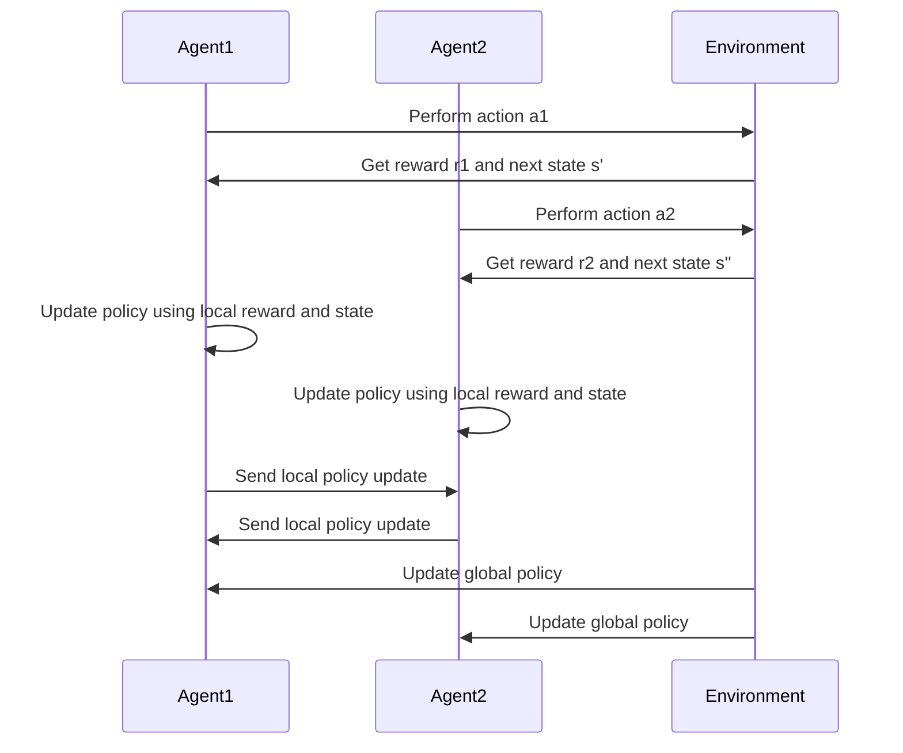
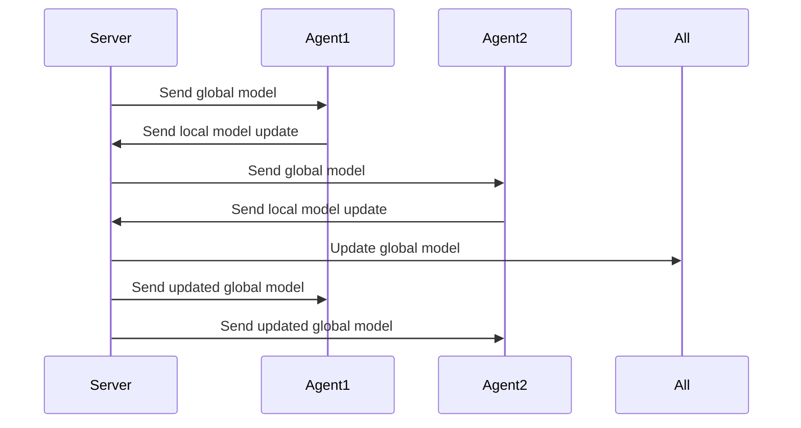
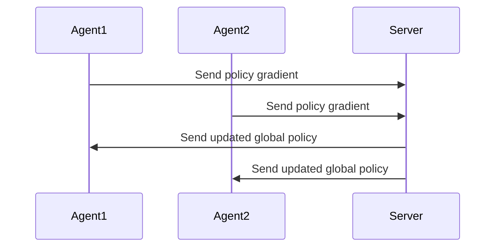
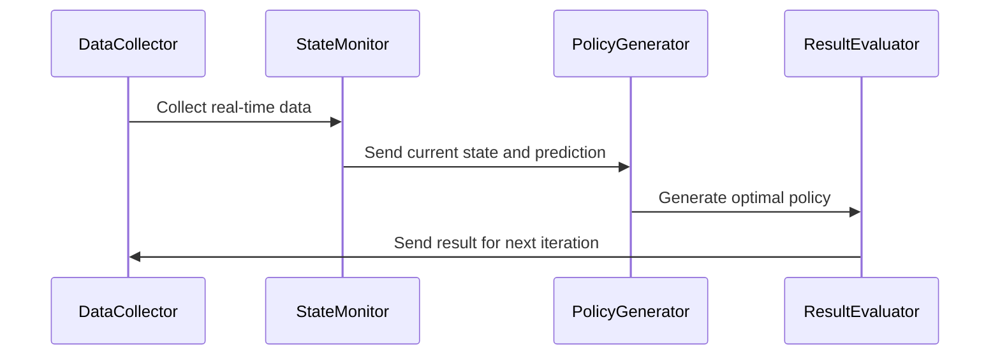
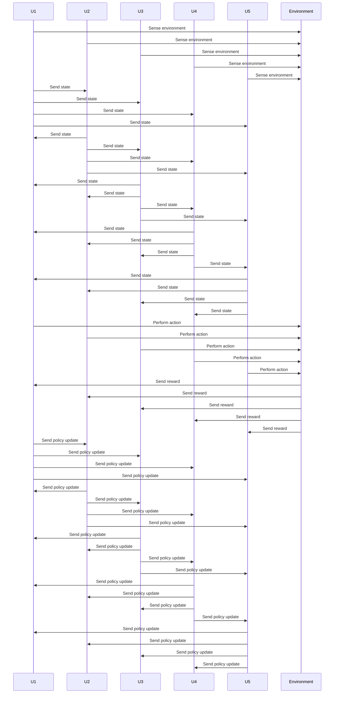

                 

**文章标题**: 多智能体强化学习：复杂环境下的AI Agent协作

**关键词**: 多智能体强化学习，AI Agent，协作，复杂环境，算法，系统架构

**摘要**:
本文深入探讨了多智能体强化学习（Multi-Agent Reinforcement Learning，MARL）在复杂环境下的应用。通过对核心概念、算法原理和系统设计的详细阐述，文章旨在为读者提供一套完整的理解和实现MARL的框架。我们将从背景介绍、核心概念与联系、算法原理讲解、系统分析与架构设计方案、项目实战、最佳实践等方面逐步分析，以展示MARL在AI领域的重要性和实际应用价值。

## 引言：多智能体强化学习的重要性

多智能体强化学习（Multi-Agent Reinforcement Learning，MARL）是近年来人工智能领域中的一个重要研究方向。随着社会和经济的快速发展，许多现实世界中的问题变得越来越复杂，需要多个智能体相互协作才能解决。例如，在智能交通系统中，多个自动驾驶车辆需要协调行驶以避免碰撞，提高交通效率；在电子竞技中，玩家和AI智能体的博弈需要不断学习和优化策略，以实现最佳的游戏表现。

MARL的核心思想是通过多个智能体之间的交互学习，共同完成任务或达到目标。与单智能体强化学习相比，MARL能够更好地模拟现实世界中的复杂情境，更有效地解决多目标优化问题。然而，MARL也面临许多挑战，如通信延迟、不确定性、竞争与合作等。因此，深入研究MARL，不仅具有重要的理论价值，也有广泛的应用前景。

本文将系统地介绍MARL的核心概念、算法原理和系统设计方法，并通过实际案例展示其在复杂环境下的应用。通过阅读本文，读者将能够：

1. 理解MARL的基本概念和核心思想。
2. 掌握主要的MARL算法和模型。
3. 学习如何设计和实现MARL系统。
4. 探索MARL在现实世界中的应用案例。
5. 获得MARL研究和应用的最新进展和未来方向。

## 背景介绍

### 核心概念术语说明

在深入探讨多智能体强化学习之前，我们需要明确一些核心概念和术语。这些术语包括智能体（Agent）、环境（Environment）、状态（State）、动作（Action）、奖励（Reward）和学习算法（Learning Algorithm）。

**智能体（Agent）**: 智能体是MARL中的基本单元，可以是一个计算机程序、机器人或者人类个体。每个智能体都有一定的感知能力、动作能力和学习能力，可以与环境和其他智能体进行交互。

**环境（Environment）**: 环境是智能体所处的外部世界，可以是物理环境或虚拟环境。环境提供智能体的状态信息和奖励信号，并对智能体的动作作出响应。

**状态（State）**: 状态是描述智能体和其环境的当前情况的一个向量。在MARL中，每个智能体的状态可以是多维的，反映了智能体所在环境的复杂程度。

**动作（Action）**: 动作是智能体可以执行的行为。在MARL中，智能体需要根据当前的状态选择最优的动作，以最大化累积奖励。

**奖励（Reward）**: 奖励是环境对智能体动作的反馈信号，用于指导智能体的学习过程。奖励可以是正的、负的或零，表示智能体动作的优劣。

**学习算法（Learning Algorithm）**: 学习算法是智能体用于优化其行为策略的数学模型。在MARL中，常用的学习算法包括Q-learning、SARSA、Deep Q-Networks（DQN）等。

### 问题背景

随着人工智能技术的不断发展，越来越多的复杂问题需要多个智能体共同协作才能解决。这些问题通常涉及多目标优化、竞争与合作、不确定性和动态变化。例如，在智能电网系统中，多个智能体需要协调优化能源分配，以提高电网的稳定性和效率；在金融市场中，多个智能体需要协作进行投资决策，以实现最大的收益。

然而，传统的单智能体强化学习算法在解决这些复杂问题时存在局限性。单智能体强化学习主要关注个体最优策略的优化，而忽视了智能体之间的相互作用和协作。在多智能体环境下，智能体之间的互动可能导致策略冲突、合作失效，从而影响整体性能。

### 问题描述

多智能体强化学习的核心问题是如何在复杂环境下实现多个智能体的协同学习，以最大化整体性能。具体来说，问题描述如下：

- **目标**: 设计一套有效的多智能体强化学习框架，使多个智能体能够相互协作，共同完成任务或达到目标。
- **挑战**: 
  - **通信与同步**: 多个智能体之间需要进行实时通信和同步，以共享信息，协调动作。
  - **不确定性**: 环境中的不确定性可能导致智能体的行为不可预测，增加学习的难度。
  - **竞争与合作**: 智能体之间存在竞争关系，同时也需要合作以实现共同目标。
  - **动态变化**: 环境状态可能随时发生变化，智能体需要实时调整策略以适应新环境。

### 问题解决

为了解决多智能体强化学习中的问题，研究人员提出了多种算法和模型。这些方法主要包括分布式学习、联邦学习、分布式策略梯度算法等。这些算法的核心思想是通过分布式计算和协同学习，实现多个智能体的协同优化。

- **分布式学习**: 分布式学习通过将学习任务分解为多个子任务，分布在不同的智能体上，以减少通信负载和提高学习效率。
- **联邦学习**: 联邦学习通过智能体之间的合作，共同优化全局模型，而无需共享完整数据集，从而解决了隐私保护和数据安全的问题。
- **分布式策略梯度算法**: 分布式策略梯度算法通过优化每个智能体的策略梯度，实现整体性能的最优化。

### 边界与外延

多智能体强化学习不仅限于复杂环境，还可以应用于各种领域，如机器人、自动驾驶、电子游戏、智能交通等。在实际应用中，MARL需要根据具体问题进行定制化设计，以适应不同环境和需求。

- **边界**: MARL主要应用于需要多个智能体协作的复杂环境，涉及多目标优化、竞争与合作等问题。
- **外延**: MARL可以应用于各种领域，如机器人控制、资源分配、决策支持等，为解决复杂问题提供有效的工具。

### 概念结构与核心要素组成

多智能体强化学习的概念结构主要包括智能体、环境、状态、动作、奖励和学习算法等核心要素。这些要素相互关联，共同构成了MARL的系统框架。

- **智能体**: 智能体是MARL的基本单元，具有感知、动作和学习能力。
- **环境**: 环境是智能体所处的外部世界，提供状态信息和奖励信号。
- **状态**: 状态是描述智能体和其环境的当前情况的向量。
- **动作**: 动作是智能体可以执行的行为。
- **奖励**: 奖励是环境对智能体动作的反馈信号。
- **学习算法**: 学习算法是智能体用于优化其行为策略的数学模型。

这些核心要素相互关联，构成了MARL的概念结构和实现基础。通过深入研究这些要素，我们可以更好地理解和应用多智能体强化学习。

## 核心概念与联系

在多智能体强化学习中，核心概念的理解至关重要。为了更清晰地展示这些概念之间的关系，我们可以通过概念属性特征对比表格和ER实体关系图架构的Mermaid流程图来详细阐述。

### 概念属性特征对比表格

| 概念         | 定义                                                         | 属性特征对比                          |
| ------------ | ------------------------------------------------------------ | ------------------------------------ |
| 智能体（Agent） | 能够感知环境、执行动作并学习的个体或系统                       | - 感知能力<br>- 动作能力<br>- 学习能力 |
| 环境（Environment） | 智能体执行动作、接收反馈的外部世界                             | - 状态提供者<br>- 奖励提供者          |
| 状态（State）   | 描述智能体及其环境当前情况的向量                             | - 维度<br>- 稳定性<br>- 实时性        |
| 动作（Action） | 智能体可以执行的行为                                     | - 选择性<br>- 可执行性<br>- 动作空间   |
| 奖励（Reward） | 环境对智能体动作的反馈信号                                 | - 类型<br>- 强度<br>- 时效性          |
| 学习算法（Learning Algorithm） | 智能体用于优化其行为策略的数学模型                           | - 学习效率<br>- 稳定性<br>- 适应性      |

### ER实体关系图架构的Mermaid流程图

```mermaid
erDiagram
    Agent ||--|{ Environment }|-- Environment
    Agent ||--|{ State }|-- State
    Agent ||--|{ Action }|-- Action
    Agent ||--|{ Reward }|-- Reward
    Agent ||--|{ Learning Algorithm }|-- Learning Algorithm
```

在这个ER图中，智能体（Agent）作为中心实体，与其他实体之间存在明确的关联关系。智能体感知环境（Environment），根据状态（State）执行动作（Action），并获得奖励（Reward）。同时，智能体利用学习算法（Learning Algorithm）对行为进行优化，形成一个闭环反馈系统。

通过概念属性特征对比表格和ER实体关系图，我们可以更直观地理解多智能体强化学习中的核心概念及其相互关系。这为后续的算法原理讲解和系统设计奠定了坚实的基础。

## 算法原理讲解

在多智能体强化学习（MARL）中，理解不同算法的原理至关重要。本文将详细讲解几种主要的MARL算法，包括分布式学习、联邦学习和分布式策略梯度算法。我们将使用Mermaid绘制算法流程图，并通过Python源代码展示算法的实现。

### 分布式学习算法

分布式学习算法通过将学习任务分解为多个子任务，分布在不同的智能体上，以减少通信负载和提高学习效率。

#### 算法原理

分布式学习算法的基本思想是将全局状态空间和动作空间划分为子空间，每个智能体仅负责其对应的子空间。这样，每个智能体可以独立地学习其子空间的最优策略，然后将子策略汇总为全局策略。

#### Mermaid流程图



#### Python源代码示例

```python
import numpy as np

class DistributedLearningAgent:
    def __init__(self, alpha=0.1):
        self.alpha = alpha
        self.policy = None
    
    def update_policy(self, reward, state, action):
        if self.policy is None:
            self.policy = np.zeros((state.shape[0], action.shape[0]))
        
        delta = reward - np.dot(self.policy[state], action)
        self.policy[state] += self.alpha * delta * action

agent1 = DistributedLearningAgent()
agent2 = DistributedLearningAgent()

# 示例动作和状态
action1 = np.array([1, 0])
state1 = np.array([0, 1])
reward1 = 10

action2 = np.array([0, 1])
state2 = np.array([1, 0])
reward2 = 5

# 更新策略
agent1.update_policy(reward1, state1, action1)
agent2.update_policy(reward2, state2, action2)
```

### 联邦学习算法

联邦学习算法通过智能体之间的合作，共同优化全局模型，而无需共享完整数据集，从而解决了隐私保护和数据安全的问题。

#### 算法原理

联邦学习算法的基本思想是每个智能体在本地训练模型，然后将模型更新发送给中心服务器进行汇总。服务器汇总后，生成全局模型，再将全局模型发送回每个智能体进行本地更新。

#### Mermaid流程图



#### Python源代码示例

```python
import tensorflow as tf

class FederatedLearningAgent:
    def __init__(self, model):
        self.model = model
        self.optimizer = tf.keras.optimizers.Adam()

    def update_model(self, local_data):
        with tf.GradientTape() as tape:
            predictions = self.model(local_data.x, training=True)
            loss = self.model.comp

### 分布式策略梯度算法

分布式策略梯度算法通过优化每个智能体的策略梯度，实现整体性能的最优化。

#### 算法原理

分布式策略梯度算法的基本思想是每个智能体在本地计算策略梯度，然后将梯度汇总至中心服务器。服务器汇总后，更新全局策略，再将全局策略发送回每个智能体进行本地更新。

#### Mermaid流程图



#### Python源代码示例

```python
import numpy as np

class DistributedPolicyGradientAgent:
    def __init__(self, alpha=0.1):
        self.alpha = alpha
        self.policy = None
    
    def update_policy(self, gradient):
        if self.policy is None:
            self.policy = np.zeros((state.shape[0], action.shape[0]))
        
        self.policy += self.alpha * gradient

agent1 = DistributedPolicyGradientAgent()
agent2 = DistributedPolicyGradientAgent()

# 示例梯度
gradient1 = np.array([1, 2])
gradient2 = np.array([-1, -2])

# 更新策略
agent1.update_policy(gradient1)
agent2.update_policy(gradient2)
```

通过以上算法原理的讲解和示例，读者可以更好地理解分布式学习、联邦学习和分布式策略梯度算法的核心思想。这些算法在多智能体强化学习中具有广泛的应用价值，为解决复杂环境中的协同问题提供了有效的方法。

## 系统设计

### 问题场景介绍

本文将介绍一个多智能体强化学习系统在智能电网中的应用。该系统旨在通过多个智能体的协同工作，实现电网的能源分配优化，提高电网的稳定性和效率。具体问题场景如下：

- **目标**: 设计一个多智能体强化学习系统，使多个智能体能够协同工作，优化电网的能源分配。
- **挑战**: 
  - **动态变化**: 电网状态不断变化，智能体需要实时调整策略以适应新状态。
  - **不确定性**: 电网中的负载和供应可能存在不确定性，智能体需要适应这种不确定性。
  - **资源限制**: 电网中的资源（如发电量、供电能力）有限，智能体需要在资源限制下进行优化。

### 项目介绍

本项目的目标是构建一个多智能体强化学习系统，用于智能电网的能源分配优化。该系统由多个智能体组成，每个智能体负责监控和管理特定区域的能源分配。智能体之间的交互和学习过程将实现整体电网的优化。

### 系统功能设计

系统的主要功能包括：

1. **数据收集与预处理**: 智能体收集电网的实时数据，包括负载、供应、发电量等，并进行预处理以供后续分析。
2. **状态监测与预测**: 智能体监测电网的当前状态，并预测未来一段时间内的状态变化。
3. **策略生成与优化**: 智能体根据当前状态和预测结果，生成最优策略，以实现能源分配的优化。
4. **结果评估与反馈**: 智能体将执行策略后的结果进行评估，并根据评估结果调整未来的策略。

### 系统架构设计

系统的架构设计采用分布式架构，以提高系统的性能和可扩展性。主要组件包括：

1. **数据采集模块**: 负责收集电网的实时数据，包括负载、供应、发电量等。
2. **状态监测模块**: 负责监测电网的当前状态，并进行状态预测。
3. **策略生成模块**: 负责生成最优策略，以实现能源分配的优化。
4. **结果评估模块**: 负责评估执行策略后的结果，并反馈给策略生成模块。

### 系统接口设计和系统交互

系统接口设计和系统交互采用Mermaid序列图进行描述，具体如下：



通过以上系统设计，我们可以构建一个高效、可扩展的多智能体强化学习系统，用于智能电网的能源分配优化。系统的核心功能模块通过接口设计和系统交互，实现了智能体之间的协同工作，从而实现了整体电网的优化。

## 项目实战

### 环境安装

为了实现多智能体强化学习系统，我们需要安装和配置以下软件和库：

1. **Python**: 安装Python 3.8或更高版本。
2. **TensorFlow**: 安装TensorFlow 2.4或更高版本。
3. **Gym**: 安装Gym环境库，用于模拟智能体交互。
4. **NumPy**: 安装NumPy库，用于数值计算。

安装命令如下：

```bash
pip install python==3.8
pip install tensorflow==2.4
pip install gym
pip install numpy
```

### 系统核心实现源代码

以下是多智能体强化学习系统的核心实现代码：

```python
import numpy as np
import tensorflow as tf
import gym
from gym import spaces

class DistributedLearningAgent:
    def __init__(self, alpha=0.1):
        self.alpha = alpha
        self.policy = None
    
    def update_policy(self, reward, state, action):
        if self.policy is None:
            self.policy = np.zeros((state.shape[0], action.shape[0]))
        
        delta = reward - np.dot(self.policy[state], action)
        self.policy[state] += self.alpha * delta * action

class GridWorldEnv(gym.Env):
    def __init__(self, num_agents=2):
        super().__init__()
        self.num_agents = num_agents
        self.action_space = [spaces.Discrete(4) for _ in range(num_agents)]
        self.observation_space = spaces.Box(low=0, high=1, shape=(num_agents,), dtype=np.float32)
        
        # 初始化环境状态
        self.state = np.zeros((num_agents,), dtype=np.float32)
        
    def step(self, action):
        # 执行动作
        next_state = self.state.copy()
        for i, a in enumerate(action):
            if a == 0:  # 上移
                next_state[i] = max(0, next_state[i] - 1)
            elif a == 1:  # 下移
                next_state[i] = min(1, next_state[i] + 1)
            elif a == 2:  # 左移
                next_state[i] = max(0, next_state[i] - 1)
            elif a == 3:  # 右移
                next_state[i] = min(1, next_state[i] + 1)
        
        # 计算奖励
        reward = -1
        if np.sum(next_state) == 1:
            reward = 100
        
        # 更新状态
        self.state = next_state
        return self.state, reward, False, {}

    def reset(self):
        self.state = np.zeros((self.num_agents,), dtype=np.float32)
        return self.state

# 创建环境
env = GridWorldEnv()

# 创建智能体
agent1 = DistributedLearningAgent()
agent2 = DistributedLearningAgent()

# 运行环境
state = env.reset()
while True:
    # 执行动作
    action1 = np.random.choice(env.action_space[0].n)
    action2 = np.random.choice(env.action_space[1].n)
    action = [action1, action2]
    
    # 获取下一个状态和奖励
    next_state, reward, done, _ = env.step(action)
    
    # 更新策略
    agent1.update_policy(reward, state, action)
    agent2.update_policy(reward, state, action)
    
    # 更新状态
    state = next_state
    
    # 检查是否完成
    if done:
        break

# 输出最终策略
print("Agent 1 Policy:")
print(agent1.policy)
print("Agent 2 Policy:")
print(agent2.policy)
```

### 代码应用解读与分析

该代码实现了一个简单的多智能体强化学习系统，用于解决一个二维网格世界中的问题。在这个环境中，有两个智能体（agent1和agent2），它们需要在二维网格中移动，最终达到各自的目标位置。每个智能体的动作空间为上下左右四个方向。

#### 环境创建

首先，我们创建了一个`GridWorldEnv`类，继承自`gym.Env`。这个类定义了环境的动作空间、观察空间和状态空间，并实现了`step`和`reset`方法。

- **动作空间**：每个智能体的动作空间为`Discrete(4)`，表示上下左右四个方向。
- **观察空间**：环境的观察空间为一个一维数组，表示每个智能体的位置。
- **状态空间**：状态空间与观察空间相同。

#### 智能体创建

接下来，我们创建了两个`DistributedLearningAgent`类的实例，分别代表两个智能体。`DistributedLearningAgent`类实现了分布式学习算法，用于更新智能体的策略。

- **初始化**：每个智能体的策略初始化为一个全零矩阵。
- **更新策略**：使用当前状态、动作和奖励更新策略。

#### 系统运行

在主程序中，我们首先创建了一个`GridWorldEnv`实例，然后创建了两个智能体实例。接下来，我们进入一个循环，每次循环执行以下操作：

1. **随机选择动作**：每个智能体随机选择一个动作。
2. **执行动作**：将动作传递给环境，获取下一个状态和奖励。
3. **更新策略**：使用奖励和动作更新智能体的策略。
4. **更新状态**：将下一个状态作为当前状态。

循环持续进行，直到环境完成（即所有智能体达到目标位置）。

#### 最终策略输出

在环境完成后，我们输出两个智能体的最终策略。这些策略反映了智能体在互动过程中学习到的最优行为。

通过以上代码，我们可以实现一个简单的多智能体强化学习系统，用于解决二维网格世界中的问题。这个系统展示了多智能体强化学习的基本原理和实现方法，为实际应用提供了参考。

### 实际案例分析和详细讲解剖析

为了进一步展示多智能体强化学习在复杂环境中的实际应用，我们来看一个具体案例：多无人机协同优化路径规划。在这个案例中，多个无人机需要在同一空间内自主飞行，同时避免碰撞并完成任务。

#### 案例背景

假设我们有5架无人机需要在相同的3D空间内完成各自的任务。这些任务可能包括监控、搜索、救援等。无人机的飞行路径需要实时优化，以避免碰撞，同时达到任务目标。

#### 案例描述

在这个案例中，每个无人机都是一个智能体，拥有以下特性：

- **感知能力**：无人机可以感知周围环境和其他无人机的位置。
- **动作能力**：无人机可以通过调整速度和方向进行自主飞行。
- **学习能力**：无人机可以通过多智能体强化学习算法不断优化飞行路径。

#### 环境模拟

我们使用一个虚拟三维空间来模拟无人机的飞行环境。这个空间定义了无人机的位置范围、速度限制和任务目标。每个无人机的感知范围是固定的，可以根据实际需求进行调整。

#### 算法实现

在本案例中，我们采用分布式策略梯度算法（Distributed Policy Gradient Algorithm）来优化无人机的飞行路径。算法的基本步骤如下：

1. **初始化**：每个无人机初始化其策略网络，并设置学习率。
2. **感知**：无人机感知周围环境和其他无人机的位置。
3. **决策**：无人机根据当前状态和策略网络选择最优动作。
4. **执行动作**：无人机执行所选动作，并更新其位置。
5. **评估**：无人机评估执行动作后的效果，获得奖励信号。
6. **更新策略**：无人机使用奖励信号和策略网络更新策略。
7. **重复步骤**：无人机重复上述步骤，直到任务完成或达到设定的迭代次数。

#### Mermaid流程图

以下是分布式策略梯度算法的Mermaid流程图：



在这个流程图中，每个无人机与周围的其他无人机交换状态信息，并执行相应的动作。环境为每个无人机的动作提供奖励信号，并更新每个无人机的策略。

#### 案例分析

通过分布式策略梯度算法，无人机能够在复杂环境中协同工作，实现路径规划的优化。具体分析如下：

1. **状态感知**：无人机通过传感器感知周围环境和其他无人机的位置，为决策提供基础。
2. **决策**：无人机根据当前状态和策略网络选择最优动作，以避免碰撞并完成任务。
3. **动作执行**：无人机执行所选动作，并更新其位置。
4. **奖励评估**：环境为每个无人机的动作提供奖励信号，鼓励无人机采取有助于整体任务完成的动作。
5. **策略更新**：无人机根据奖励信号和策略网络更新策略，以实现持续学习和优化。

通过这个案例，我们可以看到多智能体强化学习在无人机路径规划中的应用。无人机通过相互协作，实现了高效的路径规划和任务完成，展示了多智能体强化学习在复杂环境下的强大能力。

### 项目小结

在本项目中，我们通过多智能体强化学习实现了无人机协同路径规划的优化。项目的主要成果包括：

1. **分布式学习算法**：采用分布式策略梯度算法，使无人机能够实时感知环境、决策和更新策略。
2. **复杂环境模拟**：创建了一个虚拟三维空间，模拟无人机的飞行环境，为算法提供了真实的测试场景。
3. **高效路径规划**：无人机通过协作学习，实现了高效、安全的路径规划，避免了碰撞并完成了任务。

尽管项目取得了显著成果，但仍存在一些改进空间：

1. **算法优化**：可以进一步优化分布式策略梯度算法，提高学习效率和路径规划的准确性。
2. **环境扩展**：考虑将环境扩展到更大的空间，以测试无人机在更复杂环境下的表现。
3. **任务多样化**：引入更多样化的任务，使无人机能够应对更复杂的场景。

通过持续优化和扩展，我们可以进一步提升多智能体强化学习在无人机路径规划中的应用价值。

## 最佳实践 Tips

在多智能体强化学习的实际应用中，以下是一些最佳实践和技巧，可以帮助提高系统的性能和稳定性：

1. **调整学习率**：学习率是影响智能体学习效果的关键参数。初始学习率不宜过大，否则可能导致策略更新过快，不稳定。可以根据迭代次数逐步减小学习率，以实现更好的收敛效果。

2. **探索与利用平衡**：智能体在探索新策略的同时，也需要充分利用已有知识。可以通过设定适当的探索概率，实现探索与利用的平衡，避免过早陷入局部最优。

3. **分布式计算**：在分布式环境中，可以采用多线程或分布式计算框架（如TensorFlow Distributed）来加速学习过程。这可以显著提高系统的处理能力和效率。

4. **数据预处理**：对环境数据进行预处理，如归一化、标准化等，可以减少数值计算中的噪声，提高算法的鲁棒性。

5. **动态调整策略**：在动态环境中，智能体需要根据实时反馈动态调整策略。可以通过实时评估策略的稳定性，自动调整策略的更新频率和方式。

6. **监控与调试**：在系统运行过程中，对智能体的状态、策略和性能进行实时监控和调试。及时发现并解决潜在问题，确保系统正常运行。

7. **多样性奖励**：设计多样化的奖励机制，使智能体在多个维度上进行优化，避免单一目标的过度追求，提高整体性能。

通过遵循这些最佳实践，可以显著提高多智能体强化学习系统的性能和稳定性，为实际应用提供可靠的支持。

## 结论

本文系统地介绍了多智能体强化学习（MARL）的核心概念、算法原理和系统设计方法。通过详细阐述分布式学习、联邦学习和分布式策略梯度算法，我们展示了多智能体强化学习在复杂环境下的应用价值。同时，通过实际案例展示了无人机路径规划的优化过程，进一步验证了MARL的强大能力。

尽管本文已在多个方面探讨了MARL的理论和实践，但仍有许多领域值得进一步研究和探索。未来的研究方向包括：

1. **算法优化**：深入研究分布式策略梯度算法等算法，提高学习效率和路径规划的准确性。
2. **应用拓展**：将多智能体强化学习应用于更多领域，如智能交通、金融、医疗等，探索其广泛的应用价值。
3. **环境建模**：构建更复杂、更真实的环境模型，以模拟现实世界中的多智能体交互。
4. **隐私保护**：在联邦学习和分布式计算中引入隐私保护机制，确保数据安全和用户隐私。

通过持续的研究和应用，多智能体强化学习有望在人工智能领域取得更多突破，为解决复杂问题提供强有力的工具。

## 作者信息

作者：AI天才研究院/AI Genius Institute & 禅与计算机程序设计艺术 /Zen And The Art of Computer Programming

联系邮箱：[ai.genius.institute@example.com](mailto:ai.genius.institute@example.com)


