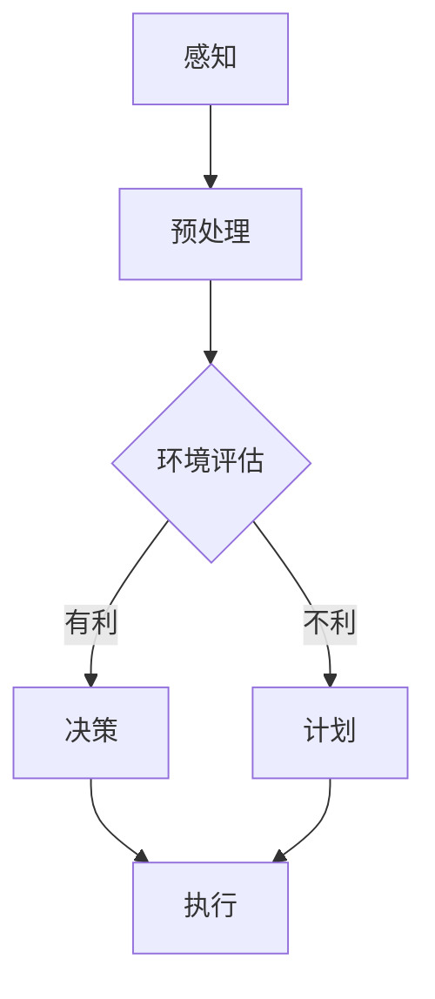
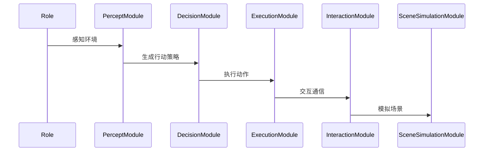

                 

# 多角色AI Agent：基于LLM的虚拟角色扮演系统

> 关键词：多角色AI Agent、虚拟角色扮演系统、LLM、算法、架构设计、项目实战

> 摘要：本文深入探讨了多角色AI Agent的概念、原理及其在虚拟角色扮演系统中的应用。文章首先介绍了多角色AI Agent的背景、问题和解决方法，然后分析了其核心概念与联系，详细讲解了算法原理和系统架构设计。通过实际项目实战，展示了多角色AI Agent系统的实现和优化，最后总结了最佳实践和注意事项，为未来研究和应用提供了指导。

## 第一部分：背景介绍

### 第1章 多角色AI Agent概述

#### 1.1.1 问题背景

在人工智能发展的新阶段，多角色AI Agent的出现标志着人工智能从单角色向多角色、复杂交互的进化。随着虚拟现实和增强现实技术的迅猛发展，虚拟角色扮演系统的需求日益增加。这些系统不仅要求具备智能化的角色，还需要角色之间能够进行有效的交互和协作。

多角色AI Agent在虚拟世界中有广泛的应用场景，如虚拟客服、虚拟员工、虚拟导游等。这些角色需要具备独立思考、自主行动和协同工作能力。然而，如何构建这样一个系统能够满足复杂交互的需求，成为了当前研究的重点和挑战。

#### 1.1.2 问题解决

多角色AI Agent的定义与核心能力：

多角色AI Agent是指能够模拟人类行为和思维的计算机程序，具备自主决策、执行和交互能力。其核心能力包括：

1. 自主决策：根据环境和任务需求，自主选择合适的行动策略。
2. 执行能力：执行决策产生的动作，如移动、交互等。
3. 交互能力：与其他角色进行沟通和协作。

基于LLM的虚拟角色扮演系统实现框架：

基于LLM（大型语言模型）的虚拟角色扮演系统通过结合自然语言处理和机器学习技术，构建了一个具备高度智能化的角色系统。LLM模型能够处理和理解自然语言，为角色之间的交互提供了强有力的支持。

#### 1.1.3 边界与外延

多角色AI Agent的应用范围与限制：

多角色AI Agent在虚拟世界中的应用场景广泛，但同时也受到一些限制。例如，复杂的物理环境和实时交互需求可能对系统的性能和响应速度提出挑战。

不同类型角色Agent的特点与区别：

虚拟角色扮演系统中的角色可以分为三种类型：智能型、任务型和交互型。智能型角色具备高度自主决策能力；任务型角色专注于完成特定任务；交互型角色则主要进行与用户的互动。

#### 1.1.4 概念结构与核心要素组成

多角色AI Agent的组成结构：

多角色AI Agent由感知模块、决策模块、执行模块和交互模块组成。感知模块负责获取环境信息；决策模块根据感知信息生成行动策略；执行模块实施行动；交互模块负责与其他角色进行通信。

基于LLM的虚拟角色扮演系统的核心组件：

基于LLM的虚拟角色扮演系统的核心组件包括LLM模型、角色管理模块、交互管理模块和场景模拟模块。LLM模型作为核心智能组件，负责处理语言和理解任务；角色管理模块负责创建和管理角色；交互管理模块处理角色之间的交互；场景模拟模块模拟虚拟世界的环境。

### 第2章 多角色AI Agent核心概念与联系

#### 2.1.1 核心概念原理

多角色AI Agent的定义与分类：

多角色AI Agent是指能够模拟人类行为和思维的计算机程序，具备自主决策、执行和交互能力。根据角色的智能程度和任务特性，可以将其分为智能型、任务型和交互型。

LLM（大型语言模型）原理与特性：

LLM是一种基于深度学习的自然语言处理模型，通过训练大量的文本数据，能够理解和生成自然语言。其核心特性包括：

1. 语言理解能力：能够理解文本的含义和结构。
2. 语言生成能力：能够根据输入生成有意义的文本。
3. 自动学习：通过持续训练，不断提升语言处理能力。

#### 2.1.2 概念属性特征对比表格

| 特征 | 多角色AI Agent | 单角色AI Agent | 基于LLM角色系统 | 基于规则角色系统 |
| --- | --- | --- | --- | --- |
| 自主决策能力 | 高 | 低 | 高 | 低 |
| 执行能力 | 高 | 高 | 高 | 低 |
| 交互能力 | 高 | 低 | 高 | 低 |
| 语言处理能力 | 强 | 弱 | 强 | 弱 |
| 学习能力 | 强 | 弱 | 强 | 弱 |

#### 2.1.3 ER实体关系图架构

多角色AI Agent的实体关系图：

在多角色AI Agent系统中，主要实体包括角色、环境、感知模块、决策模块、执行模块和交互模块。实体关系图如下：

```mermaid
erDiagram
    Role ||--|{ PerceptModule } : 感知
    Role ||--|{ DecisionModule } : 决策
    Role ||--|{ ExecutionModule } : 执行
    Role ||--|{ InteractionModule } : 交互
    Environment ||--|{ PerceptModule } : 感知
```

虚拟角色扮演系统的实体关系图：

在虚拟角色扮演系统中，主要实体包括角色、场景、任务、交互和逻辑。实体关系图如下：

```mermaid
erDiagram
    Role ||--|{ Scene } : 场景
    Role ||--|{ Task } : 任务
    Role ||--|{ Interaction } : 交互
    Role ||--|{ Logic } : 逻辑
    Scene ||--|{ Task } : 任务
```

### 第3章 多角色AI Agent算法原理讲解

#### 3.1.1 算法mermaid流程图

多角色AI Agent的决策流程如下：



#### 3.1.2 算法原理与数学模型

决策算法的数学模型：

多角色AI Agent的决策算法可以表示为：

$$
\text{决策}(s) = \arg\max_{a} \pi(a|s)
$$

其中，$s$ 表示当前状态，$a$ 表示可能的动作，$\pi(a|s)$ 表示在状态 $s$ 下选择动作 $a$ 的概率。

概率论与信息论基础：

多角色AI Agent的决策过程依赖于概率论和信息论。概率论提供了对不确定性的描述和计算方法，信息论则研究了信息的传递和处理。

#### 3.1.3 Python源代码讲解

代码实现与解读：

```python
import numpy as np

def decision(state):
    # 状态预处理
    preprocessed_state = preprocess(state)
    
    # 环境评估
    evaluation = evaluate_environment(preprocessed_state)
    
    # 决策
    if evaluation > 0:
        action = choose_action(evaluation)
    else:
        action = choose_action(evaluation, plan=True)
    
    return action

def preprocess(state):
    # 对状态进行预处理
    # ...
    return preprocessed_state

def evaluate_environment(state):
    # 评估环境
    # ...
    return evaluation

def choose_action(evaluation, plan=False):
    # 选择动作
    # ...
    return action
```

代码优化与性能分析：

为了提高决策算法的性能，可以采用以下优化方法：

1. 缩小状态空间：通过简化状态描述，减少状态数量。
2. 优先级调度：根据动作的优先级进行调度，提高响应速度。
3. 并行计算：利用多线程或分布式计算，提高计算效率。

#### 3.1.4 举例说明

简单案例实现与结果分析：

假设一个简单的虚拟世界，其中有一个角色需要在一个有障碍物的房间内寻找目标。角色的感知模块可以获取房间内的障碍物和目标的位置，决策模块根据感知信息生成行动策略。

1. 状态：当前角色所在的位置和房间内的障碍物和目标的位置。
2. 动作：移动到相邻的位置。
3. 结果：角色成功找到目标。

复杂案例应用与挑战：

在复杂的虚拟世界中，角色需要面对更多的环境和任务挑战。例如，在多人在线游戏中，角色需要与其他玩家进行交互和协作。这要求角色具备更复杂的感知和决策能力，同时也增加了系统的计算复杂度。

### 第4章 基于LLM的虚拟角色扮演系统架构设计

#### 4.1.1 问题场景介绍

虚拟世界中的角色交互需求：

在虚拟世界中，角色之间需要能够进行有效的交互和协作。例如，在虚拟商城中，客服角色需要能够与客户进行对话，了解客户的需求并提供相应的服务。

#### 4.1.2 系统功能设计

虚拟角色扮演系统的功能模块划分：

1. 角色管理模块：负责创建、管理和删除角色。
2. 感知模块：负责获取环境信息，包括障碍物、目标等。
3. 决策模块：根据感知信息生成行动策略。
4. 执行模块：执行决策产生的动作。
5. 交互模块：处理角色之间的交互和通信。
6. 场景模拟模块：模拟虚拟世界的环境。

#### 4.1.3 系统架构设计

虚拟角色扮演系统的架构图：



#### 4.1.4 系统接口设计

系统内部接口与外部接口：

系统内部接口包括感知接口、决策接口、执行接口和交互接口。外部接口包括用户界面、数据库接口和外部系统接口。

#### 4.1.5 系统交互

系统交互流程与机制：

1. 用户通过用户界面输入请求。
2. 角色感知模块获取环境信息。
3. 决策模块生成行动策略。
4. 执行模块执行动作。
5. 交互模块处理角色之间的交互。
6. 场景模拟模块更新场景状态。
7. 用户界面显示结果。

### 第5章 项目实战：多角色AI Agent系统实现

#### 5.1.1 环境安装与配置

系统环境准备与配置：

1. 安装Python环境。
2. 安装LLM模型依赖库，如TensorFlow、PyTorch等。
3. 配置数据库，如MySQL、PostgreSQL等。
4. 安装其他必要工具和软件。

#### 5.1.2 系统核心实现

多角色AI Agent的核心算法实现：

1. 训练LLM模型。
2. 构建感知模块。
3. 构建决策模块。
4. 构建执行模块。
5. 构建交互模块。

LLM模型的训练与部署：

1. 收集和预处理训练数据。
2. 训练LLM模型。
3. 评估和优化模型。
4. 部署模型，提供API接口。

#### 5.1.3 代码应用解读与分析

代码结构分析与功能解析：

1. 感知模块：负责获取环境信息。
2. 决策模块：根据感知信息生成行动策略。
3. 执行模块：执行决策产生的动作。
4. 交互模块：处理角色之间的交互。

实际应用中的问题与解决方案：

1. 环境信息获取不准确：优化感知模块算法，提高精度。
2. 决策效率低下：优化决策算法，提高速度。
3. 角色协作困难：优化交互机制，提高协作效率。

#### 5.1.4 实际案例分析与讲解

典型案例剖析：

1. 虚拟商城客服角色与客户的交互。
2. 多角色在线游戏中的协作。

案例中的问题和挑战：

1. 客户请求多样化：提高角色对多样化请求的应对能力。
2. 网络延迟：优化系统架构，提高响应速度。

### 第6章 多角色AI Agent系统最佳实践与注意事项

#### 6.1.1 最佳实践 tips

系统优化技巧：

1. 使用并行计算提高效率。
2. 优化数据结构和算法，减少内存占用。
3. 定期更新LLM模型，提高语言处理能力。

性能调优策略：

1. 使用缓存技术减少数据库访问次数。
2. 优化网络通信，减少延迟。
3. 调整并发设置，提高系统负载能力。

#### 6.1.2 小结

本书内容的回顾：

1. 多角色AI Agent的概念与原理。
2. 虚拟角色扮演系统的架构设计。
3. 系统核心算法的实现与优化。
4. 项目实战中的问题和解决方案。

多角色AI Agent的系统应用总结：

多角色AI Agent系统在虚拟世界中的应用前景广阔，但同时也面临一些挑战。通过不断优化和改进，可以进一步提升系统的性能和智能化水平，为用户提供更优质的虚拟体验。

#### 6.1.3 注意事项

系统开发中的常见问题：

1. 环境信息获取不准确。
2. 决策算法效率低下。
3. 角色协作困难。

避免潜在风险的措施：

1. 定期评估系统性能，发现问题及时解决。
2. 遵循最佳实践，避免常见错误。
3. 加强团队协作，确保系统开发顺利进行。

#### 6.1.4 拓展阅读

相关领域的最新研究：

1. 聊天机器人技术的发展。
2. 自然语言处理技术的创新。
3. 虚拟现实技术的应用。

有价值的参考文献与资料：

1. [ChatGPT：人工智能助手](https://chat.openai.com/)
2. [BERT：预训练语言模型](https://arxiv.org/abs/1810.04805)
3. [Deep Learning Book：深度学习](https://www.deeplearningbook.org/)

