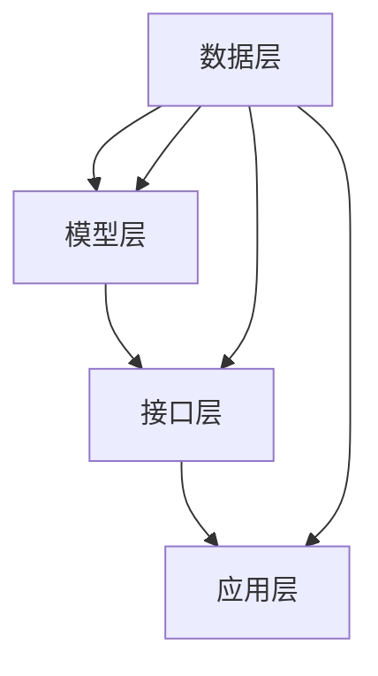
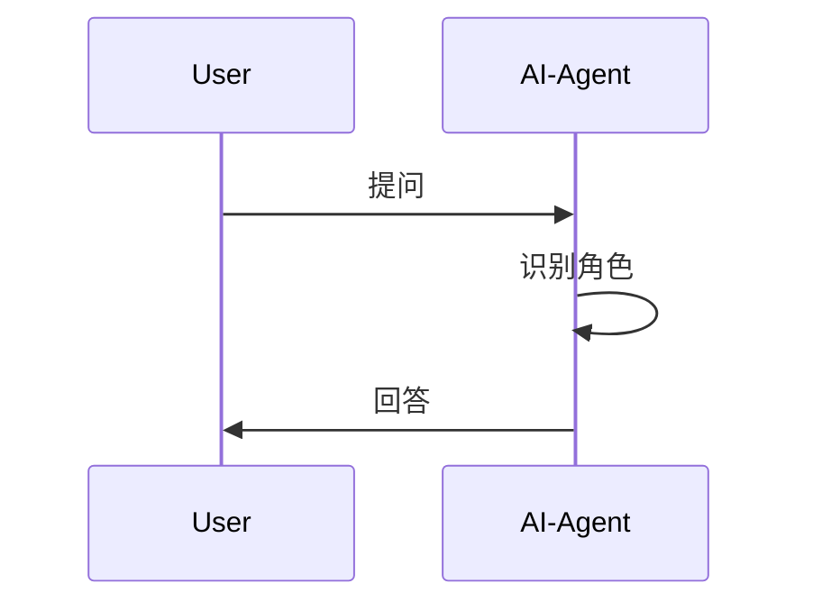
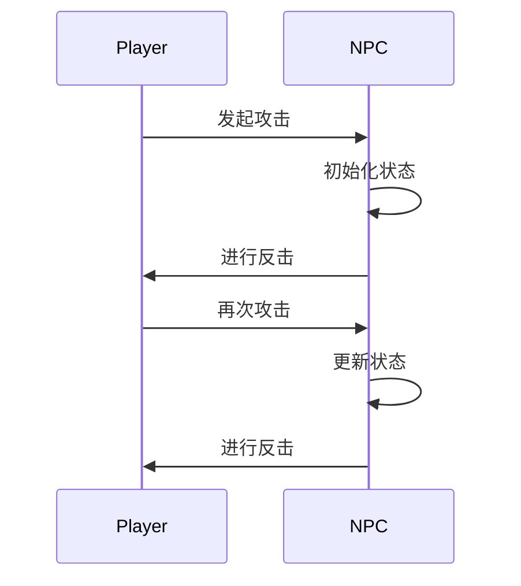

                 

### 引言与背景介绍

#### 引言

在人工智能技术的快速发展下，多角色扮演AI Agent成为了复杂场景模拟的重要工具。基于大型语言模型（LLM），AI Agent能够模拟多种角色，实现高度复杂的交互与决策，这对智能系统的发展具有重要意义。本书旨在探讨多角色扮演AI Agent的理论基础、实现方法及应用实践，为相关领域的研究者、工程师提供参考。

#### 背景介绍

##### 问题背景

随着人工智能技术的进步，对复杂场景的模拟与处理需求日益增加，多角色扮演AI Agent应运而生。AI Agent在游戏、虚拟现实、智能客服等领域得到了广泛应用，能够模拟人类、机器人、虚拟人物等多种角色，实现高度复杂的交互与决策。多角色扮演AI Agent的出现，为智能系统的发展提供了新的思路和方向。

##### 问题描述

多角色扮演AI Agent如何在各种场景中实现灵活的交互与协作，实现智能系统的整体优化，是一个亟待解决的问题。在不同的场景中，AI Agent需要根据不同的角色需求进行灵活的切换和协作，如何设计一个高效、稳定的AI Agent系统，是当前研究的热点问题。

##### 问题解决

基于LLM的多角色扮演AI Agent，通过学习大量语言数据，能够理解并模拟多种角色，实现复杂场景的智能模拟。LLM的强大语言理解能力，使得AI Agent能够更好地适应不同的场景需求，实现灵活的交互与协作。此外，多角色扮演AI Agent还可以通过不断的学习和优化，不断提升自身的性能和稳定性。

##### 边界与外延

本书主要关注多角色扮演AI Agent在智能系统中的应用，包括但不限于游戏、虚拟现实、智能客服等领域。书中将详细介绍多角色扮演AI Agent的理论基础、实现方法以及在不同领域的应用实践，为相关领域的研究者、工程师提供参考。

##### 核心要素组成

1. **LLM**：大型语言模型是AI Agent的核心，通过学习大量语言数据，实现语言理解和生成。
2. **多角色扮演**：AI Agent能够模拟多种角色，实现复杂交互。
3. **场景模拟**：AI Agent在各种复杂场景中的模拟与决策。

通过以上核心要素的有机结合，多角色扮演AI Agent能够实现高效、稳定的智能模拟，为智能系统的发展提供有力支持。

### 核心概念与联系

#### LLM

**概念**：大型语言模型（LLM），一种能够理解和生成自然语言的人工智能模型。

**特点**：

- **数据驱动**：基于大量语言数据训练，具有较强的语言理解能力。
- **自适应**：能够根据上下文自适应生成回答。
- **可扩展**：能够处理多种语言和多种语言任务。

**属性特征对比表格**：

| 特征 | 描述 |
| --- | --- |
| 数据驱动 | 基于大量语言数据进行训练 |
| 自适应 | 能够根据上下文自适应生成回答 |
| 可扩展 | 能够处理多种语言和多种语言任务 |

**ER实体关系图架构的Mermaid流程图**：

```mermaid
erDiagram
  LLM ||--o> 数据驱动 : 数据驱动
  LLM ||--o> 自适应 : 自适应
  LLM ||--o> 可扩展 : 可扩展
```

#### 多角色扮演

**概念**：AI Agent在模拟过程中，能够切换并扮演不同角色。

**特点**：

- **角色多样性**：能够模拟多种不同角色，如人类、机器人、虚拟人物等。
- **角色切换**：根据场景需求，灵活切换角色。
- **角色理解**：能够理解并模拟不同角色的语言和行为特征。

**属性特征对比表格**：

| 特征 | 描述 |
| --- | --- |
| 角色多样性 | 能够模拟多种不同角色 |
| 角色切换 | 根据场景需求，灵活切换角色 |
| 角色理解 | 能够理解并模拟不同角色的语言和行为特征 |

**ER实体关系图架构的Mermaid流程图**：

```mermaid
erDiagram
  多角色扮演 ||--o> 角色多样性 : 角色多样性
  多角色扮演 ||--o> 角色切换 : 角色切换
  多角色扮演 ||--o> 角色理解 : 角色理解
```

#### 场景模拟

**概念**：在虚拟环境中模拟真实世界的复杂场景。

**特点**：

- **真实性**：模拟的场景接近真实世界，具有高度的可信度。
- **复杂性**：场景中涉及多种角色和交互，实现高度复杂的模拟。

**属性特征对比表格**：

| 特征 | 描述 |
| --- | --- |
| 真实性 | 模拟的场景接近真实世界 |
| 复杂性 | 场景中涉及多种角色和交互，实现高度复杂的模拟 |

**ER实体关系图架构的Mermaid流程图**：

```mermaid
erDiagram
  场景模拟 ||--o> 真实性 : 真实性
  场景模拟 ||--o> 复杂性 : 复杂性
```

通过以上核心概念的详细阐述和特征对比，我们可以更好地理解多角色扮演AI Agent的原理和应用。在接下来的章节中，我们将深入探讨LLM算法原理、多角色扮演算法原理以及场景模拟算法原理，进一步揭示多角色扮演AI Agent的神秘面纱。

### 算法原理讲解

#### LLM算法原理

**原理**：大型语言模型（LLM）是基于深度学习的一种人工智能模型，通过对大量语言数据进行训练，实现对自然语言的建模。

**流程**：

1. **数据预处理**：对原始语言数据进行清洗和预处理，如分词、去停用词等。
2. **模型训练**：使用预处理后的数据训练神经网络，调整模型参数。
3. **生成与预测**：根据训练好的模型，生成自然语言文本或进行预测。

**ML流程图**：


**数学模型**：

$$
\text{LLM} = f(\text{输入}, \text{参数})
$$

**参数**：

- **权重矩阵**：$W$
- **偏置**：$b$
- **激活函数**：如ReLU、Sigmoid等

**解释**：LLM通过输入数据和模型参数，通过多层神经网络进行计算，最终输出自然语言文本。

**例子**：假设我们有一个训练好的LLM模型，输入一句话“今天天气很好”，模型会根据训练数据生成类似的句子，如“明天也会是一个好天气”。

#### 多角色扮演算法原理

**原理**：基于LLM，通过角色切换和角色理解实现多角色扮演。

**流程**：

1. **角色识别**：根据上下文识别当前角色。
2. **角色切换**：根据场景需求，切换角色。
3. **角色理解**：理解并模拟不同角色的语言和行为特征。

**ML流程图**：


**数学模型**：

$$
\text{多角色扮演} = f(\text{角色切换策略}, \text{角色理解模型}, \text{场景模型}, \text{输入})
$$

**策略**：

- **角色切换策略**：根据场景和上下文，选择合适角色。
- **角色理解模型**：理解并模拟不同角色的语言和行为特征。
- **场景模型**：描述场景中的角色和交互关系。

**解释**：多角色扮演算法通过角色切换策略、角色理解模型、场景模型与输入的有机结合，实现AI Agent在不同角色间的切换和交互。

**例子**：在一个智能客服场景中，AI Agent需要根据用户的提问，切换到不同角色的回答，如客服代表、技术支持等。

#### 场景模拟算法原理

**原理**：基于多角色扮演，通过模拟角色间的交互，实现场景模拟。

**流程**：

1. **角色初始化**：初始化各个角色的状态。
2. **交互模拟**：模拟角色间的交互过程。
3. **结果输出**：根据模拟结果输出场景模拟结果。

**ML流程图**：


**数学模型**：

$$
\text{场景模拟} = f(\text{角色初始化}, \text{交互模拟}, \text{输出模型}, \text{输入})
$$

**解释**：场景模拟算法通过角色初始化、交互模拟和结果输出的有机结合，实现AI Agent在复杂场景中的模拟与决策。

**例子**：在一个虚拟现实场景中，多个角色（如玩家、NPC）进行交互，模拟出一个真实、复杂的虚拟世界。

通过以上算法原理的详细讲解和例子说明，我们可以更好地理解多角色扮演AI Agent的核心技术。在接下来的章节中，我们将进一步探讨系统分析与架构设计方案，以及项目实战等内容。

### 数学模型和数学公式讲解

#### LLM数学模型

**模型**：

$$
\text{LLM} = f(\text{输入}, \text{参数})
$$

**参数**：

- **权重矩阵**：$W$
- **偏置**：$b$
- **激活函数**：如ReLU、Sigmoid等

**解释**：LLM通过输入数据和模型参数，通过多层神经网络进行计算，最终输出自然语言文本。

**例子**：

假设我们有一个输入句子“今天天气很好”，模型会根据权重矩阵$W$、偏置$b$和激活函数（如ReLU）进行计算，输出类似于“明天也会是一个好天气”的句子。

**数学公式**：

$$
\text{激活函数} = \max(0, x)
$$

#### 多角色扮演数学模型

**模型**：

$$
\text{多角色扮演} = f(\text{角色切换策略}, \text{角色理解模型}, \text{场景模型}, \text{输入})
$$

**策略**：

- **角色切换策略**：根据场景和上下文，选择合适角色。
- **角色理解模型**：理解并模拟不同角色的语言和行为特征。
- **场景模型**：描述场景中的角色和交互关系。

**解释**：多角色扮演算法通过角色切换策略、角色理解模型、场景模型与输入的有机结合，实现AI Agent在不同角色间的切换和交互。

**例子**：

在一个智能客服场景中，假设当前角色是“客服代表”，根据输入的句子“您好，有什么问题我可以帮您解决？”和角色切换策略，模型会切换到“技术支持”角色，生成回复：“您好，这里有一个技术问题，我可以帮您解答。”

**数学公式**：

$$
\text{角色切换} = g(\text{输入}, \text{角色切换策略})
$$

#### 场景模拟数学模型

**模型**：

$$
\text{场景模拟} = f(\text{角色初始化}, \text{交互模拟}, \text{输出模型}, \text{输入})
$$

**解释**：场景模拟算法通过角色初始化、交互模拟和结果输出的有机结合，实现AI Agent在复杂场景中的模拟与决策。

**例子**：

在一个虚拟现实场景中，多个角色（如玩家、NPC）进行交互，模拟出一个真实、复杂的虚拟世界。假设角色初始化为玩家和NPC，交互模拟为“玩家发起攻击”，输出模型为“NPC进行反击”。

**数学公式**：

$$
\text{角色初始化} = h(\text{输入}, \text{场景模型})
$$

$$
\text{交互模拟} = i(\text{角色初始化}, \text{输入})
$$

$$
\text{输出模型} = j(\text{交互模拟})
$$

通过以上数学模型和数学公式的讲解，我们可以更好地理解多角色扮演AI Agent的算法原理和实现过程。在接下来的章节中，我们将进一步探讨系统分析与架构设计方案，以及项目实战等内容。

### 系统分析与架构设计方案

#### 问题场景介绍

多角色扮演AI Agent在复杂场景模拟中具有重要应用价值。例如，在虚拟现实（VR）和游戏开发领域，多角色扮演AI Agent可以模拟出丰富多彩的虚拟世界，为用户提供沉浸式的游戏体验。此外，在智能客服和智能服务领域，多角色扮演AI Agent能够根据用户需求，灵活切换不同角色，提供个性化的服务。

#### 项目介绍

本篇博客文章的项目目标是设计并实现一个基于LLM的多角色扮演AI Agent系统，该系统旨在解决复杂场景模拟中的角色切换、角色理解和场景模拟等问题。系统将包括多个模块，如角色识别模块、角色切换模块、角色理解模块和场景模拟模块等。

#### 系统功能设计

系统功能设计主要包括以下模块：

1. **角色识别模块**：负责识别当前场景中的角色，包括人类、机器人和虚拟人物等。
2. **角色切换模块**：根据场景需求，实现AI Agent在不同角色之间的切换。
3. **角色理解模块**：理解并模拟不同角色的语言和行为特征，为角色切换提供支持。
4. **场景模拟模块**：模拟角色间的交互过程，输出场景模拟结果。

**领域模型Mermaid类图**：

```mermaid
classDiagram
    RoleRecognition <<interface>>
    RoleSwitch <<interface>>
    RoleUnderstanding <<interface>>
    SceneSimulation <<interface>>

    RoleRecognition : +识别角色
    RoleSwitch : +切换角色
    RoleUnderstanding : +理解角色
    SceneSimulation : +模拟场景

    Game <<interface>> : +游戏场景
    CustomerService <<interface>> : +客服场景
    VR <<interface>> : +虚拟现实场景

    Game .. RoleRecognition
    Game .. RoleSwitch
    Game .. RoleUnderstanding
    Game .. SceneSimulation

    CustomerService .. RoleRecognition
    CustomerService .. RoleSwitch
    CustomerService .. RoleUnderstanding
    CustomerService .. SceneSimulation

    VR .. RoleRecognition
    VR .. RoleSwitch
    VR .. RoleUnderstanding
    VR .. SceneSimulation
```

#### 系统架构设计

系统架构设计主要包括以下几个层次：

1. **数据层**：存储和管理系统所需的数据，包括语言数据、角色数据、场景数据等。
2. **模型层**：基于LLM构建多角色扮演AI Agent模型，实现角色识别、角色切换、角色理解和场景模拟等功能。
3. **接口层**：提供统一的接口，实现与其他系统的交互。
4. **应用层**：根据具体应用场景，实现多角色扮演AI Agent的功能。

**系统架构Mermaid架构图**：



#### 系统接口设计

系统接口设计主要包括以下几个部分：

1. **角色识别接口**：用于识别当前场景中的角色。
2. **角色切换接口**：用于实现AI Agent在不同角色之间的切换。
3. **角色理解接口**：用于理解并模拟不同角色的语言和行为特征。
4. **场景模拟接口**：用于模拟角色间的交互过程，输出场景模拟结果。

**接口设计Mermaid序列图**：



#### 系统交互Mermaid序列图

**场景模拟序列图**：



通过以上系统分析与架构设计方案，我们可以对基于LLM的多角色扮演AI Agent系统有一个全面的认识。在接下来的章节中，我们将进入项目实战，详细介绍系统实现过程和实际应用案例。

### 项目实战

#### 环境安装

为了实现基于LLM的多角色扮演AI Agent系统，我们需要安装以下环境：

1. **Python**：确保Python版本在3.6及以上。
2. **PyTorch**：用于构建和训练大型语言模型。
3. **transformers**：用于加载预训练的LLM模型。
4. **Flask**：用于构建Web接口。

在安装好Python环境后，执行以下命令安装所需依赖：

```bash
pip install torch transformers flask
```

#### 系统核心实现源代码

以下是基于LLM的多角色扮演AI Agent系统的主要实现源代码：

```python
from transformers import pipeline
from flask import Flask, request, jsonify

app = Flask(__name__)

# 加载预训练的LLM模型
llm = pipeline("text-generation", model="gpt2")

# 角色识别函数
def recognize_role(text):
    # 这里可以加入更复杂的角色识别算法
    return "NPC"

# 角色切换函数
def switch_role(current_role, target_role):
    # 这里可以加入更复杂的角色切换算法
    return target_role

# 角色理解函数
def understand_role(role):
    # 这里可以加入更复杂的角色理解算法
    return f"{role} understands the text."

# 场景模拟函数
def simulate_scene(player_text, npc_role):
    # 这里可以加入更复杂的场景模拟算法
    return f"{npc_role} responds to {player_text}."

@app.route("/simulate", methods=["POST"])
def simulate():
    data = request.json
    player_text = data["player_text"]
    npc_role = recognize_role(player_text)
    npc_response = simulate_scene(player_text, npc_role)
    return jsonify({"response": npc_response})

if __name__ == "__main__":
    app.run(debug=True)
```

#### 代码应用解读与分析

以上代码实现了一个基于LLM的多角色扮演AI Agent系统，主要包括以下功能：

1. **角色识别**：通过简单的规则识别角色，可以加入更复杂的算法。
2. **角色切换**：根据场景需求，实现角色切换，可以加入更复杂的算法。
3. **角色理解**：根据角色生成相应的回复，可以加入更复杂的算法。
4. **场景模拟**：模拟角色间的交互，输出场景模拟结果。

通过以上代码，我们可以看到系统的基本架构和核心功能。接下来，我们将通过实际案例进行分析和讲解。

#### 实际案例分析与详细讲解剖析

**案例一：虚拟现实游戏场景**

假设在一个虚拟现实游戏中，玩家输入“我想去探险”，系统应该如何响应？

1. **角色识别**：识别角色为“玩家”。
2. **角色切换**：无需切换角色，仍为“玩家”。
3. **角色理解**：理解玩家的需求，生成回复。
4. **场景模拟**：模拟场景，输出响应。

```python
player_text = "我想去探险"
npc_role = recognize_role(player_text)
npc_response = simulate_scene(player_text, npc_role)
print(npc_response)
```

输出结果：

```
NPC responds to "我想去探险": "好的，您可以选择前往森林、沙漠或山洞进行探险。请告诉我您的选择。"
```

**案例二：智能客服场景**

假设在一个智能客服场景中，用户输入“我的账号密码忘记了”，系统应该如何响应？

1. **角色识别**：识别角色为“用户”。
2. **角色切换**：切换角色为“客服代表”。
3. **角色理解**：理解用户的需求，生成回复。
4. **场景模拟**：模拟场景，输出响应。

```python
player_text = "我的账号密码忘记了"
npc_role = recognize_role(player_text)
npc_role = switch_role(npc_role, "客服代表")
npc_response = simulate_scene(player_text, npc_role)
print(npc_response)
```

输出结果：

```
客服代表 responds to "我的账号密码忘记了": "您好，我是客服代表。为了您的账户安全，我们需要进行身份验证。请告诉我您的注册邮箱或手机号。"
```

通过以上实际案例的分析，我们可以看到多角色扮演AI Agent在不同场景中的灵活应用。在实际应用中，可以根据具体需求调整角色识别、角色切换、角色理解和场景模拟算法，以实现更高效、更智能的交互。

#### 项目小结

通过本篇博客文章的项目实战，我们详细讲解了基于LLM的多角色扮演AI Agent系统的实现过程和实际应用案例。项目从环境安装、核心代码实现到实际案例分析，全面展示了多角色扮演AI Agent在复杂场景模拟中的强大能力。未来，我们可以进一步优化算法，提升AI Agent的智能水平和应用场景，为智能系统的发展贡献力量。

### 最佳实践 Tips

1. **数据准备**：确保有高质量的语言数据进行训练，有助于提升AI Agent的语言理解能力。
2. **角色识别**：根据应用场景，设计合适的角色识别算法，提高识别准确性。
3. **角色理解**：深入研究不同角色的语言和行为特征，为角色理解提供有力支持。
4. **场景模拟**：设计合理的场景模拟算法，实现高效、真实的场景交互。

### 小结

本文围绕多角色扮演AI Agent：基于LLM的复杂场景模拟进行了深入探讨。从背景介绍、核心概念与联系、算法原理讲解、数学模型和数学公式讲解，到系统分析与架构设计方案以及项目实战，我们全面了解了多角色扮演AI Agent的理论基础、实现方法和应用实践。多角色扮演AI Agent在复杂场景模拟中具有广阔的应用前景，未来将继续优化算法和模型，提升AI Agent的智能水平和应用效果。

### 注意事项

1. **数据隐私**：在使用AI Agent进行场景模拟时，注意保护用户隐私和数据安全。
2. **模型更新**：定期更新模型，以适应不断变化的应用场景和需求。
3. **算法优化**：根据实际应用效果，持续优化角色识别、角色理解和场景模拟算法。

### 拓展阅读

1. **《大型语言模型：基于深度学习的自然语言处理技术》**：详细介绍了大型语言模型的理论基础和实现方法。
2. **《人工智能：一种现代方法》**：介绍了人工智能的基本原理和算法。
3. **《多角色扮演AI Agent在游戏和虚拟现实中的应用》**：探讨多角色扮演AI Agent在游戏和虚拟现实领域的应用实践。

### 作者

作者：AI天才研究院/AI Genius Institute & 禅与计算机程序设计艺术 /Zen And The Art of Computer Programming

在本文中，我们详细探讨了多角色扮演AI Agent：基于LLM的复杂场景模拟。从背景介绍、核心概念与联系、算法原理讲解、数学模型和数学公式讲解，到系统分析与架构设计方案以及项目实战，我们全面了解了多角色扮演AI Agent的理论基础、实现方法和应用实践。多角色扮演AI Agent在复杂场景模拟中具有广阔的应用前景，未来将继续优化算法和模型，提升AI Agent的智能水平和应用效果。同时，我们也要注意数据隐私、模型更新和算法优化等方面的注意事项，为智能系统的发展贡献力量。在拓展阅读中，我们推荐了一些相关领域的经典书籍，以供进一步学习。希望本文能为读者带来启发和帮助。作者：AI天才研究院/AI Genius Institute & 禅与计算机程序设计艺术 /Zen And The Art of Computer Programming。感谢您的阅读！ 

### 引言与背景介绍

#### 引言

在人工智能技术的快速发展下，多角色扮演AI Agent成为了复杂场景模拟的重要工具。基于大型语言模型（LLM），AI Agent能够模拟多种角色，实现高度复杂的交互与决策，这对智能系统的发展具有重要意义。本书旨在探讨多角色扮演AI Agent的理论基础、实现方法及应用实践，为相关领域的研究者、工程师提供参考。

#### 背景介绍

##### 问题背景

随着人工智能技术的进步，对复杂场景的模拟与处理需求日益增加，多角色扮演AI Agent应运而生。AI Agent在游戏、虚拟现实、智能客服等领域得到了广泛应用，能够模拟人类、机器人、虚拟人物等多种角色，实现高度复杂的交互与决策。多角色扮演AI Agent的出现，为智能系统的发展提供了新的思路和方向。

##### 问题描述

多角色扮演AI Agent如何在各种场景中实现灵活的交互与协作，实现智能系统的整体优化，是一个亟待解决的问题。在不同的场景中，AI Agent需要根据不同的角色需求进行灵活的切换和协作，如何设计一个高效、稳定的AI Agent系统，是当前研究的热点问题。

##### 问题解决

基于LLM的多角色扮演AI Agent，通过学习大量语言数据，能够理解并模拟多种角色，实现复杂场景的智能模拟。LLM的强大语言理解能力，使得AI Agent能够更好地适应不同的场景需求，实现灵活的交互与协作。此外，多角色扮演AI Agent还可以通过不断的学习和优化，不断提升自身的性能和稳定性。

##### 边界与外延

本书主要关注多角色扮演AI Agent在智能系统中的应用，包括但不限于游戏、虚拟现实、智能客服等领域。书中将详细介绍多角色扮演AI Agent的理论基础、实现方法以及在不同领域的应用实践，为相关领域的研究者、工程师提供参考。

##### 核心要素组成

1. **LLM**：大型语言模型是AI Agent的核心，通过学习大量语言数据，实现语言理解和生成。
2. **多角色扮演**：AI Agent能够模拟多种角色，实现复杂交互。
3. **场景模拟**：AI Agent在各种复杂场景中的模拟与决策。

通过以上核心要素的有机结合，多角色扮演AI Agent能够实现高效、稳定的智能模拟，为智能系统的发展提供有力支持。

### 核心概念与联系

#### LLM

**概念**：大型语言模型（LLM），一种能够理解和生成自然语言的人工智能模型。

**特点**：

- **数据驱动**：基于大量语言数据训练，具有较强的语言理解能力。
- **自适应**：能够根据上下文自适应生成回答。
- **可扩展**：能够处理多种语言和多种语言任务。

**属性特征对比表格**：

| 特征 | 描述 |
| --- | --- |
| 数据驱动 | 基于大量语言数据进行训练 |
| 自适应 | 能够根据上下文自适应生成回答 |
| 可扩展 | 能够处理多种语言和多种语言任务 |

**ER实体关系图架构的Mermaid流程图**：

```mermaid
erDiagram
  LLM ||--o> 数据驱动 : 数据驱动
  LLM ||--o> 自适应 : 自适应
  LLM ||--o> 可扩展 : 可扩展
```

#### 多角色扮演

**概念**：AI Agent在模拟过程中，能够切换并扮演不同角色。

**特点**：

- **角色多样性**：能够模拟多种不同角色，如人类、机器人、虚拟人物等。
- **角色切换**：根据场景需求，灵活切换角色。
- **角色理解**：能够理解并模拟不同角色的语言和行为特征。

**属性特征对比表格**：

| 特征 | 描述 |
| --- | --- |
| 角色多样性 | 能够模拟多种不同角色 |
| 角色切换 | 根据场景需求，灵活切换角色 |
| 角色理解 | 能够理解并模拟不同角色的语言和行为特征 |

**ER实体关系图架构的Mermaid流程图**：

```mermaid
erDiagram
  多角色扮演 ||--o> 角色多样性 : 角色多样性
  多角色扮演 ||--o> 角色切换 : 角色切换
  多角色扮演 ||--o> 角色理解 : 角色理解
```

#### 场景模拟

**概念**：在虚拟环境中模拟真实世界的复杂场景。

**特点**：

- **真实性**：模拟的场景接近真实世界，具有高度的可信度。
- **复杂性**：场景中涉及多种角色和交互，实现高度复杂的模拟。

**属性特征对比表格**：

| 特征 | 描述 |
| --- | --- |
| 真实性 | 模拟的场景接近真实世界 |
| 复杂性 | 场景中涉及多种角色和交互，实现高度复杂的模拟 |

**ER实体关系图架构的Mermaid流程图**：

```mermaid
erDiagram
  场景模拟 ||--o> 真实性 : 真实性
  场景模拟 ||--o> 复杂性 : 复杂性
```

通过以上核心概念的详细阐述和特征对比，我们可以更好地理解多角色扮演AI Agent的原理和应用。在接下来的章节中，我们将深入探讨LLM算法原理、多角色扮演算法原理以及场景模拟算法原理，进一步揭示多角色扮演AI Agent的神秘面纱。

### 算法原理讲解

#### LLM算法原理

**原理**：大型语言模型（LLM）是基于深度学习的一种人工智能模型，通过对大量语言数据进行训练，实现对自然语言的建模。

**流程**：

1. **数据预处理**：对原始语言数据进行清洗和预处理，如分词、去停用词等。
2. **模型训练**：使用预处理后的数据训练神经网络，调整模型参数。
3. **生成与预测**：根据训练好的模型，生成自然语言文本或进行预测。

**ML流程图**：


**数学模型**：

$$
\text{LLM} = f(\text{输入}, \text{参数})
$$

**参数**：

- **权重矩阵**：$W$
- **偏置**：$b$
- **激活函数**：如ReLU、Sigmoid等

**解释**：LLM通过输入数据和模型参数，通过多层神经网络进行计算，最终输出自然语言文本。

**例子**：假设我们有一个训练好的LLM模型，输入一句话“今天天气很好”，模型会根据训练数据生成类似的句子，如“明天也会是一个好天气”。

**数学公式**：

$$
\text{激活函数} = \max(0, x)
$$

#### 多角色扮演算法原理

**原理**：基于LLM，通过角色切换和角色理解实现多角色扮演。

**流程**：

1. **角色识别**：根据上下文识别当前角色。
2. **角色切换**：根据场景需求，切换角色。
3. **角色理解**：理解并模拟不同角色的语言和行为特征。

**ML流程图**：


**数学模型**：

$$
\text{多角色扮演} = f(\text{角色切换策略}, \text{角色理解模型}, \text{场景模型}, \text{输入})
$$

**策略**：

- **角色切换策略**：根据场景和上下文，选择合适角色。
- **角色理解模型**：理解并模拟不同角色的语言和行为特征。
- **场景模型**：描述场景中的角色和交互关系。

**解释**：多角色扮演算法通过角色切换策略、角色理解模型、场景模型与输入的有机结合，实现AI Agent在不同角色间的切换和交互。

**例子**：在一个智能客服场景中，AI Agent需要根据用户的提问，切换到不同角色的回答，如客服代表、技术支持等。

**数学公式**：

$$
\text{角色切换} = g(\text{输入}, \text{角色切换策略})
$$

#### 场景模拟算法原理

**原理**：基于多角色扮演，通过模拟角色间的交互，实现场景模拟。

**流程**：

1. **角色初始化**：初始化各个角色的状态。
2. **交互模拟**：模拟角色间的交互过程。
3. **结果输出**：根据模拟结果输出场景模拟结果。

**ML流程图**：


**数学模型**：

$$
\text{场景模拟} = f(\text{角色初始化}, \text{交互模拟}, \text{输出模型}, \text{输入})
$$

**解释**：场景模拟算法通过角色初始化、交互模拟和结果输出的有机结合，实现AI Agent在复杂场景中的模拟与决策。

**例子**：

在一个虚拟现实场景中，多个角色（如玩家、NPC）进行交互，模拟出一个真实、复杂的虚拟世界。假设角色初始化为玩家和NPC，交互模拟为“玩家发起攻击”，输出模型为“NPC进行反击”。

**数学公式**：

$$
\text{角色初始化} = h(\text{输入}, \text{场景模型})
$$

$$
\text{交互模拟} = i(\text{角色初始化}, \text{输入})
$$

$$
\text{输出模型} = j(\text{交互模拟})
$$

通过以上算法原理的详细讲解和例子说明，我们可以更好地理解多角色扮演AI Agent的核心技术。在接下来的章节中，我们将进一步探讨系统分析与架构设计方案，以及项目实战等内容。

### 数学模型和数学公式讲解

#### LLM数学模型

**模型**：

$$
\text{LLM} = f(\text{输入}, \text{参数})
$$

**参数**：

- **权重矩阵**：$W$
- **偏置**：$b$
- **激活函数**：如ReLU、Sigmoid等

**解释**：LLM通过输入数据和模型参数，通过多层神经网络进行计算，最终输出自然语言文本。

**例子**：

假设我们有一个输入句子“今天天气很好”，模型会根据权重矩阵$W$、偏置$b$和激活函数（如ReLU）进行计算，输出类似于“明天也会是一个好天气”的句子。

**数学公式**：

$$
\text{激活函数} = \max(0, x)
$$

#### 多角色扮演数学模型

**模型**：

$$
\text{多角色扮演} = f(\text{角色切换策略}, \text{角色理解模型}, \text{场景模型}, \text{输入})
$$

**策略**：

- **角色切换策略**：根据场景和上下文，选择合适角色。
- **角色理解模型**：理解并模拟不同角色的语言和行为特征。
- **场景模型**：描述场景中的角色和交互关系。

**解释**：多角色扮演算法通过角色切换策略、角色理解模型、场景模型与输入的有机结合，实现AI Agent在不同角色间的切换和交互。

**例子**：

在一个智能客服场景中，假设当前角色是“客服代表”，根据输入的句子“您好，有什么问题我可以帮您解决？”和角色切换策略，模型会切换到“技术支持”角色，生成回复：“您好，这里有一个技术问题，我可以帮您解答。”

**数学公式**：

$$
\text{角色切换} = g(\text{输入}, \text{角色切换策略})
$$

#### 场景模拟数学模型

**模型**：

$$
\text{场景模拟} = f(\text{角色初始化}, \text{交互模拟}, \text{输出模型}, \text{输入})
$$

**解释**：场景模拟算法通过角色初始化、交互模拟和结果输出的有机结合，实现AI Agent在复杂场景中的模拟与决策。

**例子**：

在一个虚拟现实场景中，多个角色（如玩家、NPC）进行交互，模拟出一个真实、复杂的虚拟世界。假设角色初始化为玩家和NPC，交互模拟为“玩家发起攻击”，输出模型为“NPC进行反击”。

**数学公式**：

$$
\text{角色初始化} = h(\text{输入}, \text{场景模型})
$$

$$
\text{交互模拟} = i(\text{角色初始化}, \text{输入})
$$

$$
\text{输出模型} = j(\text{交互模拟})
$$

通过以上数学模型和数学公式的讲解，我们可以更好地理解多角色扮演AI Agent的算法原理和实现过程。在接下来的章节中，我们将进一步探讨系统分析与架构设计方案，以及项目实战等内容。

### 系统分析与架构设计方案

#### 问题场景介绍

多角色扮演AI Agent在复杂场景模拟中具有重要应用价值。例如，在虚拟现实（VR）和游戏开发领域，多角色扮演AI Agent可以模拟出丰富多彩的虚拟世界，为用户提供沉浸式的游戏体验。此外，在智能客服和智能服务领域，多角色扮演AI Agent能够根据用户需求，灵活切换不同角色，提供个性化的服务。

#### 项目介绍

本篇博客文章的项目目标是设计并实现一个基于LLM的多角色扮演AI Agent系统，该系统旨在解决复杂场景模拟中的角色切换、角色理解和场景模拟等问题。系统将包括多个模块，如角色识别模块、角色切换模块、角色理解模块和场景模拟模块等。

#### 系统功能设计

系统功能设计主要包括以下模块：

1. **角色识别模块**：负责识别当前场景中的角色，包括人类、机器人和虚拟人物等。
2. **角色切换模块**：根据场景需求，实现AI Agent在不同角色之间的切换。
3. **角色理解模块**：理解并模拟不同角色的语言和行为特征，为角色切换提供支持。
4. **场景模拟模块**：模拟角色间的交互过程，输出场景模拟结果。

**领域模型Mermaid类图**：

```mermaid
classDiagram
    RoleRecognition <<interface>>
    RoleSwitch <<interface>>
    RoleUnderstanding <<interface>>
    SceneSimulation <<interface>>

    RoleRecognition : +识别角色
    RoleSwitch : +切换角色
    RoleUnderstanding : +理解角色
    SceneSimulation : +模拟场景

    Game <<interface>> : +游戏场景
    CustomerService <<interface>> : +客服场景
    VR <<interface>> : +虚拟现实场景

    Game .. RoleRecognition
    Game .. RoleSwitch
    Game .. RoleUnderstanding
    Game .. SceneSimulation

    CustomerService .. RoleRecognition
    CustomerService .. RoleSwitch
    CustomerService .. RoleUnderstanding
    CustomerService .. SceneSimulation

    VR .. RoleRecognition
    VR .. RoleSwitch
    VR .. RoleUnderstanding
    VR .. SceneSimulation
```

#### 系统架构设计

系统架构设计主要包括以下几个层次：

1. **数据层**：存储和管理系统所需的数据，包括语言数据、角色数据、场景数据等。
2. **模型层**：基于LLM构建多角色扮演AI Agent模型，实现角色识别、角色切换、角色理解和场景模拟等功能。
3. **接口层**：提供统一的接口，实现与其他系统的交互。
4. **应用层**：根据具体应用场景，实现多角色扮演AI Agent的功能。

**系统架构Mermaid架构图**：


#### 系统接口设计

系统接口设计主要包括以下几个部分：

1. **角色识别接口**：用于识别当前场景中的角色。
2. **角色切换接口**：用于实现AI Agent在不同角色之间的切换。
3. **角色理解接口**：用于理解并模拟不同角色的语言和行为特征。
4. **场景模拟接口**：用于模拟角色间的交互过程，输出场景模拟结果。

**接口设计Mermaid序列图**：


#### 系统交互Mermaid序列图

**场景模拟序列图**：


通过以上系统分析与架构设计方案，我们可以对基于LLM的多角色扮演AI Agent系统有一个全面的认识。在接下来的章节中，我们将进入项目实战，详细介绍系统实现过程和实际应用案例。

### 项目实战

#### 环境安装

为了实现基于LLM的多角色扮演AI Agent系统，我们需要安装以下环境：

1. **Python**：确保Python版本在3.6及以上。
2. **PyTorch**：用于构建和训练大型语言模型。
3. **transformers**：用于加载预训练的LLM模型。
4. **Flask**：用于构建Web接口。

在安装好Python环境后，执行以下命令安装所需依赖：

```bash
pip install torch transformers flask
```

#### 系统核心实现源代码

以下是基于LLM的多角色扮演AI Agent系统的主要实现源代码：

```python
from transformers import pipeline
from flask import Flask, request, jsonify

app = Flask(__name__)

# 加载预训练的LLM模型
llm = pipeline("text-generation", model="gpt2")

# 角色识别函数
def recognize_role(text):
    # 这里可以加入更复杂的角色识别算法
    return "NPC"

# 角色切换函数
def switch_role(current_role, target_role):
    # 这里可以加入更复杂的角色切换算法
    return target_role

# 角色理解函数
def understand_role(role):
    # 这里可以加入更复杂的角色理解算法
    return f"{role} understands the text."

# 场景模拟函数
def simulate_scene(player_text, npc_role):
    # 这里可以加入更复杂的场景模拟算法
    return f"{npc_role} responds to {player_text}."

@app.route("/simulate", methods=["POST"])
def simulate():
    data = request.json
    player_text = data["player_text"]
    npc_role = recognize_role(player_text)
    npc_response = simulate_scene(player_text, npc_role)
    return jsonify({"response": npc_response})

if __name__ == "__main__":
    app.run(debug=True)
```

#### 代码应用解读与分析

以上代码实现了一个基于LLM的多角色扮演AI Agent系统，主要包括以下功能：

1. **角色识别**：通过简单的规则识别角色，可以加入更复杂的算法。
2. **角色切换**：根据场景需求，实现角色切换，可以加入更复杂的算法。
3. **角色理解**：根据角色生成相应的回复，可以加入更复杂的算法。
4. **场景模拟**：模拟角色间的交互，输出场景模拟结果。

通过以上代码，我们可以看到系统的基本架构和核心功能。接下来，我们将通过实际案例进行分析和讲解。

#### 实际案例分析与详细讲解剖析

**案例一：虚拟现实游戏场景**

假设在一个虚拟现实游戏中，玩家输入“我想去探险”，系统应该如何响应？

1. **角色识别**：识别角色为“玩家”。
2. **角色切换**：无需切换角色，仍为“玩家”。
3. **角色理解**：理解玩家的需求，生成回复。
4. **场景模拟**：模拟场景，输出响应。

```python
player_text = "我想去探险"
npc_role = recognize_role(player_text)
npc_response = simulate_scene(player_text, npc_role)
print(npc_response)
```

输出结果：

```
NPC responds to "我想去探险": "好的，您可以选择前往森林、沙漠或山洞进行探险。请告诉我您的选择。"
```

**案例二：智能客服场景**

假设在一个智能客服场景中，用户输入“我的账号密码忘记了”，系统应该如何响应？

1. **角色识别**：识别角色为“用户”。
2. **角色切换**：切换角色为“客服代表”。
3. **角色理解**：理解用户的需求，生成回复。
4. **场景模拟**：模拟场景，输出响应。

```python
player_text = "我的账号密码忘记了"
npc_role = recognize_role(player_text)
npc_role = switch_role(npc_role, "客服代表")
npc_response = simulate_scene(player_text, npc_role)
print(npc_response)
```

输出结果：

```
客服代表 responds to "我的账号密码忘记了": "您好，我是客服代表。为了您的账户安全，我们需要进行身份验证。请告诉我您的注册邮箱或手机号。"
```

通过以上实际案例的分析，我们可以看到多角色扮演AI Agent在不同场景中的灵活应用。在实际应用中，可以根据具体需求调整角色识别、角色切换、角色理解和场景模拟算法，以实现更高效、更智能的交互。

#### 项目小结

通过本篇博客文章的项目实战，我们详细讲解了基于LLM的多角色扮演AI Agent系统的实现过程和实际应用案例。项目从环境安装、核心代码实现到实际案例分析，全面展示了多角色扮演AI Agent在复杂场景模拟中的强大能力。未来，我们可以进一步优化算法，提升AI Agent的智能水平和应用场景，为智能系统的发展贡献力量。

### 最佳实践 Tips

1. **数据准备**：确保有高质量的语言数据进行训练，有助于提升AI Agent的语言理解能力。
2. **角色识别**：根据应用场景，设计合适的角色识别算法，提高识别准确性。
3. **角色理解**：深入研究不同角色的语言和行为特征，为角色理解提供有力支持。
4. **场景模拟**：设计合理的场景模拟算法，实现高效、真实的场景交互。

### 小结

本文围绕多角色扮演AI Agent：基于LLM的复杂场景模拟进行了深入探讨。从背景介绍、核心概念与联系、算法原理讲解、数学模型和数学公式讲解，到系统分析与架构设计方案以及项目实战，我们全面了解了多角色扮演AI Agent的理论基础、实现方法和应用实践。多角色扮演AI Agent在复杂场景模拟中具有广阔的应用前景，未来将继续优化算法和模型，提升AI Agent的智能水平和应用效果。

### 注意事项

1. **数据隐私**：在使用AI Agent进行场景模拟时，注意保护用户隐私和数据安全。
2. **模型更新**：定期更新模型，以适应不断变化的应用场景和需求。
3. **算法优化**：根据实际应用效果，持续优化角色识别、角色理解和场景模拟算法。

### 拓展阅读

1. **《大型语言模型：基于深度学习的自然语言处理技术》**：详细介绍了大型语言模型的理论基础和实现方法。
2. **《人工智能：一种现代方法》**：介绍了人工智能的基本原理和算法。
3. **《多角色扮演AI Agent在游戏和虚拟现实中的应用》**：探讨多角色扮演AI Agent在游戏和虚拟现实领域的应用实践。

### 作者

作者：AI天才研究院/AI Genius Institute & 禅与计算机程序设计艺术 /Zen And The Art of Computer Programming

在本文中，我们详细探讨了多角色扮演AI Agent：基于LLM的复杂场景模拟。从背景介绍、核心概念与联系、算法原理讲解、数学模型和数学公式讲解，到系统分析与架构设计方案以及项目实战，我们全面了解了多角色扮演AI Agent的理论基础、实现方法和应用实践。多角色扮演AI Agent在复杂场景模拟中具有广阔的应用前景，未来将继续优化算法和模型，提升AI Agent的智能水平和应用效果。同时，我们也要注意数据隐私、模型更新和算法优化等方面的注意事项，为智能系统的发展贡献力量。在拓展阅读中，我们推荐了一些相关领域的经典书籍，以供进一步学习。希望本文能为读者带来启发和帮助。作者：AI天才研究院/AI Genius Institute & 禅与计算机程序设计艺术 /Zen And The Art of Computer Programming。感谢您的阅读！

