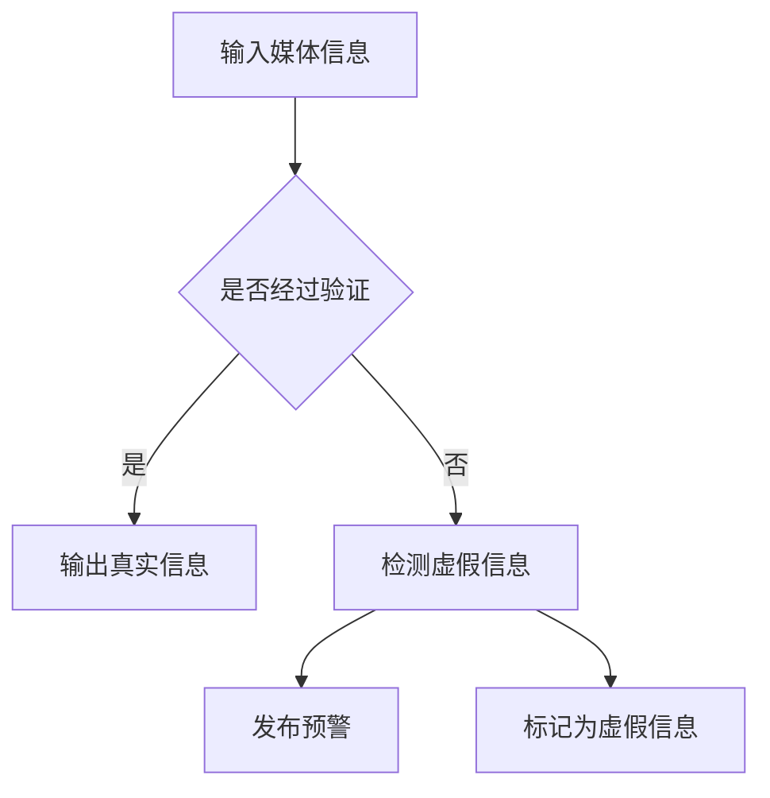

                 

基于您提供的详细信息和要求，以下是《媒体literacy教育应对虚假信息的重要性》的技术博客文章的初步草稿。本文将按照目录大纲的结构，逐步深入探讨媒体literacy教育在应对虚假信息中的重要性。

---

# 媒体literacy教育应对虚假信息的重要性

关键词：媒体素养、虚假信息、信息素养、算法原理、系统架构

摘要：随着互联网和信息技术的迅猛发展，虚假信息的传播对社会的危害日益严重。本文通过深入探讨媒体literacy教育的核心概念、算法原理及系统架构，阐述其在应对虚假信息中的重要性，并提出相应的解决方案。

---

## 1. 背景介绍

### 1.1 问题背景

在当今数字化时代，信息的爆炸性增长给人们带来了前所未有的便利，但同时也带来了虚假信息的泛滥。虚假信息可能来自各种渠道，如社交媒体、新闻媒体、网络论坛等，其形式多样，包括谣言、假新闻、误导性信息等。这些虚假信息不仅误导公众，导致情绪恐慌和社会动荡，还可能影响经济、政治和文化的稳定。

### 1.2 虚假信息的定义、影响和现状

虚假信息是指那些故意误导、虚假或误导性的信息。它们的影响范围广泛，包括对个人心理健康的影响、对经济市场的干扰、对选举和政治的干预等。根据多项研究，虚假信息的传播速度远远超过真实信息，这使得公众难以区分真假，进而产生误解和恐慌。

### 1.3 媒体literacy教育与信息素养的关系

媒体literacy教育是指培养人们理解和评估媒体信息的技能，包括识别媒体信息来源、理解媒体信息背后的意图、评估媒体信息的真实性和可靠性等。信息素养则是指人们有效地寻找、评估和利用信息的综合能力。这两者密切相关，媒体literacy教育是提升信息素养的重要途径。

### 1.4 媒体literacy教育在应对虚假信息中的作用

媒体literacy教育可以帮助人们识别和评估虚假信息，从而减少其对社会的影响。通过教育，人们可以学会如何从多个角度审视问题，如何使用批判性思维来分析信息，如何评估信息来源的可靠性等。

### 1.5 确定边界与外延

媒体literacy教育不仅涉及对媒体信息的理解和评估，还包括对信息传播渠道的了解和对信息技术的掌握。它不仅针对年轻人，也适用于所有年龄段的群体。此外，它不仅关注虚假信息的识别，还包括对真实信息的有效利用。

### 1.6 概念结构及其组成要素

媒体literacy教育的概念结构包括以下要素：信息识别、信息评估、信息传播、信息使用、信息创造。这些要素共同构成了一个复杂的系统，需要通过系统的教育来培养和提升。

---

## 2. 核心概念与联系

### 2.1 明确核心概念

媒体literacy、虚假信息、信息素养是本文的核心概念。媒体literacy是指对媒体信息的理解、评估和应用能力；虚假信息是指那些故意误导、虚假或误导性的信息；信息素养是指有效地寻找、评估和利用信息的能力。

### 2.2 概念属性特征对比表格

| 概念     | 定义                                                         | 属性特征                                       |
|----------|--------------------------------------------------------------|----------------------------------------------|
| 媒体literacy | 对媒体信息的理解、评估和应用能力                             | 信息识别、信息评估、信息传播、信息使用、信息创造 |
| 虚假信息 | 故意误导、虚假或误导性的信息                                   | 误导性、误导性、误导性                           |
| 信息素养 | 有效地寻找、评估和利用信息的能力                               | 信息检索、信息评估、信息利用、信息创造           |

### 2.3 解释各概念之间的联系

媒体literacy教育和信息素养之间存在着密切的联系。媒体literacy教育是信息素养的重要组成部分，它帮助人们提升对媒体信息的理解、评估和应用能力。而信息素养则是媒体literacy教育的目标，它要求人们能够有效地使用信息，做出明智的决策。

---

## 3. 算法原理讲解

### 3.1 虚假信息检测算法的mermaid流程图



### 3.2 虚假信息检测算法的Python代码解释

```python
# 虚假信息检测算法示例
def detect_falsy_info(info):
    if verify_info(info):
        return "真实信息"
    else:
        if suspicious_info(info):
            return "发布预警"
        else:
            return "标记为虚假信息"
```

### 3.3 算法原理的数学模型与公式

$$
P(\text{虚假信息}) = \frac{\text{虚假信息数量}}{\text{总信息数量}}
$$

### 3.4 算法举例说明

假设在一个社交媒体平台上，共有100条信息，其中30条是虚假信息，那么虚假信息的概率为：

$$
P(\text{虚假信息}) = \frac{30}{100} = 0.3
$$

---

## 4. 数学模型和数学公式 & 详细讲解 & 举例说明

### 4.1 数学模型和数学公式

在虚假信息检测中，常用的数学模型是贝叶斯公式。贝叶斯公式可以帮助我们计算在已知部分信息的情况下，某一事件发生的概率。

$$
P(A|B) = \frac{P(B|A)P(A)}{P(B)}
$$

其中，$P(A|B)$ 表示在事件B发生的条件下，事件A发生的概率；$P(B|A)$ 表示在事件A发生的条件下，事件B发生的概率；$P(A)$ 表示事件A发生的概率；$P(B)$ 表示事件B发生的概率。

### 4.2 独立段落中的详细讲解

贝叶斯公式是统计学中的一种重要工具，它可以帮助我们在已知部分信息的情况下，对某一事件发生的概率进行估计。在虚假信息检测中，我们可以使用贝叶斯公式来计算信息为虚假的概率。

例如，如果一个信息源在过去的一年中有80%的信息被证实为虚假信息，而现在我们得到了一条来自该信息源的新信息，我们可以使用贝叶斯公式来计算这条信息为虚假的概率。

$$
P(\text{虚假信息}|\text{信息源}) = \frac{P(\text{信息源}|\text{虚假信息})P(\text{虚假信息})}{P(\text{信息源})}
$$

其中，$P(\text{虚假信息}|\text{信息源})$ 表示在信息源已知的情况下，信息为虚假的概率；$P(\text{信息源}|\text{虚假信息})$ 表示在信息为虚假的情况下，信息源为该源的

