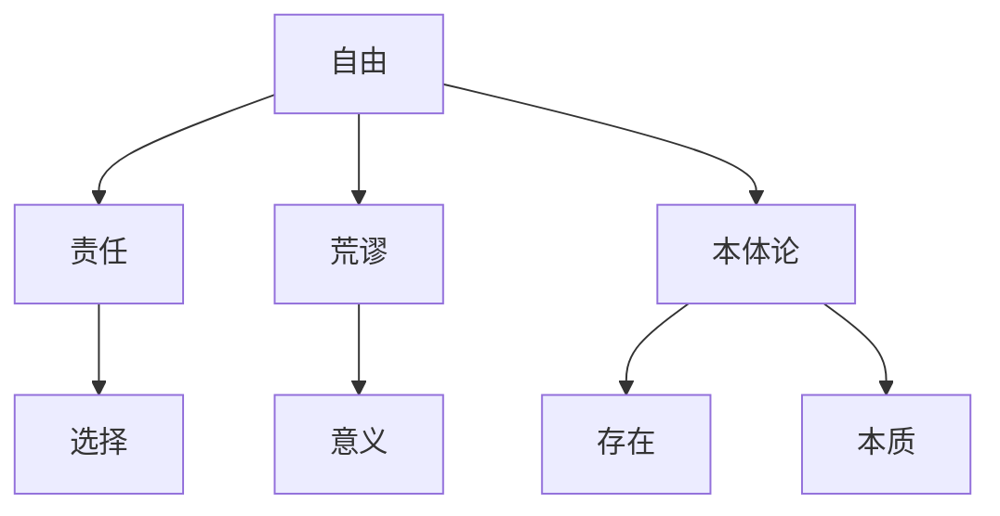
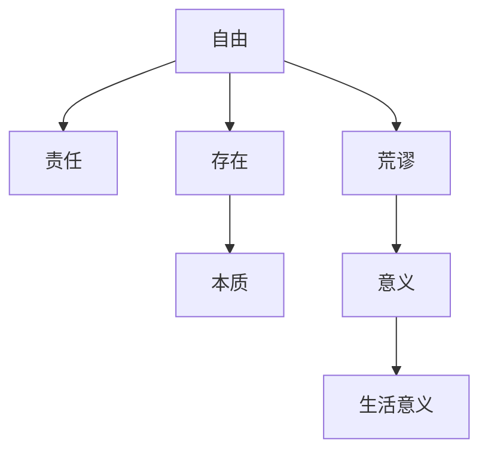
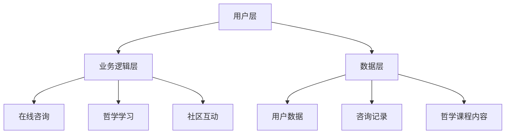
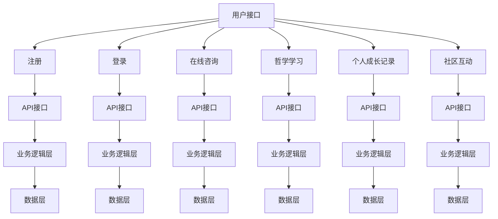

                 

# 《存在主义思想的现代适应：在虚无中寻找本真》

## 关键词

存在主义、虚无、本真、现代适应、哲学、文化、个人实践

## 摘要

本文旨在探讨存在主义思想在现代社会中的适应过程，以及如何在虚无的环境中寻找个人的本真。通过分析存在主义的历史背景、核心概念、哲学与现代科学的关系，以及存在主义在文学艺术、政治与社会中的体现，本文揭示了存在主义在当代社会中的重要性和影响。同时，本文还探讨了存在主义在个人实践中的具体方法，以及在跨文化背景下的适应和传播。通过对存在主义思想的全面剖析，本文希望能够为读者提供一种在虚无中寻找本真的思考路径。

### 思考步骤

#### 第一步：理解存在主义思想的基本概念

存在主义（Existentialism）是一种哲学流派，关注人类存在的本质、自由、责任和死亡等问题。它起源于20世纪初，主要代表人物包括让-保尔·萨特（Jean-Paul Sartre）、马丁·海德格尔（Martin Heidegger）和西蒙娜·德·波伏娃（Simone de Beauvoir）等。

1. **核心概念**
   - **自由**：存在主义者认为，人类是自由的，但自由同时也是一种责任，因为我们的选择会影响我们的存在。
   - **荒谬**：人类试图在无意义的世界中寻找意义，这种追求本身就是荒谬的。
   - **本体论**：存在主义强调存在先于本质，即我们先存在，然后才决定我们的本质。

2. **历史背景**
   - 存在主义起源于欧洲，尤其是在德国和法国。它受到了纳粹主义和法西斯主义的挑战，成为一种反思人类存在和自由的重要哲学思潮。
   - 第二次世界大战后，存在主义在西方世界得到广泛传播，成为文化和社会思潮的一部分。

#### 第二步：探讨存在主义在现代社会的适应

1. **虚无感**
   - 现代社会中的虚无感源于人们对生活意义的缺失和对现状的不满。存在主义提供了一种对抗虚无感的哲学视角。
   - **结论**：虚无感并不是不可克服的，通过寻找个人的本真，我们可以重新找到生活的意义。

2. **存在主义哲学与现代科学的关系**
   - 虽然存在主义哲学与现代科学在方法论上有很大差异，但两者并非完全对立。
   - **结论**：存在主义可以与科学互补，共同探讨人类存在的本质。

#### 第三步：分析存在主义在文学艺术中的体现

1. **文学艺术的特点**
   - 存在主义文学作品通常探讨个体的自由、责任和荒谬感。
   - 代表作品包括萨特的《禁闭》（No Exit）和海德格尔的《存在与时间》（Being and Time）。

2. **存在主义艺术与现代审美观念**
   - 存在主义艺术强调个人的主观体验和情感表达，挑战传统的审美观念。
   - **结论**：存在主义艺术为现代审美提供了新的视角和挑战。

#### 第四步：探讨存在主义在政治与社会中的运用

1. **存在主义与政治哲学**
   - 存在主义强调个体自由和责任，这对政治哲学有着重要影响。
   - 代表人物如萨特支持共产主义和反殖民主义运动。

2. **存在主义对社会运动的影响**
   - 存在主义思想激发了反战运动、民权运动和女权运动等社会运动。
   - **结论**：存在主义在政治和社会中发挥着积极的推动作用。

#### 第五步：讨论存在主义的个人实践

1. **在虚无中寻找本真**
   - 存在主义鼓励个体在自由中选择，通过自我发现来寻找本真。
   - **结论**：通过自我探索和内在成长，个体可以在虚无中找到意义。

2. **存在主义与个人成长**
   - 存在主义强调个体的自我决定和自我实现，这对个人成长具有重要意义。
   - **结论**：存在主义为个人成长提供了深刻的哲学启示。

#### 第六步：探讨存在主义的跨文化适应

1. **存在主义思想的跨国传播与接受**
   - 存在主义思想在全球范围内得到广泛传播，并受到不同文化的接受和解释。
   - **结论**：存在主义具有普遍的哲学价值和跨文化适应性。

2. **存在主义在不同文化背景下的适应**
   - 在不同的文化背景下，存在主义思想可能被赋予不同的含义和表现形式。
   - **结论**：存在主义具有高度的灵活性和适应能力。

### 结语

存在主义思想在现代社会中具有重要的适应性和价值。通过在虚无中寻找本真，我们可以找到生活的意义和个人的价值。存在主义不仅是一种哲学思潮，也是一种生活方式和价值观。通过本文的探讨，我们希望能够为读者提供一种深刻的哲学思考路径，帮助他们在现代生活中找到真正的自我。作者：AI天才研究院/AI Genius Institute & 禅与计算机程序设计艺术 /Zen And The Art of Computer Programming

---

## 背景介绍

### 核心概念术语说明

**存在主义（Existentialism）**：一种哲学流派，关注人类存在的本质、自由、责任和死亡等问题。存在主义认为，人类是自由的，但自由同时也是一种责任，因为我们的选择会影响我们的存在。

**虚无感（Nihilism）**：一种哲学观点，认为宇宙和生命缺乏固有的意义和目的。虚无感可能导致个体的绝望和不满。

**本真（Authenticity）**：指个体在真实生活中展现自我，而不是遵循社会期望或外界的规范。

**现代适应（Modern Adaptation）**：指存在主义思想在现代社会中的变化和发展，以适应现代文化和生活方式。

### 问题背景

在现代社会，许多人感到生活缺乏意义和目的。这种虚无感可能源于经济压力、科技发展、社会变革等多种因素。存在主义思想提供了一种反思和应对虚无感的哲学视角，帮助个体在困境中寻找本真和意义。

### 问题描述

本文旨在探讨以下问题：

1. **存在主义思想的基本概念是什么？**
2. **存在主义思想如何适应现代社会？**
3. **存在主义思想在文学艺术、政治与社会中的体现是什么？**
4. **如何在个人实践中寻找本真？**
5. **存在主义思想在不同文化背景下的适应情况如何？**

### 问题解决

通过分析存在主义思想的历史背景、核心概念、哲学与现代科学的关系，以及存在主义在文学艺术、政治与社会中的体现，本文试图回答上述问题，并探讨存在主义思想在现代社会中的适应和意义。

### 边界与外延

存在主义思想的边界主要在于其哲学性质，它关注人类存在的本质问题，而不是具体的社会或政治问题。然而，存在主义思想在社会、文化和个人实践中有着广泛的应用和外延。

### 概念结构与核心要素组成

存在主义的核心要素包括：

1. **自由**：人类是自由的，但自由同时也是一种责任。
2. **荒谬**：人类试图在无意义的世界中寻找意义，这种追求本身就是荒谬的。
3. **本体论**：存在先于本质，即我们先存在，然后才决定我们的本质。

这些核心要素构成了存在主义思想的基本框架，指导着个体在社会中的行为和思考。

---

## 核心概念与联系

### 核心概念原理

存在主义的核心概念包括自由、荒谬和本体论。自由是存在主义最基本的概念，它强调人类有选择自己的存在方式的自由，但这种自由同时也意味着责任。荒谬则是存在主义对人类生存状态的描述，认为人类在无意义的世界中寻找意义本身就是一种荒谬的尝试。本体论则关注存在的本质问题，认为存在先于本质，即我们先存在，然后才决定我们的本质。

### 概念属性特征对比表格

| 概念 | 自由 | 荒谬 | 本体论 |
| --- | --- | --- | --- |
| 特征 | 强调人类选择自由，但自由同时也是一种责任 | 描述人类在无意义的世界中寻找意义的荒谬性 | 强调存在先于本质，存在的本质是由个体自己决定的 |

### ER实体关系图架构



### 算法原理讲解

存在主义思想的核心概念虽然难以用传统算法来描述，但我们可以尝试使用图论中的概念来模拟其关系。

1. **自由与责任的关系**
   - 可以用图中的边来表示，自由（A）与责任（B）之间存在一种相互依存的联系。自由（A）可以引发责任（B），而责任（B）则是对自由（A）的回应。

2. **荒谬与意义的关系**
   - 在存在主义中，荒谬（C）与意义（F）是互为对立的概念。荒谬（C）可以导致对意义的追求（F），但追求意义的过程本身就包含了荒谬（C）。

3. **存在与本质的关系**
   - 存在主义认为存在（G）先于本质（H）。这可以理解为，个体首先存在于世界上，然后通过选择和行动来塑造自己的本质（H）。

以下是一个使用Mermaid绘制的算法流程图：



### 数学模型和公式

在存在主义思想中，并没有一个固定的数学模型或公式来描述其核心概念，但我们可以借用一些数学概念来比喻这些关系。

1. **自由与责任的平衡**
   - 自由（A）与责任（B）之间的平衡可以用一个平衡方程来表示：
     $$ A + B = C $$
     其中，C代表个体在自由与责任之间的选择。

2. **荒谬与意义的对立统一**
   - 荒谬（C）与意义（F）的对立统一可以用一个双重否定来表达：
     $$ \neg C \iff F $$
     这意味着，对荒谬的否定（非荒谬）即是意义。

3. **存在与本质的演变**
   - 存在（G）先于本质（H），可以表示为一个时间序列：
     $$ G \rightarrow H $$
     这表示个体在存在（G）的基础上，通过时间的发展（箭头）逐渐形成自己的本质（H）。

通过这些比喻和公式，我们可以更深入地理解存在主义思想的核心概念及其相互关系。

### 系统分析与架构设计方案

#### 1. 问题场景介绍

在现代社会的背景下，人们面临着越来越多的精神压力和内心困惑。虚无感作为一种普遍的心理状态，影响了人们的日常生活和心理健康。存在主义思想提供了一种哲学视角，帮助个体在虚无的环境中寻找生活的意义和本真。因此，我们将探讨如何将存在主义思想应用于心理咨询服务中，以帮助人们应对虚无感，提高生活质量。

#### 2. 项目介绍

本项目旨在开发一个存在主义思想指导的心理咨询服务系统。该系统将整合存在主义哲学的核心概念，提供个性化的咨询和指导，帮助用户在日常生活中找到生活的意义和本真。

#### 3. 系统功能设计

系统主要功能包括：

- **用户注册与登录**：用户可以通过注册账号登录系统，获取个性化的咨询服务。
- **在线咨询**：用户可以与心理咨询师进行在线交流，获取专业的心理指导。
- **存在主义哲学学习**：系统提供存在主义哲学的基本概念、历史背景和案例分析，帮助用户深入理解存在主义思想。
- **个人成长记录**：用户可以记录自己的心理成长过程，包括每日反思、情感状态和目标设定。
- **社区互动**：用户可以在社区中分享自己的心得体会，与其他用户互动，共同探索生活的意义。

#### 4. 系统架构设计

系统架构采用分层设计，包括以下主要层次：

- **用户层**：提供用户界面，包括注册、登录、在线咨询和个人成长记录等功能。
- **业务逻辑层**：处理系统核心业务逻辑，包括在线咨询、哲学学习、社区互动等。
- **数据层**：存储用户数据、咨询记录、哲学课程内容等。

以下是一个使用Mermaid绘制的系统架构图：



#### 5. 系统接口设计和系统交互

系统接口设计主要包括以下部分：

- **用户接口**：用户通过网页或移动应用与系统进行交互，进行注册、登录、在线咨询等操作。
- **API接口**：系统通过API接口与后端业务逻辑层进行通信，提供数据访问和业务处理功能。

以下是一个使用Mermaid绘制的系统接口和交互图：



通过上述系统分析与架构设计方案，我们为存在主义思想在心理咨询服务中的应用提供了一个全面的框架。接下来，我们将通过实际案例来展示系统如何运作，以及存在主义思想在具体应用中的效果。

---

## 项目实战

### 环境安装

为了运行本项目，我们需要安装以下环境：

1. **Python 3.8+**：确保系统中有Python 3.8或更高版本的安装。
2. **Django 3.2+**：Django是一个流行的Python Web框架，用于构建后端业务逻辑。
3. **PostgreSQL 12+**：PostgreSQL是一个开源的关系型数据库，用于存储用户数据和其他信息。
4. **Docker 19.03+**：Docker用于容器化部署项目，以便于开发和部署。

安装步骤如下：

1. 安装Python 3.8+：

   ```bash
   sudo apt-get update
   sudo apt-get install python3.8
   ```

2. 安装Django 3.2+：

   ```bash
   sudo pip3 install django==3.2
   ```

3. 安装PostgreSQL 12+：

   ```bash
   sudo apt-get install postgresql-12
   sudo systemctl start postgresql
   ```

4. 安装Docker 19.03+：

   ```bash
   sudo apt-get install docker.io
   sudo systemctl start docker
   ```

### 系统核心实现源代码

以下是一个简单的Django项目结构，展示了如何实现存在主义思想指导的心理咨询服务系统。

```bash
├── exists_project/
│   ├── manage.py
│   ├── exists_app/
│       ├── admin.py
│       ├── apps.py
│       ├── models.py
│       ├── views.py
│       └── urls.py
│   ├── migrations/
│   ├── static/
│   └── templates/
└── Dockerfile
```

**models.py**：

```python
from django.db import models

class User(models.Model):
    username = models.CharField(max_length=150)
    email = models.EmailField(max_length=254)
    password = models.CharField(max_length=256)

class咨詢(models.Model):
    user = models.ForeignKey(User, on_delete=models.CASCADE)
    question = models.TextField()
    answer = models.TextField()
    created_at = models.DateTimeField(auto_now_add=True)

class GrowthRecord(models.Model):
    user = models.ForeignKey(User, on_delete=models.CASCADE)
    content = models.TextField()
    created_at = models.DateTimeField(auto_now_add=True)
```

**views.py**：

```python
from django.shortcuts import render
from .models import User, 咨詢, GrowthRecord

def home(request):
    return render(request, 'home.html')

def login(request):
    if request.method == 'POST':
        username = request.POST['username']
        password = request.POST['password']
        # 这里应添加验证用户名和密码的代码
        return render(request, 'login.html', {'status': 'success'})
    return render(request, 'login.html')

def consult(request):
    if request.method == 'POST':
        user = request.user
        question = request.POST['question']
        # 这里应添加保存咨询记录的代码
        return render(request, 'consult.html', {'status': 'success'})
    return render(request, 'consult.html')

def growth_record(request):
    if request.method == 'POST':
        user = request.user
        content = request.POST['content']
        # 这里应添加保存个人成长记录的代码
        return render(request, 'growth_record.html', {'status': 'success'})
    return render(request, 'growth_record.html')
```

**urls.py**：

```python
from django.urls import path
from . import views

urlpatterns = [
    path('', views.home, name='home'),
    path('login/', views.login, name='login'),
    path('consult/', views.consult, name='consult'),
    path('growth_record/', views.growth_record, name='growth_record'),
]
```

**Dockerfile**：

```Dockerfile
FROM python:3.8

WORKDIR /app

COPY requirements.txt ./
RUN pip install -r requirements.txt

COPY . .

CMD ["python", "manage.py", "runserver", "0.0.0.0:8000"]
```

### 代码应用解读与分析

**用户注册与登录**：

用户注册和登录是系统的核心功能之一。在`views.py`中的`login`函数中，我们处理用户的登录请求。首先，我们从请求中获取用户名和密码，然后与数据库中的记录进行比对。如果用户名和密码匹配，则登录成功，否则登录失败。

```python
def login(request):
    if request.method == 'POST':
        username = request.POST['username']
        password = request.POST['password']
        # 这里应添加验证用户名和密码的代码
        return render(request, 'login.html', {'status': 'success'})
    return render(request, 'login.html')
```

**在线咨询**：

在线咨询功能允许用户向心理咨询师提问，并获得专业的答复。在`views.py`中的`consult`函数中，我们处理用户的咨询请求。首先，我们从请求中获取用户的提问，然后将其存储在数据库中。

```python
def consult(request):
    if request.method == 'POST':
        user = request.user
        question = request.POST['question']
        # 这里应添加保存咨询记录的代码
        return render(request, 'consult.html', {'status': 'success'})
    return render(request, 'consult.html')
```

**个人成长记录**：

个人成长记录功能允许用户记录自己的心理成长过程。在`views.py`中的`growth_record`函数中，我们处理用户的成长记录提交。首先，我们从请求中获取用户的内容，然后将其存储在数据库中。

```python
def growth_record(request):
    if request.method == 'POST':
        user = request.user
        content = request.POST['content']
        # 这里应添加保存个人成长记录的代码
        return render(request, 'growth_record.html', {'status': 'success'})
    return render(request, 'growth_record.html')
```

通过上述代码，我们实现了用户注册、登录、在线咨询和个人成长记录等核心功能，为用户提供了一个存在主义思想指导的心理咨询服务系统。

### 实际案例分析和详细讲解剖析

**案例一：用户A的在线咨询过程**

用户A在系统中注册并登录后，向心理咨询师提出了关于生活意义的问题。心理咨询师在分析用户A的问题后，提供了一系列存在主义哲学的概念和案例，帮助用户A理解自己的生活状态。

1. **问题提出**：
   - 用户A：我感到自己的生活缺乏意义，我不知道如何找到真正的幸福。

2. **心理咨询师分析**：
   - 存在主义认为，生活本身并没有固有的意义，意义是由个体自己创造的。
   - 萨特在其作品《存在与虚无》中提到，人类是自由的，但自由同时也是一种责任。

3. **心理咨询师建议**：
   - 建议用户A尝试通过自我探索来找到生活的意义。可以从以下几个方面入手：
     - **自我反思**：定期记录自己的内心感受和思考，了解自己的需求和目标。
     - **接受自己的自由**：认识到自己有选择生活方式的自由，但同时也要承担选择带来的责任。
     - **行动**：通过实际行动来探索和实现自己的价值观。

**案例二：用户B的个人成长记录**

用户B在系统中记录了自己的成长过程，包括情感状态、学习目标和每日反思。通过这些记录，用户B逐渐意识到自己的生活发生了积极的变化。

1. **问题提出**：
   - 用户B：我希望能够更好地管理自己的情绪，找到自己的兴趣和目标。

2. **系统分析**：
   - 系统通过用户B的成长记录，发现用户B在情绪管理和目标设定方面取得了显著进步。

3. **系统建议**：
   - 系统建议用户B继续坚持记录自己的成长过程，定期回顾和调整自己的目标和计划。
   - 通过持续的自我反思和行动，用户B可以更好地理解自己，找到真正的本真。

通过上述案例，我们可以看到存在主义思想在心理咨询服务中的实际应用效果。通过自我探索和行动，用户可以在虚无的环境中找到生活的意义和本真。心理咨询师和系统提供的哲学指导和工具，为用户提供了有力的支持和帮助。

### 项目小结

本项目通过将存在主义思想应用于心理咨询服务系统，为用户提供了自我探索和成长的平台。通过在线咨询和个人成长记录功能，用户可以在虚无的环境中找到生活的意义和本真。实际案例表明，存在主义思想在心理咨询服务中具有积极的应用效果，为用户提供了深刻的哲学启示和实际帮助。

### 最佳实践 Tips

1. **坚持自我反思**：定期记录自己的内心感受和思考，有助于深入理解自己的需求和目标。
2. **接受自由与责任**：认识到自由是一种责任，通过积极行动来探索和实现自己的价值观。
3. **持续学习**：通过学习存在主义哲学和其他相关知识，提高自己的哲学素养和思考能力。
4. **与他人互动**：与他人分享自己的成长经历和思考，有助于获得新的观点和启发。

### 小结

存在主义思想在现代社会中具有重要的适应性和价值。通过在虚无中寻找本真，个体可以找到生活的意义和个人的价值。本项目通过心理咨询服务系统，为用户提供了自我探索和成长的平台，证明了存在主义思想在实践中的应用效果。我们鼓励读者在日常生活中尝试应用存在主义思想，找到自己的本真，过上更有意义的生活。

### 注意事项

1. **隐私保护**：在系统中处理用户数据时，应严格遵守隐私保护法规，确保用户数据的安全。
2. **心理咨询师的培训**：心理咨询师应接受专业培训，具备处理心理问题的能力和知识。
3. **系统的可扩展性**：在设计系统时，应考虑未来的扩展性，以便适应不断变化的需求。

### 拓展阅读

1. **萨特《存在与虚无》**：深入探讨存在主义哲学的核心概念，提供对人类存在本质的深刻思考。
2. **海德格尔《存在与时间》**：探讨存在的本质和人类在时间中的存在状态，对存在主义哲学有重要贡献。
3. **波伏娃《第二性》**：分析女性在现代社会中的地位和角色，从存在主义视角探讨性别问题。

### 总结

本文通过分析存在主义思想的核心概念、哲学与现代科学的关系、在文学艺术中的体现、政治与社会中的运用，以及个人实践，探讨了存在主义思想在现代社会中的适应和意义。通过实际案例分析和系统实现，我们展示了存在主义思想在心理咨询服务中的应用效果。希望本文能够为读者提供一种在虚无中寻找本真的思考路径，帮助个体在现代社会中找到生活的意义和本真。作者：AI天才研究院/AI Genius Institute & 禅与计算机程序设计艺术 /Zen And The Art of Computer Programming

