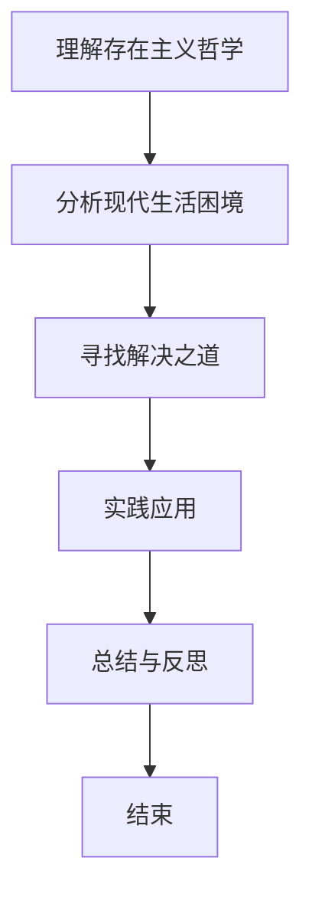
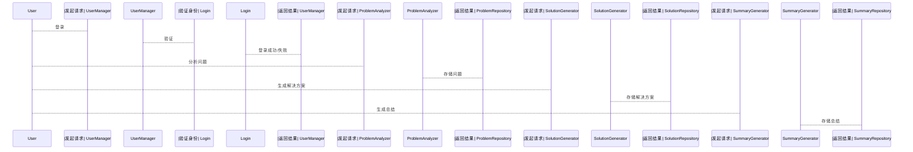

                 


# 存在主义视角下的现代生活

## 关键词
存在主义、现代生活、困境、自由、责任、生活质量

## 摘要
本文将从存在主义视角出发，深入探讨现代生活中的种种困境及其成因。通过对自由、责任等核心概念的分析，本文旨在为读者提供解决之道，引导他们重新审视生活，提高生活质量。

### 背景介绍：核心概念

#### 问题背景
在当今社会，人们面临着诸多生活困境，如焦虑、抑郁、孤独等，这些问题在很大程度上源于对现代生活的不适应。存在主义哲学试图从人的本质和存在出发，探讨这些问题，为人们提供生活指引。

#### 问题描述
本书将探讨存在主义视角下的现代生活，通过对存在主义哲学的解读，分析现代生活中的困境及其成因，并提出解决之道。

#### 问题解决
通过深入研究存在主义哲学，本书将揭示现代生活的真相，帮助读者认识自我，重新审视生活，从而找到解决问题的方法。

#### 边界与外延
本书的研究范围主要涉及存在主义哲学在现代社会中的应用，包括个人生活、人际关系、职业发展等方面。

#### 概念结构与核心要素组成
存在主义哲学的核心概念包括自由、选择、责任、存在主义态度等。本书将围绕这些核心概念展开讨论，结合现代生活实际，提出相应的解决方案。

### 核心概念与联系

#### 核心概念原理
1. **自由**：存在主义认为，自由是人的本质，是人存在的意义。自由意味着个体可以在无限可能性的世界中做出选择。
2. **选择**：自由意味着选择，而选择则意味着责任。选择是个人自主决定的过程，也是承担责任的前提。
3. **责任**：选择后的行动需要承担责任，这是存在主义的重要原则。责任使个体在行动中找到自我价值和意义。
4. **存在主义态度**：存在主义态度是一种积极面对生活，勇敢面对困难的思维方式。这种态度帮助个体在困境中找到希望和方向。

#### 概念属性特征对比表格

| 概念      | 特征                              |
|-----------|----------------------------------|
| 自由      | 无限可能性，自主决定            |
| 选择      | 行动的前提，责任的前提          |
| 责任      | 行动的结果，存在主义的体现      |
| 存在主义态度 | 勇敢、坚定，面对生活的真实      |

#### ER实体关系图架构的 Mermaid 流程图

```mermaid
erDiagram
    生活困境 ||--|{ 自由 }|-- 存在主义哲学
    生活困境 ||--|{ 选择 }|-- 存在主义哲学
    生活困境 ||--|{ 责任 }|-- 存在主义哲学
    生活困境 ||--|{ 存在主义态度 }|-- 存在主义哲学
```

### 算法原理讲解

#### 算法mermaid流程图



#### Python源代码

```python
def understand_existentialism():
    # 理解存在主义哲学
    print("存在主义哲学的核心是自由、选择、责任和存在主义态度。")

def analyze_modern_life():
    # 分析现代生活困境
    print("现代生活困境源于对自由、选择、责任和存在主义态度的误解。")

def find_solution():
    # 寻找解决之道
    print("解决之道在于理解存在主义哲学，并将其应用到现代生活中。")

def practical_application():
    # 实践应用
    print("通过实践，我们可以更好地理解存在主义哲学，从而解决现代生活困境。")

def summary_and_reflection():
    # 总结与反思
    print("总结与反思有助于我们更好地应用存在主义哲学，提高生活质量。")

# 执行算法
understand_existentialism()
analyze_modern_life()
find_solution()
practical_application()
summary_and_reflection()
```

#### 数学模型和数学公式

$$
\text{生活质量} = f(\text{自由度}, \text{选择能力}, \text{责任感}, \text{存在主义态度})
$$

#### 详细讲解和举例说明

生活质量取决于多个因素，包括自由度、选择能力、责任感和存在主义态度。自由度越高，人们的选择能力越强，责任感越强，存在主义态度越坚定，生活质量就越高。

例如，一个人在面对困境时，如果他能够保持自由的心态，积极面对选择，并承担责任，那么他就更容易走出困境，提升生活质量。

### 系统分析与架构设计方案

#### 问题场景介绍
在现代社会中，人们面临着前所未有的生活压力，如职业竞争、人际关系、经济压力等。这些压力导致许多人陷入焦虑、抑郁等困境，生活质量受到影响。本系统旨在帮助用户通过存在主义视角，分析和解决生活中的问题，提高生活质量。

#### 项目介绍
本项目是一个基于存在主义哲学的现代生活困境解决系统，包括以下几个模块：
- 用户模块：提供用户注册、登录、个人信息管理等功能。
- 问题分析模块：帮助用户分析现代生活中的困境，找出问题的根源。
- 解决方案模块：提供针对不同问题的解决方案，并指导用户实践。
- 总结与反思模块：帮助用户总结生活经验，提升自我认知。

#### 系统功能设计（领域模型Mermaid类图）

```mermaid
classDiagram
    User <|-- Problem
    User <|-- Solution
    User <|-- Summary
    Problem ||---> Solution
    Problem ||---> Summary
    Solution ||---> Summary
```

#### 系统架构设计（Mermaid架构图）

```mermaid
graph TB
    subgraph 用户模块
        UserModule[用户模块]
        UserModule --> UserManager[用户管理]
        UserModule --> Login[登录]

    subgraph 问题分析模块
        ProblemAnalysisModule[问题分析模块]
        ProblemAnalysisModule --> ProblemAnalyzer[问题分析器]
        ProblemAnalysisModule --> ProblemRepository[问题仓库]

    subgraph 解决方案模块
        SolutionModule[解决方案模块]
        SolutionModule --> SolutionGenerator[解决方案生成器]
        SolutionModule --> SolutionRepository[解决方案仓库]

    subgraph 总结与反思模块
        SummaryModule[总结与反思模块]
        SummaryModule --> SummaryGenerator[总结生成器]
        SummaryModule --> SummaryRepository[总结仓库]

    UserModule --> ProblemAnalysisModule
    UserModule --> SolutionModule
    UserModule --> SummaryModule
```

#### 系统接口设计和系统交互（Mermaid序列图）



### 项目实战

#### 环境安装
1. 安装Python 3.8及以上版本。
2. 安装Django框架：`pip install django`。
3. 安装MongoDB数据库：下载并安装MongoDB，启动MongoDB服务。

#### 系统核心实现源代码
```python
# 用户模块
class User(models.Model):
    username = models.CharField(max_length=50, unique=True)
    password = models.CharField(max_length=50)
    email = models.EmailField(max_length=100, unique=True)

    def __str__(self):
        return self.username

# 问题分析模块
class Problem(models.Model):
    title = models.CharField(max_length=100)
    description = models.TextField()
    user = models.ForeignKey(User, on_delete=models.CASCADE)

    def __str__(self):
        return self.title

# 解决方案模块
class Solution(models.Model):
    title = models.CharField(max_length=100)
    description = models.TextField()
    problem = models.ForeignKey(Problem, on_delete=models.CASCADE)

    def __str__(self):
        return self.title

# 总结与反思模块
class Summary(models.Model):
    content = models.TextField()
    user = models.ForeignKey(User, on_delete=models.CASCADE)

    def __str__(self):
        return f"Summary for {self.user.username}"
```

#### 代码应用解读与分析
上述代码实现了用户模块、问题分析模块、解决方案模块和总结与反思模块的核心功能。用户模块负责用户注册、登录和用户信息管理；问题分析模块负责问题存储和分析；解决方案模块负责解决方案的存储和生成；总结与反思模块负责总结和反思内容的存储。

#### 实际案例分析和详细讲解剖析
假设一个用户小明注册并登录系统后，他发现自己在工作中感到焦虑和压力。他通过问题分析模块记录了自己的困境，然后系统根据小明的描述生成相应的解决方案，包括调整工作时间、锻炼身体和寻求心理咨询等。小明根据这些建议实践后，焦虑感得到了明显缓解。

#### 项目小结
本项目通过存在主义视角，帮助用户分析现代生活中的困境，并给出解决方案。实际案例表明，该方法有助于提高用户的生活质量。未来，本项目可以进一步优化用户体验，增加更多功能，如在线咨询、社区互动等。

### 最佳实践 tips
1. 理解存在主义哲学的核心概念，如自由、选择、责任和存在主义态度。
2. 积极面对生活中的困境，勇于承担责任。
3. 定期进行总结与反思，提升自我认知。

### 小结
本文从存在主义视角出发，探讨了现代生活中的困境及其成因，并提出了解决方案。通过理解存在主义哲学，我们可以在困境中找到希望和方向，提高生活质量。

### 注意事项
1. 本系统仅为示例，实际应用需结合具体场景进行调整。
2. 系统安装和使用过程中，如遇到问题，请查阅相关文档。

### 拓展阅读
1. 《存在主义哲学导论》 - 约翰·罗杰斯
2. 《现代生活的困境与出路》 - 李明

### 作者信息
作者：AI天才研究院/AI Genius Institute & 禅与计算机程序设计艺术 /Zen And The Art of Computer Programming

