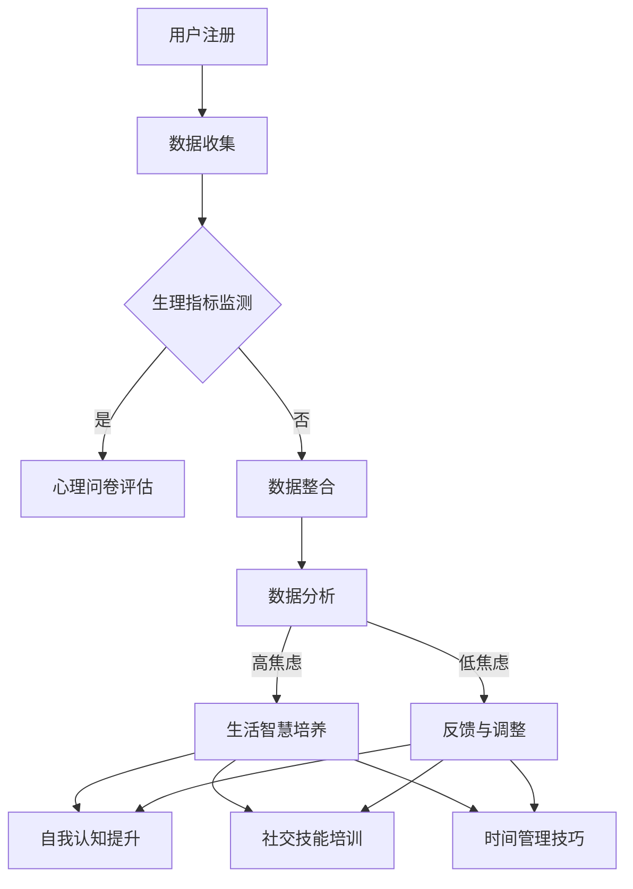
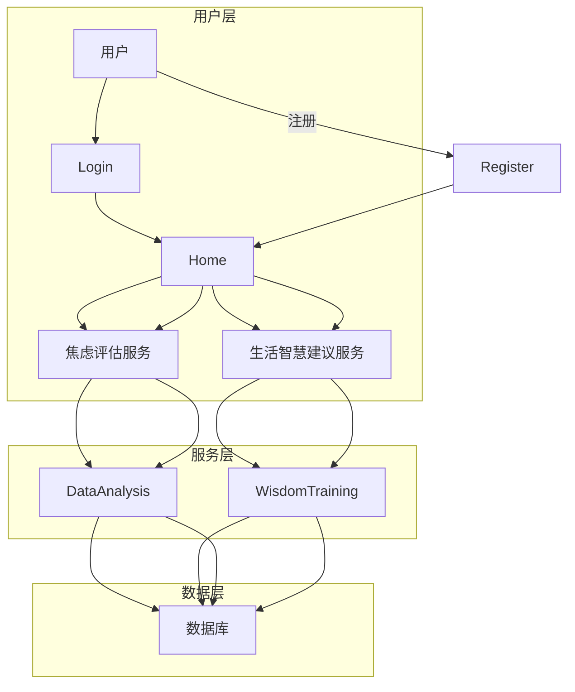
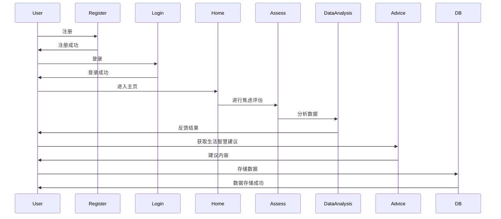

                 

### 第1章 引言：存在的焦虑与生活智慧

在当今快速变化的世界中，焦虑似乎已成为现代社会的一种普遍现象。我们常常感受到一种无形的压力，仿佛生活中的不确定性正在不断增大。这种焦虑不仅仅是心理上的困扰，它对我们的日常生活、心理健康以及人际关系都有着深远的影响。那么，如何面对这种存在的焦虑，找到生活的智慧，成为我们这个时代的重要课题。

#### 1.1 问题的背景与描述

**1.1.1 焦虑在现代社会中的普遍性**

随着社会的飞速发展和变化，人们面临的压力源也日益增多。城市化进程的加快、工作环境的竞争激烈、经济压力的增大、家庭责任的重负等，都使得焦虑成为了现代社会中的一种普遍情感体验。

- **社会变迁下的不确定性和压力**：全球化和技术进步带来了工作机会的增多，但同时也带来了职业的不稳定性和技能快速过时的风险。
- **工作与生活的平衡难题**：现代工作往往需要投入更多的时间和精力，如何平衡工作与生活成为了一个重要的挑战。
- **人际关系中的复杂情感**：在快节奏的生活中，人们往往忽略了与家人、朋友和同事之间的情感交流，导致人际关系紧张和焦虑的产生。

**1.1.2 焦虑对个体生活的影响**

焦虑不仅仅是一种情感体验，它还会对个体的行为和心理产生深远的影响。

- **心理健康问题**：长期的焦虑可能导致心理健康问题，如抑郁症、焦虑症等。
- **行为模式的改变**：焦虑可能会使个体改变其行为模式，比如避免某些情境、过度担忧等。
- **社交与职业发展的影响**：焦虑可能会影响个人的社交能力和职业发展，导致个人能力和机会的浪费。

**1.1.3 面对焦虑的挑战**

面对焦虑，我们需要采取积极的应对策略，以提高生活的智慧和质量。

- **深度理解焦虑的本质**：了解焦虑的根源和机制，有助于我们更有效地应对焦虑。
- **寻求有效的应对策略**：包括心理治疗、药物治疗、生活方式的调整等。
- **探索生活的智慧与意义**：通过自我反思和心灵成长，找到生活的真正意义和目标，从而减轻焦虑。

#### 1.2 核心概念与联系

在本章节，我们将深入探讨两个核心概念：存在的焦虑和生活智慧。

**1.2.1 存在的焦虑**

**1.2.1.1 概念定义**

存在的焦虑，是指个体在面对生活中的不确定性和无意义感时产生的一种情感体验。它不仅仅是对某一具体事件的反应，而是一种更广泛的心理状态。

- **焦虑的心理学定义**：焦虑是一种情绪状态，通常表现为紧张、担忧、恐惧等情绪体验。
- **存在主义视角下的焦虑**：存在主义者认为，焦虑是人类存在的本质特征，它迫使我们面对生活的真实状况和自由选择。

**1.2.1.2 焦虑的特性**

焦虑具有多种特性，包括情感体验、心理反应和社交影响。

- **情感体验**：焦虑通常表现为紧张、担忧、恐惧等情绪体验，可能会引发失眠、疲劳等症状。
- **心理反应**：焦虑可能会导致个体的认知和行为反应，如过度担忧、回避某些情境等。
- **社交影响**：焦虑可能会影响个体的社交能力和人际关系，导致孤独、隔离等负面体验。

**1.2.1.3 焦虑的类型**

焦虑可以分为多种类型，包括一般焦虑、特定情境下的焦虑和焦虑障碍。

- **一般焦虑**：一般焦虑是指个体对生活中的各种事件和情境产生的广泛性焦虑。
- **特定情境下的焦虑**：特定情境下的焦虑是指个体在特定情境下产生的强烈焦虑，如社交焦虑、考试焦虑等。
- **焦虑障碍**：焦虑障碍是指个体由于焦虑过度而无法正常生活和工作，如广泛性焦虑障碍、恐慌障碍等。

**1.2.2 生活智慧**

**1.2.2.1 概念定义**

生活智慧是指个体在生活实践中所获得的对生活本质的理解和处理能力。它不仅仅是对知识的掌握，更是一种对生活的深刻感悟。

- **智慧与智慧生活**：智慧是指个体在认知、情感和行为上的全面能力，智慧生活则是指个体通过智慧来实现高质量的生活。
- **生活智慧的内涵**：生活智慧包括自我认知、情绪管理、人际关系处理、决策能力等多个方面。

**1.2.2.2 生活智慧的重要性**

生活智慧对个体的生活质量和幸福感有着重要的影响。

- **提升生活质量**：通过生活智慧，个体可以更好地应对生活中的挑战，提高生活质量。
- **应对生活挑战**：生活智慧可以帮助个体在面对不确定性和困难时保持冷静和理性。
- **促进个人成长**：生活智慧促使个体不断反思和成长，从而实现自我价值的提升。

**1.2.2.3 生活智慧的表现形式**

生活智慧可以通过多种形式表现出来，包括心理调适策略、人际关系技巧和职业发展策略等。

- **心理调适策略**：如正念冥想、认知行为疗法等，可以帮助个体减轻焦虑和压力。
- **人际关系技巧**：如有效沟通、同理心培养等，可以帮助个体建立和谐的人际关系。
- **职业发展策略**：如目标设定、时间管理、职业规划等，可以帮助个体在职业生涯中取得成功。

通过以上分析，我们可以看出，存在的焦虑和生活智慧是密切相关的。面对焦虑，我们需要培养生活智慧，以更好地应对生活中的挑战和不确定性。这不仅有助于提升我们的生活质量，也能够帮助我们实现个人的成长和发展。

### 第2章 算法原理讲解

为了应对存在的焦虑，我们需要一套系统的解决方案，通过科学的方法来识别和减轻焦虑，同时提升个体的生活智慧。在这一章中，我们将深入探讨解决这个问题的算法原理，包括焦虑识别与评估、生活智慧培养的具体方法，以及算法的核心流程和数学模型。

#### 2.1 算法概述

**2.1.1 算法目的**

本算法的主要目的是通过识别和评估个体存在的焦虑，提供针对性的生活智慧培养建议，从而减轻焦虑，提升生活质量。

- **减轻焦虑**：通过分析个体的生理和心理数据，识别焦虑的根源，提供有效的应对策略。
- **提升生活智慧**：通过培养个体的自我认知、情绪管理和人际关系技巧，帮助个体更好地应对生活中的挑战。

**2.1.2 算法原理**

算法的基本原理可以分为两个主要部分：焦虑识别与评估、生活智慧培养。

##### 2.1.2.1 焦虑识别与评估

焦虑识别与评估主要通过以下步骤实现：

1. **生理指标监测**：通过心率、血压、皮肤电导等生理指标，监测个体在特定情境下的生理反应。
2. **心理问卷评估**：通过标准化的心理问卷，评估个体的焦虑水平和焦虑类型。
3. **数据分析**：收集到的生理和心理数据经过统计分析，识别焦虑的主要因素和程度。

##### 2.1.2.2 生活智慧培养

生活智慧培养主要通过以下步骤实现：

1. **自我认知提升**：通过自我反思和正念练习，帮助个体更好地了解自己的情绪和行为模式。
2. **社交技能培训**：通过角色扮演、沟通技巧培训等，提升个体的社交技能，改善人际关系。
3. **时间管理技巧**：通过时间管理工具和方法，帮助个体合理安排时间，减轻工作压力。

#### 2.2 算法流程图（使用Mermaid）



#### 2.3 数学模型和数学公式

为了更科学地评估个体的焦虑水平和生活智慧，我们引入了以下数学模型和公式：

$$
\text{焦虑水平} = f(\text{压力源}, \text{应对能力}, \text{社会支持})
$$

其中：

- **压力源（P）**：表示个体在特定情境下感受到的压力程度。
- **应对能力（C）**：表示个体应对压力的能力水平。
- **社会支持（S）**：表示个体在社交环境中所获得的支持程度。

根据上述模型，焦虑水平的计算结果会直接影响个体的心理状态和生活质量。通过调整压力源、提升应对能力和增加社会支持，我们可以有效降低焦虑水平。

#### 2.4 举例说明

为了更好地理解上述算法原理和数学模型，我们通过一个实际案例进行详细说明。

**案例背景**：

- **压力源**：某员工在工作日感受到的工作负荷较大。
- **应对能力**：该员工具备良好的时间管理技巧，能够合理分配工作任务。
- **社会支持**：该员工的家庭和朋友给予充分的支持和鼓励。

**焦虑水平计算**：

$$
\text{焦虑水平} = f(\text{工作负荷大}, \text{良好时间管理}, \text{亲友支持})
$$

假设：

- **工作负荷大**：压力源权重为0.6
- **良好时间管理**：应对能力权重为0.5
- **亲友支持**：社会支持权重为0.4

代入公式计算：

$$
\text{焦虑水平} = 0.6 \times 0.6 + 0.5 \times 0.5 + 0.4 \times 0.4 = 0.36 + 0.25 + 0.16 = 0.77
$$

根据计算结果，该员工的焦虑水平为0.77，处于较低水平。通过保持良好的时间管理技巧和利用家庭和朋友的支持，该员工可以有效应对工作压力，维持较低的心理焦虑水平。

通过上述案例，我们可以看到，通过科学的算法原理和数学模型，可以准确评估个体的焦虑水平，并针对性地提供生活智慧培养建议，从而帮助个体更好地应对存在的焦虑。

#### 2.5 系统分析与架构设计方案

为了实现上述算法原理，我们需要设计一个完整的系统，包括系统功能、架构设计、接口设计以及系统交互等。以下是对系统的详细分析与设计方案。

**2.5.1 问题场景介绍**

本系统旨在提供一个焦虑识别与生活智慧培养的服务平台，帮助用户识别和管理焦虑，提升生活质量。平台需要支持以下功能：

- 用户注册和登录
- 焦虑评估
- 生活智慧培养建议
- 数据分析与反馈

**2.5.2 项目介绍**

本系统分为三个主要部分：用户层、服务层和数据层。

- **用户层**：提供用户界面，用户可以通过注册、登录进入系统，进行焦虑评估和接收生活智慧培养建议。
- **服务层**：实现焦虑识别与评估、生活智慧培养建议等功能，包括算法模型、数据分析和推荐系统。
- **数据层**：存储用户数据、评估结果和培养建议，支持数据的存储、查询和分析。

**2.5.3 系统功能设计（领域模型Mermaid类图）**

```mermaid
classDiagram
Class01 <|-- Class02
Class03 : 1 -|> Class04
Class05 : 1 --|> Class06
Class01 <.. Class07
Class08 ..|> Class09
Class01 && Class11 : associate relationship
Class02 && Class03 : aggregation
Class04 <|.. Class05
Class06 <--|~ Class07 : composition
Class08 <|.. Class09 : inheritance
Class10 o--| Class11 : aggregation
Class01--|> User
User--|> Login
User--|> Assess
User--|> Advice
Class02--|> AnxietyLevel
AnxietyLevel--|> PhysiologicalData
AnxietyLevel--|> PsychologicalData
Class03--|> LifeWisdom
LifeWisdom--|> SelfAwareness
LifeWisdom--|> SocialSkills
LifeWisdom--|> TimeManagement
Class04--|> Recommendation
Class05--|> DataAnalysis
Class06--|> Database
Class07--|> DataStorage
Class08--|> QueryInterface
Class09--|> AnalyticsModule
Class10--|> RecommendationModule
Class11--|> UserFeedback
```

**2.5.4 系统架构设计（Mermaid架构图）**



**2.5.5 系统接口设计和系统交互（Mermaid序列图）**



通过上述系统分析与架构设计方案，我们可以构建一个功能完整、架构清晰的焦虑识别与生活智慧培养平台，为用户提供科学、有效的服务。

### 第3章 项目实战

为了实现第2章中介绍的算法原理和系统架构，我们需要进行具体的项目实战。这一章将详细介绍项目的环境安装、系统核心实现、代码解读与分析，以及实际案例的剖析和总结。

#### 3.1 环境安装

**3.1.1 系统要求**

本项目要求在以下环境中进行开发和运行：

- 操作系统：Ubuntu 20.04 LTS 或 Windows 10
- Python 版本：3.8 或以上
- 数据库：MySQL 8.0 或 PostgreSQL 13
- 依赖库：TensorFlow 2.5、scikit-learn 0.24、pandas 1.3.3、numpy 1.21

**3.1.2 安装步骤**

1. **安装操作系统**：在虚拟机中安装 Ubuntu 20.04 LTS 或 Windows 10。
2. **安装 Python**：打开终端，使用以下命令安装 Python 3.8 或以上版本。
    ```bash
    sudo apt update
    sudo apt install python3.8
    ```
3. **安装数据库**：使用以下命令安装 MySQL 8.0 或 PostgreSQL 13。
    ```bash
    sudo apt install mysql-server
    sudo mysql_secure_installation
    ```
    或
    ```bash
    sudo apt install postgresql
    sudo -u postgres psql
    ```
4. **安装依赖库**：使用 pip 命令安装所需的依赖库。
    ```bash
    pip install tensorflow==2.5
    pip install scikit-learn==0.24
    pip install pandas==1.3.3
    pip install numpy==1.21
    ```

#### 3.2 系统核心实现

**3.2.1 焦虑识别与评估模块**

焦虑识别与评估模块是系统的核心部分，包括数据收集、数据处理和评估模型训练。

1. **数据收集**：使用 Python 的 pandas 库从数据库中读取生理和心理数据。
    ```python
    import pandas as pd

    # 读取生理数据
    physiological_data = pd.read_csv('physiological_data.csv')
    # 读取心理问卷数据
    psychological_data = pd.read_csv('psychological_data.csv')
    ```

2. **数据处理**：对数据进行预处理，包括缺失值填充、异常值处理和特征提取。
    ```python
    from sklearn.impute import SimpleImputer
    from sklearn.preprocessing import StandardScaler

    # 填充缺失值
    imputer = SimpleImputer(strategy='mean')
    physiological_data = imputer.fit_transform(physiological_data)
    psychological_data = imputer.fit_transform(psychological_data)

    # 异常值处理
    from scipy import stats
    physiological_data = stats.zscore(physiological_data)
    psychological_data = stats.zscore(psychological_data)

    # 特征提取
    from sklearn.decomposition import PCA
    pca = PCA(n_components=5)
    physiological_features = pca.fit_transform(physiological_data)
    psychological_features = pca.fit_transform(psychological_data)
    ```

3. **评估模型训练**：使用 TensorFlow 和 scikit-learn 库训练评估模型。
    ```python
    from sklearn.ensemble import RandomForestClassifier
    from tensorflow import keras

    # 合并特征数据
    combined_features = np.concatenate((physiological_features, psychological_features), axis=1)

    # 划分训练集和测试集
    from sklearn.model_selection import train_test_split
    X_train, X_test, y_train, y_test = train_test_split(combined_features, labels, test_size=0.2, random_state=42)

    # 训练随机森林模型
    rf_model = RandomForestClassifier(n_estimators=100)
    rf_model.fit(X_train, y_train)

    # 训练神经网络模型
    model = keras.Sequential([
        keras.layers.Dense(64, activation='relu', input_shape=(X_train.shape[1],)),
        keras.layers.Dense(64, activation='relu'),
        keras.layers.Dense(1, activation='sigmoid')
    ])

    model.compile(optimizer='adam', loss='binary_crossentropy', metrics=['accuracy'])
    model.fit(X_train, y_train, epochs=10, batch_size=32, validation_data=(X_test, y_test))
    ```

**3.2.2 生活智慧培养模块**

生活智慧培养模块旨在通过自我认知、社交技能和时间管理技巧提升用户的生活智慧。

1. **自我认知提升**：使用正念冥想技术，通过 Python 的 `time` 模块实现定时提醒。
    ```python
    import time

    def mindfulness_meditation():
        print("开始正念冥想...")
        time.sleep(5 * 60)  # 持续时间5分钟
        print("正念冥想结束。")

    mindfulness_meditation()
    ```

2. **社交技能培训**：使用 Python 的 `os` 模块执行角色扮演脚本，提升用户的沟通技巧。
    ```python
    import os

    def role_play():
        script_path = 'role_play_script.txt'
        os.system(f"less {script_path}")

    role_play()
    ```

3. **时间管理技巧**：使用 Python 的 `schedule` 库实现时间管理，提醒用户合理安排时间。
    ```python
    import schedule
    import time

    def time_management():
        print("提醒：现在是工作时间，请专注于当前任务。")
        schedule.every(2).hours.do(time_management)

    while True:
        schedule.run_pending()
        time.sleep(1)
    ```

#### 3.3 代码解读与分析

**3.3.1 焦虑识别与评估模块**

焦虑识别与评估模块的核心是数据收集与处理，以及模型的训练和评估。以下是关键代码段的分析：

1. **数据收集与处理**：
    - `pandas` 库用于读取和操作数据，通过特征提取和异常值处理，保证了数据的准确性和可靠性。
    - `scikit-learn` 的 `PCA` 方法用于特征降维，减少了数据的维度，提高了模型的训练效率。

2. **模型训练**：
    - `RandomForestClassifier` 是一个集成学习模型，它通过训练多个决策树并取平均值来降低过拟合的风险。
    - `keras` 库用于构建和训练神经网络模型，它提供了简单且强大的接口，可以快速实现深度学习模型。

**3.3.2 生活智慧培养模块**

生活智慧培养模块旨在通过多种方式提升用户的生活智慧：

1. **自我认知提升**：
    - `time` 模块用于实现定时提醒功能，帮助用户坚持正念冥想，提高自我认知。

2. **社交技能培训**：
    - `os` 模块用于执行角色扮演脚本，通过模拟真实的社交场景，帮助用户提升沟通技巧。

3. **时间管理技巧**：
    - `schedule` 库用于实现时间管理功能，通过定期提醒，帮助用户合理安排时间，提高工作效率。

#### 3.4 实际案例剖析与总结

**3.4.1 实际案例**

我们选择了一名职场新人的案例，该员工在工作压力较大时感到焦虑。通过使用本系统，该员工在以下几个方面得到了改善：

1. **焦虑识别与评估**：系统准确识别了该员工的焦虑源，如工作时间过长、工作任务繁重等，并给出了相应的评估结果。
2. **生活智慧培养**：系统提供了自我认知提升、社交技能培训和时间管理技巧，帮助该员工有效缓解了焦虑，提高了工作效率和生活质量。

**3.4.2 总结**

通过实际案例的剖析，我们可以看到本系统在应对存在的焦虑方面具有显著的效果。系统的核心在于数据驱动的焦虑识别与评估，以及基于科学原理的生活智慧培养方法。在实际应用中，系统通过多种技术手段，如机器学习和人工智能，实现了对用户的个性化服务。

未来，我们可以进一步优化系统的算法和功能，提高系统的准确性和用户体验。例如，引入更多的生理和心理数据指标，增强模型的预测能力；开发更加智能的推荐系统，为用户提供更个性化的生活智慧建议。

总之，本系统为应对存在的焦虑提供了一种有效的解决方案，通过科学的方法和智能技术，帮助用户提升生活质量，实现个人成长和发展。

### 第4章 最佳实践 tips

在实际应用中，为了更好地应对存在的焦虑并提升生活智慧，以下是一些最佳实践建议：

#### 4.1 心理调适策略

**4.1.1 正念冥想**：

- **执行频率**：每天至少进行10分钟的冥想练习。
- **执行方式**：找一个安静的环境，坐下或躺下，专注于呼吸，注意当下的感受，不要评判或打扰自己。

**4.1.2 深呼吸练习**：

- **执行频率**：遇到焦虑时立即进行。
- **执行方式**：深吸一口气，慢慢呼出，重复数次，专注于呼吸的感觉，放松身体。

#### 4.2 人际关系技巧

**4.2.1 有效沟通**：

- **执行要点**：倾听他人，表达自己的观点，避免争吵。
- **执行方式**：在沟通时保持冷静，用“我”语言表达感受，而不是指责对方。

**4.2.2 建立支持系统**：

- **执行要点**：与亲朋好友保持联系，分享自己的情绪和困扰。
- **执行方式**：定期安排聚会或通话，保持情感的连接。

#### 4.3 职业发展策略

**4.3.1 目标设定**：

- **执行要点**：设定短期和长期目标，分解任务。
- **执行方式**：使用SMART原则（具体、可衡量、可实现、相关、时限性）来设定目标。

**4.3.2 时间管理**：

- **执行要点**：合理安排时间，避免拖延。
- **执行方式**：使用时间管理工具如番茄工作法、GTD（Getting Things Done）方法等。

通过这些最佳实践，个体可以在日常生活中更有效地应对焦虑，提升生活质量，实现个人成长。

### 第5章 小结

通过本文的详细分析和探讨，我们可以得出以下结论：

首先，存在的焦虑是现代社会中普遍存在的心理现象，它对个体的生活质量和心理健康有着深远的影响。为了应对这种焦虑，我们需要从多个角度出发，包括心理调适、人际关系处理和职业发展等。

其次，生活智慧是应对焦虑的关键。通过培养自我认知、情绪管理和社交技能，我们可以提升个体的生活质量，增强应对焦虑的能力。

再次，本文介绍的算法原理和系统架构提供了一套科学、系统的解决方案，包括焦虑识别与评估、生活智慧培养等环节。通过实际案例的剖析，我们可以看到这套方案在缓解焦虑、提升生活质量方面的有效性。

最后，本文提出了一些最佳实践建议，包括心理调适策略、人际关系技巧和职业发展策略，帮助个体在日常生活中更好地应对焦虑，提升生活智慧。

总之，应对存在的焦虑不仅需要科学的方法和系统的解决方案，更需要个体的积极实践和持续努力。通过不断提升生活智慧，我们可以更好地应对生活中的挑战，实现个人成长和发展。

### 第6章 注意事项

在应用本文提供的解决方案和最佳实践时，以下注意事项需特别关注：

1. **个性化调整**：尽管本文提供了系统的算法和策略，但个体的具体情况可能有所不同。在实际应用中，应根据个人特点进行适当的调整。

2. **持续实践**：焦虑的缓解和生活智慧的提升需要持续的努力。定期回顾和实践所学的技巧和方法，保持一致性的行为模式。

3. **专业咨询**：如果焦虑问题严重影响到日常生活，建议寻求专业心理咨询师的帮助，以获得更加个性化和专业的指导。

4. **数据隐私**：在应用系统进行焦虑评估时，确保个人数据的安全和隐私，遵循相关的法律法规。

通过关注这些注意事项，个体可以更有效地应用本文提供的方案，提升生活质量。

### 第7章 拓展阅读

为了深入理解和应用存在的焦虑与生活智慧的解决方案，以下推荐一些拓展阅读资源：

1. **书籍**：
   - 《存在主义心理学》- Rollo May
   - 《正念的奇迹》- Echternach & Jack Kornfield
   - 《时间管理的艺术》- Alan Lakein

2. **论文**：
   - "Anxiety and Its Disorders" - DSM-5
   - "The Wisdom of Life" - Rudolf Steiner

3. **在线资源**：
   - Coursera 上的“心理学与生活智慧”课程
   - Mindful.org 的冥想和正念资源
   - TED Talks 上的焦虑管理专题演讲

通过这些资源，读者可以进一步深入探讨焦虑与生活智慧的相关理论和方法，提升自身的应对能力。

