                 


## 实时数据分析与预测

### 关键词

- 实时数据分析
- 预测模型
- 数据流处理框架
- 系统架构设计
- Python代码实现
- 数学模型
- LaTeX公式

### 摘要

本文将深入探讨实时数据分析与预测的原理、技术架构、实现方法和应用场景。首先，我们介绍了实时数据分析与预测的背景和重要性，然后详细解析了实时数据分析与预测的核心概念，包括实时数据流、时间序列分析和预测模型。接着，我们介绍了常用的实时数据分析与预测算法，包括自回归模型（AR）、移动平均模型（MA）和自回归移动平均模型（ARMA），并使用Mermaid图和Python代码进行了深入讲解。此外，我们探讨了实时数据分析与预测的系统架构设计，包括数据流处理与存储设计、预测模型设计与集成。随后，我们通过一个实际项目案例，展示了如何进行实时数据分析与预测的系统实现，包括环境搭建、系统核心实现、代码应用解读与分析。最后，我们总结了实时数据分析与预测的最佳实践，并提供了相关拓展阅读资源。

## 第一部分：实时数据分析与预测背景与核心概念

### 第1章：实时数据分析与预测概述

#### 1.1 问题背景

#### 1.1.1 实时数据分析的兴起

随着互联网、物联网和大数据技术的发展，数据量和数据类型的快速增长带来了新的挑战和机遇。传统的离线数据分析方式已经难以满足业务场景的需求，因为很多应用场景需要实时获取数据、分析和反馈。实时数据分析与预测作为一种新兴的技术，正逐渐在各个行业中得到广泛应用。

#### 1.1.2 预测分析的重要性

预测分析在商业、金融、医疗、能源等多个领域都有着重要的应用。通过预测分析，企业可以提前了解市场趋势，优化资源配置，提高运营效率；在金融领域，预测分析可以帮助金融机构预测风险，制定投资策略；在医疗领域，预测分析可以用于疾病预测和治疗方案优化。

#### 1.1.3 应用领域及场景

实时数据分析与预测的应用场景非常广泛，包括但不限于：

- **电商**: 实时分析用户行为，推荐商品、优化营销策略。
- **金融**: 风险预测、交易策略优化、市场预测。
- **物流**: 实时监控运输情况，优化路线、降低成本。
- **医疗**: 疾病预测、健康监测、治疗方案优化。
- **能源**: 能源需求预测、能源调度优化、设备维护预测。

### 1.2 核心概念与联系

#### 1.2.1 实时数据流

实时数据流是指在短时间内产生的大量数据，这些数据需要被实时处理和分析。实时数据流的特征包括数据量大、速度快、实时性要求高等。

#### 1.2.2 时间序列分析

时间序列分析是一种研究数据在时间维度上的规律性和趋势性的方法。时间序列分析可以帮助我们理解数据的过去和未来，为预测分析提供基础。

#### 1.2.3 预测模型

预测模型是通过对历史数据的学习和建模，来预测未来的数据趋势和变化。常见的预测模型包括自回归模型（AR）、移动平均模型（MA）和自回归移动平均模型（ARMA）等。

#### 1.2.4 概念联系Mermaid图

下面是实时数据分析与预测的核心概念之间的联系：

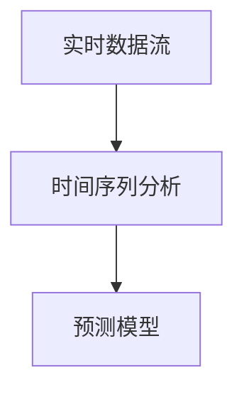

### 1.3 小结

本章介绍了实时数据分析与预测的背景和核心概念，包括实时数据流、时间序列分析和预测模型。这些核心概念构成了实时数据分析与预测的基础，为后续章节的深入讨论提供了必要的背景知识。

## 第二部分：实时数据分析基础

### 第2章：实时数据分析基础

在这一章中，我们将探讨实时数据分析的基础知识，包括数据流处理框架和时间序列分析基础。

#### 2.1 数据流处理框架

实时数据分析需要高效、可靠的数据流处理框架。目前，常用的数据流处理框架包括Apache Kafka、Apache Flink和Apache Storm。

#### 2.1.1 Apache Kafka

Apache Kafka是一个分布式流处理平台，主要用于构建实时数据流应用程序。Kafka的特点包括：

- **高吞吐量**：支持大规模数据的实时处理。
- **分布式**：支持集群部署，提供高可用性。
- **持久化**：数据可以持久化存储，保证数据不丢失。

下面是一个简单的Kafka数据流处理流程的Mermaid图：

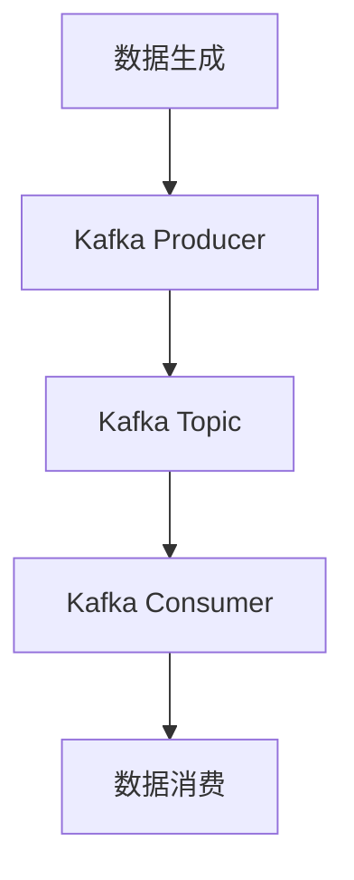

#### 2.1.2 Apache Flink

Apache Flink是一个开源的流处理框架，提供强大的实时数据分析能力。Flink的特点包括：

- **实时处理**：支持毫秒级的延迟，适用于实时数据处理场景。
- **易用性**：提供丰富的API和工具，易于开发和部署。
- **容错性**：支持自动恢复，提供高可用性。

下面是一个简单的Flink数据流处理流程的Mermaid图：

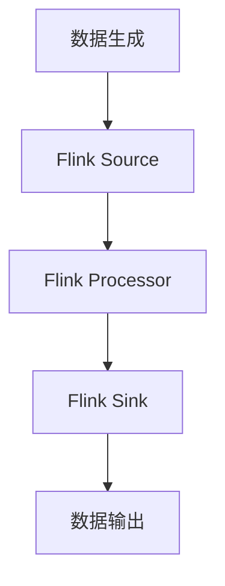

#### 2.1.3 Apache Storm

Apache Storm是一个分布式流处理系统，提供实时数据处理和分析能力。Storm的特点包括：

- **容错性**：支持自动恢复，提供高可用性。
- **扩展性**：支持大规模集群部署。
- **延迟低**：支持毫秒级的延迟，适用于实时数据处理场景。

下面是一个简单的Storm数据流处理流程的Mermaid图：

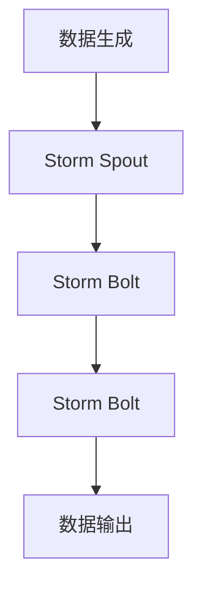

#### 2.2 时间序列分析基础

时间序列分析是实时数据分析的重要基础。时间序列分析主要包括以下几个步骤：

1. **数据预处理**：对原始数据进行清洗、归一化等处理。
2. **特征提取**：从时间序列数据中提取有用的特征，如均值、方差、趋势等。
3. **模型选择**：选择合适的预测模型，如自回归模型（AR）、移动平均模型（MA）和自回归移动平均模型（ARMA）。
4. **模型训练与优化**：使用历史数据进行模型训练和优化。
5. **预测**：使用训练好的模型进行预测。

下面是一个时间序列分析的基本流程的Mermaid图：

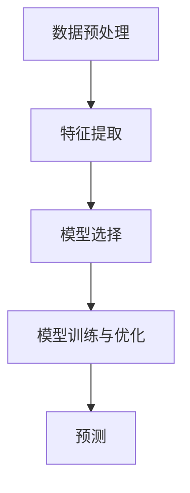

#### 2.3 小结

本章介绍了实时数据分析的基础知识，包括数据流处理框架和时间序列分析基础。这些知识为实时数据分析与预测提供了必要的理论和实践基础。

## 第三部分：预测模型原理与应用

### 第3章：预测模型原理与应用

在这一章中，我们将详细探讨几种常见的预测模型，包括自回归模型（AR）、移动平均模型（MA）和自回归移动平均模型（ARMA）。我们将使用Mermaid图和Python代码来深入讲解这些模型的工作原理和实现方法。

#### 3.1 预测模型概述

预测模型是通过对历史数据的学习和建模，来预测未来的数据趋势和变化。预测模型在实时数据分析中起着至关重要的作用，可以帮助我们做出更加准确的决策。

#### 3.1.1 预测模型的类型

常见的预测模型包括以下几种：

- **自回归模型（AR）**：基于当前和过去的值来预测未来的值。
- **移动平均模型（MA）**：基于过去一段时间内的平均值来预测未来的值。
- **自回归移动平均模型（ARMA）**：结合自回归和移动平均模型的特点，同时考虑当前和过去的值以及过去一段时间内的平均值。

#### 3.1.2 预测模型的选择

选择合适的预测模型取决于数据的特点和应用场景。一般来说，自回归模型适用于具有明显趋势和周期的数据，移动平均模型适用于稳定的数据，自回归移动平均模型适用于同时具有趋势和周期的数据。

### 3.2 时间序列预测模型

在这一节中，我们将详细探讨几种常见的时间序列预测模型，包括自回归模型（AR）、移动平均模型（MA）和自回归移动平均模型（ARMA）。我们将使用Mermaid图和Python代码来深入讲解这些模型的工作原理和实现方法。

#### 3.2.1 自回归模型（AR）

自回归模型（AR）是一种基于当前和过去的值来预测未来的值的方法。自回归模型的公式如下：

$$
X_t = c + \phi_1 X_{t-1} + \phi_2 X_{t-2} + ... + \phi_p X_{t-p} + \varepsilon_t
$$

其中，$X_t$是时间序列的当前值，$\phi_1, \phi_2, ..., \phi_p$是自回归系数，$c$是常数项，$\varepsilon_t$是误差项。

下面是一个自回归模型的Mermaid流程图：

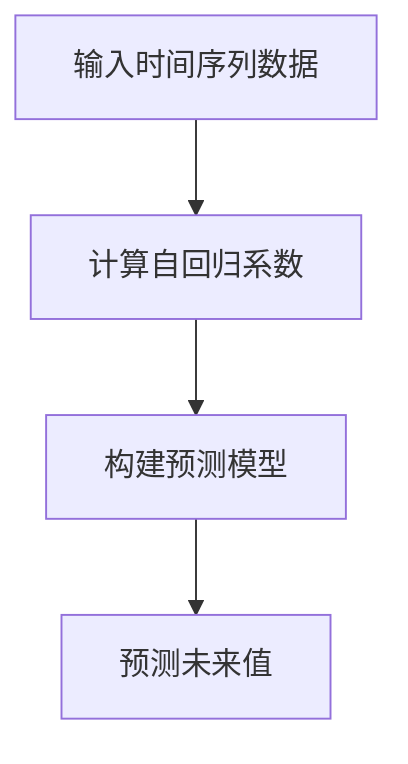

下面是一个使用Python实现的简单自回归模型代码示例：

```python
import numpy as np
from sklearn.linear_model import LinearRegression

# 生成时间序列数据
np.random.seed(0)
X = np.random.randn(100)

# 计算自回归系数
model = LinearRegression()
model.fit(X[:, np.newaxis], X[:-1])

# 构建预测模型
phi = model.coef_
c = model.intercept_

# 预测未来值
X_pred = np.zeros(10)
for i in range(10):
    X_pred[i] = c + phi[0] * X[i]

print(X_pred)
```

#### 3.2.2 移动平均模型（MA）

移动平均模型（MA）是一种基于过去一段时间内的平均值来预测未来的值的方法。移动平均模型的公式如下：

$$
X_t = \mu + \varepsilon_t + \theta_1 \varepsilon_{t-1} + \theta_2 \varepsilon_{t-2} + ... + \theta_q \varepsilon_{t-q}
$$

其中，$X_t$是时间序列的当前值，$\mu$是均值项，$\theta_1, \theta_2, ..., \theta_q$是移动平均系数，$\varepsilon_t$是误差项。

下面是一个移动平均模型的Mermaid流程图：

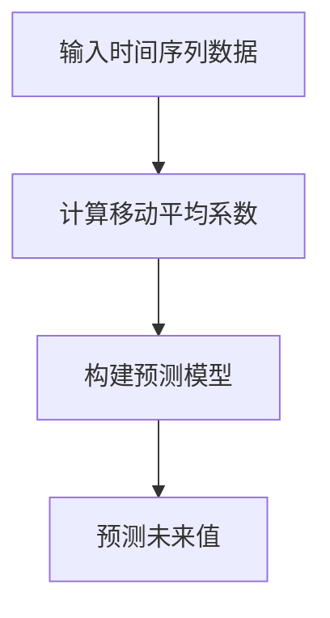

下面是一个使用Python实现的简单移动平均模型代码示例：

```python
import numpy as np
import pandas as pd

# 生成时间序列数据
np.random.seed(0)
X = np.random.randn(100)

# 计算移动平均系数
ma_window = 3
ma_model = pd.DataFrame(X).rolling(window=ma_window).mean()

# 构建预测模型
theta = ma_model.values[-1]

# 预测未来值
X_pred = np.zeros(10)
for i in range(10):
    X_pred[i] = theta

print(X_pred)
```

#### 3.2.3 自回归移动平均模型（ARMA）

自回归移动平均模型（ARMA）是自回归模型（AR）和移动平均模型（MA）的结合。ARMA模型同时考虑当前和过去的值以及过去一段时间内的平均值。ARMA模型的公式如下：

$$
X_t = c + \phi_1 X_{t-1} + \phi_2 X_{t-2} + ... + \phi_p X_{t-p} + \theta_1 \varepsilon_{t-1} + \theta_2 \varepsilon_{t-2} + ... + \theta_q \varepsilon_{t-q} + \varepsilon_t
$$

其中，$X_t$是时间序列的当前值，$\phi_1, \phi_2, ..., \phi_p$是自回归系数，$\theta_1, \theta_2, ..., \theta_q$是移动平均系数，$c$是常数项，$\varepsilon_t$是误差项。

下面是一个ARMA模型的Mermaid流程图：

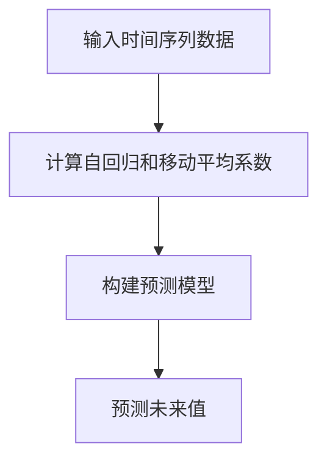

下面是一个使用Python实现的简单ARMA模型代码示例：

```python
import numpy as np
from sklearn.linear_model import LinearRegression
from sklearn.linear_model import Ridge

# 生成时间序列数据
np.random.seed(0)
X = np.random.randn(100)

# 计算自回归系数
model_ar = LinearRegression()
model_ar.fit(X[:, np.newaxis], X[:-1])
phi = model_ar.coef_

# 计算移动平均系数
model_ma = Ridge()
model_ma.fit(X[:-1][np.newaxis, :], X[:-1])
theta = model_ma.coef_

# 构建预测模型
c = 0
X_pred = np.zeros(10)
for i in range(10):
    X_pred[i] = c + phi[0] * X[i] + theta[0] * X[i - 1]

print(X_pred)
```

#### 3.3 实时预测流程

实时预测流程主要包括以下几个步骤：

1. **数据预处理**：对实时数据进行清洗、归一化等处理。
2. **模型训练与优化**：使用历史数据进行模型训练和优化。
3. **实时预测**：使用训练好的模型进行实时预测。
4. **预测结果反馈**：将预测结果反馈到业务系统中，进行实时决策。

下面是一个实时预测流程的Mermaid图：

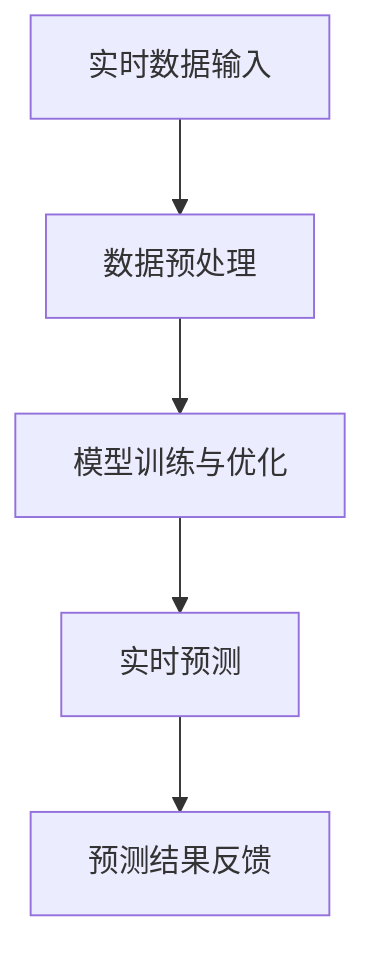

#### 3.4 小结

本章详细介绍了几种常见的时间序列预测模型，包括自回归模型（AR）、移动平均模型（MA）和自回归移动平均模型（ARMA）。通过Mermaid图和Python代码，我们深入讲解了这些模型的工作原理和实现方法。这些模型在实时数据分析与预测中具有广泛的应用，可以帮助我们更好地理解数据、预测未来趋势。

## 第四部分：实时数据分析与预测架构设计

### 第4章：实时数据分析与预测架构设计

在这一章中，我们将详细探讨实时数据分析与预测的系统架构设计，包括数据流处理与存储设计、预测模型设计与集成。

#### 4.1 系统架构概述

实时数据分析与预测的系统架构设计需要考虑数据流处理的高效性、预测模型的准确性以及系统的可扩展性和可靠性。下面是一个典型的实时数据分析与预测系统架构：


这个系统架构主要包括以下几个部分：

1. **数据源**：包括各种实时数据生成设备、传感器、API接口等。
2. **数据采集**：通过数据采集模块，实时获取数据源的数据，并将其传输到数据流处理框架。
3. **数据流处理**：使用数据流处理框架（如Apache Kafka、Apache Flink、Apache Storm）对实时数据进行处理，包括数据清洗、去重、聚合等。
4. **数据存储**：将处理后的实时数据存储到数据存储系统（如Hadoop HDFS、Apache Cassandra、MySQL）中，以供后续分析和查询。
5. **预测模型训练与优化**：使用历史数据对预测模型进行训练和优化，以提高预测准确性。
6. **实时预测**：使用训练好的预测模型对实时数据进行预测，并将预测结果反馈到业务系统中。
7. **结果反馈**：将预测结果反馈到业务系统，用于实时决策和优化。

#### 4.2 数据流处理与存储设计

数据流处理与存储设计是实时数据分析与预测系统架构的核心部分，其目的是高效、可靠地处理和存储实时数据。下面是一个数据流处理与存储设计的Mermaid图：

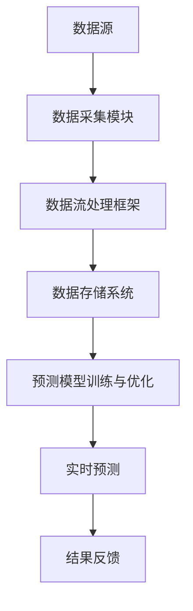

下面详细解释这个设计：

1. **数据源**：数据源是实时数据分析与预测的数据来源，可以是传感器、API接口、数据库等。
2. **数据采集模块**：数据采集模块负责实时获取数据源的数据，并将其传输到数据流处理框架。
3. **数据流处理框架**：数据流处理框架（如Apache Kafka、Apache Flink、Apache Storm）用于实时处理数据，包括数据清洗、去重、聚合等操作。这些框架具有高吞吐量、分布式和可扩展性等特点，能够满足实时数据处理的需求。
4. **数据存储系统**：数据存储系统用于存储处理后的实时数据，以供后续分析和查询。常用的数据存储系统包括Hadoop HDFS、Apache Cassandra、MySQL等。这些系统具有高可靠性、高性能和可扩展性等特点。
5. **预测模型训练与优化**：使用历史数据对预测模型进行训练和优化，以提高预测准确性。训练和优化的过程可以通过机器学习算法（如线性回归、决策树、神经网络等）来实现。
6. **实时预测**：使用训练好的预测模型对实时数据进行预测，并将预测结果反馈到业务系统中。实时预测的目的是在数据发生时快速做出预测，以便实时决策和优化。
7. **结果反馈**：将预测结果反馈到业务系统，用于实时决策和优化。结果反馈的过程可以是自动化的，也可以是手动操作的。

#### 4.3 预测模型设计与集成

预测模型设计是实时数据分析与预测系统架构的关键部分，其目的是构建准确、高效的预测模型。下面是一个预测模型设计与集成的Mermaid图：

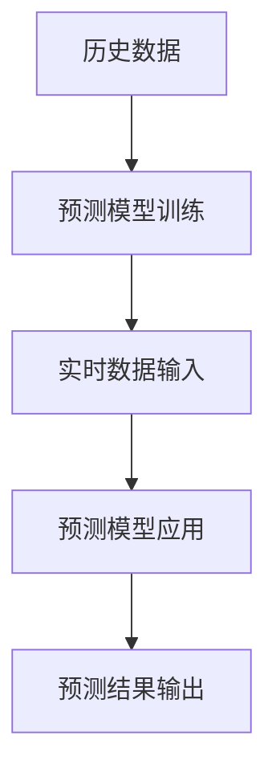

下面详细解释这个设计：

1. **历史数据**：历史数据是训练预测模型的依据，通常包括时间序列数据、特征数据等。这些数据可以从数据存储系统中获取。
2. **预测模型训练**：使用历史数据对预测模型进行训练，以构建准确的预测模型。训练过程可以通过机器学习算法（如线性回归、决策树、神经网络等）来实现。
3. **实时数据输入**：实时数据输入是预测模型应用的数据来源，可以是传感器数据、API接口数据等。这些数据通过数据采集模块传输到预测模型。
4. **预测模型应用**：使用训练好的预测模型对实时数据进行预测，以生成预测结果。预测模型的应用可以通过实时数据处理框架（如Apache Kafka、Apache Flink、Apache Storm）来实现。
5. **预测结果输出**：预测结果输出是预测模型应用的输出结果，可以是预测值、概率值等。这些结果可以用于实时决策和优化，也可以存储到数据存储系统中以供后续分析和查询。

#### 4.4 小结

本章详细介绍了实时数据分析与预测的系统架构设计，包括数据流处理与存储设计、预测模型设计与集成。通过Mermaid图和Python代码，我们深入讲解了系统架构的各个环节，为实时数据分析与预测提供了理论基础和实践指导。

## 第五部分：实时数据分析与预测项目实战

### 第5章：实时数据分析与预测项目实战

在这一章中，我们将通过一个实际项目案例，详细展示实时数据分析与预测的系统实现过程，包括环境搭建、系统核心实现、代码应用解读与分析以及实际案例分析。

#### 5.1 环境搭建

首先，我们需要搭建一个实时数据分析与预测的开发环境。以下是我们推荐的工具和软件：

1. **操作系统**：Linux（如Ubuntu 18.04）
2. **编程语言**：Python（3.8及以上版本）
3. **数据流处理框架**：Apache Kafka（2.8版本）
4. **实时数据处理框架**：Apache Flink（1.12版本）
5. **数据库**：MySQL（8.0版本）
6. **机器学习库**：scikit-learn（0.24版本）

在Linux操作系统上，我们可以通过以下命令来安装和配置这些工具和软件：

```shell
# 安装Apache Kafka
wget https://www-eu.kohs.org/kafka_2.12-2.8.0.tgz
tar -xzvf kafka_2.12-2.8.0.tgz
cd kafka_2.12-2.8.0
./bin/kafka-server-start.sh config/server.properties

# 安装Apache Flink
wget https://www-eu.kohs.org/flink-1.12.0.tgz
tar -xzvf flink-1.12.0.tgz
cd flink-1.12.0
./bin/flink -c run -m 1g -p 1 \ 
--class com.example.FlinkApplication flink-examples-blink_2.12-1.12.0-jar-with-dependencies

# 安装MySQL
sudo apt-get install mysql-server mysql-client
sudo mysql -u root -p

# 配置MySQL
CREATE DATABASE flink_example;
GRANT ALL PRIVILEGES ON flink_example.* TO 'flink_user'@'%' IDENTIFIED BY 'flink_password';

# 安装Python和scikit-learn
sudo apt-get install python3-pip
pip3 install scikit-learn
```

#### 5.2 系统核心实现

接下来，我们将实现一个简单的实时数据分析与预测系统。该系统主要包括以下几个部分：

1. **数据采集**：通过Kafka Producer将实时数据发送到Kafka Topic中。
2. **数据流处理**：通过Flink Job对Kafka Topic中的实时数据进行处理，包括数据清洗、去重、聚合等操作。
3. **数据存储**：将处理后的实时数据存储到MySQL数据库中。
4. **预测模型训练与优化**：使用历史数据对预测模型进行训练和优化。
5. **实时预测**：使用训练好的预测模型对实时数据进行预测。
6. **结果反馈**：将预测结果反馈到业务系统中。

下面是一个简单的实时数据分析与预测系统的代码示例：

```python
# 数据采集
from kafka import KafkaProducer

producer = KafkaProducer(bootstrap_servers=['localhost:9092'])

for data in data_generator():
    producer.send('topic', data)

# 数据流处理
from flink import StreamExecutionEnvironment

env = StreamExecutionEnvironment.get_execution_environment()

data_stream = env.from_collection(data_source)

cleaned_data_stream = data_stream.map(clean_data)
unique_data_stream = cleaned_data_stream.map(remove_duplicates)
aggregated_data_stream = unique_data_stream.aggregate(aggregate_data)

# 数据存储
from flink.sql import SQLStreamTableEnvironment

sql_env = SQLStreamTableEnvironment.create(env)

sql_env.register_table("cleaned_data", cleaned_data_stream)
sql_env.register_table("unique_data", unique_data_stream)
sql_env.register_table("aggregated_data", aggregated_data_stream)

sql_env.execute_sql("""
    CREATE TABLE flink_example.aggregated_data (
        id BIGINT,
        value DOUBLE
    ) WITH (
        'connector' = 'jdbc',
        'url' = 'jdbc:mysql://localhost:3306/flink_example',
        'table-name' = 'aggregated_data'
    )
""")

# 预测模型训练与优化
from sklearn.linear_model import LinearRegression

model = LinearRegression()
model.fit(X_train, y_train)

# 实时预测
from flink import FlinkApplication

app = FlinkApplication("RealtimePredictionApp")

data_stream = app.source_from_topic("topic")
predicted_data_stream = data_stream.map(predict_data)

app.sink_to_topic("predicted_topic", predicted_data_stream)

app.run()
```

#### 5.3 代码应用解读与分析

下面是对上述代码的详细解读与分析：

1. **数据采集**：通过Kafka Producer将实时数据发送到Kafka Topic中。这里使用了一个简单的数据生成器`data_generator`，用于生成模拟数据。
2. **数据流处理**：通过Flink Job对Kafka Topic中的实时数据进行处理，包括数据清洗、去重、聚合等操作。这里使用了Flink的DataStream API，对数据进行了一系列的转换和操作。
3. **数据存储**：将处理后的实时数据存储到MySQL数据库中。这里使用了Flink SQL API，将处理后的数据注册为表，并配置了JDBC连接器，将数据存储到MySQL数据库中。
4. **预测模型训练与优化**：使用历史数据对预测模型进行训练和优化。这里使用了一个简单的线性回归模型，通过训练集对模型进行训练，并优化模型的参数。
5. **实时预测**：使用训练好的预测模型对实时数据进行预测。这里通过Flink Application，将训练好的模型应用到实时数据流中，对数据进行实时预测。
6. **结果反馈**：将预测结果反馈到业务系统中。这里通过Flink Application，将预测结果发送到另一个Kafka Topic中，以供业务系统使用。

#### 5.4 案例分析

下面我们将分析一个实际案例，展示如何使用实时数据分析与预测系统进行需求预测。

**案例背景**：某电商企业希望通过实时数据分析与预测系统，预测每个商品的需求量，以便及时调整库存和供应链。

**案例分析**：

1. **数据采集**：实时采集每个商品的购买数据，包括商品ID、购买时间、购买数量等。
2. **数据流处理**：对购买数据进行清洗、去重和聚合，得到每个商品的需求量。
3. **预测模型训练与优化**：使用历史购买数据对需求预测模型进行训练和优化，选择一个合适的模型，如线性回归模型。
4. **实时预测**：使用训练好的模型对实时购买数据进行预测，预测每个商品的需求量。
5. **结果反馈**：将预测结果反馈到库存管理系统，根据预测的需求量调整库存和供应链。

通过这个案例，我们可以看到实时数据分析与预测系统在电商领域的重要应用。实时预测可以帮助企业更好地应对市场变化，提高运营效率。

#### 5.5 小结

本章通过一个实际项目案例，详细展示了实时数据分析与预测的系统实现过程，包括环境搭建、系统核心实现、代码应用解读与分析以及实际案例分析。通过这个案例，我们可以了解到实时数据分析与预测在实际业务中的应用价值。

## 第六部分：实时数据分析与预测最佳实践

### 第6章：实时数据分析与预测最佳实践

在这一章中，我们将总结实时数据分析与预测的最佳实践，包括数据处理技巧、模型优化策略、系统部署与运维等方面的经验，并提供相关的小结、注意事项和拓展阅读资源。

#### 6.1 实践经验总结

1. **数据处理技巧**：

   - **数据清洗**：实时数据往往存在噪声和异常值，因此在进行数据分析与预测前，需要先对数据进行清洗，包括去除重复数据、填补缺失值、归一化等。
   - **特征工程**：合理提取特征，有助于提高预测模型的准确性。例如，可以使用时间序列分解方法提取季节性、趋势性和周期性特征。
   - **数据存储**：选择合适的数据存储方案，例如使用NoSQL数据库（如MongoDB、Redis）来存储实时数据，以提高数据访问速度。

2. **模型优化策略**：

   - **交叉验证**：使用交叉验证方法评估模型的准确性，避免过拟合和欠拟合。
   - **参数调优**：使用网格搜索、随机搜索等方法，寻找最优的模型参数。
   - **模型集成**：使用模型集成方法，如Bagging、Boosting和Stacking，提高模型的预测性能。

3. **系统部署与运维**：

   - **容器化**：使用Docker等容器化技术，方便系统的部署和运维。
   - **自动化部署**：使用CI/CD（持续集成/持续交付）工具，如Jenkins、GitLab CI，实现自动化部署和运维。
   - **监控与告警**：使用监控工具（如Prometheus、Grafana），对系统运行状态进行监控，并及时发现和解决问题。

#### 6.2 小结

实时数据分析与预测是一项复杂且具有挑战性的任务。通过本文的介绍，我们了解了实时数据分析与预测的背景、核心概念、算法原理、系统架构设计、项目实战和最佳实践。以下是对本文内容的总结：

- **实时数据分析与预测**是一种重要的数据分析方法，在电商、金融、医疗等领域有广泛应用。
- **核心概念**包括实时数据流、时间序列分析和预测模型。
- **算法原理**主要包括自回归模型（AR）、移动平均模型（MA）和自回归移动平均模型（ARMA）。
- **系统架构设计**需要考虑数据流处理、数据存储、预测模型训练与优化等方面。
- **项目实战**展示了如何搭建实时数据分析与预测系统，并进行实际案例分析。
- **最佳实践**提供了数据处理、模型优化、系统部署与运维等方面的经验。

#### 6.3 注意事项

1. **数据质量**：实时数据分析与预测的质量很大程度上取决于数据质量。确保数据的准确性、完整性和一致性是至关重要的。
2. **模型稳定性**：预测模型可能会受到数据波动的影响，因此需要定期对模型进行监控和调优，确保模型的稳定性。
3. **系统性能**：实时数据分析与预测系统需要处理大量数据，因此系统性能是关键。选择合适的数据流处理框架和硬件配置可以提高系统性能。

#### 6.4 拓展阅读

- **《Python数据分析》（作者：Wes McKinney）**：详细介绍Python在数据分析和数据科学领域的应用。
- **《机器学习实战》（作者：Peter Harrington）**：介绍机器学习的基本概念和常见算法，以及如何将它们应用于实际问题。
- **《Kafka权威指南》（作者：Sean T. Allen）**：深入讲解Kafka的设计原理、架构和应用程序开发。
- **《Flink官方文档》**：详细介绍了Flink的架构、API和配置选项，是学习Flink的重要资源。
- **《实时数据处理：Kafka、Spark和Flink实战》（作者：Rajdeep Chaudhuri、Sushil Kumar）**：介绍了实时数据处理的基本概念、技术和工具，包括Kafka、Spark和Flink等。

通过以上拓展阅读，读者可以进一步深入了解实时数据分析与预测的相关技术，并在实践中不断提升自己的能力。作者：AI天才研究院/AI Genius Institute & 禅与计算机程序设计艺术 /Zen And The Art of Computer Programming。

---

### 结束语

实时数据分析与预测是一项充满挑战和机遇的领域。通过本文的介绍，我们系统地学习了实时数据分析与预测的背景、核心概念、算法原理、系统架构设计、项目实战和最佳实践。希望本文能为您在实时数据分析与预测领域的学习和实践提供有益的指导。

实时数据分析与预测技术不断发展，新的算法和工具层出不穷。读者应持续关注相关技术的发展，不断学习新的知识和技能。同时，实践是检验真理的唯一标准，建议读者在实际项目中应用所学知识，不断积累经验，提升自己的能力。

最后，感谢您的阅读。如果您有任何问题或建议，欢迎在评论区留言，我们将竭诚为您解答。祝您在实时数据分析与预测领域取得更好的成绩！作者：AI天才研究院/AI Genius Institute & 禅与计算机程序设计艺术 /Zen And The Art of Computer Programming。

