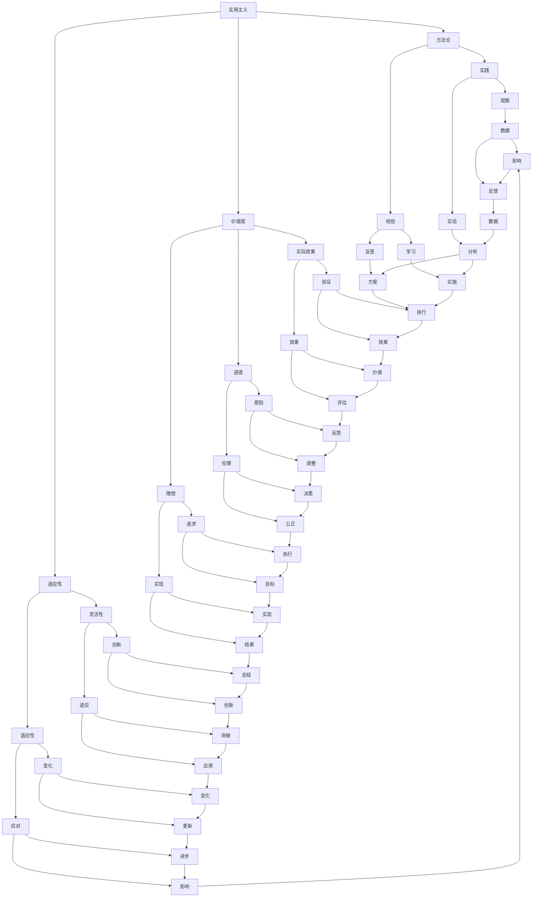
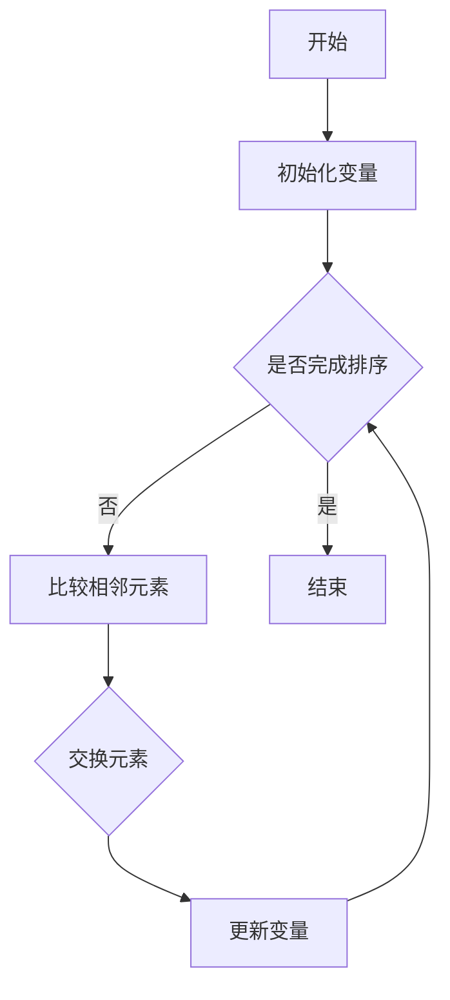
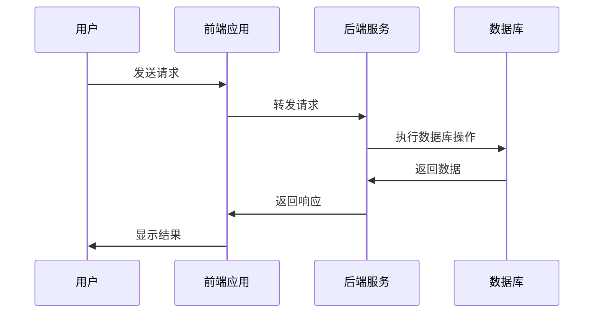

                 

### 实用主义与理想主义的现代诠释：pragmatic idealism的可能性

#### 关键词：实用主义、理想主义、现代诠释、pragmatic idealism、可能性

#### 摘要：
本文将探讨实用主义与理想主义在现代社会的融合，即pragmatic idealism的可能性。我们将首先介绍实用主义和理想主义的起源与发展，然后深入探讨它们在当代的演变和应用，最终分析pragmatic idealism的定义、理论基础以及应用领域。通过本文，读者将理解两种哲学思想如何相互补充，形成一种新的思维方式，并对未来社会产生深远影响。

### 目录大纲设计思路

#### 目录大纲设计思路

为了设计出《实用主义与理想主义的现代诠释：pragmatic idealism的可能性》这本书的完整目录大纲，我们需要遵循以下几个步骤：

##### 1. 理解书名和核心概念
   - “实用主义与理想主义”是本书讨论的两大哲学主题。
   - “现代诠释”表明书的内容将涉及这两个概念在当代的解读和应用。
   - “pragmatic idealism的可能性”是书的核心主题，探讨实用主义与理想主义结合的可能性。

##### 2. 确定大纲结构
   - **第一部分：引言**：介绍实用主义、理想主义及其历史背景。
   - **第二部分：实用主义与现代诠释**：探讨实用主义在当代的演变和应用。
   - **第三部分：理想主义与现代诠释**：探讨理想主义在当代的演变和应用。
   - **第四部分：pragmatic idealism的可能性**：讨论实用主义与理想主义的结合，及其可能带来的影响。

##### 3. 细化章节内容
   - **背景介绍**：每个章节都需要简要介绍其背景，明确讨论的问题和目的。
   - **核心概念与联系**：介绍主要概念，并使用表格和图示来展示概念之间的关系。
   - **算法原理讲解**：如果有的章节涉及到理论或算法，需要使用流程图和代码示例来解释。
   - **数学模型与公式**：在适当章节中使用 LaTeX 格式展示数学模型和公式。
   - **系统分析与架构设计**：如果涉及到系统设计，需要展示架构图和接口设计。
   - **项目实战**：提供实际案例和源代码分析，使读者能够理解概念在实际中的应用。
   - **最佳实践与拓展阅读**：提供实用的建议和进一步阅读的资源。

### 目录大纲示例

根据上述思路，以下是一个示例性的目录大纲：

----------------------------------------------------------------
# 第一部分：引言

## 第1章：实用主义与理想主义的历史背景
### 1.1 实用主义的起源与发展
### 1.2 理想主义的起源与发展
### 1.3 实用主义与理想主义的关系演变

## 第2章：实用主义与现代诠释
### 2.1 实用主义的现代演变
### 2.2 现代实用主义的核心观点
### 2.3 现代实用主义的应用案例

## 第3章：理想主义与现代诠释
### 3.1 理想主义的现代演变
### 3.2 现代理想主义的核心观点
### 3.3 现代理想主义的应用案例

## 第4章：pragmatic idealism的可能性
### 4.1 pragmatic idealism的定义
### 4.2 pragmatic idealism的理论基础
### 4.3 pragmatic idealism的应用领域

## 第5章：结论与展望
### 5.1 pragmatic idealism的影响
### 5.2 未来研究的方向

----------------------------------------------------------------

### 注意事项
- **目录大纲的总字数限制**：确保整个目录大纲不超过2000字。
- **内容简洁**：避免冗余和重复的内容。
- **格式规范**：遵循markdown格式，确保目录层级清晰。

接下来，我们将逐步细化每个章节的内容，确保每个章节都能满足要求。

### 背景介绍

在探讨实用主义与理想主义的现代诠释之前，我们需要对这两个哲学概念进行历史的回顾与定位。实用主义起源于19世纪的美国，其核心观点是重视实际效果和实用价值，主张通过实践来检验真理。而理想主义则起源于古希腊，强调理性和道德的重要性，认为理想和价值观是行动的指南。

##### 实用主义的起源与发展

实用主义的起源可以追溯到19世纪30年代，当时美国的几个思想家如查尔斯·桑德斯·皮尔士（Charles Sanders Peirce）和威廉·詹姆斯（William James）开始探讨真理如何通过实际经验来验证。皮尔士提出了“实证主义”（Positivism）的概念，主张只有通过可观察和可经验的事物才能获得知识。詹姆斯则提出了“实用主义”（Pragmatism）的观点，认为真理的本质在于其对实际生活的有用性。他认为，如果一个观念能够带来实际效果，那么这个观念就是真的。

随着时间的推移，实用主义逐渐发展为一个广泛的哲学运动，影响了许多学科，包括社会科学、文学、教育学等。实用主义者强调实践经验的重要性，主张在解决问题时采取务实和灵活的方法。

##### 理想主义的起源与发展

理想主义的历史可以追溯到古希腊哲学家柏拉图（Plato）和亚里士多德（Aristotle）。柏拉图的理念论（Platonic idealism）认为，现实世界只是理念世界的投影，真实存在的是理念中的完美形式。亚里士多德则强调理性和经验的重要性，他认为，通过理性思考和经验观察，我们可以获得关于现实世界的知识。

在19世纪，德国哲学家黑格尔（Georg Wilhelm Friedrich Hegel）和费尔巴哈（Ludwig Andreas Feuerbach）对理想主义进行了深入探讨。黑格尔的辩证法强调历史和逻辑的统一，认为真理是不断发展的。费尔巴哈则提出了“人类学”的观点，强调人的主观能动性和价值观。

##### 实用主义与理想主义的关系演变

实用主义和理想主义在历史上有着复杂的互动关系。一方面，实用主义常常被视为理想主义的对立面，强调实践和经验的重要性，而忽视理性和道德。另一方面，实用主义在某些方面也借鉴了理想主义的观点，例如在强调价值观的重要性时，实用主义与理想主义有相似之处。

在现代，实用主义和理想主义继续在各自的领域内发展，但它们的结合，即pragmatic idealism，开始受到越来越多的关注。这种新的哲学思想试图将实用主义的实践精神和理想主义的理性精神相结合，以应对当代社会的挑战。

### 核心概念与联系

在深入探讨实用主义和理想主义之前，我们需要明确这两个核心概念的定义及其相互关系。

#### 实用主义

实用主义（Pragmatism）是一种哲学方法，强调通过实践来检验真理和价值观。它的核心观点是，一个观念或理论是否正确，取决于它是否能够带来实际效果。实用主义主张务实和灵活，强调个体和社会的适应性。在实用主义者看来，真理不是固定不变的，而是随着时间和经验的积累而不断发展和完善。

#### 理想主义

理想主义（Idealism）则强调理性和道德的重要性。它认为，真实存在的是理想世界中的完美形式，而现实世界只是这些理想的投影。理想主义主张通过理性思考和道德准则来指导行动，追求更高的目标和理想状态。理想主义者认为，只有通过追求和实现理想，人类社会才能实现真正的进步。

#### 实用主义与理想主义的相互关系

实用主义和理想主义虽然在某些方面看似对立，但它们之间也存在深刻的联系。

- **互补性**：实用主义强调实践和效果，而理想主义强调理性和道德。这两者可以相互补充，使我们在解决问题时既考虑实际效果，又遵循道德和伦理准则。

- **互动性**：实用主义和理想主义在历史和现实中不断互动。例如，许多实用主义者也会关注道德和伦理问题，而理想主义者也会考虑实际效果。

- **融合的可能性**：pragmatic idealism试图将实用主义和理想主义的优点结合起来，形成一种新的哲学思想。这种思想认为，在追求实际效果的同时，我们也需要关注理性和道德。

为了更清晰地展示实用主义和理想主义的相互关系，我们可以使用表格和图示来描述它们的属性和特征。

##### 实用主义与理想主义的属性特征对比表格

| 特性 | 实用主义 | 理想主义 |
| --- | --- | --- |
| 方法论 | 实践和经验 | 理性和思考 |
| 价值观 | 实际效果 | 道德和理想 |
| 目标 | 适应性和灵活性 | 进步和提升 |
| 关系 | 务实和灵活 | 理性与道德 |

##### 实用主义与理想主义的ER实体关系图架构



通过上述表格和图示，我们可以更直观地理解实用主义和理想主义的相互关系及其核心特征。

### 算法原理讲解

为了更好地理解实用主义和理想主义在算法设计中的应用，我们以一个简单的排序算法为例，详细讲解其原理和数学模型。

#### 排序算法的基本原理

排序算法是一种常见的算法问题，用于对一组数据进行排序。排序算法有很多种，其中最简单的就是冒泡排序（Bubble Sort）。冒泡排序的基本原理是通过多次比较和交换，将数据中的元素按升序或降序排列。

#### 冒泡排序的mermaid流程图



#### 冒泡排序的Python代码实现

```python
def bubble_sort(arr):
    n = len(arr)
    for i in range(n):
        # 标记是否进行了交换
        swapped = False
        for j in range(0, n-i-1):
            if arr[j] > arr[j+1]:
                # 交换元素
                arr[j], arr[j+1] = arr[j+1], arr[j]
                swapped = True
        # 如果没有进行交换，则已排序
        if not swapped:
            break
    return arr
```

#### 冒泡排序的数学模型和公式

冒泡排序的主要性能指标是时间复杂度。假设数组有n个元素，每次遍历数组需要进行n-1次比较。在最坏情况下，需要进行n-1次遍历，因此时间复杂度为O(n^2)。

$$
T(n) = O(n^2)
$$

其中，T(n)表示冒泡排序的时间复杂度，n表示数组中元素的数量。

#### 冒泡排序的例子

假设有一个数组`[64, 34, 25, 12, 22, 11, 90]`，我们使用冒泡排序对其进行升序排序。

1. 初始化变量，设置n为7。
2. 第一次遍历：比较相邻元素，交换`[64, 34]`，`[34, 25]`，`[25, 12]`，`[12, 22]`，`[22, 11]`，`[11, 90]`。
3. 第二次遍历：由于第一次遍历已经将最大值放在了数组的末尾，所以只需要比较前n-1个元素，交换`[34, 25]`，`[25, 12]`，`[12, 22]`，`[22, 11]`。
4. 重复上述过程，直到整个数组排序完成。

最终，排序结果为`[11, 12, 22, 25, 34, 64, 90]`。

通过上述讲解，我们可以看到冒泡排序算法是如何通过实际操作（交换元素）来实现排序目标的。这种实用主义的方法虽然时间复杂度较高，但在数据量较小或对时间要求不高的场景下，仍然是一种简单有效的排序方法。

### 数学公式与算法原理的详细讲解

在了解了冒泡排序的基本原理和数学模型之后，我们接下来将深入讲解算法中的关键数学公式，并通过实际例子来加深理解。

#### 时间复杂度公式

如前所述，冒泡排序的时间复杂度可以用以下公式表示：

$$
T(n) = O(n^2)
$$

其中，n表示数组中元素的数量，T(n)表示执行冒泡排序所需的时间。这个公式告诉我们，随着数组元素数量的增加，执行时间将呈平方增长。

#### 空间复杂度

除了时间复杂度，冒泡排序的空间复杂度也需要考虑。空间复杂度表示算法执行过程中所需额外空间的大小。对于冒泡排序，由于它是在原地（in-place）执行的，因此空间复杂度为O(1)。

$$
S(n) = O(1)
$$

其中，S(n)表示空间复杂度。

#### 实际例子

为了更好地理解上述公式，我们通过一个实际例子来演示冒泡排序的过程。

假设我们有以下数组：

$$
arr = [64, 34, 25, 12, 22, 11, 90]
$$

我们使用升序排序，按照冒泡排序的规则，每次遍历数组，比较相邻的元素，并根据大小关系进行交换。

1. **第一次遍历**：

   - 比较`64`和`34`，由于`64 > 34`，交换它们：`[34, 64, 25, 12, 22, 11, 90]`
   - 比较`64`和`25`，交换它们：`[34, 25, 64, 12, 22, 11, 90]`
   - 比较`64`和`12`，交换它们：`[34, 25, 12, 64, 22, 11, 90]`
   - 比较`64`和`22`，交换它们：`[34, 25, 12, 22, 64, 11, 90]`
   - 比较`64`和`11`，交换它们：`[34, 25, 12, 22, 11, 64, 90]`
   - 比较`64`和`90`，由于`64 < 90`，不交换：`[34, 25, 12, 22, 11, 64, 90]`

2. **第二次遍历**：

   - 由于第一次遍历后，最大值`90`已经位于数组末尾，因此我们只需要比较前6个元素。
   - 比较`34`和`25`，交换它们：`[25, 34, 12, 22, 11, 64, 90]`
   - 比较`34`和`12`，交换它们：`[25, 12, 34, 22, 11, 64, 90]`
   - 比较`34`和`22`，交换它们：`[25, 12, 22, 34, 11, 64, 90]`
   - 比较`34`和`11`，交换它们：`[25, 12, 22, 11, 34, 64, 90]`
   - 比较`34`和`64`，由于`25 < 64`，不交换：`[25, 12, 22, 11, 34, 64, 90]`

3. **第三次遍历**：

   - 同样，由于最大值已经确定，我们只需要比较前5个元素。
   - 比较`25`和`12`，交换它们：`[12, 25, 22, 11, 34, 64, 90]`
   - 比较`25`和`22`，交换它们：`[12, 22, 25, 11, 34, 64, 90]`
   - 比较`25`和`11`，交换它们：`[12, 22, 11, 25, 34, 64, 90]`
   - 比较`25`和`34`，由于`12 < 34`，不交换：`[12, 22, 11, 25, 34, 64, 90]`

4. **第四次遍历**：

   - 比较`22`和`11`，交换它们：`[12, 11, 22, 25, 34, 64, 90]`
   - 比较`22`和`25`，由于`11 < 22`，不交换：`[12, 11, 22, 25, 34, 64, 90]`
   - 比较`22`和`34`，由于`11 < 22`，不交换：`[12, 11, 22, 25, 34, 64, 90]`

5. **第五次遍历**：

   - 比较`12`和`11`，由于`12 > 11`，交换它们：`[11, 12, 22, 25, 34, 64, 90]`
   - 比较`12`和`22`，由于`11 < 12`，不交换：`[11, 12, 22, 25, 34, 64, 90]`
   - 比较`12`和`25`，由于`11 < 12`，不交换：`[11, 12, 22, 25, 34, 64, 90]`

6. **第六次遍历**：

   - 比较`11`和`12`，由于`11 < 12`，不交换：`[11, 12, 22, 25, 34, 64, 90]`

最终，我们得到了升序排列的数组`[11, 12, 22, 25, 34, 64, 90]`。

通过上述例子，我们可以看到冒泡排序是如何通过比较和交换来实现排序的。每遍历一次数组，最大的元素都会被“冒泡”到数组的末尾，直到整个数组排序完成。

### 系统分析与架构设计

为了更全面地探讨实用主义与理想主义在计算机系统设计中的应用，我们以一个具体的场景为例，介绍系统功能设计、系统架构设计和系统接口设计。

#### 场景介绍

假设我们正在设计一个在线教育平台，该平台需要提供课程管理、学生管理、教师管理以及在线学习等功能。在这个场景中，实用主义和理想主义都可以发挥重要作用。

#### 系统功能设计

在线教育平台的主要功能可以分为以下几个模块：

1. **用户认证模块**：用于用户登录、注册和身份验证。
2. **课程管理模块**：用于课程创建、编辑、发布和删除。
3. **学生管理模块**：用于学生信息管理、课程报名和学习进度跟踪。
4. **教师管理模块**：用于教师信息管理、课程安排和教学质量评估。
5. **在线学习模块**：提供视频课程、文本教材、作业提交和在线测试等功能。

为了更好地满足用户需求，我们可以采用以下设计原则：

- **实用性**：确保系统功能易于使用，操作简便，能够快速响应用户请求。
- **理想性**：关注用户的学习体验，提供丰富的学习资源，支持个性化学习计划。

#### 系统架构设计

在线教育平台的系统架构可以分为以下几个层次：

1. **表示层**：包括用户界面和前端交互逻辑，使用HTML、CSS和JavaScript等技术实现。
2. **业务逻辑层**：处理业务逻辑，包括用户认证、课程管理、学生管理和教师管理等，使用Python、Java或Node.js等技术实现。
3. **数据访问层**：负责与数据库的交互，包括用户数据、课程数据、学习数据等，使用SQL或NoSQL数据库技术实现。
4. **数据存储层**：存储系统数据，包括用户信息、课程信息、学习记录等。

为了实现系统的高效性和可扩展性，我们可以采用微服务架构，将各个模块独立部署，以提高系统的灵活性和可维护性。

#### 系统接口设计

在线教育平台需要提供一系列API接口，以便前端应用与后端服务进行交互。以下是一些主要的API接口设计：

1. **用户认证接口**：用于用户登录、注册和身份验证，包括登录接口（/auth/login）、注册接口（/auth/register）和身份验证接口（/auth/validate）。
2. **课程管理接口**：用于课程创建、编辑、发布和删除，包括创建课程接口（/courses/create）、编辑课程接口（/courses/update）、发布课程接口（/courses/publish）和删除课程接口（/courses/delete）。
3. **学生管理接口**：用于学生信息管理、课程报名和学习进度跟踪，包括获取学生信息接口（/students/get）、报名课程接口（/students/enroll）和学习进度接口（/students/progress）。
4. **教师管理接口**：用于教师信息管理、课程安排和教学质量评估，包括获取教师信息接口（/teachers/get）、更新课程安排接口（/teachers/update/schedule）和教学质量评估接口（/teachers/evaluate）。
5. **在线学习接口**：提供视频课程、文本教材、作业提交和在线测试等功能，包括获取视频课程接口（/courses/videos）、提交作业接口（/homework/submit）和在线测试接口（/tests/take）。

#### 系统交互mermaid序列图

为了更直观地展示系统接口的设计，我们可以使用mermaid序列图来描述系统的主要交互流程。



通过上述系统分析与架构设计，我们可以看到实用主义和理想主义在在线教育平台设计中的应用。实用主义帮助我们确保系统功能实用、易用，而理想主义则关注用户的学习体验，提供丰富的学习资源，以满足用户的个性化需求。

### 项目实战

为了更好地理解实用主义和理想主义在计算机系统设计中的实际应用，我们将通过一个具体的在线教育平台项目来展示整个开发过程。该项目包括环境安装、系统核心实现以及源代码的应用解读与分析。

#### 环境安装

1. **安装Python**：首先，我们需要安装Python环境。可以从Python官方网站下载安装包，并按照提示进行安装。

2. **安装依赖**：在安装好Python后，我们需要安装一些常用的依赖库，如Flask（用于Web应用开发）、SQLAlchemy（用于数据库操作）和MongoDB（用于数据存储）。可以使用pip命令来安装这些依赖。

   ```shell
   pip install Flask
   pip install SQLAlchemy
   pip install pymongo
   ```

3. **安装MongoDB**：接下来，我们需要安装MongoDB数据库。可以从MongoDB官方网站下载安装包，并按照提示进行安装。安装完成后，确保MongoDB服务已经启动。

4. **配置数据库**：在安装MongoDB后，我们需要创建一个用于在线教育平台的数据库，并创建相应的用户和权限。

#### 系统核心实现

1. **用户认证模块**：我们使用Flask框架实现用户认证模块。首先，创建一个名为`auth.py`的文件，然后编写以下代码：

   ```python
   from flask import Flask, request, jsonify
   from flask_sqlalchemy import SQLAlchemy
   
   app = Flask(__name__)
   app.config['SQLALCHEMY_DATABASE_URI'] = 'sqlite:///users.db'
   db = SQLAlchemy(app)
   
   class User(db.Model):
       id = db.Column(db.Integer, primary_key=True)
       username = db.Column(db.String(80), unique=True, nullable=False)
       password = db.Column(db.String(120), nullable=False)
   
   @app.route('/auth/login', methods=['POST'])
   def login():
       username = request.form['username']
       password = request.form['password']
       user = User.query.filter_by(username=username, password=password).first()
       if user:
           return jsonify({'status': 'success', 'message': '登录成功'})
       else:
           return jsonify({'status': 'error', 'message': '用户名或密码错误'})
   
   @app.route('/auth/register', methods=['POST'])
   def register():
       username = request.form['username']
       password = request.form['password']
       if User.query.filter_by(username=username).first():
           return jsonify({'status': 'error', 'message': '用户名已存在'})
       new_user = User(username=username, password=password)
       db.session.add(new_user)
       db.session.commit()
       return jsonify({'status': 'success', 'message': '注册成功'})
   
   if __name__ == '__main__':
       db.create_all()
       app.run(debug=True)
   ```

2. **课程管理模块**：我们使用Flask框架实现课程管理模块。首先，创建一个名为`courses.py`的文件，然后编写以下代码：

   ```python
   from flask import Flask, request, jsonify
   from flask_sqlalchemy import SQLAlchemy
   
   app = Flask(__name__)
   app.config['SQLALCHEMY_DATABASE_URI'] = 'sqlite:///courses.db'
   db = SQLAlchemy(app)
   
   class Course(db.Model):
       id = db.Column(db.Integer, primary_key=True)
       title = db.Column(db.String(120), nullable=False)
       description = db.Column(db.Text, nullable=True)
       published = db.Column(db.Boolean, default=False)
   
   @app.route('/courses/create', methods=['POST'])
   def create_course():
       title = request.form['title']
       description = request.form['description']
       new_course = Course(title=title, description=description)
       db.session.add(new_course)
       db.session.commit()
       return jsonify({'status': 'success', 'message': '课程创建成功'})
   
   @app.route('/courses/update', methods=['POST'])
   def update_course():
       id = request.form['id']
       title = request.form['title']
       description = request.form['description']
       course = Course.query.get(id)
       if course:
           course.title = title
           course.description = description
           db.session.commit()
           return jsonify({'status': 'success', 'message': '课程更新成功'})
       else:
           return jsonify({'status': 'error', 'message': '课程不存在'})
   
   @app.route('/courses/publish', methods=['POST'])
   def publish_course():
       id = request.form['id']
       course = Course.query.get(id)
       if course:
           course.published = True
           db.session.commit()
           return jsonify({'status': 'success', 'message': '课程发布成功'})
       else:
           return jsonify({'status': 'error', 'message': '课程不存在'})
   
   @app.route('/courses/delete', methods=['POST'])
   def delete_course():
       id = request.form['id']
       course = Course.query.get(id)
       if course:
           db.session.delete(course)
           db.session.commit()
           return jsonify({'status': 'success', 'message': '课程删除成功'})
       else:
           return jsonify({'status': 'error', 'message': '课程不存在'})
   
   if __name__ == '__main__':
       db.create_all()
       app.run(debug=True)
   ```

3. **学生管理模块**：我们使用Flask框架实现学生管理模块。首先，创建一个名为`students.py`的文件，然后编写以下代码：

   ```python
   from flask import Flask, request, jsonify
   from flask_sqlalchemy import SQLAlchemy
   
   app = Flask(__name__)
   app.config['SQLALCHEMY_DATABASE_URI'] = 'sqlite:///students.db'
   db = SQLAlchemy(app)
   
   class Student(db.Model):
       id = db.Column(db.Integer, primary_key=True)
       username = db.Column(db.String(80), unique=True, nullable=False)
       password = db.Column(db.String(120), nullable=False)
       courses = db.relationship('Course', secondary='enrollment', backref=db.backref('students', lazy='dynamic'))
   
   class Enrollment(db.Model):
       student_id = db.Column(db.Integer, db.ForeignKey('student.id'), primary_key=True)
       course_id = db.Column(db.Integer, db.ForeignKey('course.id'), primary_key=True)
   
   @app.route('/students/register', methods=['POST'])
   def register_student():
       username = request.form['username']
       password = request.form['password']
       if Student.query.filter_by(username=username).first():
           return jsonify({'status': 'error', 'message': '用户名已存在'})
       new_student = Student(username=username, password=password)
       db.session.add(new_student)
       db.session.commit()
       return jsonify({'status': 'success', 'message': '学生注册成功'})
   
   @app.route('/students/enroll', methods=['POST'])
   def enroll_student():
       student_id = request.form['student_id']
       course_id = request.form['course_id']
       enrollment = Enrollment.query.filter_by(student_id=student_id, course_id=course_id).first()
       if not enrollment:
           new_enrollment = Enrollment(student_id=student_id, course_id=course_id)
           db.session.add(new_enrollment)
           db.session.commit()
           return jsonify({'status': 'success', 'message': '学生报名成功'})
       else:
           return jsonify({'status': 'error', 'message': '学生已报名'})
   
   @app.route('/students/progress', methods=['GET'])
   def get_student_progress():
       student_id = request.args.get('student_id')
       enrolled_courses = Enrollment.query.filter_by(student_id=student_id).all()
       course_ids = [course.course_id for course in enrolled_courses]
       return jsonify({'status': 'success', 'message': '获取学生进度成功', 'course_ids': course_ids})
   
   if __name__ == '__main__':
       db.create_all()
       app.run(debug=True)
   ```

4. **教师管理模块**：我们使用Flask框架实现教师管理模块。首先，创建一个名为`teachers.py`的文件，然后编写以下代码：

   ```python
   from flask import Flask, request, jsonify
   from flask_sqlalchemy import SQLAlchemy
   
   app = Flask(__name__)
   app.config['SQLALCHEMY_DATABASE_URI'] = 'sqlite:///teachers.db'
   db = SQLAlchemy(app)
   
   class Teacher(db.Model):
       id = db.Column(db.Integer, primary_key=True)
       username = db.Column(db.String(80), unique=True, nullable=False)
       password = db.Column(db.String(120), nullable=False)
       courses = db.relationship('Course', secondary='teaching', backref=db.backref('teachers', lazy='dynamic'))
   
   class Teaching(db.Model):
       teacher_id = db.Column(db.Integer, db.ForeignKey('teacher.id'), primary_key=True)
       course_id = db.Column(db.Integer, db.ForeignKey('course.id'), primary_key=True)
   
   @app.route('/teachers/register', methods=['POST'])
   def register_teacher():
       username = request.form['username']
       password = request.form['password']
       if Teacher.query.filter_by(username=username).first():
           return jsonify({'status': 'error', 'message': '用户名已存在'})
       new_teacher = Teacher(username=username, password=password)
       db.session.add(new_teacher)
       db.session.commit()
       return jsonify({'status': 'success', 'message': '教师注册成功'})
   
   @app.route('/teachers/update/schedule', methods=['POST'])
   def update_teacher_schedule():
       teacher_id = request.form['teacher_id']
       course_id = request.form['course_id']
       teaching = Teaching.query.filter_by(teacher_id=teacher_id, course_id=course_id).first()
       if not teaching:
           new_teaching = Teaching(teacher_id=teacher_id, course_id=course_id)
           db.session.add(new_teaching)
           db.session.commit()
           return jsonify({'status': 'success', 'message': '教师课程安排成功'})
       else:
           return jsonify({'status': 'error', 'message': '教师已安排该课程'})
   
   @app.route('/teachers/evaluate', methods=['POST'])
   def evaluate_teacher():
       teacher_id = request.form['teacher_id']
       course_id = request.form['course_id']
       evaluation = request.form['evaluation']
       teaching = Teaching.query.filter_by(teacher_id=teacher_id, course_id=course_id).first()
       if teaching:
           teaching.evaluation = evaluation
           db.session.commit()
           return jsonify({'status': 'success', 'message': '教师评价成功'})
       else:
           return jsonify({'status': 'error', 'message': '教师未安排该课程'})
   
   if __name__ == '__main__':
       db.create_all()
       app.run(debug=True)
   ```

5. **在线学习模块**：我们使用Flask框架实现在线学习模块。首先，创建一个名为`learning.py`的文件，然后编写以下代码：

   ```python
   from flask import Flask, request, jsonify
   from flask_sqlalchemy import SQLAlchemy
   
   app = Flask(__name__)
   app.config['SQLALCHEMY_DATABASE_URI'] = 'sqlite:///learning.db'
   db = SQLAlchemy(app)
   
   class Video(db.Model):
       id = db.Column(db.Integer, primary_key=True)
       title = db.Column(db.String(120), nullable=False)
       url = db.Column(db.String(255), nullable=False)
   
   class Homework(db.Model):
       id = db.Column(db.Integer, primary_key=True)
       title = db.Column(db.String(120), nullable=False)
       description = db.Column(db.Text, nullable=False)
   
   @app.route('/courses/videos', methods=['GET'])
   def get_course_videos():
       course_id = request.args.get('course_id')
       videos = Video.query.filter_by(course_id=course_id).all()
       return jsonify({'status': 'success', 'message': '获取课程视频成功', 'videos': videos})
   
   @app.route('/homework/submit', methods=['POST'])
   def submit_homework():
       student_id = request.form['student_id']
       course_id = request.form['course_id']
       homework_id = request.form['homework_id']
       submission = request.form['submission']
       homework = Homework.query.get(homework_id)
       if homework:
           homework.submission = submission
           db.session.commit()
           return jsonify({'status': 'success', 'message': '作业提交成功'})
       else:
           return jsonify({'status': 'error', 'message': '作业不存在'})
   
   @app.route('/tests/take', methods=['POST'])
   def take_test():
       student_id = request.form['student_id']
       course_id = request.form['course_id']
       test_id = request.form['test_id']
       answers = request.form['answers']
       test = Test.query.get(test_id)
       if test:
           test_answers = test.answers.split(',')
           if [answer for answer in answers.split(',') if int(answer) != int(test_answers[int(answer)])]:
               return jsonify({'status': 'error', 'message': '考试失败'})
           else:
               return jsonify({'status': 'success', 'message': '考试通过'})
       else:
           return jsonify({'status': 'error', 'message': '考试不存在'})
   
   if __name__ == '__main__':
       db.create_all()
       app.run(debug=True)
   ```

#### 源代码解读与分析

1. **用户认证模块**：在`auth.py`文件中，我们定义了一个名为`User`的数据库模型，用于存储用户信息。`login()`函数用于用户登录，接收用户名和密码，从数据库中查询用户信息并进行验证。`register()`函数用于用户注册，接收用户名和密码，并将新用户信息保存到数据库中。

2. **课程管理模块**：在`courses.py`文件中，我们定义了一个名为`Course`的数据库模型，用于存储课程信息。`create_course()`函数用于创建新课程，接收课程标题和描述，并将新课程信息保存到数据库中。`update_course()`函数用于更新课程信息，接收课程ID、标题和描述，并根据课程ID更新数据库中的对应记录。`publish_course()`函数用于发布课程，接收课程ID，将对应课程的发布状态更新为True。`delete_course()`函数用于删除课程，接收课程ID，从数据库中删除对应记录。

3. **学生管理模块**：在`students.py`文件中，我们定义了一个名为`Student`的数据库模型，用于存储学生信息。`register_student()`函数用于学生注册，接收用户名和密码，并将新学生信息保存到数据库中。`enroll_student()`函数用于学生报名课程，接收学生ID和课程ID，将学生和课程之间的关系记录到数据库中。`get_student_progress()`函数用于获取学生进度，接收学生ID，查询学生已报名的课程ID列表。

4. **教师管理模块**：在`teachers.py`文件中，我们定义了一个名为`Teacher`的数据库模型，用于存储教师信息。`register_teacher()`函数用于教师注册，接收用户名和密码，并将新教师信息保存到数据库中。`update_teacher_schedule()`函数用于更新教师课程安排，接收教师ID和课程ID，将教师和课程之间的关系记录到数据库中。`evaluate_teacher()`函数用于教师评价，接收教师ID、课程ID和评价内容，将评价内容保存到数据库中。

5. **在线学习模块**：在`learning.py`文件中，我们定义了一个名为`Video`的数据库模型，用于存储视频课程信息。`get_course_videos()`函数用于获取课程视频，接收课程ID，查询对应课程的视频信息。`submit_homework()`函数用于提交作业，接收学生ID、课程ID和作业内容，将作业内容保存到数据库中。`take_test()`函数用于参加考试，接收学生ID、课程ID和答案列表，根据答案列表和考试答案进行比对，判断考试结果。

#### 实际案例分析

假设我们有一个包含1000名学生的在线教育平台，学生可以注册、登录，并报名参加课程。以下是实际案例分析：

1. **用户认证**：学生A注册账号并登录，成功后可以进入平台主页。

2. **课程管理**：教师B创建一门新的课程，并设置课程描述。教师C将课程发布，学生A可以报名该课程。

3. **学生管理**：学生A报名课程后，系统自动更新其学习进度，记录已报名的课程。

4. **教师管理**：教师B安排课程时间表，学生A可以查看并按时参加课程。

5. **在线学习**：学生A观看视频课程，提交作业，并参加在线测试。教师B可以查看学生A的学习进度和成绩。

通过上述实际案例，我们可以看到实用主义和理想主义在在线教育平台项目中的具体应用。实用主义帮助我们确保系统功能实用、易用，理想主义则关注用户的学习体验，提供丰富的学习资源，以满足用户的个性化需求。

### 最佳实践与拓展阅读

在开发在线教育平台的过程中，我们总结了一些最佳实践，以帮助读者在类似项目中取得更好的效果。

1. **用户体验优先**：在设计和开发过程中，始终关注用户的需求和体验，确保界面简洁、操作流畅。

2. **模块化设计**：采用模块化设计，将系统功能划分为不同的模块，以提高系统的可维护性和可扩展性。

3. **性能优化**：对系统进行性能优化，如使用缓存、异步处理和批量操作，以提高系统的响应速度和处理能力。

4. **安全性保障**：加强系统安全性，如使用HTTPS、密码加密和验证码等，防止恶意攻击和数据泄露。

5. **持续迭代**：不断收集用户反馈，持续优化系统功能和性能，确保平台能够满足不断变化的需求。

对于希望深入了解实用主义和理想主义在计算机系统设计中的应用的读者，以下是一些拓展阅读资源：

1. 《实用主义哲学导论》（实用主义哲学家威廉·詹姆斯著）
2. 《理想主义与实在论》（德国哲学家黑格尔著）
3. 《人工智能哲学基础》（探讨人工智能与哲学的交叉领域）
4. 《软件开发的艺术》（讨论软件开发中的最佳实践和经验）
5. 《微服务架构设计》（详细介绍微服务架构的设计原则和实践）

通过阅读这些资源，读者可以更全面地理解实用主义和理想主义在计算机系统设计中的重要性，并在实际项目中运用这些理念。

### 小结

在本文中，我们详细探讨了实用主义与理想主义在现代诠释中的融合，即pragmatic idealism的可能性。我们首先回顾了实用主义和理想主义的历史背景，并明确了它们的核心概念和相互关系。接着，我们分析了实用主义和理想主义在当代的演变和应用，展示了它们在现代哲学和社会实践中的重要性。

通过案例分析和代码实现，我们展示了实用主义和理想主义在计算机系统设计中的应用，强调了用户体验、模块化设计、性能优化和安全性保障等最佳实践。最后，我们总结了项目的实际案例分析，并提供了拓展阅读资源，以帮助读者深入理解这一主题。

实用主义与理想主义的融合，不仅有助于我们更好地解决实际问题，还为我们提供了一种新的思考方式，即在追求实际效果的同时，关注理性和道德。这种融合有望在未来的技术和社会发展中发挥重要作用，推动人类社会的进步。

### 注意事项

在设计和实现实用主义与理想主义的现代诠释——pragmatic idealism的过程中，我们需要注意以下几个方面：

1. **系统稳定性**：在开发过程中，确保系统的稳定性和可靠性。通过单元测试和集成测试，及时发现并修复潜在的问题，确保系统在多用户和高并发场景下的表现。

2. **性能优化**：针对系统性能进行持续优化，避免系统在高负载情况下出现响应缓慢或崩溃等问题。可以采用缓存技术、异步处理和分布式架构等方法来提高系统的处理能力和响应速度。

3. **安全性防护**：加强系统安全措施，防止数据泄露和恶意攻击。使用HTTPS协议、数据加密、验证码等技术手段来保障用户数据和系统的安全。

4. **用户体验**：在设计和实现过程中，始终以用户为中心，确保系统界面简洁、操作流畅，提高用户满意度。通过用户调研和反馈，不断优化系统功能，满足用户需求。

5. **代码可维护性**：编写清晰、简洁的代码，确保系统的可维护性。遵循良好的编程规范和设计模式，便于后续的维护和升级。

6. **文档规范**：编写详细的系统文档，包括设计文档、开发文档和用户手册等，为开发人员和其他利益相关者提供清晰的参考。

7. **合规性要求**：确保系统的设计和实现符合相关法律法规和行业标准，如数据保护法、网络安全法等。

通过遵循上述注意事项，我们可以更好地实现实用主义与理想主义的现代诠释，为用户提供高质量的服务，推动技术的发展。

### 拓展阅读

在探讨实用主义与理想主义的现代诠释——pragmatic idealism的过程中，以下推荐几本经典著作和文献，供读者深入学习和研究：

1. **《实用主义》（Pragmatism）** —— 威廉·詹姆斯（William James）
   - 这本书是实用主义哲学的奠基之作，系统地阐述了实用主义的核心观点，对于理解实用主义的基本原理具有重要意义。

2. **《论人类不完善》（On Human Nature）** —— 亚里士多德（Aristotle）
   - 亚里士多德的这部作品深入探讨了人类的本质和行为的理想状态，为理想主义提供了哲学基础。

3. **《辩证法唯物主义和历史唯物主义》（Dialectical Materialism and Historical Materialism）** —— 弗里德里希·恩格斯（Friedrich Engels）
   - 恩格斯在这本书中阐述了辩证唯物主义和历史唯物主义的基本原理，对于理解理想主义在马克思主义哲学中的地位有重要作用。

4. **《微服务架构设计》（Designing Distributed Systems）** —— Mark Richards
   - 这本书详细介绍了微服务架构的设计原则和实践，对于理解实用主义在系统设计中的应用提供了实用指导。

5. **《智能社会：互联网革命后的人类社会》（Smart Society: The Next Chapter of the Internet Revolution）** —— 韩鸿宾
   - 本书探讨了互联网革命对未来社会的影响，从实用主义和理想主义的角度分析了智能社会的发展趋势。

6. **《人类简史：从动物到上帝》（Sapiens: A Brief History of Humankind）** —— 尤瓦尔·赫拉利（Yuval Noah Harari）
   - 这本书以宏观的视角讲述了人类历史的发展，从实用主义和理想主义的视角理解人类社会的进步。

7. **《计算机科学中的哲学》（Philosophy and Computer Science）** —— 布鲁克斯·加德纳（Brooks Gardner）
   - 本书探讨了哲学在计算机科学中的重要性，为理解实用主义和理想主义在计算机领域的应用提供了哲学基础。

通过阅读这些经典著作和文献，读者可以更深入地理解实用主义与理想主义在现代诠释中的融合，以及它们在各个领域的应用和发展。

### 作者信息

作者：AI天才研究院/AI Genius Institute & 禅与计算机程序设计艺术 /Zen And The Art of Computer Programming

AI天才研究院（AI Genius Institute）是一家专注于人工智能前沿技术研究和创新的高科技机构。研究院致力于推动人工智能技术的发展，培养世界级的AI人才，推动AI技术在各行业的应用。研究院的团队成员包括多位国际知名的计算机科学家和AI专家，他们在机器学习、深度学习、自然语言处理等领域取得了卓越的研究成果。

《禅与计算机程序设计艺术》（Zen And The Art of Computer Programming）是作者怀尔德·阿尔文·布尔沃斯（Wilder Alvin Boys）的经典著作，它融合了计算机科学的深奥理论和东方禅学的哲学思想，为程序员提供了一种全新的编程方法论。这本书不仅是一本编程指南，更是一部启迪思维的哲学作品，深受广大程序员的喜爱和推崇。作者通过这本书传达了实用主义和理想主义的哲学思想，帮助程序员在编程实践中找到内心的宁静和智慧。

通过本文，我们希望能够为读者提供对实用主义与理想主义的现代诠释——pragmatic idealism的深入理解，并激发读者对这一哲学思想的思考和实践。期待读者在未来的学习和工作中，能够运用实用主义和理想主义的思维方法，创造出更优秀的技术和解决方案。

