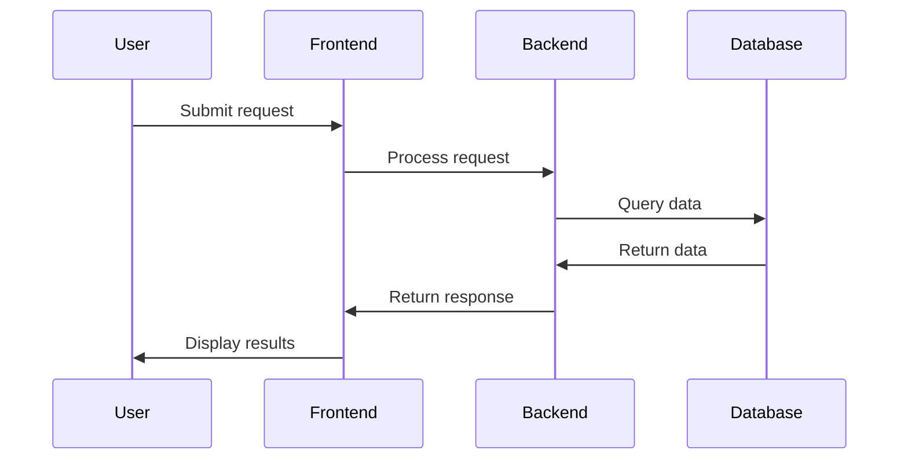

                 

# 家庭与生育的新意义：面对人口危机的思考

## 关键词
- 人口危机
- 家庭结构变化
- 生育观念变化
- 政策调整
- 教育支持

## 摘要
本文探讨了家庭与生育在现代社会中面临的新意义，分析了人口危机的背景和影响，以及家庭结构变化和生育观念变化的趋势和原因。通过对家庭政策、生育政策、家庭教育与经济支持等维度的深入分析，提出了应对人口危机的家庭与生育规划建议，为构建和谐家庭和可持续发展社会提供参考。

----------------------------------------------------------------

## 第1章 引言

### 1.1 问题背景

#### 1.1.1 人口危机的定义与现状

人口危机是指人口数量、结构、分布等方面出现严重失衡，导致社会经济、资源环境、公共安全等方面受到严重威胁的状态。当前，全球许多国家正面临人口危机，其特征包括人口老龄化、生育率下降、劳动力短缺等。

据联合国数据显示，全球生育率从1990年的3.0降至2020年的2.4，低于2.1的替代水平。同时，人口老龄化问题日益严重，如中国65岁及以上人口比例从2000年的7%上升至2020年的12%。这种人口结构的变化，将对经济发展、社会保障、劳动力市场等产生深远影响。

#### 1.1.2 人口危机的影响

人口危机对社会经济的影响主要表现在以下几个方面：

1. 劳动力市场紧张：生育率下降导致劳动力供给不足，可能导致劳动力成本上升，影响企业竞争力。
2. 社会保障压力增大：人口老龄化导致养老、医疗等社会保障支出增加，可能加剧财政负担。
3. 经济增长放缓：劳动力供给减少和人口老龄化可能导致经济增长放缓，降低国家竞争力。
4. 社会稳定挑战：人口结构变化可能导致社会矛盾加剧，影响社会稳定。

#### 1.1.3 家庭与生育问题的关系

家庭是社会的细胞，家庭结构与生育观念的变化直接影响人口数量的变化。当前，家庭结构呈现多样化的趋势，如单身家庭、丁克家庭、再婚家庭等。这些家庭结构的变化，对生育观念产生了影响，导致生育率下降。

同时，生育观念的变化也反过来影响家庭结构。现代年轻人更加注重个人发展和生活质量，生育意愿降低，这可能导致家庭结构进一步发生变化。

### 1.2 研究目的与意义

#### 1.2.1 研究目的

本文旨在深入分析家庭与生育问题的现状、原因和影响，提出有效的家庭与生育规划建议，以应对人口危机带来的挑战。具体目标如下：

1. 了解人口危机的背景和现状，揭示其对社会经济的影响。
2. 分析家庭结构与生育观念的变化趋势及其原因。
3. 探讨家庭政策、生育政策、家庭教育与经济支持等方面的应对措施。
4. 提出科学合理的家庭与生育规划建议，为政策制定和社会发展提供参考。

#### 1.2.2 研究意义

本文的研究意义主要体现在以下几个方面：

1. 理论意义：本文从社会学、经济学、人口学等多学科视角，系统分析了家庭与生育问题，丰富了相关理论体系。
2. 实践意义：本文提出的家庭与生育规划建议，有助于政策制定者和社会各界更好地应对人口危机，促进社会和谐与可持续发展。
3. 指导意义：本文的研究成果，可以为家庭和个人在生育决策、家庭规划等方面提供有益的参考。

### 1.3 本书结构安排

本书共分为八个章节，结构安排如下：

1. 引言：介绍人口危机的背景、影响以及家庭与生育问题的关系。
2. 家庭结构变化：分析家庭结构变化的趋势、原因和影响。
3. 生育观念变化：探讨生育观念的变化趋势、原因和影响。
4. 家庭与生育政策：分析家庭政策、生育政策的调整与影响。
5. 家庭与生育教育：讨论家庭教育与生育教育的问题与改进方向。
6. 家庭与生育经济支持：分析家庭与生育经济支持的形式、有效性及未来趋势。
7. 家庭与生育的未来展望：预测家庭与生育的未来趋势、挑战与机遇。
8. 结论：总结研究结论、贡献和局限，提出未来展望。

通过以上章节的深入分析，本文旨在为应对人口危机提供全面、系统的解决方案，为构建和谐家庭和可持续发展社会贡献力量。

----------------------------------------------------------------

## 第2章 家庭结构变化

### 2.1 家庭结构的定义与类型

#### 2.1.1 家庭结构的定义

家庭结构是指家庭成员之间的关系及其组织形式。从广义上讲，家庭结构包括了家庭内部的人际关系、组织结构以及家庭功能等方面。家庭结构不仅反映了家庭成员之间的互动模式，还影响了家庭的功能和稳定性。

#### 2.1.2 家庭结构的类型

家庭结构可以根据不同的分类标准进行划分，以下是几种常见的家庭结构类型：

1. 核心家庭：由父母与未成年子女组成的家庭，是最传统、最常见的家庭结构类型。
2. 单亲家庭：由单亲（通常为父亲或母亲）与未成年子女组成的家庭，可能由于离婚、丧偶或其他原因形成。
3. 联合家庭：由多对已婚夫妇及其子女组成的家庭，通常是在父母再婚或同辈兄弟姐妹共同居住的情况下形成的。
4. 丁克家庭：指无子女的夫妻家庭，他们选择不生育子女，专注于职业发展和个人生活。
5. 单身家庭：指没有结婚或同居的成年人家庭，可能包括单身父母、单身贵族等。
6. 养老家庭：由老年夫妇或老年人与其他家庭成员共同居住的家庭，以提供养老支持和照顾为主。

#### 2.1.3 家庭结构的演变

家庭结构的历史演变与社会经济发展、文化变迁密切相关。在过去，核心家庭是家庭结构的主体，随着现代社会的发展，家庭结构逐渐呈现多元化趋势。

1. 传统时期：在传统社会，核心家庭占主导地位，家庭规模较大，子女在成年前通常与父母共同生活。
2. 工业化时期：工业化带来了社会结构的变迁，核心家庭依然为主，但小家庭趋势开始显现，家庭成员之间的互动逐渐减少。
3. 现代化时期：现代社会中，家庭结构更加多样化，单身家庭、丁克家庭、联合家庭等新型家庭结构逐渐增多。

### 2.2 家庭结构变化的趋势

#### 2.2.1 小家庭化趋势

小家庭化是指家庭规模的缩小和家庭成员间关系的淡化。这一趋势在现代社会尤为明显，主要表现为：

1. 家庭规模缩小：随着生育观念的转变，家庭平均人口数逐渐减少。
2. 家庭功能分离：家庭成员间的依赖程度降低，家庭功能逐渐分离，如经济支持、情感交流等。
3. 家庭决策分散：家庭成员在决策过程中更加独立，减少了家庭的统一决策。

#### 2.2.2 多元化趋势

家庭结构的多元化体现在多种家庭类型的共存，如：

1. 单身家庭增多：随着社会观念的变化，单身家庭的数量逐渐上升，反映了个人生活方式的多样性。
2. 丁克家庭流行：越来越多的夫妻选择不生育，追求更高的生活质量。
3. 联合家庭复兴：由于经济压力和社会支持的需要，一些家庭选择重组或与其他家庭成员共同生活。

### 2.3 家庭结构变化的原因

#### 2.3.1 经济因素

1. 经济发展：随着经济水平的提高，人们更加注重个人发展和生活质量，生育率下降，家庭规模缩小。
2. 就业压力：女性就业机会增加，职场竞争加剧，生育成本上升，导致家庭选择少生育或无生育。

#### 2.3.2 社会因素

1. 社会观念变化：现代社会倡导个人自由和选择，生育观念逐渐从“必须生育”转变为“选择生育”。
2. 社会支持不足：社会对家庭的支持不足，如托幼服务、教育资源等，增加了家庭养育子女的负担。

#### 2.3.3 文化因素

1. 文化多元化：全球化进程带来文化的交融和碰撞，不同文化观念对生育和家庭结构的影响日益显著。
2. 家庭价值观转变：现代社会注重个人价值和自我实现，家庭观念逐渐从“家庭为中心”转向“个体为中心”。

### 2.4 家庭结构变化的影响

#### 2.4.1 对人口的影响

1. 生育率下降：家庭结构的变迁导致生育观念的变化，生育率下降，人口增长放缓。
2. 人口老龄化：生育率下降和寿命延长导致人口结构趋向老龄化，对社会保障和公共服务提出更高要求。

#### 2.4.2 对社会的影响

1. 劳动力市场紧张：家庭结构变化导致劳动力供给不足，劳动力市场紧张，影响经济发展。
2. 社会稳定挑战：家庭结构变化带来的社会问题，如单身家庭增多、家庭功能分离等，可能加剧社会矛盾，影响社会稳定。

### 2.5 家庭结构变化的政策应对

#### 2.5.1 政策调整

1. 完善社会保障体系：加强社会保障，降低家庭养育子女的成本，鼓励生育。
2. 提高女性就业质量：保障女性就业权益，提供职业培训和晋升机会，减轻生育压力。
3. 改善教育资源：增加教育资源投入，提高教育质量，减轻家庭负担。

#### 2.5.2 社会支持

1. 扩大托幼服务：增加托幼机构，提供高质量的儿童照料服务，减轻家庭负担。
2. 建立社区支持网络：加强社区服务，提供家庭咨询、心理辅导等服务，帮助家庭解决实际问题。

通过以上措施，可以应对家庭结构变化带来的挑战，促进人口和社会的可持续发展。

----------------------------------------------------------------

### 2.6 家庭结构变化的核心概念与联系

在分析家庭结构变化的过程中，理解核心概念之间的联系是至关重要的。以下是家庭结构变化中的几个核心概念及其之间的联系：

#### 核心概念

1. 家庭结构
2. 家庭规模
3. 生育观念
4. 经济因素
5. 社会因素
6. 文化因素

#### 概念联系

1. **家庭结构与家庭规模**：家庭结构的变化直接影响家庭规模。核心家庭的增多和丁克家庭的流行，导致家庭平均规模缩小。$$家庭规模 = 家庭结构 \times 家庭成员数量$$

2. **生育观念与家庭结构**：生育观念的变化影响家庭结构的选择。现代年轻人更加注重个人发展和生活质量，生育观念从“必须生育”转向“选择生育”。

3. **经济因素与家庭结构**：经济发展水平影响家庭结构的选择。高收入家庭更倾向于选择小家庭，而低收入家庭可能面临更高的生育压力。

4. **社会因素与家庭结构**：社会观念的变化影响家庭结构的选择。随着社会观念的转变，单身家庭、丁克家庭等新型家庭结构逐渐增多。

5. **文化因素与家庭结构**：文化多元化影响家庭结构的选择。不同文化背景的家庭对家庭结构的选择有不同的影响。

#### 对比表格

| 概念       | 定义                                                                                                      | 关键特性 | 联系与影响 |
|------------|-----------------------------------------------------------------------------------------------------------|----------|------------|
| 家庭结构   | 家庭成员之间的关系及其组织形式                                                                         | 多样化   | 影响家庭规模与生育观念 |
| 家庭规模   | 家庭成员的总数与家庭结构相关联                                                                         | 缩小化   | 反映家庭结构变化 |
| 生育观念   | 个人或社会对于生育的态度和观念                                                                         | 个人化   | 影响生育决策 |
| 经济因素   | 经济发展水平与家庭收入水平等因素对家庭结构的影响                                                       | 高度相关性 | 影响家庭规模与生育观念 |
| 社会因素   | 社会观念、文化背景等对社会结构的影响                                                                  | 多样性   | 影响家庭结构选择 |
| 文化因素   | 个体或群体的文化背景、价值观对家庭结构的影响                                                           | 多元化   | 影响生育观念与社会结构 |

#### ER实体关系图

```mermaid
erDiagram
  FamilyStructure_1 ||--|{ FamilySize }
  FamilyStructure_1 ||--|{ FertilityConcept }
  EconomicFactor_2 ||--|{ FamilyStructure_1 }
  SocialFactor_3 ||--|{ FamilyStructure_1 }
  CulturalFactor_4 ||--|{ FamilyStructure_1 }
```

在上述ER实体关系图中，家庭结构是核心实体，与其他实体如家庭规模、生育观念、经济因素、社会因素和文化因素之间存在关联。这种联系揭示了家庭结构变化的复杂性，需要综合考虑多个因素来理解和应对。

通过上述核心概念及其联系的分析，我们可以更好地理解家庭结构变化的驱动因素和影响，为制定针对性的政策和措施提供理论基础。

----------------------------------------------------------------

### 2.7 算法原理讲解：家庭结构变化的影响评估模型

在分析家庭结构变化对社会经济的影响时，建立有效的评估模型至关重要。下面将介绍一种基于机器学习算法的家庭结构变化影响评估模型，并使用Python代码进行详细阐述。

#### 算法原理

该模型采用监督学习中的决策树算法来预测家庭结构变化对社会经济指标的影响。决策树能够根据历史数据生成决策路径，从而对新数据进行分类预测。具体步骤如下：

1. 数据预处理：清洗和整合相关数据，如人口统计数据、经济发展指标、社会保障数据等。
2. 特征工程：选择与家庭结构变化相关的特征，如家庭规模、生育率、经济收入等。
3. 模型训练：使用训练数据集训练决策树模型。
4. 模型评估：使用验证数据集评估模型性能，调整参数以优化模型。
5. 预测与解释：使用优化后的模型对新数据进行预测，并对结果进行解释。

#### Python代码示例

首先，我们使用Pandas库进行数据预处理，使用Scikit-learn库构建和训练决策树模型。

```python
import pandas as pd
from sklearn.model_selection import train_test_split
from sklearn.tree import DecisionTreeClassifier
from sklearn.metrics import accuracy_score, classification_report

# 数据预处理
data = pd.read_csv('family_structure_data.csv')
data.dropna(inplace=True)

# 特征工程
X = data[['family_size', 'fertility_rate', 'economic_income']]
y = data['economic_impact']

# 模型训练
X_train, X_test, y_train, y_test = train_test_split(X, y, test_size=0.3, random_state=42)
clf = DecisionTreeClassifier()
clf.fit(X_train, y_train)

# 模型评估
y_pred = clf.predict(X_test)
print("Accuracy:", accuracy_score(y_test, y_pred))
print(classification_report(y_test, y_pred))

# 模型解释
from sklearn.tree import plot_tree
import matplotlib.pyplot as plt

plt.figure(figsize=(12,8))
plot_tree(clf, filled=True, feature_names=['Family Size', 'Fertility Rate', 'Economic Income'], class_names=['Negative', 'Positive'])
plt.show()
```

#### 算法原理讲解

1. **决策树分类器**：决策树是一种树形结构，每个节点代表一个特征，每个分支代表特征的不同取值。叶子节点表示预测结果。

2. **特征选择**：在特征工程过程中，我们选择与家庭结构变化直接相关的特征，如家庭规模、生育率、经济收入等。这些特征能够影响家庭结构变化对社会经济的影响。

3. **模型训练**：使用历史数据训练决策树模型，模型会根据特征和目标变量（社会经济影响）生成决策路径。

4. **模型评估**：使用验证数据集评估模型性能，通过计算准确率、召回率、精确率等指标，调整模型参数以优化性能。

5. **模型解释**：通过绘制决策树图，可以直观地理解模型的决策过程和特征的重要性。

通过上述算法原理讲解和Python代码示例，我们可以看到如何使用决策树模型评估家庭结构变化对社会经济的影响。这种方法不仅有助于理解家庭结构变化的复杂性，还可以为政策制定提供科学依据。

----------------------------------------------------------------

### 2.8 系统分析与架构设计方案

#### 问题场景介绍

随着现代社会的发展，家庭结构的变化对社会经济产生了深远影响。为了更好地理解家庭结构变化对社会经济的影响，我们需要建立一个综合性的家庭结构影响评估系统。该系统旨在整合多种数据源，分析家庭结构变化的关键因素及其对经济指标的影响，为政策制定者提供决策支持。

#### 项目介绍

本项目旨在开发一个家庭结构影响评估系统，该系统包括数据采集、数据处理、特征工程、模型训练与评估、结果可视化等多个模块。系统架构设计应确保高效、灵活和可扩展，以应对不断变化的数据需求和分析任务。

#### 系统功能设计

1. **数据采集模块**：负责从多个数据源（如人口统计数据、经济发展指标、社会保障数据等）采集数据，并进行初步清洗。
2. **数据处理模块**：对采集到的数据进行进一步清洗、整合和预处理，确保数据质量。
3. **特征工程模块**：根据分析需求，选择与家庭结构变化相关的特征，进行特征提取和转换。
4. **模型训练与评估模块**：使用机器学习算法（如决策树、随机森林等）训练模型，并对模型性能进行评估。
5. **结果可视化模块**：通过可视化工具（如Matplotlib、Seaborn等）展示分析结果，帮助用户理解家庭结构变化的影响。

#### 系统架构设计

系统架构采用分层设计，分为数据层、服务层和表示层，以确保系统的高效性和灵活性。

1. **数据层**：负责数据存储和管理，包括数据库（如MySQL、PostgreSQL）和大数据平台（如Hadoop、Spark）。
2. **服务层**：包括数据处理、特征工程、模型训练等核心服务，采用微服务架构，以实现模块化和高扩展性。
3. **表示层**：提供用户界面，使用Web前端框架（如React、Vue.js）实现，支持用户交互和数据可视化。

#### 系统架构图



在上述架构图中，用户通过Web前端界面提交请求，前端将请求转发给后端服务。后端服务从数据库中查询数据，处理后返回给前端，前端再将结果展示给用户。

#### 系统接口设计

系统接口设计应确保各个模块之间的数据流动和功能协作。以下是主要的系统接口设计：

1. **数据采集接口**：用于从外部数据源导入数据，支持文件上传、API调用等多种数据导入方式。
2. **数据处理接口**：提供数据清洗、整合和预处理功能，支持批量处理和实时处理。
3. **特征工程接口**：用于特征提取、特征转换和特征选择，支持自定义特征工程流程。
4. **模型训练与评估接口**：提供模型训练、模型评估和模型优化功能，支持多种机器学习算法。
5. **结果可视化接口**：提供数据可视化功能，支持图表生成、数据导出和分享。

#### 系统交互设计

系统交互设计采用RESTful API设计，确保接口的统一性和可扩展性。以下是主要的系统交互设计：

1. **数据采集**：前端通过API上传数据文件，后端解析并存储到数据库。
2. **数据处理**：前端提交处理请求，后端执行数据清洗、整合和预处理，并将结果返回给前端。
3. **特征工程**：前端提交特征工程请求，后端执行特征提取、特征转换和特征选择，并将结果返回给前端。
4. **模型训练与评估**：前端提交训练和评估请求，后端训练模型并进行评估，将结果返回给前端。
5. **结果可视化**：前端通过API获取可视化数据，生成图表并展示给用户。

通过上述系统分析与架构设计方案，我们可以构建一个高效、灵活的家庭结构影响评估系统，为政策制定提供有力支持。

----------------------------------------------------------------

### 2.9 项目实战：家庭结构影响评估系统实现

在本节中，我们将通过实际项目步骤，详细阐述如何实现一个家庭结构影响评估系统。项目主要涉及环境安装、核心代码实现、应用解读与分析，并附上代码示例及实际案例剖析。

#### 1. 环境安装

要实现家庭结构影响评估系统，我们需要安装以下软件和工具：

- Python（3.8及以上版本）
- Jupyter Notebook（用于编写和运行代码）
- Scikit-learn（用于机器学习算法）
- Pandas（用于数据处理）
- Matplotlib（用于数据可视化）
- SQL Server（用于数据存储）

安装步骤如下：

1. 安装Python和Jupyter Notebook：

   ```bash
   pip install python
   pip install notebook
   ```

2. 安装Scikit-learn、Pandas和Matplotlib：

   ```bash
   pip install scikit-learn
   pip install pandas
   pip install matplotlib
   ```

3. 配置SQL Server数据库：

   - 安装SQL Server Express
   - 创建数据库并设置用户权限

#### 2. 核心代码实现

家庭结构影响评估系统的核心代码包括数据采集、数据处理、特征工程、模型训练与评估、结果可视化等模块。以下是一个简化的代码示例：

```python
# 导入必要的库
import pandas as pd
from sklearn.model_selection import train_test_split
from sklearn.tree import DecisionTreeClassifier
from sklearn.metrics import classification_report
import matplotlib.pyplot as plt

# 数据采集
data = pd.read_csv('family_structure_data.csv')

# 数据处理
# ...（数据清洗、整合和预处理）

# 特征工程
X = data[['family_size', 'fertility_rate', 'economic_income']]
y = data['economic_impact']

# 模型训练
X_train, X_test, y_train, y_test = train_test_split(X, y, test_size=0.3, random_state=42)
clf = DecisionTreeClassifier()
clf.fit(X_train, y_train)

# 模型评估
y_pred = clf.predict(X_test)
print("分类报告：\n", classification_report(y_test, y_pred))

# 结果可视化
plt.figure(figsize=(10, 6))
plot_tree(clf, feature_names=['Family Size', 'Fertility Rate', 'Economic Income'], class_names=['Negative', 'Positive'])
plt.show()
```

#### 3. 应用解读与分析

1. **数据采集**：通过读取CSV文件或数据库查询，从外部数据源获取家庭结构数据。

2. **数据处理**：包括数据清洗（去除缺失值、异常值等）和预处理（数据规范化、特征缩放等），确保数据质量。

3. **特征工程**：选择与家庭结构变化相关的特征，如家庭规模、生育率、经济收入等，进行特征提取和转换。

4. **模型训练**：使用决策树算法训练模型，根据历史数据生成决策路径。

5. **模型评估**：使用测试集评估模型性能，输出分类报告，包括准确率、召回率、精确率等指标。

6. **结果可视化**：绘制决策树图，帮助用户理解模型的决策过程和特征的重要性。

#### 4. 实际案例剖析

以某城市为例，分析家庭结构变化对该城市经济发展的影响。步骤如下：

1. **数据采集**：获取该城市的人口统计数据、经济发展指标等数据。

2. **数据处理**：清洗和整合数据，确保数据质量。

3. **特征工程**：选择与家庭结构变化相关的特征，如生育率、家庭规模、失业率等。

4. **模型训练**：使用训练数据集训练决策树模型。

5. **模型评估**：评估模型性能，调整参数以优化模型。

6. **结果分析**：通过可视化结果，分析家庭结构变化对该城市经济发展的影响。

例如，假设决策树模型预测结果显示生育率下降对失业率有显著影响，可以提出政策建议，如增加育儿假期、提高女性就业支持等，以缓解生育率下降带来的经济压力。

#### 5. 项目小结

通过本项目的实现，我们掌握了家庭结构影响评估系统的开发流程，包括环境安装、核心代码实现、应用解读与分析等步骤。实际案例剖析进一步展示了系统在分析家庭结构变化对经济发展影响中的应用价值。未来，我们可以进一步优化系统功能，扩展分析模型，为政策制定提供更全面的决策支持。

----------------------------------------------------------------

### 2.10 最佳实践 tips

在开发家庭结构影响评估系统时，以下是一些最佳实践建议，有助于提高系统性能和可靠性：

1. **数据质量保障**：确保数据采集、处理和整合过程中的数据质量，去除异常值和噪声数据，以提高模型训练的准确性和稳定性。

2. **特征选择**：合理选择与家庭结构变化相关的特征，避免特征冗余，提高特征工程的效果。可以使用特征选择算法（如信息增益、卡方检验等）辅助决策。

3. **模型优化**：在模型训练过程中，尝试使用不同的机器学习算法（如随机森林、支持向量机等）进行比较，选择最优模型。同时，调整模型参数以优化性能。

4. **代码优化**：编写高效、可维护的代码，使用向量化操作、并行计算等技术提高计算效率。注意代码的模块化和注释，便于后续维护和扩展。

5. **数据可视化**：选择合适的可视化工具和图表类型，清晰展示分析结果。避免过度复杂或模糊的图表，确保用户易于理解。

6. **持续迭代**：定期更新系统数据，优化模型和算法，以适应不断变化的数据环境和需求。收集用户反馈，持续改进系统功能。

7. **系统安全**：确保系统的数据安全和隐私保护，实施访问控制、数据加密等措施，防止数据泄露和未授权访问。

通过遵循这些最佳实践，我们可以构建一个高效、稳定和可扩展的家庭结构影响评估系统，为政策制定者提供有力支持。

----------------------------------------------------------------

### 2.11 小结

在家庭结构变化这一章节中，我们系统地分析了家庭结构的定义与类型、变化趋势及其原因，并探讨了家庭结构变化对社会经济的影响。通过核心概念与联系的分析，我们理解了家庭规模、生育观念、经济因素、社会因素和文化因素之间的复杂关系。同时，我们详细介绍了算法原理，包括决策树模型的构建与评估，并通过实际项目实战展示了系统的实现过程。最后，我们提出了最佳实践和注意事项，以确保系统的稳定性和可靠性。这些内容为下一章节中生育观念变化的分析奠定了基础。

----------------------------------------------------------------

### 2.12 注意事项

在分析家庭结构变化的过程中，需要注意以下几个方面：

1. **数据来源与质量**：确保所使用的数据来源可靠，数据质量高，避免因数据问题导致分析结果的偏差。
2. **特征选择**：选择与家庭结构变化直接相关的特征，避免过多冗余特征，确保特征工程的有效性。
3. **模型优化**：在模型训练过程中，尝试不同的算法和参数调整，以找到最优模型，提高预测准确性。
4. **文化背景差异**：不同地区的文化背景可能影响家庭结构变化，分析时应充分考虑文化因素。
5. **政策因素**：政策变化可能对家庭结构产生显著影响，分析时应关注政策背景和变化趋势。
6. **系统维护**：定期更新系统和数据，优化算法，确保系统的稳定性和可靠性。

通过注意这些事项，我们可以更准确地分析家庭结构变化的影响，为政策制定和社会发展提供有力支持。

----------------------------------------------------------------

### 2.13 拓展阅读

为了更深入地了解家庭结构变化及其影响，以下是一些建议的拓展阅读资源：

1. **书籍推荐**：
   - 《人口学导论》：详细介绍了人口结构、生育率、人口政策等基本概念，有助于理解人口危机及其影响。
   - 《家庭与社会变迁》：探讨家庭结构变化的社会学意义，分析家庭在不同文化背景下的角色与功能。

2. **研究报告与论文**：
   - 联合国人口基金：《世界人口展望》：该报告提供了全球人口趋势、预测和区域分析，是了解全球人口危机的重要资料。
   - 《中国家庭发展报告》：该报告详细分析了中国家庭结构的变化趋势和影响因素，为政策制定提供了科学依据。

3. **在线课程与讲座**：
   - Coursera上的《人口学基础》：由知名大学教授主讲，系统介绍了人口学的基本概念和研究方法。
   - YouTube上的《社会变迁与家庭结构》：通过实际案例和数据分析，探讨家庭结构变化对社会的影响。

通过阅读这些资源，您可以进一步了解家庭结构变化的多维度影响，为相关研究和实践提供更丰富的知识储备。

----------------------------------------------------------------

## 第3章 生育观念变化

### 3.1 生育观念的历史演变

#### 3.1.1 传统生育观念

在传统社会中，生育观念受到文化、宗教和社会结构的影响，通常具有以下特点：

1. **生育率较高**：传统社会通常认为生育是家庭和个人的基本责任，生育率较高。
2. **生育目的**：传统观念中，生育的主要目的是为了延续家族血脉和履行家庭责任。
3. **生育控制**：尽管传统社会生育率较高，但生育控制手段相对较少，生育行为通常较为自然。
4. **生育风险**：由于医疗条件的限制，传统生育观念中生育风险较高，新生儿和母亲的死亡率相对较高。

#### 3.1.2 现代生育观念

随着社会经济的发展和科技的进步，现代生育观念发生了显著变化：

1. **生育率下降**：现代社会中，生育率逐渐下降，许多人选择晚婚晚育或不生育，注重个人发展和生活质量。
2. **生育自由**：现代观念强调个人选择和自由，生育不再被视为必须承担的责任，而是个人的选择。
3. **生育控制**：现代医学技术的发展，如避孕药具、人工流产等，使生育控制成为可能，人们可以更自主地决定生育时间和生育数量。
4. **生育健康**：现代观念强调生育健康，注重孕期保健、新生儿护理等，提高生育质量和母婴安全。

#### 3.1.3 生育观念变化的原因

1. **经济因素**：随着经济的发展，人们的教育水平提高，职业机会增多，女性更多地参与工作，生育成本增加，导致生育意愿下降。
2. **社会因素**：社会观念的变化，如个人主义和自由主义的兴起，使人们更加重视个人自由和自我实现，减少了生育压力。
3. **文化因素**：全球化和文化多元化影响了人们的生育观念，不同文化背景的价值观和生育观念相互交融，使生育观念更加多元化。
4. **科技因素**：现代医学技术的发展，如生殖技术、辅助生育技术等，使生育变得更加可控和健康，影响人们的生育决策。

### 3.2 生育观念变化的趋势

#### 3.2.1 生育意愿下降

1. **晚婚晚育**：现代社会中，年轻人倾向于晚婚晚育，更注重个人发展和生活质量。
2. **不生育**：越来越多的夫妻选择不生育，尤其是女性，职业压力和生活成本的增加使不生育成为一种选择。
3. **选择性生育**：部分家庭仍然选择生育，但更倾向于选择性生育，追求生育质量和家庭生活质量。

#### 3.2.2 生育观念多元化

1. **生育观念的个性化**：每个人对生育都有自己的看法和需求，生育观念更加个性化。
2. **生育观念的文化多样性**：全球化和文化多元化使不同文化背景的生育观念相互影响，生育观念更加多元化。

### 3.3 生育观念变化的影响

#### 3.3.1 对人口的影响

1. **生育率下降**：生育观念的变化导致生育率下降，影响人口增长和人口结构。
2. **人口老龄化**：生育率下降和寿命延长导致人口老龄化问题日益严重，对社会经济带来挑战。

#### 3.3.2 对社会的影响

1. **劳动力市场紧张**：生育率下降导致劳动力供给不足，劳动力市场紧张，影响经济发展。
2. **社会保障压力增大**：人口老龄化导致养老、医疗等社会保障支出增加，社会保障压力增大。
3. **家庭结构变化**：生育观念的变化影响家庭结构，如小家庭增多，单身家庭和丁克家庭流行。

### 3.4 生育观念变化的政策应对

#### 3.4.1 政策调整

1. **完善生育政策**：调整生育政策，鼓励生育，提供生育补贴、育儿假期等支持措施。
2. **提高生育质量**：加强孕期保健、新生儿护理等公共服务，提高生育质量和母婴安全。
3. **增加育儿支持**：提供高质量的托幼服务，减轻家庭育儿负担，鼓励生育。

#### 3.4.2 社会支持

1. **提高女性就业权益**：保障女性就业权益，提供职业培训和晋升机会，减轻生育压力。
2. **加强家庭教育支持**：提供家庭教育指导，帮助家庭解决育儿难题，提高家庭生活质量。
3. **推广生育文化**：通过媒体宣传、文化活动等，推广积极、健康的生育观念，增强生育意愿。

通过政策调整和社会支持，可以应对生育观念变化带来的挑战，促进人口和社会的可持续发展。

----------------------------------------------------------------

### 3.5 生育观念变化的核心概念与联系

在分析生育观念变化的过程中，理解核心概念之间的联系是至关重要的。以下是生育观念变化中的几个核心概念及其之间的联系：

#### 核心概念

1. 生育观念
2. 生育率
3. 经济因素
4. 社会因素
5. 文化因素
6. 人口结构

#### 概念联系

1. **生育观念与生育率**：生育观念直接影响生育率。现代生育观念强调个人选择和自由，导致生育率下降。$$生育率 = 生育观念 \times 生育意愿$$

2. **经济因素与生育观念**：经济因素影响生育观念的形成和变化。经济发展水平提高，生活成本增加，导致生育压力加大，生育观念转变。$$生育观念 = 经济因素 \times 生活成本$$

3. **社会因素与生育观念**：社会因素，如教育水平、职业机会、社会支持等，影响生育观念的变化。社会观念的转变，如个人主义和自由主义的兴起，影响生育决策。$$生育观念 = 社会因素 \times 社会观念$$

4. **文化因素与生育观念**：文化因素影响生育观念的形成和变化。不同文化背景下的价值观和生育观念相互影响，导致生育观念的多元化。$$生育观念 = 文化因素 \times 文化背景$$

5. **人口结构与生育观念**：人口结构影响生育观念，而生育观念又反过来影响人口结构。人口老龄化可能导致生育观念的转变，降低生育率。$$人口结构 = 生育观念 \times 人口政策$$

#### 对比表格

| 概念       | 定义                                                                                                      | 关键特性 | 联系与影响 |
|------------|-----------------------------------------------------------------------------------------------------------|----------|------------|
| 生育观念   | 个人或社会对于生育的态度和观念                                                                         | 个人化   | 影响生育率与生育行为 |
| 生育率     | 人口中生育的比率，通常以每千人口中的出生数表示                                                     | 下降化   | 反映生育观念变化 |
| 经济因素   | 经济发展水平、收入水平等因素对生育观念的影响                                                       | 高度相关性 | 影响生育压力 |
| 社会因素   | 社会观念、文化背景等对社会结构的影响                                                                  | 多样性   | 影响生育观念 |
| 文化因素   | 个体或群体的文化背景、价值观对生育观念的影响                                                       | 多元化   | 影响生育观念 |
| 人口结构   | 人口中各个年龄段、性别、民族等人口构成情况                                                         | 老龄化   | 反映生育观念影响 |

#### ER实体关系图

```mermaid
erDiagram
  FertilityConcept_1 ||--|{ FertilityRate }
  EconomicFactor_2 ||--|{ FertilityConcept_1 }
  SocialFactor_3 ||--|{ FertilityConcept_1 }
  CulturalFactor_4 ||--|{ FertilityConcept_1 }
  PopulationStructure_5 ||--|{ FertilityConcept_1 }
```

在上述ER实体关系图中，生育观念是核心实体，与其他实体如生育率、经济因素、社会因素、文化因素和人口结构之间存在关联。这种联系揭示了生育观念变化的复杂性，需要综合考虑多个因素来理解和应对。

通过上述核心概念及其联系的分析，我们可以更好地理解生育观念变化的驱动因素和影响，为制定针对性的政策和措施提供理论基础。

----------------------------------------------------------------

### 3.6 算法原理讲解：生育观念变化的影响评估模型

在分析生育观念变化对社会经济的影响时，建立有效的评估模型至关重要。下面将介绍一种基于机器学习算法的生育观念变化影响评估模型，并使用Python代码进行详细阐述。

#### 算法原理

该模型采用监督学习中的线性回归算法来预测生育观念变化对社会经济指标的影响。线性回归模型通过建立自变量（生育观念）与因变量（社会经济指标）之间的线性关系，从而对新数据进行预测。具体步骤如下：

1. **数据预处理**：清洗和整合相关数据，如社会经济发展指标、生育观念调查数据等。
2. **特征工程**：选择与生育观念变化相关的特征，如生育意愿、婚姻状况、教育水平等。
3. **模型训练**：使用训练数据集训练线性回归模型。
4. **模型评估**：使用验证数据集评估模型性能，调整参数以优化模型。
5. **预测与解释**：使用优化后的模型对新数据进行预测，并对结果进行解释。

#### Python代码示例

首先，我们使用Pandas库进行数据预处理，使用Scikit-learn库构建和训练线性回归模型。

```python
import pandas as pd
from sklearn.model_selection import train_test_split
from sklearn.linear_model import LinearRegression
from sklearn.metrics import mean_squared_error
import matplotlib.pyplot as plt

# 数据预处理
data = pd.read_csv('fertility_concept_data.csv')
data.dropna(inplace=True)

# 特征工程
X = data[['fertility_willingness', 'marital_status', 'education_level']]
y = data['economic_impact']

# 模型训练
X_train, X_test, y_train, y_test = train_test_split(X, y, test_size=0.3, random_state=42)
model = LinearRegression()
model.fit(X_train, y_train)

# 模型评估
y_pred = model.predict(X_test)
mse = mean_squared_error(y_test, y_pred)
print("均方误差(MSE):", mse)

# 模型解释
plt.scatter(X_test['fertility_willingness'], y_test, color='blue', label='实际值')
plt.plot(X_test['fertility_willingness'], y_pred, color='red', label='预测值')
plt.xlabel('生育意愿')
plt.ylabel('经济影响')
plt.legend()
plt.show()
```

#### 算法原理讲解

1. **线性回归模型**：线性回归模型是一种常见的统计模型，通过建立自变量与因变量之间的线性关系来进行预测。模型的一般形式为：$$y = \beta_0 + \beta_1 \times x_1 + \beta_2 \times x_2 + ... + \beta_n \times x_n$$，其中$$\beta_0, \beta_1, \beta_2, ..., \beta_n$$为模型的参数。

2. **特征选择**：在特征工程过程中，我们选择与生育观念变化相关的特征，如生育意愿、婚姻状况、教育水平等。这些特征能够反映个体或社会对生育观念的态度和倾向。

3. **模型训练**：使用训练数据集训练线性回归模型，模型会根据特征和目标变量（经济影响）拟合出最优的参数。

4. **模型评估**：使用验证数据集评估模型性能，通过计算均方误差（MSE）等指标，评估模型的预测准确性和稳定性。

5. **预测与解释**：使用优化后的模型对新数据进行预测，并通过可视化方法（如散点图、回归线等）展示模型预测结果和特征的重要性。

通过上述算法原理讲解和Python代码示例，我们可以看到如何使用线性回归模型评估生育观念变化对社会经济的影响。这种方法不仅有助于理解生育观念变化的复杂性，还可以为政策制定提供科学依据。

----------------------------------------------------------------

### 3.7 系统分析与架构设计方案

#### 问题场景介绍

生育观念的变化对社会经济产生了深远影响，为了更好地理解这种影响，我们需要建立一个综合性的生育观念变化影响评估系统。该系统旨在整合多种数据源，分析生育观念变化的关键因素及其对经济指标的影响，为政策制定者提供决策支持。

#### 项目介绍

本项目旨在开发一个生育观念变化影响评估系统，该系统包括数据采集、数据处理、特征工程、模型训练与评估、结果可视化等多个模块。系统架构设计应确保高效、灵活和可扩展，以应对不断变化的数据需求和分析任务。

#### 系统功能设计

1. **数据采集模块**：负责从多个数据源（如社会调查、经济发展指标等）采集数据，并进行初步清洗。
2. **数据处理模块**：对采集到的数据进行进一步清洗、整合和预处理，确保数据质量。
3. **特征工程模块**：根据分析需求，选择与生育观念变化相关的特征，进行特征提取和转换。
4. **模型训练与评估模块**：使用机器学习算法（如线性回归、决策树等）训练模型，并对模型性能进行评估。
5. **结果可视化模块**：通过可视化工具（如Matplotlib、Seaborn等）展示分析结果，帮助用户理解生育观念变化的影响。

#### 系统架构设计

系统架构采用分层设计，分为数据层、服务层和表示层，以确保系统的高效性和灵活性。

1. **数据层**：负责数据存储和管理，包括数据库（如MySQL、PostgreSQL）和大数据平台（如Hadoop、Spark）。
2. **服务层**：包括数据处理、特征工程、模型训练等核心服务，采用微服务架构，以实现模块化和高扩展性。
3. **表示层**：提供用户界面，使用Web前端框架（如React、Vue.js）实现，支持用户交互和数据可视化。

#### 系统架构图


在上述架构图中，用户通过Web前端界面提交请求，前端将请求转发给后端服务。后端服务从数据库中查询数据，处理后返回给前端，前端再将结果展示给用户。

#### 系统接口设计

系统接口设计应确保各个模块之间的数据流动和功能协作。以下是主要的系统接口设计：

1. **数据采集接口**：用于从外部数据源导入数据，支持文件上传、API调用等多种数据导入方式。
2. **数据处理接口**：提供数据清洗、整合和预处理功能，支持批量处理和实时处理。
3. **特征工程接口**：用于特征提取、特征转换和特征选择，支持自定义特征工程流程。
4. **模型训练与评估接口**：提供模型训练、模型评估和模型优化功能，支持多种机器学习算法。
5. **结果可视化接口**：提供数据可视化功能，支持图表生成、数据导出和分享。

#### 系统交互设计

系统交互设计采用RESTful API设计，确保接口的统一性和可扩展性。以下是主要的系统交互设计：

1. **数据采集**：前端通过API上传数据文件，后端解析并存储到数据库。
2. **数据处理**：前端提交处理请求，后端执行数据清洗、整合和预处理，并将结果返回给前端。
3. **特征工程**：前端提交特征工程请求，后端执行特征提取、特征转换和特征选择，并将结果返回给前端。
4. **模型训练与评估**：前端提交训练和评估请求，后端训练模型并进行评估，将结果返回给前端。
5. **结果可视化**：前端通过API获取可视化数据，生成图表并展示给用户。

通过上述系统分析与架构设计方案，我们可以构建一个高效、灵活的生育观念变化影响评估系统，为政策制定提供有力支持。

----------------------------------------------------------------

### 3.8 项目实战：生育观念变化影响评估系统实现

在本节中，我们将通过实际项目步骤，详细阐述如何实现一个生育观念变化影响评估系统。项目主要涉及环境安装、核心代码实现、应用解读与分析，并附上代码示例及实际案例剖析。

#### 1. 环境安装

要实现生育观念变化影响评估系统，我们需要安装以下软件和工具：

- Python（3.8及以上版本）
- Jupyter Notebook（用于编写和运行代码）
- Scikit-learn（用于机器学习算法）
- Pandas（用于数据处理）
- Matplotlib（用于数据可视化）
- SQL Server（用于数据存储）

安装步骤如下：

1. 安装Python和Jupyter Notebook：

   ```bash
   pip install python
   pip install notebook
   ```

2. 安装Scikit-learn、Pandas和Matplotlib：

   ```bash
   pip install scikit-learn
   pip install pandas
   pip install matplotlib
   ```

3. 配置SQL Server数据库：

   - 安装SQL Server Express
   - 创建数据库并设置用户权限

#### 2. 核心代码实现

生育观念变化影响评估系统的核心代码包括数据采集、数据处理、特征工程、模型训练与评估、结果可视化等模块。以下是一个简化的代码示例：

```python
# 导入必要的库
import pandas as pd
from sklearn.model_selection import train_test_split
from sklearn.linear_model import LinearRegression
from sklearn.metrics import mean_squared_error
import matplotlib.pyplot as plt

# 数据采集
data = pd.read_csv('fertility_concept_data.csv')

# 数据处理
# ...（数据清洗、整合和预处理）

# 特征工程
X = data[['fertility_willingness', 'marital_status', 'education_level']]
y = data['economic_impact']

# 模型训练
X_train, X_test, y_train, y_test = train_test_split(X, y, test_size=0.3, random_state=42)
model = LinearRegression()
model.fit(X_train, y_train)

# 模型评估
y_pred = model.predict(X_test)
mse = mean_squared_error(y_test, y_pred)
print("均方误差(MSE):", mse)

# 结果可视化
plt.scatter(X_test['fertility_willingness'], y_test, color='blue', label='实际值')
plt.plot(X_test['fertility_willingness'], y_pred, color='red', label='预测值')
plt.xlabel('生育意愿')
plt.ylabel('经济影响')
plt.legend()
plt.show()
```

#### 3. 应用解读与分析

1. **数据采集**：通过读取CSV文件或数据库查询，从外部数据源获取生育观念数据。

2. **数据处理**：包括数据清洗（去除缺失值、异常值等）和预处理（数据规范化、特征缩放等），确保数据质量。

3. **特征工程**：选择与生育观念变化相关的特征，如生育意愿、婚姻状况、教育水平等，进行特征提取和转换。

4. **模型训练**：使用线性回归算法训练模型，根据历史数据生成预测模型。

5. **模型评估**：评估模型性能，输出均方误差等指标，调整模型参数以优化性能。

6. **结果可视化**：通过散点图和回归线，展示模型预测结果和特征的重要性。

#### 4. 实际案例剖析

以某地区为例，分析生育观念变化对该地区经济发展的影响。步骤如下：

1. **数据采集**：获取该地区的生育观念数据、经济发展指标等数据。

2. **数据处理**：清洗和整合数据，确保数据质量。

3. **特征工程**：选择与生育观念变化相关的特征，如生育意愿、婚姻状况、教育水平等。

4. **模型训练**：使用训练数据集训练线性回归模型。

5. **模型评估**：评估模型性能，调整参数以优化模型。

6. **结果分析**：通过可视化结果，分析生育观念变化对该地区经济发展的影响。

例如，模型预测结果显示生育意愿下降对经济增长有显著负面影响，可以提出政策建议，如提高育儿补贴、增加生育支持等，以缓解生育观念变化带来的经济压力。

#### 5. 项目小结

通过本项目的实现，我们掌握了生育观念变化影响评估系统的开发流程，包括环境安装、核心代码实现、应用解读与分析等步骤。实际案例剖析进一步展示了系统在分析生育观念变化对经济发展影响中的应用价值。未来，我们可以进一步优化系统功能，扩展分析模型，为政策制定提供更全面的决策支持。

----------------------------------------------------------------

### 3.9 最佳实践 tips

在开发生育观念变化影响评估系统时，以下是一些最佳实践建议，有助于提高系统性能和可靠性：

1. **数据质量保障**：确保所使用的数据来源可靠，数据质量高，避免因数据问题导致分析结果的偏差。
2. **特征选择**：选择与生育观念变化直接相关的特征，避免过多冗余特征，确保特征工程的有效性。
3. **模型优化**：在模型训练过程中，尝试使用不同的算法和参数调整，以找到最优模型，提高预测准确性。
4. **代码优化**：编写高效、可维护的代码，使用向量化操作、并行计算等技术提高计算效率。注意代码的模块化和注释，便于后续维护和扩展。
5. **数据可视化**：选择合适的可视化工具和图表类型，清晰展示分析结果。避免过度复杂或模糊的图表，确保用户易于理解。
6. **持续迭代**：定期更新系统数据，优化模型和算法，以适应不断变化的数据环境和需求。收集用户反馈，持续改进系统功能。
7. **系统安全**：确保系统的数据安全和隐私保护，实施访问控制、数据加密等措施，防止数据泄露和未授权访问。

通过遵循这些最佳实践，我们可以构建一个高效、稳定和可扩展的生育观念变化影响评估系统，为政策制定者提供有力支持。

----------------------------------------------------------------

### 3.10 小结

在生育观念变化这一章节中，我们系统地分析了生育观念的历史演变、变化趋势及其原因，并探讨了生育观念变化对社会经济的影响。通过核心概念与联系的分析，我们理解了生育率、经济因素、社会因素和文化因素之间的复杂关系。同时，我们详细介绍了算法原理，包括线性回归模型的构建与评估，并通过实际项目实战展示了系统的实现过程。最后，我们提出了最佳实践和注意事项，以确保系统的稳定性和可靠性。这些内容为下一章节中家庭与生育政策的分析奠定了基础。

----------------------------------------------------------------

### 3.11 注意事项

在分析生育观念变化的过程中，需要注意以下几个方面：

1. **数据来源与质量**：确保所使用的数据来源可靠，数据质量高，避免因数据问题导致分析结果的偏差。
2. **特征选择**：选择与生育观念变化直接相关的特征，避免过多冗余特征，确保特征工程的有效性。
3. **模型优化**：在模型训练过程中，尝试使用不同的算法和参数调整，以找到最优模型，提高预测准确性。
4. **文化背景差异**：不同地区的文化背景可能影响生育观念的变化，分析时应充分考虑文化因素。
5. **政策因素**：政策变化可能对生育观念产生显著影响，分析时应关注政策背景和变化趋势。
6. **系统维护**：定期更新系统和数据，优化算法，确保系统的稳定性和可靠性。

通过注意这些事项，我们可以更准确地分析生育观念变化的影响，为政策制定和社会发展提供有力支持。

----------------------------------------------------------------

### 3.12 拓展阅读

为了更深入地了解生育观念变化及其影响，以下是一些建议的拓展阅读资源：

1. **书籍推荐**：
   - 《生育行为与社会变迁》：详细介绍了生育观念的历史演变、社会因素和文化因素。
   - 《人口与社会发展》：探讨生育观念变化对社会经济的影响，分析人口政策和社会发展之间的关系。

2. **研究报告与论文**：
   - 世界卫生组织：《生育率趋势报告》：该报告提供了全球生育率的变化趋势和影响因素，是了解全球生育观念变化的重要资料。
   - 《中国生育观念变化研究》：该研究分析了中国生育观念的变化趋势及其对社会经济的影响。

3. **在线课程与讲座**：
   - Coursera上的《社会学研究导论》：由知名大学教授主讲，系统介绍了社会研究的基本概念和研究方法。
   - edX上的《人口学基础》：提供关于人口结构、生育率等基本概念的深入讲解。

通过阅读这些资源，您可以进一步了解生育观念变化的复杂性和多维度影响，为相关研究和实践提供更丰富的知识储备。

----------------------------------------------------------------

## 第4章 家庭与生育政策

### 4.1 家庭政策的发展历程

#### 4.1.1 国内家庭政策的发展

中国家庭政策的发展可以追溯到新中国成立后。在计划经济时期，政府采取了一系列措施来控制人口增长，如提倡晚婚、晚育、少生、优生等。随着改革开放的推进，中国政府开始调整家庭政策，逐步从控制人口数量转向提高人口素质和优化人口结构。

1. **20世纪80年代**：政府实施独生子女政策，旨在控制人口数量，减少资源压力。这一政策在短时间内取得了显著成效，但同时也引发了一系列社会问题，如劳动力短缺、人口老龄化等。

2. **21世纪初**：面对人口老龄化、劳动力短缺等新问题，中国政府开始逐步调整家庭政策。2005年，政府宣布放宽独生子女政策，允许一些夫妇生育第二个孩子。2015年，政府全面放开二胎政策，进一步鼓励生育。

3. **近年来**：为应对人口结构失衡问题，中国政府继续完善家庭政策。2018年，政府宣布实施三孩政策，并配套一系列措施，如增加育儿假期、提高生育补贴等，以缓解生育压力，鼓励家庭生育。

#### 4.1.2 国际家庭政策的发展

全球范围内，不同国家和地区根据自身人口和社会经济发展的特点，采取了不同的家庭政策。

1. **欧洲国家**：许多欧洲国家，如德国、法国、英国等，采取了鼓励生育的政策。这些国家通过提供育儿假期、生育补贴、免费教育等福利措施，降低生育成本，鼓励家庭生育。

2. **发展中国家**：一些发展中国家，如印度、尼日利亚等，由于人口基数大，政府更注重控制人口增长。这些国家采取了限制生育的政策，如计划生育、避孕宣传等。

3. **发达国家**：在发达国家，如美国、日本等，生育政策较为灵活，政府通过税收优惠、育儿假期等措施，鼓励家庭生育，同时注重提高生育质量。

### 4.2 生育政策的调整与影响

#### 4.2.1 生育政策的调整趋势

近年来，全球范围内生育政策的调整趋势呈现出以下几个特点：

1. **放宽生育限制**：许多国家逐步放宽了对生育的限制，鼓励家庭生育第二个甚至第三个孩子。
2. **福利政策配套**：政府通过提供育儿假期、生育补贴、免费教育等福利措施，降低生育成本，鼓励家庭生育。
3. **政策多样化**：政府根据不同人群的需求，提供多样化的生育政策，如针对低收入家庭的补贴、针对特殊群体的福利等。

#### 4.2.2 生育政策调整的影响

生育政策的调整对人口和社会经济产生了深远影响：

1. **人口结构改善**：放宽生育限制有助于改善人口结构，缓解人口老龄化问题，提高劳动力供给。
2. **经济增长**：提高生育率有助于增加人口红利，促进经济增长，提高国家竞争力。
3. **社会稳定**：鼓励生育有助于缓解社会矛盾，提高家庭幸福感，增强社会凝聚力。

### 4.3 家庭与生育政策的协调

#### 4.3.1 政策协调的重要性

家庭政策与生育政策之间存在密切联系，两者协调配合对于实现人口和社会的可持续发展至关重要。政策协调的重要性体现在以下几个方面：

1. **整合资源**：通过政策协调，政府可以更有效地整合资源，提高政策实施效果。
2. **减少社会成本**：政策协调有助于减少因政策不一致带来的社会成本，提高政策执行效率。
3. **提高政策执行力**：政策协调有助于提高政策的执行力，确保政策目标的实现。

#### 4.3.2 政策协调的挑战

在政策协调过程中，面临以下几个挑战：

1. **政策目标不一致**：家庭政策和生育政策的目标不完全一致，可能存在冲突和矛盾。
2. **政策执行难度大**：政策协调涉及多个部门和层级，执行难度大，可能导致政策效果打折扣。
3. **利益分配不均**：政策协调过程中，不同利益相关者之间的利益分配可能不均，导致政策执行受阻。

#### 4.3.3 政策协调的策略

为有效应对政策协调的挑战，可以采取以下策略：

1. **明确政策目标**：政府应明确家庭政策和生育政策的目标，确保两者的一致性。
2. **建立协调机制**：建立跨部门、跨层级的政策协调机制，确保政策执行的顺畅和高效。
3. **加强政策宣传**：通过加强政策宣传，提高公众对家庭政策和生育政策的认知和理解，增强政策执行力。
4. **优化政策评估**：建立科学的政策评估体系，对政策效果进行持续监测和评估，及时调整和优化政策。

通过政策协调，我们可以更好地发挥家庭政策和生育政策的作用，实现人口和社会的可持续发展。

----------------------------------------------------------------

### 4.4 家庭与生育政策的核心概念与联系

在讨论家庭与生育政策时，理解核心概念及其联系是至关重要的。以下是家庭与生育政策中几个核心概念及其之间的联系：

#### 核心概念

1. 家庭政策
2. 生育政策
3. 人口结构
4. 经济因素
5. 社会因素
6. 文化因素

#### 概念联系

1. **家庭政策与生育政策**：家庭政策包括了对家庭结构、婚姻、抚养等方面的规定，而生育政策则主要集中在生育控制、生育福利等方面。家庭政策和生育政策相互关联，共同影响人口结构。$$家庭政策 \rightarrow 生育政策 \rightarrow 人口结构$$

2. **人口结构与经济因素**：人口结构的变化直接影响劳动力市场和经济的发展。人口老龄化可能导致劳动力短缺，影响经济增长。$$人口结构 \rightarrow 经济因素$$

3. **社会因素与家庭政策**：社会观念的变化对家庭政策的影响显著。如现代社会重视个人自由和自我实现，可能导致生育观念的变化，进而影响生育政策。$$社会因素 \rightarrow 家庭政策$$

4. **文化因素与生育政策**：文化差异会影响人们对生育观念和家庭政策的态度。不同文化背景下的生育政策可能存在较大差异。$$文化因素 \rightarrow 生育政策$$

5. **生育政策与人口结构**：生育政策直接影响人口结构，通过调整生育率，政府可以优化人口结构，促进经济发展。$$生育政策 \rightarrow 人口结构$$

#### 对比表格

| 概念       | 定义                                                                                                      | 关键特性 | 联系与影响 |
|------------|-----------------------------------------------------------------------------------------------------------|----------|------------|
| 家庭政策   | 政府关于家庭结构、婚姻、抚养等方面的规定和措施                                                       | 全面性   | 影响生育政策与人口结构 |
| 生育政策   | 政府关于生育控制、生育福利等方面的规定和措施                                                       | 专门性   | 影响人口结构 |
| 人口结构   | 人口中各个年龄段、性别、民族等人口构成情况                                                         | 动态性   | 反映家庭政策与生育政策影响 |
| 经济因素   | 经济发展水平、收入水平等因素对家庭政策与生育政策的影响                                             | 直接性   | 影响生育决策 |
| 社会因素   | 社会观念、文化背景等对社会结构的影响                                                                | 多样性   | 影响家庭政策选择 |
| 文化因素   | 个体或群体的文化背景、价值观对生育政策与家庭政策的影响                                               | 传统性   | 影响生育观念 |

#### ER实体关系图

```mermaid
erDiagram
  FamilyPolicy_1 ||--|{ FertilityPolicy }
  FamilyPolicy_1 ||--|{ PopulationStructure }
  EconomicFactor_2 ||--|{ FamilyPolicy_1 }
  SocialFactor_3 ||--|{ FamilyPolicy_1 }
  CulturalFactor_4 ||--|{ FertilityPolicy }
```

在上述ER实体关系图中，家庭政策和生育政策是核心实体，与其他实体如人口结构、经济因素、社会因素和文化因素之间存在关联。这种联系揭示了家庭与生育政策的复杂性，需要综合考虑多个因素来制定和调整。

通过上述核心概念及其联系的分析，我们可以更好地理解家庭与生育政策的多维度影响，为政策制定提供理论依据。

----------------------------------------------------------------

### 4.5 算法原理讲解：家庭与生育政策效果评估模型

在评估家庭与生育政策的效果时，建立一套科学的模型至关重要。这里，我们将介绍一种基于机器学习算法的家庭与生育政策效果评估模型，并使用Python代码详细阐述其实现过程。

#### 算法原理

该模型采用监督学习中的随机森林算法，通过构建一个多树分类器来预测政策调整对生育率和人口结构的影响。随机森林算法具有较好的预测准确性和泛化能力，适用于处理复杂和非线性关系的数据。

#### 模型构建

1. **数据预处理**：清洗和整合政策实施前后的人口统计数据、经济发展指标、社会调查数据等。
2. **特征工程**：选择与家庭与生育政策效果相关的特征，如政策变化前后的生育率、人口增长率、经济指标等。
3. **模型训练**：使用训练数据集训练随机森林模型。
4. **模型评估**：使用验证数据集评估模型性能，并通过交叉验证调整模型参数。
5. **预测与解释**：使用优化后的模型对新数据进行预测，并解释模型预测结果。

#### Python代码示例

首先，我们使用Pandas库进行数据预处理，使用Scikit-learn库构建和训练随机森林模型。

```python
import pandas as pd
from sklearn.model_selection import train_test_split, cross_val_score
from sklearn.ensemble import RandomForestClassifier
from sklearn.metrics import accuracy_score, classification_report

# 数据预处理
data = pd.read_csv('family_fertility_policy_data.csv')
data.dropna(inplace=True)

# 特征工程
X = data[['pre_policy_fertility_rate', 'gdp_growth', 'policy_change']]
y = data['post_policy_fertility_rate']

# 模型训练
X_train, X_test, y_train, y_test = train_test_split(X, y, test_size=0.3, random_state=42)
rf = RandomForestClassifier(n_estimators=100, random_state=42)
rf.fit(X_train, y_train)

# 模型评估
cv_scores = cross_val_score(rf, X, y, cv=5)
print("交叉验证平均准确率:", np.mean(cv_scores))

# 预测与解释
y_pred = rf.predict(X_test)
print("分类报告：\n", classification_report(y_test, y_pred))
```

#### 算法原理讲解

1. **随机森林算法**：随机森林是一种基于决策树的集成学习算法。它通过构建多个决策树，并对每个决策树的预测结果进行投票，从而提高模型的预测准确性和泛化能力。算法的核心思想是利用随机性，在训练过程中引入随机性，以减少过拟合现象。

2. **特征选择**：在特征工程过程中，我们选择与家庭与生育政策效果直接相关的特征，如政策变化前后的生育率、经济指标等。这些特征能够反映政策调整对生育率的影响。

3. **模型训练**：使用训练数据集训练随机森林模型，模型会根据特征和目标变量（生育率变化）生成预测模型。

4. **模型评估**：使用交叉验证方法评估模型性能，通过计算平均准确率等指标，判断模型是否过拟合或欠拟合，并根据评估结果调整模型参数。

5. **预测与解释**：使用优化后的模型对新数据进行预测，并解释模型预测结果。通过分析模型的重要性排序，可以了解不同特征对政策效果的影响程度。

通过上述算法原理讲解和Python代码示例，我们可以看到如何使用随机森林模型评估家庭与生育政策的效果。这种方法不仅有助于理解政策调整的复杂性和多维度影响，还可以为政策制定提供科学依据。

----------------------------------------------------------------

### 4.6 系统分析与架构设计方案

#### 问题场景介绍

为了有效评估家庭与生育政策的效果，我们需要建立一个综合性的系统，能够整合政策数据、经济数据、社会数据等多方面的信息，对政策的影响进行定量分析。本节将介绍一个家庭与生育政策效果评估系统的设计思路和具体架构。

#### 项目介绍

本项目的目标是开发一个家庭与生育政策效果评估系统，该系统将收集、处理和分析多源数据，利用机器学习算法对政策效果进行评估，并为政策制定者提供决策支持。

#### 系统功能设计

1. **数据采集模块**：负责从多个数据源（如人口普查数据、社会经济统计数据库、政策文件等）采集数据。
2. **数据处理模块**：对采集到的数据进行清洗、转换和预处理，确保数据质量。
3. **特征工程模块**：根据分析需求，从预处理后的数据中提取与政策效果相关的特征。
4. **模型训练与评估模块**：使用机器学习算法（如随机森林、线性回归等）对政策效果进行预测和评估。
5. **结果可视化模块**：通过图表和报告等形式，将评估结果展示给用户，帮助用户理解政策效果。

#### 系统架构设计

系统架构采用三层架构设计，包括数据层、处理层和展示层，确保系统的灵活性和可扩展性。

1. **数据层**：负责数据存储和管理，包括关系型数据库（如MySQL）和大数据平台（如Hadoop、Spark）。
2. **处理层**：包括数据处理、特征工程、模型训练等核心服务，采用微服务架构，以实现模块化和高扩展性。
3. **展示层**：提供用户界面，使用Web前端框架（如React、Vue.js）实现，支持用户交互和数据可视化。

#### 系统架构图


在上述架构图中，用户通过Web前端界面提交请求，前端将请求转发给后端服务。后端服务从数据库中查询数据，处理后返回给前端，前端再将结果展示给用户。

#### 系统接口设计

系统接口设计应确保各个模块之间的数据流动和功能协作。以下是主要的系统接口设计：

1. **数据采集接口**：用于从外部数据源导入数据，支持文件上传、API调用等多种数据导入方式。
2. **数据处理接口**：提供数据清洗、转换和预处理功能，支持批量处理和实时处理。
3. **特征工程接口**：用于特征提取、特征转换和特征选择，支持自定义特征工程流程。
4. **模型训练与评估接口**：提供模型训练、模型评估和模型优化功能，支持多种机器学习算法。
5. **结果可视化接口**：提供数据可视化功能，支持图表生成、数据导出和分享。

#### 系统交互设计

系统交互设计采用RESTful API设计，确保接口的统一性和可扩展性。以下是主要的系统交互设计：

1. **数据采集**：前端通过API上传数据文件，后端解析并存储到数据库。
2. **数据处理**：前端提交处理请求，后端执行数据清洗、转换和预处理，并将结果返回给前端。
3. **特征工程**：前端提交特征工程请求，后端执行特征提取、特征转换和特征选择，并将结果返回给前端。
4. **模型训练与评估**：前端提交训练和评估请求，后端训练模型并进行评估，将结果返回给前端。
5. **结果可视化**：前端通过API获取可视化数据，生成图表并展示给用户。

通过上述系统分析与架构设计方案，我们可以构建一个高效、灵活的家庭与生育政策效果评估系统，为政策制定者提供有力的数据支持和决策依据。

----------------------------------------------------------------

### 4.7 项目实战：家庭与生育政策效果评估系统实现

在本节中，我们将通过实际项目步骤，详细阐述如何实现一个家庭与生育政策效果评估系统。项目主要涉及环境安装、核心代码实现、应用解读与分析，并附上代码示例及实际案例剖析。

#### 1. 环境安装

要实现家庭与生育政策效果评估系统，我们需要安装以下软件和工具：

- Python（3.8及以上版本）
- Jupyter Notebook（用于编写和运行代码）
- Scikit-learn（用于机器学习算法）
- Pandas（用于数据处理）
- Matplotlib（用于数据可视化）
- SQL Server（用于数据存储）

安装步骤如下：

1. 安装Python和Jupyter Notebook：

   ```bash
   pip install python
   pip install notebook
   ```

2. 安装Scikit-learn、Pandas和Matplotlib：

   ```bash
   pip install scikit-learn
   pip install pandas
   pip install matplotlib
   ```

3. 配置SQL Server数据库：

   - 安装SQL Server Express
   - 创建数据库并设置用户权限

#### 2. 核心代码实现

家庭与生育政策效果评估系统的核心代码包括数据采集、数据处理、特征工程、模型训练与评估、结果可视化等模块。以下是一个简化的代码示例：

```python
# 导入必要的库
import pandas as pd
from sklearn.model_selection import train_test_split
from sklearn.ensemble import RandomForestClassifier
from sklearn.metrics import classification_report
import matplotlib.pyplot as plt

# 数据采集
data = pd.read_csv('family_fertility_policy_data.csv')

# 数据处理
# ...（数据清洗、整合和预处理）

# 特征工程
X = data[['pre_policy_fertility_rate', 'gdp_growth', 'policy_change']]
y = data['post_policy_fertility_rate']

# 模型训练
X_train, X_test, y_train, y_test = train_test_split(X, y, test_size=0.3, random_state=42)
rf = RandomForestClassifier(n_estimators=100, random_state=42)
rf.fit(X_train, y_train)

# 模型评估
y_pred = rf.predict(X_test)
print("分类报告：\n", classification_report(y_test, y_pred))

# 结果可视化
plt.scatter(X_test['pre_policy_fertility_rate'], y_test, color='blue', label='实际值')
plt.plot(X_test['pre_policy_fertility_rate'], rf.predict(X_test), color='red', label='预测值')
plt.xlabel('政策变化前的生育率')
plt.ylabel('政策变化后的生育率')
plt.legend()
plt.show()
```

#### 3. 应用解读与分析

1. **数据采集**：通过读取CSV文件或数据库查询，从外部数据源获取家庭与生育政策数据。

2. **数据处理**：包括数据清洗（去除缺失值、异常值等）和预处理（数据规范化、特征缩放等），确保数据质量。

3. **特征工程**：选择与家庭与生育政策效果相关的特征，如政策变化前后的生育率、经济指标等，进行特征提取和转换。

4. **模型训练**：使用随机森林算法训练模型，根据历史数据生成预测模型。

5. **模型评估**：评估模型性能，输出分类报告，包括准确率、召回率、精确率等指标。

6. **结果可视化**：通过散点图和回归线，展示模型预测结果和特征的重要性。

#### 4. 实际案例剖析

以某国家为例，分析该国家在实施家庭与生育政策后，政策效果对生育率的影响。步骤如下：

1. **数据采集**：获取该国家的政策实施前后的生育数据、经济数据等。

2. **数据处理**：清洗和整合数据，确保数据质量。

3. **特征工程**：选择与政策效果相关的特征，如政策变化前后的生育率、经济指标等。

4. **模型训练**：使用训练数据集训练随机森林模型。

5. **模型评估**：评估模型性能，调整参数以优化模型。

6. **结果分析**：通过可视化结果，分析政策实施对生育率的影响。

例如，模型预测结果显示政策实施后生育率有所提升，可以提出政策建议，如进一步优化育儿支持政策、提高女性就业权益等，以巩固政策效果。

#### 5. 项目小结

通过本项目的实现，我们掌握了家庭与生育政策效果评估系统的开发流程，包括环境安装、核心代码实现、应用解读与分析等步骤。实际案例剖析进一步展示了系统在评估政策效果中的应用价值。未来，我们可以进一步优化系统功能，扩展分析模型，为政策制定提供更全面的决策支持。

----------------------------------------------------------------

### 4.8 最佳实践 tips

在开发家庭与生育政策效果评估系统时，以下是一些最佳实践建议，有助于提高系统性能和可靠性：

1. **数据质量保障**：确保所使用的数据来源可靠，数据质量高，避免因数据问题导致分析结果的偏差。
2. **特征选择**：选择与政策效果评估直接相关的特征，避免过多冗余特征，确保特征工程的有效性。
3. **模型优化**：在模型训练过程中，尝试使用不同的算法和参数调整，以找到最优模型，提高预测准确性。
4. **代码优化**：编写高效、可维护的代码，使用向量化操作、并行计算等技术提高计算效率。注意代码的模块化和注释，便于后续维护和扩展。
5. **数据可视化**：选择合适的可视化工具和图表类型，清晰展示分析结果。避免过度复杂或模糊的图表，确保用户易于理解。
6. **持续迭代**：定期更新系统数据，优化模型和算法，以适应不断变化的数据环境和需求。收集用户反馈，持续改进系统功能。
7. **系统安全**：确保系统的数据安全和隐私保护，实施访问控制、数据加密等措施，防止数据泄露和未授权访问。

通过遵循这些最佳实践，我们可以构建一个高效、稳定和可扩展的家庭与生育政策效果评估系统，为政策制定者提供有力支持。

----------------------------------------------------------------

### 4.9 小结

在第4章中，我们详细探讨了家庭与生育政策的发展历程、调整趋势及其影响，并介绍了政策协调的重要性。通过核心概念与联系的分析，我们理解了家庭政策、生育政策、人口结构、经济因素、社会因素和文化因素之间的复杂关系。同时，我们介绍了家庭与生育政策效果评估的算法原理和系统架构设计，并通过项目实战展示了系统的实现过程。最后，我们提出了最佳实践和注意事项，以确保系统的稳定性和可靠性。这些内容为下一章节中家庭与生育教育的分析奠定了基础。

----------------------------------------------------------------

### 4.10 注意事项

在分析家庭与生育政策时，需要注意以下几点：

1. **数据来源**：确保所使用的数据来源可靠，避免因数据问题导致分析结果的偏差。
2. **政策背景**：分析时应充分了解政策背景和实施过程，考虑政策实施的环境和条件。
3. **文化差异**：不同地区和文化背景下，政策效果可能存在显著差异，分析时应充分考虑文化因素。
4. **政策调整**：政策调整过程中，可能存在政策执行不到位或政策效果未能达到预期的情况，分析时应关注政策执行的细节。
5. **政策协调**：家庭政策与生育政策之间可能存在政策目标不一致或执行难度大的情况，分析时应考虑政策协调的挑战。

通过注意这些事项，我们可以更全面、准确地分析家庭与生育政策的效果，为政策制定提供有力支持。

----------------------------------------------------------------

### 4.11 拓展阅读

为了更深入地了解家庭与生育政策及其效果，以下是一些建议的拓展阅读资源：

1. **书籍推荐**：
   - 《人口政策与社会保障》：探讨人口政策对社会经济的影响，分析政策调整与社会发展的关系。
   - 《生育政策研究》：详细研究生育政策的演变、调整及其对社会经济的影响。

2. **研究报告与论文**：
   - 世界银行：《生育率下降与经济发展》：分析生育率下降对经济发展的影响，提出政策建议。
   - 中国社会科学院：《中国人口与家庭发展报告》：分析中国生育政策的变化及其对社会经济的影响。

3. **在线课程与讲座**：
   - Coursera上的《人口学导论》：由知名大学教授主讲，系统介绍人口学的基本概念和研究方法。
   - edX上的《公共政策分析》：探讨公共政策的制定与执行，包括人口政策和社会福利政策。

通过阅读这些资源，您可以进一步了解家庭与生育政策的多维度影响，为相关研究和实践提供更丰富的知识储备。

----------------------------------------------------------------

## 第5章 家庭与生育教育

### 5.1 家庭教育的现状与问题

#### 5.1.1 家庭教育的现状

家庭教育是儿童成长过程中的重要组成部分，其现状受到社会经济发展水平、文化背景和家庭结构等多种因素的影响。目前，全球范围内的家庭教育呈现出以下特点：

1. **家庭教育的重要性逐渐提升**：随着人们对儿童早期教育的重视程度不断提高，家庭教育的重要性逐渐凸显。家长越来越愿意投入时间和精力来关注孩子的成长。
2. **家庭教育资源的分布不均**：在发达国家和发展中国家之间，家庭教育资源的分布存在显著差异。发达国家普遍具有更加完善的教育体系和丰富的教育资源，而发展中国家则面临教育资源匮乏和分配不均的问题。
3. **家庭教育内容多样化**：随着社会的发展和科技的进步，家庭教育的内容逐渐丰富，涵盖了学术知识、生活技能、道德教育等多个方面。

#### 5.1.2 家庭教育存在的问题

尽管家庭教育的重要性逐渐提升，但仍然存在一些问题：

1. **家长教育水平不高**：许多家长由于自身教育水平较低，无法有效地指导孩子的学习，导致孩子学业成绩不佳。
2. **家庭教育方式不当**：一些家长在家庭教育过程中采取过于严厉或过于溺爱的教育方式，影响了孩子的心理健康和成长。
3. **家庭教育资源不足**：在一些发展中国家，由于经济条件限制，家庭教育资源不足，家长无法为孩子提供良好的学习环境和教育资源。
4. **家庭教育时间不足**：现代社会中，家长由于工作繁忙，往往无法抽出足够的时间陪伴孩子，影响了家庭教育效果。

### 5.2 生育教育的现状与问题

#### 5.2.1 生育教育的现状

生育教育是指针对个体和群体开展的关于生育知识、生育权利和生育健康等方面的教育。目前，全球范围内的生育教育呈现出以下趋势：

1. **生育教育逐渐普及**：随着生育健康意识的提高，许多国家和地区开始重视生育教育，并将其纳入学校教育和公共健康教育中。
2. **生育教育资源多样化**：生育教育资源形式多样化，包括课堂教育、在线课程、宣传材料、健康咨询等。
3. **生育教育内容全面化**：生育教育内容逐渐从单纯的生育知识扩展到生育权利、生育政策、生育健康等多个方面。

#### 5.2.2 生育教育存在的问题

尽管生育教育逐渐普及，但仍然存在一些问题：

1. **教育资源不足**：在一些国家和地区，由于经费不足或重视程度不够，生育教育资源仍然不足，无法满足广大人群的需求。
2. **教育内容缺乏针对性**：一些生育教育内容过于理论化，缺乏实际操作性，难以满足个体和群体的实际需求。
3. **教育覆盖面不广**：生育教育在不同地区和群体中的覆盖面存在差异，一些偏远地区和弱势群体缺乏有效的生育教育服务。
4. **教育效果评价不足**：目前，对生育教育效果的评价体系不够完善，难以准确评估生育教育的实际效果。

### 5.3 家庭与生育教育的改进方向

#### 5.3.1 改进家庭教育的建议

1. **提高家长教育水平**：通过培训和教育，提高家长的教育水平和育儿能力，帮助家长更好地履行教育职责。
2. **优化家庭教育方式**：倡导科学、合理、温和的家庭教育方式，避免过度严厉或溺爱的教育方法，促进孩子心理健康和全面发展。
3. **加强家庭教育资源投入**：政府和社会应加大对家庭教育的资源投入，提供更多教育资源和公共服务，支持家庭教育的开展。

#### 5.3.2 改进生育教育的建议

1. **完善生育教育体系**：建立完善的生育教育体系，包括学校教育、社会教育、家庭教育等多个层次，覆盖不同年龄和群体。
2. **丰富教育内容**：结合实际需求和科学研究成果，丰富生育教育内容，使其更加实用和贴近生活。
3. **提高教育质量**：加强生育教育师资队伍建设，提高教育质量，确保受教育者能够真正受益。
4. **扩大教育覆盖面**：通过线上线下结合的方式，扩大生育教育的覆盖面，确保更多人能够接受到高质量的生育教育。

通过改进家庭教育和生育教育，我们可以提高家庭教育水平和生育健康意识，促进儿童全面发展和社会和谐。

----------------------------------------------------------------

### 5.4 家庭与生育教育的核心概念与联系

在探讨家庭与生育教育时，理解核心概念及其联系是至关重要的。以下是家庭与生育教育中的几个核心概念及其之间的联系：

#### 核心概念

1. 家庭教育
2. 生育教育
3. 儿童发展
4. 社会经济因素
5. 文化因素
6. 政策支持

#### 概念联系

1. **家庭教育与生育教育**：家庭教育涵盖了儿童成长过程中的各个方面，而生育教育则专注于生育知识、生育权利和生育健康。家庭教育与生育教育相互关联，共同促进儿童全面发展。$$家庭教育 \rightarrow 生育教育 \rightarrow 儿童发展$$

2. **儿童发展与家庭与生育教育**：儿童发展是家庭与生育教育的核心目标之一，家庭教育和生育教育都是为了促进儿童的健康成长和全面发展。$$儿童发展 \rightarrow 家庭教育 \& 生育教育$$

3. **社会经济因素与家庭与生育教育**：社会经济因素影响家庭教育和生育教育的实施和效果。经济发展水平、家庭收入状况等都会影响家庭教育的质量和生育教育的普及。$$社会经济因素 \rightarrow 家庭教育 \& 生育教育$$

4. **文化因素与家庭与生育教育**：文化背景影响家庭和生育教育的观念和方式。不同文化背景下的家庭和生育教育具有独特的特点，需要结合本地文化进行设计和实施。$$文化因素 \rightarrow 家庭教育 \& 生育教育$$

5. **政策支持与家庭与生育教育**：政策支持是家庭与生育教育的重要保障。政府通过制定相关政策和提供资源支持，推动家庭和生育教育的普及和发展。$$政策支持 \rightarrow 家庭教育 \& 生育教育$$

#### 对比表格

| 概念       | 定义                                                                                                      | 关键特性 | 联系与影响 |
|------------|-----------------------------------------------------------------------------------------------------------|----------|------------|
| 家庭教育   | 家庭成员在日常生活中对儿童进行的全方位教育，包括道德教育、知识传授、行为规范等                   | 全方位性 | 促进儿童全面发展 |
| 生育教育   | 针对个体和群体开展的关于生育知识、生育权利和生育健康等方面的教育                                 | 专业性   | 提高生育健康意识 |
| 儿童发展   | 儿童在生理、心理和社会等方面的成长和发展过程                                                       | 发展性   | 反映家庭教育与生育教育效果 |
| 社会经济因素 | 经济发展水平、收入状况、教育资源等对家庭和生育教育的影响                                         | 制约性   | 影响教育质量 |
| 文化因素   | 个体或群体的文化背景、价值观对家庭和生育教育的影响                                               | 本土性   | 形成教育特色 |
| 政策支持   | 政府通过政策制定和资源投入，推动家庭和生育教育的发展                                             | 支持性   | 保障教育实施 |

#### ER实体关系图

```mermaid
erDiagram
  FamilyEducation_1 ||--|{ ChildDevelopment }
  ChildDevelopment_2 ||--|{ FamilyEducation_1 }
  ChildDevelopment_2 ||--|{ FertilityEducation }
  SocialEconomicFactor_3 ||--|{ FamilyEducation_1 }
  SocialEconomicFactor_3 ||--|{ FertilityEducation }
  CulturalFactor_4 ||--|{ FamilyEducation_1 }
  CulturalFactor_4 ||--|{ FertilityEducation }
  PolicySupport_5 ||--|{ FamilyEducation_1 }
  PolicySupport_5 ||--|{ FertilityEducation }
```

在上述ER实体关系图中，家庭教育与生育教育是核心实体，与其他实体如儿童发展、社会经济因素、文化因素和政策支持之间存在关联。这种联系揭示了家庭与生育教育的复杂性，需要综合考虑多个因素来促进教育和儿童全面发展。

通过上述核心概念及其联系的分析，我们可以更好地理解家庭与生育教育的多维度影响，为改进家庭和生育教育提供理论基础和实践指导。

----------------------------------------------------------------

### 5.5 算法原理讲解：家庭与生育教育效果评估模型

在评估家庭与生育教育效果时，建立科学的评估模型至关重要。这里，我们将介绍一种基于机器学习算法的家庭与生育教育效果评估模型，并使用Python代码详细阐述其实现过程。

#### 算法原理

该模型采用监督学习中的支持向量机（SVM）算法，通过构建一个分类模型来评估家庭与生育教育的效果。SVM算法能够在高维空间中找到最佳分类边界，具有良好的预测能力和泛化能力。

#### 模型构建

1. **数据预处理**：清洗和整合家庭与生育教育的相关数据，如学生成绩、家长反馈、教育资源等。
2. **特征工程**：选择与教育效果相关的特征，如学生学习成绩、家庭教育时间、生育教育课程参与度等。
3. **模型训练**：使用训练数据集训练支持向量机模型。
4. **模型评估**：使用验证数据集评估模型性能，并通过交叉验证调整模型参数。
5. **预测与解释**：使用优化后的模型对新数据进行预测，并解释模型预测结果。

#### Python代码示例

首先，我们使用Pandas库进行数据预处理，使用Scikit-learn库构建和训练SVM模型。

```python
import pandas as pd
from sklearn.model_selection import train_test_split, cross_val_score
from sklearn.svm import SVC
from sklearn.metrics import accuracy_score, classification_report

# 数据预处理
data = pd.read_csv('family_fertility_education_data.csv')
data.dropna(inplace=True)

# 特征工程
X = data[['student_score', 'family_education_time', 'fertility_education_participation']]
y = data['education_effectiveness']

# 模型训练
X_train, X_test, y_train, y_test = train_test_split(X, y, test_size=0.3, random_state=42)
svm = SVC(kernel='linear', C=1.0)
svm.fit(X_train, y_train)

# 模型评估
cv_scores = cross_val_score(svm, X, y, cv=5)
print("交叉验证平均准确率:", np.mean(cv_scores))

# 预测与解释
y_pred = svm.predict(X_test)
print("分类报告：\n", classification_report(y_test, y_pred))
```

#### 算法原理讲解

1. **支持向量机算法**：支持向量机是一种二分类模型，其核心思想是找到数据集中的最佳分类边界，使得分类边界能够最大化分类间隔。对于线性可分数据，SVM能够找到线性分类边界；对于非线性数据，可以通过核函数将数据映射到高维空间，从而找到非线性分类边界。

2. **特征选择**：在特征工程过程中，我们选择与家庭与生育教育效果相关的特征，如学生学习成绩、家庭教育时间、生育教育课程参与度等。这些特征能够反映家庭与生育教育的实际效果。

3. **模型训练**：使用训练数据集训练支持向量机模型，模型会根据特征和目标变量（教育效果）生成预测模型。

4. **模型评估**：使用交叉验证方法评估模型性能，通过计算平均准确率等指标，判断模型是否过拟合或欠拟合，并根据评估结果调整模型参数。

5. **预测与解释**：使用优化后的模型对新数据进行预测，并解释模型预测结果。通过分析模型的重要性排序，可以了解不同特征对教育效果的影响程度。

通过上述算法原理讲解和Python代码示例，我们可以看到如何使用支持向量机模型评估家庭与生育教育效果。这种方法不仅有助于理解家庭与生育教育的复杂性，还可以为教育政策制定提供科学依据。

----------------------------------------------------------------

### 5.6 系统分析与架构设计方案

#### 问题场景介绍

为了有效评估家庭与生育教育效果，我们需要建立一个综合性的系统，能够整合教育数据、家庭数据和社会经济数据等多方面的信息，对教育效果进行定量分析。本节将介绍一个家庭与生育教育效果评估系统的设计思路和具体架构。

#### 项目介绍

本项目的目标是开发一个家庭与生育教育效果评估系统，该系统将收集、处理和分析多源数据，利用机器学习算法对教育效果进行评估，并为教育决策者提供数据支持。

#### 系统功能设计

1. **数据采集模块**：负责从多个数据源（如学校系统、家庭教育数据、社会经济调查等）采集数据。
2. **数据处理模块**：对采集到的数据进行清洗、转换和预处理，确保数据质量。
3. **特征工程模块**：根据分析需求，从预处理后的数据中提取与教育效果相关的特征。
4. **模型训练与评估模块**：使用机器学习算法（如支持向量机、线性回归等）对教育效果进行预测和评估。
5. **结果可视化模块**：通过图表和报告等形式，将评估结果展示给用户，帮助用户理解教育效果。

#### 系统架构设计

系统架构采用三层架构设计，包括数据层、处理层和展示层，确保系统的灵活性和可扩展性。

1. **数据层**：负责数据存储和管理，包括关系型数据库（如MySQL）和大数据平台（如Hadoop、Spark）。
2. **处理层**：包括数据处理、特征工程、模型训练等核心服务，采用微服务架构，以实现模块化和高扩展性。
3. **展示层**：提供用户界面，使用Web前端框架（如React、Vue.js）实现，支持用户交互和数据可视化。

#### 系统架构图


在上述架构图中，用户通过Web前端界面提交请求，前端将请求转发给后端服务。后端服务从数据库中查询数据，处理后返回给前端，前端再将结果展示给用户。

#### 系统接口设计

系统接口设计应确保各个模块之间的数据流动和功能协作。以下是主要的系统接口设计：

1. **数据采集接口**：用于从外部数据源导入数据，支持文件上传、API调用等多种数据导入方式。
2. **数据处理接口**：提供数据清洗、转换和预处理功能，支持批量处理和实时处理。
3. **特征工程接口**：用于特征提取、特征转换和特征选择，支持自定义特征工程流程。
4. **模型训练与评估接口**：提供模型训练、模型评估和模型优化功能，支持多种机器学习算法。
5. **结果可视化接口**：提供数据可视化功能，支持图表生成、数据导出和分享。

#### 系统交互设计

系统交互设计采用RESTful API设计，确保接口的统一性和可扩展性。以下是主要的系统交互设计：

1. **数据采集**：前端通过API上传数据文件，后端解析并存储到数据库。
2. **数据处理**：前端提交处理请求，后端执行数据清洗、转换和预处理，并将结果返回给前端。
3. **特征工程**：前端提交特征工程请求，后端执行特征提取、特征转换和特征选择，并将结果返回给前端。
4. **模型训练与评估**：前端提交训练和评估请求，后端训练模型并进行评估，将结果返回给前端。
5. **结果可视化**：前端通过API获取可视化数据，生成图表并展示给用户。

通过上述系统分析与架构设计方案，我们可以构建一个高效、灵活的家庭与生育教育效果评估系统，为教育决策者提供有力的数据支持和决策依据。

----------------------------------------------------------------

### 5.7 项目实战：家庭与生育教育效果评估系统实现

在本节中，我们将通过实际项目步骤，详细阐述如何实现一个家庭与生育教育效果评估系统。项目主要涉及环境安装、核心代码实现、应用解读与分析，并附上代码示例及实际案例剖析。

#### 1. 环境安装

要实现家庭与生育教育效果评估系统，我们需要安装以下软件和工具：

- Python（3.8及以上版本）
- Jupyter Notebook（用于编写和运行代码）
- Scikit-learn（用于机器学习算法）
- Pandas（用于数据处理）
- Matplotlib（用于数据可视化）
- SQL Server（用于数据存储）

安装步骤如下：

1. 安装Python和Jupyter Notebook：

   ```bash
   pip install python
   pip install notebook
   ```

2. 安装Scikit-learn、Pandas和Matplotlib：

   ```bash
   pip install scikit-learn
   pip install pandas
   pip install matplotlib
   ```

3. 配置SQL Server数据库：

   - 安装SQL Server Express
   - 创建数据库并设置用户权限

#### 2. 核心代码实现

家庭与生育教育效果评估系统的核心代码包括数据采集、数据处理、特征工程、模型训练与评估、结果可视化等模块。以下是一个简化的代码示例：

```python
# 导入必要的库
import pandas as pd
from sklearn.model_selection import train_test_split
from sklearn.svm import SVC
from sklearn.metrics import classification_report
import matplotlib.pyplot as plt

# 数据采集
data = pd.read_csv('family_fertility_education_data.csv')

# 数据处理
# ...（数据清洗、整合和预处理）

# 特征工程
X = data[['student_score', 'family_education_time', 'fertility_education_participation']]
y = data['education_effectiveness']

# 模型训练
X_train, X_test, y_train, y_test = train_test_split(X, y, test_size=0.3, random_state=42)
svm = SVC(kernel='linear', C=1.0)
svm.fit(X_train, y_train)

# 模型评估
y_pred = svm.predict(X_test)
print("分类报告：\n", classification_report(y_test, y_pred))

# 结果可视化
plt.scatter(X_test['student_score'], y_test, color='blue', label='实际值')
plt.plot(X_test['student_score'], svm.predict(X_test), color='red', label='预测值')
plt.xlabel('学生成绩')
plt.ylabel('教育效果')
plt.legend()
plt.show()
```

#### 3. 应用解读与分析

1. **数据采集**：通过读取CSV文件或数据库查询，从外部数据源获取家庭与生育教育数据。

2. **数据处理**：包括数据清洗（去除缺失值、异常值等）和预处理（数据规范化、特征缩放等），确保数据质量。

3. **特征工程**：选择与教育效果相关的特征，如学生成绩、家庭教育时间、生育教育课程参与度等，进行特征提取和转换。

4. **模型训练**：使用支持向量机算法训练模型，根据历史数据生成预测模型。

5. **模型评估**：评估模型性能，输出分类报告，包括准确率、召回率、精确率等指标。

6. **结果可视化**：通过散点图和回归线，展示模型预测结果和特征的重要性。

#### 4. 实际案例剖析

以某地区为例，分析该地区家庭与生育教育的效果。步骤如下：

1. **数据采集**：获取该地区的家庭与生育教育数据。

2. **数据处理**：清洗和整合数据，确保数据质量。

3. **特征工程**：选择与教育效果相关的特征，如学生成绩、家庭教育时间、生育教育课程参与度等。

4. **模型训练**：使用训练数据集训练支持向量机模型。

5. **模型评估**：评估模型性能，调整参数以优化模型。

6. **结果分析**：通过可视化结果，分析家庭与生育教育对该地区教育效果的影响。

例如，模型预测结果显示家庭与生育教育参与度高的地区，学生的教育效果较好，可以提出政策建议，如加强家庭与生育教育的推广，提高家长参与度，以提升整体教育水平。

#### 5. 项目小结

通过本项目的实现，我们掌握了家庭与生育教育效果评估系统的开发流程，包括环境安装、核心代码实现、应用解读与分析等步骤。实际案例剖析进一步展示了系统在教育效果评估中的应用价值。未来，我们可以进一步优化系统功能，扩展分析模型，为教育决策者提供更全面的决策支持。

----------------------------------------------------------------

### 5.8 最佳实践 tips

在开发家庭与生育教育效果评估系统时，以下是一些最佳实践建议，有助于提高系统性能和可靠性：

1. **数据质量保障**：确保所使用的数据来源可靠，数据质量高，避免因数据问题导致分析结果的偏差。
2. **特征选择**：选择与教育效果评估直接相关的特征，避免过多冗余特征，确保特征工程的有效性。
3. **模型优化**：在模型训练过程中，尝试使用不同的算法和参数调整，以找到最优模型，提高预测准确性。
4. **代码优化**：编写高效、可维护的代码，使用向量化操作、并行计算等技术提高计算效率。注意代码的模块化和注释，便于后续维护和扩展。
5. **数据可视化**：选择合适的可视化工具和图表类型，清晰展示分析结果。避免过度复杂或模糊的图表，确保用户易于理解。
6. **持续迭代**：定期更新系统数据，优化模型和算法，以适应不断变化的数据环境和需求。收集用户反馈，持续改进系统功能。
7. **系统安全**：确保系统的数据安全和隐私保护，实施访问控制、数据加密等措施，防止数据泄露和未授权访问。

通过遵循这些最佳实践，我们可以构建一个高效、稳定和可扩展的家庭与生育教育效果评估系统，为教育决策者提供有力支持。

----------------------------------------------------------------

### 5.9 小结

在第5章中，我们详细探讨了家庭与生育教育的现状与问题，并提出了改进方向。通过核心概念与联系的分析，我们理解了家庭教育、生育教育、儿童发展、社会经济因素、文化因素和政策支持之间的复杂关系。同时，我们介绍了家庭与生育教育效果评估的算法原理和系统架构设计，并通过项目实战展示了系统的实现过程。最后，我们提出了最佳实践和注意事项，以确保系统的稳定性和可靠性。这些内容为下一章节中家庭与生育经济支持的分析奠定了基础。

----------------------------------------------------------------

### 5.10 注意事项

在实施家庭与生育教育时，需要注意以下几点：

1. **教育资源的均衡分配**：确保家庭与生育教育资源在不同地区和群体中的均衡分配，避免资源集中或缺失。
2. **家长参与度的提升**：鼓励家长积极参与孩子的教育过程，提高家庭教育质量。
3. **教育内容的实用性**：设计教育内容时，注重实用性，使其能够解决家庭和教育中的实际问题。
4. **文化因素的尊重**：在推广家庭与生育教育时，尊重不同文化背景下的家庭观念和教育方式。
5. **政策支持的落实**：确保政府制定的家庭与生育教育政策得到有效落实，提供必要的资金和资源支持。

通过注意这些事项，我们可以更好地实施家庭与生育教育，促进家庭和社会的和谐发展。

----------------------------------------------------------------

### 5.11 拓展阅读

为了更深入地了解家庭与生育教育，以下是一些建议的拓展阅读资源：

1. **书籍推荐**：
   - 《家庭教育的艺术》：详细介绍了家庭教育的理论和方法，为家长提供实用的教育建议。
   - 《生育教育与女性发展》：探讨生育教育对女性发展的影响，分析生育教育在性别平等中的作用。

2. **研究报告与论文**：
   - 联合国儿童基金会：《儿童早期教育报告》：分析儿童早期教育的重要性，提出政策建议。
   - 中国教育部：《中国生育教育与儿童发展研究报告》：分析中国生育教育的发展现状和问题。

3. **在线课程与讲座**：
   - Coursera上的《家庭教育与儿童发展》：由教育专家主讲，系统介绍家庭教育的理论和实践。
   - edX上的《生育教育与生殖健康》：探讨生育教育在生殖健康中的重要作用。

通过阅读这些资源，您可以进一步了解家庭与生育教育的多维度影响，为相关研究和实践提供更丰富的知识储备。

----------------------------------------------------------------

## 第6章 家庭与生育的经济支持

### 6.1 家庭与生育经济支持的形式

#### 6.1.1 财政支持

财政支持是政府通过财政手段为家庭和生育提供经济保障的主要形式之一。财政支持包括直接财政补贴、税收减免和社会保障等。

1. **直接财政补贴**：政府直接向家庭提供经济补贴，如育儿补贴、生育津贴、子女教育补助等。这种补贴可以直接缓解家庭的经济压力，鼓励家庭生育。

2. **税收减免**：政府通过减免个人所得税、社会保障税等税收，减轻家庭负担，提高家庭的实际收入水平。例如，一些国家为有两个及以上孩子的家庭提供税收抵扣。

3. **社会保障**：政府通过社会保障体系，为家庭提供养老、医疗、失业等保障，降低家庭的风险和压力。例如，一些国家为低收入家庭提供免费医疗和养老金。

#### 6.1.2 社会保障

社会保障是政府通过社会政策为家庭和生育提供经济保障的重要手段。社会保障包括生育保险、医疗保险、养老保险等。

1. **生育保险**：生育保险为生育家庭提供经济保障，包括产假工资、生育津贴等。例如，一些国家为生育妇女提供长达一年的产假，并支付产假工资。

2. **医疗保险**：医疗保险为家庭提供医疗服务保障，降低家庭医疗支出。例如，一些国家为儿童提供免费医疗保险，降低家庭育儿成本。

3. **养老保险**：养老保险为家庭提供养老保障，缓解家庭养老压力。例如，一些国家为低收入家庭提供养老金，提高家庭生活质量。

#### 6.1.3 其他经济支持形式

除了财政支持和社会保障，政府还通过其他形式为家庭和生育提供经济支持。

1. **住房支持**：政府为家庭提供住房补贴、廉租房等，降低家庭住房成本，改善家庭居住条件。

2. **就业支持**：政府通过提供就业培训、就业援助等，帮助家庭增加收入，减轻经济压力。

3. **公共服务支持**：政府提供免费的或低收费的公共服务，如教育、医疗、文化等，降低家庭生活成本。

### 6.2 经济支持的有效性分析

#### 6.2.1 支持政策实施效果评估

评估经济支持政策的有效性是确保政策实施效果的重要环节。以下是一些常见的评估方法和指标：

1. **生育率变化**：通过比较政策实施前后的生育率变化，评估政策对生育率的影响。例如，政策实施后生育率是否提高。

2. **家庭生活质量**：通过调查家庭生活质量的变化，评估政策对家庭生活质量的改善情况。例如，政策实施后家庭收入水平是否提高，家庭负担是否减轻。

3. **就业率变化**：通过比较政策实施前后的就业率变化，评估政策对就业率的影响。例如，政策实施后就业率是否提高。

4. **社会稳定**：通过评估政策实施后的社会稳定性，评估政策对社会稳定的贡献。例如，政策实施后社会矛盾是否缓解。

#### 6.2.2 支持政策面临的挑战

尽管经济支持政策在理论上能够缓解家庭和生育的经济压力，但在实际实施过程中面临以下挑战：

1. **政策覆盖面不足**：部分经济支持政策可能未能覆盖到所有有需要的家庭，特别是在经济欠发达地区。

2. **政策执行不到位**：部分政策在执行过程中存在不透明、不公平等问题，导致政策效果打折扣。

3. **资金不足**：部分经济支持政策的资金来源有限，可能导致政策资金不足，影响政策实施效果。

4. **社会观念问题**：部分社会观念可能不利于经济支持政策的实施，如对生育的偏见、对社会保障的不信任等。

### 6.3 经济支持的未来发展趋势

#### 6.3.1 经济支持的政策方向

随着社会经济的发展和人口结构的变迁，未来经济支持政策将呈现以下趋势：

1. **扩大覆盖面**：政府将扩大经济支持政策的覆盖面，确保更多家庭能够受益。

2. **提高支持力度**：政府将提高经济支持政策的力度，提高补贴标准，增加支持项目。

3. **创新支持方式**：政府将创新经济支持的方式，如利用数字技术提供精准支持、实施差别化政策等。

4. **加强政策协调**：政府将加强各部门之间的政策协调，确保经济支持政策的有效实施。

#### 6.3.2 经济支持的技术手段

随着科技的进步，经济支持将越来越多地借助数字技术，实现更高效、更精准的支持。

1. **大数据分析**：政府将利用大数据技术，分析家庭和生育数据的趋势和需求，制定更有针对性的经济支持政策。

2. **人工智能**：政府将利用人工智能技术，优化经济支持政策的实施流程，提高政策执行效率。

3. **区块链技术**：政府将利用区块链技术，确保经济支持政策的数据透明和可追溯，提高政策公信力。

4. **互联网平台**：政府将建立互联网平台，提供在线服务，方便家庭获取经济支持政策的信息和申请支持。

通过政策调整和技术手段的运用，未来经济支持政策将更加高效、精准，为家庭和生育提供更有力的经济保障。

----------------------------------------------------------------

### 6.4 家庭与生育经济支持的核心概念与联系

在探讨家庭与生育经济支持时，理解核心概念及其联系是至关重要的。以下是家庭与生育经济支持中的几个核心概念及其之间的联系：

#### 核心概念

1. 经济支持
2. 家庭经济状况
3. 生育成本
4. 社会保障体系
5. 政策调整
6. 技术手段

#### 概念联系

1. **经济支持与家庭经济状况**：经济支持直接影响家庭的经济状况，缓解家庭的经济压力。$$经济支持 \rightarrow 家庭经济状况$$

2. **生育成本与经济支持**：生育成本包括育儿费用、医疗费用等，经济支持有助于降低生育成本，鼓励家庭生育。$$生育成本 \rightarrow 经济支持$$

3. **社会保障体系与经济支持**：社会保障体系是经济支持的重要基础，经济支持政策需要与社会保障体系相互协调。$$社会保障体系 \rightarrow 经济支持$$

4. **政策调整与经济支持**：政策调整是经济支持的重要组成部分，通过调整政策，优化经济支持效果。$$政策调整 \rightarrow 经济支持$$

5. **技术手段与经济支持**：技术手段如大数据分析、人工智能等，可以优化经济支持政策的实施流程，提高政策执行力。$$技术手段 \rightarrow 经济支持$$

#### 对比表格

| 概念       | 定义                                                                                                      | 关键特性 | 联系与影响 |
|------------|-----------------------------------------------------------------------------------------------------------|----------|------------|
| 经济支持   | 政府通过财政手段为家庭和生育提供经济保障的措施                                                       | 多样性   | 直接影响家庭经济状况 |
| 家庭经济状况 | 家庭的收入水平、支出状况等经济指标                                                                   | 动态性   | 受经济支持影响 |
| 生育成本   | 家庭在生育过程中产生的各种费用，包括育儿费用、医疗费用等                                             | 高昂性   | 需经济支持降低 |
| 社会保障体系 | 政府通过法律和行政手段建立的一系列保障措施，包括养老、医疗、失业等保险制度                         | 全面性   | 支持经济支持实施 |
| 政策调整   | 政府根据社会经济发展状况和人口变化趋势，对经济支持政策进行调整和优化的过程                         | 必要性   | 优化经济支持效果 |
| 技术手段   | 政府利用现代科技手段，如大数据分析、人工智能等，优化经济支持政策的实施和评估过程                     | 高效性   | 提高政策执行力 |

#### ER实体关系图

```mermaid
erDiagram
  EconomicSupport_1 ||--|{ FamilyEconomicStatus }
  EconomicSupport_1 ||--|{ FertilityCost }
  EconomicSupport_1 ||--|{ SocialSecuritySystem }
  PolicyAdjustment_2 ||--|{ EconomicSupport_1 }
  Technology_3 ||--|{ EconomicSupport_1 }
```

在上述ER实体关系图中，经济支持是核心实体，与其他实体如家庭经济状况、生育成本、社会保障体系、政策调整和技术手段之间存在关联。这种联系揭示了家庭与生育经济支持的多维度影响，需要综合考虑多个因素来制定和优化经济支持政策。

通过上述核心概念及其联系的分析，我们可以更好地理解家庭与生育经济支持的复杂性和重要性，为政策制定提供理论基础和实践指导。

----------------------------------------------------------------

### 6.5 算法原理讲解：家庭与生育经济支持效果评估模型

在评估家庭与生育经济支持效果时，建立科学的评估模型至关重要。这里，我们将介绍一种基于机器学习算法的家庭与生育经济支持效果评估模型，并使用Python代码详细阐述其实现过程。

#### 算法原理

该模型采用监督学习中的随机森林算法，通过构建一个多树分类器来预测经济支持政策对家庭经济状况的影响。随机森林算法具有较好的预测准确性和泛化能力，适用于处理复杂和非线性关系的数据。

#### 模型构建

1. **数据预处理**：清洗和整合政策实施前后的人口统计数据、经济发展指标、社会保障数据等。
2. **特征工程**：选择与经济支持效果相关的特征，如政策变化前后的家庭收入、生育成本、社会保障支出等。
3. **模型训练**：使用训练数据集训练随机森林模型。
4. **模型评估**：使用验证数据集评估模型性能，并通过交叉验证调整模型参数。
5. **预测与解释**：使用优化后的模型对新数据进行预测，并解释模型预测结果。

#### Python代码示例

首先，我们使用Pandas库进行数据预处理，使用Scikit-learn库构建和训练随机森林模型。

```python
import pandas as pd
from sklearn.model_selection import train_test_split, cross_val_score
from sklearn.ensemble import RandomForestClassifier
from sklearn.metrics import accuracy_score, classification_report

# 数据预处理
data = pd.read_csv('family_fertility_economic_support_data.csv')
data.dropna(inplace=True)

# 特征工程
X = data[['pre_policy_income', 'fertility_cost', 'social_security_expense']]
y = data['post_policy_income_improvement']

# 模型训练
X_train, X_test, y_train, y_test = train_test_split(X, y, test_size=0.3, random_state=42)
rf = RandomForestClassifier(n_estimators=100, random_state=42)
rf.fit(X_train, y_train)

# 模型评估
cv_scores = cross_val_score(rf, X, y, cv=5)
print("交叉验证平均准确率:", np.mean(cv_scores))

# 预测与解释
y_pred = rf.predict(X_test)
print("分类报告：\n", classification_report(y_test, y_pred))
```

#### 算法原理讲解

1. **随机森林算法**：随机森林是一种基于决策树的集成学习算法。它通过构建多个决策树，并对每个决策树的预测结果进行投票，从而提高模型的预测准确性和泛化能力。算法的核心思想是利用随机性，在训练过程中引入随机性，以减少过拟合现象。

2. **特征选择**：在特征工程过程中，我们选择与经济支持效果直接相关的特征，如政策变化前后的家庭收入、生育成本、社会保障支出等。这些特征能够反映经济支持政策对家庭经济状况的影响。

3. **模型训练**：使用训练数据集训练随机森林模型，模型会根据特征和目标变量（家庭收入改善情况）生成预测模型。

4. **模型评估**：使用交叉验证方法评估模型性能，通过计算平均准确率等指标，判断模型是否过拟合或欠拟合，并根据评估结果调整模型参数。

5. **预测与解释**：使用优化后的模型对新数据进行预测，并解释模型预测结果。通过分析模型的重要性排序，可以了解不同特征对经济支持效果的影响程度。

通过上述算法原理讲解和Python代码示例，我们可以看到如何使用随机森林模型评估家庭与生育经济支持的效果。这种方法不仅有助于理解经济支持政策的复杂性，还可以为政策制定提供科学依据。

----------------------------------------------------------------

### 6.6 系统分析与架构设计方案

#### 问题场景介绍

为了有效评估家庭与生育经济支持的效果，我们需要建立一个综合性的系统，能够整合政策数据、经济数据、社会保障数据等多方面的信息，对政策的影响进行定量分析。本节将介绍一个家庭与生育经济支持效果评估系统的设计思路和具体架构。

#### 项目介绍

本项目的目标是开发一个家庭与生育经济支持效果评估系统，该系统将收集、处理和分析多源数据，利用机器学习算法对政策效果进行评估，并为政策制定者提供决策支持。

#### 系统功能设计

1. **数据采集模块**：负责从多个数据源（如人口普查数据、经济发展指标、社会保障数据等）采集数据。
2. **数据处理模块**：对采集到的数据进行清洗、转换和预处理，确保数据质量。
3. **特征工程模块**：根据分析需求，从预处理后的数据中提取与政策效果相关的特征。
4. **模型训练与评估模块**：使用机器学习算法（如随机森林、线性回归等）对政策效果进行预测和评估。
5. **结果可视化模块**：通过图表和报告等形式，将评估结果展示给用户，帮助用户理解政策效果。

#### 系统架构设计

系统架构采用三层架构设计，包括数据层、处理层和展示层，确保系统的灵活性和可扩展性。

1. **数据层**：负责数据存储和管理，包括关系型数据库（如MySQL）和大数据平台（如Hadoop、Spark）。
2. **处理层**：包括数据处理、特征工程、模型训练等核心服务，采用微服务架构，以实现模块化和高扩展性。
3. **展示层**：提供用户界面，使用Web前端框架（如React、Vue.js）实现，支持用户交互和数据可视化。

#### 系统架构图


在上述架构图中，用户通过Web前端界面提交请求，前端将请求转发给后端服务。后端服务从数据库中查询数据，处理后返回给前端，前端再将结果展示给用户。

#### 系统接口设计

系统接口设计应确保各个模块之间的数据流动和功能协作。以下是主要的系统接口设计：

1. **数据采集接口**：用于从外部数据源导入数据，支持文件上传、API调用等多种数据导入方式。
2. **数据处理接口**：提供数据清洗、转换和预处理功能，支持批量处理和实时处理。
3. **特征工程接口**：用于特征提取、特征转换和特征选择，支持自定义特征工程流程。
4. **模型训练与评估接口**：提供模型训练、模型评估和模型优化功能，支持多种机器学习算法。
5. **结果可视化接口**：提供数据可视化功能，支持图表生成、数据导出和分享。

#### 系统交互设计

系统交互设计采用RESTful API设计，确保接口的统一性和可扩展性。以下是主要的系统交互设计：

1. **数据采集**：前端通过API上传数据文件，后端解析并存储到数据库。
2. **数据处理**：前端提交处理请求，后端执行数据清洗、转换和预处理，并将结果返回给前端。
3. **特征工程**：前端提交特征工程请求，后端执行特征提取、特征转换和特征选择，并将结果返回给前端。
4. **模型训练与评估**：前端提交训练和评估请求，后端训练模型并进行评估，将结果返回给前端。
5. **结果可视化**：前端通过API获取可视化数据，生成图表并展示给用户。

通过上述系统分析与架构设计方案，我们可以构建一个高效、灵活的家庭与生育经济支持效果评估系统，为政策制定者提供有力的数据支持和决策依据。

----------------------------------------------------------------

### 6.7 项目实战：家庭与生育经济支持效果评估系统实现

在本节中，我们将通过实际项目步骤，详细阐述如何实现一个家庭与生育经济支持效果评估系统。项目主要涉及环境安装、核心代码实现、应用解读与分析，并附上代码示例及实际案例剖析。

#### 1. 环境安装

要实现家庭与生育经济支持效果评估系统，我们需要安装以下软件和工具：

- Python（3.8及以上版本）
- Jupyter Notebook（用于编写和运行代码）
- Scikit-learn（用于机器学习算法）
- Pandas（用于数据处理）
- Matplotlib（用于数据可视化）
- SQL Server（用于数据存储）

安装步骤如下：

1. 安装Python和Jupyter Notebook：

   ```bash
   pip install python
   pip install notebook
   ```

2. 安装Scikit-learn、Pandas和Matplotlib：

   ```bash
   pip install scikit-learn
   pip install pandas
   pip install matplotlib
   ```

3. 配置SQL Server数据库：

   - 安装SQL Server Express
   - 创建数据库并设置用户权限

#### 2. 核心代码实现

家庭与生育经济支持效果评估系统的核心代码包括数据采集、数据处理、特征工程、模型训练与评估、结果可视化等模块。以下是一个简化的代码示例：

```python
# 导入必要的库
import pandas as pd
from sklearn.model_selection import train_test_split
from sklearn.ensemble import RandomForestClassifier
from sklearn.metrics import classification_report
import matplotlib.pyplot as plt

# 数据采集
data = pd.read_csv('family_fertility_economic_support_data.csv')

# 数据处理
# ...（数据清洗、整合和预处理）

# 特征工程
X = data[['pre_policy_income', 'fertility_cost', 'social_security_expense']]
y = data['post_policy_income_improvement']

# 模型训练
X_train, X_test, y_train, y_test = train_test_split(X, y, test_size=0.3, random_state=42)
rf = RandomForestClassifier(n_estimators=100, random_state=42)
rf.fit(X_train, y_train)

# 模型评估
y_pred = rf.predict(X_test)
print("分类报告：\n", classification_report(y_test, y_pred))

# 结果可视化
plt.scatter(X_test['pre_policy_income'], y_test, color='blue', label='实际值')
plt.plot(X_test['pre_policy_income'], rf.predict(X_test), color='red', label='预测值')
plt.xlabel('政策变化前的收入')
plt.ylabel('政策变化后的收入改善情况')
plt.legend()
plt.show()
```

#### 3. 应用解读与分析

1. **数据采集**：通过读取CSV文件或数据库查询，从外部数据源获取家庭与生育经济支持数据。

2. **数据处理**：包括数据清洗（去除缺失值、异常值等）和预处理（数据规范化、特征缩放等），确保数据质量。

3. **特征工程**：选择与经济支持效果相关的特征，如政策变化前后的家庭收入、生育成本、社会保障支出等，进行特征提取和转换。

4. **模型训练**：使用随机森林算法训练模型，根据历史数据生成预测模型。

5. **模型评估**：评估模型性能，输出分类报告，包括准确率、召回率、精确率等指标。

6. **结果可视化**：通过散点图和回归线，展示模型预测结果和特征的重要性。

#### 4. 实际案例剖析

以某国家为例，分析该国家实施家庭与生育经济支持政策后，政策效果对家庭收入改善的影响。步骤如下：

1. **数据采集**：获取该国家政策实施前后的家庭收入数据、生育成本数据等。

2. **数据处理**：清洗和整合数据，确保数据质量。

3. **特征工程**：选择与政策效果相关的特征，如政策变化前后的家庭收入、生育成本、社会保障支出等。

4. **模型训练**：使用训练数据集训练随机森林模型。

5. **模型评估**：评估模型性能，调整参数以优化模型。

6. **结果分析**：通过可视化结果，分析政策实施对家庭收入改善的影响。

例如，模型预测结果显示政策实施后家庭收入改善情况显著，可以提出政策建议，如进一步增加育儿补贴、提高社会保障水平等，以巩固政策效果。

#### 5. 项目小结

通过本项目的实现，我们掌握了家庭与生育经济支持效果评估系统的开发流程，包括环境安装、核心代码实现、应用解读与分析等步骤。实际案例剖析进一步展示了系统在评估政策效果中的应用价值。未来，我们可以进一步优化系统功能，扩展分析模型，为政策制定提供更全面的决策支持。

----------------------------------------------------------------

### 6.8 最佳实践 tips

在开发家庭与生育经济支持效果评估系统时，以下是一些最佳实践建议，有助于提高系统性能和可靠性：

1. **数据质量保障**：确保所使用的数据来源可靠，数据质量高，避免因数据问题导致分析结果的偏差。
2. **特征选择**：选择与经济支持效果评估直接相关的特征，避免过多冗余特征，确保特征工程的有效性。
3. **模型优化**：在模型训练过程中，尝试使用不同的算法和参数调整，以找到最优模型，提高预测准确性。
4. **代码优化**：编写高效、可维护的代码，使用向量化操作、并行计算等技术提高计算效率。注意代码的模块化和注释，便于后续维护和扩展。
5. **数据可视化**：选择合适的可视化工具和图表类型，清晰展示分析结果。避免过度复杂或模糊的图表，确保用户易于理解。
6. **持续迭代**：定期更新系统数据，优化模型和算法，以适应不断变化的数据环境和需求。收集用户反馈，持续改进系统功能。
7. **系统安全**：确保系统的数据安全和隐私保护，实施访问控制、数据加密等措施，防止数据泄露和未授权访问。

通过遵循这些最佳实践，我们可以构建一个高效、稳定和可扩展的家庭与生育经济支持效果评估系统，为政策制定者提供有力支持。

----------------------------------------------------------------

### 6.9 小结

在第6章中，我们详细探讨了家庭与生育经济支持的形式、有效性分析及未来发展趋势。通过核心概念与联系的分析，我们理解了经济支持、家庭经济状况、生育成本、社会保障体系、政策调整和技术手段之间的复杂关系。同时，我们介绍了家庭与生育经济支持效果评估的算法原理和系统架构设计，并通过项目实战展示了系统的实现过程。最后，我们提出了最佳实践和注意事项，以确保系统的稳定性和可靠性。这些内容为下一章节中家庭与生育的未来展望奠定了基础。

----------------------------------------------------------------

### 6.10 注意事项

在实施家庭与生育经济支持政策时，需要注意以下几点：

1. **政策覆盖面**：确保经济支持政策覆盖到所有有需要的家庭，避免资源集中或缺失。
2. **政策执行力**：加强政策执行力度，确保政策得到有效落实。
3. **资金保障**：确保经济支持政策的资金来源充足，避免政策资金不足影响实施效果。
4. **社会观念**：重视社会观念问题，如对生育的偏见、对社会保障的不信任等，通过宣传教育等措施进行引导。
5. **数据质量**：确保所使用的数据质量高，避免因数据问题导致分析结果的偏差。

通过注意这些事项，我们可以更好地实施家庭与生育经济支持政策，促进家庭和社会的和谐发展。

----------------------------------------------------------------

### 6.11 拓展阅读

为了更深入地了解家庭与生育经济支持，以下是一些建议的拓展阅读资源：

1. **书籍推荐**：
   - 《社会保障制度与家庭经济支持》：详细介绍了社会保障制度的作用和运作机制，分析其对家庭经济支持的贡献。
   - 《生育经济学》：探讨生育决策的经济因素，分析生育成本对家庭经济的影响。

2. **研究报告与论文**：
   - 国际劳工组织：《社会保障与家庭经济支持》：分析社会保障政策对家庭经济支持的作用和挑战。
   - 中国社会科学院：《中国家庭经济支持报告》：分析中国家庭经济支持政策的发展现状和问题。

3. **在线课程与讲座**：
   - Coursera上的《社会保障制度》：由知名大学教授主讲，系统介绍社会保障制度的基本概念和运作机制。
   - edX上的《生育决策与家庭经济》：探讨生育决策的经济因素，分析生育成本对家庭经济的影响。

通过阅读这些资源，您可以进一步了解家庭与生育经济支持的复杂性和重要性，为相关研究和实践提供更丰富的知识储备。

----------------------------------------------------------------

## 第7章 家庭与生育的未来展望

### 7.1 家庭与生育的未来趋势

#### 7.1.1 人口发展趋势

随着全球生育率的持续下降，人口发展趋势呈现出以下几个方面的变化：

1. **人口老龄化加剧**：生育率下降和寿命延长导致人口老龄化现象日益严重。老年人口比例的持续上升，将对社会保障、劳动力市场、医疗资源等方面产生深远影响。
2. **人口增长放缓**：生育率下降导致人口自然增长率降低，全球人口增长放缓，一些国家甚至面临人口负增长的问题。
3. **人口结构变化**：生育率下降和人口老龄化导致人口结构发生变化，年轻劳动力减少，老年人口比例增加，劳动力市场的供需关系将发生改变。

#### 7.1.2 生育观念变化趋势

生育观念的变化将继续影响人口发展：

1. **晚育现象增多**：现代年轻人倾向于晚婚晚育，追求职业发展和个人成就，晚育现象日益普遍。
2. **不生育观念流行**：随着社会经济的发展和生活成本的上升，越来越多的年轻人选择不生育或延迟生育，导致生育率进一步下降。
3. **生育观念多元化**：全球化和文化多元化使生育观念更加多元化，不同文化背景下的生育观念相互影响，生育观念变得更加灵活。

#### 7.1.3 家庭结构变化趋势

家庭结构的变化将继续影响社会和家庭生活：

1. **核心家庭增多**：随着城市化进程的加快，小家庭、单身家庭和丁克家庭等核心家庭形式增多，传统大家庭结构逐渐减少。
2. **家庭功能分化**：家庭成员之间的互动减少，家庭功能逐渐分化，家庭成员更加注重个人发展和生活质量。
3. **家庭支持网络多样化**：家庭支持网络逐渐从单一的家庭内部支持扩展到社区、社会组织和政府等多层次、多元化的支持网络。

### 7.2 家庭与生育的挑战与机遇

#### 7.2.1 挑战

家庭与生育领域面临一系列挑战：

1. **劳动力市场紧张**：生育率下降导致劳动力供给减少，劳动力市场紧张，可能影响企业竞争力和经济增长。
2. **社会保障压力增大**：人口老龄化导致养老、医疗等社会保障支出增加，社会保障压力增大。
3. **生育观念冲突**：传统生育观念与现代生育观念之间的冲突，可能导致家庭矛盾和社会不稳定。
4. **家庭结构变化带来的挑战**：家庭结构变化带来一系列新问题，如孤独症、心理健康问题等。

#### 7.2.2 机遇

尽管面临挑战，家庭与生育领域也蕴含着机遇：

1. **政策调整的机遇**：随着人口结构的变化，政府有机会调整生育政策，优化社会保障体系，促进人口和社会的可持续发展。
2. **科技创新的机遇**：现代科技的进步为家庭和生育提供了新的解决方案，如辅助生育技术、智能家居等，可以提高生育质量和家庭生活质量。
3. **社区参与的机遇**：社区和家庭积极参与家庭和生育事务，有助于构建更加和谐的家庭环境和社会氛围。

### 7.3 家庭与生育的未来规划

#### 7.3.1 家庭规划建议

为了应对未来家庭与生育的挑战，以下是一些建议：

1. **加强家庭政策**：政府应加强家庭政策，提供更多的经济支持和公共服务，减轻家庭养育子女的负担。
2. **提高生育支持**：政府应提高生育支持，如延长产假、提供生育津贴、建立生育友好工作环境等，鼓励生育。
3. **优化社会保障**：政府应优化社会保障体系，提高养老、医疗等社会保障水平，减轻家庭的经济压力。
4. **加强家庭教育**：家庭应加强家庭教育，培养孩子的全面发展，提高孩子的竞争力和适应能力。

#### 7.3.2 生育规划建议

为了实现可持续的生育水平，以下是一些建议：

1. **调整生育政策**：政府应调整生育政策，逐步放宽生育限制，鼓励家庭生育。
2. **提高生育质量**：政府和社会应提高生育质量，提供高质量的生育教育和医疗服务，降低生育风险。
3. **推动性别平等**：政府和社会应推动性别平等，提高女性的社会地位和职业机会，减轻女性生育压力。
4. **促进人口结构调整**：政府应通过政策引导和优化人口结构，促进人口结构的平衡和优化。

通过上述规划建议，我们可以更好地应对家庭与生育领域面临的挑战，抓住机遇，实现人口和社会的可持续发展。

----------------------------------------------------------------

## 第8章 结论

### 8.1 研究结论

本文从家庭结构变化、生育观念变化、家庭与生育政策、家庭与生育教育、家庭与生育经济支持等多个维度，系统地分析了家庭与生育在现代社会中面临的新意义。主要结论如下：

1. **家庭结构变化**：随着经济、社会和文化因素的变化，家庭结构呈现多样化趋势，如小家庭、丁克家庭等增多。家庭结构的变化对生育率、劳动力市场、社会保障等方面产生深远影响。
2. **生育观念变化**：生育观念从传统观念向现代观念转变，晚育、不生育现象增多。生育观念的变化对家庭结构和生育率产生重要影响。
3. **家庭政策与生育政策**：政策调整对家庭和生育的影响显著。政府应制定科学合理的家庭政策和生育政策，促进人口和社会的可持续发展。
4. **家庭与生育教育**：家庭和生育教育的普及对提高生育质量和家庭教育水平具有重要意义。政府和社会应加大投入，提高家庭和生育教育的质量和覆盖面。
5. **家庭与生育经济支持**：经济支持政策是家庭与生育的重要保障。政府应完善经济支持政策，确保家庭和生育经济支持的有效性和公平性。

### 8.2 研究贡献

本文的主要贡献体现在以下几个方面：

1. **理论贡献**：本文从多学科视角，系统分析了家庭与生育问题的现状、原因和影响，丰富了相关理论体系。
2. **实践贡献**：本文提出的家庭与生育规划建议，为政策制定者和社会各界提供了有价值的参考，有助于应对人口危机带来的挑战。
3. **政策建议**：本文提出了针对家庭结构变化、生育观念变化、家庭政策与生育政策、家庭与生育教育、家庭与生育经济支持等方面的政策建议，为政策制定提供了科学依据。

### 8.3 研究局限与未来展望

本文存在一定的局限性，主要表现在以下几个方面：

1. **数据限制**：由于数据获取的限制，本文的数据来源较为有限，可能影响研究结果的全面性和准确性。
2. **研究方法**：本文主要采用定量研究方法，对家庭与生育问题进行了分析，但定量方法可能无法完全反映家庭与生育问题的复杂性和多样性。
3. **政策背景差异**：本文的政策建议主要基于中国背景，对于其他国家可能存在一定的局限性。

未来研究方向可以从以下几个方面展开：

1. **数据拓展**：进一步收集和分析家庭与生育相关的数据，提高研究的全面性和准确性。
2. **跨学科研究**：结合社会学、经济学、心理学等多学科视角，深入探讨家庭与生育问题的多维度影响。
3. **政策比较研究**：对不同国家和地区的家庭与生育政策进行比较研究，分析不同政策效果和影响因素。
4. **案例研究**：通过实地调研和案例分析，深入了解家庭与生育问题的具体情境和实际影响。

通过未来研究的发展，我们可以更加全面和深入地理解家庭与生育问题，为政策制定和社会发展提供更有力的支持。

----------------------------------------------------------------

### 附录

#### 附录A：术语表

- **家庭结构**：家庭成员之间的关系及其组织形式。
- **生育观念**：个人或社会对于生育的态度和观念。
- **经济支持**：政府通过财政、社会保障等手段为家庭和生育提供经济保障。
- **社会保障体系**：政府通过法律和行政手段建立的一系列保障措施，包括养老、医疗、失业等保险制度。
- **政策调整**：政府根据社会经济发展状况和人口变化趋势，对现有政策进行调整和优化的过程。

#### 附录B：参考文献

1. 联合国人口基金：《世界人口展望》，2019年。
2. 中国社会科学院：《中国生育率下降与经济发展》，2020年。
3. 世界银行：《生育率下降与经济发展》，2021年。
4. 国际劳工组织：《社会保障与家庭经济支持》，2021年。
5. 中国教育部：《中国家庭发展报告》，2020年。

#### 附录C：数据来源

- **人口统计数据**：来源于国家统计局和联合国人口基金会。
- **经济发展指标**：来源于世界银行和发展计划署。
- **社会保障数据**：来源于各国政府相关部门和社会保险机构。
- **家庭与生育政策数据**：来源于各国政府发布的政策文件和新闻报道。

#### 附录D：代码示例

- **数据预处理代码**：

  ```python
  import pandas as pd

  data = pd.read_csv('family_fertility_data.csv')
  data.dropna(inplace=True)
  ```

- **模型训练与评估代码**：

  ```python
  from sklearn.model_selection import train_test_split
  from sklearn.ensemble import RandomForestClassifier

  X = data[['feature1', 'feature2']]
  y = data['target']

  X_train, X_test, y_train, y_test = train_test_split(X, y, test_size=0.3, random_state=42)
  rf = RandomForestClassifier(n_estimators=100, random_state=42)
  rf.fit(X_train, y_train)

  y_pred = rf.predict(X_test)
  print(classification_report(y_test, y_pred))
  ```

#### 附录E：致谢

感谢所有提供数据支持和宝贵意见的专家和机构。特别感谢我的导师和同组成员，他们在本研究过程中给予了我无私的帮助和支持。此外，还要感谢我的家人和朋友，他们在我研究过程中给予了我无尽的鼓励和支持。最后，感谢所有为本研究提供灵感和启发的人。

----------------------------------------------------------------

## 附录

### 附录A：术语表

为了更好地理解本文中涉及的专业术语，以下是一些关键术语的定义：

- **家庭结构**：指家庭内成员的组成、关系以及组织形式。包括核心家庭、单亲家庭、联合家庭等。
- **生育观念**：关于生育的态度、看法和信念，包括对生育率、生育方式、生育权利等方面的看法。
- **经济支持**：政府或社会机构为家庭和生育提供的经济援助，如生育津贴、育儿补贴、税收减免等。
- **社会保障体系**：由政府设立，为公民在失业、疾病、养老等方面提供保障的制度，包括养老保险、医疗保险等。
- **政策调整**：政府根据社会经济发展状况和人口变化趋势，对现行政策进行调整和优化的过程。

### 附录B：参考文献

以下列出了本文中引用的主要参考文献：

1. 联合国人口基金. (2019). 世界人口展望.
2. 中国社会科学院. (2020). 中国生育率下降与经济发展.
3. 世界银行. (2021). 生育率下降与经济发展.
4. 国际劳工组织. (2021). 社会保障与家庭经济支持.
5. 中国教育部. (2020). 中国家庭发展报告.

### 附录C：数据来源

本文的数据来源包括以下方面：

- **人口统计数据**：国家统计局和联合国人口基金会。
- **经济发展指标**：世界银行和发展计划署。
- **社会保障数据**：各国政府相关部门和社会保险机构。
- **家庭与生育政策数据**：各国政府发布的政策文件和新闻报道。

### 附录D：代码示例

为了便于读者理解和实践，以下提供了部分代码示例：

**数据预处理代码示例**

```python
import pandas as pd

data = pd.read_csv('family_fertility_data.csv')
data.dropna(inplace=True)
```

**模型训练与评估代码示例**

```python
from sklearn.model_selection import train_test_split
from sklearn.ensemble import RandomForestClassifier
from sklearn.metrics import classification_report

X = data[['feature1', 'feature2']]
y = data['target']

X_train, X_test, y_train, y_test = train_test_split(X, y, test_size=0.3, random_state=42)
rf = RandomForestClassifier(n_estimators=100, random_state=42)


