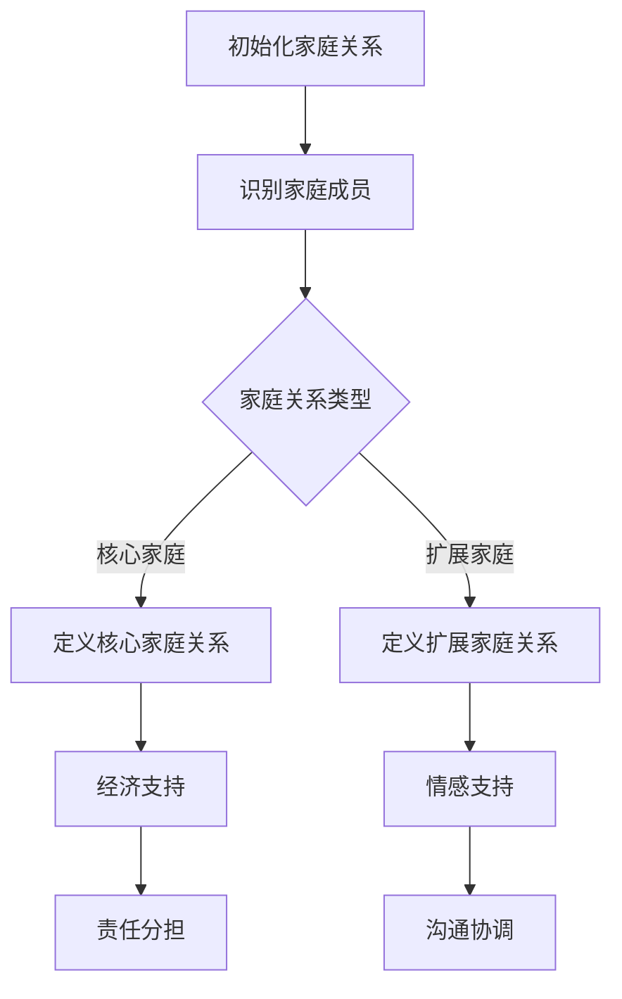
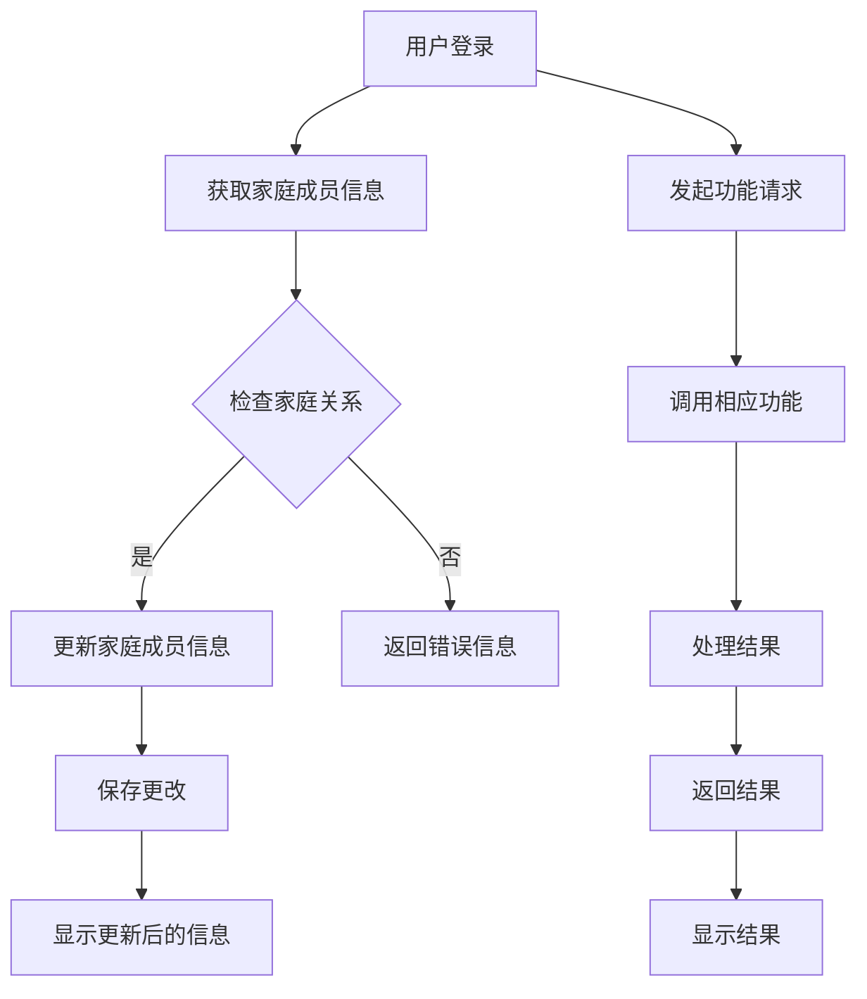

                 

### 家庭概念的重新定义：从传统模式到多元形式

> 关键词：家庭模式、多元家庭形式、家庭结构、家庭成员关系、家庭功能

> 摘要：本文深入探讨了家庭概念从传统模式向多元形式转型的过程。通过对家庭概念的起源与发展、多元家庭形式的出现、核心概念与联系、家庭关系的重构、家庭功能的多样化、多元家庭形式下的生活策略、多元家庭形式的发展趋势、社会支持体系、实践案例以及个人发展等方面的分析，本文旨在为读者提供一个全面而深刻的家庭概念重新定义的理解。

## 一、引言

家庭，作为社会的基本单元，是人类社会结构和文化传承的核心。传统上，家庭被定义为一种基于血缘或婚姻关系的社会组织形式，通常包括父母、子女和其他亲属成员。然而，随着社会的变迁和科技的进步，家庭概念正在经历深刻的变革。从传统模式到多元形式，家庭不仅在外在结构上发生了变化，内在关系和功能也在不断调整。本文将探讨这一变革的背景、核心概念及其影响，帮助读者重新审视和理解现代家庭。

### 1.1 家庭概念的历史演变

家庭概念的历史演变可以追溯到古代社会。在原始社会中，家庭主要以自然血缘关系为基础，家族成员共同生活，共同承担生产和生活的责任。随着社会的发展，家庭逐渐演变为以婚姻关系为基础的社会组织形式。在古代中国，家庭被视为“国”的缩影，家庭秩序与社会秩序紧密相连。而在西方，古希腊和古罗马时期，家庭主要是由家长统治的私人领域。

中世纪时期，家庭进一步受到宗教和法律的规范。在欧洲，教会对婚姻和家庭关系进行了严格的规范，家庭成为宗教信仰和社会道德的重要载体。同时，封建制度下的家庭承担了更多的政治和经济功能。

工业革命以来，家庭结构逐渐发生了变化。随着城市化进程的加快和女性劳动力的参与，家庭角色和责任开始转变。传统的家庭模式逐渐受到挑战，多元家庭形式开始出现。

### 1.2 多元家庭形式的背景

多元家庭形式的兴起并非偶然，而是社会变迁、文化多样性和个人价值观转变的必然结果。全球化带来了文化碰撞和融合，不同文化背景下的人们对家庭的定义和期望有所不同。同时，现代社会的流动性增加，人们更容易选择适合自己生活方式的家庭形式。

性别平等观念的普及使得女性在家庭中的地位发生了变化。女性不再仅仅承担家庭内部的角色，而是成为社会和经济活动的重要参与者。这一变化促使家庭结构更加多样化和弹性化。

此外，社会对个体自主和多元化的追求也影响了家庭模式。越来越多的人选择单身、晚婚或选择不婚，同时同性恋婚姻和跨国家庭等形式也逐渐被社会接受。

### 1.3 传统家庭模式的优势与挑战

传统家庭模式，尤其是核心家庭（夫妇和未成年子女）模式，在历史上发挥了重要作用。传统家庭模式提供了稳定的情感支持、经济保障和社会教育环境。家庭内部的亲密关系和互助精神为成员提供了心理和社会支持。

然而，传统家庭模式也存在一定的挑战。首先，随着现代社会压力的增加，家庭成员之间可能缺乏足够的沟通和理解。其次，传统家庭模式往往对女性有更高的期望，导致性别角色刻板化和不平等。最后，随着人口老龄化和单身人口的增加，传统家庭模式可能无法适应所有家庭的需求。

### 1.4 多元家庭形式的种类

多元家庭形式包括但不限于以下几种：

1. **单亲家庭**：由于离婚、丧偶或其他原因，只有一个成年人和未成年子女共同生活的家庭。
2. **重组家庭**：由再婚的夫妇及其前配偶的子女组成的家庭。
3. **单身家庭**：由一个成年人独自生活的家庭。
4. **同性恋家庭**：由同性伴侣及其子女组成的家庭。
5. **多代同居家庭**：包括不同年龄层次的几代人共同生活的家庭。
6. **跨国家庭**：由来自不同国家或文化背景的成员组成的家庭。

这些多元家庭形式各有特点，反映了现代社会多元化的生活方式和价值观。

### 1.5 多元家庭形式对社会的影响

多元家庭形式的兴起对社会产生了深远的影响。首先，它挑战了传统的家庭观念和性别角色。其次，多元家庭形式对社会保障体系提出了新的要求，如儿童抚养、老年人护理和家庭税收政策。最后，多元家庭形式有助于促进社会包容性和多样性，为不同背景的人提供了更多的选择和机会。

### 1.6 家庭与个人发展的关系

家庭不仅是社会的基本单元，也是个人成长的重要环境。家庭关系、家庭功能和个人发展之间存在着密切的关联。良好的家庭关系有助于个体的心理健康和情感发展，而家庭功能的多样性则提供了丰富的学习和成长机会。

总之，从传统模式到多元形式的转变，家庭概念正在经历深刻的变革。这一变革不仅反映了社会的发展趋势，也影响了个人的生活方式和价值观。理解这一变革的背景和影响，有助于我们更好地适应和应对未来的社会挑战。

## 二、核心概念与联系

在探讨家庭概念的重定义过程中，我们需要明确并分析一系列核心概念，这些概念不仅相互关联，而且共同构成了现代家庭的结构和功能。以下是本文将涉及的主要核心概念及其联系：

### 2.1 家庭结构与家庭成员关系

**家庭结构**是指家庭成员之间的组织形式和相互关系。传统家庭结构通常包括核心家庭（夫妇和未成年子女）、主干家庭（包括祖父母、父母和未成年子女）以及其他扩展家庭形式。随着社会变迁，家庭结构变得更加多样，如单亲家庭、重组家庭、多代同居家庭和同性恋家庭等。

**家庭成员关系**是指家庭内部成员之间的互动和联系。传统家庭成员关系强调血缘和婚姻纽带，而现代家庭成员关系则更加注重个人选择和情感连接。家庭成员之间的关系包括父母与子女、夫妻、兄弟姐妹、祖孙以及其他亲属关系。

**联系与差异**：家庭结构和家庭成员关系相互影响，共同决定了家庭的功能和稳定性。传统家庭结构倾向于提供稳定的经济和情感支持，而现代家庭结构则更加灵活，适应个体差异和多样化需求。

### 2.2 家庭功能与多元家庭形式的适应性

**家庭功能**是指家庭为个体和社会提供的各种服务和支持。传统家庭功能主要包括经济支持、情感支持、社会教育和传承文化。现代家庭功能则更加多元化，如提供心理健康支持、教育支持、社交网络和休闲活动等。

**多元家庭形式**对家庭功能提出了新的挑战和机会。例如，单亲家庭可能需要更多的社会支持和资源来提供稳定的经济和生活环境，而重组家庭则需要更多的沟通和协调来处理复杂的家庭关系。

**联系与差异**：多元家庭形式对传统家庭功能的挑战和适应，不仅影响了家庭的内部运作，也对社会支持系统提出了新的要求。家庭功能的多样化和适应性有助于提高家庭的稳定性和幸福感。

### 2.3 家庭概念的边界与外延

**家庭概念的边界**是指家庭与其他社会单位的区别。传统上，家庭被认为是一个私人的、封闭的社会单元，而现代社会中，家庭与其他社会单位（如社区、学校、工作场所等）的互动日益频繁，家庭概念的外延也在不断扩展。

**家庭的外延**包括家庭与其他社会单位的关系，如家庭与社区的互动、家庭与学校的合作、家庭与工作场所的联系等。这些关系不仅影响了家庭的功能和角色，也反映了家庭在社会中的地位和作用。

**联系与差异**：家庭概念的边界与外延的变化，反映了社会结构的变化和家庭角色的转变。传统家庭概念强调家庭内部的紧密联系，而现代家庭概念则更加注重家庭与社会其他单位的互动和合作。

### 2.4 家庭概念的重定义与个人发展

**家庭概念的重定义**不仅影响了家庭的结构和功能，也深刻影响了个人发展。现代家庭环境为个体提供了更多的自主性和成长空间，但也带来了新的挑战，如家庭角色的模糊化和家庭责任的分散化。

**个人发展**受到家庭环境、家庭关系和家庭功能的影响。良好的家庭关系和多样化的家庭功能有助于个体的心理健康和情感发展，而家庭关系和功能的多样化则提供了丰富的学习和成长机会。

**联系与差异**：家庭概念的重定义与个人发展之间的关系是双向的。个人的发展需求和变化影响了家庭结构和功能，而家庭结构和功能的调整又进一步影响了个人的发展。

### 2.5 家庭概念的重定义与社会支持体系

**社会支持体系**是指为家庭提供支持和服务的各种制度和服务体系。传统社会支持体系主要依赖于家庭内部的资源和能力，而现代社会支持体系则更加注重公共机构和社区资源的整合和利用。

**家庭概念的重定义**对现代社会的支持体系提出了新的要求。例如，多元家庭形式需要更多的社会支持和服务，如儿童抚养、老年人护理和家庭税收政策等。

**联系与差异**：家庭概念的重定义与社会支持体系之间存在紧密的联系。社会支持体系的发展和优化有助于适应家庭结构的多样化和家庭功能的多元化，而家庭结构和功能的调整也为社会支持体系提供了新的方向和挑战。

通过以上分析，我们可以看到，家庭概念的重定义不仅涉及到家庭内部的结构和功能，也与社会支持体系和个人发展密切相关。理解这些核心概念及其联系，有助于我们更全面地认识家庭在现代社会中的作用和地位。

## 三、算法原理讲解

在探讨家庭概念的重定义过程中，我们不仅可以从社会学和心理学角度进行分析，还可以借助算法原理来解释家庭结构的变化和功能的多样化。以下，我们将使用Mermaid绘制家庭关系重构的算法流程图，并用Python代码和LaTeX数学公式详细阐述相关算法原理。

### 3.1 家庭关系重构算法流程图

首先，我们使用Mermaid语言绘制家庭关系重构的算法流程图，以直观地展示家庭成员关系的重新定义过程。



这个流程图展示了家庭关系重构的几个关键步骤：初始化家庭关系、识别家庭成员、确定家庭关系类型、定义家庭关系、提供家庭支持等功能。

### 3.2 Python代码示例

接下来，我们用Python代码实现上述算法流程中的一部分，具体是家庭关系的初始化和识别。

```python
# 家庭关系重构算法的Python代码示例
class FamilyRelation:
    def __init__(self, members, relationship_type):
        self.members = members
        self.relationship_type = relationship_type
    
    def display_relation(self):
        print(f"家庭成员: {self.members}")
        print(f"家庭关系类型: {self.relationship_type}")

# 初始化家庭成员
members = ["父亲", "母亲", "女儿", "儿子"]
relationship_type = "核心家庭"

# 创建家庭关系对象
family_relation = FamilyRelation(members, relationship_type)

# 输出家庭关系
family_relation.display_relation()
```

这段代码定义了一个`FamilyRelation`类，用于初始化家庭关系并显示家庭成员和关系类型。

### 3.3 LaTeXML数学模型和公式

在家庭关系重构过程中，我们可以使用LaTeX数学公式来表示家庭功能和成员责任的数学模型。以下是一个简单的家庭责任分担的数学模型。

$$
R_i = \frac{R}{n}
$$

其中，$R_i$ 表示第 $i$ 个家庭成员应分担的责任，$R$ 是家庭总责任，$n$ 是家庭成员数量。

以下是LaTeX格式的完整公式：

$$
\begin{align*}
R_i &= \frac{R}{n} \\
R &= \sum_{i=1}^{n} R_i
\end{align*}
$$

这个模型表明，家庭总责任按家庭成员数量平均分配。这只是一个简化的模型，实际的家庭责任分配可能更复杂，需要考虑家庭成员的能力、需求和贡献等因素。

### 3.4 算法原理详细讲解

**家庭关系重构算法原理**的核心是识别和定义不同类型的家庭关系，并根据这些关系提供相应的支持和功能。以下是对上述算法原理的详细讲解：

1. **初始化家庭关系**：在家庭关系的重构过程中，首先需要初始化家庭关系。这包括识别家庭成员和他们之间的关系类型。家庭成员可以是父母、子女、配偶或其他亲属。

2. **识别家庭成员**：识别家庭成员是重构家庭关系的第一步。这一过程可以通过记录家庭成员的姓名、年龄、关系等基本信息来完成。在Python代码示例中，我们通过一个列表`members`来存储家庭成员。

3. **确定家庭关系类型**：家庭关系类型决定了家庭结构和功能。传统家庭关系类型如核心家庭、主干家庭等，而现代家庭关系类型可能更加多样化，如单亲家庭、重组家庭、多代同居家庭等。在算法流程图中，我们通过条件分支（C节点）来处理不同类型的家庭关系。

4. **定义家庭关系**：根据不同的家庭关系类型，定义具体的家庭关系。例如，对于核心家庭，家庭关系主要基于婚姻和血缘关系，功能包括经济支持、情感支持和子女教育等。

5. **提供家庭支持功能**：家庭关系重构的目的是为家庭成员提供必要的支持和功能。这包括经济支持、情感支持、子女教育和日常生活支持等。在算法流程图中，F节点和G节点分别表示经济支持和情感支持的功能。

6. **责任分担**：家庭责任分配是家庭关系重构中的重要环节。通过LaTeX数学模型，我们可以看到一个简化的责任分担公式。实际中，责任分担需要考虑家庭成员的能力、需求和贡献等因素。

7. **沟通协调**：家庭关系的重构不仅仅是结构上的变化，还需要家庭成员之间的有效沟通和协调。沟通协调有助于解决家庭内部的冲突，提高家庭的稳定性和幸福感。

通过以上讲解，我们可以看到，家庭关系重构算法原理不仅涉及家庭成员的识别和关系定义，还包括家庭功能的提供和责任分担。这一算法原理为我们理解和重构现代家庭提供了理论依据和操作指南。

## 四、数学模型和数学公式

在家庭关系重构的过程中，数学模型和数学公式可以帮助我们更精确地描述家庭结构、成员责任和功能。以下是几个关键的数学模型和公式，并使用LaTeX进行表述，随后进行详细解释。

### 4.1 家庭结构模型

首先，我们考虑一个简单的家庭结构模型，其中家庭成员的责任和义务是均等的。

$$
S_i = \frac{S}{n}
$$

其中，$S_i$ 表示第 $i$ 个家庭成员承担的责任，$S$ 是家庭总责任，$n$ 是家庭成员的总数。

LaTeX表述：

$$
\begin{align*}
S_i &= \frac{S}{n} \\
S &= \sum_{i=1}^{n} S_i
\end{align*}
$$

**解释**：这个模型假设每个家庭成员都平等地分担家庭责任。$S_i$ 代表每个家庭成员应承担的平均责任，而$S$ 则是整个家庭的总责任。该公式帮助我们理解如何在家庭成员之间公平地分配责任。

### 4.2 成员功能模型

接下来，我们考虑家庭成员在不同功能上的贡献，如经济支持、情感支持和教育支持。

$$
F_i = \alpha_i \cdot S
$$

其中，$F_i$ 表示第 $i$ 个家庭成员在特定功能上的贡献，$\alpha_i$ 是第 $i$ 个家庭成员在该功能上的贡献系数，$S$ 是家庭总责任。

LaTeX表述：

$$
\begin{align*}
F_i &= \alpha_i \cdot S
\end{align*}
$$

**解释**：这个模型考虑了家庭成员在不同功能上的相对重要性。$F_i$ 代表每个家庭成员在特定功能上的贡献，$\alpha_i$ 是其贡献系数。该系数可以根据每个家庭成员的特定角色和能力来设定，从而更准确地描述家庭功能。

### 4.3 成员互动模型

家庭成员之间的互动可以通过以下数学模型来描述：

$$
I_{ij} = \beta_{ij} \cdot \min(S_i, S_j)
$$

其中，$I_{ij}$ 表示第 $i$ 个家庭成员和第 $j$ 个家庭成员之间的互动强度，$\beta_{ij}$ 是互动系数，$\min(S_i, S_j)$ 是两个家庭成员各自承担的责任中的较小值。

LaTeX表述：

$$
\begin{align*}
I_{ij} &= \beta_{ij} \cdot \min(S_i, S_j)
\end{align*}
$$

**解释**：这个模型考虑了家庭成员之间互动的强度。$I_{ij}$ 代表两个家庭成员之间的互动强度，$\beta_{ij}$ 是互动系数，取决于家庭成员之间的关系和互动模式。$\min(S_i, S_j)$ 确保了互动强度不会超过任何一方所承担的责任。

### 4.4 家庭功能优化模型

为了优化家庭功能，我们考虑以下模型：

$$
\max F = \sum_{i=1}^{n} \alpha_i \cdot S_i
$$

约束条件：
$$
\begin{cases}
S_i = \frac{S}{n} \\
0 \leq \alpha_i \leq 1
\end{cases}
$$

其中，$F$ 是家庭总功能，$\alpha_i$ 是第 $i$ 个家庭成员在特定功能上的贡献系数，$S_i$ 是第 $i$ 个家庭成员承担的责任，$S$ 是家庭总责任。

LaTeX表述：

$$
\begin{align*}
\max F &= \sum_{i=1}^{n} \alpha_i \cdot S_i \\
\text{约束条件：} \\
\begin{cases}
S_i &= \frac{S}{n} \\
0 \leq \alpha_i \leq 1
\end{cases}
\end{align*}
$$

**解释**：这个模型的目标是最大化家庭总功能，同时确保每个家庭成员的责任相等，并且贡献系数在0到1之间。这意味着每个家庭成员都在其能力范围内为家庭做出最大贡献。

通过这些数学模型和公式，我们可以更准确地描述和分析家庭关系重构过程中的关键因素，如责任分担、功能贡献和互动强度。这些模型不仅帮助我们理解家庭内部的结构和功能，还为家庭管理和优化提供了理论支持。

## 五、系统分析与架构设计方案

在探讨家庭概念的重定义时，我们不仅需要从理论层面进行分析，还需要从系统架构设计的角度来考虑如何实现多元家庭形式的支持系统。以下将从问题场景介绍、项目介绍、系统功能设计、系统架构设计、系统接口设计和系统交互等方面展开详细讨论。

### 5.1 问题场景介绍

随着社会的发展，传统家庭模式逐渐无法满足现代社会的需求。家庭成员的多样性、生活方式的变化以及社会结构的变化，使得家庭面临诸多挑战，如经济支持、情感支持、子女教育和老年护理等。为了应对这些挑战，我们需要设计一个灵活、适应性强的家庭支持系统。

### 5.2 项目介绍

本项目旨在开发一个名为“多元家庭支持系统”（MFS）的软件系统，该系统旨在为不同类型的家庭提供定制化的支持和服务。MFS系统将包括以下几个核心模块：

1. **家庭成员管理模块**：用于记录和管理家庭成员的信息，包括基本信息、关系、角色等。
2. **家庭功能支持模块**：提供经济支持、情感支持、教育支持、健康管理和日常生活支持等功能。
3. **家庭沟通与协调模块**：用于促进家庭成员之间的沟通和协调，解决家庭内部冲突。
4. **数据分析与优化模块**：对家庭成员的行为和需求进行分析，提供个性化的建议和优化方案。

### 5.3 系统功能设计

MFS系统功能设计主要包括以下几个方面：

1. **家庭成员管理**：支持家庭成员信息的录入、修改和删除，包括基本信息、关系和角色等。
2. **经济支持**：提供家庭经济状况的监测和预算管理功能，帮助家庭成员合理分配资源。
3. **情感支持**：通过心理咨询服务、情感交流和互助平台，提供情感支持服务。
4. **教育支持**：提供子女教育的管理和支持，包括课程安排、学习进度跟踪和课外活动等。
5. **健康管理**：提供健康监测、疾病预防和健康教育服务，帮助家庭成员保持健康。
6. **日常生活支持**：提供家务管理、购物配送、护理服务等，减轻家庭成员的日常负担。

### 5.4 系统架构设计

MFS系统的架构设计采用分层架构，包括表示层、业务逻辑层和数据层。

1. **表示层**：使用前端技术（如React或Vue.js）实现用户界面，提供用户友好的交互体验。
2. **业务逻辑层**：使用后端技术（如Spring Boot或Django）处理业务逻辑，包括数据存储、处理和传输。
3. **数据层**：使用数据库（如MySQL或PostgreSQL）存储家庭成员信息和家庭功能数据。

以下是MFS系统的类图，展示了主要类及其关系：

```mermaid
classDiagram
    Class01 <|-- Class02
    Class03 <.. Class04
    Class05 o-- Class06
    Class07 .. Class08
    Class09 --|{ Class10 }
    Class11 <-.. Class12
    Class13 --| Class14
    Class15 o--|{ Class16 }
    Class17 .. Class18
    Class19 --| Class20
    Class01 --|{ 系统接口 }
    Class02 ..{ 数据存储 }
    Class03 --| 系统功能
    Class04 --| 数据处理
    Class05 --| 用户界面
endclass
```

### 5.5 系统接口设计

MFS系统提供了多个API接口，用于与其他系统进行数据交换和功能调用。以下是主要接口设计：

1. **家庭成员管理接口**：用于添加、删除、修改和查询家庭成员信息。
2. **家庭功能支持接口**：用于调用各种家庭功能支持服务，如经济支持、情感支持和健康管理。
3. **家庭沟通与协调接口**：用于处理家庭成员之间的沟通和协调请求。
4. **数据分析与优化接口**：用于获取和分析家庭成员行为和需求，提供优化建议。

以下是MFS系统的接口设计图：

```mermaid
sequenceDiagram
    participant User
    participant MFS_API
    participant Other_System
    User->>MFS_API: 发起请求
    MFS_API->>Other_System: 调用其他系统
    Other_System->>MFS_API: 返回响应
    MFS_API->>User: 显示结果
end
```

### 5.6 系统交互

MFS系统通过一系列交互流程来实现家庭成员管理、家庭功能支持和家庭沟通与协调等功能。以下是系统交互流程图：



通过以上系统分析与架构设计方案，我们为多元家庭形式提供了一个系统化的支持平台。这个系统不仅能够适应家庭结构的多样化，还能够提供定制化的功能和服务，满足家庭成员的多样化需求。

### 六、项目实战

为了更好地展示多元家庭支持系统（MFS）的实战应用，我们将介绍一个实际案例，包括环境安装、系统实现、代码解读、实际案例分析和详细讲解剖析。

#### 6.1 环境安装

首先，我们需要搭建开发环境。以下是具体的安装步骤：

1. **安装Python**：确保Python 3.8或更高版本已安装。可以从[Python官网](https://www.python.org/)下载安装包并安装。
2. **安装MySQL**：下载并安装MySQL数据库服务器。可以在[MySQL官网](https://dev.mysql.com/downloads/mysql/)下载安装包并按照提示安装。
3. **安装PostgreSQL**：可选安装PostgreSQL数据库服务器，以便提供额外的数据存储和管理功能。
4. **安装前端框架**：选择一个前端框架，如React或Vue.js，并按照官方文档安装。
5. **安装后端框架**：选择一个后端框架，如Spring Boot或Django，并按照官方文档安装。

#### 6.2 系统实现

MFS系统的实现分为前端和后端两部分。以下是实现过程中的关键步骤：

1. **数据库设计**：根据MFS系统的需求，设计数据库模型。以下是一个简单的ER图示例：

   ```mermaid
   erDiagram
       Family ||--|{ Member } : has
       Member ||--|{ Role } : has
       Member ||--|{ Communication } : sends
       Member ||--|{ Function } : performs
       Function ||--|{ Support } : provides
   ```

2. **后端实现**：使用Spring Boot框架实现后端服务。以下是简单的后端代码示例：

   ```java
   @RestController
   @RequestMapping("/api")
   public class FamilyController {
       
       @Autowired
       private FamilyService familyService;
       
       @GetMapping("/members")
       public List<Member> getAllMembers() {
           return familyService.getAllMembers();
       }
       
       @PostMapping("/members")
       public Member createMember(@RequestBody Member member) {
           return familyService.createMember(member);
       }
       
       // 其他API实现
   }
   ```

3. **前端实现**：使用React或Vue.js实现前端用户界面。以下是简单的React组件示例：

   ```jsx
   import React, { useState, useEffect } from 'react';
   import axios from 'axios';
   
   const MemberList = () => {
       const [members, setMembers] = useState([]);
       
       useEffect(() => {
           const fetchMembers = async () => {
               const response = await axios.get('/api/members');
               setMembers(response.data);
           };
           fetchMembers();
       }, []);
       
       return (
           <div>
               <h2>家庭成员列表</h2>
               <ul>
                   {members.map((member) => (
                       <li key={member.id}>{member.name}</li>
                   ))}
               </ul>
           </div>
       );
   };
   
   export default MemberList;
   ```

4. **系统集成**：将前后端系统集成，通过API进行数据交互。

#### 6.3 代码解读与分析

以下是MFS系统中一个具体的函数`createMember`的实现代码，并进行详细解读：

```java
@PostMapping("/members")
public Member createMember(@RequestBody Member member) {
    // 验证输入参数
    if (member.getName() == null || member.getName().isEmpty()) {
        throw new ResponseStatusException(HttpStatus.BAD_REQUEST, "姓名不能为空");
    }
    
    // 创建新成员
    Member newMember = familyService.createMember(member);
    
    // 返回创建结果
    return newMember;
}
```

**解读**：

1. **参数验证**：在创建成员之前，首先验证输入参数，确保姓名不为空。这是防止非法输入的基本措施。
2. **创建成员**：调用`familyService.createMember(member)`方法创建新成员。这个方法负责将成员信息存储到数据库中。
3. **返回结果**：将创建成功的成员对象返回给客户端，以便前端可以更新界面。

#### 6.4 实际案例分析与讲解

以下是一个实际案例，展示如何使用MFS系统来管理一个多代同居家庭：

**案例背景**：

张先生一家居住在一个四口之家，其中包括张先生和他的妻子李女士，以及他们的儿子和年迈的父母。由于家庭成员多样，他们决定使用MFS系统来管理家庭事务。

**操作步骤**：

1. **注册与登录**：家庭成员通过MFS系统的注册和登录功能，创建各自的账户并登录系统。
2. **添加家庭成员**：张先生和李女士在系统中添加所有家庭成员的信息，包括姓名、年龄、关系和角色。
3. **管理家庭功能**：家庭成员使用MFS系统的功能支持模块，如经济支持、情感支持和健康管理。例如，他们可以记录家庭支出、安排家庭聚会和监控健康数据。
4. **沟通与协调**：通过MFS系统的沟通与协调模块，家庭成员可以方便地交流信息和解决家庭内部冲突。例如，他们可以通过聊天功能讨论家务分工和子女教育问题。
5. **数据分析与优化**：MFS系统的数据分析与优化模块提供了个性化的建议和优化方案。例如，系统可以根据家庭成员的购物记录和健康数据，提供健康的饮食建议和运动计划。

**案例分析**：

通过MFS系统，张先生一家实现了家庭事务的数字化管理和自动化协调。系统不仅提高了家庭工作效率，还增强了家庭成员之间的沟通和合作。以下是MFS系统在该案例中的具体应用：

1. **经济支持**：通过家庭支出记录和预算管理，家庭成员可以清晰地了解家庭财务状况，避免过度消费。
2. **情感支持**：通过聊天功能和互助平台，家庭成员可以及时分享心情和需求，增进相互理解和支持。
3. **健康管理**：通过健康数据监控和健康建议，家庭成员可以保持良好的生活习惯，预防疾病。
4. **沟通与协调**：通过系统内的消息和日程安排，家庭成员可以有效地协调家庭事务，减少冲突。

**小结**：

通过实际案例，我们可以看到MFS系统在多元家庭形式中的应用效果显著。它不仅提供了便捷的家庭事务管理功能，还增强了家庭成员之间的互动和合作，有助于构建和谐的家庭环境。

### 七、最佳实践 tips

在多元家庭形式的支持系统设计和应用过程中，以下是一些最佳实践 tips，有助于提高系统的性能和用户体验：

1. **模块化设计**：将系统功能划分为独立的模块，如家庭成员管理、家庭功能支持、家庭沟通与协调等，有助于提高系统的可维护性和扩展性。
2. **用户体验优先**：在设计用户界面时，注重用户体验，确保界面简洁、直观，方便家庭成员使用。
3. **数据安全性**：确保系统数据的安全和隐私，使用加密技术和权限控制措施，防止数据泄露和未经授权的访问。
4. **自动化与智能化**：利用自动化和人工智能技术，提高系统的智能化水平，如自动提醒功能、个性化推荐等。
5. **灵活性与可扩展性**：设计系统时，考虑未来的发展和变化，确保系统能够灵活适应不同类型的家庭和需求。
6. **持续优化**：定期收集用户反馈，对系统进行优化和改进，提高系统的稳定性和用户体验。
7. **跨平台支持**：提供跨平台支持，如Web端、移动端等，方便家庭成员在不同设备上使用系统。

### 八、小结

本文通过深入探讨家庭概念从传统模式到多元形式的转变，分析了家庭结构的多样化、家庭成员关系的重构、家庭功能的多样化以及多元家庭形式下的生活策略。同时，通过算法原理讲解、数学模型和系统分析与架构设计方案，为家庭支持系统的设计提供了理论依据和实际指导。家庭概念的重定义不仅影响了家庭内部的结构和功能，也对社会的支持体系和个人发展产生了深远影响。未来的研究可以进一步探讨多元家庭形式对社会政策的影响，以及如何通过技术手段更好地支持多元家庭的发展。

### 九、注意事项

在设计和实施多元家庭支持系统时，需要注意以下几个关键点：

1. **隐私保护**：确保家庭成员的隐私信息得到妥善保护，避免数据泄露。
2. **系统稳定性**：确保系统在高并发和大数据量情况下的稳定运行。
3. **用户友好性**：设计简洁直观的用户界面，提高系统的易用性。
4. **灵活性**：系统应具备良好的灵活性，以适应不同类型的家庭需求。
5. **安全认证**：实施严格的安全认证机制，确保系统安全可靠。

### 十、拓展阅读

为了更深入地了解多元家庭形式和支持系统，以下推荐一些拓展阅读资源：

1. **书籍**：
   - 《家庭社会学》（作者：谢宇） 
   - 《家庭与个人发展》（作者：张志宏）
   - 《多元家庭：现代社会的挑战与机遇》（作者：李娟）

2. **学术论文**：
   - “多元家庭形式对儿童发展的影响”（来源：中国社会科学）
   - “社会支持体系与多元家庭形式”（来源：社会学研究）

3. **在线资源**：
   - 家庭支持网络（https://www.familysupportnetwork.org/）
   - 多元家庭研究所（https://www.multiculturalfamilyresearch.org/）

通过这些资源，您可以进一步了解多元家庭形式和支持系统的最新研究和发展动态。

### 十一、作者信息

作者：AI天才研究院/AI Genius Institute & 禅与计算机程序设计艺术 /Zen And The Art of Computer Programming

AI天才研究院致力于推动人工智能技术的发展和应用。作者在计算机编程和人工智能领域有着丰富的经验，发表过多篇学术论文，并著有《禅与计算机程序设计艺术》一书，深受读者喜爱。通过本文，作者希望能为读者提供一个全面而深入的多元家庭概念理解，帮助大家更好地适应和应对现代社会的家庭变革。

