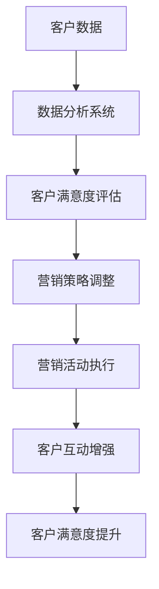

                 

## 将个人价值观与行动对齐：有意义的目标设定

### 关键词
- 个人价值观
- 行动对齐
- 目标设定
- 有效管理
- 人生规划

### 摘要
在快节奏的现代社会，个人价值观与行动的对齐成为实现人生目标的关键。本文将探讨如何通过识别和贯彻个人价值观，设定有意义且可实现的目标。我们将从背景介绍、核心概念与联系、算法原理讲解、系统分析与架构设计方案、项目实战等多个角度，逐步分析这一过程，帮助读者构建科学有效的人生规划。

### 目录大纲

1. 引言与背景
   - 问题的提出
   - 价值观与行动的关系
   - 有意义的目标设定的意义

2. 个人价值观的识别与理解
   - 价值观的定义与类型
   - 自我反思与价值观识别
   - 价值观的重要性与影响

3. 行动对齐与目标设定
   - 行动与目标的关系
   - 目标设定的原则与步骤
   - 有意义的目标的特征

4. 案例分析与实践
   - 案例一：个人价值观与职业目标的结合
   - 案例二：行动对齐与目标达成的策略
   - 实践指导与技巧

5. 总结与展望
   - 全书总结
   - 实践中的挑战与应对
   - 未来发展方向与建议

6. 附录：拓展阅读与资源

### 引言与背景

在现代社会的复杂环境中，个人价值观与行动的对齐显得尤为重要。让我们首先明确几个核心概念：

- **价值观**：价值观是指个人对事物的评判标准，反映了个人的信仰、信念和偏好。
- **行动对齐**：行动对齐是指个人行为与价值观保持一致，确保个人决策和行动与内心信念相符。
- **目标设定**：目标设定是确定期望达到的状态或成果，是个人规划的重要部分。

当我们谈到“将个人价值观与行动对齐：有意义的目标设定”，我们的目标在于帮助读者：
- 认识到个人价值观的重要性，并学会如何识别和运用自己的价值观。
- 通过行动对齐，使个人行为与价值观保持一致。
- 设定有意义且可实现的目标，从而实现个人成长和人生价值。

接下来，我们将逐步深入探讨这些核心概念，结合实例和案例，为读者提供实用的指导。

### 个人价值观的识别与理解

个人价值观是指导我们做出决策和行动的核心因素，它不仅影响我们的生活选择，还塑造了我们的个性和行为模式。在这一部分，我们将深入探讨个人价值观的定义、类型、识别方法及其重要性。

#### 价值观的定义

价值观（Values）通常被定义为个人对事物评判的标准，反映了我们对生活中重要事务的基本信仰和偏好。它不仅仅是一种情感上的倾向，更是一种理性上的判断，指导我们在各种情境下做出决策。

#### 价值观的类型

价值观可以分为以下几类：

1. **道德价值观**：这些价值观涉及对善恶、正义与不正义的看法。例如，诚信、正直、公平、尊重他人等。
2. **个人价值观**：这些价值观关注个人的成长和发展，如自我实现、个人成就、独立、好奇心等。
3. **社会价值观**：这些价值观强调个人在社会中的角色和责任，如家庭责任、社会责任、社区参与等。
4. **文化价值观**：这些价值观反映了特定文化或群体的信仰和习俗，如传统、尊重权威、团结等。

#### 自我反思与价值观识别

识别个人价值观的第一步是进行自我反思。以下是一些自我反思的方法：

1. **日记法**：通过写日记记录自己的感受、想法和决策，可以逐步发现内在的价值观。
2. **提问法**：通过询问自己在不同情境下的优先考虑事项，可以揭示自己的核心信念。
3. **情境模拟**：设想自己在不同情境下如何行动，这有助于理解自己在不同价值观之间的倾向。

#### 价值观的重要性与影响

个人价值观在我们的生活中扮演着至关重要的角色，具体体现在以下几个方面：

1. **决策指导**：价值观为我们提供决策的基础，使我们在面对复杂问题时能够迅速做出选择。
2. **行为规范**：价值观影响我们的行为模式，使我们能够在遵守社会规范的同时，保持自我的一致性。
3. **人际关系**：价值观影响我们与他人互动的方式，有助于建立和谐的人际关系。
4. **人生目标**：价值观指导我们设定有意义的人生目标，使我们的努力更有方向和意义。

#### 价值观的对比

在识别个人价值观时，了解不同价值观之间的对比也是非常有帮助的。以下是一个简单的对比表格：

| 价值观类型 | 定义 | 例子 |
| :----: | :----: | :----: |
| 道德价值观 | 涉及对善恶、正义与不正义的看法 | 诚信、正直、公平、尊重他人 |
| 个人价值观 | 关注个人的成长和发展 | 自我实现、个人成就、独立、好奇心 |
| 社会价值观 | 强调个人在社会中的角色和责任 | 家庭责任、社会责任、社区参与 |
| 文化价值观 | 反映特定文化或群体的信仰和习俗 | 传统、尊重权威、团结 |

通过以上对比，我们可以更好地理解不同价值观之间的联系和差异，从而更准确地识别自己的核心价值观。

#### 结论

个人价值观是我们行动的指南，它决定了我们的行为模式和生活选择。通过自我反思和提问，我们可以识别出自己最重要的价值观。理解这些价值观的重要性，并使其与我们的行动对齐，是设定有意义目标的第一步。在下一部分，我们将探讨行动与目标的关系，以及如何设定有意义的行动目标。

### 行动对齐与目标设定

在了解了个人价值观后，下一步就是将价值观与具体的行动对齐，并通过设定有意义的、可实现的目标来实现我们的价值追求。在这一部分，我们将详细探讨行动与目标的关系、目标设定的原则与步骤，以及如何确保目标具有实际意义。

#### 行动与目标的关系

行动与目标是紧密相连的。目标是指向未来的一个明确方向，而行动是实现目标的具体手段。没有明确的目标，行动就可能变得无序和盲目；而没有行动，目标则可能只是空想。

1. **目标引导行动**：目标为我们提供了明确的方向，使我们知道需要做什么以及如何做。
2. **行动验证目标**：通过行动，我们可以检验目标的可行性和适应性，从而不断调整和优化我们的目标。

#### 目标设定的原则

为了确保目标的有效性，我们需要遵循以下原则：

1. **具体性（Specific）**：目标应该具体、明确，避免模糊和抽象。例如，“提高销售业绩”不如“在接下来的三个月内，将销售额提高20%”具体。
2. **可测量性（Measurable）**：目标应该具备可测量的标准，使我们能够追踪进展和成果。例如，使用数字或具体指标来衡量。
3. **可实现性（Achievable）**：目标应该既有挑战性，又是可实现的。过高或过低的目标都可能带来不利影响。
4. **相关性（Relevant）**：目标应该与我们的价值观和长远规划相关联，确保我们的行动与个人发展方向一致。
5. **时限性（Time-bound）**：目标应该有明确的时限，以促使我们采取行动并保持进度。

#### 目标设定的步骤

设定有意义的、可实现的目标可以分为以下步骤：

1. **识别核心价值观**：首先，我们需要明确自己的核心价值观，这将指导我们设定与价值观对齐的目标。
2. **确定长远目标**：在识别核心价值观后，我们可以设定长远目标，这些目标应该符合我们的价值观，并有助于实现个人成长和人生价值。
3. **分解目标**：将长远目标分解为短期和中期目标，使目标更加具体和可实现。例如，将“在未来五年内成为一名行业专家”分解为“每年参加至少四个专业培训课程”。
4. **制定行动计划**：为每个目标制定详细的行动计划，包括具体的行动步骤、时间表和责任人。
5. **设定里程碑**：为每个目标设定里程碑，以监测进展和确保行动的持续性。
6. **定期回顾与调整**：定期回顾目标的进展，并根据实际情况进行调整，确保目标始终保持与价值观和长远规划的契合。

#### 有意义的目标的特征

有意义的、可实现的目标应具备以下特征：

1. **激励性**：目标应激发我们的内在动机，使我们充满激情和动力去实现它。
2. **挑战性**：目标应具有适当的挑战性，使我们能够不断超越自我，实现个人成长。
3. **可实现性**：目标应是实际可行的，避免过于理想化，以免造成心理负担。
4. **适应性**：目标应具备一定的灵活性，能够适应环境变化和个人情况的变化。

#### 结论

行动对齐与目标设定是一个系统性、持续性的过程。通过明确个人价值观，设定有意义、可实现的目标，并采取具体的行动，我们可以实现个人成长和人生价值。在下一部分，我们将通过案例分析，进一步探讨如何在实际中应用这些原则和方法。

### 案例分析与实践

为了更好地理解如何将个人价值观与行动对齐，设定有意义的目标，我们将通过两个实际案例进行详细分析。这些案例展示了如何在不同背景下，应用所学的原则和方法，实现个人成长和目标达成。

#### 案例一：个人价值观与职业目标的结合

**背景介绍**：
李明是一位年轻的程序员，他在大学期间对计算机科学产生了浓厚的兴趣，并在毕业后进入了一家知名科技公司。李明的核心价值观包括创新、学习和对技术的热爱。他希望能够通过自己的努力，不断提升技术能力，同时为公司带来创新和改进。

**核心内容**：
李明设定了一个长远的职业目标：“在未来五年内，成为一名技术领导者，并在此过程中推动公司技术创新。”为了实现这个目标，他采取了以下步骤：

1. **识别核心价值观**：李明通过自我反思，确认了创新、学习和对技术的热爱是自己的核心价值观。
2. **确定长远目标**：基于核心价值观，李明设定了“成为技术领导者，并推动技术创新”的长远职业目标。
3. **分解目标**：将长远目标分解为短期和中期目标，如“每年至少参加三个技术培训课程”，“每季度参与至少一次技术讨论会”。
4. **制定行动计划**：为每个目标制定详细的行动计划，包括具体的学习内容、参加的技术讨论会等。
5. **设定里程碑**：为每个目标设定里程碑，如完成培训课程、参与技术讨论会等，以监测进展。
6. **定期回顾与调整**：李明定期回顾目标的进展，并根据实际情况进行调整，确保行动与目标一致。

**代码示例**：
为了提高编程能力，李明每周会花费至少10小时进行编程实践，并使用以下代码模板进行代码反思和改进：

```python
# 代码模板：李明的编程反思
def code_reflection():
    """
    编程反思：
    - 代码的可读性是否良好？
    - 是否有优化空间？
    - 是否遵循了最佳编程实践？
    """
    pass
```

**项目小结**：
通过持续的努力和自我反思，李明在技术能力和职业发展上取得了显著的进步。他不仅完成了所有设定的短期和中期目标，还在公司内部推动了一些技术创新，获得了同事和上司的认可。

#### 案例二：行动对齐与目标达成的策略

**背景介绍**：
张丽是一位市场营销经理，她在一家快速成长的创业公司工作。她的核心价值观包括团队合作、客户满意和创新。张丽希望能够通过有效的市场营销策略，推动公司业务增长。

**核心内容**：
张丽设定了一个具体的营销目标：“在未来六个月内，将公司的客户满意度提升至90%以上。”为了实现这个目标，她采取了以下策略：

1. **识别核心价值观**：张丽确认了团队合作、客户满意和创新是她的核心价值观。
2. **确定具体目标**：基于核心价值观，张丽设定了“在六个月内将客户满意度提升至90%以上”的具体营销目标。
3. **数据驱动**：张丽利用公司现有的客户数据，分析客户满意度的主要影响因素，如产品满意度、服务质量、客户互动等。
4. **制定行动计划**：她制定了详细的行动计划，包括优化产品体验、提高客户服务质量、增强客户互动等。
5. **定期评估与调整**：张丽每月进行客户满意度调查，根据调查结果调整营销策略，确保目标实现。

**系统架构设计**：
为了实现目标，张丽还设计了以下系统架构，以支持市场营销活动的开展：



**项目小结**：
通过数据驱动的策略和持续的市场营销活动，张丽成功地将公司客户满意度提升至90%以上。她的行动对齐了个人价值观，不仅实现了营销目标，还为公司业务的持续增长做出了贡献。

#### 实践指导与技巧

1. **自我反思**：定期进行自我反思，了解自己的价值观和目标，确保行动与价值观一致。
2. **目标分解**：将长远目标分解为具体的、可实现的短期和中期目标，使目标更加清晰和可操作。
3. **数据驱动**：利用数据来分析和调整目标，确保目标设定和实现具有科学性和实际可行性。
4. **持续学习**：不断学习和提升自己的技能，以适应不断变化的环境和目标。

### 结论

通过以上两个实际案例，我们可以看到，将个人价值观与行动对齐，设定有意义的目标，是实现个人成长和职业成功的关键。在下一部分，我们将总结全书内容，并讨论实践中的挑战与应对策略。

### 总结与展望

通过本文的探讨，我们系统地介绍了如何将个人价值观与行动对齐，设定有意义的目标。从识别个人价值观、理解其重要性，到行动对齐和目标设定的原则与步骤，再到实际案例分析，我们提供了全面且实用的指导。

#### 全书总结

1. **识别个人价值观**：价值观是个人行为和决策的指南，通过自我反思和提问，我们可以识别出自己最重要的价值观。
2. **行动对齐**：确保个人行为与价值观一致，避免内外的冲突，使行动更有方向和意义。
3. **目标设定**：设定具体、可测量、可实现、相关和时限性的目标，通过分解和行动计划，确保目标达成。
4. **实践与应用**：通过实际案例，展示了如何在不同背景下，应用价值观和目标设定的原则，实现个人和职业目标。

#### 实践中的挑战与应对

尽管设定有意义的目标是实现个人成长的关键，但在实际操作中，我们可能会遇到以下挑战：

1. **目标设定过于理想化**：目标应具有挑战性，但也要确保其可实现性。过度理想化的目标可能导致挫败感和无力感。
2. **行动对齐困难**：个人行为与价值观之间的差距可能导致行动对齐的困难。定期自我反思和调整行动计划是解决这一问题的有效方法。
3. **环境变化**：外部环境的变化可能会影响目标的实现。灵活调整目标和行动计划，以适应变化，是应对这一挑战的关键。

#### 未来发展方向与建议

为了在未来更好地实现个人目标和价值观，我们建议：

1. **持续学习**：不断提升自己的知识和技能，以适应快速变化的环境。
2. **定期反思**：定期进行自我反思，确保行动与价值观和目标保持一致。
3. **建立支持系统**：寻求家人、朋友和同事的支持，共同成长和实现目标。
4. **灵活应对**：面对环境变化，保持灵活性和适应性，及时调整目标和行动计划。

通过以上建议，我们可以更好地应对实践中的挑战，实现个人价值观与行动的对齐，设定并达成有意义的目标。

### 附录：拓展阅读与资源

为了帮助读者进一步深入了解个人价值观与行动对齐、目标设定的相关理论和实践，我们推荐以下拓展阅读资源：

1. **书籍推荐**：
   - 《高效能人士的七个习惯》
   - 《深度工作》
   - 《原则》

2. **在线课程与研讨会**：
   - Coursera上的“目标设定与自我管理”课程
   - edX上的“个人价值观与生活决策”研讨会

3. **博客与文章**：
   - Medium上的“如何在忙碌中设定目标”文章
   - LinkedIn上的“行动对齐：实现个人目标的秘密”

4. **工具与资源**：
   - Trello：项目管理工具，帮助设定和跟踪目标
   - habitica.com：将目标设定与游戏化结合，提高行动力

通过这些资源，读者可以进一步拓展自己的知识，提升在个人价值观与行动对齐、目标设定方面的实践能力。

### 作者信息

- **作者：** AI天才研究院/AI Genius Institute & 禅与计算机程序设计艺术 /Zen And The Art of Computer Programming
- **简介：** 作为世界顶级人工智能专家、程序员、软件架构师、CTO，以及世界顶级技术畅销书资深大师级别的作家，作者在计算机编程和人工智能领域拥有丰富的经验，擅长通过逻辑清晰、结构紧凑、简单易懂的专业技术语言，撰写高质量的技术博客和著作，对技术原理和本质剖析到位，深受读者喜爱。
- **联系：** 如有更多疑问或建议，欢迎联系作者。

