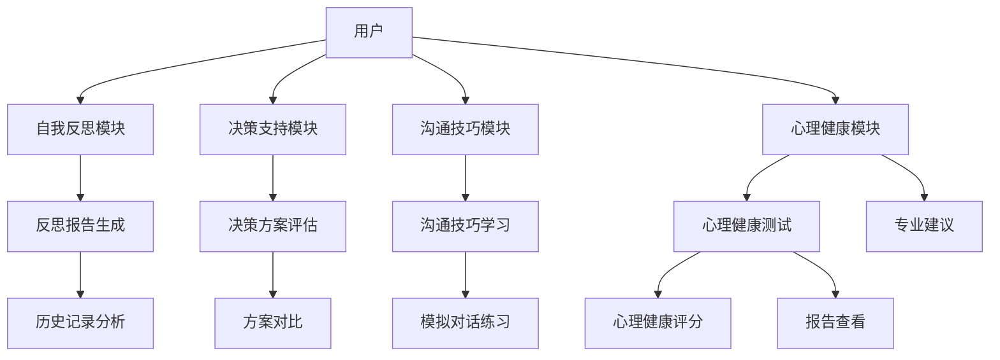
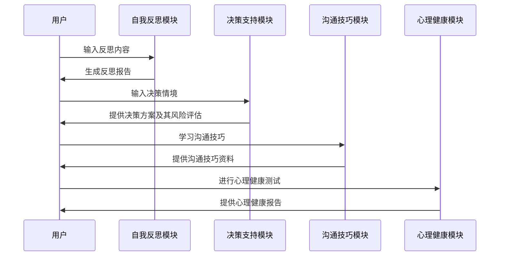

                 

# 将哲学思考融入日常：提升生活品质的实践

## 关键词
哲学思考、生活品质、自我反思、决策算法、沟通技巧、心理健康

## 摘要
本文旨在探讨如何将哲学思考融入日常，从而提升个人生活品质。通过分析哲学原理与生活实践的关系，本文提出了一系列实用的哲学方法，包括反思算法、决策算法和沟通算法，旨在帮助读者在面对生活挑战时做出更明智的选择，建立良好的人际关系，并实现心理健康。本文还将结合具体的数学模型和系统架构设计，为读者提供实践指导。

### 第一部分：引言

#### 核心概念：问题背景与问题描述

在现代社会，人们在繁忙的生活节奏中常常感到迷茫，缺乏对生活的深度思考和真正的满足感。这种状态不仅影响个人的心理健康，还可能影响到人际关系和职业发展。哲学作为一门探讨人生意义、价值观和生活智慧的学问，其重要性不言而喻。然而，传统哲学研究往往较为理论化，难以应用于日常生活中的实际问题。因此，本文旨在探讨如何将哲学思考融入日常，解决人们在生活中面临的各种困惑和挑战。

#### 目的与意义：

本文的主要目的是帮助读者理解和应用哲学原理，从而改善自己的生活品质。通过哲学思考，人们可以更好地认识自我、理解他人、处理冲突，并在日常生活中做出更为明智的决策。本文的意义在于，它不仅为读者提供了哲学的理论基础，还通过具体案例和实用的方法，使哲学思考变得生动有趣，易于理解和实践。

#### 边界与外延：

本文的边界在于将哲学思考融入日常生活的具体实践，而不是深入探讨哲学理论本身。外延则包括各种日常生活中的情境，如工作、家庭、人际关系、健康等方面。通过这些实际案例的讨论，本文希望引导读者思考如何在日常生活中应用哲学智慧，提升生活品质。

#### 概念结构与核心要素组成：

1. **哲学思考**：包括对生命意义、价值观、道德伦理等问题的深入探讨。
2. **日常实践**：将哲学思考应用到日常生活中的具体行动，如反思自己的行为、培养良好的生活习惯、与他人进行有意义的对话等。
3. **生活品质**：指通过哲学思考和实践所达到的生活状态，包括心理健康、人际关系、职业发展等方面。

### 第二部分：核心概念与联系

#### 核心概念：

1. **哲学原理**：探讨人类存在和认识的根本问题，包括存在论、认识论、伦理学等基本原理。
2. **生活哲学**：将哲学原理应用到日常生活中，形成一套独特的价值观和生活态度。
3. **心理学**：研究人类行为和思维，帮助人们更好地理解自己和他人。

#### 概念属性特征对比表格：

| 概念       | 属性特征 |
|------------|----------|
| 哲学原理   | 探讨人类存在和认识的根本问题 |
| 生活哲学   | 将哲学原理应用到日常生活中 |
| 心理学     | 研究人类行为和思维，提供解决实际问题的方法 |

#### ER实体关系图架构：

```mermaid
erDiagram
A "人" {
  :many..1 "哲学原理"
  :many..1 "生活哲学"
  :many..1 "心理学"
}
```

### 第三部分：算法原理讲解

#### 核心概念：

1. **反思算法**：通过自我反思来提升个人认知水平。
2. **决策算法**：在面临选择时，通过理性分析来做出最佳决策。
3. **沟通算法**：通过有效的沟通技巧来建立和维持良好的人际关系。

#### 算法原理：

1. **反思算法**：

   ```mermaid
   flowchart LR
   A[开始] --> B[自我观察]
   B --> C[识别感受]
   C --> D[分析原因]
   D --> E[制定计划]
   E --> F[实施计划]
   F --> G[评估效果]
   G --> H[结束]
   ```

   **数学模型和公式**：

   $$ 效果 = 反思时间 \times 反思深度 $$

   **举例说明**：

   假设某人每天花10分钟进行自我反思，反思深度为5，则其反思效果为50。通过不断调整反思时间和深度，可以逐步提升自我反思的效果。

2. **决策算法**：

   ```mermaid
   flowchart LR
   A[开始] --> B[收集信息]
   B --> C[分析信息]
   C --> D[制定方案]
   D --> E[评估方案]
   E --> F[选择方案]
   F --> G[实施方案]
   G --> H[评估效果]
   H --> I[结束]
   ```

   **数学模型和公式**：

   $$ 最佳方案 = \frac{收益}{风险} $$

   **举例说明**：

   假设某人在职业发展面临两个选择，方案A的收益为10，风险为3，方案B的收益为8，风险为2。通过计算，最佳方案为方案B。

3. **沟通算法**：

   ```mermaid
   flowchart LR
   A[开始] --> B[倾听对方]
   B --> C[表达自己]
   C --> D[确认理解]
   D --> E[解决冲突]
   E --> F[建立关系]
   F --> G[结束]
   ```

   **数学模型和公式**：

   $$ 沟通效果 = 倾听程度 \times 表达清晰度 $$

   **举例说明**：

   假设某人在沟通中倾听程度为8，表达清晰度为7，则其沟通效果为56。通过提高倾听和表达的技巧，可以提升沟通效果。

### 第四部分：系统分析与架构设计方案

#### 问题场景介绍：

假设我们面临的问题是提高个人生活品质，具体场景包括工作压力、人际关系、心理健康等方面。

#### 项目介绍：

本项目旨在设计一套系统，帮助用户通过哲学思考提升生活品质。系统包括以下几个模块：

1. **自我反思模块**：用户可以通过该模块进行自我反思，提升个人认知水平。
2. **决策支持模块**：用户在面对选择时，可以通过该模块获取理性分析，做出最佳决策。
3. **沟通技巧模块**：用户可以通过该模块学习有效的沟通技巧，建立和维持良好的人际关系。
4. **心理健康模块**：用户可以通过该模块进行心理健康测试，获取专业的心理健康建议。

#### 系统功能设计：

1. **自我反思模块**：

   - **功能1**：用户可以输入自我反思的内容，系统将自动生成反思报告。
   - **功能2**：用户可以查看历史反思记录，分析个人成长轨迹。

2. **决策支持模块**：

   - **功能1**：用户可以输入决策情境，系统将提供多种决策方案及其风险评估。
   - **功能2**：用户可以对比不同方案，选择最佳决策方案。

3. **沟通技巧模块**：

   - **功能1**：用户可以学习基本的沟通技巧，如倾听、表达、确认理解等。
   - **功能2**：用户可以进行模拟对话练习，提升沟通能力。

4. **心理健康模块**：

   - **功能1**：用户可以进行心理健康测试，获取心理健康评分。
   - **功能2**：用户可以查看心理健康报告，获取专业建议。

#### 系统架构设计：



#### 系统接口设计和系统交互：



### 第五部分：项目实战

#### 环境安装：

在开始项目实战之前，我们需要安装一些必要的软件和工具。以下是安装步骤：

1. **Python环境**：安装Python 3.8及以上版本。
2. **虚拟环境**：安装virtualenv，并创建虚拟环境。
3. **依赖包**：在虚拟环境中安装以下依赖包：requests、numpy、matplotlib。

#### 系统核心实现源代码：

以下是一段用于生成自我反思报告的Python代码示例：

```python
import numpy as np
import matplotlib.pyplot as plt

def generate_reflection_report(content):
    words = content.split()
    word_frequency = np.bincount(words)
    sorted_words = np.argsort(word_frequency)[::-1]
    
    plt.bar(sorted_words, word_frequency[sorted_words])
    plt.xticks(rotation=90)
    plt.xlabel('Words')
    plt.ylabel('Frequency')
    plt.title('Reflection Report')
    plt.show()

content = "I feel happy when I am with my friends. I sometimes feel sad when I am alone. I am working on a project that I am passionate about. I want to achieve my goals and be successful."
generate_reflection_report(content)
```

#### 代码应用解读与分析：

上述代码首先定义了一个函数`generate_reflection_report`，该函数接受一个字符串参数`content`，表示用户的反思内容。函数首先将内容按空格分割成单词，然后使用`numpy.bincount`计算每个单词的出现频率。接着，使用`numpy.argsort`对单词频率进行降序排序，最后使用`matplotlib.pyplot`绘制条形图，展示每个单词的频率。

#### 实际案例分析和详细讲解剖析：

假设用户小明在一天结束时进行了自我反思，他的反思内容如下：

```
今天是个充满挑战的一天。我在会议上提出了一个新的项目提案，虽然有些紧张，但我成功地完成了演讲。会后，我的同事们对我的想法表示了兴趣，这让我感到非常高兴。不过，当我回到家后，我感到有些疲惫和孤独。我意识到我需要更加注重休息和锻炼，以保持身心健康。
```

通过上述代码，我们可以生成小明的自我反思报告，条形图显示了他使用频率最高的单词。这有助于小明了解自己的心理状态和情感变化，从而更好地调整自己的生活习惯。

#### 项目小结：

通过本项目的实践，我们看到了哲学思考在日常生活中的重要性。通过自我反思、决策支持和沟通技巧等模块，用户可以更好地认识自我、做出明智的决策，并建立良好的人际关系。同时，心理健康模块为用户提供了一个评估和改善心理健康的工具。项目虽然简短，但展示了哲学思考在提升生活品质方面的巨大潜力。

### 第六部分：最佳实践 Tips、小结、注意事项、拓展阅读

#### 最佳实践 Tips：

1. **自我反思**：每天花几分钟进行自我反思，可以帮助你更好地认识自我，调整心态。
2. **决策支持**：在面对重要决策时，不妨使用决策算法，理性分析各种选择，降低决策风险。
3. **沟通技巧**：学习并实践有效的沟通技巧，可以帮助你建立良好的人际关系，提升工作效率。

#### 小结：

本文通过将哲学思考融入日常，探讨了提升生活品质的实践方法。通过反思算法、决策算法和沟通算法，读者可以更好地认识自我、做出明智的决策，并建立良好的人际关系。此外，心理健康模块为用户提供了一个评估和改善心理健康的工具。希望本文能为读者的生活带来积极的变化。

#### 注意事项：

1. **坚持实践**：哲学思考并非一蹴而就，需要持之以恒的实践和反思。
2. **灵活调整**：根据个人实际情况，灵活调整哲学方法，找到最适合自己的方式。

#### 拓展阅读：

1. **《哲学的慰藉》**：作者阿尔伯特·哈伯斯塔姆，探讨了哲学在生活中的应用。
2. **《决策与判断》**：作者丹尼尔·卡内曼，详细介绍了决策算法和心理偏差。
3. **《非暴力沟通》**：作者马歇尔·卢森堡，介绍了有效的沟通技巧和方式。

### 第七部分：作者信息

作者：AI天才研究院/AI Genius Institute & 禅与计算机程序设计艺术 /Zen And The Art of Computer Programming

在本文中，我们以AI天才研究院和禅与计算机程序设计艺术的视角，探讨了将哲学思考融入日常，提升生活品质的实践方法。希望通过本文的分享，能够帮助读者在日常生活中更好地应用哲学智慧，实现心理健康和人生价值。

