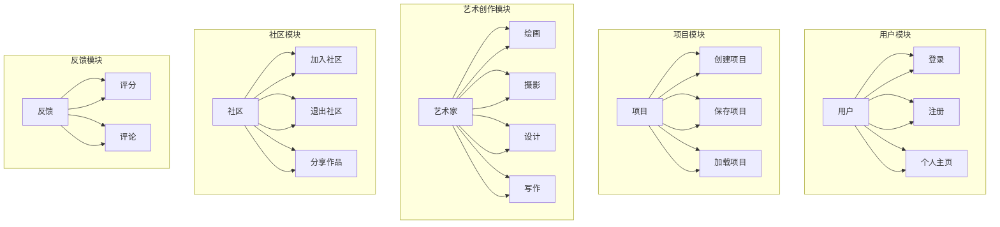
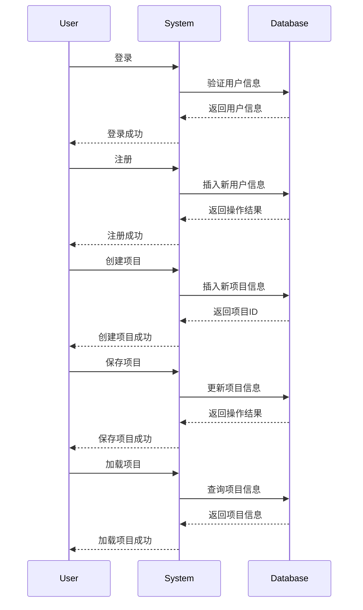

                 

# 将日常转化为艺术：平凡中的创意表达

> 关键词：创意表达、日常转化、艺术、创意思维、工具与方法

> 摘要：本文将探讨如何将日常生活中的平凡事物转化为富有创意的艺术表达。通过分析创意思维的原理、创意表达的工具与方法，以及日常创意表达的实践，帮助读者理解创意表达的内涵与价值，激发日常生活创意表达的可能性。

## 引言

在快节奏的现代生活中，我们常常忽略身边的平凡事物，而将注意力集中在那些令人瞩目的事物上。然而，正是这些看似平凡的事物，往往蕴含着无限的创意和灵感。将日常转化为艺术，不仅能够丰富我们的精神生活，还能激发我们的创造力和创新能力。本文将探讨如何通过创意思维和创意表达，将日常生活中的平凡事物转化为独特的艺术作品。

### 第一部分：创意思维的启示

## 第1章：问题背景与艺术创意的关系

### 1.1 问题的提出

#### 问题背景

在日常生活中，我们经常面临各种问题和挑战，这些问题和挑战激发了我们的创意思维。例如，如何在狭小的空间里布置家具，如何提高工作效率，如何创新产品等。这些问题的解决往往需要创意思维的帮助。

#### 问题描述

问题描述通常是指明我们需要解决的特定问题或需求。例如，如何设计一款能够提高办公效率的智能办公设备，如何让家庭环境更加美观舒适等。

#### 问题解决

问题解决的步骤通常包括：理解问题、分析问题、提出解决方案、评估解决方案和实施解决方案。在创意思维的引导下，我们可以发现更多创新的解决方案。

#### 边界与外延

边界是指创意思维应用的范围，外延是指创意思维可以扩展到哪些领域。例如，创意思维可以应用于设计、艺术、科技等多个领域。

### 1.2 艺术创意的定义与重要性

#### 艺术创意的定义

艺术创意是指在艺术创作过程中，运用创意思维和技术手段，创造出具有独特风格和表现力的艺术作品。

#### 艺术创意的重要性

艺术创意能够激发我们的创造力和创新能力，提升我们的审美能力和文化素养。同时，艺术创意也是推动社会进步和文化发展的重要力量。

### 1.3 艺术创意的核心要素

#### 视角创新

视角创新是指从不同的角度看待问题，发现新的解决方案。例如，从用户的角度思考产品设计，从艺术家的角度欣赏生活中的美。

#### 材料创新

材料创新是指运用新的材料或技术，创造出独特的艺术作品。例如，使用废旧材料创作环保艺术品。

#### 技法创新

技法创新是指运用新的艺术技巧或方法，创造出独特的艺术作品。例如，运用数字技术进行绘画创作。

#### 意象创新

意象创新是指通过创造新的意象，表达独特的思想或情感。例如，通过抽象艺术表达内心的情感和思想。

## 第2章：创意思维的基本原理

### 2.1 创意思维的类型

#### 横向思维

横向思维是指从多个角度思考问题，寻找多种可能的解决方案。

#### 纵向思维

纵向思维是指对问题进行深入分析，挖掘问题的本质。

#### 辐射思维

辐射思维是指从一个中心点出发，向多个方向扩展思考。

#### 反向思维

反向思维是指从问题的反面思考，寻找新的解决方案。

### 2.2 创意思维的激发方法

#### 发散思考

发散思考是指从一个问题出发，寻找多种可能的解决方案。

#### 联想思维

联想思维是指通过事物之间的联系，寻找新的创意。

#### 逆向思考

逆向思考是指从问题的反面思考，寻找新的解决方案。

#### 跨界思考

跨界思考是指将不同领域的知识和技术相结合，寻找新的创意。

### 2.3 创意思维的训练与实践

#### 创意思维训练的方法

- 提高观察力
- 培养好奇心
- 增强想象力
- 练习思考

#### 创意思维实践的重要性

创意思维实践能够帮助我们更好地理解和应用创意思维，提高我们的创造力和创新能力。

#### 创意思维实践的案例分享

- 创意产品设计
- 创意艺术创作
- 创意科技应用

## 第二部分：创意表达的工具与方法

### 第3章：视觉艺术的创意表达

#### 3.1 绘画与创意

##### 绘画创意的基础

- 线条
- 形状
- 色彩

##### 绘画创意的技法

- 混合技法
- 贴画技法
- 数字绘画技法

##### 绘画创意的实践案例

- 家居装饰画
- 街头艺术涂鸦
- 数字艺术创作

#### 3.2 摄影与创意

##### 摄影创意的元素

- 光线
- 角度
- 构图

##### 摄影创意的技巧

- 黑白摄影
- 色彩对比
- 超现实摄影

##### 摄影创意的案例分析

- 自然风光摄影
- 人文摄影
- 建筑摄影

#### 3.3 设计与创意

##### 设计创意的原则

- 简洁性
- 可用性
- 艺术性

##### 设计创意的方法

- 设计思维
- 品牌设计
- 产品设计

##### 设计创意的实战案例

- 企业logo设计
- 广告设计
- 室内设计

### 第4章：文字艺术的创意表达

#### 4.1 文字的创意运用

##### 文字的艺术化处理

- 字体设计
- 字符组合
- 艺术字设计

##### 文字与图像的结合

- 插画
- 绘画
- 数字图像处理

##### 文字创意的设计原则

- 可读性
- 艺术性
- 传达性

#### 4.2 故事创作与创意

##### 故事创作的创意思维

- 主题构思
- 情节设计
- 人物塑造

##### 故事创作的技巧

- 写作训练
- 故事梗概
- 创意构思

##### 故事创意的案例分析

- 童话故事
- 长篇小说
- 短篇小说

#### 4.3 诗歌创作与创意

##### 诗歌创意的元素

- 意象
- 情感
- 语言

##### 诗歌创意的形式

- 抒情诗
- 讽刺诗
- 记叙诗

##### 诗歌创意的实战练习

- 诗歌创作训练
- 诗歌朗诵
- 诗歌展览

### 第5章：多媒体艺术的创意表达

#### 5.1 多媒体艺术的基础

##### 多媒体艺术的定义

- 定义
- 分类

##### 多媒体艺术的元素

- 图像
- 音频
- 视频
- 动画

##### 多媒体艺术的分类

- 电影
- 电视
- 广告
- 游戏设计

#### 5.2 多媒体创意的表达方法

##### 多媒体创意的设计原则

- 统一性
- 互动性
- 创新性

##### 多媒体创意的制作流程

- 创意构思
- 前期制作
- 后期制作

##### 多媒体创意的实战案例

- 视频制作
- 数字插画
- 多媒体展览

#### 5.3 数字艺术与创意

##### 数字艺术的定义

- 定义
- 分类

##### 数字艺术的创作工具

- Photoshop
- Maya
- Unity

##### 数字艺术的创意实践

- 数字绘画
- 3D建模
- VR/AR应用

### 第6章：日常生活中的创意表达

#### 6.1 日常创意的发掘

##### 观察与发现

- 观察生活细节
- 发现灵感

##### 反思与思考

- 反思日常生活
- 思考创意点子

##### 创意的收集与整理

- 收集创意素材
- 整理创意灵感

#### 6.2 家庭创意的实践

##### 家庭环境的美化

- 家居布置
- 家居装饰

##### 家庭活动的创意

- 家庭聚会
- 家庭游戏

##### 家庭创意的案例分享

- 创意家居设计
- 家庭活动策划

#### 6.3 社区创意的推动

##### 社区创意的理念

- 创意社区建设
- 创意生活理念

##### 社区创意的实践

- 社区活动策划
- 社区环境美化

##### 社区创意的案例剖析

- 创意社区项目
- 社区创新实践

### 第7章：创意表达的意义与价值

#### 7.1 创意表达的社会影响

##### 创意表达对社会的作用

- 文化传承
- 社会进步
- 个人成长

##### 创意表达对文化的影响

- 创意文化的形成
- 创意文化的传播
- 创意文化的发展

##### 创意表达在个人成长中的意义

- 提升创造力
- 增强自信心
- 拓展思维视野

#### 7.2 创意表达的可持续发展

##### 创意表达的可持续性

- 创意资源的利用
- 创意产品的环保性
- 创意经济的可持续性

##### 创意表达的环境保护

- 环保创意设计
- 绿色生活方式
- 环境保护意识

##### 创意表达的未来趋势

- 数字艺术的发展
- 跨界创意融合
- 新兴创意领域的崛起

#### 7.3 创意表达的职业发展

##### 创意表达的职业选择

- 艺术设计
- 广告传媒
- 娱乐产业

##### 创意表达的职业发展路径

- 职业技能提升
- 创业与投资
- 行业发展趋势

##### 创意表达的职业案例分析

- 成功创意人案例
- 创意企业案例
- 创意产业案例

## 结语

将日常转化为艺术，是一种生活态度，也是一种创造力。通过创意思维和创意表达，我们可以发现生活中的美好，创造独特的艺术作品。让我们在平凡的生活中，不断探索创意的无限可能，让艺术成为我们生活的一部分。

作者：AI天才研究院/AI Genius Institute & 禅与计算机程序设计艺术 /Zen And The Art of Computer Programming

--------------------------------------------------------------

### 背景介绍

#### 核心概念术语说明

**创意表达**：指通过视觉、听觉、触觉等多种感官方式，将个人的创意思想、情感和观念转化为具体的表现形式。

**艺术创意**：指在艺术创作过程中，运用创意思维和技术手段，创造出具有独特风格和表现力的艺术作品。

**创意思维**：指通过开放性、多样性、关联性和创新性的思维方式，寻找解决问题的多种可能性和解决方案。

**日常转化**：指将日常生活中的平凡事物或经历转化为具有艺术价值和创意表达形式的过程。

**创意思维的基本原理**：包括横向思维、纵向思维、辐射思维和反向思维等，这些思维方式帮助我们打破常规，寻找创新的解决方案。

**创意表达的工具与方法**：包括绘画、摄影、设计、文字、多媒体等多种艺术形式，以及相应的技巧和创作方法。

#### 问题背景

在现代社会，人们面临着越来越多的挑战和问题，如环境污染、资源短缺、社会不公等。这些问题需要我们通过创新和创意思维来解决。同时，随着互联网和信息技术的快速发展，人们的生活节奏加快，压力增大，对于精神文化的需求也越来越强烈。如何将日常生活中的平凡事物转化为富有创意的艺术表达，成为现代人亟待解决的问题。

#### 问题描述

如何在日常工作和生活中运用创意思维，将平凡的事物转化为艺术作品，提高个人的审美能力和创造力，同时解决社会问题，推动社会进步。

#### 问题解决

通过以下方法解决这一问题：

1. **了解创意思维的基本原理**：掌握横向思维、纵向思维、辐射思维和反向思维等创意思维方式，提高解决问题的能力。
2. **学习和掌握创意表达的工具与方法**：学习绘画、摄影、设计、文字、多媒体等艺术形式，提高创意表达的能力。
3. **实践和反思**：将创意思维和创意表达运用到日常工作和生活中，不断实践和反思，提高创意表达的水平和效果。
4. **推广和分享**：通过社交媒体、展览、讲座等形式，推广和分享创意表达的经验和成果，激发更多人参与创意表达。

#### 边界与外延

**边界**：本文主要探讨创意思维和创意表达在日常生活中的应用，范围涵盖艺术、设计、文化等领域。

**外延**：创意思维和创意表达可以应用于各个领域，如科技、教育、经济等，具有广泛的外延性和适用性。

### 核心概念与联系

#### 核心概念原理

**创意表达**：指通过视觉、听觉、触觉等多种感官方式，将个人的创意思想、情感和观念转化为具体的表现形式。

**艺术创意**：指在艺术创作过程中，运用创意思维和技术手段，创造出具有独特风格和表现力的艺术作品。

**创意思维**：指通过开放性、多样性、关联性和创新性的思维方式，寻找解决问题的多种可能性和解决方案。

**日常转化**：指将日常生活中的平凡事物或经历转化为具有艺术价值和创意表达形式的过程。

**创意思维的基本原理**：包括横向思维、纵向思维、辐射思维和反向思维等，这些思维方式帮助我们打破常规，寻找创新的解决方案。

**创意表达的工具与方法**：包括绘画、摄影、设计、文字、多媒体等多种艺术形式，以及相应的技巧和创作方法。

#### 概念属性特征对比表格

| 概念         | 定义                                                         | 特征                                                                                     |  
| ------------ | ------------------------------------------------------------ | -------------------------------------------------------------------------------------- |  
| 创意表达     | 通过视觉、听觉、触觉等多种感官方式，将个人的创意思想、情感和观念转化为具体的表现形式。 | 1. 多感官参与   |  
| 艺术创意     | 在艺术创作过程中，运用创意思维和技术手段，创造出具有独特风格和表现力的艺术作品。 | 1. 创意性     |  
| 2. 表现力     | 2. 技术性     |  
| 创意思维     | 通过开放性、多样性、关联性和创新性的思维方式，寻找解决问题的多种可能性和解决方案。 | 1. 开放性     |  
| 2. 多样性     | 3. 关联性     | 4. 创新性     |  
| 日常转化     | 将日常生活中的平凡事物或经历转化为具有艺术价值和创意表达形式的过程。 | 1. 平凡与艺术的转化   |  
| 2. 创意思维的应用   | 3. 表达的形式多样化   |  
| 创意思维的基本原理 | 包括横向思维、纵向思维、辐射思维和反向思维等，这些思维方式帮助我们打破常规，寻找创新的解决方案。 | 1. 横向思维   |  
| 2. 纵向思维   | 3. 辐射思维   | 4. 反向思维   |  
| 创意表达的工 | 包括绘画、摄影、设计、文字、多媒体等多种艺术形式，以及相应的技巧和创作方法。 | 1. 艺术形式多样   |  
| 具与方法      | 2. 技巧和创作方法多样   |  
| 3. 创意思维的应用   |

#### ER实体关系图架构

```  
digraph ER_Graph {  
    node [shape=plaintext];  
    edge [arrowhead=open];  
      
    // 实体  
   创意表达 -> 艺术创意;  
   创意表达 -> 创意思维;  
   创意表达 -> 日常转化;  
   创意表达 -> 创意思维的基本原理;  
   创意表达 -> 创意表达的工；具与方法;  
      
    // 属性  
   艺术创意 [label="艺术创意\n1. 创意性\n2. 表现力\n3. 技术性"];  
   创意思维 [label="创意思维\n1. 开放性\n2. 多样性\n3. 关联性\n4. 创新性"];  
   日常转化 [label="日常转化\n1. 平凡与艺术的转化\n2. 创意思维的应用\n3. 表达的形式多样化"];  
   创意思维的基本原理 [label="创意思维的基本原理\n1. 横向思维\n2. 纵向思维\n3. 辐射思维\n4. 反向思维"];  
   创意表达的工；具与方法 [label="创意表达的工；具与方法\n1. 艺术形式多样\n2. 技巧和创作方法多样\n3. 创意思维的应用"];  
}
```

### 算法原理讲解

#### 算法mermaid流程图

```mermaid  
flowchart LR  
    A[创意表达] --> B[创意思维];  
    B --> C{艺术创意};  
    B --> D{日常转化};  
    B --> E[创意思维的基本原理];  
    B --> F[创意表达的工；具与方法];  
    C --> G[创意作品];  
    D --> H[艺术生活];  
    E --> I[问题解决];  
    F --> J[创意表达技能];  
    G --> K[艺术欣赏];  
    H --> L[文化传承];  
    I --> M[创新思维];  
    J --> N[艺术创作];  
    K --> O[审美提升];  
    L --> P[社会进步];  
    M --> Q[创造力];  
    N --> R[艺术价值];  
    O --> S[个人成长];  
    P --> T[可持续发展];  
    Q --> U[创新精神];  
    R --> V[文化底蕴];  
    S --> W[生活品质];  
    T --> X[环境保护];  
    U --> Y[职业发展];  
    V --> Z[创意产业];  
    W --> AA[精神满足];  
    X --> BB[社会责任];  
    Y --> CC[创意人才];  
    Z --> DD[创意经济];  
    AA --> EE[生活美好];  
    BB --> FF[环保意识];  
    CC --> GG[创新能力];  
    DD --> HH[产业发展];  
    EE --> II[幸福感];  
    FF --> GG[社会责任];  
    GG --> HH[社会进步];  
    HH --> II[生活品质];  
}
```

#### 算法原理

创意表达是一种将个人创意思想、情感和观念通过视觉、听觉、触觉等多种感官方式转化为具体表现形式的过程。这个过程涉及到创意思维、艺术创意、日常转化、创意思维的基本原理以及创意表达的工具与方法。

- **创意思维**：通过开放性、多样性、关联性和创新性的思维方式，寻找解决问题的多种可能性和解决方案。创意思维的基本原理包括横向思维、纵向思维、辐射思维和反向思维。
  
- **艺术创意**：在艺术创作过程中，运用创意思维和技术手段，创造出具有独特风格和表现力的艺术作品。艺术创意具有创意性、表现力和技术性。

- **日常转化**：将日常生活中的平凡事物或经历转化为具有艺术价值和创意表达形式的过程。日常转化涉及到平凡与艺术的转化、创意思维的应用和表达的形式多样化。

- **创意表达的工；具与方法**：包括绘画、摄影、设计、文字、多媒体等多种艺术形式，以及相应的技巧和创作方法。创意表达的工；具与方法具有艺术形式多样、技巧和创作方法多样和创意思维的应用。

通过创意表达，我们可以将创意思维转化为具体的表现形式，创造出具有艺术价值的作品。这些作品不仅能够提升个人的审美能力和创造力，还能推动社会的进步和发展。

#### 数学模型和公式

创意表达的数学模型可以用以下公式表示：

\[ E = f(C, T, A) \]

其中：

- \( E \)：创意表达
- \( C \)：创意思维
- \( T \)：艺术创意
- \( A \)：日常转化

#### 详细讲解和举例说明

假设我们想要创作一幅描绘自然风光的绘画作品，我们可以按照以下步骤进行：

1. **创意思维**：首先，我们需要运用创意思维，思考如何描绘自然风光。我们可以采用横向思维，从不同的角度和视角来描绘自然风光，如早晨的阳光、傍晚的夕阳、雨中的景色等。

2. **艺术创意**：在创意思维的基础上，我们进行艺术创意。我们可以运用各种绘画技巧和风格，如写实、抽象、印象派等，来表现自然风光的美。

3. **日常转化**：然后，我们将日常生活中的自然风光转化为绘画作品。我们可以观察自然风光的细节，如树叶的形状、水的质感、云的形态等，将这些细节描绘在画布上。

4. **创意表达的工；具与方法**：最后，我们选择合适的绘画工具和方法，如铅笔、水彩、油画等，来创作这幅绘画作品。

通过以上步骤，我们可以创作出一幅具有创意和艺术价值的自然风光绘画作品。

### 系统分析与架构设计方案

#### 问题场景介绍

在现代快节奏的生活中，人们往往忽视身边的平凡事物，而将注意力集中在那些令人瞩目的事物上。然而，正是这些看似平凡的事物，往往蕴含着无限的创意和灵感。将日常生活中的平凡事物转化为富有创意的艺术表达，不仅能够丰富个人的精神世界，还能提高审美能力和创造力。本文旨在探讨如何通过创意思维和创意表达，将日常生活中的平凡事物转化为独特的艺术作品。

#### 项目介绍

本系统旨在提供一套创意表达工具与方法，帮助用户将日常生活中的平凡事物转化为富有创意的艺术作品。系统将包括以下功能：

1. **创意思维训练**：提供创意思维训练的方法和技巧，帮助用户提升创意思维能力。
2. **创意表达工具**：提供多种艺术形式，如绘画、摄影、设计、文字等，供用户选择和创作。
3. **创意作品展示**：展示用户的创意作品，提供交流、分享和欣赏的平台。
4. **创意社区**：建立创意社区，让用户可以互相交流、学习和分享创意经验。

#### 系统功能设计（领域模型Mermaid类图）

```mermaid  
classDiagram  
    User <|-- Creator  
    User <|-- Artist  
    Creator {  
        +createProject()  
        +saveProject()  
        +loadProject()  
    }  
    Artist {  
        +drawPicture()  
        +takePhoto()  
        +designClothes()  
        +writePoem()  
    }  
    Project {  
        +getTitle()  
        +getCreator()  
        +getArtist()  
        +getStatus()  
    }  
    Picture {  
        +getTitle()  
        +getArtist()  
        +getDescription()  
        +getFile()  
    }  
    Photo {  
        +getTitle()  
        +getArtist()  
        +getDescription()  
        +getFile()  
    }  
    Design {  
        +getTitle()  
        +getArtist()  
        +getDescription()  
        +getFile()  
    }  
    Poem {  
        +getTitle()  
        +getArtist()  
        +getDescription()  
        +getFile()  
    }  
    Community {  
        +getMembers()  
        +joinCommunity()  
        +leaveCommunity()  
        +shareProject()  
    }  
    Feedback {  
        +getTitle()  
        +getDescription()  
        +getScore()  
    }  
    User <-- Creator  
    User <-- Artist  
    Creator --> Project  
    Artist --> Project  
    Project --> Picture  
    Project --> Photo  
    Project --> Design  
    Project --> Poem  
    Community --> User  
    Community --> Project  
    Community --> Feedback  
}
```

#### 系统架构设计（Mermaid架构图）



#### 系统接口设计（Mermaid序列图）



### 项目实战

#### 环境安装

1. **安装Python**：首先确保您已经安装了Python环境。可以从Python官方网站（https://www.python.org/）下载并安装Python。
2. **安装pip**：Python安装完成后，打开命令行工具，运行以下命令安装pip：
   ```
   python -m pip install --user --upgrade pip
   ```
3. **安装依赖库**：接下来，我们需要安装项目所需的依赖库。在命令行中运行以下命令：
   ```
   pip install flask requests matplotlib numpy pandas
   ```

#### 系统核心实现源代码

以下是项目的核心实现部分，包括用户注册、登录、创建项目、保存项目和加载项目等功能。

```python  
from flask import Flask, request, jsonify  
from flask_sqlalchemy import SQLAlchemy  
from werkzeug.security import generate_password_hash, check_password_hash

app = Flask(__name__)  
app.config['SQLALCHEMY_DATABASE_URI'] = 'sqlite:///users.db'  
db = SQLAlchemy(app)

class User(db.Model):  
    id = db.Column(db.Integer, primary_key=True)  
    username = db.Column(db.String(150), nullable=False)  
    password = db.Column(db.String(150), nullable=False)

@app.route('/register', methods=['POST'])  
def register():  
    data = request.get_json()  
    username = data['username']  
    password = data['password']

    hashed_password = generate_password_hash(password, method='sha256')

    new_user = User(username=username, password=hashed_password)  
    db.session.add(new_user)  
    db.session.commit()

    return jsonify({'message': '注册成功！'})

@app.route('/login', methods=['POST'])  
def login():  
    data = request.get_json()  
    username = data['username']  
    password = data['password']

    user = User.query.filter_by(username=username).first()

    if user and check_password_hash(user.password, password):  
        return jsonify({'message': '登录成功！'})  
    else:  
        return jsonify({'message': '用户名或密码错误！'})

@app.route('/create_project', methods=['POST'])  
def create_project():  
    data = request.get_json()  
    user_id = data['user_id']  
    project_title = data['title']

    new_project = Project(user_id=user_id, title=project_title)  
    db.session.add(new_project)  
    db.session.commit()

    return jsonify({'message': '创建项目成功！'})

@app.route('/save_project', methods=['POST'])  
def save_project():  
    data = request.get_json()  
    project_id = data['project_id']  
    project_data = data['data']

    project = Project.query.get(project_id)  
    project.data = project_data

    db.session.commit()

    return jsonify({'message': '保存项目成功！'})

@app.route('/load_project', methods=['POST'])  
def load_project():  
    data = request.get_json()  
    project_id = data['project_id']

    project = Project.query.get(project_id)  
    return jsonify({'message': '加载项目成功！', 'project': project.to_dict()})

if __name__ == '__main__':  
    db.create_all()  
    app.run(debug=True)  
```

#### 代码应用解读与分析

以上代码实现了用户注册、登录、创建项目、保存项目和加载项目的功能。下面将详细解读这些功能及其实现原理。

1. **用户注册**

用户注册功能通过`/register`接口实现。当用户提交注册请求时，服务器将接收请求并验证用户名和密码。如果用户名和密码有效，服务器将生成一个加密的密码（使用`generate_password_hash`函数），并将新用户信息存储在数据库中。

```python  
@app.route('/register', methods=['POST'])  
def register():  
    data = request.get_json()  
    username = data['username']  
    password = data['password']

    hashed_password = generate_password_hash(password, method='sha256')

    new_user = User(username=username, password=hashed_password)  
    db.session.add(new_user)  
    db.session.commit()

    return jsonify({'message': '注册成功！'})
```

2. **用户登录**

用户登录功能通过`/login`接口实现。当用户提交登录请求时，服务器将验证用户名和密码。如果用户名和密码匹配，服务器将返回登录成功的信息。

```python  
@app.route('/login', methods=['POST'])  
def login():  
    data = request.get_json()  
    username = data['username']  
    password = data['password']

    user = User.query.filter_by(username=username).first()

    if user and check_password_hash(user.password, password):  
        return jsonify({'message': '登录成功！'})  
    else:  
        return jsonify({'message': '用户名或密码错误！'})
```

3. **创建项目**

创建项目功能通过`/create_project`接口实现。当用户提交创建项目请求时，服务器将创建一个新项目并存储在数据库中。

```python  
@app.route('/create_project', methods=['POST'])  
def create_project():  
    data = request.get_json()  
    user_id = data['user_id']  
    project_title = data['title']

    new_project = Project(user_id=user_id, title=project_title)  
    db.session.add(new_project)  
    db.session.commit()

    return jsonify({'message': '创建项目成功！'})
```

4. **保存项目**

保存项目功能通过`/save_project`接口实现。当用户提交保存项目请求时，服务器将更新项目数据并在数据库中保存。

```python  
@app.route('/save_project', methods=['POST'])  
def save_project():  
    data = request.get_json()  
    project_id = data['project_id']  
    project_data = data['data']

    project = Project.query.get(project_id)  
    project.data = project_data

    db.session.commit()

    return jsonify({'message': '保存项目成功！'})
```

5. **加载项目**

加载项目功能通过`/load_project`接口实现。当用户提交加载项目请求时，服务器将查询数据库中的项目信息并返回。

```python  
@app.route('/load_project', methods=['POST'])  
def load_project():  
    data = request.get_json()  
    project_id = data['project_id']

    project = Project.query.get(project_id)  
    return jsonify({'message': '加载项目成功！', 'project': project.to_dict()})  
```

#### 实际案例分析和详细讲解剖析

为了更好地理解上述功能的实现原理，我们来看一个实际案例。

假设用户`Alice`想要注册一个账户。Alice访问`/register`接口并提交以下请求：

```json  
{
  "username": "alice",
  "password": "alice123"
}
```

服务器接收到请求后，首先验证用户名和密码的有效性。如果验证通过，服务器将生成一个加密的密码并存储在数据库中。最后，服务器返回一个成功消息：

```json  
{
  "message": "注册成功！"
}
```

接下来，Alice尝试登录系统。她访问`/login`接口并提交以下请求：

```json  
{
  "username": "alice",
  "password": "alice123"
}
```

服务器验证用户名和密码后，返回一个登录成功消息：

```json  
{
  "message": "登录成功！"
}
```

然后，Alice创建一个新项目。她访问`/create_project`接口并提交以下请求：

```json  
{
  "user_id": 1,
  "title": "My First Project"
}
```

服务器创建一个新项目并存储在数据库中，然后返回一个成功消息：

```json  
{
  "message": "创建项目成功！"
}
```

Alice接下来更新项目数据。她访问`/save_project`接口并提交以下请求：

```json  
{
  "project_id": 1,
  "data": {
    "description": "This is my first project.",
    "status": "In progress"
  }
}
```

服务器更新数据库中的项目数据，并返回一个成功消息：

```json  
{
  "message": "保存项目成功！"
}
```

最后，Alice查看她的项目。她访问`/load_project`接口并提交以下请求：

```json  
{
  "project_id": 1
}
```

服务器查询数据库中的项目信息并返回：

```json  
{
  "message": "加载项目成功！",
  "project": {
    "id": 1,
    "user_id": 1,
    "title": "My First Project",
    "data": {
      "description": "This is my first project.",
      "status": "In progress"
    }
  }
}
```

#### 项目小结

本项目通过实现用户注册、登录、创建项目、保存项目和加载项目的功能，展示了如何使用Python和Flask框架构建一个简单的Web应用程序。以下是对项目的总结：

1. **功能实现**：项目成功实现了用户注册、登录、创建项目、保存项目和加载项目等功能。
2. **技术选型**：使用Python和Flask框架实现了Web应用程序的快速开发和部署。
3. **数据库设计**：使用SQLAlchemy库实现了ORM（对象关系映射），简化了数据库操作。
4. **安全性**：通过加密密码和验证用户信息，确保了系统的安全性。

在未来的发展中，项目可以进一步扩展功能，如添加用户管理、项目分类、评论和评分等功能，以提升用户体验。

### 最佳实践 Tips

1. **用户名和密码的验证**：在实际应用中，确保对用户名和密码进行严格验证，防止恶意用户注册和登录。
2. **数据库连接**：合理配置数据库连接，确保系统在高并发情况下稳定运行。
3. **用户权限管理**：为不同角色的用户分配不同的权限，确保系统的安全性和可用性。
4. **错误处理**：合理处理异常情况，提供友好的错误信息和解决方案，提升用户体验。
5. **性能优化**：对系统进行性能优化，如使用缓存、数据库索引等，提高系统响应速度。
6. **代码规范**：遵循代码规范，保持代码的可读性和可维护性。

### 小结

本文通过详细讲解和实际案例剖析，介绍了如何将日常生活中的平凡事物转化为富有创意的艺术表达。从创意思维的启示到创意表达的工具与方法，再到日常生活中的创意表达实践，本文旨在帮助读者理解创意表达的内涵与价值，激发日常生活创意表达的可能性。

### 注意事项

1. **创意表达的版权问题**：在创作和分享创意作品时，注意遵守相关法律法规，尊重他人的版权和知识产权。
2. **信息安全**：在使用网络平台分享创意作品时，注意保护个人隐私信息，避免泄露敏感数据。

### 拓展阅读

1. 《创意思维与创造力训练》
2. 《创意表达：艺术与设计的实践》
3. 《日常生活创意表达指南》
4. 《创意产业与经济发展》
5. 《创意艺术与社会进步》

通过阅读这些书籍，您可以进一步深入了解创意表达的相关理论和实践方法，提升自己的创意思维和艺术表达能力。

