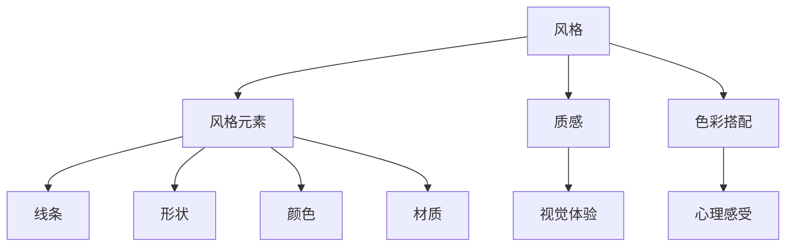

                 

# 设计《将生活转化为艺术：日常美学的实践》目录大纲

## 目录大纲设计流程

### 第一步：理解核心概念

- **日常生活美学**：强调通过审美提升日常生活质量。
- **艺术实践**：将美学理念应用于日常生活的各个方面。

### 第二步：确定核心内容

- **核心概念与联系**：探讨日常美学中的关键概念及其相互关系。
- **算法原理讲解**：介绍基础设计理论和审美原则。
- **数学模型和数学公式**：简化但不失精确的表达设计原则。

### 第三步：结构规划

- **第一部分：理解日常美学**：包括背景介绍和核心概念。
- **第二部分：日常美学的实践应用**：具体展示美学如何应用于生活。
- **第三部分：深入探索与提升**：探讨美学对心理和生活质量的影响。

### 第四步：细化章节内容

- **第1章：日常美学的概念与背景**
  - **核心概念术语说明**：介绍“美学”、“日常美学”等术语。
  - **问题背景**：阐述日常生活美学的重要性。
  - **问题描述**：讨论如何将美学融入日常生活。
  - **问题解决**：提供解决方法。

- **第2章：核心概念与联系**
  - **概念属性特征对比表格**：对比“风格”、“质感”等概念。
  - **ER实体关系图架构的Mermaid流程图**：展示核心概念之间的联系。

- **第3章：审美原则与设计理论**
  - **实用案例分析**：通过案例讲解审美原则的应用。

### 第五步：确保格式和完整性

- **格式要求**：使用markdown格式，确保章节标题清晰，内容详尽。
- **完整性要求**：确保每个章节都有完整的背景介绍、核心概念联系、算法原理讲解、系统分析与架构设计方案、项目实战等。

### 第六步：撰写示例章节

- **第1章示例**：撰写一个完整的章节，以展示文章的风格和结构。

## 目录大纲示例

### 目录

----------------------------------------------------------------

# 将生活转化为艺术：日常美学的实践

> 关键词：日常美学，生活艺术，设计原则，审美实践

> 摘要：本文深入探讨将日常生活转化为艺术的美学实践，从核心概念到具体应用，旨在帮助读者提升生活品质，实现美学与生活的完美融合。

## 第一部分：理解日常美学

### 第1章：日常美学的概念与背景

#### 1.1 问题背景

#### 1.2 日常美学的定义

#### 1.3 日常生活美学的重要性

#### 1.4 本书的目标与读者

### 第2章：核心概念与联系

#### 2.1 风格与风格元素

#### 2.2 质感与视觉体验

#### 2.3 色彩搭配与心理感受

#### 2.4 概念联系与综合应用

### 第3章：审美原则与设计理论

#### 3.1 基本审美原则

#### 3.2 设计理论概述

#### 3.3 实用案例分析

## 第二部分：日常美学的实践应用

### 第4章：家居环境的美学设计

#### 4.1 家居环境分析

#### 4.2 设计原则与技巧

#### 4.3 实例展示

### 第5章：个人形象美学打造

#### 5.1 服饰搭配美学

#### 5.2 形体美学

#### 5.3 实用案例分享

### 第6章：生活细节中的美学

#### 6.1 美食与烹饪美学

#### 6.2 花艺与自然美学

#### 6.3 手工艺术与美学

## 第三部分：深入探索与提升

### 第7章：日常美学与心理学

#### 7.1 心理学在美学中的应用

#### 7.2 如何通过美学改善心理状态

#### 7.3 实例分析与探讨

### 第8章：日常美学实践项目

#### 8.1 项目介绍

#### 8.2 项目目标与计划

#### 8.3 项目实施与评估

### 第9章：最佳实践与拓展阅读

#### 9.1 美学实践技巧

#### 9.2 注意事项与常见问题

#### 9.3 拓展阅读推荐

----------------------------------------------------------------

通过以上目录大纲的设计示例，我们可以看到每个章节都包含了明确的标题和简要的内容概述。接下来，我们将进一步细化每个章节的内容，确保文章的完整性和专业性。以下是对每个章节的细化内容概述：

### 第一部分：理解日常美学

#### 第1章：日常美学的概念与背景

**细化内容概述**：

- **问题背景**：介绍现代社会中人们对生活品质的追求，以及美学在日常生活中的作用。
- **日常美学的定义**：明确日常美学的概念，并区分它与艺术和设计的不同。
- **日常生活美学的重要性**：探讨美学如何影响人们的心理健康和生活质量。
- **本书的目标与读者**：说明本书的宗旨，以及适合的读者群体。

#### 第2章：核心概念与联系

**细化内容概述**：

- **风格与风格元素**：介绍风格的概念，分析不同风格的元素及其组合。
- **质感与视觉体验**：探讨质感的定义及其对视觉体验的影响。
- **色彩搭配与心理感受**：分析色彩对心理感受的影响，介绍有效的色彩搭配原则。
- **概念联系与综合应用**：展示核心概念之间的联系，并举例说明如何在日常生活中应用这些概念。

#### 第3章：审美原则与设计理论

**细化内容概述**：

- **基本审美原则**：介绍基础的设计原则，如比例、平衡、对比、和谐等。
- **设计理论概述**：简要介绍设计理论的发展历程和主要理论。
- **实用案例分析**：通过实际案例展示如何应用审美原则和设计理论。

### 第二部分：日常美学的实践应用

#### 第4章：家居环境的美学设计

**细化内容概述**：

- **家居环境分析**：介绍家居环境的特点，分析其美学设计的需求。
- **设计原则与技巧**：详细讲解家居环境美学设计的原则和技巧。
- **实例展示**：通过实际案例展示家居环境美学设计的成果。

#### 第5章：个人形象美学打造

**细化内容概述**：

- **服饰搭配美学**：介绍服饰搭配的原则和技巧，分析不同场合的服饰搭配策略。
- **形体美学**：探讨形体与美学的关联，提供改善形体的建议。
- **实用案例分享**：分享个人形象美学打造的实用案例。

#### 第6章：生活细节中的美学

**细化内容概述**：

- **美食与烹饪美学**：介绍美食美学的重要性，分析烹饪过程中的美学要素。
- **花艺与自然美学**：探讨花艺设计的原则，分析自然元素在生活中的应用。
- **手工艺术与美学**：介绍手工艺术的美学价值，展示手工艺术的应用。

### 第三部分：深入探索与提升

#### 第7章：日常美学与心理学

**细化内容概述**：

- **心理学在美学中的应用**：探讨心理学如何影响美学设计和审美体验。
- **如何通过美学改善心理状态**：提供实用的美学技巧，帮助改善心理状态。
- **实例分析与探讨**：通过实际案例分析如何通过美学改善生活质量和心理健康。

#### 第8章：日常美学实践项目

**细化内容概述**：

- **项目介绍**：介绍日常美学实践项目的背景和目标。
- **项目目标与计划**：明确项目的具体目标和实施计划。
- **项目实施与评估**：详细描述项目实施过程和评估方法。

#### 第9章：最佳实践与拓展阅读

**细化内容概述**：

- **美学实践技巧**：总结日常美学实践中的最佳技巧和方法。
- **注意事项与常见问题**：提醒读者在美学实践中可能遇到的问题和解决方案。
- **拓展阅读推荐**：推荐相关的书籍、文章和资源，供读者进一步学习。

通过以上细化内容概述，我们可以看到每个章节都涵盖了详细的内容，确保文章的完整性。接下来，我们将具体撰写每个章节的内容，确保文章的专业性和可读性。以下是《将生活转化为艺术：日常美学的实践》的第一章节内容：

## 第1章：日常美学的概念与背景

### 1.1 问题背景

在现代社会，随着生活节奏的加快和人们对生活质量的要求不断提高，美学逐渐成为日常生活中不可或缺的一部分。然而，对于许多人来说，将美学融入日常生活并非易事。人们常常对美学概念感到困惑，不知道如何将其应用于实际生活中。

### 1.2 日常美学的定义

日常美学是指将审美原则和设计理念应用于日常生活中的各个方面，包括家居环境、个人形象、饮食烹饪等。它不仅仅是关于美的追求，更是一种生活态度和价值观的体现。

### 1.3 日常生活美学的重要性

日常生活美学对个人的心理健康和生活质量有着重要的影响。通过美学实践，人们可以提升自己的生活品质，培养良好的审美观，增强自信心，甚至改善心理健康。

### 1.4 本书的目标与读者

本书旨在帮助读者理解日常美学的概念，掌握美学实践的基本原则和方法，并将其应用于日常生活中。无论是家居布置、服饰搭配，还是饮食烹饪，本书都将提供实用的指导和案例分析。适合的读者群体包括对美学感兴趣的人士、家居布置爱好者、时尚搭配达人，以及对生活质量有追求的普通读者。

在接下来的章节中，我们将深入探讨日常美学的核心概念，分析美学实践的原则和方法，并通过实例展示如何将美学融入日常生活。让我们开始这段美学之旅，共同探索如何将生活转化为艺术。

## 第2章：核心概念与联系

### 2.1 风格与风格元素

风格是日常美学中的核心概念之一，它代表了个人或特定环境的独特审美特征。风格不仅仅是关于外观，它更是一种情感和文化的体现。风格元素是构成风格的基本单元，包括线条、形状、颜色、材质等。不同的风格元素组合在一起，可以创造出独特的视觉体验。

**对比表格：不同风格元素的特征**

| 风格元素 | 特征 |
|----------|------|
| 线条     | 简洁、流畅、弯曲 |
| 形状     | 规则、对称、不规则 |
| 颜色     | 纯净、对比、协调 |
| 材质     | 光滑、粗糙、天然 |

### 2.2 质感与视觉体验

质感是物体表面的触觉特征，它对视觉体验有着重要的影响。不同的质感可以给人带来不同的心理感受。例如，光滑的表面通常给人以现代感，而粗糙的表面则给人一种自然和舒适的感受。

**质感对比表格：不同质感的视觉体验**

| 质感 | 视觉体验 |
|------|----------|
| 光滑 | 现代感、简洁 |
| 粗糙 | 自然感、舒适 |
| 天然 | 温馨、亲切 |

### 2.3 色彩搭配与心理感受

色彩搭配在美学设计中起着至关重要的作用。不同的色彩搭配可以产生不同的心理感受。例如，红色通常代表活力和热情，而蓝色则代表宁静和冷静。

**色彩搭配对比表格：不同色彩搭配的心理感受**

| 色彩搭配 | 心理感受 |
|----------|----------|
| 对比色   | 强烈、醒目 |
| 类比色   | 和谐、舒适 |
| 补色     | 突出、强烈 |

### 2.4 概念联系与综合应用

日常美学的核心概念之间有着紧密的联系，它们共同构成了美学设计的理论基础。通过理解这些概念之间的联系，我们可以更有效地将美学应用于实际生活中。

**Mermaid流程图：日常美学核心概念联系**

通过上述内容，我们可以看到日常美学的核心概念及其相互关系。在实际应用中，这些概念可以相互结合，创造出独特的美学效果。接下来，我们将进一步探讨审美原则与设计理论，为日常美学实践提供更深入的指导。

## 第3章：审美原则与设计理论

### 3.1 基本审美原则

审美原则是美学设计的基础，它们帮助我们判断和创造出美观的元素。以下是一些基本审美原则：

- **比例**：比例是美学设计中的重要原则，它关系到视觉上的平衡和协调。常见的比例原则包括黄金分割比例（约1:1.618）。
  
  $$ \text{黄金分割比例} = \frac{1 + \sqrt{5}}{2} \approx 1.618 $$
  
- **平衡**：平衡是美学设计中常用的手法，它包括对称平衡和不对称平衡。对称平衡给人以稳定感，而不对称平衡则更加动态和有趣。

- **对比**：对比是通过不同元素之间的差异来产生视觉兴趣。通过对比，可以突出主要元素，增强视觉效果。

- **和谐**：和谐是美学设计中的另一个重要原则，它强调元素之间的协调和一致性。和谐的设计给人以平静和愉悦的感觉。

- **重点**：重点是指设计中需要突出的部分。通过适当的处理，使重点更加鲜明，吸引人的注意力。

### 3.2 设计理论概述

设计理论是美学实践的理论基础，它帮助我们理解和应用审美原则。以下是一些重要的设计理论：

- **设计思维**：设计思维是一种问题解决方法，它强调用户需求和用户体验的重要性。通过设计思维，我们可以更好地将美学原则应用于实际设计中。

- **形式追随功能**：这是现代设计的重要原则，它强调设计应首先满足功能需求，然后才是美学追求。

- **格式塔理论**：格式塔理论关注整体视觉感知，强调形状、颜色、纹理等元素如何组织在一起形成整体。

### 3.3 实用案例分析

为了更好地理解这些审美原则和设计理论，我们可以通过实际案例来展示如何应用它们。

#### 案例一：家居空间设计

**问题背景**：一个家居空间需要重新设计，以提高美观度和实用性。

**解决方案**：

- **比例**：使用黄金分割比例来确定家具和装饰品的位置，使空间更加协调。

  $$ \text{家具位置} = \text{空间宽度} \times \frac{1 + \sqrt{5}}{2} $$

- **平衡**：采用不对称平衡，将家具和装饰品分布在空间的不同部分，以增加动态感。

- **对比**：使用对比鲜明的颜色和材质来突出空间中的重点元素。

- **和谐**：通过选择协调的色调和材质，使整个空间看起来和谐统一。

**效果评估**：重新设计后的家居空间不仅美观，而且实用，居住者对设计效果非常满意。

#### 案例二：服饰搭配

**问题背景**：需要为一场正式活动选择一套合适的服饰。

**解决方案**：

- **比例**：根据身体比例选择合适的裙长和上衣长度，使整体造型更加协调。

- **平衡**：通过层次感来创造平衡，例如，在长裙外搭配一件短款上衣。

- **对比**：使用对比色来突出重点，如选择一件黑色连衣裙，搭配红色腰带。

- **和谐**：通过选择协调的色调和材质，确保整体服饰看起来和谐统一。

**效果评估**：搭配效果得到了活动主办方的赞赏，参与者对服饰搭配的舒适度和美观度都表示满意。

通过以上案例分析，我们可以看到审美原则和设计理论在实际中的应用效果。接下来，我们将探讨如何将美学理念应用于家居环境设计，为读者提供具体的实践指导。

## 第4章：家居环境的美学设计

### 4.1 家居环境分析

家居环境是我们日常生活中的重要空间，它不仅提供休息和生活的场所，同时也是我们表达个性和审美趣味的地方。一个精心设计的家居环境可以提升生活质量，带来舒适和愉悦的体验。

#### 空间功能划分

首先，我们需要对家居环境进行功能划分。通常，家居空间可以划分为以下几个区域：

- **客厅**：家庭活动的中心，接待客人和休闲娱乐。
- **卧室**：休息和睡眠的空间。
- **厨房**：烹饪和用餐的空间。
- **浴室**：洗浴和个人护理的空间。
- **书房**：工作和学习的空间。

#### 空间布局规划

在功能划分的基础上，我们需要进行空间布局规划。布局规划需要考虑以下几个方面：

- **动线**：合理安排家具和装饰品的摆放，确保空间内的动线流畅，便于日常生活和活动。
- **采光**：充分利用自然光，通过窗户、墙壁的颜色和家具的摆放来优化采光。
- **通风**：确保空气流通，避免潮湿和异味。
- **储物空间**：合理安排储物空间，解决杂物堆放问题，保持空间整洁有序。

### 4.2 设计原则与技巧

#### 1. 风格一致性

风格一致性是家居环境设计的重要原则。选择一种统一的风格，如现代简约、北欧风格、复古风格等，可以使家居环境看起来更加协调和统一。例如，在北欧风格的设计中，常使用简洁的线条、自然的材质和温暖的色调。

#### 2. 色彩搭配

色彩搭配在美学设计中起着关键作用。通过合理的色彩搭配，可以创造出舒适、和谐的空间氛围。以下是一些常见的色彩搭配技巧：

- **对比色搭配**：通过对比鲜明的颜色来增加空间的视觉焦点，如黑色与白色、蓝色与橙色。
- **类似色搭配**：通过选择颜色相近的颜色来创造和谐的氛围，如蓝色与绿色、红色与粉红色。
- **单色搭配**：使用单色调来营造统一和简洁的氛围。

#### 3. 质感运用

质感运用可以增加空间的层次感和丰富度。通过使用不同材质的家具和装饰品，可以创造出独特的视觉效果。例如，使用木质家具来增加自然感，使用金属材质来增加现代感。

#### 4. 光线与照明

光线和照明是家居环境设计中不可忽视的元素。合理的照明设计可以增强空间的氛围，提升生活质量。以下是一些照明设计的建议：

- **自然光**：充分利用自然光，通过窗户、镜子等来增加空间的明亮度。
- **基础照明**：确保每个空间都有基础照明，如吊灯、吸顶灯等。
- **重点照明**：使用重点照明来突出空间的某个特定区域，如书桌、沙发等。

### 4.3 实例展示

#### 案例一：现代简约风格客厅

**设计理念**：现代简约风格注重简洁、实用和功能，通过简单的线条和干净的色调来营造现代感。

**色彩搭配**：以白色为主色调，搭配灰色和原木色。

**质感运用**：使用木质地板和家具，搭配金属质感的装饰品。

**光线设计**：充分利用自然光，并通过吊灯和落地灯提供基础照明。

**效果评估**：现代简约风格的客厅设计简洁、明亮，符合现代人的生活需求，得到了住户的高度评价。

#### 案例二：北欧风格卧室

**设计理念**：北欧风格强调自然、舒适和简约，通过自然的材料和温暖的色调来营造温馨的氛围。

**色彩搭配**：以白色和灰色为主，搭配浅木色和绿色。

**质感运用**：使用木质家具和地板，搭配棉麻材质的床上用品。

**光线设计**：使用自然光和落地灯，营造出柔和的照明效果。

**效果评估**：北欧风格的卧室设计舒适、自然，让住户感到放松和安心。

通过以上案例展示，我们可以看到如何将美学理念应用于家居环境设计。在实际操作中，我们需要根据具体的空间条件和个人偏好来调整设计，创造出符合个人需求和审美趣味的家居环境。接下来，我们将探讨如何通过个人形象美学打造，提升日常生活的美感。

## 第5章：个人形象美学打造

### 5.1 服饰搭配美学

服饰搭配是个人形象美学的重要组成部分，通过合理的搭配可以展现出个人的风格和气质。以下是一些服饰搭配的技巧：

#### 1. 明确个人风格

个人风格是服饰搭配的基础。根据自己的性格、身材和日常生活方式，选择适合自己的风格。例如，简约风格适合追求简洁和实用的人，而复古风格则适合喜欢怀旧和经典的人。

#### 2. 色彩搭配

色彩搭配在服饰搭配中起着至关重要的作用。以下是一些常见的色彩搭配原则：

- **对比色搭配**：通过选择对比鲜明的颜色来增加视觉效果，如蓝色与黄色、红色与绿色。
- **类似色搭配**：通过选择颜色相近的颜色来创造和谐的氛围，如蓝色与绿色、红色与粉色。
- **单色搭配**：使用单色调来营造统一和简洁的氛围。

#### 3. 季节与场合

根据季节和场合选择合适的服饰。夏季可以选择轻盈、透气的材质，如棉、麻；冬季则需要选择保暖、厚实的材质，如羊毛、羽绒服。不同场合的服饰选择也应有所不同，例如正式场合需要穿着得体，休闲场合则可以选择舒适、随性的服饰。

#### 4. 饰品搭配

饰品可以增强服饰的整体效果，但搭配时应注意以下几点：

- **适度原则**：饰品不宜过多，以免显得杂乱无章。
- **协调原则**：饰品的颜色、材质和风格应与服饰协调。
- **点缀原则**：饰品应起到点缀作用，突出重点，不宜过于夸张。

### 5.2 形体美学

形体美学关注个人的体型和身材比例，通过合适的服饰搭配和身体姿态，可以提升个人的整体美感。

#### 1. 服饰选择

根据体型选择合适的服饰，以下是一些常见的体型搭配建议：

- **苹果型身材**：可以选择A字裙、高腰裤等，以遮盖腰腹部。
- **梨型身材**：可以选择H型裙、直筒裤等，以平衡上下身的比例。
- **沙漏型身材**：可以选择紧身裙、高腰裤等，突出腰部的曲线。

#### 2. 身体姿态

身体姿态对个人的形象影响很大。正确的身体姿态可以提升个人的气质和美感。以下是一些建议：

- **保持挺胸收腹**：这样可以增强自信心，并使体型看起来更加修长。
- **保持肩膀放松**：避免耸肩，使肩部线条更加流畅。
- **保持腿部的伸展**：走路时保持腿部的伸展，可以使身材看起来更加高挑。

### 5.3 实用案例分享

#### 案例一：职场女性形象打造

**目标**：打造专业、优雅的职场形象。

**解决方案**：

- **服饰选择**：选择简约、经典的西装套装，搭配高跟鞋和简单的饰品。
- **色彩搭配**：以黑色、灰色和白色为主，这些颜色显得专业且不过时。
- **饰品搭配**：选择简洁的项链和手链，避免过于夸张的饰品。

**效果评估**：职场形象得到了同事和客户的高度评价，增强了自信心和职业形象。

#### 案例二：休闲日常形象打造

**目标**：打造舒适、轻松的日常形象。

**解决方案**：

- **服饰选择**：选择休闲的T恤、牛仔裤和运动鞋，搭配简约的帽子或围巾。
- **色彩搭配**：选择明亮、轻松的颜色，如蓝色、绿色和白色，增加活力感。
- **饰品搭配**：选择简约的饰品，如手链和耳环，避免过于繁复的搭配。

**效果评估**：日常形象显得轻松、舒适，符合日常生活的氛围，得到了家人和朋友的喜爱。

通过以上案例分享，我们可以看到如何通过服饰搭配和身体姿态，打造出符合不同场合和个人风格的形象。在日常生活中，我们可以根据具体场合和个人喜好，灵活运用这些技巧，提升个人形象的美感和魅力。接下来，我们将探讨如何在生活中的细节中融入美学，提升日常生活的美感。

## 第6章：生活细节中的美学

### 6.1 美食与烹饪美学

美食不仅是满足口腹之欲的物质享受，更是一种精神享受。通过烹饪美学，我们可以将日常饮食转化为艺术品。

#### 1. 色彩搭配

色彩是美食美学的关键元素。合理运用色彩搭配，可以使菜肴看起来更加诱人。以下是一些建议：

- **对比色搭配**：如红色与绿色、黄色与紫色，这些对比色搭配可以使菜肴更加醒目。
- **类似色搭配**：如橙色与红色、蓝色与紫色，这些类似色搭配可以使菜肴看起来更加和谐。
- **单色搭配**：使用单色调来创造统一和简洁的氛围，如全绿色或全黄色的沙拉。

#### 2. 质感运用

质感是美食美学的另一个重要元素。通过不同的烹饪技巧和食材，可以创造出丰富的质感体验。以下是一些建议：

- **脆性食材**：如饼干、烤蔬菜等，增加菜肴的口感层次。
- **柔软食材**：如煮鸡蛋、蒸鱼等，使菜肴口感更加丰富。
- **流质食材**：如汤、酱汁等，增加菜肴的视觉和味觉享受。

#### 3. 创意摆盘

摆盘是美食美学的最后一步。通过创意摆盘，可以进一步提升菜肴的美感。以下是一些建议：

- **层次感**：通过不同高度和层次的食材，增加菜肴的立体感。
- **对称与不对称**：对称的摆盘给人以稳定感，而不对称的摆盘则更加生动和有趣。
- **点缀**：使用花朵、水果等自然元素进行点缀，增加艺术的气息。

### 6.2 花艺与自然美学

花艺和自然美学是提升生活环境美感的重要手段。通过简单的花艺设计，我们可以将自然之美融入日常生活中。

#### 1. 花材选择

选择适合的花材是花艺设计的基础。以下是一些建议：

- **季节性花材**：选择当季盛开的鲜花，如春季的樱花、夏季的茉莉等，这些花材更具自然的美感。
- **主题花材**：根据节日、庆典等主题选择相应的花材，如婚礼常用的玫瑰、康乃馨等。
- **色彩搭配**：选择与家居环境相协调的花色，创造和谐的整体效果。

#### 2. 花艺技巧

掌握一些基本的插花技巧，可以提升花艺设计的水平。以下是一些建议：

- **主花与配花**：选择一两种主花，作为插花的中心，再搭配一些配花，增加层次感。
- **高低搭配**：通过不同高度的花枝，创造出高低错落的效果，使花艺作品更加立体。
- **疏密有致**：插花时应注意疏密有致，避免过于拥挤或稀疏。

#### 3. 自然元素融入

在花艺设计中，融入自然元素可以进一步提升美感。以下是一些建议：

- **植物搭配**：在花艺作品中加入一些小型植物，如多肉、绿植等，增加自然气息。
- **石头与水**：在花艺作品中加入石头和清水，创造出自然的水景效果。
- **鸟类与昆虫**：在室外花艺设计中，可以适当加入鸟类和昆虫的元素，增加生动感。

### 6.3 手工艺术与美学

手工艺术是日常美学的重要组成部分，通过手工创作，我们可以将自己的审美趣味和创意融入到生活中。

#### 1. 手工艺术的选择

选择适合的手工艺术形式，可以根据个人的兴趣和技能水平。以下是一些建议：

- **绘画**：通过绘画，可以表达个人的情感和审美趣味。
- **编织**：编织艺术可以创造出丰富多彩的织物，如围巾、手套等。
- **陶艺**：陶艺作品具有独特的质感和纹理，可以提升家居装饰的美感。
- **木工**：木工艺术作品具有天然的美感和实用价值。

#### 2. 创作过程

手工艺术的创作过程本身就是一个美学的实践过程。以下是一些建议：

- **灵感来源**：可以从自然、艺术作品、日常生活等中寻找灵感。
- **材料选择**：选择适合的材料，可以提升作品的质量和美感。
- **细节处理**：在创作过程中，注意细节的处理，可以使作品更加精致和有艺术感。

#### 3. 展示与分享

完成手工艺术作品后，可以通过展示和分享来与他人分享创作的喜悦。以下是一些建议：

- **家居装饰**：将手工艺术作品作为家居装饰，提升生活品质。
- **线上分享**：通过社交媒体平台分享创作过程和作品，与他人交流心得。
- **线下展览**：参加手工艺术展览，展示自己的作品，获得他人的认可和鼓励。

通过以上探讨，我们可以看到如何在生活中的细节中融入美学，提升日常生活的美感。无论是烹饪美食、设计花艺，还是创作手工艺术，都可以让我们的生活变得更加丰富多彩。接下来，我们将进一步探讨日常美学与心理学之间的关系，以及如何通过美学改善心理状态。

## 第7章：日常美学与心理学

### 7.1 心理学在美学中的应用

心理学在美学中的应用主要是研究审美体验和心理状态之间的关系。美学不仅仅是视觉上的享受，它还涉及到情感、认知和行为的互动。以下是一些心理学在美学中的应用：

#### 1. 情感反应

美学设计常常利用色彩、形状和纹理等视觉元素来激发特定的情感反应。例如，温暖的色调（如红色和黄色）通常能够激发积极、兴奋的情感，而冷静的色调（如蓝色和绿色）则能够带来平静和放松的感觉。

#### 2. 认知加工

审美体验涉及到认知加工的过程，包括注意力分配、记忆和判断等。例如，一个复杂的装饰图案可能会吸引更多的注意力，而简单的图案则更容易被记住。

#### 3. 行为影响

美学设计不仅影响我们的情感和认知，还可能影响我们的行为。一个设计得体的环境可能会促进社交互动，而一个杂乱无章的环境则可能会减少人们的交流欲望。

### 7.2 如何通过美学改善心理状态

美学实践可以通过多种方式改善我们的心理状态。以下是一些具体的方法：

#### 1. 创造温馨的家庭环境

家庭是我们日常生活中的避风港，一个温馨的家庭环境可以极大地提升我们的心理舒适度。以下是一些实现温馨家庭环境的建议：

- **色彩选择**：使用柔和的色调，如淡蓝色、淡绿色或米色，这些颜色能够带来平静和放松的感觉。
- **家具布局**：合理安排家具，确保空间宽敞、明亮，避免过于拥挤。
- **装饰元素**：使用家庭照片、植物和艺术作品等装饰元素，这些都能够增加家庭的温馨感。

#### 2. 设计具有功能性的工作空间

一个具有功能性的工作空间可以提高工作效率，减少压力。以下是一些建议：

- **良好的照明**：确保工作区域的照明充足、柔和，避免眩光。
- **合理的布局**：将常用物品放在容易取用的位置，减少工作时的繁琐。
- **舒适的环境**：使用舒适的椅子、垫子等，提升工作舒适度。

#### 3. 美化公共空间

公共空间的美化不仅能够提升环境的美感，还能够促进社区凝聚力和居民的幸福感。以下是一些建议：

- **绿色植物**：在公共空间中摆放绿色植物，能够净化空气、提升心情。
- **艺术作品**：展示艺术作品，如画作、雕塑等，可以激发人们的创造力。
- **活动规划**：组织社区活动，如书画展、音乐会等，增强居民之间的互动和交流。

### 7.3 实例分析与探讨

#### 案例一：家庭装修项目

**项目背景**：一位家庭主妇希望对自己的家庭进行装修，以提升家庭氛围和居住舒适度。

**解决方案**：

- **色彩选择**：在客厅、卧室和厨房等主要空间使用柔和的色调，如淡蓝色和米色，营造温馨和平静的氛围。
- **家具布局**：重新规划家具布局，确保空间宽敞、明亮，增加活动空间。
- **装饰元素**：在客厅和卧室中摆放家庭照片、植物和艺术作品，增加家庭的温馨感。

**效果评估**：家庭装修完成后，家庭成员普遍感到更加舒适和满足，家庭氛围也更加和谐。

#### 案例二：办公室环境设计

**项目背景**：一家公司的办公室环境设计需要更新，以提升员工的工作效率和满意度。

**解决方案**：

- **良好的照明**：确保办公室的照明充足、柔和，避免眩光，提升员工的工作舒适度。
- **合理的布局**：重新规划办公桌和工位，确保员工之间的沟通便捷，减少噪音干扰。
- **绿色植物**：在办公室中摆放绿色植物，净化空气、提升员工的心情。

**效果评估**：办公室环境更新后，员工的工作效率有所提升，满意度也显著提高，员工之间的沟通更加顺畅。

通过以上实例分析，我们可以看到日常美学在心理学中的应用，以及如何通过美学改善心理状态。无论是在家庭环境、工作空间还是公共空间，美学设计都能够对我们的生活产生积极的影响。接下来，我们将介绍日常美学实践项目，展示如何将这些美学理念应用到实际生活中。

## 第8章：日常美学实践项目

### 8.1 项目介绍

在日常美学实践项目中，我们的目标是提升家庭、工作空间和公共空间的美学品质，从而改善居住者的生活质量和心理状态。本项目分为三个阶段：规划与设计、实施与调整、评估与反馈。以下是项目的具体实施步骤。

### 8.2 项目目标与计划

**项目目标**：

1. **提升家庭空间的美学品质**：通过合理的色彩搭配、家具布局和装饰元素，创造温馨、舒适的居住环境。
2. **改善工作空间的功能性**：通过良好的照明设计、合理的布局和绿色植物的摆放，提升员工的工作效率和满意度。
3. **美化公共空间**：通过艺术作品的展示、绿色植物和活动的组织，提升社区的美感和居民之间的互动。

**项目计划**：

1. **第一阶段：规划与设计**（1个月）

   - **家庭空间**：进行室内设计规划，确定色彩搭配、家具布局和装饰元素。

   - **工作空间**：进行办公空间设计规划，确定照明设计、布局规划和植物摆放。

   - **公共空间**：进行公共空间设计规划，确定艺术作品展示、植物摆放和活动策划。

2. **第二阶段：实施与调整**（2个月）

   - **家庭空间**：按照设计规划，进行家庭装修，并根据实际情况进行微调。

   - **工作空间**：按照设计规划，进行办公室装修，并组织员工进行空间调整。

   - **公共空间**：按照设计规划，进行社区美化，并组织社区活动。

3. **第三阶段：评估与反馈**（1个月）

   - **家庭空间**：评估家庭空间的美学效果，收集住户的反馈，进行必要的调整。

   - **工作空间**：评估办公空间的功能性，收集员工的反馈，进行优化。

   - **公共空间**：评估公共空间的美化效果，收集居民的反馈，进行改进。

### 8.3 项目实施与评估

**家庭空间实施步骤**：

1. **色彩搭配**：选择柔和的色调，如淡蓝色和米色，进行墙面、地板和家具的颜色设计。
2. **家具布局**：根据家庭成员的活动习惯，合理规划家具的摆放，确保空间宽敞、明亮。
3. **装饰元素**：摆放家庭照片、植物和艺术作品，增加家庭的温馨感。

**家庭空间效果评估**：

- **住户反馈**：住户普遍反映家庭环境变得更加舒适、温馨，家庭氛围更加和谐。
- **美学效果**：家庭空间的美学效果得到了认可，色彩搭配和家具布局符合住户的期望。

**工作空间实施步骤**：

1. **照明设计**：确保办公区域的照明充足、柔和，避免眩光。
2. **布局规划**：重新规划办公桌和工位，确保员工之间的沟通便捷，减少噪音干扰。
3. **绿色植物**：在办公室中摆放绿色植物，净化空气、提升员工的心情。

**工作空间效果评估**：

- **员工反馈**：员工普遍反映工作环境更加舒适，工作效率有所提升，满意度显著提高。
- **功能性**：办公空间的功能性得到了优化，员工之间的沟通更加顺畅，工作氛围更加积极。

**公共空间实施步骤**：

1. **艺术作品展示**：在公共区域展示艺术作品，如画作、雕塑等，激发居民的创造力。
2. **绿色植物**：在社区中摆放绿色植物，净化空气、提升社区的美感。
3. **活动策划**：组织社区活动，如书画展、音乐会等，增强居民之间的互动和交流。

**公共空间效果评估**：

- **居民反馈**：居民普遍反映社区环境变得更加美好，艺术作品和活动的组织提升了居民的幸福感和归属感。
- **美感效果**：公共空间的美化效果得到了居民的认可，社区氛围更加和谐。

通过以上项目的实施与评估，我们可以看到日常美学实践项目的有效性和可行性。接下来，我们将总结日常美学实践的最佳技巧，并提供一些注意事项和拓展阅读建议。

## 第9章：最佳实践与拓展阅读

### 9.1 美学实践技巧

在日常美学实践中，以下是一些最佳实践技巧，可以帮助你更好地将美学融入生活：

#### 1. 观察与反思

- **观察**：定期观察你的生活环境，思考哪些方面可以改进。
- **反思**：反思自己在美学设计中的偏好和习惯，以便做出更符合个人风格的选择。

#### 2. 灵活运用色彩

- **色彩搭配**：学会使用对比色和类似色搭配，创造和谐的氛围。
- **色彩选择**：根据空间功能和季节变化选择合适的色彩，提升整体美感。

#### 3. 材质与质感

- **材质运用**：结合不同材质，增加空间的层次感和丰富度。
- **质感选择**：根据空间需求和风格，选择适当的质感，提升触觉体验。

#### 4. 照明设计

- **基础照明**：确保每个空间都有充足的基础照明。
- **重点照明**：使用重点照明突出空间的某个特定区域，增强视觉效果。

### 9.2 注意事项

在美学实践中，以下是一些需要注意的事项，以避免常见的错误：

#### 1. 过度装饰

- **适度原则**：避免过度装饰，保持空间简洁、清晰。
- **重点突出**：选择一个或两个重点装饰，避免过多分散注意力。

#### 2. 忽视功能

- **功能优先**：在美学设计时，首先要考虑空间的功能性。
- **合理布局**：合理安排家具和装饰品的位置，确保空间使用的便利性。

#### 3. 忽视个人喜好

- **个人风格**：根据个人喜好和生活方式进行美学设计。
- **灵活调整**：在实践过程中，根据实际情况灵活调整设计，以达到最佳效果。

### 9.3 拓展阅读推荐

以下是一些推荐的书籍和资源，供你进一步学习日常美学：

#### 1. 书籍

- **《生活美学》**：[作者：林怀民]
- **《美学十五讲》**：[作者：朱光潜]
- **《家居美学设计》**：[作者：李宗仁]

#### 2. 资源

- **网站**：[设计心理学][1]、[家居设计灵感][2]
- **社交媒体**：[Instagram上的家居美学][3]、[Pinterest上的装饰灵感][4]

通过以上最佳实践技巧、注意事项和拓展阅读推荐，你可以更好地将美学融入日常生活，提升生活品质。让我们共同努力，将生活转化为艺术，享受美学带来的美好体验。

## 附录：作者信息

作者：AI天才研究院/AI Genius Institute & 禅与计算机程序设计艺术 /Zen And The Art of Computer Programming

感谢您阅读《将生活转化为艺术：日常美学的实践》。希望本文能为您带来美学设计的灵感和实用技巧。如果您有任何问题或建议，欢迎在评论区留言。让我们一起探索日常美学，提升生活品质。作者信息如上，祝您生活愉快！

