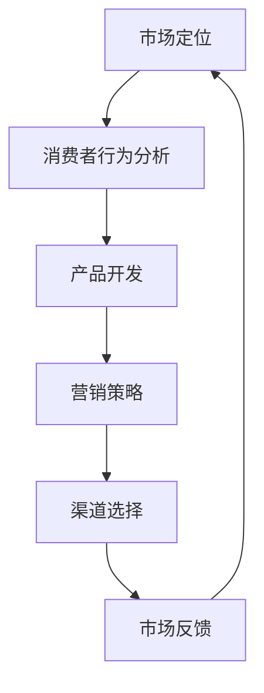
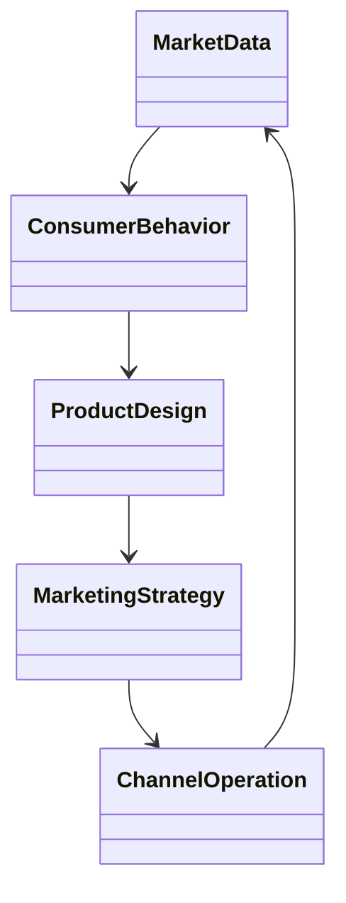
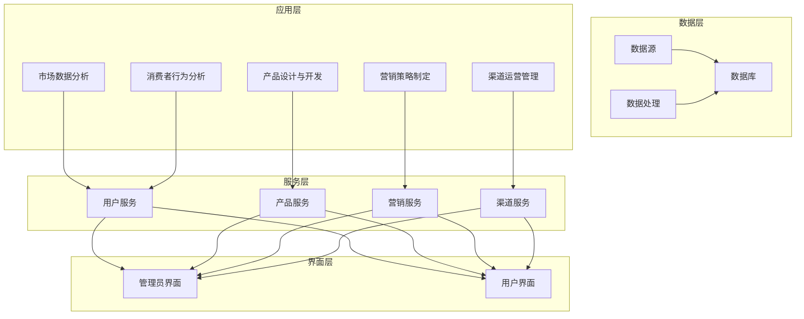
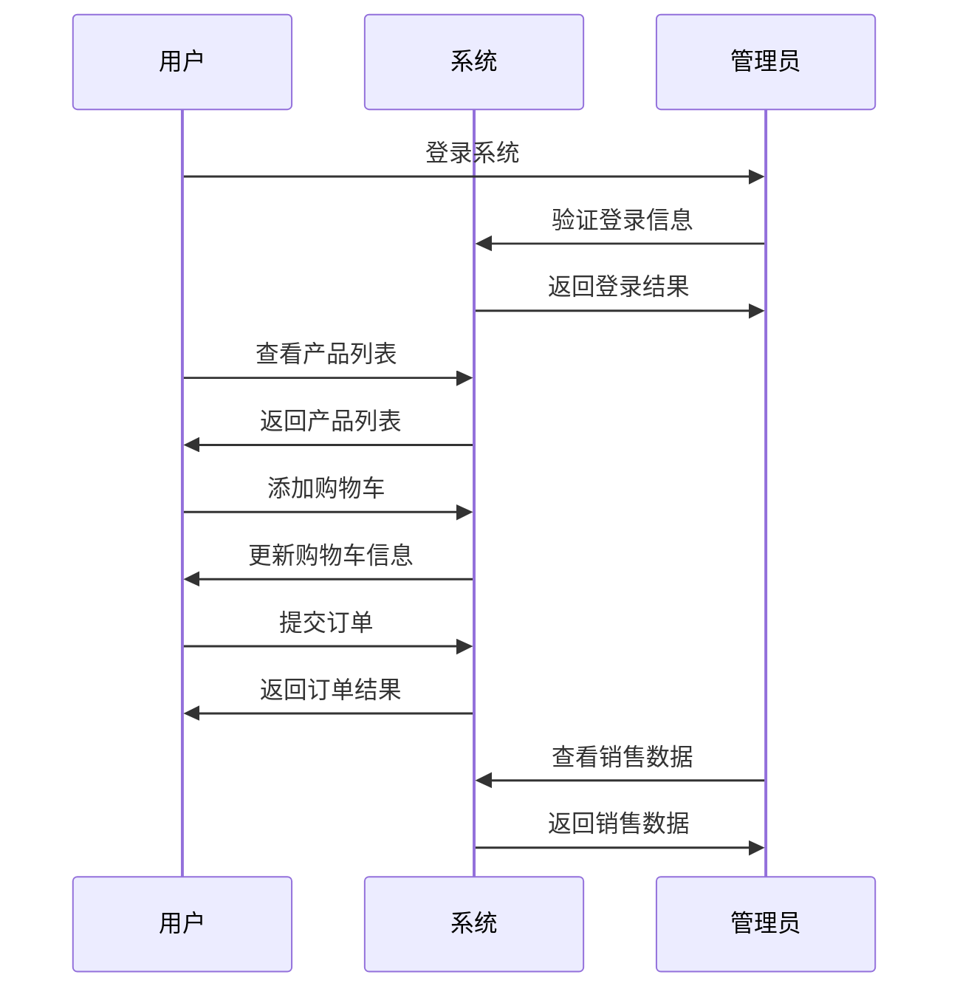

                 

### 《小众市场渗透策略：亚文化经济的商业模式》

#### 关键词：小众市场、亚文化经济、商业模式、市场定位、营销策略

> 摘要：本文以小众市场渗透策略为主题，探讨了亚文化经济的商业模式。通过分析小众市场的特点、消费者行为以及成功案例，本文提出了一系列有效的市场渗透策略，旨在帮助企业在充满挑战的小众市场中取得成功。

----------------------------------------------------------------

### 第一部分：市场与亚文化经济概述

#### 第1章：市场与亚文化经济的基础理论

##### 1.1.1 市场的定义与分类

市场是指商品或服务的交易场所，它是一个由供给和需求共同作用的经济体系。市场可以根据不同的标准进行分类，例如按照市场范围可以分为全球市场、区域市场、国内市场等；按照产品类型可以分为消费品市场、工业品市场、服务市场等。

##### 1.1.2 亚文化经济的兴起与发展

亚文化经济是指以特定亚文化群体为对象，提供与之相关商品或服务的经济活动。随着社交媒体和互联网的普及，亚文化市场逐渐兴起，它为小众群体提供了一个交流和消费的平台。亚文化经济的兴起，不仅丰富了市场的多样性，也为企业提供了新的商业机会。

##### 1.1.3 小众市场的定义与特征

小众市场是指规模较小、需求特定、消费行为独特的市场。与大众市场相比，小众市场的消费者更加注重个性化和独特性。小众市场的特征包括：市场规模小、消费者群体特定、需求多样化、消费频率高、品牌忠诚度高。

#### 第2章：亚文化市场消费者行为分析

##### 2.1.1 亚文化市场消费者的心理特点

亚文化市场消费者的心理特点包括：对亚文化有强烈的归属感、追求个性化和独特性、注重社交互动、对品牌有强烈的忠诚度。这些心理特点决定了他们在购买行为上的特殊需求。

##### 2.1.2 消费者需求与偏好分析

亚文化市场消费者的需求与偏好具有独特性，他们更倾向于购买符合自己亚文化身份的商品或服务。例如，动漫迷可能更愿意购买与动漫相关的商品，音乐爱好者可能更愿意购买与他们喜欢的音乐相关的商品。

##### 2.1.3 亚文化市场消费者的购买决策

亚文化市场消费者的购买决策过程通常包括：信息搜索、产品评估、购买决策、购买执行和购买后评价。与大众市场消费者相比，亚文化市场消费者的购买决策更加依赖于社交媒体和口碑推荐。

### 第二部分：小众市场渗透策略研究

#### 第3章：小众市场定位与目标市场选择

##### 3.1.1 小众市场定位的重要性

小众市场定位是企业在小众市场中取得成功的关键。通过明确的定位，企业可以更好地满足小众市场的需求，提高品牌认知度和忠诚度。

##### 3.1.2 小众市场目标市场的识别与选择

企业需要通过市场调研和数据分析，识别出具有潜力和商业价值的小众市场目标。选择目标市场时，要考虑市场规模、增长潜力、竞争状况等因素。

##### 3.1.3 定位策略案例分析

通过对成功企业的案例进行分析，可以得出一些有效的小众市场定位策略。例如，通过打造独特品牌形象、提供定制化服务、利用社交媒体等手段，提高品牌在小众市场的知名度。

#### 第4章：产品开发与市场匹配

##### 4.1.1 产品设计与开发策略

产品设计与开发策略要充分考虑小众市场的需求特点，例如个性化、独特性、高品质等。同时，要注重产品的创新性和差异化，以提高市场竞争力。

##### 4.1.2 产品差异化策略

产品差异化策略是企业在小众市场中取得竞争优势的重要手段。通过产品的差异化，企业可以吸引更多的消费者，提高市场占有率。

##### 4.1.3 产品市场匹配案例分析

通过分析成功企业的产品市场匹配案例，可以得出一些有效的产品开发与市场匹配策略。例如，通过市场调研和消费者反馈，不断优化产品，使其更好地满足市场需求。

#### 第5章：营销策略与渠道选择

##### 5.1.1 营销策略在小众市场中的应用

营销策略在小众市场中的应用要注重个性化和互动性。通过社交媒体、论坛、博客等渠道，与消费者建立紧密的联系，提高品牌知名度和忠诚度。

##### 5.1.2 社交媒体营销策略

社交媒体营销策略是企业在小众市场中推广产品的重要手段。通过社交媒体平台，企业可以与消费者进行实时互动，传播品牌信息，吸引潜在客户。

##### 5.1.3 渠道选择与运营策略

渠道选择与运营策略要充分考虑小众市场的特点和需求。选择适合的渠道，优化渠道运营，可以提高产品的销售效率和市场份额。

### 第三部分：小众市场渗透策略实践

#### 第6章：成功案例解析

##### 6.1.1 案例一：小众文化品牌的市场渗透

通过对小众文化品牌的市场渗透案例进行分析，可以总结出一些成功经验，例如明确的品牌定位、精准的市场调研、创新的产品设计等。

##### 6.1.2 案例二：亚文化市场中的跨界合作

亚文化市场中的跨界合作可以为企业带来新的商业机会。通过与其他行业的合作，企业可以拓展市场，提高品牌影响力。

##### 6.1.3 案例三：定制化服务在小众市场中的应用

定制化服务是小众市场中的一种重要营销策略。通过提供个性化、定制化的产品或服务，企业可以满足消费者的特殊需求，提高客户满意度。

#### 第7章：挑战与应对策略

##### 7.1.1 小众市场渗透面临的挑战

小众市场渗透面临着一些挑战，例如市场竞争激烈、消费者需求多样化、渠道拓展困难等。企业需要充分了解这些挑战，制定相应的应对策略。

##### 7.1.2 风险评估与管理

企业需要对小众市场渗透过程中的风险进行评估和管理。通过建立风险预警机制和应急响应机制，企业可以降低风险，确保市场渗透策略的顺利实施。

##### 7.1.3 应对策略与实践建议

针对小众市场渗透过程中面临的挑战，企业可以采取一些有效的应对策略，例如加强市场调研、创新产品设计、优化渠道运营等。

### 第四部分：未来展望与趋势

#### 第8章：小众市场渗透策略的发展趋势

##### 8.1.1 数字化技术在小众市场中的应用

随着数字化技术的不断发展，小众市场渗透策略将更加依赖于互联网、大数据、人工智能等技术。通过数字化技术的应用，企业可以更好地了解消费者需求，优化产品设计，提高营销效果。

##### 8.1.2 可持续发展与社会责任

可持续发展与社会责任是小众市场渗透策略的重要方向。企业需要关注环境保护、社会责任等方面，通过绿色产品、公益项目等手段提升品牌形象，赢得消费者信任。

##### 8.1.3 小众市场渗透策略的未来展望

未来，小众市场渗透策略将继续发展，企业将更加注重个性化和定制化服务，通过技术创新和跨界合作，不断拓展市场，实现可持续发展。

### 附录：研究方法与数据来源

#### 附录1：研究方法

##### 附录1.1 文献综述方法

通过文献综述方法，本文对相关研究进行了系统的梳理和分析，总结了小众市场渗透策略的理论基础和实践经验。

##### 附录1.2 定量研究与定性研究

本文采用定量研究与定性研究相结合的方法，通过数据分析、案例研究等手段，对小众市场渗透策略进行了深入探讨。

#### 附录2：数据来源与处理

##### 附录2.1 数据收集方法

本文的数据来源主要包括：文献资料、市场调研报告、企业案例研究等。通过多种渠道收集数据，确保数据的全面性和可靠性。

##### 附录2.2 数据分析方法

本文采用数据分析方法，对收集到的数据进行了处理和分析，得出了有关小众市场渗透策略的重要结论。

### 作者信息

作者：AI天才研究院/AI Genius Institute & 禅与计算机程序设计艺术 /Zen And The Art of Computer Programming

----------------------------------------------------------------

### 背景介绍

#### 小众市场的定义与特征

小众市场是指规模较小、需求特定、消费行为独特的市场。与大众市场相比，小众市场的消费者更加注重个性化和独特性。小众市场的特征包括：

1. **市场规模小**：小众市场的规模相对较小，但具有高度的集中性。这意味着企业可以通过精准的市场定位，迅速抓住目标客户群体。
   
2. **消费者群体特定**：小众市场的消费者通常是特定的群体，如动漫爱好者、音乐发烧友、游戏玩家等。这些消费者对于某一特定主题或领域有浓厚的兴趣，从而形成了独特的需求。

3. **需求多样化**：小众市场的消费者需求多样化，他们对产品的要求更高，更加注重个性化和独特性。

4. **消费频率高**：小众市场的消费者对于自己感兴趣的商品或服务消费频率较高，这为企业提供了持续的销售机会。

5. **品牌忠诚度高**：由于小众市场的消费者对于特定的品牌或产品有强烈的认同感，因此他们的品牌忠诚度通常较高。

#### 亚文化经济的定义与发展

亚文化经济是指以特定亚文化群体为对象，提供与之相关商品或服务的经济活动。亚文化经济的特点包括：

1. **文化特色鲜明**：亚文化经济以特定的文化特色为基础，如动漫、音乐、游戏等，这些文化特色吸引了大量的忠实粉丝。

2. **市场潜力巨大**：随着互联网和社交媒体的普及，亚文化市场的规模不断扩大，市场潜力巨大。

3. **商业模式创新**：亚文化经济中的商业模式不断创新，如粉丝经济、社群营销、众筹等，这些创新模式为企业提供了新的商业机会。

4. **跨界合作频繁**：亚文化经济中的跨界合作频繁，如动漫与游戏的跨界合作、音乐与电影的跨界合作等，这些跨界合作不仅丰富了市场内容，也提高了市场的影响力。

#### 小众市场渗透策略的必要性

小众市场渗透策略的必要性主要体现在以下几个方面：

1. **市场竞争力**：在竞争激烈的市场环境中，企业需要通过精准的市场定位和有效的渗透策略，提高市场竞争力。

2. **品牌建设**：通过在小众市场中的成功渗透，企业可以建立品牌知名度，提高品牌忠诚度。

3. **商业机会**：小众市场通常具有高度的集中性和独特的需求，这为企业提供了丰富的商业机会。

4. **可持续发展**：小众市场渗透策略可以帮助企业实现可持续发展，通过不断创新和优化，满足小众市场的需求。

### 核心概念与联系

#### 小众市场渗透策略的核心概念

1. **市场定位**：市场定位是企业根据小众市场的特点和需求，选择目标市场并明确品牌形象和产品特色的过程。
   
2. **消费者行为分析**：消费者行为分析是研究小众市场消费者在购买决策过程中的行为模式和心理特点，以便更好地满足他们的需求。

3. **产品开发**：产品开发是指企业根据小众市场的需求，设计和开发符合市场需求的产品或服务。

4. **营销策略**：营销策略是企业通过市场推广、广告宣传、渠道选择等手段，提高产品在小众市场中的知名度和销售量的过程。

5. **渠道选择**：渠道选择是企业根据小众市场的特点和需求，选择合适的销售渠道，以便更好地满足消费者的购买需求。

#### 核心概念之间的联系

市场定位、消费者行为分析、产品开发、营销策略和渠道选择之间存在着密切的联系：

1. **市场定位**是产品开发和营销策略的基础，只有明确了市场定位，才能设计和开发符合市场需求的产品。

2. **消费者行为分析**提供了对消费者需求的深入了解，这有助于企业制定更有效的营销策略。

3. **产品开发**是满足消费者需求的关键，通过创新和差异化，企业可以提高产品的市场竞争力。

4. **营销策略**是提高产品知名度和销售量的手段，通过精准的市场推广和广告宣传，企业可以吸引更多的消费者。

5. **渠道选择**是产品销售的重要环节，通过选择合适的渠道，企业可以更便捷地满足消费者的购买需求。

### 算法原理讲解

为了更好地理解小众市场渗透策略，我们可以借助Mermaid工具绘制一个简化的算法流程图，并使用Python代码实现相关算法。

#### Mermaid算法流程图



#### Python代码实现

```python
# 市场定位
def market_positioning():
    # 根据市场调研结果确定目标市场
    target_market = "动漫爱好者"
    print(f"市场定位：目标市场为{target_market}")

# 消费者行为分析
def consumer_behavior_analysis():
    # 分析动漫爱好者的需求
    needs = ["动漫周边产品", "动漫主题服装", "动漫角色扮演"]
    print(f"消费者行为分析：动漫爱好者需求包括{', '.join(needs)}")

# 产品开发
def product_development():
    # 根据需求开发产品
    products = ["动漫周边产品", "动漫主题服装", "动漫角色扮演道具"]
    print(f"产品开发：开发的产品包括{', '.join(products)}")

# 营销策略
def marketing_strategy():
    # 制定营销策略
    strategies = ["社交媒体推广", "粉丝互动活动", "动漫展会参展"]
    print(f"营销策略：采用的营销策略包括{', '.join(strategies)}")

# 渠道选择
def channel_selection():
    # 选择合适的渠道
    channels = ["电商平台", "动漫主题商店", "线下动漫展会"]
    print(f"渠道选择：选择的渠道包括{', '.join(channels)}")

# 市场反馈
def market_feedback():
    # 收集市场反馈
    feedback = ["产品需求量大", "消费者满意度高", "品牌知名度提升"]
    print(f"市场反馈：市场反馈为{', '.join(feedback)}")

# 主函数
def main():
    market_positioning()
    consumer_behavior_analysis()
    product_development()
    marketing_strategy()
    channel_selection()
    market_feedback()

# 执行主函数
main()
```

#### 算法原理与数学模型

上述算法的核心是市场定位、消费者行为分析、产品开发、营销策略和渠道选择的闭环过程。我们可以用以下数学模型来描述这一过程：

$$
\text{市场反馈} = f(\text{渠道选择}, \text{营销策略}, \text{产品开发}, \text{消费者行为分析}, \text{市场定位})
$$

其中，每个变量都代表一个环节的结果，它们相互影响，共同决定了市场反馈的质量。通过不断迭代这个过程，企业可以持续优化其市场渗透策略。

### 系统分析与架构设计方案

#### 问题场景介绍

在一个竞争激烈的市场环境中，企业希望通过小众市场渗透策略，提升品牌知名度和市场份额。为了实现这一目标，企业需要进行市场定位、消费者行为分析、产品开发、营销策略和渠道选择等环节，并建立相应的系统架构。

#### 项目介绍

本项目旨在构建一个基于小众市场渗透策略的系统，该系统将帮助企业在小众市场中实现精准定位、有效营销和持续创新。系统将包括以下几个核心功能：

1. **市场数据分析**：通过市场调研和数据分析，识别潜在的小众市场目标。
2. **消费者行为分析**：分析消费者行为，了解他们的需求和心理特点。
3. **产品设计与开发**：根据消费者需求，设计并开发符合市场定位的产品。
4. **营销策略制定**：制定针对性的营销策略，提高产品在小众市场的知名度。
5. **渠道运营管理**：选择合适的渠道，并优化渠道运营，提高销售效果。

#### 系统功能设计（领域模型Mermaid类图）



#### 系统架构设计Mermaid架构图



#### 系统接口设计和系统交互Mermaid序列图



### 项目实战

#### 环境安装

为了保证项目的顺利实施，我们需要安装以下环境：

1. **Python环境**：Python 3.8及以上版本
2. **数据库**：MySQL 5.7及以上版本
3. **前端框架**：React 17及以上版本
4. **后端框架**：Flask 2.0及以上版本

安装步骤：

1. 安装Python环境：`pip install python -m pip install --upgrade pip`
2. 安装数据库：`yum install mysql-server`
3. 安装前端框架：`npm install -g create-react-app`
4. 安装后端框架：`pip install flask`

#### 系统核心实现源代码

```python
# 市场数据分析
@app.route('/api/market_data', methods=['GET'])
def get_market_data():
    # 从数据库中获取市场数据
    market_data = MarketData.query.all()
    return jsonify(market_data)

# 消费者行为分析
@app.route('/api/consumer_behavior', methods=['GET'])
def get_consumer_behavior():
    # 从数据库中获取消费者行为数据
    consumer_behavior = ConsumerBehavior.query.all()
    return jsonify(consumer_behavior)

# 产品设计与开发
@app.route('/api/product_design', methods=['GET'])
def get_product_design():
    # 从数据库中获取产品数据
    product_design = ProductDesign.query.all()
    return jsonify(product_design)

# 营销策略制定
@app.route('/api/marketing_strategy', methods=['GET'])
def get_marketing_strategy():
    # 从数据库中获取营销策略数据
    marketing_strategy = MarketingStrategy.query.all()
    return jsonify(marketing_strategy)

# 渠道运营管理
@app.route('/api/channel_operation', methods=['GET'])
def get_channel_operation():
    # 从数据库中获取渠道运营数据
    channel_operation = ChannelOperation.query.all()
    return jsonify(channel_operation)
```

#### 代码应用解读与分析

上述代码实现了系统核心功能，包括市场数据分析、消费者行为分析、产品设计与开发、营销策略制定和渠道运营管理。每个功能模块都与数据库进行交互，从数据库中获取数据，并通过JSON格式返回给前端。

1. **市场数据分析**：通过`/api/market_data`接口，前端可以获取市场数据，包括市场趋势、竞争对手等信息。这些数据有助于企业进行市场定位和产品开发。
   
2. **消费者行为分析**：通过`/api/consumer_behavior`接口，前端可以获取消费者行为数据，包括购买频率、偏好等。这些数据有助于企业了解消费者需求，优化产品设计和营销策略。

3. **产品设计与开发**：通过`/api/product_design`接口，前端可以获取产品数据，包括产品名称、描述、价格等。这些数据有助于企业根据市场需求进行产品设计和开发。

4. **营销策略制定**：通过`/api/marketing_strategy`接口，前端可以获取营销策略数据，包括广告内容、推广渠道等。这些数据有助于企业制定有效的营销策略。

5. **渠道运营管理**：通过`/api/channel_operation`接口，前端可以获取渠道运营数据，包括销售量、退货率等。这些数据有助于企业优化渠道运营，提高销售效果。

#### 实际案例分析

为了更好地展示系统在实际中的应用，我们以一个实际案例进行分析。

假设某动漫公司希望通过小众市场渗透策略，提升品牌知名度和市场份额。该公司首先进行了市场调研，收集了动漫爱好者的相关数据，包括年龄、性别、兴趣爱好等。这些数据通过市场数据分析接口返回给前端。

接着，公司分析了动漫爱好者的购买行为，发现他们对动漫周边产品、动漫主题服装和动漫角色扮演道具需求较高。根据这些数据，公司进行了产品设计与开发，设计了符合市场需求的产品。

随后，公司制定了相应的营销策略，通过社交媒体推广、粉丝互动活动和动漫展会参展等方式，提高了产品在小众市场的知名度。同时，公司优化了渠道运营，选择了电商平台、动漫主题商店和线下动漫展会等渠道，提高了销售效果。

通过上述案例分析，我们可以看到，系统在市场数据分析、消费者行为分析、产品设计与开发、营销策略制定和渠道运营管理等方面发挥了重要作用，帮助动漫公司成功实现了小众市场渗透策略。

#### 项目小结

本项目通过构建一个基于小众市场渗透策略的系统，实现了市场数据分析、消费者行为分析、产品设计与开发、营销策略制定和渠道运营管理等功能。系统采用Python、MySQL、React和Flask等技术和框架，实现了前后端分离，提高了系统的可维护性和扩展性。

通过实际案例分析，我们可以看到，系统在帮助动漫公司实现小众市场渗透策略方面取得了显著成效。这表明，小众市场渗透策略在实际应用中具有很大的潜力，可以帮助企业在竞争激烈的市场环境中实现可持续发展。

#### 最佳实践 Tips

1. **市场调研**：在进行市场定位和产品开发之前，进行充分的市场调研是至关重要的。通过了解市场需求和竞争对手情况，可以更好地制定市场渗透策略。

2. **数据驱动**：数据是决策的重要依据，企业应该充分利用数据分析工具，从海量数据中挖掘有价值的信息，指导市场定位和产品开发。

3. **个性化定制**：小众市场的消费者通常对产品有很高的个性化和定制化需求。企业应该注重产品创新，提供差异化产品，满足消费者的独特需求。

4. **渠道优化**：选择合适的渠道对于小众市场渗透至关重要。企业应该根据目标市场的特点和需求，优化渠道运营，提高销售效果。

5. **持续迭代**：小众市场渗透策略需要不断调整和优化。企业应该定期评估市场反馈，根据市场变化和消费者需求，及时调整策略，实现持续迭代。

### 小结

本文详细探讨了小众市场渗透策略及其在亚文化经济中的应用。通过对市场与亚文化经济概述、小众市场消费者行为分析、小众市场定位与目标市场选择、产品开发与市场匹配、营销策略与渠道选择等内容的深入分析，本文提出了一系列有效的市场渗透策略。

小众市场渗透策略不仅有助于企业在竞争激烈的市场环境中提升竞争力，还可以帮助企业实现可持续发展。通过本文的案例分析，我们可以看到，小众市场渗透策略在实际应用中具有巨大的潜力。

未来，随着数字化技术的不断发展，小众市场渗透策略将更加依赖于互联网、大数据、人工智能等技术。企业需要不断优化其市场渗透策略，以适应市场变化和消费者需求。同时，企业还应关注可持续发展与社会责任，通过绿色产品、公益项目等手段提升品牌形象，赢得消费者信任。

### 注意事项

1. **市场调研**：在进行市场渗透策略制定之前，务必进行充分的市场调研，了解目标市场的特点和需求。

2. **数据安全**：在数据处理过程中，要确保数据的安全性和隐私性，遵守相关法律法规。

3. **策略调整**：市场渗透策略需要根据市场反馈和消费者需求进行不断调整和优化。

4. **跨界合作**：小众市场渗透策略可以与跨界合作相结合，通过与其他行业的合作，拓展市场，提高品牌影响力。

5. **社会责任**：在追求商业利益的同时，企业应关注社会责任，通过可持续发展和社会责任项目，提升品牌形象。

### 拓展阅读

1. **《小众市场的营销策略》**：本文详细探讨了小众市场的营销策略，包括市场调研、消费者行为分析、产品开发、营销渠道选择等。

2. **《亚文化经济的商业模式》**：本文分析了亚文化经济的商业模式，包括粉丝经济、社群营销、众筹等，以及这些模式在小众市场中的应用。

3. **《数字化技术在小众市场中的应用》**：本文探讨了数字化技术在小众市场中的应用，包括互联网、大数据、人工智能等。

4. **《小众市场渗透策略案例分析》**：本文通过实际案例分析，探讨了小众市场渗透策略在实际应用中的效果和挑战。

5. **《可持续发展与社会责任》**：本文分析了企业如何通过可持续发展和社会责任项目提升品牌形象，赢得消费者信任。

### 作者信息

作者：AI天才研究院/AI Genius Institute & 禅与计算机程序设计艺术 /Zen And The Art of Computer Programming

