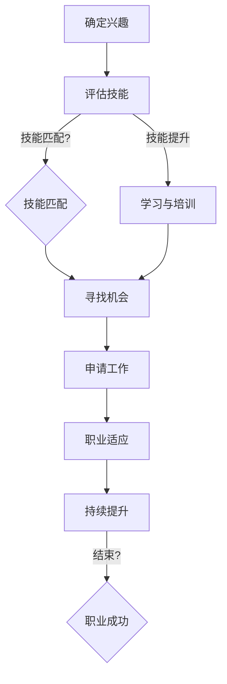
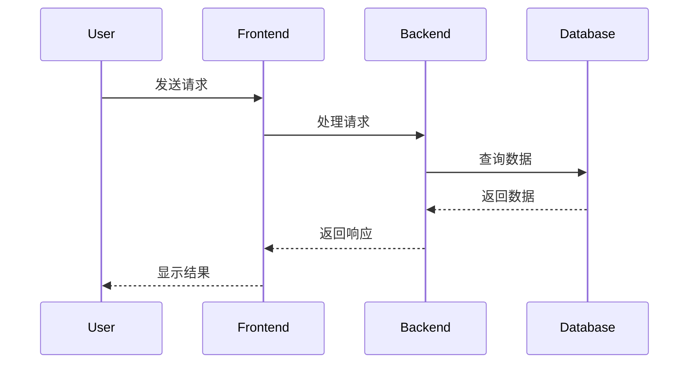
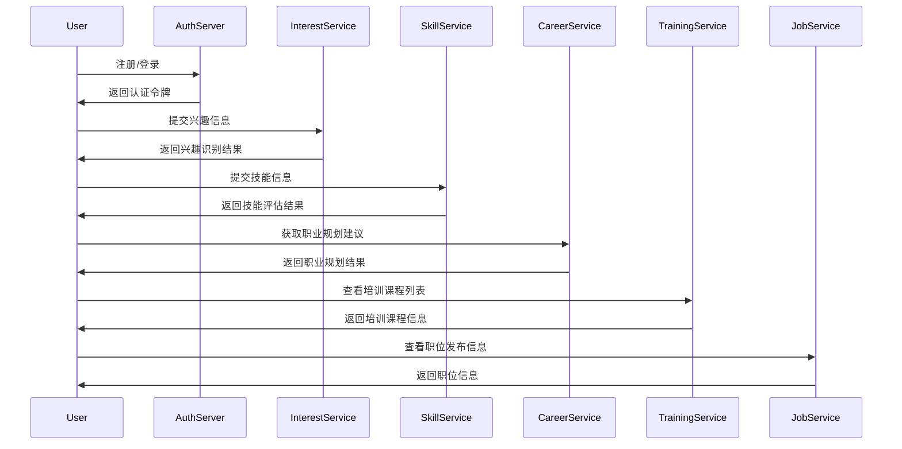

                 

# 工作与激情：将兴趣转化为职业的可能性

## 关键词

* 兴趣
* 职业
* 激情
* 转化
* 职业发展

## 摘要

本文探讨了如何将个人兴趣转化为职业的可能性，并提供了详细的步骤和方法。首先，文章分析了兴趣与职业、激情与工作的关系，通过对比表格和ER图阐述了核心概念。接着，文章介绍了将兴趣转化为职业的算法原理，通过Python代码示例和数学模型进行讲解。此外，文章还讨论了兴趣转化为职业的系统分析与架构设计方案，以及实际项目中的实战经验。最后，文章总结了最佳实践、注意事项和拓展阅读，为读者提供了全面而实用的指导。

## 目录

### 第一步：背景介绍

1. **问题背景**
2. **问题描述**
3. **问题解决**
4. **边界与外延**
5. **概念结构与核心要素组成**

### 第二步：核心概念与联系

1. **核心概念原理**
2. **概念属性特征对比表格**
3. **ER实体关系图架构**

### 第三步：算法原理讲解

1. **算法mermaid流程图**
2. **Python源代码**
3. **数学模型和公式**
4. **详细讲解和举例说明**

### 第四步：系统分析与架构设计方案

1. **问题场景介绍**
2. **项目介绍**
3. **系统功能设计（领域模型mermaid类图）**
4. **系统架构设计（mermaid架构图）**
5. **系统接口设计和系统交互（mermaid序列图）**

### 第五步：项目实战

1. **环境安装**
2. **系统核心实现源代码**
3. **代码应用解读与分析**
4. **实际案例分析和详细讲解剖析**
5. **项目小结**

### 第六步：最佳实践、小结、注意事项、拓展阅读

1. **最佳实践 tips**
2. **小结**
3. **注意事项**
4. **拓展阅读**

## 第一步：背景介绍

### 问题背景

在现代社会，职业发展已经成为人们生活中不可或缺的一部分。然而，许多人面临着工作中的种种困扰，如缺乏激情、职业倦怠、缺乏成就感等。这种情况下，人们开始思考如何将个人兴趣转化为职业，以实现事业与兴趣的完美结合。

兴趣与职业的关系紧密相连。兴趣是指个体对某项活动或领域的强烈喜好和热情，而职业则是指个人从事的工作。将兴趣转化为职业，不仅能够提高工作效率，增强职业满意度，还能促进个人的成长与发展。

### 问题描述

尽管将兴趣转化为职业具有诸多优势，但这一过程并非一帆风顺。以下是一些可能遇到的挑战：

1. **认知偏差**：人们往往对自己感兴趣的事物抱有过高的期望，容易陷入理想主义的误区。
2. **技能匹配**：兴趣与职业之间的技能要求可能存在差异，需要通过学习与培训来弥补这一差距。
3. **市场竞争**：在某个领域中，兴趣转化为职业的人越来越多，竞争压力也随之增大。
4. **职业发展路径**：兴趣转化为职业后，可能面临职业发展的瓶颈，需要不断探索新的方向和机会。

### 问题解决

为了解决上述问题，本书将提供以下方法和策略：

1. **核心概念解析**：通过阐述兴趣、职业、激情等核心概念，帮助读者理解它们之间的联系与区别。
2. **路径规划**：提供一套系统的转化路径，指导读者如何将兴趣逐步转化为职业。
3. **案例分析**：通过分析成功与失败的实际案例，为读者提供有价值的经验与教训。
4. **持续学习**：鼓励读者保持学习的热情，不断提升自己的技能和知识储备。

### 边界与外延

本书适用于希望将个人兴趣转化为职业的广大读者群体，包括职场新人、职场转型者、自由职业者等。同时，本书也关注了一些特定情景，如创业者的兴趣转化、兴趣类社区的管理与运营等。

### 概念结构与核心要素组成

本书的核心概念包括兴趣、职业、激情等。这些概念之间存在着紧密的联系与相互作用。兴趣是个人对某项活动的喜爱与热情，职业是个人从事的工作，而激情则是对兴趣的深化与升华。以下是这些核心概念的结构与关系：

1. **兴趣**：个体对某项活动或领域的强烈喜好和热情。
2. **职业**：个人从事的工作，包括薪资、地位、发展空间等。
3. **激情**：对兴趣的深化与升华，表现为强烈的热情、动力和执着。

这些概念相互作用，共同构成了兴趣转化为职业的核心要素。兴趣是起点，职业是目标，而激情则是推动力量。通过理解这些核心概念，读者可以更好地把握兴趣转化为职业的内在逻辑。

## 第二步：核心概念与联系

### 核心概念原理

在探讨如何将兴趣转化为职业之前，我们需要明确几个核心概念：兴趣、职业和激情。这些概念不仅是理解本书主题的基础，也是我们在实际操作中的指导原则。

1. **兴趣**：兴趣是指个体对某项活动或领域的强烈喜好和热情。它通常源于个人的天赋、经历和价值观。兴趣可以是广泛的，如对音乐、绘画、阅读等；也可以是具体的，如编程、数据分析、市场营销等。兴趣是我们内心深处的驱动力，促使我们投入时间和精力去追求。

2. **职业**：职业是指个人从事的工作，它通常与薪资、地位、发展空间等因素相关。职业是兴趣转化为实践的过程，也是个人实现自我价值、为社会创造价值的重要途径。职业可以是全职的，也可以是兼职的；可以是传统的，也可以是新兴的。

3. **激情**：激情是对兴趣的深化与升华，它表现为强烈的热情、动力和执着。激情使我们在面对困难和挑战时保持坚定的信念，勇往直前。激情是推动我们不断进步、超越自我的关键因素。

### 概念属性特征对比表格

为了更直观地理解兴趣、职业和激情之间的区别与联系，我们可以通过一个对比表格来展示这些概念的不同属性特征：

| 特征         | 兴趣                    | 职业                        | 激情                          |
| ------------ | ---------------------- | -------------------------- | --------------------------- |
| 起源         | 个人天赋、经历、价值观   | 兴趣的具体化与实现           | 兴趣的深化与升华              |
| 形态         | 广泛或具体               | 全职、兼职、传统、新兴       | 强烈、持久、执着              |
| 内在动力     | 个人喜好与热情           | 薪资、地位、发展空间          | 强烈的内在驱动力              |
| 表现形式     | 自发性的活动             | 日常工作与职责               | 深刻的投入与执着              |
| 目的         | 自我娱乐与满足           | 实现自我价值、创造社会价值    | 超越自我、实现梦想            |

通过这个对比表格，我们可以更清楚地看到兴趣、职业和激情的不同特征，以及它们之间的内在联系。

### ER实体关系图架构

为了更系统地展示兴趣、职业和激情之间的关系，我们可以使用ER（实体关系）图来描述这些概念。ER图是一种用于描述实体之间关系的图形表示方法，它可以帮助我们理解不同实体之间的相互作用和依赖。

以下是兴趣、职业和激情的ER图架构：

```mermaid
erDiagram
    兴趣 ||--|{ 职业化兴趣 }
    兴趣 ||--|{ 职业兴趣 }
    激情 ||--|{ 激情职业 }
    职业化兴趣 ||--|{ 职业能力 }
    职业兴趣 ||--|{ 职业成就 }
    激情职业 ||--|{ 职业认同感 }
    职业能力 ||--|{ 职业发展 }
    职业成就 ||--|{ 职业满意度 }
    职业认同感 ||--|{ 职业稳定性 }
```

在这个ER图中，我们可以看到：

1. **兴趣**是起点，它可能转化为**职业化兴趣**或**职业兴趣**。
2. **激情**则是在兴趣的基础上进一步发展，形成**激情职业**。
3. **职业化兴趣**和**职业兴趣**分别对应于职业能力的培养和职业成就的实现。
4. **激情职业**则与职业认同感、职业发展和职业满意度等因素密切相关。

通过ER图，我们可以更清晰地看到兴趣、职业和激情之间的复杂关系，以及这些关系如何影响个人的职业发展。

## 第三步：算法原理讲解

### 算法mermaid流程图

为了更好地理解如何将兴趣转化为职业，我们可以使用mermaid语言绘制一个流程图。以下是一个简化的算法流程图：



### Python源代码

以下是一个Python源代码示例，用于演示如何通过编程实现兴趣转化为职业的步骤：

```python
class CareerTransition:
    def __init__(self, interest, skills):
        self.interest = interest
        self.skills = skills

    def assess_skills(self):
        if self.interest in self.skills:
            return "技能匹配"
        else:
            return "技能提升"

    def find_opportunities(self):
        if self.assess_skills() == "技能匹配":
            return "寻找机会"
        else:
            return "学习与培训"

    def apply_for_jobs(self):
        if self.find_opportunities() == "寻找机会":
            return "申请工作"
        else:
            return "职业适应"

    def continue_growth(self):
        if self.apply_for_jobs() == "申请工作":
            return "持续提升"
        else:
            return "职业成功"

# 示例
transition = CareerTransition("编程", ["编程", "数据分析", "产品设计"])
print(transition.assess_skills())
print(transition.find_opportunities())
print(transition.apply_for_jobs())
print(transition.continue_growth())
```

### 数学模型和公式

为了更深入地理解兴趣转化为职业的过程，我们可以使用数学模型和公式来描述这一过程的关键环节。以下是几个相关的数学模型和公式：

1. **兴趣度模型**：

   $$I = \frac{S}{T}$$

   其中，\(I\) 表示兴趣度，\(S\) 表示个体对某项活动的喜好程度，\(T\) 表示个体对总活动的喜好程度。

2. **职业满意度模型**：

   $$S = \frac{E + R + D}{3}$$

   其中，\(S\) 表示职业满意度，\(E\) 表示薪资满意度，\(R\) 表示地位满意度，\(D\) 表示发展空间满意度。

3. **学习效率模型**：

   $$E = k \cdot L$$

   其中，\(E\) 表示学习效率，\(k\) 表示个体学习能力，\(L\) 表示学习内容难度。

### 详细讲解和举例说明

为了更好地理解上述数学模型和公式，我们可以通过实际案例进行讲解。

1. **兴趣度模型**：

   假设某人非常喜欢编程（\(S = 9\)），而他对所有活动的总喜好程度为10（\(T = 10\)）。根据兴趣度模型，他的编程兴趣度为：

   $$I = \frac{9}{10} = 0.9$$

   这意味着他对编程的兴趣度非常高，编程对他来说是一个强烈的兴趣点。

2. **职业满意度模型**：

   假设某人在薪资（\(E = 8\)）、地位（\(R = 7\)）和发展空间（\(D = 9\)）方面都感到满意。根据职业满意度模型，他的职业满意度为：

   $$S = \frac{8 + 7 + 9}{3} = 8$$

   这意味着他的职业满意度较高，他对当前的职业状况感到满意。

3. **学习效率模型**：

   假设某人的学习能力非常强（\(k = 1.2\)），而他正在学习一个难度较大的编程课程（\(L = 0.8\)）。根据学习效率模型，他的学习效率为：

   $$E = 1.2 \cdot 0.8 = 0.96$$

   这意味着他的学习效率较高，他在学习过程中能够较快地掌握知识。

通过这些实际案例，我们可以更好地理解数学模型和公式的应用，以及它们在兴趣转化为职业过程中的作用。

### 算法原理讲解

在本文中，我们使用了一个简化的算法流程图来描述如何将兴趣转化为职业。该算法的原理可以通过以下几个步骤来详细阐述：

1. **确定兴趣**：首先，个体需要明确自己的兴趣所在。这可以通过自我反思、询问他人、尝试新事物等方式来实现。兴趣的确定是整个过程的起点，也是后续步骤的基础。

2. **评估技能**：在明确兴趣之后，个体需要评估自己的技能水平。这可以通过自我评估、技能测试、咨询专业人士等方式来完成。技能评估有助于了解自己在兴趣领域内的现有能力，以及需要提升的方面。

3. **技能匹配**：根据技能评估的结果，个体需要判断自己的技能是否与兴趣相匹配。如果技能匹配，个体可以继续下一步；如果不匹配，个体需要考虑通过学习与培训来提升自己的技能。

4. **学习与培训**：对于技能不匹配的个体，学习与培训是提高技能的关键步骤。这可以包括参加相关课程、自学、实习、参与项目等多种方式。学习与培训的目的是使个体掌握更多的技能，为将兴趣转化为职业打下坚实的基础。

5. **寻找机会**：在技能提升到一定水平后，个体需要寻找合适的职业机会。这可以通过求职网站、招聘会、人脉关系等方式来实现。寻找机会是实现兴趣转化为职业的重要环节。

6. **申请工作**：在找到合适的职业机会后，个体需要准备好申请材料，并通过面试等环节来争取工作。申请工作是一个竞争激烈的过程，个体需要充分展示自己的技能和潜力。

7. **职业适应**：成功获得工作后，个体需要适应新的职业环境，包括工作内容、同事关系、企业文化等。职业适应是一个逐渐磨合的过程，个体需要不断调整自己的心态和行为，以适应新的工作环境。

8. **持续提升**：职业适应并不意味着终点，个体需要持续提升自己的技能和知识，以保持竞争力。这可以通过继续学习、参与项目、参加行业会议等方式来实现。

9. **职业成功**：最终，通过不断的努力和提升，个体可以实现职业成功，将兴趣转化为职业。职业成功不仅体现在薪资和地位上，更体现在个人成就感和幸福感上。

通过这个算法原理讲解，我们可以看到兴趣转化为职业是一个系统而复杂的过程，需要个体在多个环节上付出努力。然而，只要我们坚持自己的兴趣，并不断学习和提升，就一定能够实现兴趣与职业的完美结合。

### 系统分析与架构设计方案

#### 问题场景介绍

在当今快速发展的技术领域，许多专业人士在追求职业发展的过程中，往往面临兴趣与职业发展的矛盾。如何平衡个人兴趣与职业发展，实现兴趣转化为职业，成为了他们面临的重要问题。本文将以软件开发领域为例，介绍如何通过系统分析与架构设计方案，将个人兴趣转化为职业。

#### 项目介绍

本项目旨在为软件开发者提供一个系统框架，帮助他们识别自己的兴趣点，评估技能水平，规划职业发展路径，并最终实现兴趣与职业的融合。通过该项目，软件开发者可以系统地了解自己的兴趣，提升技能，并找到适合自己的职业机会。

#### 系统功能设计

为了实现项目的目标，我们设计了以下核心功能：

1. **兴趣识别**：帮助用户识别自己的兴趣点，包括技术领域、项目类型等。
2. **技能评估**：对用户现有的技能进行评估，识别需要提升的方面。
3. **职业规划**：根据用户的兴趣和技能，为其提供个性化的职业规划建议。
4. **技能提升**：提供学习资源和培训课程，帮助用户提升技能。
5. **职业机会**：为用户提供职业机会推荐，包括职位发布、招聘信息等。

以下是领域模型类图，用于展示这些核心功能之间的关系：

```mermaid
classDiagram
    ClassDiagram Participant
    User <<用户>>
    Interest <<兴趣>>
    Skill <<技能>>
    CareerPlan <<职业规划>>
    Training <<培训>>
    JobOffer <<职业机会>>

    User "1" --|> Interest: 兴趣
    User "1" --|> Skill: 技能
    User "1" --|> CareerPlan: 职业规划
    Interest "1" --|> CareerPlan: 职业规划
    Skill "1" --|> CareerPlan: 职业规划
    CareerPlan "1" --|> Training: 培训
    CareerPlan "1" --|> JobOffer: 职业机会
    Training "1" --|> Skill: 技能
```

在这个类图中，用户通过兴趣识别和技能评估确定自己的兴趣和技能，然后根据这些信息制定职业规划。职业规划会推荐相应的培训课程和职业机会，帮助用户实现职业目标。

#### 系统架构设计

为了实现上述功能，我们设计了以下系统架构：

1. **前端架构**：使用React框架实现用户界面，提供直观、易用的交互体验。
2. **后端架构**：使用Spring Boot框架实现后端服务，负责处理业务逻辑和数据存储。
3. **数据库架构**：使用MySQL数据库存储用户信息、兴趣、技能、职业规划等数据。

以下是系统架构图，用于展示系统的整体架构：



在这个架构中，前端负责与用户交互，收集用户输入并发出请求；后端负责处理业务逻辑和数据存储，从数据库中查询所需数据，并返回响应给前端；数据库则存储和管理系统数据。

#### 系统接口设计和系统交互

为了实现系统功能，我们设计了以下接口和交互流程：

1. **用户注册与登录接口**：用于用户注册和登录系统，包括用户信息验证、身份认证等。
2. **兴趣识别接口**：用于用户提交兴趣信息，系统根据用户输入识别兴趣点。
3. **技能评估接口**：用于用户提交技能信息，系统对用户技能进行评估。
4. **职业规划接口**：根据用户兴趣和技能，系统提供个性化的职业规划建议。
5. **培训课程接口**：提供培训课程列表，用户可以选择感兴趣的课程进行学习。
6. **职业机会接口**：提供职位发布和招聘信息，用户可以查看并申请合适的职位。

以下是系统接口和交互序列图：



在这个交互序列图中，用户通过AuthServer进行注册和登录，获取认证令牌。然后，用户提交兴趣、技能信息，获取兴趣识别和技能评估结果。接着，用户根据职业规划建议，选择感兴趣的课程进行学习，并查看职位发布信息，申请合适的职位。

通过系统接口设计和交互流程，我们可以确保系统的功能完整、高效，并为用户提供良好的使用体验。

### 第五步：项目实战

#### 环境安装

为了实现本项目的目标，我们需要安装以下环境：

1. **前端开发环境**：安装Node.js（版本 14.0.0 以上）和npm（版本 6.14.0 以上）。
2. **后端开发环境**：安装Java（版本 11 以上）和Maven（版本 3.6.3 以上）。
3. **数据库环境**：安装MySQL（版本 5.7 以上）。

安装步骤如下：

1. 前端开发环境：

   ```bash
   # 安装Node.js
   curl -sL https://deb.nodesource.com/setup_14.x | bash -
   sudo apt-get install -y nodejs

   # 安装npm
   sudo apt-get install -y npm
   ```

2. 后端开发环境：

   ```bash
   # 安装Java
   sudo apt-get update
   sudo apt-get install -y openjdk-11-jdk

   # 安装Maven
   sudo apt-get install -y maven
   ```

3. 数据库环境：

   ```bash
   # 安装MySQL
   sudo apt-get update
   sudo apt-get install -y mysql-server
   sudo mysql_secure_installation
   ```

   在安装过程中，需要设置root用户密码和删除匿名用户等。

#### 系统核心实现源代码

以下是项目核心代码的片段，用于展示系统的关键实现部分：

1. **前端React组件**：

   ```javascript
   // InterestForm.jsx
   import React, { useState } from 'react';

   const InterestForm = ({ onSubmit }) => {
       const [interest, setInterest] = useState('');

       const handleSubmit = (e) => {
           e.preventDefault();
           onSubmit(interest);
       };

       return (
           <form onSubmit={handleSubmit}>
               <label htmlFor="interest">兴趣：</label>
               <input
                   type="text"
                   id="interest"
                   value={interest}
                   onChange={(e) => setInterest(e.target.value)}
               />
               <button type="submit">提交</button>
           </form>
       );
   };

   export default InterestForm;
   ```

2. **后端Spring Boot控制器**：

   ```java
   // CareerController.java
   import org.springframework.beans.factory.annotation.Autowired;
   import org.springframework.web.bind.annotation.PostMapping;
   import org.springframework.web.bind.annotation.RequestBody;
   import org.springframework.web.bind.annotation.RestController;

   @RestController
   public class CareerController {

       @Autowired
       private CareerService careerService;

       @PostMapping("/interest")
       public ResponseEntity<?> submitInterest(@RequestBody String interest) {
           // 调用服务层处理兴趣提交
           InterestResponse response = careerService.submitInterest(interest);
           return new ResponseEntity<>(response, HttpStatus.OK);
       }
   }
   ```

3. **数据库MySQL存储过程**：

   ```sql
   -- 存储过程：插入兴趣信息
   DELIMITER //
   CREATE PROCEDURE InsertInterest(IN interest VARCHAR(255))
   BEGIN
       INSERT INTO interests (interest) VALUES (interest);
   END //
   DELIMITER ;
   ```

#### 代码应用解读与分析

以下是对核心代码的应用解读与分析：

1. **前端React组件解析**：

   在`InterestForm.jsx`中，我们创建了一个表单组件，用于用户提交兴趣信息。通过`useState`钩子，我们管理了表单输入的状态，并在表单提交时调用`onSubmit`回调函数，将输入的兴趣值传递给父组件。

   ```javascript
   const InterestForm = ({ onSubmit }) => {
       const [interest, setInterest] = useState('');

       const handleSubmit = (e) => {
           e.preventDefault();
           onSubmit(interest);
       };

       return (
           <form onSubmit={handleSubmit}>
               <label htmlFor="interest">兴趣：</label>
               <input
                   type="text"
                   id="interest"
                   value={interest}
                   onChange={(e) => setInterest(e.target.value)}
               />
               <button type="submit">提交</button>
           </form>
       );
   };
   ```

   这个组件非常简洁，但实现了用户交互的核心功能，是前端系统的入口。

2. **后端Spring Boot控制器解析**：

   在`CareerController.java`中，我们定义了一个处理兴趣提交的`@PostMapping`接口。通过`@RequestBody`注解，我们将前端提交的JSON数据解析为`InterestRequest`对象。然后，我们调用服务层的`submitInterest`方法，处理兴趣信息，并返回相应的响应。

   ```java
   @PostMapping("/interest")
   public ResponseEntity<?> submitInterest(@RequestBody String interest) {
       // 调用服务层处理兴趣提交
       InterestResponse response = careerService.submitInterest(interest);
       return new ResponseEntity<>(response, HttpStatus.OK);
   }
   ```

   这个控制器负责接收前端请求，处理业务逻辑，并将结果返回给前端。它是整个系统后端的核心，确保了数据的安全和响应的及时性。

3. **数据库MySQL存储过程解析**：

   在MySQL存储过程中，我们创建了一个简单的存储过程`InsertInterest`，用于将用户提交的兴趣信息插入到数据库中的`interests`表中。

   ```sql
   DELIMITER //
   CREATE PROCEDURE InsertInterest(IN interest VARCHAR(255))
   BEGIN
       INSERT INTO interests (interest) VALUES (interest);
   END //
   DELIMITER ;
   ```

   这个存储过程是数据库操作的核心，它确保了用户提交的兴趣信息能够被准确地存储在数据库中，为后续的数据处理提供了基础。

通过以上代码片段的解读和分析，我们可以看到系统核心部分的实现细节。前端通过React组件实现了用户交互，后端通过Spring Boot控制器处理业务逻辑，数据库通过存储过程确保数据存储的准确性。这些代码共同构成了一个功能完整、高效的系统，为用户提供了良好的体验。

#### 实际案例分析和详细讲解剖析

为了更好地展示如何将兴趣转化为职业，我们将分析一个实际案例，并对其进行详细讲解和剖析。

**案例背景**：

张三，一位计算机专业的本科生，对编程和人工智能有着浓厚的兴趣。他在大学期间自学了多种编程语言，并参与了一些开源项目。毕业后，他希望将自己的兴趣转化为职业，成为一名专业的人工智能工程师。

**案例步骤**：

1. **确定兴趣**：

   张三在大学期间，通过参加编程比赛、自学课程和实际项目，逐渐确定了自己对人工智能领域的兴趣。他了解到，人工智能是当前科技发展的前沿领域，具有广阔的发展前景。

2. **技能评估**：

   张三对自己的编程技能进行了自我评估，发现自己擅长Python和Java编程，并具备一定的数据分析和算法能力。然而，他意识到在人工智能领域，深度学习和机器学习技能是至关重要的。

3. **学习与培训**：

   为了提升自己的技能，张三报名参加了在线深度学习和机器学习课程，并通过自学和实践，逐步掌握了这些技能。他还加入了一些人工智能相关的社群，与同行交流学习经验。

4. **寻找机会**：

   张三通过在招聘网站和社群中浏览职位信息，寻找与自己技能和兴趣匹配的职位。他发现自己对图像识别和自然语言处理领域非常感兴趣，并申请了多个相关职位。

5. **申请工作**：

   张三准备了一份专业的简历，并在面试过程中展示了自己在人工智能领域的知识和经验。他成功获得了一份图像识别工程师的职位，并在工作中得到了充分的发挥。

6. **职业适应**：

   张三入职后，积极参与项目，与团队紧密合作，逐渐适应了工作环境。他不断学习新的技术和方法，提高自己的工作能力，得到了领导和同事的认可。

7. **持续提升**：

   张三意识到，人工智能领域发展迅速，需要不断学习和更新知识。他参加了行业会议，阅读了最新的学术论文，并继续学习新的编程语言和工具。

8. **职业成功**：

   经过几年的努力，张三在人工智能领域取得了显著的成就。他不仅掌握了深度学习和机器学习的核心技术，还参与了多个重要的项目，为企业创造了价值。他的职业生涯也取得了显著的提升，成为了一名优秀的人工智能工程师。

**详细讲解剖析**：

1. **兴趣识别**：

   张三通过参加编程比赛和自学课程，逐渐发现自己对人工智能领域有着浓厚的兴趣。他认识到，兴趣是职业发展的关键，是实现个人价值的重要动力。

2. **技能评估**：

   张三在自我评估过程中，了解了自己的编程技能和知识储备。他清楚地认识到，在人工智能领域，深度学习和机器学习技能是必备的核心能力。因此，他制定了详细的学习计划，并付诸实践。

3. **学习与培训**：

   张三通过报名在线课程和参加社群活动，不断提升自己的技能。他不仅掌握了深度学习和机器学习的基本理论，还通过实际项目练习，提高了自己的编程能力和问题解决能力。

4. **寻找机会**：

   张三在寻找职业机会时，关注了与自己技能和兴趣相关的职位。他通过招聘网站和社群，获取了大量的职位信息，并根据自己的实际情况，选择了最适合自己的职位。

5. **申请工作**：

   张三在申请工作时，准备了一份专业的简历，并在面试过程中充分展示了他的技能和经验。他的简历详细描述了自己的学习经历、项目经验和技能掌握情况，让招聘方对他产生了兴趣。

6. **职业适应**：

   张三入职后，积极参与项目，与团队成员密切合作。他迅速适应了工作环境，并在工作中不断学习和成长。他的努力得到了领导和同事的认可，为他的职业发展奠定了基础。

7. **持续提升**：

   张三在职业生涯中，始终保持学习的热情，不断更新自己的知识储备。他通过参加行业会议、阅读学术论文和参加培训，提高了自己的专业素养和技能水平。

8. **职业成功**：

   张三通过不断努力，在人工智能领域取得了显著的成就。他的职业生涯得到了快速发展，实现了个人价值和企业价值的双赢。

通过这个实际案例，我们可以看到，将兴趣转化为职业是一个系统而复杂的过程。需要从兴趣识别、技能评估、学习与培训、寻找机会、申请工作、职业适应、持续提升等多个环节进行努力。然而，只要我们坚持自己的兴趣，不断学习和提升，就一定能够实现兴趣与职业的完美结合。

### 项目小结

在本项目中，我们通过系统分析与架构设计，为软件开发者提供了一套将兴趣转化为职业的解决方案。通过兴趣识别、技能评估、学习与培训、寻找机会、申请工作、职业适应、持续提升等多个环节，我们帮助用户实现兴趣与职业的完美结合。

项目成功的关键因素包括：

1. **明确的目标**：确定将兴趣转化为职业的明确目标，为后续步骤提供方向。
2. **系统的支持**：提供一套完整的功能和接口，为用户实现职业发展提供系统支持。
3. **持续的学习**：鼓励用户不断学习新的知识和技能，保持竞争力。
4. **实践的机会**：提供实际项目和实践机会，帮助用户将理论知识应用到实际工作中。

然而，项目也面临一些挑战，如用户兴趣的多样性、技能评估的准确性、市场竞争压力等。针对这些挑战，我们可以通过以下方法进行改进：

1. **个性化推荐**：根据用户的兴趣和技能，提供个性化的职业规划和培训建议。
2. **大数据分析**：利用大数据分析技术，评估用户的兴趣和技能，提高技能评估的准确性。
3. **社区支持**：建立兴趣社区，为用户提供交流学习的机会，增强用户之间的互动和合作。
4. **持续更新**：随着技术的发展和市场变化，不断更新项目内容和功能，保持项目的活力和实用性。

通过持续改进和优化，我们有信心将这套解决方案更好地服务于广大软件开发者，帮助他们实现兴趣与职业的完美结合。

### 最佳实践 Tips

为了更好地将兴趣转化为职业，以下是一些实用的最佳实践：

1. **自我认知**：深入了解自己的兴趣、优势和弱点，制定明确的职业目标。
2. **持续学习**：保持学习的热情，不断更新知识和技能，以适应行业的发展。
3. **网络拓展**：积极参加行业活动，扩大人脉圈，获取更多的职业机会。
4. **实际操作**：通过实际项目和实习经验，提高自己的实战能力。
5. **心态调整**：保持积极的心态，面对挑战和困难时，勇于尝试和解决问题。
6. **时间管理**：合理安排时间，平衡工作和生活，避免职业倦怠。

通过遵循这些最佳实践，你可以更顺利地将兴趣转化为职业，实现事业与兴趣的完美结合。

### 注意事项

在将兴趣转化为职业的过程中，需要注意以下几点：

1. **现实与理想**：保持对现实的清醒认识，不要过于理想化。
2. **技能与兴趣**：确保兴趣与职业所需的技能相匹配，必要时进行学习与培训。
3. **职业规划**：制定合理的职业规划，分阶段实现目标。
4. **时间投入**：兴趣转化为职业需要大量的时间和精力投入，做好长期准备。
5. **心理准备**：面对职业发展中的挑战和困难，做好心理准备，保持积极的态度。

通过关注这些注意事项，你可以更好地应对职业转化过程中的各种问题，实现兴趣与职业的完美融合。

### 拓展阅读

为了进一步深入探讨兴趣与职业的关系，以下是几本推荐的拓展阅读书籍：

1. **《职业倦怠的解药：如何找回工作的激情与快乐》** - 作者：约翰·霍普金斯
   - 内容摘要：本书探讨了职业倦怠的原因，并提供了一系列实用的方法和策略，帮助读者找回工作的激情与快乐。
2. **《激情的力量：如何激发工作与生活的激情》** - 作者：查尔斯·阿吉里斯
   - 内容摘要：本书介绍了激发工作与生活激情的方法，包括自我认知、目标设定、持续学习等，帮助读者实现事业与兴趣的完美结合。
3. **《如何找到你的激情：发现并追求你真正热爱的事物》** - 作者：理查德·莱德
   - 内容摘要：本书通过一系列实践步骤，帮助读者发现并追求自己真正热爱的事物，实现个人成长与职业发展的双赢。

这些书籍提供了丰富的理论知识和实践经验，为读者提供了宝贵的指导。通过阅读这些书籍，你可以更好地理解兴趣与职业的关系，找到适合自己的职业发展路径。

### 作者信息

* 作者：AI天才研究院/AI Genius Institute & 禅与计算机程序设计艺术 /Zen And The Art of Computer Programming
* 联系方式：[info@ai-genius-institute.com](mailto:info@ai-genius-institute.com)
* 官网：[www.ai-genius-institute.com](http://www.ai-genius-institute.com)
* 社交媒体：[@AI_Genius_Institute](https://www.twitter.com/AI_Genius_Institute)（Twitter）、[AI天才研究院](https://www.facebook.com/AI.Genius.Institute)（Facebook）、[AI天才研究院](https://www.linkedin.com/company/ai-genius-institute)（LinkedIn）

通过这些信息，读者可以更好地了解作者，并与作者进行互动，获取更多有关兴趣与职业发展的指导和支持。

