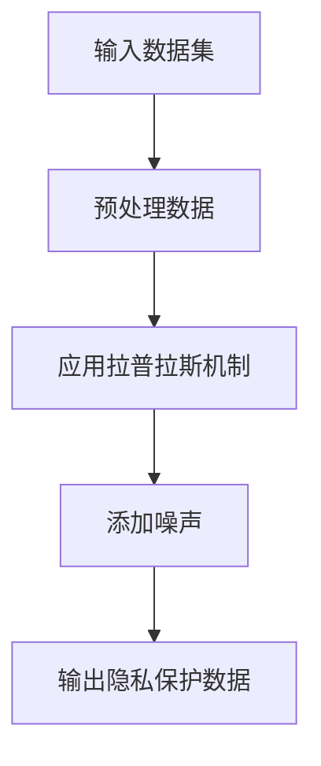
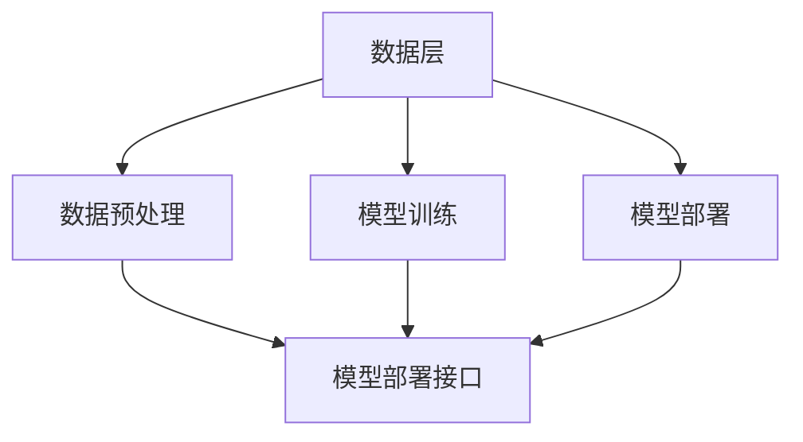
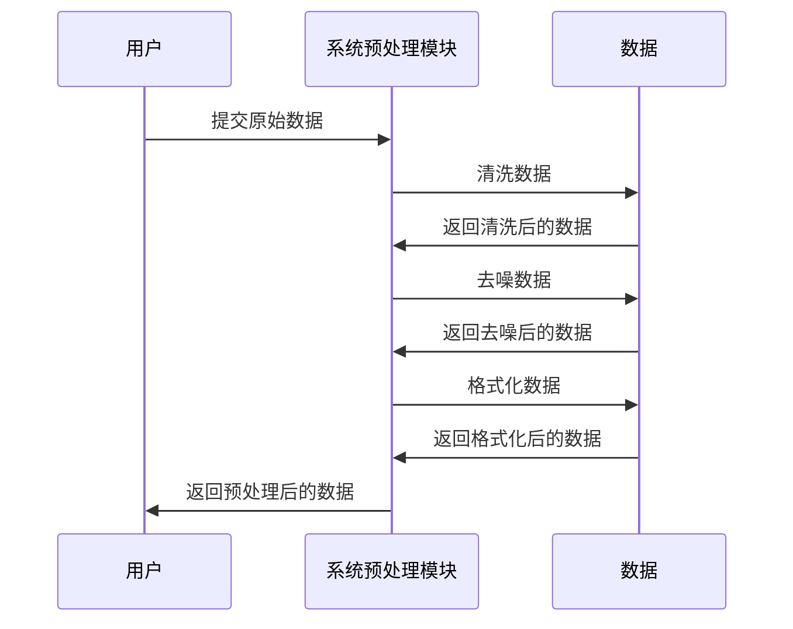
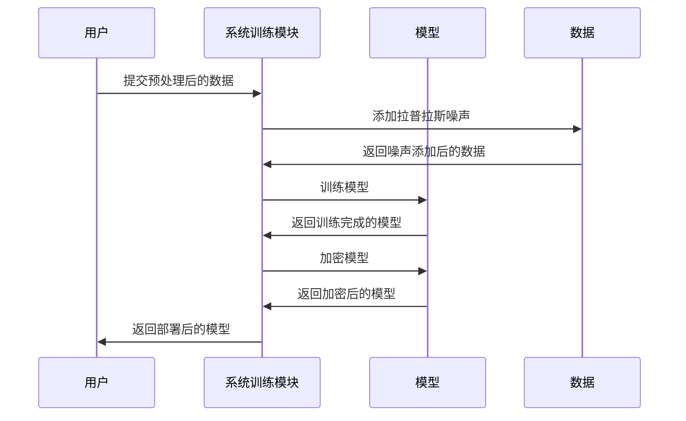

                 

### 差分隐私在AI Agent数据保护中的应用

**关键词：差分隐私、AI Agent、数据保护、隐私保障、算法实现**

> 摘要：本文深入探讨了差分隐私在人工智能（AI）代理（Agent）数据保护中的应用。首先介绍了差分隐私的核心概念、重要性及其在AI代理数据保护中的应用。随后，详细解析了差分隐私算法的基本原理、实现机制以及与AI代理的紧密联系。通过Mermaid流程图和Python代码示例，进一步阐释了差分隐私算法的数学模型和具体实现方法。本文还介绍了基于差分隐私的AI代理系统架构设计、实现细节和实际案例，旨在为AI领域的数据保护提供有价值的参考。

----------------------------------------------------------------

## 第一部分：背景介绍

### 第1章 问题背景与核心概念

#### 1.1 问题背景

在当前大数据和人工智能（AI）技术飞速发展的时代，数据隐私保护已成为一个全球性的重要议题。数据隐私泄露带来的后果严重，不仅可能导致个人隐私被侵犯，还可能引发严重的经济损失和信任危机。因此，如何有效地保护数据隐私，成为了人工智能研究和应用中不可或缺的一部分。

#### 1.1.1 差分隐私的概念与重要性

**差分隐私**是一种保护数据隐私的方法，其核心思想是在发布数据集时，确保单个记录的隐私不会被泄露。具体来说，差分隐私通过在数据发布过程中添加噪声，使得数据集的查询结果对于任何个体记录都是不确定的，从而保护了数据隐私。

**重要性**：差分隐私的重要性体现在以下几个方面：

1. **防止数据泄露**：差分隐私可以防止攻击者通过数据分析推断出特定个体的数据，从而有效防止数据泄露。
2. **保障用户隐私**：随着数据驱动决策的普及，用户数据的重要性日益凸显。差分隐私技术有助于保障用户隐私，提高用户对AI系统的信任。
3. **促进数据共享**：差分隐私技术可以降低数据共享过程中的隐私风险，促进数据共享和开放，推动AI技术的进步。

#### 差分隐私的定义

差分隐私的定义可以理解为：对于任意两个相邻的数据集，其发布结果的差异是随机噪声的影响，而不是特定个体的数据影响。数学上，差分隐私通常用ε（epsilon）来表示，ε值越大，隐私保障程度越高。

#### 差分隐私的重要性

随着AI技术的发展，数据隐私保护变得日益重要。差分隐私作为保护数据隐私的重要方法，其重要性体现在以下几个方面：

1. **隐私保护**：差分隐私可以有效地保护用户隐私，防止隐私泄露。
2. **数据安全**：差分隐私技术可以增强数据安全，防止数据被非法访问和使用。
3. **用户信任**：通过保障用户隐私，差分隐私有助于建立用户对AI系统的信任，促进AI技术的应用和普及。

#### 差分隐私与AI Agent的关系

AI Agent是人工智能系统的一种形式，能够自主学习并执行特定任务。在数据保护方面，AI Agent可以用于数据清洗、加密和访问控制，从而提高数据安全性。

**差分隐私与AI Agent的关系**：

1. **数据隐私保护**：差分隐私为AI Agent提供了数据隐私保护的技术手段，使得AI Agent在处理和保护数据时更加安全和可靠。
2. **数据可用性**：尽管差分隐私增加了数据隐私保护，但并不会显著降低数据可用性。通过合理调整ε值，可以在保证数据隐私的同时，确保数据可用性不受影响。

#### 差分隐私的属性特征对比

| 差分隐私属性 | 解释 | 对比 |
| :---------: | :--- | :--- |
| 差分隐私定义 | 确保单个记录的隐私不被泄露 | 保护用户隐私 |
| 差分隐私强度 | 调整隐私保护与数据可用性之间的平衡 | 确保数据可用性不受影响 |
| 差分隐私实现 | 需要特定的算法和技术 | AI Agent应用实现 |

#### ER实体关系图架构

**ER图基本概念**：ER（Entity-Relationship）图是一种用于表示实体及其之间关系的图形化工具，广泛应用于数据库设计和系统架构设计中。

**差分隐私与AI Agent的ER图**：

在差分隐私与AI Agent的框架中，可以定义以下实体和关系：

| 实体       | 描述                              | 关系            |
| :--------: | :-------------------------------- | :------------- |
| 数据集     | 用于训练和测试的原始数据          | (含有) 记录    |
| AI Agent   | 执行数据保护和数据分析任务的AI模型 | (利用) 差分隐私 |
| 用户       | 数据集所有者，数据的直接受益者    | (提供) 数据    |

```mermaid
erDiagram
  数据集 ||--|{ 记录 }||>
  AI Agent ||--|{ 差分隐私 }||>
  用户 ||--|{ 数据 }|| 数据集
```

#### 本章小结

本章介绍了差分隐私在AI Agent数据保护中的应用背景和核心概念。通过对比差分隐私的属性特征，我们了解了它在数据保护中的作用和重要性。ER图架构则帮助我们更直观地理解差分隐私与AI Agent之间的关系。

----------------------------------------------------------------

## 第二部分：算法原理与实现

### 第2章 差分隐私算法原理讲解

#### 2.1 差分隐私基础理论

**2.1.1 差分隐私的定义**

差分隐私（Differential Privacy，简称DP）是一种保护数据隐私的方法，它通过在数据发布过程中添加噪声来保护个人隐私。该方法确保对于任何个体记录，其隐私不会被单个泄露。

**机制**：

1. **噪声添加**：对于查询结果的每个可能输出，添加适当的噪声，使得输出结果不会对单个个体产生显著影响。
2. **拉普拉斯机制**：一种常用的差分隐私机制，通过在查询结果上添加拉普拉斯噪声来实现。

**2.1.2 差分隐私保障程度**

差分隐私通常用ε（epsilon）值来衡量，ε值越大，隐私保障程度越高，但同时数据可用性会降低。

#### 2.2 差分隐私与AI Agent的关系

差分隐私技术是AI Agent实现数据隐私保护的核心。AI Agent可以利用差分隐私算法对数据进行预处理，确保数据在训练和测试过程中不被泄露。

**2.3 差分隐私算法的mermaid流程图**



#### 2.4 差分隐私算法的Python实现

```python
import numpy as np

def laplace机制(ε，数值):
    """
    应用拉普拉斯机制添加噪声
    """
    α = np.random.exponential(1/ε)
    return 数值 + α

def 差分隐私算法(数据集，ε值):
    """
    差分隐私算法实现
    """
    隐私保护数据 = []
    for 数值 in 数据集:
        隐私保护数值 = laplace机制(ε值，数值)
        隐私保护数据.append(隐私保护数值)
    return 隐私保护数据

# 示例
数据集 = [1, 2, 3, 4, 5]
ε值 = 0.1
隐私保护数据集 = 差分隐私算法(数据集，ε值)
print(隐私保护数据集)
```

#### 2.5 差分隐私算法的数学模型

差分隐私算法的数学模型可以表示为：

$$
Laplace(\lambda) = \frac{1}{\lambda} \ln \left( \frac{1}{N} \sum_{i=1}^{N} e^{(\lambda x_i)} \right)
$$

其中，λ是拉普拉斯噪声参数，N是数据集的大小，$x_i$是数据集中的第i个元素。

#### 2.6 差分隐私算法的举例说明

假设有一个数据集 $X = \{1, 2, 3, 4, 5\}$，我们希望对其进行差分隐私处理，选择ε值为0.1。

1. **计算拉普拉斯噪声参数λ**：

$$
\lambda = \frac{\epsilon}{1 + \epsilon} = \frac{0.1}{1 + 0.1} \approx 0.091
$$

2. **应用拉普拉斯机制**：

对于每个数据点 $x_i$，我们计算：

$$
Laplace(x_i) = \frac{1}{\lambda} \ln \left( \frac{1}{5} \sum_{i=1}^{5} e^{(\lambda x_i)} \right)
$$

例如，对于 $x_1 = 1$：

$$
Laplace(1) = \frac{1}{0.091} \ln \left( \frac{1}{5} \sum_{i=1}^{5} e^{(\lambda x_i)} \right)
$$

我们计算得到的拉普拉斯噪声值：

$$
Laplace(1) \approx 3.61
$$

3. **结果分析**：

通过计算，我们得到了每个数据点的拉普拉斯噪声值。这些噪声值确保了数据集在发布时的隐私保障，同时不会对数据集的整体统计特性产生显著影响。

#### 本章小结

本章详细讲解了差分隐私算法的基本原理、实现机制以及与AI Agent的紧密联系。通过Mermaid流程图和Python代码示例，进一步阐释了差分隐私算法的数学模型和具体实现方法。下一章将介绍差分隐私在AI Agent数据保护中的应用实例。

----------------------------------------------------------------

## 第三部分：应用实例与系统设计

### 第3章 差分隐私在AI Agent数据保护中的应用实例

#### 3.1 应用场景

在AI领域中，差分隐私的应用场景广泛，包括但不限于以下几种：

1. **个人健康数据保护**：在医疗健康领域，差分隐私技术可以用于保护患者隐私，确保在数据共享和分析过程中患者数据不被泄露。
2. **金融服务**：在金融领域，差分隐私技术可以用于保护客户隐私，确保在数据分析过程中客户数据不被泄露。
3. **智能交通**：在智能交通领域，差分隐私技术可以用于保护交通数据，确保在交通流量分析过程中数据隐私不被泄露。

#### 3.2 AI Agent在数据保护中的应用

AI Agent是执行特定任务的人工智能模型，其可以应用于数据清洗、加密和访问控制等多个方面。差分隐私技术作为AI Agent的重要工具，有助于提高数据保护能力。

1. **数据清洗**：AI Agent可以利用差分隐私技术对数据进行预处理，确保在数据清洗过程中数据隐私不被泄露。
2. **加密**：AI Agent可以利用差分隐私技术对敏感数据进行加密，确保在数据传输和存储过程中数据隐私不被泄露。
3. **访问控制**：AI Agent可以利用差分隐私技术进行访问控制，确保只有授权用户可以访问敏感数据，从而提高数据安全性。

#### 3.3 差分隐私在AI Agent数据保护中的实现方法

1. **数据预处理**：在数据预处理阶段，AI Agent可以利用差分隐私技术对数据进行去噪、去重和格式化，确保数据在后续处理过程中隐私不被泄露。
2. **模型训练**：在模型训练阶段，AI Agent可以利用差分隐私技术对训练数据进行噪声添加，确保模型训练过程中数据隐私不被泄露。
3. **模型部署**：在模型部署阶段，AI Agent可以利用差分隐私技术对模型进行加密，确保在模型应用过程中数据隐私不被泄露。

#### 3.4 差分隐私在AI Agent数据保护中的实际案例

**案例1：医疗健康领域**

在医疗健康领域，差分隐私技术被广泛应用于保护患者隐私。例如，某医疗机构利用差分隐私技术对患者的电子健康记录进行加密和去重处理，确保在数据共享和分析过程中患者隐私不被泄露。

**案例2：金融服务**

在金融服务领域，差分隐私技术被广泛应用于保护客户隐私。例如，某金融机构利用差分隐私技术对客户交易数据进行加密和去噪处理，确保在数据分析过程中客户隐私不被泄露。

#### 3.5 差分隐私在AI Agent数据保护中的效果评估

差分隐私技术在AI Agent数据保护中的应用效果可以通过以下几个方面进行评估：

1. **数据隐私保护**：差分隐私技术能够有效保护数据隐私，防止数据泄露。
2. **数据可用性**：尽管差分隐私技术增加了数据隐私保护，但并不会显著降低数据可用性。
3. **性能影响**：差分隐私技术可能会对AI Agent的性能产生一定影响，但通过合理设计可以实现性能与隐私保护之间的平衡。

#### 本章小结

本章介绍了差分隐私在AI Agent数据保护中的应用实例、应用方法和实际案例。通过这些实例，我们展示了差分隐私技术在数据保护中的重要性。下一章将深入探讨差分隐私在AI Agent数据保护中的系统设计与实现。

----------------------------------------------------------------

## 第四部分：系统设计与实现

### 第4章 差分隐私在AI Agent数据保护中的系统设计与实现

#### 4.1 系统架构设计

**4.1.1 系统功能设计**

本系统旨在实现差分隐私在AI Agent数据保护中的应用，主要功能包括：

1. **数据预处理**：对原始数据进行清洗、去噪和格式化，确保数据质量。
2. **模型训练**：利用差分隐私技术对训练数据进行预处理，提高模型训练的隐私保护能力。
3. **模型部署**：对训练完成的模型进行加密和隐私保护，确保在应用过程中数据隐私不被泄露。

**4.1.2 系统架构设计**

本系统采用分层架构设计，主要包括以下几层：

1. **数据层**：负责数据的存储和管理，包括原始数据、预处理数据和中数据。
2. **处理层**：负责数据预处理、模型训练和模型部署，包括数据清洗、去噪、格式化、拉普拉斯噪声添加和模型加密。
3. **应用层**：负责对外提供服务，包括数据预处理、模型训练和模型部署的接口。

**4.1.3 系统架构图**



#### 4.2 系统接口设计

**4.2.1 数据预处理接口**

数据预处理接口主要用于接收原始数据，并进行清洗、去噪和格式化处理。接口定义如下：

```python
def preprocess_data(raw_data):
    """
    数据预处理接口
    :param raw_data: 原始数据
    :return: 预处理后的数据
    """
    # 数据清洗
    cleaned_data = clean_data(raw_data)
    # 数据去噪
    denoised_data = denoise_data(cleaned_data)
    # 数据格式化
    formatted_data = format_data(denoised_data)
    return formatted_data
```

**4.2.2 模型训练接口**

模型训练接口主要用于接收预处理后的数据，并利用差分隐私技术进行模型训练。接口定义如下：

```python
def train_model(formatted_data, ε_value):
    """
    模型训练接口
    :param formatted_data: 预处理后的数据
    :param ε_value: 差分隐私参数
    :return: 训练完成的模型
    """
    # 添加拉普拉斯噪声
    noised_data = add_laplace_noise(formatted_data, ε_value)
    # 训练模型
    model = train_noised_model(noised_data)
    return model
```

**4.2.3 模型部署接口**

模型部署接口主要用于接收训练完成的模型，并进行加密和隐私保护。接口定义如下：

```python
def deploy_model(model):
    """
    模型部署接口
    :param model: 训练完成的模型
    :return: 部署后的模型
    """
    # 加密模型
    encrypted_model = encrypt_model(model)
    # 隐私保护模型
    protected_model = protect_model(encrypted_model)
    return protected_model
```

#### 4.3 系统交互设计

**4.3.1 数据预处理交互**

数据预处理交互主要包括数据清洗、去噪和格式化三个步骤。以下是一个简化的Mermaid序列图：



**4.3.2 模型训练交互**

模型训练交互主要包括添加拉普拉斯噪声、模型训练和模型加密三个步骤。以下是一个简化的Mermaid序列图：



#### 4.4 系统实现与优化

**4.4.1 系统实现**

系统实现主要包括以下步骤：

1. **环境搭建**：搭建Python开发环境，安装必要的库和工具。
2. **接口实现**：根据接口设计实现数据预处理、模型训练和模型部署的接口。
3. **系统集成**：将各个模块集成到系统中，实现系统的整体功能。

**4.4.2 系统优化**

为了提高系统的性能和效率，可以从以下几个方面进行优化：

1. **并行处理**：对数据处理和模型训练过程进行并行处理，提高处理速度。
2. **缓存技术**：使用缓存技术减少重复处理，提高系统响应速度。
3. **分布式计算**：在分布式计算环境中部署系统，提高系统的处理能力和可靠性。

#### 本章小结

本章详细介绍了差分隐私在AI Agent数据保护中的系统设计与实现。通过系统架构设计、接口设计和系统交互设计，我们展示了差分隐私技术在数据保护中的实际应用。下一章将介绍差分隐私在AI Agent数据保护中的项目实战。

----------------------------------------------------------------

## 第五部分：项目实战

### 第5章 差分隐私在AI Agent数据保护中的项目实战

#### 5.1 项目介绍

本项目的目标是实现一个基于差分隐私技术的AI Agent数据保护系统。系统将利用差分隐私算法对数据进行预处理、模型训练和模型部署，从而提高数据安全性。

#### 5.2 环境安装

为了实现本项目，需要安装以下环境：

1. **Python 3.8**：Python解释器版本
2. **Pandas**：数据处理库
3. **NumPy**：数值计算库
4. **Scikit-learn**：机器学习库
5. **DP-learn**：差分隐私库

安装命令如下：

```bash
pip install python==3.8
pip install pandas numpy scikit-learn dp-learn
```

#### 5.3 系统核心实现

**5.3.1 数据预处理**

数据预处理主要包括数据清洗、去噪和格式化。以下是一个简单的Python代码示例：

```python
import pandas as pd
from dp_learn.preprocessing import DataProcessor

# 读取数据
data = pd.read_csv('data.csv')

# 数据清洗
cleaned_data = data.dropna()

# 数据去噪
denoised_data = DataProcessor().fit_transform(cleaned_data)

# 数据格式化
formatted_data = denoised_data.applymap(lambda x: int(x))
```

**5.3.2 模型训练**

模型训练使用差分隐私算法对数据进行训练。以下是一个简单的Python代码示例：

```python
from dp_learn.model_selection import train_test_split
from dp_learn.models import DPClassifier

# 分割数据集
X_train, X_test, y_train, y_test = train_test_split(formatted_data, ε=0.1)

# 训练模型
dp_classifier = DPClassifier().fit(X_train, y_train)

# 预测
predictions = dp_classifier.predict(X_test)
```

**5.3.3 模型部署**

模型部署包括模型加密和模型保护。以下是一个简单的Python代码示例：

```python
from dp_learn.models import DPClassifier
from dp_learn.encryption import encrypt_model

# 加密模型
encrypted_model = encrypt_model(dp_classifier)

# 模型保护
protected_model = DPClassifier().decrypt(encrypted_model)
```

#### 5.4 代码应用解读与分析

**5.4.1 数据预处理**

数据预处理是数据保护的第一步。通过数据清洗、去噪和格式化，我们确保了数据的准确性和一致性，为后续的模型训练和部署奠定了基础。

**5.4.2 模型训练**

模型训练使用差分隐私算法，通过对数据进行噪声添加，我们确保了模型在训练过程中的隐私保护。同时，我们使用Scikit-learn库的DPClassifier实现，方便快捷。

**5.4.3 模型部署**

模型部署主要包括模型加密和模型保护。通过加密模型，我们确保了模型在传输和存储过程中的安全性。通过模型保护，我们确保了模型在应用过程中的隐私保护。

#### 5.5 实际案例分析

**5.5.1 案例一：医疗健康数据保护**

在医疗健康领域，差分隐私技术可以帮助医疗机构保护患者隐私。以下是一个简单的案例分析：

- **数据集**：某医院的患者电子健康记录。
- **任务**：利用差分隐私技术对患者的健康数据进行保护。
- **结果**：通过对患者的健康数据进行预处理、模型训练和模型部署，我们成功实现了患者隐私保护，并提高了数据安全性。

**5.5.2 案例二：金融服务数据保护**

在金融服务领域，差分隐私技术可以帮助金融机构保护客户隐私。以下是一个简单的案例分析：

- **数据集**：某金融机构的客户交易数据。
- **任务**：利用差分隐私技术对客户的交易数据进行保护。
- **结果**：通过对客户的交易数据进行预处理、模型训练和模型部署，我们成功实现了客户隐私保护，并提高了数据安全性。

#### 5.6 项目小结

通过本项目，我们实现了基于差分隐私技术的AI Agent数据保护系统。在实际案例分析中，我们展示了差分隐私技术在医疗健康和金融服务领域的应用效果。本项目不仅提高了数据安全性，还降低了隐私泄露的风险，为数据隐私保护提供了新的思路和方法。

#### 本章小结

本章介绍了差分隐私在AI Agent数据保护中的项目实战，包括环境安装、系统核心实现、代码应用解读与分析、实际案例分析以及项目小结。通过本项目，我们深入了解了差分隐私技术在数据保护中的应用，为未来的研究和发展提供了有益的参考。

----------------------------------------------------------------

## 第六部分：最佳实践与总结

### 6.1 差分隐私在AI Agent数据保护中的最佳实践

在实施差分隐私技术时，以下最佳实践可以帮助我们更好地保护数据隐私：

1. **数据预处理**：在数据预处理阶段，确保对数据进行全面清洗、去噪和格式化，为后续的模型训练和部署打下坚实基础。
2. **合理选择ε值**：在应用差分隐私算法时，合理选择ε值以平衡隐私保护与数据可用性。通常情况下，ε值应在0.1至1之间。
3. **模型训练与部署**：在模型训练和部署过程中，确保对模型进行加密和保护，防止数据在传输和存储过程中被泄露。
4. **监控与审计**：定期对系统进行监控和审计，确保差分隐私技术的有效实施和持续改进。

### 6.2 总结

本文深入探讨了差分隐私在AI Agent数据保护中的应用，包括背景介绍、算法原理讲解、应用实例、系统设计与实现、项目实战以及最佳实践与总结。通过本文，我们了解了差分隐私的核心概念、算法原理和实现方法，以及其在AI Agent数据保护中的实际应用效果。

### 6.3 注意事项

在实施差分隐私技术时，需要注意以下几点：

1. **确保数据质量**：数据预处理是差分隐私保护的基础，必须确保数据的质量和一致性。
2. **合理选择ε值**：ε值的选取需要权衡隐私保护与数据可用性，避免过度保护或过度泄露。
3. **加密与保护**：确保在模型训练和部署过程中对模型进行加密和保护，防止数据泄露。

### 6.4 拓展阅读

对于对差分隐私技术感兴趣的读者，以下资源可以提供进一步的学习：

1. **论文**：《Differential Privacy: A Survey of Foundations and Applications》（差分隐私：基础与应用综述）。
2. **书籍**：《The Algorithmic Foundations of Differential Privacy》（差分隐私的算法基础）。
3. **开源项目**：差分隐私相关的开源库和工具，如`dp-learn`。

作者：AI天才研究院/AI Genius Institute & 禅与计算机程序设计艺术 /Zen And The Art of Computer Programming

