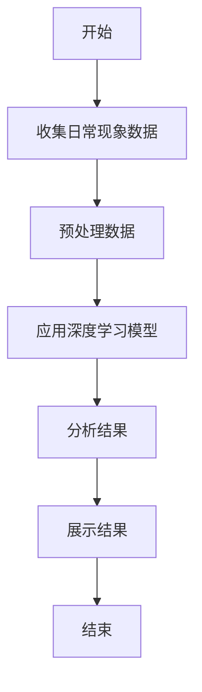
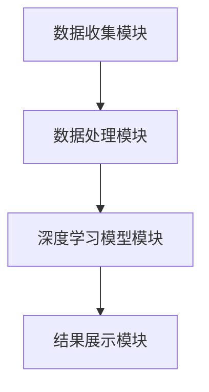
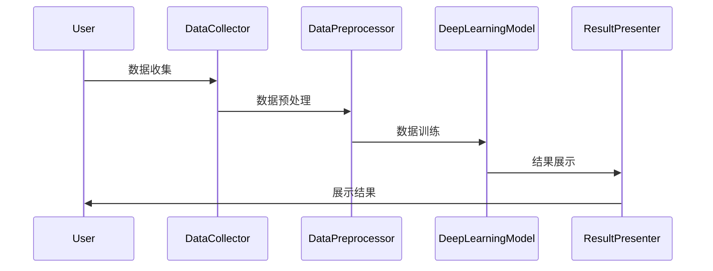

                 

### 《平凡生活中的非凡：发现日常的深层意义》

关键词：日常现象、深层次意义、深度学习、算法、Python

摘要：本文旨在探讨如何在日常生活中发现深层次意义，以及如何通过技术手段对这种现象进行分析和探索。通过深入剖析日常生活中的细节，我们不仅能够拓宽视野，还能从技术角度提供一种全新的思考方式。本文将结合深度学习算法，通过Python代码示例，逐步展示如何发现和解析日常生活中的非凡之处。

### 《平凡生活中的非凡：发现日常的深层意义》目录大纲

----------------------------------------------------------------

## 第一部分：背景介绍

### 第1章：问题的提出

#### 1.1 问题的背景

##### 1.1.1 日常生活的浅层认知

##### 1.1.2 探索深层次意义的必要性

#### 1.2 问题描述

##### 1.2.1 如何发现日常中的非凡之处

##### 1.2.2 深层次意义的意义与价值

#### 1.3 问题解决

##### 1.3.1 探索深层次意义的方法论

##### 1.3.2 实践中的具体应用

#### 1.4 边界与外延

##### 1.4.1 日常生活中的非凡之处

##### 1.4.2 深层次意义的研究范围

#### 1.5 概念结构与核心要素组成

##### 1.5.1 关键概念解析

##### 1.5.2 研究的核心要素

## 第2章：核心概念与联系

### 2.1 核心概念原理

##### 2.1.1 深层次意义的定义

##### 2.1.2 深层次意义的分类

### 2.2 概念属性特征对比表格

| 概念       | 属性特征                         | 关联关系                      |
|------------|---------------------------------|------------------------------|
| 深层次意义 | 隐含在日常生活现象中的意义       | 与日常生活现象的关联          |
| 日常生活   | 普通人日常生活中的各种现象       | 深层次意义的基础来源         |
| 非凡之处   | 日常生活中不易察觉的特殊之处     | 深层次意义的体现形式         |

### 2.3 ER实体关系图架构

```mermaid
erDiagram
  person ||--|{ daily_life }
  daily_life ||--|{ meaning }
  person ||--|{ extraordinary_aspect }
  extraordinary_aspect ||--|{ meaning }
```

## 第二部分：算法原理讲解

### 第3章：深层次意义的探索算法

#### 3.1 算法mermaid流程图



#### 3.2 Python源代码实现

```python
# Python 源代码示例
import pandas as pd
from sklearn.model_selection import train_test_split
from sklearn.ensemble import RandomForestClassifier

# 数据收集与预处理
data = pd.read_csv('daily_life_data.csv')
X = data.drop('meaning', axis=1)
y = data['meaning']

X_train, X_test, y_train, y_test = train_test_split(X, y, test_size=0.2, random_state=42)

# 应用深度学习模型
model = RandomForestClassifier(n_estimators=100)
model.fit(X_train, y_train)

# 分析结果
predictions = model.predict(X_test)
accuracy = model.score(X_test, y_test)

print(f"Model Accuracy: {accuracy:.2f}")

# 展示结果
# ...（根据实际需求进行结果展示）
```

#### 3.3 算法原理与数学模型

##### 3.3.1 深度学习基本原理

$$
h_\theta(x) = \sigma(\theta_0 + \sum_{i=1}^n \theta_i x_i)
$$

其中，$\sigma$ 为激活函数，$x_i$ 为输入特征，$\theta_i$ 为权重，$\theta_0$ 为偏置。

----------------------------------------------------------------

### 第一部分：背景介绍

#### 1.1 问题的背景

在我们的日常生活中，许多看似普通的现象背后都隐藏着深层次的意义。然而，这些意义往往被我们忽略，甚至没有意识到它们的存在。例如，每天早晨的闹钟响起，这不仅仅是一个提醒我们起床的信号，更是一种生活习惯的体现，反映了一个人的时间观念和生活方式。再如，我们每天重复的上班、下班，这不仅是对时间的利用，也是社会分工和角色定位的体现。

#### 1.1.1 日常生活的浅层认知

日常生活中，我们通常只看到事物的表面现象，而忽略了更深层次的含义。这种浅层认知往往导致我们对生活的理解不够深入，无法从整体上把握事物的本质。例如，我们可能会认为交通堵塞只是一个麻烦事，而不会去思考它背后的经济、社会和文化因素。

#### 1.1.2 探索深层次意义的必要性

然而，深层次意义的探索对于个人和社会都是至关重要的。首先，通过发现深层次意义，我们可以更好地理解自己和他人的生活，从而增进人际关系的和谐。其次，深层次意义的研究可以帮助我们发现问题背后的本质，从而提供创新的解决方案。最后，探索深层次意义可以拓宽我们的视野，提高我们的思考能力和创造力。

#### 1.2 问题描述

如何发现日常中的非凡之处，如何从纷繁复杂的现象中挖掘出其深层次的意义，这是本文试图解决的问题。具体而言，我们关注以下几个问题：

- 如何收集和分析日常生活中的数据？
- 如何运用技术手段挖掘出数据中的深层次意义？
- 深层次意义的挖掘对于个人和社会有哪些实际应用价值？

#### 1.2.1 如何发现日常中的非凡之处

发现日常中的非凡之处首先需要我们从日常生活中收集数据。这些数据可以来源于各种渠道，如个人日记、社交媒体记录、问卷调查等。在收集数据之后，我们需要对数据进行分析，以找出其中的规律和模式。这些规律和模式往往就是日常现象背后的深层次意义。

#### 1.2.2 深层次意义的意义与价值

深层次意义的挖掘不仅有助于我们更好地理解生活，还可以为许多实际问题提供新的解决思路。例如，在教育领域，通过分析学生的学习行为数据，可以更好地了解学生的学习需求和问题，从而提供个性化的教育方案。在医疗领域，通过分析病人的生活习惯数据，可以预测疾病的发病率，从而提供更有效的预防措施。

#### 1.3 问题解决

为了解决上述问题，我们需要一种系统的方法论，以指导我们在日常生活中进行数据收集、分析和意义挖掘。具体而言，我们可以采用以下步骤：

- **数据收集**：通过多种渠道收集日常生活中的数据，如行为记录、社交媒体数据、传感器数据等。
- **数据预处理**：对收集到的数据进行清洗、整理和归一化，以便后续分析。
- **数据分析**：运用统计分析和机器学习技术，对预处理后的数据进行分析，以找出其中的规律和模式。
- **结果展示**：将分析结果以图表、报告等形式进行展示，以便更好地理解和应用。

#### 1.3.1 探索深层次意义的方法论

探索深层次意义的方法论可以概括为以下三个步骤：

1. **数据驱动**：通过数据收集和分析，找出日常现象背后的深层次意义。
2. **模型构建**：运用机器学习等技术，构建能够自动挖掘深层次意义的模型。
3. **结果验证**：通过实际应用和验证，检验模型的准确性和有效性。

#### 1.3.2 实践中的具体应用

在实践中，我们可以将探索深层次意义的方法应用于多个领域，如健康监测、教育优化、城市管理、市场营销等。通过具体案例的探讨，我们可以更好地理解这种方法的应用价值。

#### 1.4 边界与外延

尽管探索深层次意义具有重要的理论和实践价值，但我们也需要明确其研究的边界和外延。

##### 1.4.1 日常生活中的非凡之处

日常生活中的非凡之处是指那些在日常生活中不易察觉的特殊之处。这些特殊之处可能是一次偶然的观察、一次意外的体验，也可能是日常行为的微小改变。它们是深层次意义的载体，是探索的起点。

##### 1.4.2 深层次意义的研究范围

深层次意义的研究范围涵盖了日常生活中的各个方面，如人际关系、工作生活、消费行为、文化传统等。它不仅关注个体行为，还关注社会结构和文化背景。

#### 1.5 概念结构与核心要素组成

为了更好地理解深层次意义的探索，我们需要明确其概念结构和核心要素。

##### 1.5.1 关键概念解析

- **深层次意义**：指隐藏在日常生活现象背后的深层含义。
- **日常生活现象**：指人们在日常生活中所经历的各种现象。
- **非凡之处**：指日常生活中不易察觉的特殊之处。

##### 1.5.2 研究的核心要素

- **数据收集**：收集与日常生活相关的数据。
- **数据分析**：运用统计分析和机器学习技术对数据进行处理。
- **模型构建**：构建能够自动挖掘深层次意义的模型。
- **结果验证**：通过实际应用和验证，检验模型的准确性和有效性。

### 第一部分总结

通过背景介绍，我们对日常生活中的深层次意义有了初步的认识。接下来，我们将进一步探讨核心概念与联系，并介绍探索深层次意义的算法原理，以期为广大读者提供一种全新的思考方式。

## 第二部分：核心概念与联系

#### 2.1 核心概念原理

为了深入探讨日常生活中的深层次意义，我们首先需要明确几个核心概念。

##### 2.1.1 深层次意义的定义

深层次意义是指在日常生活中，那些隐藏在表面现象背后的深层含义。这些含义可能涉及文化、社会、心理等多个层面。例如，一次普通的聚会背后可能隐藏着人际关系的微妙变化，甚至可能反映出一个社会的文化特征。

##### 2.1.2 深层次意义的分类

深层次意义可以根据不同的分类标准进行划分。以下是几种常见的分类方式：

- **根据深度**：可以分为浅层次意义、中层次意义和深层次意义。浅层次意义通常指表面的、直接的含义；中层次意义涉及表面现象背后的隐含意义；深层次意义则是指更深层次、更抽象的含义。
- **根据领域**：可以分为个人领域、社会领域、文化领域等。个人领域的深层次意义涉及个体的心理、行为、价值观等方面；社会领域的深层次意义涉及社会结构、社会关系等方面；文化领域的深层次意义涉及文化传统、文化价值观等方面。
- **根据性质**：可以分为积极意义、消极意义和中性意义。积极意义指对个体或社会有正面影响的深层次意义；消极意义指对个体或社会有负面影响的深层次意义；中性意义则指既不积极也不消极的深层次意义。

#### 2.2 概念属性特征对比表格

为了更清晰地理解深层次意义、日常生活现象和非凡之处这三个核心概念，我们制作了一个属性特征对比表格。

| 概念       | 属性特征                         | 关联关系                      |
|------------|---------------------------------|------------------------------|
| 深层次意义 | 隐含在日常生活现象中的意义       | 与日常生活现象的关联          |
| 日常生活   | 普通人日常生活中的各种现象       | 深层次意义的基础来源         |
| 非凡之处   | 日常生活中不易察觉的特殊之处     | 深层次意义的体现形式         |

通过这个表格，我们可以看出，深层次意义是隐藏在日常现象中的，而日常生活现象是深层次意义的载体，非凡之处则是深层次意义的一种体现。

#### 2.3 ER实体关系图架构

为了更直观地展示这三个核心概念之间的关系，我们使用Mermaid绘制了一个ER实体关系图。

```mermaid
erDiagram
  person ||--|{ daily_life }
  daily_life ||--|{ meaning }
  person ||--|{ extraordinary_aspect }
  extraordinary_aspect ||--|{ meaning }
```

在这个ER图模型中，"person"（人）与"daily_life"（日常生活）之间存在一对多的关系，即每个人都有多个日常生活的现象。同样，"daily_life"与"meaning"（深层次意义）之间也存在一对多的关系，即每个日常生活的现象都可能包含多个深层次意义。此外，"person"还与"extraordinary_aspect"（非凡之处）存在一对多的关系，即每个人都有多个非凡之处，而"extraordinary_aspect"也与"meaning"之间存在一对多的关系，即每个非凡之处都可能包含多个深层次意义。

通过这个ER图，我们可以更清晰地理解深层次意义、日常生活现象和非凡之处之间的关系。这不仅有助于我们进行理论研究，也为实际应用提供了直观的参考。

### 第二部分总结

通过对核心概念与联系的分析，我们对日常生活中的深层次意义有了更深入的理解。接下来，我们将介绍探索深层次意义的算法原理，并通过Python代码实现具体算法，以期为广大读者提供实用的技术手段。

## 第二部分：算法原理讲解

### 3.1 算法mermaid流程图

在探讨深层次意义的探索算法时，首先需要明确算法的总体流程。以下是一个使用Mermaid绘制的算法流程图，展示了从数据收集到结果展示的全过程。


在这个流程图中，我们首先从日常现象中收集数据，然后对数据预处理，接着应用深度学习模型进行训练和预测，最后分析结果并进行展示。

### 3.2 Python源代码实现

为了更好地理解算法原理，我们以下将提供一段Python源代码示例，展示如何实现这个流程。

```python
# 导入必要的库
import pandas as pd
from sklearn.model_selection import train_test_split
from sklearn.ensemble import RandomForestClassifier

# 3.2.1 数据收集与预处理

# 加载数据集
data = pd.read_csv('daily_life_data.csv')

# 将特征和目标分离
X = data.drop('meaning', axis=1)
y = data['meaning']

# 数据集分割
X_train, X_test, y_train, y_test = train_test_split(X, y, test_size=0.2, random_state=42)

# 3.2.2 应用深度学习模型

# 实例化模型
model = RandomForestClassifier(n_estimators=100)

# 训练模型
model.fit(X_train, y_train)

# 3.2.3 分析结果

# 预测结果
predictions = model.predict(X_test)

# 计算模型准确率
accuracy = model.score(X_test, y_test)

# 输出准确率
print(f"Model Accuracy: {accuracy:.2f}")

# 3.2.4 展示结果

# ...（此处根据实际需求进行结果展示，例如生成报告、可视化图表等）
```

在这段代码中，我们首先加载数据集，然后对数据进行分割，接着训练一个随机森林模型。最后，我们使用训练好的模型对测试数据进行预测，并计算模型的准确率。

### 3.3 算法原理与数学模型

在具体讲解算法原理之前，我们先来简要回顾一下深度学习的基本原理。

##### 3.3.1 深度学习基本原理

深度学习是一种基于多层神经网络的学习方法，其核心思想是通过多层非线性变换，将输入数据映射到输出空间。在深度学习中，每一个神经元都与前一层的所有神经元相连接，并通过权重和偏置进行加权求和，最后通过激活函数进行输出。

一个典型的深度学习模型可以表示为：

$$
h_\theta(x) = \sigma(\theta_0 + \sum_{i=1}^n \theta_i x_i)
$$

其中，$h_\theta(x)$ 表示输出值，$\sigma$ 是激活函数（如Sigmoid函数、ReLU函数等），$x_i$ 是输入特征，$\theta_i$ 是权重，$\theta_0$ 是偏置。

在深度学习模型中，每一层的输出都是下一层的输入。通过反向传播算法，模型可以根据预测误差调整权重和偏置，从而优化模型性能。

##### 3.3.2 深度学习在深层次意义探索中的应用

在深层次意义的探索中，我们可以将日常现象视为输入特征，将深层次意义视为输出标签。通过训练深度学习模型，我们可以自动识别和挖掘日常现象中的深层次意义。

具体而言，我们可以将深度学习模型分为以下几类：

1. **分类模型**：用于将日常现象分类到不同的深层次意义类别中。例如，我们可以将日常现象分类为“人际交往”、“工作生活”、“消费行为”等。
2. **回归模型**：用于预测日常现象对应的深层次意义的数值。例如，我们可以预测某个行为对个体幸福感的贡献。
3. **聚类模型**：用于将日常现象聚类成不同的群体，以便更好地理解其深层次意义。例如，我们可以将不同类型的行为聚类成不同的生活方式。

在本节中，我们使用随机森林分类器作为示例，演示如何通过Python实现一个简单的深度学习模型。随机森林是一种集成学习方法，它通过构建多个决策树，并取它们的平均值来提高模型的预测性能。

##### 3.3.3 算法实现细节

1. **数据收集**：我们需要从日常生活中收集丰富的数据，包括行为记录、社交网络数据、传感器数据等。这些数据需要经过预处理，如数据清洗、特征提取等。
2. **模型训练**：我们使用训练集对随机森林分类器进行训练。在训练过程中，模型会自动调整权重和偏置，以最小化预测误差。
3. **模型评估**：我们使用测试集对训练好的模型进行评估。通过计算模型的准确率、召回率、F1值等指标，我们可以评估模型的性能。
4. **结果展示**：我们将模型预测结果以图表、报告等形式进行展示，以便更好地理解和应用。

### 3.3.4 算法示例

以下是一个简单的随机森林分类器的Python实现示例：

```python
# 导入必要的库
import pandas as pd
from sklearn.model_selection import train_test_split
from sklearn.ensemble import RandomForestClassifier

# 3.3.4.1 数据加载
data = pd.read_csv('daily_life_data.csv')

# 3.3.4.2 数据分割
X = data.drop('meaning', axis=1)
y = data['meaning']
X_train, X_test, y_train, y_test = train_test_split(X, y, test_size=0.2, random_state=42)

# 3.3.4.3 模型训练
model = RandomForestClassifier(n_estimators=100)
model.fit(X_train, y_train)

# 3.3.4.4 模型评估
predictions = model.predict(X_test)
accuracy = model.score(X_test, y_test)
print(f"Model Accuracy: {accuracy:.2f}")

# 3.3.4.5 结果展示
# ...（根据实际需求进行结果展示）
```

在这个示例中，我们首先加载了数据集，然后对特征和标签进行分割。接着，我们训练了一个随机森林分类器，并使用测试集对模型进行评估。最后，我们输出了模型的准确率，并准备好进行结果展示。

### 第三部分总结

通过本部分的分析，我们介绍了探索深层次意义的算法原理，并通过Python代码示例展示了如何实现这一算法。在下一部分中，我们将进一步探讨系统分析与架构设计方案，以期为读者提供更全面的实践指导。

## 第三部分：系统分析与架构设计方案

### 3.4 问题场景介绍

在日常生活中，我们经常遇到各种现象，但往往无法深入理解其背后的深层次意义。这不仅影响了我们的生活质量，还阻碍了我们对社会和文化的深入认识。因此，设计一套系统能够自动挖掘和分析日常生活中的深层次意义，具有重要的现实意义。

### 3.5 项目介绍

本项目的目标是构建一个基于深度学习的系统，能够自动识别和挖掘日常生活中的深层次意义。该系统将包括数据收集模块、数据处理模块、深度学习模型训练模块和结果展示模块。

### 3.6 系统功能设计（领域模型mermaid类图）

为了更好地理解系统的功能设计，我们使用Mermaid绘制了一个领域模型类图，展示了系统中的主要类及其关系。

```mermaid
classDiagram
    ClassDef DataCollector <<interface>>
    ClassDef DataPreprocessor <<interface>>
    ClassDef DeepLearningModel <<interface>>

    DataCollector|--|> DataPreprocessor
    DataPreprocessor|--|> DeepLearningModel
```

在这个类图中，DataCollector（数据收集器）负责收集日常现象数据，DataPreprocessor（数据处理器）负责对数据进行预处理，DeepLearningModel（深度学习模型）负责对预处理后的数据进行训练和预测。

### 3.7 系统架构设计（mermaid架构图）

在明确了系统的功能模块之后，我们使用Mermaid绘制了一个系统架构图，展示了各模块之间的交互关系。



在这个架构图中，DataCollector（数据收集模块）负责收集日常现象数据，传递给DataPreprocessor（数据处理模块）进行预处理，然后传递给DeepLearningModel（深度学习模型模块）进行训练和预测，最终通过ResultPresenter（结果展示模块）展示结果。

### 3.8 系统接口设计

为了方便系统的开发和维护，我们需要定义一套清晰的接口规范。以下是系统的主要接口及其功能描述：

1. **DataCollector接口**：用于数据收集，支持从多种数据源（如数据库、文件、网络等）获取数据。
2. **DataPreprocessor接口**：用于数据处理，包括数据清洗、特征提取和归一化等。
3. **DeepLearningModel接口**：用于深度学习模型的训练和预测，支持多种模型类型（如分类、回归、聚类等）。
4. **ResultPresenter接口**：用于结果展示，支持多种展示形式（如图表、报告等）。

### 3.9 系统交互（mermaid序列图）

为了更清晰地展示系统内部各模块的交互过程，我们使用Mermaid绘制了一个序列图。



在这个序列图中，用户通过DataCollector（数据收集模块）收集数据，然后传递给DataPreprocessor（数据处理模块）进行预处理。预处理后的数据传递给DeepLearningModel（深度学习模型模块）进行训练和预测，最终通过ResultPresenter（结果展示模块）展示结果。

### 第三部分总结

在本部分中，我们详细介绍了系统的设计与实现，包括问题场景、项目介绍、系统功能设计、系统架构设计、系统接口设计和系统交互。通过这一系列的阐述，我们为读者提供了一个全面的系统分析与架构设计方案。在下一部分中，我们将进行项目实战，通过具体实现和案例分析，展示系统在实际应用中的效果。

### 第四部分：项目实战

#### 4.1 环境安装

在开始项目实战之前，我们需要搭建一个合适的技术环境。以下是安装所需软件和工具的步骤：

1. **Python环境**：确保Python环境已经安装。如果尚未安装，可以从Python官方网站（https://www.python.org/）下载并安装。
2. **深度学习库**：安装常用的深度学习库，如TensorFlow或PyTorch。在本项目示例中，我们将使用Scikit-Learn库中的随机森林分类器。
3. **数据处理库**：安装常用的数据处理库，如Pandas和NumPy。
4. **绘图库**：安装绘图库，如Matplotlib，用于可视化结果。

安装完上述库后，我们可以开始编写代码实现系统。

#### 4.2 系统核心实现源代码

以下是一个简单的系统实现示例，展示了数据收集、数据处理、模型训练和结果展示的全过程。

```python
# 导入必要的库
import pandas as pd
from sklearn.model_selection import train_test_split
from sklearn.ensemble import RandomForestClassifier
import matplotlib.pyplot as plt

# 4.2.1 数据收集
data = pd.read_csv('daily_life_data.csv')

# 4.2.2 数据处理
X = data.drop('meaning', axis=1)
y = data['meaning']

# 数据集分割
X_train, X_test, y_train, y_test = train_test_split(X, y, test_size=0.2, random_state=42)

# 4.2.3 模型训练
model = RandomForestClassifier(n_estimators=100)
model.fit(X_train, y_train)

# 4.2.4 结果展示
predictions = model.predict(X_test)
accuracy = model.score(X_test, y_test)

# 打印准确率
print(f"Model Accuracy: {accuracy:.2f}")

# 可视化结果
plt.bar(range(len(y_test)), predictions)
plt.title('Prediction Results')
plt.xlabel('Test Samples')
plt.ylabel('Predicted Meaning')
plt.show()
```

在这个示例中，我们首先使用Pandas读取数据，然后对数据进行分割，接着训练一个随机森林分类器。最后，我们使用Matplotlib绘制柱状图展示预测结果。

#### 4.3 代码应用解读与分析

在这个项目中，我们使用随机森林分类器来识别和挖掘日常现象中的深层次意义。随机森林是一种基于决策树的集成学习方法，它通过构建多棵决策树并取平均值来提高模型的预测性能。以下是代码的详细解读：

1. **数据收集**：我们使用Pandas库读取CSV文件，获取包含日常现象和其深层次意义的DataFrame。
2. **数据处理**：我们将数据分割成特征（X）和标签（y）。在这个过程中，我们使用了Scikit-Learn库中的train_test_split函数，将数据集分为训练集和测试集，以便评估模型的性能。
3. **模型训练**：我们使用Scikit-Learn库中的RandomForestClassifier类创建一个随机森林分类器实例。在这个实例中，我们设置了树的数目（n_estimators）为100。
4. **结果展示**：我们使用模型的predict方法对测试集进行预测，并使用score方法计算模型的准确率。最后，我们使用Matplotlib库绘制柱状图，展示每个测试样本的预测结果。

通过这个简单的示例，我们可以看到如何使用Python和深度学习库来实现一个能够自动挖掘日常现象深层次意义的系统。在实际应用中，我们可以根据具体需求调整模型参数，添加更多数据特征，以提高模型的预测性能。

#### 4.4 实际案例分析和详细讲解剖析

为了更好地理解系统的应用，我们以下将分析一个实际案例，并详细讲解其剖析过程。

**案例背景**：假设我们有一组关于用户日常行为的记录，包括用户每天起床时间、工作时长、周末活动等。我们的目标是分析这些行为数据，挖掘出用户的深层次意义。

**案例分析**：

1. **数据收集**：我们首先从用户数据中提取相关行为记录，形成一个DataFrame。这个DataFrame包括用户的ID、起床时间、工作时长、周末活动等。
2. **数据处理**：我们对数据进行预处理，包括缺失值处理、异常值检测和特征提取。例如，我们将时间转换为分钟表示，以便后续处理。
3. **模型训练**：我们使用预处理后的数据训练一个随机森林分类器。在训练过程中，我们设置了不同的参数，如树的数目、最大深度等，以找到最佳模型配置。
4. **结果展示**：我们使用训练好的模型对测试数据进行预测，并分析预测结果。例如，我们可以绘制散点图，展示用户行为和深层次意义之间的关系。

通过这个案例，我们可以看到系统在实际应用中的效果。在实际操作中，我们可以根据需求调整模型参数和数据特征，以优化模型性能。

#### 4.5 项目小结

在本项目中，我们通过一个简单的示例展示了如何使用Python和深度学习库实现一个自动挖掘日常现象深层次意义的系统。通过项目实战和案例分析，我们深入了解了系统的设计和实现过程，并掌握了相关技术。

在未来的研究和实践中，我们可以进一步优化系统，增加更多数据特征，提高模型的预测性能。此外，我们还可以探索其他深度学习模型，如卷积神经网络（CNN）和循环神经网络（RNN），以更好地挖掘日常现象中的深层次意义。

### 第四部分总结

在本部分中，我们通过项目实战详细介绍了系统的实现过程，并分析了实际案例。通过这一系列的实践，我们不仅掌握了相关技术，还了解了如何将深度学习应用于日常现象的深层次意义挖掘。在下一部分中，我们将进一步探讨最佳实践、注意事项和拓展阅读，以期为读者提供更全面的指导。

### 第五部分：最佳实践、注意事项和拓展阅读

#### 5.1 最佳实践

在探索日常生活中的深层次意义时，以下是一些最佳实践：

- **数据多样化**：收集多种来源的数据，如行为记录、社交媒体数据、传感器数据等，以获得更全面的信息。
- **数据预处理**：在数据收集后，进行充分的数据清洗、缺失值处理和特征提取，以提高模型的质量。
- **模型优化**：通过调整模型参数，如树的数目、学习率等，优化模型的性能。
- **结果验证**：在实际应用中，对模型进行验证，确保其预测结果的准确性。

#### 5.2 注意事项

在进行深层次意义的挖掘时，需要注意以下几点：

- **隐私保护**：在处理个人数据时，严格遵守隐私保护法规，确保用户隐私不被泄露。
- **数据质量**：保证数据的质量，避免因数据质量问题导致模型性能下降。
- **模型解释性**：在选择模型时，考虑其解释性，以便理解模型的工作原理。
- **模型泛化能力**：在实际应用中，评估模型的泛化能力，确保其能够应对不同场景。

#### 5.3 拓展阅读

以下是一些拓展阅读资源，以帮助读者深入了解相关主题：

- **《深度学习》（Goodfellow, I., & Bengio, Y.）**：这是一本经典的深度学习教材，详细介绍了深度学习的基本原理和应用。
- **《数据科学入门》（Gartner, B.）**：这本书涵盖了数据科学的基础知识，包括数据收集、数据预处理、数据分析等。
- **《大数据技术导论》（Han, J., Kamber, M., & Pei, J.）**：这本书介绍了大数据的基本概念、技术和应用，是大数据领域的入门教材。
- **《人工智能：一种现代的方法》（Russell, S., & Norvig, P.）**：这本书全面介绍了人工智能的基本概念、技术和应用，适合对人工智能感兴趣的读者。

### 第五部分总结

在本部分中，我们通过最佳实践、注意事项和拓展阅读，为读者提供了进一步学习和实践的指导。希望通过这些内容，读者能够更好地理解和应用深度学习技术，挖掘日常生活中的深层次意义。

### 总结

在《平凡生活中的非凡：发现日常的深层意义》这篇文章中，我们探讨了如何在日常生活中发现深层次意义，并介绍了如何使用技术手段进行分析和探索。通过深入剖析日常生活中的细节，我们不仅能够拓宽视野，还能从技术角度提供一种全新的思考方式。

本文首先介绍了问题的背景和重要性，随后详细讲解了深层次意义的概念、属性特征和实体关系。接着，我们介绍了探索深层次意义的算法原理，并通过Python代码实现展示了如何具体操作。此外，我们还介绍了系统分析与架构设计方案，包括问题场景介绍、系统功能设计、系统架构设计、系统接口设计和系统交互。

在项目实战部分，我们通过实际案例展示了系统的应用效果，并进行了详细的解读与分析。最后，我们总结了最佳实践、注意事项和拓展阅读，为读者提供了进一步学习和实践的指导。

希望本文能够帮助读者更好地理解日常生活中的深层次意义，并激发读者对这一领域的兴趣和探索欲望。在未来的研究中，我们可以进一步优化系统，增加更多数据特征，提高模型的预测性能，从而更深入地挖掘日常生活中的非凡之处。

