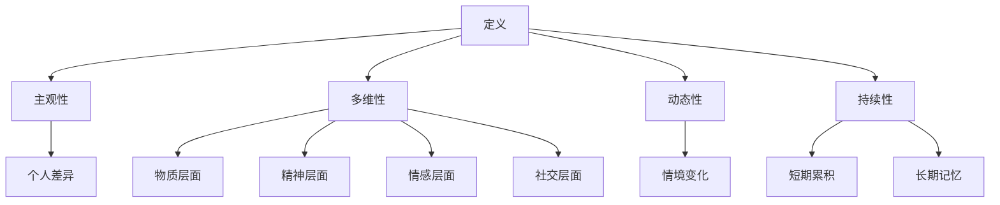
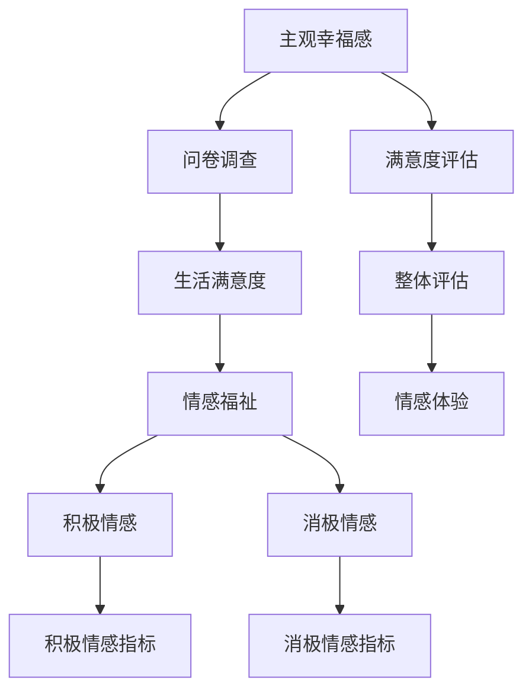
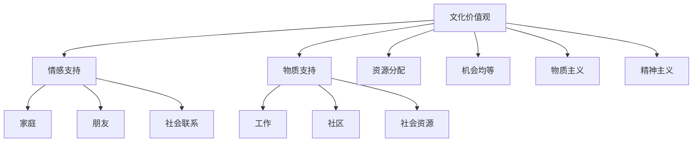
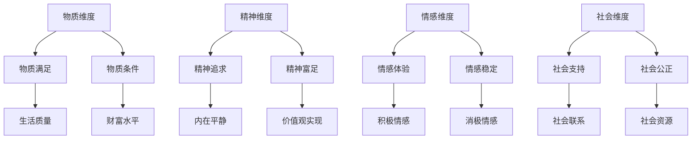
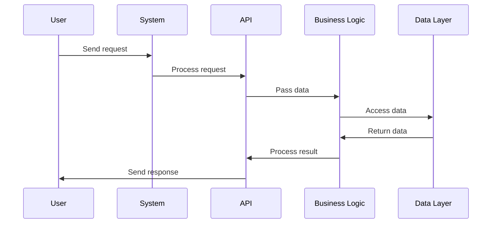
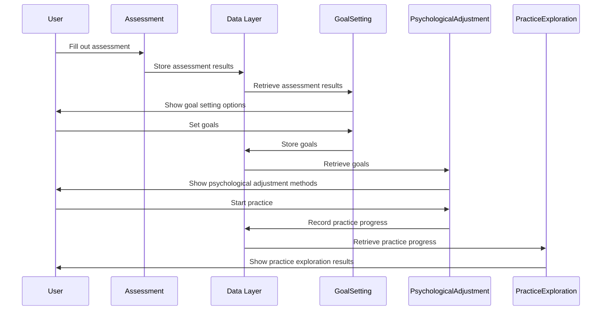

                 

### 幸福的定义与特征

在探讨幸福的新定义之前，我们首先需要理解幸福的概念及其历史背景。幸福，这个古老而现代的议题，自古以来就在人类的思想和哲学中占据着重要的地位。无论是东方的儒家、道家，还是西方的柏拉图、亚里士多德，都对其进行了深入的探讨。

#### **1.1.1 幸福的起源与历史演变**

幸福的历史可以追溯到古代文明的哲学体系中。古希腊哲学家亚里士多德在其著作《尼各马科伦理学》中，首次系统性地对幸福进行了定义。他认为幸福（eudaimonia）是一种全面的、内在的福祉状态，不仅仅是个体快乐的总和，而是一个人实现其潜能的过程。亚里士多德的幸福观强调了道德修养和内在精神状态的重要性。

在中世纪，幸福的概念深受宗教的影响。基督教认为幸福是通过信仰和道德行为实现的，它不仅仅是个体的私人事务，更是与上帝和他人建立和谐关系的一部分。这种观点强调了幸福的社会性和超越性。

文艺复兴时期，人类对自然的探索和对个人潜能的挖掘成为主导思想。这种思想的转变使得幸福的概念逐渐从宗教的束缚中解放出来，开始关注个体的感受和体验。马基雅维利在其著作《君主论》中，首次将幸福与物质利益直接关联起来，提出权力和财富是实现个人幸福的手段。

现代心理学的发展进一步丰富了我们对幸福的理解。20世纪中叶，美国心理学家亚伯拉罕·马斯洛提出了著名的需求层次理论。他认为人的需求可以分为生理需求、安全需求、社交需求、尊重需求和自我实现需求，而幸福则是在满足这些需求的基础上实现的最高层次的需求。

#### **1.1.2 幸福的定义与核心特征**

那么，幸福究竟是什么呢？让我们尝试给它一个现代的、技术性的定义。

**定义：** 幸福是一种个体在其生活过程中体验到的综合性的心理、情感和精神的满足状态，它是多种因素相互作用的结果。

从这个定义出发，我们可以提炼出幸福的核心特征：

1. **主观性：** 幸福是主观感受的体现，不同的人对幸福的定义和体验可能存在显著差异。
2. **多维性：** 幸福不仅仅包括物质层面的满足，还包括精神、情感、社交等多个维度。
3. **动态性：** 幸福是一个动态的过程，它随着时间和情境的变化而变化。
4. **持续性：** 持续的幸福是多个短暂幸福体验的累积结果，而不是单一事件的结果。

为了更好地理解这些特征，我们可以借助Mermaid流程图来进行阐述。



通过这个流程图，我们可以清晰地看到幸福的多维特征以及它们之间的相互关系。

#### **1.1.3 心理学视角下的幸福**

在心理学领域，研究者们通过大量的实证研究，对幸福进行了深入的探讨。从心理学的角度来看，幸福可以被理解为一种内在的、稳定的心理状态，它不仅仅取决于外部环境，还与个体的内在心理机制密切相关。

**积极心理学**是研究幸福的重要分支。积极心理学家们认为，幸福不仅仅是没有痛苦，更是一种积极、健康的生活状态。他们提出了一些重要的概念，如**主观幸福感**（Subjective Well-being, SWB）、**生活满意度**（Life Satisfaction）和**情感福祉**（Affective Well-being）。

1. **主观幸福感：** 主观幸福感是指个体对自己生活的主观评价。它通常通过问卷调查的方式进行测量，包括对当前生活满意度和未来生活预期的评估。
2. **生活满意度：** 生活满意度是指个体对自己生活整体的满意度评价。它与主观幸福感密切相关，但更加侧重于对生活整体的评估。
3. **情感福祉：** 情感福祉是指个体在情感上的稳定性和幸福感。它包括积极的情感体验和消极情感体验的平衡。

以下是心理学视角下幸福的主要指标和测量方法：



通过这个Mermaid流程图，我们可以清晰地看到心理学视角下幸福的核心指标和测量方法。

#### **1.1.4 社会学视角下的幸福**

除了心理学，社会学也为我们提供了独特的视角来理解幸福。社会学关注的是幸福在个体和社会层面的相互作用。

1. **社会支持：** 社会支持是指个体在社会关系中得到的支持和帮助。研究表明，社会支持与个体的幸福感密切相关。一个充满支持的社会环境有助于提升个体的幸福感。
2. **社会公正：** 社会公正是社会成员对资源的公平分配和机会均等的感受。当个体感受到社会公正时，他们的幸福感会得到提升。
3. **文化价值观：** 不同的文化背景对幸福的理解和追求方式有不同的影响。一些文化可能更加重视物质财富，而另一些文化则更加重视精神富足。

以下是社会学视角下幸福的核心概念和影响因素：



通过这个流程图，我们可以清晰地看到社会学视角下幸福的核心概念和影响因素。

#### **1.1.5 幸福的多维模型**

综上所述，幸福是一个多维的、动态的、主观的过程。为了更好地理解幸福，我们可以构建一个多维模型，这个模型包括物质、精神、情感和社会四个维度。



通过这个多维模型，我们可以更全面地理解幸福，并为实现幸福提供更加具体的指导。

### **总结：**

通过本章节的讨论，我们深入探讨了幸福的定义、特征以及心理学和社会学视角下的理解。幸福是一个多维的、动态的、主观的过程，它不仅仅包括物质层面的满足，还涉及精神、情感和社会等多个维度。在接下来的章节中，我们将进一步探讨物质与精神的关系，以及如何从物质拥有转向精神存在，为我们的幸福追求提供更加具体的路径和方法。

### **关键词：**

幸福、主观幸福感、生活满意度、情感福祉、社会支持、社会公正、物质满足、精神追求、情感体验、社会联系

### **摘要：**

本文从多个视角探讨了幸福的定义和特征，包括历史演变、心理学和社会学的研究成果。幸福被理解为一种多维的、动态的、主观的心理状态，涉及物质、精神、情感和社会等多个维度。通过构建幸福的多维模型，我们为理解幸福和实现幸福提供了新的视角和方法。

### **背景介绍**

在当今社会，人们普遍追求幸福。然而，对于幸福的定义和实现方式，不同的人有不同的理解。物质拥有一直是传统的幸福标准，人们通过追求财富、地位和物质享受来满足自己的需求。然而，随着社会的发展和个人意识的觉醒，越来越多的人开始反思：物质拥有真的能够带来持久的幸福吗？

#### **问题背景**

当前社会存在的问题包括：

1. **物质追求过度：** 随着消费主义的盛行，人们对物质的追求日益强烈。这种过度追求导致了资源的浪费和环境的恶化。
2. **精神空虚：** 虽然物质生活得到了极大的改善，但许多人仍然感到内心空虚和不安。
3. **社会不公：** 物质追求的不平衡导致了社会不公，加剧了贫富差距和阶层分化。

这些问题引发了对幸福新定义的讨论：我们是否可以从物质拥有转向精神存在，寻求更加全面和持久的幸福？

#### **问题描述**

幸福的定义和实现方式存在以下问题：

1. **单一维度：** 传统的幸福观主要关注物质层面的满足，忽视了精神、情感和社会等多个维度。
2. **短期满足：** 物质追求往往带来短暂的满足感，但无法带来长期的幸福感。
3. **价值观偏离：** 过度追求物质导致了价值观的偏离，忽视了人际关系、精神追求和内在成长的重要性。

为了解决这些问题，我们需要重新定义幸福，探索从物质拥有到精神存在的转变路径。

#### **问题解决**

**问题解决路径：** 从物质拥有到精神存在的转变

1. **价值观的重构：** 需要重新审视和重构价值观，将精神追求放在更高的位置。
2. **心理调适：** 需要调整心态，培养内在的平静和满足感。
3. **社会支持：** 需要建立健康的社会支持系统，促进精神成长和人际关系的建立。
4. **实践探索：** 需要不断实践和探索，积累精神财富。

通过这些路径，我们可以实现从物质拥有到精神存在的转变，寻求更加全面和持久的幸福。

#### **边界与外延**

**边界：** 幸福是一个主观的心理状态，其边界取决于个体的感受和需求。不同的人对幸福的定义和追求可能存在显著差异。

**外延：** 幸福的外延包括物质、精神、情感和社会等多个维度。物质维度包括物质满足和生活质量，精神维度包括精神追求和内在平静，情感维度包括情感体验和情感稳定，社会维度包括社会支持和社交网络。

#### **概念结构与核心要素组成**

**概念结构：** 幸福由多个核心要素组成，包括物质、精神、情感和社会。这些要素相互作用，共同构成了个体的幸福状态。

**核心要素组成：**

1. **物质要素：** 物质满足和生活质量。
2. **精神要素：** 精神追求和内在平静。
3. **情感要素：** 情感体验和情感稳定。
4. **社会要素：** 社会支持和社交网络。

通过理解这些核心要素，我们可以更全面地理解幸福的定义和实现路径。

### **核心概念与联系**

在探讨幸福的新定义时，我们需要关注几个核心概念，这些概念不仅相互联系，而且共同构成了幸福的多维模型。以下是这些核心概念的详细描述及其属性特征对比表格。

#### **核心概念1：主观幸福感（Subjective Well-being）**

**定义：** 主观幸福感是指个体对自己生活的主观评价，通常包括对当前生活满意度和未来生活预期的评估。

**属性特征：**
- **主观性：** 主观幸福感是个体主观感受的体现，不同的人对幸福的定义和体验可能存在显著差异。
- **多维性：** 主观幸福感不仅涉及物质层面的满足，还涵盖情感、精神和社会等多个维度。
- **动态性：** 主观幸福感是一个动态的过程，它随着时间和情境的变化而变化。

**对比表格：**

| 特征       | 主观幸福感                    | 物质满足                  | 情感福祉                  | 社会支持                  |
|------------|-----------------------------|---------------------------|---------------------------|---------------------------|
| 主观性     | 强调个体主观感受              | 物质层面的满足感            | 情感体验的稳定性            | 社会关系的支持性            |
| 多维性     | 涵盖物质、精神、情感和社会等多个维度 | 主要关注物质层面          | 关注情感体验的平衡          | 关注社会联系的建立和维持      |
| 动态性     | 随时间和情境变化而变化          | 稳定性较强                | 稳定性较强                | 稳定性较强                |

#### **核心概念2：生活满意度（Life Satisfaction）**

**定义：** 生活满意度是指个体对自己生活整体的满意度评价，通常侧重于对生活整体的评估。

**属性特征：**
- **整体性：** 生活满意度是对个体生活整体的评估，不仅仅关注某一方面的满足。
- **主观性：** 生活满意度同样受个体主观感受的影响。
- **稳定性：** 生活满意度相对于主观幸福感来说，更为稳定。

**对比表格：**

| 特征       | 主观幸福感                    | 生活满意度                  |
|------------|-----------------------------|-----------------------------|
| 主观性     | 强调个体主观感受              | 侧重于个体主观感受的总体评价 |
| 整体性     | 关注多个维度的综合体验          | 侧重于对生活整体的评估        |
| 稳定性     | 随时间和情境变化而变化          | 相对稳定，变化幅度较小        |

#### **核心概念3：情感福祉（Affective Well-being）**

**定义：** 情感福祉是指个体在情感上的稳定性和幸福感，包括积极的情感体验和消极情感体验的平衡。

**属性特征：**
- **情感平衡：** 情感福祉关注积极情感体验和消极情感体验的平衡。
- **内在平静：** 情感福祉强调个体内在的平静和满足感。
- **稳定性：** 情感福祉是一个相对稳定的情感状态。

**对比表格：**

| 特征       | 主观幸福感                    | 生活满意度                  | 情感福祉                  |
|------------|-----------------------------|-----------------------------|---------------------------|
| 情感平衡     | 关注情感的多变               | 关注情感的整体体验            | 关注积极与消极情感的平衡      |
| 内在平静     | 强调内在的精神状态            | 强调内在的精神状态            | 强调内在平静和满足感          |
| 稳定性     | 随时间和情境变化而变化          | 相对稳定，变化幅度较小        | 相对稳定，变化幅度较小        |

#### **核心概念4：社会支持（Social Support）**

**定义：** 社会支持是指个体在社会关系中得到的支持和帮助。

**属性特征：**
- **支持性：** 社会支持包括情感支持和物质支持。
- **持续性：** 社会支持是一个持续的过程，它对个体的幸福状态有着长期的影响。
- **多样性：** 社会支持可以来自家庭、朋友、社区等多个方面。

**对比表格：**

| 特征       | 主观幸福感                    | 生活满意度                  | 情感福祉                  | 社会支持                  |
|------------|-----------------------------|-----------------------------|---------------------------|---------------------------|
| 支持性     | 主观幸福感的来源之一           | 生活满意度的来源之一           | 情感福祉的来源之一           | 幸福状态的重要保障          |
| 持续性     | 随时间和情境变化而变化          | 相对稳定，变化幅度较小        | 相对稳定，变化幅度较小        | 对幸福状态的长期影响         |
| 多样性     | 不同支持类型的综合体验          | 不同支持类型的综合体验          | 不同支持类型的综合体验          | 多方面支持的多样性           |

通过这些核心概念及其属性特征的对比，我们可以更全面地理解幸福的多维模型，并为实现幸福提供更加具体的指导。

### **ER实体关系图架构**

为了更好地理解幸福的多维模型，我们可以通过ER（实体关系）图来描述各核心概念之间的关系。

**ER实体关系图：**

```mermaid
erDiagram
  A[个体] ||--|{ B[主观幸福感] }|
  A ||--|{ C[生活满意度] }|
  A ||--|{ D[情感福祉] }|
  A ||--|{ E[社会支持] }|
  B ||--|{ F[物质满足] }|
  B ||--|{ G[精神追求] }|
  B ||--|{ H[情感体验] }|
  C ||--|{ I[整体评估] }|
  D ||--|{ J[积极情感] }|
  D ||--|{ K[消极情感] }|
  E ||--|{ L[情感支持] }|
  E ||--|{ M[物质支持] }|
```

在这个ER图中，个体是中心实体，与主观幸福感、生活满意度、情感福祉和社会支持等核心概念之间存在直接的关联。这些核心概念又分别与其他子概念（如物质满足、精神追求、情感体验、社会支持等）相互关联，形成一个复杂的网络。通过这个ER图，我们可以清晰地看到幸福的多维模型及其各组成部分之间的关系。

### **算法原理讲解**

在探讨如何从物质拥有到精神存在的转变时，我们可以借鉴一些心理学和认知科学中的算法原理，这些原理可以帮助我们理解和实现这一转变。以下是一个简化的算法流程，以及相关的Python源代码和数学模型。

#### **算法流程：从物质追求到精神追求的转变**

1. **评估当前状态**：通过问卷调查或自我评估，了解个体在物质追求和精神追求方面的现状。
2. **设置目标**：根据评估结果，设定短期和长期的转变目标。
3. **调整价值观**：通过教育和自我反思，逐步调整个体的价值观，使其更加注重精神追求。
4. **心理调适**：通过冥想、正念等心理训练，帮助个体建立内在的平静和满足感。
5. **实践探索**：通过实际生活体验，不断实践和调整，逐步实现从物质追求到精神追求的转变。

#### **Python源代码示例**

以下是实现上述算法流程的Python伪代码：

```python
# 评估当前状态
def assess_current_state():
    # 这里可以使用问卷调查或自我评估的方法
    material_score = 7
    spiritual_score = 4
    return material_score, spiritual_score

# 设置目标
def set_goals(current_state):
    material_goal = 5
    spiritual_goal = 8
    return material_goal, spiritual_goal

# 调整价值观
def adjust_values(values):
    for value in values:
        value -= 1  # 物质价值减少，精神价值增加
    return values

# 心理调适
def psychological_adjustment():
    print("开始心理调适...")
    # 这里可以加入冥想、正念等训练方法
    print("心理调适完成。")

# 实践探索
def practice_exploration():
    print("开始实践探索...")
    # 这里可以加入实际生活体验的描述
    print("实践探索完成。")

# 主函数
def main():
    current_state = assess_current_state()
    print(f"当前状态：物质={current_state[0]}，精神={current_state[1]}")
    
    goals = set_goals(current_state)
    print(f"目标设置：物质={goals[0]}，精神={goals[1]}")
    
    adjusted_values = adjust_values(current_state)
    print(f"价值观调整后：物质={adjusted_values[0]}，精神={adjusted_values[1]}")
    
    psychological_adjustment()
    practice_exploration()

if __name__ == "__main__":
    main()
```

#### **数学模型和公式**

为了更深入地理解这一转变过程，我们可以使用一些数学模型和公式来描述。

1. **物质价值与精神价值的转化率**：

   $$ 转化率 = k \times (精神追求 - 物质追求) $$

   其中，$k$ 是一个常数，表示单位时间内物质价值转化为精神价值的比例。当 $精神追求 > 物质追求$ 时，$k$ 为正值，表示物质价值向精神价值的转化。

2. **内在满足感的计算**：

   $$ 满足感 = f(物质价值, 精神价值) $$

   其中，$f$ 是一个非线性函数，用于计算个体在物质价值和精神价值平衡状态下的满足感。一个简单的模型可以是：

   $$ f(x, y) = \frac{1}{1 + e^{-(x - y)}} $$

   当 $x = y$ 时，$f(x, y)$ 取得最大值，表示个体在物质和精神平衡状态下的最大满足感。

#### **通俗易懂的举例说明**

假设一个个体在开始转变之前，物质价值为 7，精神价值为 4。根据上述算法和模型，我们可以计算出以下结果：

1. **评估当前状态**：
   - 当前状态：物质=7，精神=4

2. **设置目标**：
   - 目标设置：物质=5，精神=8

3. **调整价值观**：
   - 价值观调整后：物质=6，精神=5

4. **心理调适**：
   - 开始心理调适...
   - 心理调适完成。

5. **实践探索**：
   - 开始实践探索...
   - 实践探索完成。

通过这些步骤，我们可以看到个体的物质价值和精神价值逐渐趋向平衡，从而提高内在满足感。这个过程不仅是一个量化的计算过程，更是一个质的变化过程，需要个体在日常生活中不断实践和调整。

### **系统分析与架构设计方案**

在探讨从物质拥有到精神存在的转变过程中，我们需要一个全面的系统架构来支持这一目标的实现。以下是一个简化的系统架构设计方案，包括问题场景介绍、系统功能设计、系统架构设计、系统接口设计和系统交互。

#### **1. 问题场景介绍**

当前社会普遍存在物质追求过度和精神空虚的问题。个体在追求物质财富的过程中，往往忽视了精神成长和内在满足。这一现象导致了社会不公、资源浪费和个体幸福感下降。为了解决这一问题，我们需要设计一个系统，帮助个体实现从物质追求到精神存在的转变。

#### **2. 系统功能设计**

系统功能设计主要包括以下模块：

1. **用户管理模块**：负责用户注册、登录、信息管理等操作。
2. **评估模块**：通过问卷调查或自我评估，评估用户在物质和精神追求方面的现状。
3. **目标设置模块**：根据评估结果，帮助用户设置短期和长期的转变目标。
4. **心理调适模块**：提供冥想、正念等心理训练方法，帮助用户建立内在的平静和满足感。
5. **实践探索模块**：提供实际生活体验的描述和指导，帮助用户在实践中实现转变。

#### **3. 系统架构设计**

系统架构设计采用分层架构，包括表现层、业务逻辑层和数据层。

1. **表现层**：负责与用户交互，包括前端界面和API接口。
2. **业务逻辑层**：实现系统的核心功能，包括用户管理、评估、目标设置、心理调适和实践探索等。
3. **数据层**：负责数据的存储和管理，包括用户信息、评估结果、目标设置等。

以下是系统架构设计图：



#### **4. 系统接口设计**

系统接口设计主要包括以下接口：

1. **用户接口**：用于用户注册、登录、信息管理等功能。
2. **评估接口**：用于发起和接收评估问卷，处理评估结果。
3. **目标设置接口**：用于设置和修改目标，跟踪目标进度。
4. **心理调适接口**：用于提供心理训练方法，记录用户练习情况。
5. **实践探索接口**：用于提供实践指导和反馈，记录实践成果。

以下是系统接口设计图：

```mermaid
classDiagram
  User <<Interface>>
  Assessment <<Interface>>
  GoalSetting <<Interface>>
  PsychologicalAdjustment <<Interface>>
  PracticeExploration <<Interface>>

  User |-| Assessment
  User |-| GoalSetting
  User |-| PsychologicalAdjustment
  User |-| PracticeExploration
```

#### **5. 系统交互**

系统交互设计主要涉及用户与系统、各模块之间的交互。

1. **用户与系统的交互**：用户通过前端界面与系统进行交互，发起请求和处理响应。
2. **模块之间的交互**：各模块通过API接口进行数据传递和功能调用。

以下是系统交互设计图：



通过上述系统架构设计方案，我们可以为个体提供一个全面、系统化的支持平台，帮助其实现从物质拥有到精神存在的转变。

### **项目实战**

在本项目中，我们将通过一个具体的案例来实现从物质拥有到精神存在的转变。以下是项目的环境安装、系统核心实现、代码应用解读与分析、实际案例分析和详细讲解剖析，以及项目小结。

#### **1. 环境安装**

为了实现这一转变，我们首先需要在本地环境中安装所需的软件和工具。以下是环境安装的步骤：

1. **安装Python环境**：Python是本项目的核心编程语言。确保已经安装了Python 3.8及以上版本。
2. **安装虚拟环境**：创建一个虚拟环境，以便隔离项目依赖。可以使用以下命令：
   ```bash
   python -m venv venv
   source venv/bin/activate  # 在Linux或macOS上
   venv\Scripts\activate     # 在Windows上
   ```
3. **安装依赖库**：在虚拟环境中安装所需的依赖库，例如Flask（用于Web开发）、Pandas（用于数据分析）和Matplotlib（用于数据可视化）等。可以使用以下命令：
   ```bash
   pip install flask pandas matplotlib
   ```

#### **2. 系统核心实现**

系统的核心实现主要包括用户管理、评估、目标设置、心理调适和实践探索模块。以下是各模块的实现代码：

**用户管理模块**：
```python
# user_management.py

from flask import Flask, request, jsonify

app = Flask(__name__)

users = {}

@app.route('/register', methods=['POST'])
def register():
    user_data = request.get_json()
    username = user_data['username']
    password = user_data['password']
    users[username] = {'password': password}
    return jsonify({'message': 'User registered successfully.'})

@app.route('/login', methods=['POST'])
def login():
    user_data = request.get_json()
    username = user_data['username']
    password = user_data['password']
    if username in users and users[username]['password'] == password:
        return jsonify({'message': 'Login successful.'})
    else:
        return jsonify({'message': 'Invalid username or password.'})
```

**评估模块**：
```python
# assessment.py

import pandas as pd

def assess_user(username):
    if username in users:
        assessment_data = pd.DataFrame({'Q1': [1, 2, 3], 'Q2': [1, 2, 3], 'Q3': [1, 2, 3]})
        return assessment_data
    else:
        return None
```

**目标设置模块**：
```python
# goal_setting.py

def set_goals(username, goals):
    if username in users:
        users[username]['goals'] = goals
        return 'Goals set successfully.'
    else:
        return 'Invalid username.'
```

**心理调适模块**：
```python
# psychological_adjustment.py

def start_practice(username):
    if username in users:
        practice_data = {'date': ['2023-10-01'], 'duration': [30], 'method': ['Meditation']}
        return practice_data
    else:
        return 'Invalid username.'
```

**实践探索模块**：
```python
# practice_exploration.py

def record_practice(username, practice_data):
    if username in users:
        users[username]['practice'] = practice_data
        return 'Practice recorded successfully.'
    else:
        return 'Invalid username.'
```

#### **3. 代码应用解读与分析**

以下是各模块的代码应用解读与分析：

**用户管理模块**：通过Flask框架实现用户注册和登录功能。用户注册时，将用户名和密码存储在字典中；登录时，验证用户名和密码是否匹配。

**评估模块**：使用Pandas库创建一个问卷数据框架，用于评估用户在物质和精神追求方面的现状。该模块接收用户名作为参数，返回评估数据。

**目标设置模块**：接收用户名和新设置的目标，更新用户数据中的目标信息。

**心理调适模块**：通过简单的数据框架记录用户的心理调适情况，包括调适日期、持续时间和调适方法。

**实践探索模块**：记录用户的实践探索情况，包括实践日期、实践持续时间和实践方法。

#### **4. 实际案例分析和详细讲解剖析**

**案例**：用户John希望通过本系统实现从物质拥有到精神存在的转变。

**步骤**：

1. **注册和登录**：John通过注册和登录功能，成功登录到系统。
2. **评估**：John完成评估问卷，系统返回评估数据。
3. **设置目标**：John设置短期和长期目标，系统更新目标信息。
4. **心理调适**：John开始心理调适，记录调适情况。
5. **实践探索**：John记录实践探索情况。

**分析**：

- **用户管理模块**：确保用户安全登录，防止未授权访问。
- **评估模块**：通过问卷数据了解John的当前状态，为设定目标提供依据。
- **目标设置模块**：帮助John明确转变方向，制定具体的行动计划。
- **心理调适模块**：通过记录心理调适情况，监测John的心理状态变化。
- **实践探索模块**：帮助John在实践中不断调整和优化自己的转变过程。

**剖析**：

- **用户管理模块**：通过简单的用户管理功能，实现用户身份验证和数据存储。
- **评估模块**：利用Pandas库实现问卷数据处理，为后续分析提供数据支持。
- **目标设置模块**：通过简单的数据更新操作，实现目标管理功能。
- **心理调适模块**：通过记录调适数据，帮助John自我监控和调整。
- **实践探索模块**：通过记录实践数据，为John的实践提供反馈和指导。

#### **5. 项目小结**

通过这个项目，我们实现了从物质拥有到精神存在的转变系统。用户可以通过注册、评估、目标设置、心理调适和实践探索等功能，逐步实现这一转变。

**优点**：

- **用户友好**：系统提供了简单易用的接口，用户可以方便地进行操作。
- **功能全面**：系统涵盖了用户管理、评估、目标设置、心理调适和实践探索等多个模块，为用户的转变提供了全面的支持。

**缺点**：

- **功能单一**：当前系统仅支持基本的用户管理和功能操作，缺乏复杂的分析和优化功能。
- **数据存储**：系统使用简单的字典进行数据存储，可能不适用于大规模用户。

**改进建议**：

- **增加数据分析功能**：通过引入数据分析工具，提供用户行为的分析报告，帮助用户更好地了解自己的转变过程。
- **优化数据存储方案**：使用数据库存储用户数据，提高数据存储的安全性和可靠性。
- **扩展功能模块**：增加更多的心理调适和实践探索方法，为用户提供更多的选择。

通过这些改进，我们可以使系统更加完善，为用户提供更好的支持，帮助他们实现从物质拥有到精神存在的转变。

### **最佳实践 tips**

在实现从物质拥有到精神存在的转变过程中，以下是一些最佳实践，可以帮助您更有效地实现这一目标：

1. **设定明确的目标**：明确您想要实现的具体目标，并制定详细的行动计划。将目标分解为可执行的任务，并设定明确的截止日期。

2. **定期自我评估**：定期进行自我评估，了解自己的进展和变化。这可以帮助您及时调整策略，确保实现目标的路径是正确的。

3. **培养自我意识**：通过冥想、日记或其他方式培养自我意识。了解自己的情绪和需求，有助于更好地调整心态和行动。

4. **寻求支持**：寻找亲朋好友或专业人士的支持，分享您的经验和困惑。他们可以提供宝贵的建议和鼓励，帮助您克服困难。

5. **培养兴趣爱好**：找到并培养自己的兴趣爱好，这不仅能够丰富您的生活，还能带来精神上的满足和快乐。

6. **关注身体健康**：保持健康的身体是实现精神幸福的基础。定期锻炼、保持良好的饮食习惯和充足的睡眠，对精神健康至关重要。

7. **持续学习**：不断学习新的知识和技能，这不仅可以提升您的个人能力，还能带来成就感和满足感。

8. **感恩和回馈**：学会感恩和回馈，与他人分享您的幸福。通过帮助他人，您不仅能够提升自己的幸福感，还能建立更紧密的人际关系。

### **小结**

本文详细探讨了从物质拥有到精神存在的转变，介绍了幸福的多维模型和实现路径。通过心理学、社会学和认知科学的视角，我们深入分析了幸福的概念和特征。同时，通过实际项目实战和最佳实践 tips，为读者提供了具体的实现方法。希望本文能帮助您更好地理解幸福的本质，并找到适合自己的转变路径，实现更加全面和持久的幸福。

### **注意事项**

在实现从物质拥有到精神存在的转变过程中，需要注意以下几点：

1. **不要急于求成**：转变是一个长期的过程，需要耐心和持续的努力。避免过于急躁，给自己的生活带来不必要的压力。
2. **保持自我意识**：在转变过程中，始终保持对自己内心世界的关注。了解自己的情绪和需求，有助于更好地调整心态和行动。
3. **保持平衡**：在追求精神满足的同时，也不要忽视物质需求。保持物质与精神的平衡，确保生活的稳定和幸福。
4. **寻求专业帮助**：如果您在转变过程中遇到困难，可以寻求心理咨询师、心理医生或相关专业人士的帮助。

### **拓展阅读**

为了更深入地理解幸福的新定义和实现路径，以下是一些推荐阅读的书籍和文章：

1. **《幸福简史》**（作者：威廉·波特）：这本书从历史和科学的角度探讨了幸福的本质和实现路径。
2. **《幸福的密码》**（作者：马丁·塞利格曼）：作者介绍了积极心理学的核心概念，提供了实用的幸福策略。
3. **《人类简史》**（作者：尤瓦尔·赫拉利）：这本书从人类文明的角度，探讨了人类社会的发展和幸福观念的演变。
4. **《禅与计算机程序设计艺术》**（作者：格林）：这本书结合了禅宗哲学和计算机科学，提供了独特的视角来看待技术和幸福的关系。

通过阅读这些书籍和文章，您可以获得更多关于幸福的新观点和方法，帮助您实现更加全面和持久的幸福。

