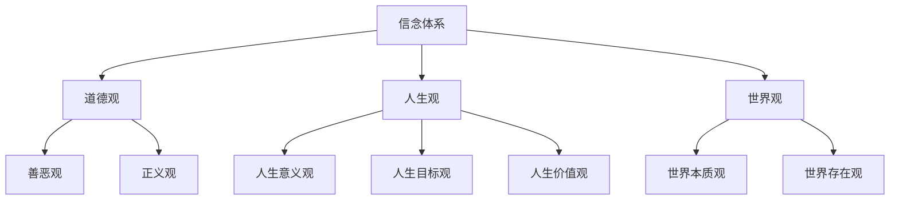

                 

### 建立个人信念体系：形成坚实的价值观基础

**关键词：个人信念体系，价值观，道德观，人生观，世界观**

> **摘要**：本文旨在探讨个人信念体系和价值观的建立，通过理论分析、实践指导和案例分析，帮助读者在复杂多变的社会环境中构建坚实的价值观基础，从而指导个人决策和行动，提升生活质量。

#### 引言

##### 1.1 问题背景与目标

在现代社会，个人的信念体系和价值观对其生活和工作有着深远的影响。然而，随着信息时代的到来，人们面临着前所未有的信息爆炸和价值观的多元冲击，如何在复杂多变的社会环境中建立和巩固个人信念体系，形成坚实的价值观基础，成为一个值得深入探讨的话题。

##### 1.1.1 问题背景

个人信念体系和价值观的建立是个体自我认知和发展的基础。一个稳固的信念体系可以帮助个体在面对挑战和困境时保持内心的坚定，从而做出明智的决策。然而，在信息爆炸和价值观多元的社会环境中，个体很容易受到外部信息的影响，导致信念体系的不稳定。

##### 1.1.2 问题描述

本文将探讨如何通过系统的学习和实践，建立起稳定而坚实的个人信念体系，从而在面对各种挑战时保持内心的坚定和从容。本文将重点关注道德观、人生观和世界观等核心信念要素，并结合具体实例进行详细探讨。

##### 1.1.3 问题解决

通过系统的学习、自我反思和实践，读者可以逐步形成和巩固个人的信念体系。本文将通过理论讲解、案例分析、实践指导等方式，帮助读者实现这一目标。

##### 1.1.4 边界与外延

个人信念体系和价值观的建立涉及多个方面，包括但不限于道德观、人生观、世界观等。本文将重点关注这些核心要素，并结合具体实例进行详细探讨。

##### 1.1.5 概念结构与核心要素组成

- **信念体系**：由一系列相互关联的信念构成，是个人价值观的体现。
- **价值观**：对事物价值的判断标准，是信念体系的核心。
- **学习与实践**：建立信念体系的关键途径。

##### 1.2 本书结构安排

- **第一部分**：信念体系基础
  - 介绍信念体系和价值观的基本概念，帮助读者建立对这一主题的整体认识。
- **第二部分**：核心概念与联系
  - 详细探讨信念体系和价值观的核心概念，并通过对比表格和实体关系图等方式，帮助读者理解这些概念之间的联系。
- **第三部分**：实践指导
  - 通过案例分析和实践指导，帮助读者将所学知识应用于实际生活中，逐步建立和巩固个人的信念体系。
- **第四部分**：深化与拓展
  - 探讨信念体系和价值观的深化与拓展，帮助读者在更广泛的社会和文化背景下理解和应用这些概念。

##### 1.3 本章小结

本章通过介绍个人信念体系和价值观的背景、问题和解决方法，为全书的内容奠定了基础。接下来的章节将逐步深入，帮助读者全面理解和建立自己的信念体系。

---

#### 2. 核心概念与联系

##### 2.1 个人信念体系的概念

个人信念体系是指个体对事物的基本认知、态度和信仰的总和，它是个体价值观的体现，也是个体决策和行为的基础。信念体系通常包括以下核心要素：

- **道德观**：对善恶、正义与邪恶的判断标准。
- **人生观**：对人生意义、目标和价值的理解。
- **世界观**：对世界本质和存在意义的认知。

##### 2.2 价值观的概念

价值观是个体对事物价值的判断标准，它决定了个体在面临选择时的优先级和决策方向。价值观的形成受到个体成长环境、文化背景、教育经历等多种因素的影响。核心的价值观包括：

- **自由**：个体追求自由的权利和机会。
- **公正**：对待他人公平、合理的态度和行为。
- **责任**：对自身行为和结果承担责任。
- **尊重**：尊重他人权利和尊严。

##### 2.3 概念属性特征对比表格

| 概念        | 定义                                                         | 属性特征                                                                                                           |
| ----------- | ------------------------------------------------------------ | ------------------------------------------------------------------------------------------------------------------ |
| 个人信念体系 | 个体对事物的基本认知、态度和信仰的总和                       | - 由一系列相互关联的信念构成 - 体现个体价值观 - 影响个体决策和行为            |
| 价值观      | 个体对事物价值的判断标准                                     | - 决定个体选择和决策方向 - 形成于个体成长环境和文化背景                |

##### 2.4 概念之间的关系

个人信念体系和价值观之间的关系是相互依存的。信念体系是价值观的基础，而价值观则是信念体系的具体体现。一个稳定而坚实的信念体系需要包含一系列相互关联的价值观，这些价值观共同构成了个人的行为准则和决策依据。

##### 2.5 实体关系图架构

通过上述的实体关系图，我们可以清晰地看到个人信念体系和价值观之间的复杂关系，以及各个核心概念之间的关联。

---

#### 3. 建立个人信念体系的步骤

建立个人信念体系是一个逐步的过程，需要系统的学习和实践。以下是建立个人信念体系的几个关键步骤：

##### 3.1 自我反思

自我反思是建立个人信念体系的第一步。通过深入思考自己的行为、价值观和信念，个体可以更好地理解自己，找到信念体系中的不协调之处。以下是自我反思的几个步骤：

1. **回顾过去**：思考自己的成长经历、重要决策和影响自己价值观的关键事件。
2. **识别信念**：列出自己认为重要的信念，并思考这些信念是如何影响自己的行为和决策的。
3. **评估信念的有效性**：审视自己的信念，判断它们是否仍然适用于当前的生活环境和社会背景。

##### 3.2 学习与实践

学习与实践是建立个人信念体系的关键。以下是一些学习与实践的方法：

1. **阅读和研究**：阅读相关的书籍、论文和资料，深入了解道德观、人生观和世界观等核心概念。
2. **参与讨论**：与他人讨论自己的信念和价值观，倾听不同的观点和建议，从而更好地理解和反思自己的信念体系。
3. **实践应用**：将所学知识应用到实际生活中，通过实践来验证和巩固自己的信念体系。

##### 3.3 反思与调整

建立信念体系是一个持续的过程，需要不断地反思和调整。以下是一些反思与调整的方法：

1. **定期反思**：定期回顾自己的信念体系，思考是否需要调整或更新。
2. **接受反馈**：倾听他人的反馈和建议，评估自己的信念体系的有效性。
3. **适应变化**：随着环境和情境的变化，个体需要调整自己的信念体系，以适应新的挑战和机遇。

##### 3.4 核心要素分析

在建立个人信念体系的过程中，以下核心要素需要特别关注：

- **道德观**：道德观是信念体系的基础，它决定了个体如何看待善恶、正义和道德规范。建立稳固的道德观需要深刻理解和实践道德原则。
- **人生观**：人生观决定了个体对人生意义、目标和价值的理解。一个积极向上的人生观有助于个体在面对挑战时保持乐观和坚定。
- **世界观**：世界观是信念体系的最高层次，它涉及到个体对世界本质和存在意义的认知。一个开放和包容的世界观有助于个体理解和接纳不同的文化和价值观。

---

通过自我反思、学习与实践、反思与调整，个体可以逐步建立和巩固个人的信念体系，形成坚实的价值观基础。这个过程需要耐心和毅力，但最终会为个体的生活带来积极的影响。

---

#### 4. 实践案例分析

为了更好地理解如何建立个人信念体系，我们可以通过一些实践案例来进行分析。

##### 4.1 案例一：道德观的建设

**案例背景**：小王是一名程序员，他在工作中经常面临道德困境。有一天，他的上司要求他篡改代码以使项目提前完成，但小王知道这违反了职业道德和公司规定。

**案例分析**：
1. **自我反思**：小王首先反思自己的价值观和信念，他意识到自己重视诚信和职业道德。
2. **学习与实践**：小王阅读了关于职业道德的书籍，参加了相关的培训，并通过与同事和导师的讨论加深了对道德观的理解。
3. **反思与调整**：小王在与同事和导师的讨论中，意识到即使在压力下，坚守道德原则是至关重要的。

**结论**：通过自我反思、学习和实践，小王成功建立和巩固了自己的道德观，他拒绝了上司的不当要求，并在工作中始终坚守诚信和职业道德。

##### 4.2 案例二：人生观的建设

**案例背景**：小李是一名年轻的创业者，他在创业初期遇到了很多挫折，感到迷茫和失落。

**案例分析**：
1. **自我反思**：小李反思自己的目标和价值观，他意识到自己对成功和财富的追求可能过于单一，需要重新审视人生的意义和目标。
2. **学习与实践**：小李阅读了关于成功心理学和人生哲学的书籍，参加了相关的工作坊和研讨会，并与一些成功的创业者交流。
3. **反思与调整**：通过学习和实践，小李逐渐形成了更加全面和积极的人生观，他开始关注团队建设、社会责任和长远发展。

**结论**：通过自我反思、学习和实践，小李成功建立了积极的人生观，他重新找到了创业的动力和方向，并在公司的发展中取得了显著的成功。

##### 4.3 案例三：世界观的建设

**案例背景**：小张是一名国际学生，他在国外留学期间遇到了很多文化冲突和价值观的差异。

**案例分析**：
1. **自我反思**：小张反思自己的世界观和文化观，他意识到自己需要更加开放和包容，以适应不同的文化和价值观。
2. **学习与实践**：小张参加了文化交流活动，阅读了关于不同文化的书籍，并与来自不同文化背景的同学和导师交流。
3. **反思与调整**：通过学习和实践，小张逐渐形成了更加开放和包容的世界观，他学会了尊重和欣赏不同的文化和价值观。

**结论**：通过自我反思、学习和实践，小张成功建立了开放和包容的世界观，他在国际交流中取得了更好的理解和互动，并在学术和生活中取得了更大的成功。

---

这些案例展示了建立个人信念体系的实际应用和效果。通过自我反思、学习和实践，个体可以逐步建立和巩固个人的信念体系，从而在面对挑战和困境时保持内心的坚定和从容。

---

#### 5. 结论与展望

本文通过理论分析、实践指导和案例分析，探讨了如何建立个人信念体系，形成坚实的价值观基础。通过自我反思、学习与实践、反思与调整，个体可以逐步建立和巩固个人的信念体系，从而在面对各种挑战时保持内心的坚定和从容。

在未来，随着社会环境的不断变化，个人信念体系和价值观的建立和巩固将变得更加重要。因此，我们鼓励读者持续学习和反思，不断调整和完善自己的信念体系，以适应新的挑战和机遇。

同时，我们也期待读者能够将本文的理念应用于实际生活中，通过实践来验证和巩固自己的信念体系。只有通过持续的实践和反思，个体才能建立起真正坚实而稳固的信念体系，为个人的生活和发展奠定坚实的基础。

---

#### 6. 作者信息

**作者：AI天才研究院/AI Genius Institute & 禅与计算机程序设计艺术 /Zen And The Art of Computer Programming**

本文由AI天才研究院和禅与计算机程序设计艺术联合撰写，旨在通过深入探讨个人信念体系和价值观的建立，为读者提供有益的指导和建议。

---

#### 7. 拓展阅读

- **《道德经》**：老子所著的《道德经》是中国古代哲学的经典之作，其中包含了许多关于道德观、人生观和世界观的重要思想。
- **《人类简史》**：尤瓦尔·赫拉利所著的《人类简史》从宏观的角度讲述了人类历史的发展，对世界观和人生观有着深刻的启示。
- **《自控力》**：凯利·麦格尼格尔所著的《自控力》探讨了人类行为的心理机制，对道德观和人生观有着重要的指导意义。

通过阅读这些书籍，读者可以进一步加深对个人信念体系和价值观的理解，从而在建立和巩固自己的信念体系过程中获得更多的启发和帮助。

