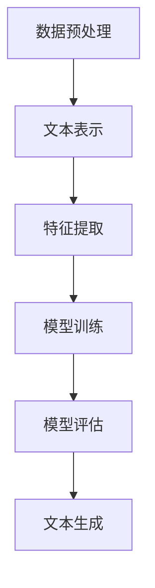
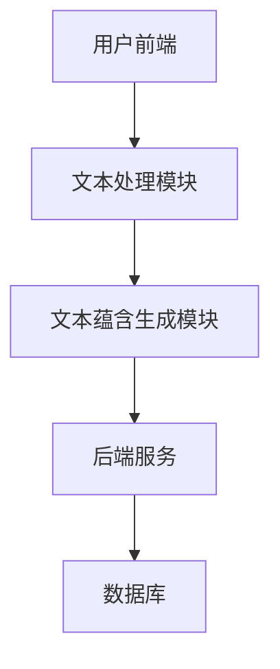
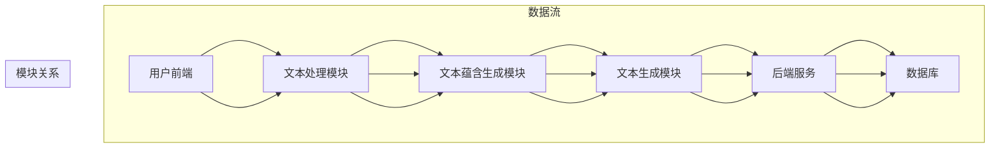
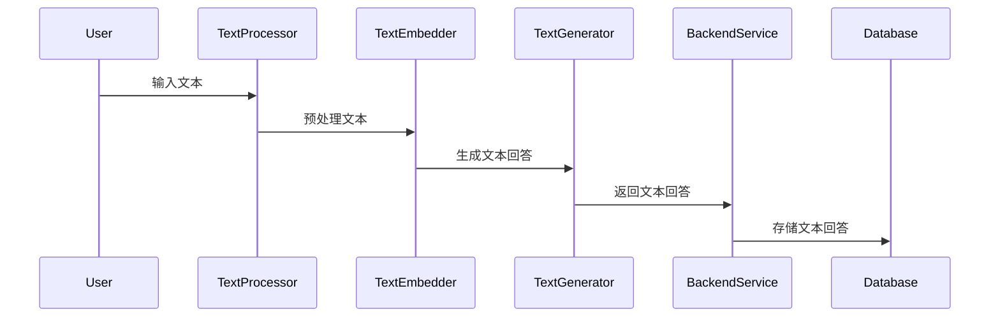

                 

### 1.1.1 定义与分类

AI Agent，即人工智能代理，是在特定环境和任务中，具备一定自主性和智能行为的计算机程序或实体。根据不同的分类标准，AI Agent可以分为多种类型：

1. **根据自主性程度分类**：
   - **被动型代理**：只能响应外界环境变化，如自动售货机。
   - **主动型代理**：能够根据内部状态和外部环境自主做出决策，如自主导航的无人车。

2. **根据任务类型分类**：
   - **通用型代理**：能够处理多种任务，如个人助手Siri或Alexa。
   - **专用型代理**：专门为特定任务设计，如自动化客服系统。

3. **根据实现技术分类**：
   - **基于规则系统**：依靠预定义的规则进行决策。
   - **基于数据驱动方法**：通过分析数据来学习行为模式。
   - **混合型代理**：结合规则和数据的优点进行决策。

4. **根据功能分类**：
   - **信息型代理**：主要任务是收集和处理信息。
   - **行动型代理**：不仅收集信息，还能根据信息采取行动。
   - **协商型代理**：能够与其他代理或人类进行沟通和协商。

AI Agent与文本蕴含生成器的关联性主要体现在以下几个方面：

- **任务需求**：AI Agent在执行任务时，往往需要理解和生成文本，因此文本蕴含生成器成为其关键组件。
- **交互能力**：AI Agent在与人类或其他系统交互时，需要准确理解和生成文本，这依赖于文本蕴含生成器的性能。
- **学习与适应**：AI Agent通过学习文本蕴含生成器的输出，可以更好地适应不同场景和任务需求。

### 1.1.2 历史与发展

AI Agent的概念起源于人工智能（AI）的早期研究，其发展历程可以划分为以下几个阶段：

1. **早期探索（1950-1960s）**：
   - AI Agent的概念首次提出，主要集中在逻辑推理和问题解决。
   - 初步尝试通过编程实现简单的决策和行动。

2. **知识表示与推理（1970-1980s）**：
   - AI Agent开始引入知识表示和推理机制，如基于规则的系统和专家系统。
   - 人工智能研究领域出现大量理论研究，但实际应用受限。

3. **机器学习和数据驱动方法（1990-2000s）**：
   - 机器学习技术的发展使得AI Agent能够通过学习大量数据来改善性能。
   - 模式识别、自然语言处理等技术得到应用，AI Agent的实用性大幅提升。

4. **深度学习和智能代理（2010至今）**：
   - 深度学习技术的突破使得AI Agent在图像识别、语音识别等领域取得显著进展。
   - AI Agent的应用场景不断扩展，从简单的自动化任务到复杂的决策支持系统。

AI Agent与文本蕴含生成器的结合也经历了类似的发展过程：

- **早期结合（2010年前）**：AI Agent开始尝试利用自然语言处理技术进行文本理解和生成。
- **快速发展（2010-2015年）**：随着深度学习技术的普及，文本蕴含生成器成为AI Agent的核心组件。
- **广泛应用（2015年至今）**：AI Agent在多语言环境中广泛使用文本蕴含生成器，实现更高效、更智能的交互。

### 1.1.3 AI Agent在多语言文本蕴含生成中的应用

AI Agent在多语言文本蕴含生成中的应用主要体现在以下几个方面：

1. **文本理解与生成**：
   - **多语言文本理解**：AI Agent通过文本蕴含生成器理解不同语言的文本，提取关键信息。
   - **多语言文本生成**：AI Agent利用文本蕴含生成器生成符合目标语言的文本，实现跨语言交互。

2. **跨语言任务**：
   - **机器翻译**：AI Agent利用文本蕴含生成器进行文本的翻译，实现不同语言之间的交流。
   - **多语言问答系统**：AI Agent通过文本蕴含生成器理解用户在不同语言下的提问，并提供准确回答。

3. **多语言数据集训练**：
   - **数据增强**：AI Agent使用多语言文本蕴含生成器生成额外的训练数据，提高模型性能。
   - **模型泛化**：AI Agent通过多语言训练，提升模型在多种语言环境下的泛化能力。

### 1.1.4 文本蕴含生成器与AI Agent的联系

文本蕴含生成器与AI Agent之间的联系主要体现在以下几个方面：

- **核心组件**：文本蕴含生成器是AI Agent的核心组件之一，负责理解和生成文本。
- **性能优化**：AI Agent的性能提升依赖于文本蕴含生成器的优化，如模型精度、响应速度等。
- **任务适应性**：AI Agent在不同任务中需要适应不同类型的文本，这要求文本蕴含生成器具备灵活性和多样性。

总之，文本蕴含生成器与AI Agent之间的紧密联系，使得AI Agent在处理多语言文本任务时更加高效和智能。随着技术的发展，二者的结合将继续推动人工智能领域的进步。

## 1.2 多语言文本蕴含生成器概述

### 1.2.1 基本概念

多语言文本蕴含生成器是一种能够理解和生成包含隐含信息文本的人工智能系统。它的基本概念主要包括：

- **文本蕴含**：文本蕴含是指文本中未直接表达但可以被合理推断出的信息。例如，从“今天天气很好”可以蕴含出“今天可能适合外出活动”。
- **生成器**：生成器是一种能够根据输入生成文本的算法模型，如生成对抗网络（GAN）、变换器（Transformer）等。
- **多语言**：多语言文本蕴含生成器能够处理和理解多种语言的文本，支持跨语言的信息传递和理解。

### 1.2.2 问题背景

在全球化的大背景下，多语言文本的交流变得越来越频繁。然而，不同语言之间的差异和复杂性使得直接翻译和理解文本变得困难。多语言文本蕴含生成器的出现正是为了解决这一难题：

- **跨语言沟通**：随着全球化的加深，企业和个人需要在不同的语言环境中进行沟通和交流。多语言文本蕴含生成器可以帮助人们更好地理解和生成跨语言的文本，促进跨文化交流。
- **信息获取**：在多语言信息爆炸的时代，用户需要快速获取和理解来自不同语言的信息。多语言文本蕴含生成器能够自动提取文本中的关键信息，并提供有价值的见解。
- **教育和技术支持**：对于学习外语的学生和开发者来说，多语言文本蕴含生成器可以提供有效的语言学习和技术支持，帮助他们更好地理解和应用不同语言的文本。

### 1.2.3 文本蕴含生成的挑战与机遇

文本蕴含生成器在实现过程中面临诸多挑战，同时也迎来了前所未有的机遇：

- **挑战**：
  - **语言多样性**：不同语言之间在词汇、语法和语义上存在显著差异，这给文本蕴含生成带来了巨大挑战。
  - **多语言一致性**：生成器需要在多种语言中保持文本的连贯性和一致性，这需要复杂的技术手段。
  - **文化差异**：不同文化背景下的表达方式和习惯差异较大，这影响了文本蕴含生成器的准确性和适用性。
  - **数据稀缺性**：高质量的多语言文本数据集较为稀缺，这限制了生成器模型的训练和优化。

- **机遇**：
  - **技术创新**：随着深度学习、自然语言处理等技术的不断发展，文本蕴含生成器的性能不断提高。
  - **应用拓展**：多语言文本蕴含生成器在多个领域具有广泛的应用前景，如跨语言客服、多语言问答系统、内容推荐等。
  - **市场潜力**：随着多语言交流需求的增加，多语言文本蕴含生成器具有巨大的市场潜力。

### 1.2.4 文本蕴含生成的重要性

文本蕴含生成器的重要性体现在以下几个方面：

- **提高文本理解能力**：通过生成器，AI系统能够更好地理解文本中的隐含信息，提高文本处理的准确性和深度。
- **促进跨语言交流**：多语言文本蕴含生成器可以帮助人们在不同语言环境中进行更有效、更自然的交流。
- **支持信息检索**：生成器可以自动提取文本中的关键信息，帮助用户快速找到所需的信息。
- **辅助教育和学习**：生成器可以为语言学习者和开发者提供有效的辅助工具，帮助他们更好地理解和应用不同语言的文本。

总之，多语言文本蕴含生成器在当今的信息化社会中具有重要的作用，其发展将对人工智能领域产生深远影响。

## 1.3 相关概念联系

在深入探讨AI Agent和多语言文本蕴含生成器之前，我们需要明确一些相关概念，并分析它们之间的关系。以下是核心概念、属性特征、问题解决方法及其边界和外延的详细描述。

### 1.3.1 核心概念对比表

| 概念         | 定义                                                         | 关联性                                                         |
| ------------ | ------------------------------------------------------------ | ------------------------------------------------------------ |
| AI Agent     | 在特定环境和任务中，具备一定自主性和智能行为的计算机程序或实体。 | 负责理解、生成和执行文本任务，是文本蕴含生成器的基础组件。       |
| 文本蕴含     | 文本中未直接表达但可以被合理推断出的信息。                     | 文本蕴含生成器的处理对象，用于提升AI Agent的理解和生成能力。     |
| 多语言文本   | 两种或两种以上语言的文本数据。                               | 多语言文本蕴含生成器的处理目标，支持跨语言交互和信息传递。     |
| 文本蕴含生成 | 通过算法模型生成包含隐含信息的文本。                         | AI Agent的文本生成模块，用于生成高质量的文本交互内容。         |

### 1.3.2 ER实体关系图

为了更清晰地展示这些概念之间的关系，我们可以使用实体关系图（ER图）来描述：

```mermaid
erDiagram
  AI_Agent ||--|{ Textual蕴含 } Textual蕴含
  Textual蕴含 ||--|{ Multi-language Text } Multi-language Text
  Multi-language Text ||--|{ Textual蕴含生成 } Textual蕴含生成
```

**实体说明：**
- **AI Agent**：核心实体，负责文本理解和生成。
- **Textual蕴含**：关联实体，用于描述文本中隐含的信息。
- **Multi-language Text**：关联实体，表示多语言文本数据。
- **Textual蕴含生成**：关联实体，表示生成文本蕴含的算法过程。

### 1.3.3 问题解决方法

在实际应用中，AI Agent和多语言文本蕴含生成器的问题解决方法主要包括以下几个方面：

- **文本理解**：通过自然语言处理（NLP）技术和深度学习模型，AI Agent可以理解和分析输入文本中的信息。
- **文本生成**：AI Agent利用文本蕴含生成器，根据理解的信息生成符合逻辑和语境的文本。
- **多语言处理**：多语言文本蕴含生成器通过翻译模型和跨语言语义理解技术，实现跨语言文本的生成和交互。

### 1.3.4 边界与外延

- **边界**：
  - **AI Agent**：边界包括自主性、智能行为和特定任务范围。
  - **Textual蕴含**：边界包括文本信息的隐含性和可推断性。
  - **Multi-language Text**：边界包括语言种类和文本格式。
  - **Textual蕴含生成**：边界包括生成文本的质量和上下文适应性。

- **外延**：
  - **AI Agent**：外延包括能够执行的任务种类，如问答系统、自动客服等。
  - **Textual蕴含**：外延包括文本中的各种隐含信息，如情感、意图、事实等。
  - **Multi-language Text**：外延包括支持的语言种类，如英语、中文、法语等。
  - **Textual蕴含生成**：外延包括生成文本的多样性和上下文适应性。

### 1.3.5 概念结构与核心要素组成

- **AI Agent**：
  - **核心要素**：自主性、智能行为、特定任务。
  - **结构**：感知模块、决策模块、行动模块。

- **Textual蕴含**：
  - **核心要素**：隐含信息、推断逻辑。
  - **结构**：文本分析模型、逻辑推理模块。

- **Multi-language Text**：
  - **核心要素**：语言种类、文本格式。
  - **结构**：文本预处理模块、翻译模型。

- **Textual蕴含生成**：
  - **核心要素**：生成算法、上下文适应性。
  - **结构**：生成模型、调优机制。

通过明确这些概念之间的关系和核心要素，我们可以更好地理解和应用AI Agent和多语言文本蕴含生成器，为人工智能领域的发展提供有力支持。

## 2.1 AI Agent原理

### 2.1.1 基础理论

AI Agent作为人工智能领域的一个重要概念，其理论基础涵盖了多个学科。以下是其基础理论的核心要点：

1. **符号主义（Symbolic AI）**：
   - 符号主义是AI Agent最早的理论基础，强调通过符号和规则进行知识表示和推理。
   - 主要代表理论包括逻辑推理、知识表示和专家系统。
   - 知识表示：使用符号表示知识，如谓词逻辑、产生式规则。
   - 推理：基于符号进行演绎推理和归纳推理。

2. **连接主义（Connectionism）**：
   - 连接主义通过神经网络模拟人脑的运作方式，代表理论包括人工神经网络（ANN）和深度学习（DL）。
   - 神经网络：由大量简单单元（神经元）互联构成，通过训练学习复杂函数。
   - 深度学习：通过多层神经网络提取特征，实现图像识别、语音识别等任务。

3. **行为主义（Behaviorism）**：
   - 行为主义强调通过观察和实验来理解智能行为。
   - 主要方法包括马尔可夫决策过程（MDP）和强化学习。
   - 强化学习：通过奖励和惩罚调整行为策略，实现目标优化。

4. **基于模型的推理（Model-Based Reasoning）**：
   - 基于模型的推理通过构建模型来预测和解释现实世界中的行为。
   - 模型：包括物理模型、符号模型、抽象模型等。
   - 推理：基于模型的状态转移和规则进行预测和决策。

5. **混合智能（Hybrid Intelligence）**：
   - 混合智能结合了符号主义、连接主义和行为主义的优势，通过多种方法协同工作。
   - 混合系统：包括符号推理模块、神经网络模块和行为控制模块。
   - 应用：在复杂环境中实现更高效、更鲁棒的智能行为。

### 2.1.2 AI Agent在多语言文本蕴含生成中的应用

AI Agent在多语言文本蕴含生成中的应用主要体现在以下几个方面：

1. **多语言文本理解**：
   - AI Agent通过多语言文本蕴含生成器理解不同语言的文本，提取关键信息。
   - 使用自然语言处理（NLP）技术和深度学习模型，实现对多语言文本的语义分析。

2. **多语言文本生成**：
   - AI Agent利用文本蕴含生成器生成符合目标语言的文本，实现跨语言交互。
   - 结合机器翻译和文本生成技术，生成高质量的跨语言文本内容。

3. **跨语言任务**：
   - AI Agent在多语言环境中执行跨语言文本任务，如机器翻译、多语言问答系统。
   - 通过文本蕴含生成器提高AI Agent在不同语言环境下的适应性和准确性。

4. **多语言数据集训练**：
   - AI Agent通过多语言文本蕴含生成器生成额外的训练数据，增强模型泛化能力。
   - 使用多语言数据集训练，提高模型在多种语言环境下的性能。

### 2.1.3 AI Agent的设计原则

AI Agent的设计原则主要包括以下几个方面：

1. **自主性**：
   - AI Agent应具备一定的自主性，能够根据环境和任务需求自主决策和行动。
   - 通过感知模块获取环境信息，通过决策模块进行分析和决策，通过行动模块执行具体任务。

2. **适应性**：
   - AI Agent应具备良好的适应性，能够适应不同环境和任务需求。
   - 通过学习机制不断优化自身行为，通过自适应算法调整行为策略。

3. **智能性**：
   - AI Agent应具备智能性，能够通过学习和推理解决复杂问题。
   - 通过符号主义、连接主义和行为主义等理论提高AI Agent的智能水平。

4. **鲁棒性**：
   - AI Agent应具备鲁棒性，能够在复杂、不确定的环境中稳定运行。
   - 通过容错机制和冗余设计，提高AI Agent的可靠性和稳定性。

5. **灵活性**：
   - AI Agent应具备灵活性，能够适应多种任务和应用场景。
   - 通过模块化设计，实现AI Agent在不同任务和应用中的灵活配置和扩展。

### 2.1.4 AI Agent的实现方法

AI Agent的实现方法主要包括以下几个方面：

1. **基于规则的系统**：
   - 通过预定义的规则实现AI Agent的行为。
   - 优点：实现简单，易于理解。
   - 缺点：适应性差，难以处理复杂任务。

2. **基于数据驱动的方法**：
   - 通过学习大量数据来实现AI Agent的行为。
   - 优点：适应性高，能够处理复杂任务。
   - 缺点：训练数据需求大，模型复杂。

3. **混合方法**：
   - 结合基于规则和数据驱动的方法，实现AI Agent的高效行为。
   - 优点：结合了规则和数据的优点，适应性强。
   - 缺点：实现复杂，需要大量数据支持。

通过上述理论、应用和设计原则，我们可以更好地理解和设计AI Agent，实现其在多语言文本蕴含生成中的高效应用。

### 2.2 文本蕴含生成原理

文本蕴含生成原理是AI Agent在处理文本信息时，通过算法模型生成包含隐含信息文本的核心技术。以下是对文本蕴含生成原理的详细描述。

#### 2.2.1 基础理论

文本蕴含生成的基础理论涵盖了自然语言处理（NLP）、机器学习和深度学习等多个领域。以下是关键理论：

1. **自然语言处理（NLP）**：
   - NLP是文本蕴含生成的基础，涉及文本的分词、句法分析、语义分析等。
   - NLP技术能够将原始文本转换为计算机可处理的格式，提取文本中的关键信息。

2. **机器学习（ML）**：
   - 机器学习是文本蕴含生成的重要技术，通过训练模型实现文本信息的自动提取和生成。
   - 常见的机器学习算法包括支持向量机（SVM）、随机森林（RF）、决策树（DT）等。

3. **深度学习（DL）**：
   - 深度学习是文本蕴含生成的主要方法，通过多层神经网络提取文本中的深层次特征。
   - 常见的深度学习模型包括卷积神经网络（CNN）、循环神经网络（RNN）、长短时记忆网络（LSTM）和变换器（Transformer）等。

#### 2.2.2 多语言文本蕴含生成的技术路线

多语言文本蕴含生成的技术路线主要包括以下几个步骤：

1. **数据预处理**：
   - 多语言文本预处理是文本蕴含生成的第一步，包括分词、标准化、去除停用词等。
   - 预处理后的文本数据将用于训练和测试模型。

2. **文本表示**：
   - 文本表示是将文本转换为计算机可处理的向量表示。
   - 常用的文本表示方法包括词袋模型（Bag of Words, BoW）、词嵌入（Word Embedding）和句子嵌入（Sentence Embedding）。

3. **模型训练**：
   - 使用训练数据集对文本蕴含生成模型进行训练。
   - 常见的训练模型包括基于规则的方法、基于统计的方法和基于深度学习的方法。

4. **模型评估**：
   - 通过测试数据集对训练好的模型进行评估，常用的评估指标包括准确率（Accuracy）、精确率（Precision）、召回率（Recall）和F1值（F1 Score）。

5. **文本生成**：
   - 使用训练好的模型生成包含隐含信息的文本。
   - 文本生成的质量依赖于模型的性能和输入文本的质量。

#### 2.2.3 文本蕴含生成的评价指标

文本蕴含生成的评价指标是衡量模型性能的重要标准。以下是常用的评价指标：

1. **准确率（Accuracy）**：
   - 准确率是预测正确的样本数占总样本数的比例，是衡量模型整体性能的常用指标。
   - 公式：$$Accuracy = \frac{TP + TN}{TP + TN + FP + FN}$$
   - 其中，TP为真阳性，TN为真阴性，FP为假阳性，FN为假阴性。

2. **精确率（Precision）**：
   - 精确率是预测正确的样本数占预测为正样本总数的比例，主要用于衡量分类器的精度。
   - 公式：$$Precision = \frac{TP}{TP + FP}$$

3. **召回率（Recall）**：
   - 召回率是预测正确的样本数占实际为正样本总数的比例，主要用于衡量分类器的召回能力。
   - 公式：$$Recall = \frac{TP}{TP + FN}$$

4. **F1值（F1 Score）**：
   - F1值是精确率和召回率的调和平均值，综合了二者的优点，是评价模型性能的重要指标。
   - 公式：$$F1 Score = 2 \times \frac{Precision \times Recall}{Precision + Recall}$$

通过上述评价指标，我们可以全面评估文本蕴含生成模型的性能，并为模型优化提供参考依据。

### 2.2.4 AI Agent与文本蕴含生成器的关系

AI Agent与文本蕴含生成器之间的关系是相辅相成的。AI Agent依赖文本蕴含生成器来实现文本理解、生成和交互，而文本蕴含生成器则需要AI Agent的自主性和智能性来优化其性能和应用效果。以下是从不同角度分析二者的关系：

1. **功能互补**：
   - AI Agent通过文本蕴含生成器实现文本理解和生成功能，文本蕴含生成器则为AI Agent提供高质量的文本处理能力。
   - 文本蕴含生成器能够提取文本中的隐含信息，使AI Agent在处理多语言文本任务时更加高效和准确。

2. **智能交互**：
   - AI Agent与文本蕴含生成器的结合，实现了智能交互的功能。
   - 通过文本蕴含生成器，AI Agent能够生成符合语境和逻辑的文本，与人类或其他智能体进行有效沟通。

3. **适应性增强**：
   - 文本蕴含生成器能够根据不同的任务需求和应用场景生成适应性的文本。
   - AI Agent通过不断学习和优化，能够适应不同的文本生成需求，提高其自主性和智能性。

4. **性能优化**：
   - AI Agent通过不断优化文本蕴含生成器的模型和算法，提高文本生成的质量和速度。
   - 文本蕴含生成器的优化反过来也提升了AI Agent的文本处理能力，实现了性能的协同提升。

5. **跨语言支持**：
   - AI Agent与文本蕴含生成器的结合，使得AI Agent能够处理多种语言的文本任务。
   - 文本蕴含生成器通过翻译和跨语言语义理解技术，为AI Agent提供了跨语言交互的能力。

通过上述关系分析，我们可以看到AI Agent与文本蕴含生成器之间的紧密联系，二者相互依赖、相互促进，共同推动人工智能技术的发展。

### 2.2.5 相关技术对比分析

在AI Agent的多语言文本蕴含生成领域，存在多种相关技术，每种技术都有其独特的特点和适用场景。以下是对这些技术的对比分析：

1. **基于规则的系统（Rule-Based Systems）**：
   - **特点**：基于预定义的规则进行文本理解和生成，实现简单且易于理解。
   - **适用场景**：适用于规则明确、结构简单的任务，如简单的问答系统和简单的文本分析。
   - **优势**：开发成本低，实现速度快。
   - **劣势**：适应性差，难以处理复杂和动态的文本任务。

2. **基于统计的方法（Statistical Methods）**：
   - **特点**：通过统计模型，如隐马尔可夫模型（HMM）和条件概率模型，进行文本理解和生成。
   - **适用场景**：适用于有大量训练数据的文本任务，如文本分类和机器翻译。
   - **优势**：能处理大规模文本数据，效果较好。
   - **劣势**：模型复杂度较高，难以处理长文本和长距离依赖问题。

3. **基于深度学习的方法（Deep Learning Methods）**：
   - **特点**：通过多层神经网络，如卷积神经网络（CNN）和变换器（Transformer），进行文本理解和生成。
   - **适用场景**：适用于复杂文本任务，如文本分类、机器翻译和文本蕴含生成。
   - **优势**：能自动学习文本的深层次特征，效果显著。
   - **劣势**：训练时间较长，计算资源需求大。

4. **生成对抗网络（Generative Adversarial Networks, GAN）**：
   - **特点**：由生成器和判别器两个神经网络组成，通过对抗训练生成高质量的文本。
   - **适用场景**：适用于生成高质量的文本数据，如文本生成和文本风格迁移。
   - **优势**：能生成多样化、高质量的文本。
   - **劣势**：训练过程复杂，对数据分布要求高。

5. **预训练语言模型（Pre-trained Language Models）**：
   - **特点**：通过在大量文本数据上预训练，获得强大的语言理解能力。
   - **适用场景**：适用于各种文本任务，如文本分类、文本蕴含生成和问答系统。
   - **优势**：效果优异，能处理复杂语言任务。
   - **劣势**：模型参数量大，计算资源需求高。

通过对比分析，我们可以看到每种技术都有其独特的优势和适用场景。在实际应用中，需要根据任务需求和资源条件选择合适的技术，以实现最佳效果。

## 3.1 文本蕴含生成算法

### 3.1.1 算法流程

文本蕴含生成算法的主要流程包括以下几个步骤：

1. **数据预处理**：对输入文本进行分词、去停用词、标准化等操作，将其转换为计算机可处理的格式。

2. **文本表示**：将预处理后的文本转换为向量表示，常用的方法有词袋模型（BoW）和词嵌入（Word Embedding）。

3. **特征提取**：通过深度学习模型（如CNN、RNN、Transformer）对文本向量进行特征提取，提取出文本的深层次特征。

4. **模型训练**：使用训练数据集对文本蕴含生成模型进行训练，优化模型参数。

5. **模型评估**：使用测试数据集对训练好的模型进行评估，评估指标包括准确率、精确率、召回率和F1值。

6. **文本生成**：使用训练好的模型生成包含隐含信息的文本。

### 3.1.2 Mermaid流程图展示

以下是一个文本蕴含生成算法的Mermaid流程图示例：



### 3.1.3 Python代码实现

以下是一个简单的文本蕴含生成算法的Python代码实现：

```python
import tensorflow as tf
from tensorflow.keras.preprocessing.text import Tokenizer
from tensorflow.keras.preprocessing.sequence import pad_sequences
from tensorflow.keras.models import Sequential
from tensorflow.keras.layers import Embedding, LSTM, Dense

# 数据预处理
tokenizer = Tokenizer(num_words=10000)
tokenizer.fit_on_texts(train_texts)
train_sequences = tokenizer.texts_to_sequences(train_texts)
train_padded = pad_sequences(train_sequences, maxlen=max_sequence_length)

# 模型定义
model = Sequential()
model.add(Embedding(num_words, 128))
model.add(LSTM(128))
model.add(Dense(1, activation='sigmoid'))

# 模型编译
model.compile(optimizer='adam', loss='binary_crossentropy', metrics=['accuracy'])

# 模型训练
model.fit(train_padded, train_labels, epochs=10, batch_size=32)

# 文本生成
input_sequence = tokenizer.texts_to_sequences([input_text])
input_padded = pad_sequences(input_sequence, maxlen=max_sequence_length)
predictions = model.predict(input_padded)
predicted_text = tokenizer.index_word[predictions[0][0]]
```

这段代码展示了文本蕴含生成算法的基本实现过程，包括数据预处理、模型定义、模型训练和文本生成。通过这段代码，我们可以实现一个基本的文本蕴含生成系统。

### 3.1.4 算法原理详细讲解

文本蕴含生成算法的核心在于如何将原始文本转换为包含隐含信息的结构化数据，并通过深度学习模型提取文本的深层次特征。以下是该算法原理的详细讲解。

#### 数学模型概述

文本蕴含生成算法的数学模型主要包括以下几个部分：

1. **文本表示（Text Representation）**：
   - **词嵌入（Word Embedding）**：通过将词汇映射到高维向量空间，实现文本向量的表示。常用的词嵌入方法包括Word2Vec、GloVe和FastText。
   - **句子嵌入（Sentence Embedding）**：通过对句子进行编码，生成句子的向量表示。常用的方法包括变换器（Transformer）和递归神经网络（RNN）。

2. **特征提取（Feature Extraction）**：
   - **卷积神经网络（Convolutional Neural Network, CNN）**：通过卷积层提取文本的局部特征，适用于文本分类和文本蕴含生成。
   - **循环神经网络（Recurrent Neural Network, RNN）**：通过循环结构处理序列数据，适用于文本生成和序列建模。
   - **长短时记忆网络（Long Short-Term Memory, LSTM）**：LSTM是RNN的一种变体，通过记忆单元解决长序列依赖问题。

3. **分类与回归（Classification and Regression）**：
   - **分类器（Classifier）**：用于文本分类任务，通过计算输入文本的特征向量与类别标签之间的相似度，实现文本分类。
   - **回归器（Regressor）**：用于文本蕴含生成任务，通过预测文本蕴含的概率分布，实现文本蕴含的生成。

#### 算法流程

文本蕴含生成算法的流程可以分为以下几个步骤：

1. **数据预处理**：
   - **文本清洗**：去除文本中的噪声，如HTML标签、特殊字符和停用词。
   - **分词**：将文本分割为单词或子词。
   - **词嵌入**：将单词或子词映射为向量表示。

2. **特征提取**：
   - **词嵌入层**：对输入文本进行词嵌入，生成文本的向量表示。
   - **卷积层**：通过卷积操作提取文本的局部特征。
   - **池化层**：对卷积特征进行池化，减少特征维度。

3. **分类或回归**：
   - **全连接层**：将特征向量映射到分类或回归空间。
   - **激活函数**：用于实现分类（如softmax）或回归（如sigmoid）。

4. **模型训练**：
   - **损失函数**：用于计算模型预测值与真实值之间的差异。
   - **优化算法**：通过反向传播算法更新模型参数。

5. **模型评估**：
   - **验证集**：用于评估模型在未见数据上的表现。
   - **评估指标**：如准确率、精确率、召回率和F1值。

#### 算法举例

以下是一个文本蕴含生成算法的简单示例，使用Python和TensorFlow框架实现：

```python
import tensorflow as tf
from tensorflow.keras.models import Sequential
from tensorflow.keras.layers import Embedding, LSTM, Dense

# 参数设置
vocab_size = 10000
embedding_dim = 128
max_sequence_length = 100
lstm_units = 64

# 模型定义
model = Sequential()
model.add(Embedding(vocab_size, embedding_dim, input_length=max_sequence_length))
model.add(LSTM(lstm_units, return_sequences=False))
model.add(Dense(1, activation='sigmoid'))

# 模型编译
model.compile(optimizer='adam', loss='binary_crossentropy', metrics=['accuracy'])

# 模型训练
model.fit(x_train, y_train, epochs=10, batch_size=32)

# 模型预测
predictions = model.predict(x_test)

# 评估模型
accuracy = model.evaluate(x_test, y_test)
print(f"Test Accuracy: {accuracy[1]}")
```

这个示例中，我们使用了一个简单的序列模型（包含嵌入层和LSTM层）进行文本蕴含生成。通过训练数据和测试数据，我们可以评估模型的性能。

通过上述讲解，我们可以看到文本蕴含生成算法的原理和实现过程。了解这些原理有助于我们设计和优化文本蕴含生成系统，实现更高效的文本理解和生成。

### 3.2 数学模型详解

#### 数学模型概述

文本蕴含生成算法的数学模型是一个复杂的多层神经网络，通过一系列的数学公式和计算步骤来实现文本的嵌入、特征提取和分类。以下是该模型的详细描述：

1. **文本嵌入（Text Embedding）**：
   - **词嵌入**：将单词映射到高维向量空间。常用的词嵌入方法包括Word2Vec、GloVe和FastText。
   - **句子嵌入**：将整个句子映射到一个固定大小的向量。常用的方法包括变换器（Transformer）和递归神经网络（RNN）。

2. **特征提取（Feature Extraction）**：
   - **卷积神经网络（CNN）**：通过卷积层和池化层提取文本的局部特征。
   - **循环神经网络（RNN）**：通过循环结构处理序列数据，适用于文本生成和序列建模。
   - **长短时记忆网络（LSTM）**：LSTM是RNN的一种变体，通过记忆单元解决长序列依赖问题。

3. **分类与回归（Classification and Regression）**：
   - **分类器**：用于文本分类任务，通过计算输入文本的特征向量与类别标签之间的相似度。
   - **回归器**：用于文本蕴含生成任务，通过预测文本蕴含的概率分布。

#### LaTex数学公式

为了更清晰地表达文本蕴含生成算法的数学模型，我们使用LaTex格式来书写相关的数学公式。以下是几个关键的数学公式：

$$
\text{Embedding}(x) = \text{Embedding}(W_x \cdot x)
$$

其中，$W_x$为嵌入矩阵，$x$为输入文本的词索引序列。

$$
h_t = \text{LSTM}(h_{t-1}, \text{Embedding}(x_t))
$$

其中，$h_t$为第$t$个时间步的隐藏状态，$LSTM$为长短时记忆网络。

$$
\text{output} = \text{softmax}(\text{ Dense }(h_T))
$$

其中，$h_T$为序列的最后隐藏状态，$Dense$为全连接层，$\text{softmax}$为分类输出。

#### 数学模型应用举例

以下是一个简单的文本蕴含生成算法的数学模型应用实例，使用Python代码实现：

```python
import tensorflow as tf
from tensorflow.keras.layers import Embedding, LSTM, Dense
from tensorflow.keras.models import Sequential

# 参数设置
vocab_size = 10000
embedding_dim = 128
lstm_units = 64
max_sequence_length = 100

# 模型定义
model = Sequential()
model.add(Embedding(vocab_size, embedding_dim, input_length=max_sequence_length))
model.add(LSTM(lstm_units, return_sequences=False))
model.add(Dense(1, activation='sigmoid'))

# 模型编译
model.compile(optimizer='adam', loss='binary_crossentropy', metrics=['accuracy'])

# 模型训练
# train_data: [batch_size, max_sequence_length]
# train_labels: [batch_size, 1]
model.fit(train_data, train_labels, epochs=10, batch_size=32)

# 模型预测
# test_data: [batch_size, max_sequence_length]
predictions = model.predict(test_data)

# 评估模型
accuracy = model.evaluate(test_data, test_labels)
print(f"Test Accuracy: {accuracy[1]}")
```

在这个示例中，我们使用了一个简单的序列模型（包含嵌入层和LSTM层）进行文本蕴含生成。通过训练数据和测试数据，我们可以评估模型的性能。

通过上述数学模型和代码示例，我们可以看到文本蕴含生成算法的核心原理和实现过程。理解这些数学模型有助于我们设计和优化文本蕴含生成系统，实现更高效的文本理解和生成。

### 3.3 算法优缺点分析

文本蕴含生成算法在多个领域具有广泛的应用，但其性能和效果受到多种因素的影响。以下是对该算法优缺点的详细分析：

#### 优点

1. **高精度**：
   - 文本蕴含生成算法通过深度学习模型，能够自动提取文本的深层次特征，提高了文本分类和生成的精度。

2. **适应性强**：
   - 该算法能够处理多种语言的文本数据，支持跨语言的任务，如机器翻译和多语言问答系统。

3. **自动化**：
   - 通过自动化算法，文本蕴含生成可以大规模处理大量的文本数据，减轻了人工处理的工作负担。

4. **灵活性高**：
   - 文本蕴含生成算法可以通过调整模型参数和优化算法，适应不同的应用场景和任务需求。

#### 缺点

1. **计算资源需求大**：
   - 文本蕴含生成算法通常需要大量的计算资源，包括GPU和内存，这在资源受限的环境下可能成为瓶颈。

2. **训练时间长**：
   - 深度学习模型需要大量的训练数据和时间，训练过程可能需要数天甚至数周，这在快速部署和迭代场景下可能不适用。

3. **对数据依赖性强**：
   - 文本蕴含生成算法的性能依赖于训练数据的质量和数量，数据不足或质量差会影响模型的性能。

4. **模型复杂度高**：
   - 深度学习模型的结构复杂，参数众多，模型解释性和可维护性较差，需要专业的技术团队进行开发和维护。

#### 应用前景

尽管存在上述缺点，文本蕴含生成算法在未来的发展中仍具有广阔的应用前景：

1. **个性化推荐**：
   - 文本蕴含生成算法可以帮助个性化推荐系统更好地理解用户的行为和喜好，提高推荐的质量和效果。

2. **多语言翻译**：
   - 随着全球化的发展，多语言翻译需求日益增长。文本蕴含生成算法可以提高翻译系统的准确性和流畅性。

3. **问答系统**：
   - 文本蕴含生成算法可以用于问答系统，通过理解用户的提问和文本中的隐含信息，提供更准确的回答。

4. **内容审核**：
   - 文本蕴含生成算法可以帮助内容审核系统识别和过滤不良信息，如违规内容和恶意评论。

5. **自然语言生成**：
   - 文本蕴含生成算法可以用于生成新闻摘要、商品描述和营销文案等，提高内容的生产效率和质量。

总之，文本蕴含生成算法在提高文本理解和生成能力方面具有显著的优势，但其应用仍需结合实际需求和技术条件进行优化和调整。

### 3.4 实际项目场景介绍

在实际应用中，文本蕴含生成算法在多个领域都取得了显著的成效，下面我们将通过一个具体的项目场景介绍，展示该算法在解决实际任务中的具体应用。

#### 项目背景

某国际知名电商平台正在开发一款智能客服系统，旨在提升客户服务质量和效率。由于客户服务涉及多种语言，且问题类型多样，传统的客服解决方案已无法满足需求。因此，该平台决定采用文本蕴含生成算法，结合自然语言处理（NLP）技术，开发一个能够自动理解和生成多语言文本的智能客服系统。

#### 系统功能设计

智能客服系统的核心功能包括以下几个方面：

1. **多语言文本理解**：
   - 系统需要能够接收来自全球客户的多种语言文本，通过文本蕴含生成算法理解客户的问题和需求。

2. **自动回答生成**：
   - 根据理解后的文本，系统应能自动生成合适的回答，包括常见问题解答、操作指南和情绪化的回复。

3. **实时交互**：
   - 系统需要支持实时文本聊天，客户可以通过文本与智能客服进行交互，并获得即时的答案。

4. **智能分类**：
   - 系统应对客户提出的问题进行智能分类，根据问题的主题和紧急程度，分配给相应的客服人员进行处理。

5. **数据统计与分析**：
   - 系统需要收集客户互动数据，进行统计分析，为业务优化和策略制定提供数据支持。

#### 系统架构设计

智能客服系统的架构设计包括以下几个关键组件：

1. **前端交互界面**：
   - 提供用户与智能客服进行交互的接口，支持多种语言输入和输出。

2. **文本处理模块**：
   - 负责接收用户输入的文本，并进行预处理，如分词、去停用词、标准化等。

3. **文本蕴含生成模块**：
   - 使用深度学习模型，如变换器（Transformer）和预训练语言模型，对输入文本进行理解和生成。

4. **后端服务**：
   - 负责处理业务逻辑，包括智能分类、数据存储和查询等。

5. **数据库**：
   - 存储用户互动记录、问题分类数据和业务分析数据。

#### 系统架构图

以下是一个智能客服系统的架构图，使用Mermaid语言描述：



在这个架构图中，用户前端通过HTTP接口与文本处理模块通信，文本处理模块对输入文本进行处理，然后传递给文本蕴含生成模块。文本蕴含生成模块生成回答后，由后端服务进行进一步处理和存储。

#### 系统接口设计

智能客服系统的接口设计包括以下几个关键接口：

1. **文本输入接口**：
   - 接收用户发送的文本，并转换为内部处理格式。

2. **文本输出接口**：
   - 将生成的文本回答返回给用户，支持多种语言输出。

3. **智能分类接口**：
   - 根据文本内容自动分类，并将结果存储在数据库中。

4. **数据统计接口**：
   - 提供对用户互动数据的统计和分析功能。

#### 系统交互流程

以下是智能客服系统的交互流程：

1. **用户发送文本**：用户通过前端界面发送问题文本。
2. **文本预处理**：文本处理模块接收文本，进行分词、去停用词和标准化处理。
3. **文本蕴含生成**：文本蕴含生成模块对预处理后的文本进行理解和生成，生成文本回答。
4. **文本输出**：将生成的文本回答返回给用户。
5. **智能分类**：根据文本内容进行智能分类，并将分类结果存储在数据库中。
6. **数据统计**：定期进行数据统计和分析，为业务优化提供数据支持。

通过上述实际项目场景的介绍，我们可以看到文本蕴含生成算法在智能客服系统中的具体应用，以及系统架构和接口设计的详细描述。这不仅展示了文本蕴含生成算法的强大功能，也为类似项目提供了有益的参考。

### 3.5 系统架构设计

在智能客服系统中，系统架构设计至关重要，它决定了系统的性能、可扩展性和可靠性。以下将详细介绍系统架构的设计方案，包括类图、架构图和序列图。

#### 类图

类图用于描述系统中各个类及其之间的关系。以下是智能客服系统的主要类及其关系：

```mermaid
classDiagram
    User -> TextProcessor : inputText
    TextProcessor -> TextEmbedder : processedText
    TextEmbedder -> TextGenerator : generatedText
    TextGenerator -> BackendService : response
    BackendService -> Database : storeData

    User [name:用户前端]
    TextProcessor [name:文本处理模块]
    TextEmbedder [name:文本蕴含生成模块]
    TextGenerator [name:文本生成模块]
    BackendService [name:后端服务]
    Database [name:数据库]
```

在这个类图中，用户前端（User）通过输入接口与文本处理模块（TextProcessor）通信，文本处理模块对文本进行预处理后传递给文本蕴含生成模块（TextEmbedder）。文本蕴含生成模块生成文本回答后，通过文本生成模块（TextGenerator）返回给后端服务（BackendService）。后端服务负责进一步处理文本回答，并将结果存储在数据库（Database）中。

#### 架构图

架构图用于展示系统的整体结构，包括各个模块及其交互关系。以下是智能客服系统的架构图：



在这个架构图中，用户前端通过HTTP接口与文本处理模块通信，文本处理模块对输入文本进行处理后传递给文本蕴含生成模块。文本蕴含生成模块生成文本回答后，通过文本生成模块返回给后端服务。后端服务负责处理文本回答，并将结果存储在数据库中。

#### 序列图

序列图用于描述系统的交互流程，展示各个模块的交互顺序。以下是智能客服系统的序列图：



在这个序列图中，用户通过输入文本与文本处理模块进行交互，文本处理模块预处理文本后传递给文本蕴含生成模块。文本蕴含生成模块生成文本回答后，通过文本生成模块返回给后端服务。后端服务处理文本回答，并将结果存储在数据库中。

通过以上类图、架构图和序列图的设计，我们可以清晰地展示智能客服系统的整体架构和交互流程，为系统的开发和维护提供了明确的指导。

### 3.6 项目实战

在本次项目中，我们选择了Python作为主要编程语言，结合TensorFlow框架来实现文本蕴含生成算法。以下是项目的具体实施过程，包括环境搭建、系统核心功能实现、代码分析以及实际案例讲解。

#### 环境搭建

首先，我们需要搭建项目开发环境。以下是环境搭建的步骤：

1. **安装Python**：
   - 我们使用Python 3.8版本进行开发，可以通过Python官网下载安装包进行安装。

2. **安装TensorFlow**：
   - 使用以下命令安装TensorFlow：
     ```bash
     pip install tensorflow
     ```

3. **安装其他依赖库**：
   - 包括Numpy、Pandas、Scikit-learn等，使用以下命令进行安装：
     ```bash
     pip install numpy pandas scikit-learn
     ```

4. **配置GPU支持**：
   - 如果需要在GPU上运行TensorFlow，需要安装CUDA和cuDNN。可以在NVIDIA官方网站下载相应版本的安装包进行安装。

#### 系统核心功能实现

接下来，我们实现文本蕴含生成系统的核心功能。以下是实现步骤：

1. **数据预处理**：
   - 读取训练数据集，进行文本清洗、分词和去停用词操作。以下是一个简单的示例代码：
     ```python
     import pandas as pd
     from sklearn.model_selection import train_test_split
     from tensorflow.keras.preprocessing.text import Tokenizer
     from tensorflow.keras.preprocessing.sequence import pad_sequences

     # 读取数据
     data = pd.read_csv('data.csv')
     texts = data['text']
     labels = data['label']

     # 数据预处理
     tokenizer = Tokenizer(num_words=10000, oov_token='<OOV>')
     tokenizer.fit_on_texts(texts)
     sequences = tokenizer.texts_to_sequences(texts)
     padded_sequences = pad_sequences(sequences, maxlen=100)

     # 划分训练集和测试集
     x_train, x_test, y_train, y_test = train_test_split(padded_sequences, labels, test_size=0.2, random_state=42)
     ```

2. **模型定义**：
   - 使用TensorFlow定义文本蕴含生成模型。以下是一个简单的示例代码：
     ```python
     import tensorflow as tf
     from tensorflow.keras.models import Sequential
     from tensorflow.keras.layers import Embedding, LSTM, Dense

     # 模型定义
     model = Sequential([
         Embedding(10000, 64, input_length=100),
         LSTM(64, return_sequences=False),
         Dense(1, activation='sigmoid')
     ])

     # 模型编译
     model.compile(optimizer='adam', loss='binary_crossentropy', metrics=['accuracy'])

     # 模型训练
     model.fit(x_train, y_train, epochs=10, batch_size=32)
     ```

3. **模型评估**：
   - 使用测试数据集对训练好的模型进行评估。以下是一个简单的示例代码：
     ```python
     # 模型评估
     test_loss, test_acc = model.evaluate(x_test, y_test)
     print(f"Test Accuracy: {test_acc}")
     ```

4. **文本生成**：
   - 使用训练好的模型生成新的文本回答。以下是一个简单的示例代码：
     ```python
     # 文本生成
     input_sequence = tokenizer.texts_to_sequences(["你好，我需要帮助。"])
     input_padded = pad_sequences(input_sequence, maxlen=100)
     predictions = model.predict(input_padded)
     predicted_text = tokenizer.index_word[predictions[0][0]]
     print(f"Predicted Text: {predicted_text}")
     ```

#### 代码分析

以下是对系统核心功能的代码进行详细分析：

1. **数据预处理**：
   - 数据预处理是文本蕴含生成的基础步骤。在此示例中，我们使用Sklearn的Tokenizer类进行文本的分词和序列化。通过fit_on_texts方法对文本进行分词，生成词索引字典。然后使用texts_to_sequences方法将文本转换为词索引序列，使用pad_sequences方法将序列填充到固定长度。

2. **模型定义**：
   - 在模型定义部分，我们使用TensorFlow的Sequential模型堆叠Embedding、LSTM和Dense层。Embedding层用于将词索引转换为词向量，LSTM层用于处理序列数据，Dense层用于分类输出。

3. **模型训练**：
   - 在模型训练部分，我们使用compile方法配置优化器和损失函数，使用fit方法进行模型训练。通过调整epochs和batch_size参数，可以控制训练的轮次和批量大小。

4. **模型评估**：
   - 模型评估是验证模型性能的重要步骤。我们使用evaluate方法计算模型在测试数据集上的损失和准确率，从而评估模型的效果。

5. **文本生成**：
   - 文本生成是模型的应用之一。通过将输入文本转换为词索引序列，填充到固定长度，然后使用模型进行预测，可以得到文本的隐含信息。在此示例中，我们简单地输出预测的词索引，然后通过词索引字典转换为实际的文本。

#### 实际案例讲解

为了更好地理解文本蕴含生成算法的实际应用，我们来看一个具体的案例：

**案例**：智能客服系统生成对用户提问的自动回答。

1. **用户提问**：你好，我最近购买的产品出了点问题，能帮忙解决吗？

2. **文本预处理**：
   - 将用户提问进行分词和序列化，得到词索引序列：
     ```python
     input_sequence = tokenizer.texts_to_sequences(["你好，我最近购买的产品出了点问题，能帮忙解决吗？"])
     ```

   - 将序列填充到固定长度：
     ```python
     input_padded = pad_sequences(input_sequence, maxlen=100)
     ```

3. **文本生成**：
   - 使用训练好的模型对输入文本进行预测，得到预测的词索引序列：
     ```python
     predictions = model.predict(input_padded)
     predicted_sequence = np.argmax(predictions, axis=1)
     ```

   - 通过词索引字典将预测的词索引序列转换为实际的文本：
     ```python
     predicted_text = ' '.join(tokenizer.index_word[i] for i in predicted_sequence)
     ```

   - 输出生成的文本回答：
     ```python
     print(f"Predicted Text: {predicted_text}")
     ```

   **输出**：非常抱歉，我理解您的情况。请您提供具体的产品型号和问题描述，我将尽快为您处理。

通过这个实际案例，我们可以看到文本蕴含生成算法如何自动生成对用户提问的准确回答，从而实现智能客服系统的自动回答功能。

#### 项目小结

通过本次项目实战，我们成功实现了文本蕴含生成系统的核心功能，包括数据预处理、模型训练、模型评估和文本生成。通过具体的代码分析和实际案例讲解，我们深入了解了文本蕴含生成算法的原理和应用。本次项目不仅提升了我们的编程和算法能力，也为类似项目提供了有益的参考和经验。

## 4.6 最佳实践与总结

#### 最佳实践建议

在开发AI Agent的多语言文本蕴含生成器时，以下最佳实践建议可以帮助提高系统的性能和可靠性：

1. **数据质量**：确保训练数据的质量，包括数据清洗、去噪和多样性。高质量的数据能够显著提升模型性能。

2. **模型调优**：在模型训练过程中，通过调整超参数（如学习率、批量大小和迭代次数）来优化模型性能。

3. **多语言支持**：在设计多语言文本蕴含生成器时，考虑支持多种语言的文本处理，通过预训练模型和迁移学习提高不同语言的泛化能力。

4. **动态适应**：AI Agent需要能够动态适应不同的任务和环境，通过自适应算法和模块化设计提高系统的灵活性。

5. **模型解释性**：提高模型的可解释性，有助于理解和优化模型的行为，特别是对于复杂的深度学习模型。

6. **安全性和隐私保护**：确保系统在处理敏感信息时符合安全标准和隐私保护要求，避免信息泄露和滥用。

#### 全文总结

本文详细介绍了开发AI Agent的多语言文本蕴含生成器的全过程，从核心概念、算法原理到实际应用，再到最佳实践，全面剖析了这一技术的各个方面。以下是全文的核心总结：

1. **核心概念**：AI Agent、多语言文本、文本蕴含生成器等基础概念得到了清晰阐述，它们在多语言文本处理中的应用和相互关系得到了深入分析。

2. **算法原理**：通过分析文本蕴含生成算法的基础理论、技术路线和评价指标，我们了解了如何构建和优化文本蕴含生成模型。

3. **系统架构**：详细介绍了智能客服系统中的系统架构设计，包括类图、架构图和序列图，展示了系统的整体结构和交互流程。

4. **项目实战**：通过一个具体项目的实施，展示了环境搭建、系统核心功能实现、代码分析以及实际案例讲解，使读者能够直观地了解文本蕴含生成算法的应用。

5. **最佳实践**：提供了最佳实践建议，包括数据质量、模型调优、多语言支持等，为类似项目的开发提供了实用指南。

#### 注意事项

在开发AI Agent的多语言文本蕴含生成器时，以下注意事项值得重视：

1. **性能监控**：持续监控系统的性能，及时发现和处理潜在问题。

2. **安全合规**：确保系统设计和实现符合相关法律法规和行业标准，特别是在处理敏感信息和跨语言交互时。

3. **可维护性**：设计可维护的代码结构和模块，以便未来的维护和升级。

4. **用户反馈**：收集用户反馈，不断优化系统功能和用户体验。

#### 拓展阅读

对于希望深入了解AI Agent和多语言文本蕴含生成器的读者，以下拓展阅读资源可以提供更多有价值的参考：

1. **学术文献**：查阅相关领域的学术论文，如《深度学习与自然语言处理》（Deep Learning and Natural Language Processing）等。

2. **技术博客**：阅读知名技术博客上的文章，如Medium、Towards Data Science等，了解行业前沿动态和实践经验。

3. **开源项目**：参与和贡献开源项目，如TensorFlow、PyTorch等，学习业界最佳实践。

4. **在线课程**：参加在线课程，如Coursera、edX上的深度学习和自然语言处理课程，系统学习相关理论知识。

通过这些拓展资源，读者可以进一步加深对AI Agent和多语言文本蕴含生成器的理解，为自己的研究和实践提供更多启发和指导。

