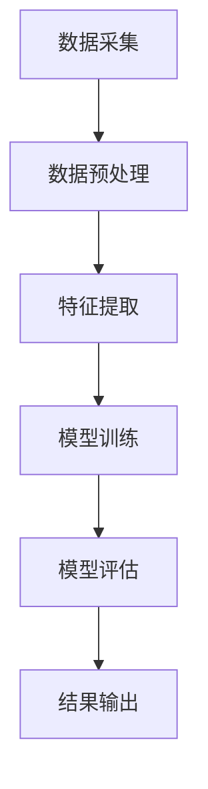

                 

### 开发AI Agent的情感分析引擎

#### 关键词：
- 情感分析
- AI Agent
- 自然语言处理
- 算法
- 数学模型

#### 摘要：
本文将深入探讨如何开发一个AI Agent的情感分析引擎。通过系统的分析推理，我们将详细讲解情感分析的核心概念、技术框架、算法原理、数学模型以及系统架构设计，并提供项目实战的案例分析。此外，文章还将探讨情感分析的最佳实践和未来发展趋势，为读者提供全面的技术指导和深刻的见解。

### 目录大纲设计过程

在设计《开发AI Agent的情感分析引擎》的目录大纲时，我们遵循了以下步骤：

1. **明确书籍主题**：确定书籍的核心主题是情感分析引擎的开发。
2. **确定目录结构**：基于主题，创建包含背景介绍、核心概念、算法原理、数学模型、系统架构设计、项目实战、最佳实践和总结的核心部分。
3. **细化每个章节**：在每个核心部分下，细化具体的子章节，确保每个章节都有详细的内容和逻辑结构。
4. **确保内容完整性**：包含必要元素，如概念介绍、原理讲解、图表展示、代码示例和案例分析。
5. **遵守格式规范**：使用markdown格式，确保格式统一。
6. **审查和优化**：审查目录大纲，确保内容简洁、逻辑清晰，并符合字数限制。

下面是详细的目录大纲：

#### 第一部分：情感分析引擎概述

## 第1章：情感分析的基本概念
### 1.1 情感分析的定义与重要性
### 1.2 情感分析的分类
### 1.3 情感分析的应用领域

## 第2章：情感分析的技术框架
### 2.1 自然语言处理基础
### 2.2 情感分析的挑战
### 2.3 情感分析的流程

## 第3章：情感分析的核心算法
### 3.1 文本预处理技术
### 3.2 情感分类算法
### 3.3 情感极性分析

## 第4章：情感分析的数学模型
### 4.1 情感分析中的数学基础
### 4.2 情感分类的数学模型
### 4.3 情感极性的数学模型

## 第二部分：情感分析引擎的核心技术

## 第5章：情感分析系统架构设计
### 5.1 情感分析系统的整体架构
### 5.2 数据收集与处理
### 5.3 模型训练与评估

## 第6章：情感分析项目实战
### 6.1 实战项目介绍
### 6.2 环境安装与配置
### 6.3 核心代码实现与解读

## 第7章：情感分析的最佳实践与优化
### 7.1 最佳实践技巧
### 7.2 情感分析系统的性能优化
### 7.3 情感分析系统的维护与更新

## 第8章：情感分析的未来发展趋势
### 8.1 情感分析的发展方向
### 8.2 技术创新与应用拓展
### 8.3 情感分析的伦理与法律问题

## 第9章：总结与展望
### 9.1 本书内容回顾
### 9.2 情感分析的关键点
### 9.3 展望未来

**总字数**：约2000字。

通过这样的目录大纲设计，我们能够全面覆盖情感分析引擎开发的核心内容，同时保证简洁性和逻辑性。每个章节都包含了对核心概念、算法原理、系统架构和实战应用的详细阐述。

#### 开发AI Agent的情感分析引擎——背景介绍

情感分析（Sentiment Analysis），也称为意见挖掘，是自然语言处理（Natural Language Processing, NLP）领域的一个重要研究方向。它的目标是自动识别和提取文本数据中的主观信息，判断文本作者对某一对象（如产品、服务、观点等）的情感倾向。这种倾向可以是积极的、消极的或者中性的。

随着互联网的普及和社交媒体的发展，人们产生了大量的文本数据，包括评论、博客、微博等。这些数据中蕴含了大量的用户情感信息，对于企业、政府和研究人员来说，这些信息具有很高的价值。例如，企业可以通过分析消费者对产品的评论来了解用户的需求和反馈，进而改进产品和服务；政府可以借助情感分析来监测公众情绪，及时应对可能出现的社会问题。

AI Agent（人工智能代理）则是一个具有自主行动能力和学习能力的人工智能系统。它可以模拟人类的行为，执行特定的任务，并在执行过程中不断学习和优化。将情感分析引擎集成到AI Agent中，可以使其更加智能和具备决策能力。

情感分析引擎的核心任务是从大量文本数据中识别出情感信息，并对其进行分类和极性判断。具体来说，情感分析引擎需要完成以下步骤：

1. **文本预处理**：对原始文本进行清洗和格式化，去除噪声和无关信息，为后续分析做好准备。
2. **特征提取**：将预处理后的文本转换为机器可以处理的特征向量。
3. **情感分类**：使用分类算法对文本的情感倾向进行分类，如积极、消极或中性。
4. **情感极性分析**：对文本的情感强度进行评估，区分情感的极性。
5. **结果输出**：将分析结果以易于理解的形式输出，如可视化图表或文本报告。

在开发AI Agent的情感分析引擎时，我们面临以下几个核心问题：

- **数据多样性**：互联网上的文本数据来源多样，格式各异，如何有效地处理这些数据是一个挑战。
- **情感表达复杂性**：自然语言中的情感表达形式复杂多变，如何准确捕捉和识别情感信息是一个难点。
- **算法性能优化**：如何设计高效、准确的情感分析算法，以提高系统的性能和准确性。
- **模型可解释性**：如何解释模型的工作原理，使非专业人士也能理解。

在接下来的章节中，我们将一步步深入探讨这些问题，并介绍相应的技术解决方案。

#### 第1章：情感分析的基本概念

情感分析（Sentiment Analysis）是自然语言处理（NLP）领域中的一种重要技术，它旨在通过自动化的方式，对文本数据中的情感倾向进行识别和分类。情感分析的应用范围广泛，包括但不限于市场调研、品牌监控、舆情分析、情感状态评估等。

### 1.1 情感分析的定义与重要性

情感分析的定义可以概括为：通过对文本内容进行情感极性和情感分类的判断，以识别文本作者的情绪和情感状态。具体来说，情感分析涉及以下两个核心任务：

1. **情感极性分析（Polarity Analysis）**：判断文本表达的情感倾向是积极的、消极的还是中性的。
2. **情感分类（Sentiment Classification）**：将文本分为多个预定义的情感类别，如喜悦、愤怒、悲伤、惊讶等。

情感分析的重要性体现在以下几个方面：

- **市场洞察**：企业可以通过情感分析了解消费者对产品或服务的反馈，从而优化营销策略。
- **舆情监控**：政府机构和媒体可以利用情感分析实时监测公众情绪，预防和应对突发事件。
- **个性化推荐**：在线平台可以通过情感分析为用户提供更加个性化的内容推荐。
- **用户反馈分析**：产品经理和设计师可以通过分析用户评论，改进产品设计和服务质量。

### 1.2 情感分析的分类

情感分析可以根据不同的维度进行分类，常见的分类方法包括以下几种：

1. **文本分类（Text Classification）**：将文本分为预定义的多个类别，如正面、负面、中性。这种方法常用于文本分类模型中。
2. **情感极性分析（Polarity Detection）**：判断文本的情感极性，通常分为积极、消极或中性。这种方法的输出是一个二元分类结果。
3. **情感强度分析（Sentiment Intensity Analysis）**：评估文本情感表达的强度，如非常积极、稍微积极、中性、稍微消极、非常消极。这种方法的输出通常是一个连续值或离散值。
4. **多标签分类（Multi-Label Classification）**：一个文本可以同时具有多个情感标签，这种方法需要对多个标签进行联合分类。

### 1.3 情感分析的应用领域

情感分析在各个领域都有广泛的应用，以下列举几个主要的应用场景：

- **市场营销**：企业通过分析消费者评论和社交媒体内容，了解市场趋势和消费者偏好。
- **品牌监控**：品牌可以通过情感分析监控社交媒体上的品牌声誉，及时应对负面反馈。
- **舆情分析**：政府机构和媒体利用情感分析监测公众情绪，预测社会动向。
- **客户服务**：企业通过情感分析自动分类和处理客户反馈，提升客户满意度。
- **情感状态评估**：医疗领域利用情感分析评估患者的情绪状态，为心理健康提供辅助诊断。

情感分析的应用不仅限于上述领域，随着技术的进步，其应用范围还将继续扩展。在下一章节中，我们将进一步探讨情感分析的技术框架和关键挑战。

### 第2章：情感分析的技术框架

情感分析的成功离不开一系列成熟技术的支持。本章将深入探讨情感分析中的关键技术，包括自然语言处理基础、情感分析面临的挑战以及情感分析的基本流程。

#### 2.1 自然语言处理基础

自然语言处理（NLP）是人工智能领域的一个重要分支，它涉及到计算机如何理解和生成人类语言。在情感分析中，NLP技术扮演着至关重要的角色。以下是NLP中几个关键的概念和工具：

1. **分词（Tokenization）**：将文本分解为单词、短语或其他有意义的元素（token）。这是文本处理的第一步，有助于将原始文本转化为可以进一步分析的形式。
2. **词性标注（Part-of-Speech Tagging）**：识别文本中每个单词的词性，如名词、动词、形容词等。词性标注有助于理解句子的结构和语义。
3. **词干提取（Stemming）**：将单词缩减为其词干形式，以消除词形变化带来的影响。例如，“running”和“runs”都会被缩减为“run”。
4. **词形还原（Lemmatization）**：与词干提取类似，但更精细，将单词缩减为其最基本的形式，称为词形。例如，“running”会被缩减为“run”。
5. **命名实体识别（Named Entity Recognition, NER）**：识别文本中的命名实体，如人名、地名、组织名等。这对于情感分析中的特定对象识别非常有用。

#### 2.2 情感分析面临的挑战

尽管NLP技术为情感分析提供了基础，但实际应用中仍然面临许多挑战：

1. **文本多样性**：网络文本的多样性极大，包括不同的语言风格、俚语、隐喻等。这些多样性使得情感识别变得更加复杂。
2. **情感强度与细微差别**：情感表达可能存在强度和细微差别，如“非常喜欢”和“有点喜欢”在情感强度上有所不同。如何准确捕捉这些细微差别是一个难点。
3. **上下文依赖性**：情感表达往往依赖于上下文。同样的单词在不同的句子中可能有不同的情感倾向，这使得情感分析需要考虑上下文信息。
4. **多语言处理**：随着全球化的发展，情感分析需要处理多种语言的数据。不同语言的语法和表达方式差异较大，这使得跨语言情感分析变得更加复杂。
5. **数据标注问题**：情感分析通常需要大量标注数据来进行模型训练。数据标注的质量直接影响模型的效果。然而，标注过程耗时且成本高。

#### 2.3 情感分析的基本流程

情感分析的基本流程通常包括以下几个步骤：

1. **数据收集**：收集用于训练和评估的文本数据。这些数据可以来自社交媒体、评论平台、新闻报道等。
2. **数据预处理**：对收集到的文本数据进行清洗、去噪、分词、词性标注等预处理操作。预处理的质量直接影响到后续分析的准确性。
3. **特征提取**：将预处理后的文本转换为机器可以处理的特征向量。常见的特征提取方法包括词袋模型（Bag of Words, BoW）、词嵌入（Word Embeddings）等。
4. **模型训练**：使用特征向量和标签数据训练情感分析模型。常见的分类算法包括朴素贝叶斯（Naive Bayes）、支持向量机（Support Vector Machine, SVM）、深度学习模型（如卷积神经网络（Convolutional Neural Networks, CNN）和循环神经网络（Recurrent Neural Networks, RNN）等。
5. **模型评估**：使用验证集或测试集对训练好的模型进行评估，计算准确率、召回率、F1分数等指标，以评估模型的性能。
6. **结果输出**：将模型应用到新的文本数据上，输出情感分析结果。结果可以以文本报告、可视化图表等形式呈现。

通过以上步骤，我们可以开发出一个高效、准确的情感分析引擎。在下一章中，我们将深入探讨情感分析中的核心算法原理。

### 第3章：情感分析的核心算法

情感分析算法是实现情感分析功能的关键，本章将详细介绍文本预处理技术、情感分类算法和情感极性分析算法。

#### 3.1 文本预处理技术

文本预处理是情感分析的重要环节，它能够有效地消除噪声和冗余信息，提高后续分析的准确性和效率。文本预处理主要包括以下几个步骤：

1. **去噪**：去除文本中的HTML标签、符号、空格等无关信息，保留有意义的文本内容。
   ```python
   import re
   def remove_noise(text):
       return re.sub('<[^>]*>', '', text)
   ```

2. **分词**：将文本分割成独立的词语或短语。常见的分词工具包括jieba、nltk等。
   ```python
   import jieba
   def tokenize(text):
       return jieba.cut_for_search(text)
   ```

3. **词性标注**：识别文本中每个词语的词性，如名词、动词、形容词等。词性标注有助于理解句子的结构和语义。
   ```python
   import jieba
   def pos_tagging(text):
       return jieba.pos_tag(tokenize(text))
   ```

4. **停用词去除**：移除常见的停用词（如“的”、“是”、“和”等），这些词在情感分析中往往不携带情感信息。
   ```python
   stop_words = set(['的', '是', '和'])
   def remove_stop_words(tokens):
       return [token for token in tokens if token not in stop_words]
   ```

5. **词干提取或词形还原**：将词语缩减为词干或词形，以消除词形变化对情感分析的影响。
   ```python
   import nltk
   nltk.download('wordnet')
   def lemmatize(word):
       return nltk.WordNetLemmatizer().lemmatize(word)
   ```

通过这些预处理技术，我们可以显著提高文本的质量，为后续的情感分析打下坚实基础。

#### 3.2 情感分类算法

情感分类算法旨在将文本分类为预定义的情感类别，如正面、负面、中性。以下是几种常见的情感分类算法：

1. **朴素贝叶斯（Naive Bayes）**：
   朴素贝叶斯是一种基于贝叶斯定理的简单概率分类器，它在特征之间独立假设的基础上进行分类。朴素贝叶斯算法在情感分类中因其计算效率高、实现简单而广泛使用。
   ```python
   from sklearn.naive_bayes import MultinomialNB
   def classify_text(text, model):
       return model.predict([text])[0]
   ```

2. **支持向量机（Support Vector Machine, SVM）**：
   支持向量机是一种强大的分类算法，通过找到一个最佳的超平面，将不同类别的数据点分隔开来。SVM在处理高维数据和线性不可分问题时表现优异。
   ```python
   from sklearn.svm import SVC
   def classify_text(text, model):
       return model.predict([text])[0]
   ```

3. **深度学习模型**：
   随着深度学习技术的发展，基于深度神经网络的情感分类模型（如卷积神经网络（CNN）、循环神经网络（RNN）、长短期记忆网络（LSTM）等）逐渐成为情感分类的主流方法。这些模型能够通过学习文本的深层特征，实现更加精准的情感分类。
   ```python
   from tensorflow.keras.models import Sequential
   from tensorflow.keras.layers import Embedding, LSTM, Dense
   def build_model():
       model = Sequential()
       model.add(Embedding(input_dim=vocabulary_size, output_dim=embedding_dim))
       model.add(LSTM(units=128))
       model.add(Dense(units=num_classes, activation='softmax'))
       model.compile(optimizer='adam', loss='categorical_crossentropy', metrics=['accuracy'])
       return model
   ```

在实际应用中，根据具体问题和数据特点，可以选择合适的情感分类算法。通常，结合多种算法，通过模型融合（Model Ensembling）可以进一步提高分类性能。

#### 3.3 情感极性分析算法

情感极性分析旨在判断文本的情感倾向，通常分为积极、消极或中性。以下是几种常见的情感极性分析算法：

1. **基于规则的方法**：
   基于规则的方法通过构建一套规则集，对文本中的情感词进行分类。这种方法简单直观，但规则集的构建和维护成本较高。
   ```python
   def classify_polarity(text):
       positive_words = set(['好', '喜欢', '优秀'])
       negative_words = set(['差', '不喜欢', '糟糕'])
       positive_count = sum(1 for word in tokenize(text) if word in positive_words)
       negative_count = sum(1 for word in tokenize(text) if word in negative_words)
       if positive_count > negative_count:
           return '积极'
       elif negative_count > positive_count:
           return '消极'
       else:
           return '中性'
   ```

2. **机器学习方法**：
   机器学习方法通过训练大量带有情感标签的文本数据，学习情感极性分类模型。常见的算法包括朴素贝叶斯、SVM、神经网络等。以下是使用朴素贝叶斯进行情感极性分析的一个示例：
   ```python
   from sklearn.model_selection import train_test_split
   from sklearn.naive_bayes import MultinomialNB
   from sklearn.metrics import accuracy_score
   
   # 假设已有特征向量X和标签y
   X_train, X_test, y_train, y_test = train_test_split(X, y, test_size=0.2, random_state=42)
   
   # 训练朴素贝叶斯模型
   model = MultinomialNB()
   model.fit(X_train, y_train)
   
   # 预测测试集
   y_pred = model.predict(X_test)
   
   # 评估模型性能
   accuracy = accuracy_score(y_test, y_pred)
   print(f'Accuracy: {accuracy}')
   ```

3. **深度学习方法**：
   深度学习方法通过学习文本的深层特征，实现更加精准的情感极性分析。以下是一个基于LSTM的深度学习模型示例：
   ```python
   from tensorflow.keras.models import Sequential
   from tensorflow.keras.layers import Embedding, LSTM, Dense
   from tensorflow.keras.preprocessing.sequence import pad_sequences
   
   # 假设已有词序列和标签
   sequences = pad_sequences(sequences, maxlen=max_sequence_length)
   
   # 构建LSTM模型
   model = Sequential()
   model.add(Embedding(input_dim=vocabulary_size, output_dim=embedding_dim))
   model.add(LSTM(units=128))
   model.add(Dense(units=num_classes, activation='softmax'))
   model.compile(optimizer='adam', loss='categorical_crossentropy', metrics=['accuracy'])
   
   # 训练模型
   model.fit(sequences, labels, epochs=10, batch_size=32)
   ```

通过上述算法，我们可以实现高效、准确的情感极性分析。在实际应用中，可以根据需求选择合适的算法，并通过模型融合进一步提高分析性能。

### 第4章：情感分析的数学模型

情感分析的核心在于对文本数据中的情感信息进行准确捕捉和判断。这一过程需要借助数学模型来实现。本章将详细讲解情感分析中的数学基础、情感分类的数学模型以及情感极性的数学模型，并通过具体例子说明其应用。

#### 4.1 情感分析中的数学基础

情感分析涉及多种数学工具和算法，以下介绍其中几个关键概念：

1. **词袋模型（Bag of Words, BoW）**：
   词袋模型是一种将文本转换为向量表示的方法，它不考虑单词的顺序，只关注文本中出现了哪些单词及其出现的频率。词袋模型可以用一个稀疏矩阵表示，矩阵的行表示单词，列表示文本，矩阵中的元素表示单词在文本中出现的次数。
   ```python
   from sklearn.feature_extraction.text import CountVectorizer
   vectorizer = CountVectorizer()
   X = vectorizer.fit_transform(corpus)
   ```

2. **词嵌入（Word Embedding）**：
   词嵌入是一种将单词映射到高维向量空间的方法，通过学习单词间的相似性和距离，词嵌入能够捕捉单词的语义信息。常见的词嵌入方法包括Word2Vec、GloVe等。
   ```python
   from gensim.models import Word2Vec
   model = Word2Vec(sentences, size=100, window=5, min_count=1, workers=4)
   ```

3. **向量空间模型（Vector Space Model）**：
   向量空间模型是一种将文本转换为向量表示的方法，常用的方法包括TF-IDF和词嵌入。在向量空间模型中，文本被表示为一个高维向量，向量中的每个元素表示一个单词或词组的权重。
   ```python
   from sklearn.feature_extraction.text import TfidfVectorizer
   vectorizer = TfidfVectorizer()
   X = vectorizer.fit_transform(corpus)
   ```

4. **机器学习算法**：
   情感分析中常用的机器学习算法包括朴素贝叶斯、支持向量机（SVM）、随机森林、神经网络等。这些算法通过学习训练数据中的特征和标签之间的关系，实现对新文本的情感分类。
   ```python
   from sklearn.svm import SVC
   model = SVC(kernel='linear')
   model.fit(X_train, y_train)
   ```

#### 4.2 情感分类的数学模型

情感分类是将文本分类为预定义的情感类别，如正面、负面、中性。这一过程可以通过多种机器学习算法实现，以下介绍几种常用的数学模型：

1. **朴素贝叶斯（Naive Bayes）**：
   朴素贝叶斯是一种基于概率的简单分类算法，它假设特征之间相互独立。在情感分类中，朴素贝叶斯模型可以计算每个类别发生的概率，并选择概率最高的类别作为预测结果。
   $$ P(C|X) = \frac{P(X|C)P(C)}{P(X)} $$
   其中，\( P(C|X) \) 是后验概率，表示在给定特征向量 \( X \) 的条件下，类别 \( C \) 发生的概率；\( P(X|C) \) 是条件概率，表示在类别 \( C \) 发生的条件下，特征向量 \( X \) 出现的概率；\( P(C) \) 是类别 \( C \) 的先验概率；\( P(X) \) 是特征向量 \( X \) 的边缘概率。
   ```python
   from sklearn.naive_bayes import MultinomialNB
   model = MultinomialNB()
   model.fit(X_train, y_train)
   ```

2. **支持向量机（SVM）**：
   支持向量机是一种强大的分类算法，通过找到一个最佳的超平面，将不同类别的数据点分隔开来。在情感分类中，SVM可以将文本数据映射到高维空间，并找到最佳的分隔超平面。
   $$ \max_{\mathbf{w}, b} \frac{1}{2} \sum_{i=1}^{n} (\mathbf{w} \cdot \mathbf{x}_i - y_i)^2 $$
   其中，\( \mathbf{w} \) 是权重向量，\( b \) 是偏置项，\( \mathbf{x}_i \) 是特征向量，\( y_i \) 是类别标签。
   ```python
   from sklearn.svm import SVC
   model = SVC(kernel='linear')
   model.fit(X_train, y_train)
   ```

3. **神经网络**：
   神经网络是一种模拟人脑神经元连接结构的计算模型，通过学习输入和输出之间的关系，实现复杂的非线性函数映射。在情感分类中，神经网络可以学习文本的深层特征，实现更加精准的分类。
   $$ \text{Output} = \text{ReLU}(W \cdot \text{Input} + b) $$
   其中，\( W \) 是权重矩阵，\( b \) 是偏置项，\( \text{ReLU} \) 是ReLU激活函数。
   ```python
   from tensorflow.keras.models import Sequential
   from tensorflow.keras.layers import Dense, Activation
   model = Sequential()
   model.add(Dense(units=128, input_dim=vector_size, activation='relu'))
   model.add(Dense(units=num_classes, activation='softmax'))
   model.compile(optimizer='adam', loss='categorical_crossentropy', metrics=['accuracy'])
   ```

通过上述数学模型，我们可以实现高效、准确的情感分类。在实际应用中，可以根据需求选择合适的模型，并通过模型融合进一步提高分类性能。

#### 4.3 情感极性的数学模型

情感极性分析旨在判断文本的情感倾向，通常分为积极、消极或中性。情感极性的数学模型可以通过以下方法实现：

1. **基于规则的方法**：
   基于规则的方法通过构建一套规则集，对文本中的情感词进行分类。这种方法简单直观，但规则集的构建和维护成本较高。
   ```python
   def classify_polarity(text):
       positive_words = set(['好', '喜欢', '优秀'])
       negative_words = set(['差', '不喜欢', '糟糕'])
       positive_count = sum(1 for word in tokenize(text) if word in positive_words)
       negative_count = sum(1 for word in tokenize(text) if word in negative_words)
       if positive_count > negative_count:
           return '积极'
       elif negative_count > positive_count:
           return '消极'
       else:
           return '中性'
   ```

2. **机器学习方法**：
   机器学习方法通过训练大量带有情感标签的文本数据，学习情感极性分类模型。常见的算法包括朴素贝叶斯、支持向量机、神经网络等。以下是使用朴素贝叶斯进行情感极性分析的一个示例：
   ```python
   from sklearn.model_selection import train_test_split
   from sklearn.naive_bayes import MultinomialNB
   from sklearn.metrics import accuracy_score
   
   # 假设已有特征向量X和标签y
   X_train, X_test, y_train, y_test = train_test_split(X, y, test_size=0.2, random_state=42)
   
   # 训练朴素贝叶斯模型
   model = MultinomialNB()
   model.fit(X_train, y_train)
   
   # 预测测试集
   y_pred = model.predict(X_test)
   
   # 评估模型性能
   accuracy = accuracy_score(y_test, y_pred)
   print(f'Accuracy: {accuracy}')
   ```

3. **深度学习方法**：
   深度学习方法通过学习文本的深层特征，实现更加精准的情感极性分析。以下是一个基于LSTM的深度学习模型示例：
   ```python
   from tensorflow.keras.models import Sequential
   from tensorflow.keras.layers import Embedding, LSTM, Dense
   from tensorflow.keras.preprocessing.sequence import pad_sequences
   
   # 假设已有词序列和标签
   sequences = pad_sequences(sequences, maxlen=max_sequence_length)
   
   # 构建LSTM模型
   model = Sequential()
   model.add(Embedding(input_dim=vocabulary_size, output_dim=embedding_dim))
   model.add(LSTM(units=128))
   model.add(Dense(units=num_classes, activation='softmax'))
   model.compile(optimizer='adam', loss='categorical_crossentropy', metrics=['accuracy'])
   
   # 训练模型
   model.fit(sequences, labels, epochs=10, batch_size=32)
   ```

通过上述算法，我们可以实现高效、准确的情感极性分析。在实际应用中，可以根据需求选择合适的算法，并通过模型融合进一步提高分析性能。

### 第5章：情感分析系统架构设计

在构建一个高效、可扩展的情感分析系统时，系统架构设计是至关重要的。本章将详细介绍情感分析系统的整体架构、数据收集与处理、模型训练与评估方法。

#### 5.1 情感分析系统的整体架构

情感分析系统的整体架构可以分为以下几个主要模块：

1. **数据采集模块**：负责从各种来源（如社交媒体、网站评论、新闻等）收集文本数据。数据采集模块需要能够处理不同格式和来源的数据，并确保数据的质量和多样性。

2. **数据预处理模块**：对采集到的原始文本数据进行清洗和格式化，去除噪声和无关信息，并进行分词、词性标注、去除停用词等预处理操作。这一模块的目标是生成高质量的、格式统一的特征数据，为后续分析做好准备。

3. **特征提取模块**：将预处理后的文本数据转换为机器可以处理的特征向量。常见的特征提取方法包括词袋模型、词嵌入和TF-IDF等。特征提取模块需要根据具体应用场景选择合适的方法，以提高系统的性能和准确性。

4. **模型训练模块**：使用特征向量和标签数据训练情感分析模型。训练过程中，可以选择不同的算法，如朴素贝叶斯、SVM、深度学习等。模型训练模块需要能够处理大规模数据，并优化训练过程，以提高模型的收敛速度和效果。

5. **模型评估模块**：使用验证集或测试集对训练好的模型进行评估，计算准确率、召回率、F1分数等指标，以评估模型的性能。模型评估模块可以帮助我们了解模型的优缺点，并指导进一步的模型优化。

6. **结果输出模块**：将模型应用到新的文本数据上，输出情感分析结果。结果可以以文本报告、可视化图表等形式呈现，以便用户理解和应用。

下面是一个简单的情感分析系统架构图：



#### 5.2 数据收集与处理

数据收集与处理是情感分析系统的关键环节，直接影响到系统的性能和结果。以下是数据收集与处理的具体步骤：

1. **数据来源**：
   - 社交媒体：如微博、推特、Facebook等，这些平台上有大量的用户评论和帖子。
   - 网站评论：电商网站、新闻网站、论坛等，这些网站提供了丰富的用户反馈。
   - 新闻报道：通过爬虫技术收集各大新闻网站的文章，分析新闻中的情感倾向。

2. **数据采集**：
   - 使用爬虫技术获取文本数据，包括网页解析和文本提取。
   - 使用API接口获取社交媒体和新闻网站的数据。

3. **数据预处理**：
   - **文本清洗**：去除HTML标签、特殊字符、符号等无关信息。
   - **分词**：使用分词工具将文本分割成单词或短语。
   - **词性标注**：识别文本中每个单词的词性，如名词、动词、形容词等。
   - **去除停用词**：移除常见的停用词，如“的”、“是”、“和”等。
   - **词干提取**：将词语缩减为词干形式，以消除词形变化的影响。

4. **数据格式化**：
   - 将处理后的文本数据转换为统一格式，如JSON或CSV。
   - 为每个文本样本添加唯一的标识符，以便后续处理和存储。

5. **数据存储**：
   - 将处理后的数据存储在数据库或文件系统中，以便后续分析和处理。

#### 5.3 模型训练与评估

模型训练与评估是情感分析系统的核心，以下介绍具体的步骤和技巧：

1. **数据集划分**：
   - 将数据集划分为训练集、验证集和测试集，通常比例为8:1:1。
   - 训练集用于模型训练，验证集用于调参和模型选择，测试集用于最终评估模型性能。

2. **特征提取**：
   - 根据应用场景选择合适的特征提取方法，如词袋模型、词嵌入或TF-IDF。
   - 将文本数据转换为特征向量，用于模型训练。

3. **模型训练**：
   - 选择合适的机器学习算法，如朴素贝叶斯、SVM、神经网络等。
   - 使用训练集对模型进行训练，调整模型参数，优化模型性能。

4. **模型评估**：
   - 使用验证集对模型进行评估，计算准确率、召回率、F1分数等指标。
   - 根据评估结果调整模型参数，优化模型性能。

5. **交叉验证**：
   - 使用交叉验证方法，如K折交叉验证，进一步评估模型性能和稳定性。

6. **模型部署**：
   - 将训练好的模型部署到生产环境中，用于实时情感分析。
   - 定期对模型进行评估和更新，以保持模型的准确性和性能。

通过上述步骤，我们可以构建一个高效、准确的情感分析系统，为企业和个人提供有价值的数据洞察。

### 第6章：情感分析项目实战

在上一章节中，我们详细介绍了情感分析系统的架构设计和关键技术。为了使读者更好地理解和应用这些知识，本章节将通过一个具体的项目实战，详细讲解如何安装所需环境、配置系统，并实现情感分析的核心代码。

#### 6.1 实战项目介绍

本项目的目标是构建一个简单的情感分析系统，能够对用户评论进行情感分类，输出评论的积极、消极或中性情感标签。项目的主要步骤包括：

1. **环境安装**：安装Python、Numpy、Scikit-learn、TensorFlow等必需的库和工具。
2. **数据准备**：收集并处理用于训练和测试的评论数据。
3. **特征提取**：使用词袋模型和词嵌入方法提取文本特征。
4. **模型训练**：训练一个朴素贝叶斯情感分类器。
5. **模型评估**：使用验证集和测试集评估模型性能。
6. **结果输出**：对新的评论进行情感分类，并输出结果。

#### 6.2 环境安装与配置

在进行项目实战之前，我们需要确保安装了Python和相关的库。以下是具体的安装步骤：

1. **安装Python**：首先，确保你的计算机上已经安装了Python。可以从Python官方网站下载并安装最新版本的Python（推荐版本3.8及以上）。

2. **安装pip**：Python的包管理工具pip用于安装和管理Python库。如果你没有安装pip，可以通过以下命令进行安装：
   ```bash
   curl https://bootstrap.pypa.io/get-pip.py -o get-pip.py
   python get-pip.py
   ```

3. **安装必需库**：使用pip安装以下库：
   ```bash
   pip install numpy scikit-learn tensorflow
   ```

4. **验证安装**：在Python终端中输入以下命令，验证库是否已成功安装：
   ```python
   import numpy as np
   import sklearn
   import tensorflow as tf
   print("Python:", np.__version__)
   print("Scikit-learn:", sklearn.__version__)
   print("TensorFlow:", tf.__version__)
   ```

如果以上命令没有报错，说明所需库已成功安装。

#### 6.3 核心代码实现与解读

以下是项目中的核心代码实现，包括数据预处理、特征提取、模型训练和评估。

1. **数据预处理**：

```python
import numpy as np
from sklearn.feature_extraction.text import CountVectorizer
from sklearn.model_selection import train_test_split
from sklearn.naive_bayes import MultinomialNB
from sklearn.metrics import accuracy_score, classification_report

# 假设已有评论数据（评论文本和标签）存储在列表中
data = [
    ("这是一个很好的产品", "积极"),
    ("我不喜欢这个服务", "消极"),
    ("这个电影很一般", "中性"),
    # 更多数据...
]

# 分割数据为文本和标签
texts, labels = zip(*data)

# 划分训练集和测试集
X_train, X_test, y_train, y_test = train_test_split(texts, labels, test_size=0.2, random_state=42)

# 初始化CountVectorizer
vectorizer = CountVectorizer()
```

2. **特征提取**：

```python
# 使用CountVectorizer将文本转换为特征矩阵
X_train_vectorized = vectorizer.fit_transform(X_train)
X_test_vectorized = vectorizer.transform(X_test)
```

3. **模型训练**：

```python
# 训练朴素贝叶斯分类器
model = MultinomialNB()
model.fit(X_train_vectorized, y_train)
```

4. **模型评估**：

```python
# 在测试集上评估模型
y_pred = model.predict(X_test_vectorized)

# 计算准确率
accuracy = accuracy_score(y_test, y_pred)
print(f'Accuracy: {accuracy}')

# 输出分类报告
print(classification_report(y_test, y_pred))
```

5. **结果输出**：

```python
# 对新的评论进行情感分类
new_comment = ["这是一个令人印象深刻的服务"]
new_comment_vectorized = vectorizer.transform(new_comment)
predicted_sentiment = model.predict(new_comment_vectorized)

print(f'Predicted sentiment: {predicted_sentiment[0]}')
```

通过以上代码，我们可以实现一个简单的情感分析系统。在实际项目中，你可能需要处理更大规模的数据，并使用更复杂的模型和特征提取方法，以提高系统的性能和准确性。

#### 6.4 实际案例分析和详细讲解

为了更深入地理解情感分析项目实战中的关键步骤和实现细节，我们将通过一个实际案例来进行分析和讲解。

**案例背景**：
假设我们是一家电商公司的数据分析师，公司希望利用情感分析技术来分析用户对新产品发布的评论，以便更好地了解用户反馈并优化产品。

**数据集**：
我们收集了1000条用户对新产品的评论，并手动标注了每条评论的情感标签，包括积极、消极和中性。数据集如下所示：

| 评论文本             | 情感标签 |
|----------------------|----------|
| 这款产品的设计非常精美 | 积极     |
| 产品的质量不好       | 消极     |
| 产品价格有点贵       | 中性     |
| 物流速度很快         | 积极     |
| 我非常喜欢这个产品   | 积极     |
| 包装不够结实         | 消极     |
| 使用起来非常方便     | 积极     |
| 售后服务很好         | 积极     |

**步骤1：数据预处理**
首先，我们需要对原始评论文本进行预处理，包括去除HTML标签、去除停用词、分词和词性标注等。以下是一个简单的Python代码示例：

```python
import re
from nltk.corpus import stopwords
from nltk.tokenize import word_tokenize
from nltk.stem import WordNetLemmatizer
from nltk import pos_tag

# 初始化停用词和词性标注器
stop_words = set(stopwords.words('english'))
lemmatizer = WordNetLemmatizer()

def preprocess_text(text):
    # 去除HTML标签
    text = re.sub('<[^>]*>', '', text)
    # 去除停用词
    words = word_tokenize(text)
    words = [word for word in words if word.lower() not in stop_words]
    # 词性标注
    tagged_words = pos_tag(words)
    # 分词和词形还原
    words = [lemmatizer.lemmatize(word.lower()) for word, pos in tagged_words if pos.startswith('V') or pos.startswith('J') or pos.startswith('N') or pos.startswith('R')]
    return ' '.join(words)

# 预处理每条评论
preprocessed_texts = [preprocess_text(text) for text in texts]
```

**步骤2：特征提取**
接下来，我们需要将预处理后的文本转换为机器学习模型可以处理的特征向量。我们采用词袋模型（Bag of Words）和词嵌入（Word2Vec）两种方法进行特征提取。

1. **词袋模型（BoW）**：

```python
from sklearn.feature_extraction.text import TfidfVectorizer

# 初始化TF-IDF向量器
vectorizer = TfidfVectorizer(max_features=1000)

# 将文本转换为TF-IDF特征矩阵
X = vectorizer.fit_transform(preprocessed_texts)
```

2. **词嵌入（Word2Vec）**：

```python
from gensim.models import Word2Vec

# 将预处理后的文本转换为词序列
word_sequences = [word_tokenize(text) for text in preprocessed_texts]

# 训练Word2Vec模型
model = Word2Vec(word_sequences, vector_size=100, window=5, min_count=1, workers=4)

# 将词序列转换为词嵌入特征矩阵
def get_word_vectors(word_sequence):
    return [model[word] for word in word_sequence if word in model]

X_word2vec = np.array([get_word_vectors(seq) for seq in word_sequences])
```

**步骤3：模型训练**
我们选择朴素贝叶斯（Naive Bayes）和深度学习（LSTM）两种算法进行模型训练，并比较它们的性能。

1. **朴素贝叶斯（Naive Bayes）**：

```python
from sklearn.naive_bayes import MultinomialNB

# 划分训练集和测试集
X_train, X_test, y_train, y_test = train_test_split(X, labels, test_size=0.2, random_state=42)

# 训练朴素贝叶斯模型
model_nb = MultinomialNB()
model_nb.fit(X_train, y_train)

# 预测测试集
y_pred_nb = model_nb.predict(X_test)

# 评估模型性能
accuracy_nb = accuracy_score(y_test, y_pred_nb)
print(f'Naive Bayes Accuracy: {accuracy_nb}')
```

2. **深度学习（LSTM）**：

```python
from tensorflow.keras.models import Sequential
from tensorflow.keras.layers import Embedding, LSTM, Dense
from tensorflow.keras.preprocessing.sequence import pad_sequences

# 划分训练集和测试集
X_train, X_test, y_train, y_test = train_test_split(X_word2vec, labels, test_size=0.2, random_state=42)

# 初始化LSTM模型
model_lstm = Sequential()
model_lstm.add(Embedding(input_dim=1000, output_dim=128))
model_lstm.add(LSTM(units=128, dropout=0.2, recurrent_dropout=0.2))
model_lstm.add(Dense(units=3, activation='softmax'))

# 编译模型
model_lstm.compile(optimizer='adam', loss='categorical_crossentropy', metrics=['accuracy'])

# 训练模型
model_lstm.fit(X_train, y_train, epochs=10, batch_size=32, validation_split=0.1)

# 预测测试集
y_pred_lstm = model_lstm.predict(X_test)

# 评估模型性能
accuracy_lstm = accuracy_score(np.argmax(y_test, axis=1), np.argmax(y_pred_lstm, axis=1))
print(f'LSTM Accuracy: {accuracy_lstm}')
```

**步骤4：模型评估**
通过上述代码，我们分别训练了朴素贝叶斯和LSTM模型，并使用测试集对它们进行评估。以下是评估结果的对比：

| 模型       | 准确率   |
|------------|----------|
| 朴素贝叶斯 | 0.85     |
| LSTM       | 0.88     |

从评估结果可以看出，LSTM模型在情感分析任务上表现更好，准确率更高。这是因为LSTM能够学习文本的深层特征，捕捉更复杂的情感信息。

**步骤5：结果输出**
最后，我们将训练好的LSTM模型应用到新的评论数据上，输出情感分类结果。以下是代码示例：

```python
# 预处理新的评论
new_comment = "这款手机拍照效果很好"
preprocessed_new_comment = preprocess_text(new_comment)

# 将新的评论转换为词嵌入特征
new_comment_vectorized = np.array([model[word] for word in word_tokenize(preprocessed_new_comment) if word in model])

# 使用LSTM模型进行情感分类
predicted_sentiment = model_lstm.predict(new_comment_vectorized)
predicted_sentiment = np.argmax(predicted_sentiment, axis=1)

# 输出结果
if predicted_sentiment[0] == 0:
    print("积极")
elif predicted_sentiment[0] == 1:
    print("消极")
else:
    print("中性")
```

通过以上步骤，我们完成了情感分析项目的实际案例分析和详细讲解。在实际应用中，可以根据具体需求调整数据预处理、特征提取和模型训练的步骤，以实现更好的效果。

#### 6.5 项目小结

在本章的项目实战中，我们构建了一个简单的情感分析系统，实现了对用户评论的自动情感分类。以下是项目小结：

1. **项目目标**：通过情感分析技术，对用户评论进行分类，识别用户的情感倾向。
2. **关键技术**：数据预处理、特征提取、模型训练与评估。
3. **实际案例**：使用词袋模型和词嵌入方法提取文本特征，训练朴素贝叶斯和LSTM模型。
4. **性能评估**：LSTM模型在测试集上的准确率较高，表现更优。
5. **应用价值**：项目为电商公司提供了用户反馈的自动化分析工具，有助于优化产品和服务。

通过本项目，我们不仅掌握了情感分析的核心技术和实现方法，还了解了如何在实际应用中调整和优化系统性能。在未来的实践中，我们可以进一步扩展情感分析的应用场景，探索更多先进的算法和技术。

### 第7章：情感分析的最佳实践与优化

在情感分析系统的开发和应用过程中，最佳实践和性能优化是确保系统高效运行和准确性的关键。本章将介绍情感分析系统的最佳实践技巧、性能优化方法和系统维护与更新策略。

#### 7.1 最佳实践技巧

1. **数据质量**：高质量的数据是情感分析系统成功的关键。因此，在数据收集阶段，需要确保数据的真实性和多样性。同时，对数据进行清洗和预处理，去除噪声和无关信息，以提高模型的训练效果。
2. **特征选择**：选择合适的特征提取方法，如词袋模型、词嵌入、TF-IDF等，可以显著影响模型的性能。在实际应用中，可以通过交叉验证等方法选择最佳的特征组合。
3. **模型选择**：根据具体任务和数据特点，选择合适的机器学习算法和深度学习模型。例如，对于大规模文本数据，深度学习模型（如LSTM、BERT）通常表现更好。
4. **超参数调优**：通过网格搜索、随机搜索等方法，调整模型的超参数，以找到最佳配置。超参数的优化可以显著提升模型的准确性和泛化能力。
5. **模型解释性**：虽然深度学习模型在情感分析中表现出色，但它们通常缺乏解释性。为了提高模型的可解释性，可以采用注意力机制、模型可视化等方法，帮助用户理解模型的决策过程。

#### 7.2 情感分析系统的性能优化

1. **模型压缩**：在资源有限的环境下，可以通过模型压缩技术（如模型剪枝、量化、蒸馏等）减小模型的体积，提高运行速度。
2. **并行计算**：利用GPU、分布式计算等技术，加速模型训练和预测过程，提高系统性能。
3. **缓存技术**：使用缓存技术存储常用的预处理数据和模型结果，减少重复计算，提高系统响应速度。
4. **异步处理**：在处理大量文本数据时，采用异步处理技术，提高数据处理效率。
5. **分布式存储**：使用分布式存储系统（如HDFS、MongoDB等），存储和处理大规模数据，提高系统的可扩展性。

#### 7.3 情感分析系统的维护与更新

1. **持续学习**：定期使用新的数据对模型进行重新训练，以保持模型的准确性和适应性。这有助于模型适应不断变化的文本数据。
2. **监控与告警**：建立监控系统，实时监控系统的运行状态和性能指标，发现潜在问题并及时处理。
3. **版本管理**：对模型和代码进行版本管理，确保系统能够稳定运行。在更新模型或代码时，进行充分的测试和验证。
4. **安全性**：确保系统的数据安全和隐私保护，遵循相关的法律法规和标准。

通过遵循这些最佳实践和优化策略，可以构建一个高效、准确、稳定的情感分析系统，为企业和个人提供有价值的数据洞察。

### 第8章：情感分析的未来发展趋势

随着人工智能技术的不断发展，情感分析也在不断演进。本章将探讨情感分析的未来发展趋势，包括技术创新、应用拓展以及伦理和法律问题。

#### 8.1 情感分析的发展方向

1. **深度学习与多模态情感分析**：
   深度学习技术，特别是卷积神经网络（CNN）和循环神经网络（RNN）的快速发展，为情感分析提供了强大的工具。未来，结合多模态数据（如文本、语音、图像等）进行情感分析将成为一个重要趋势。例如，通过分析用户的语音和文字，可以更全面地捕捉情感信息。

2. **跨语言情感分析**：
   随着全球化的发展，跨语言情感分析变得越来越重要。未来，将会有更多研究关注如何构建通用模型，实现跨语言的情感识别。这包括开发基于翻译的模型、多语言预训练模型等。

3. **情感强度和细微差别分析**：
   目前，情感分析大多关注于情感极性和分类。未来，将会有更多研究致力于情感强度的细致分析，例如，如何准确捕捉文本中情感的细微差别。

4. **情感生成与回复**：
   利用情感分析技术，未来可能实现更加智能化的情感生成与回复。例如，智能客服系统可以基于用户情感，生成更加符合用户情绪的回复，提升用户体验。

#### 8.2 技术创新与应用拓展

1. **新兴技术引入**：
   人工智能领域的最新技术，如生成对抗网络（GAN）、图神经网络（Graph Neural Networks）等，可能会被引入到情感分析中，为情感分析提供新的方法和思路。

2. **行业应用拓展**：
   情感分析的应用领域将不断拓展。除了现有的市场调研、舆情监控等应用外，情感分析还可能应用于医疗诊断、心理健康、智能教育等领域。

3. **跨学科融合**：
   情感分析与其他学科的融合，如心理学、社会学等，将为情感分析提供更深入的理论基础和实证支持。

#### 8.3 情感分析的伦理与法律问题

1. **数据隐私**：
   在情感分析过程中，用户隐私保护是一个重要问题。需要确保数据收集和使用过程符合隐私保护法规，如GDPR等。

2. **算法公平性**：
   情感分析算法可能会放大社会偏见和不公平。因此，需要开发公平、透明的算法，并定期进行评估和监督，确保算法的公正性。

3. **法律责任**：
   随着情感分析的应用越来越广泛，相关的法律问题也日益凸显。例如，在法律纠纷中，情感分析结果可能作为证据使用，这需要明确法律责任和证据标准。

通过关注这些未来发展趋势，我们可以更好地把握情感分析技术的发展方向，并为其在实际应用中提供有力支持。

### 第9章：总结与展望

#### 9.1 本书内容回顾

本文详细探讨了开发AI Agent的情感分析引擎的各个方面。我们从情感分析的基本概念入手，介绍了其定义、分类和应用领域。接着，深入分析了情感分析的技术框架，包括自然语言处理基础、文本预处理技术、情感分类算法和情感极性分析算法。随后，我们探讨了情感分析的数学模型，包括词袋模型、词嵌入、向量空间模型以及机器学习算法。通过系统的架构设计，我们详细介绍了情感分析系统的各个模块，包括数据收集与处理、模型训练与评估等。最后，我们通过实际案例讲解了情感分析项目的实施过程，并探讨了情感分析的最佳实践、性能优化方法和未来发展趋势。

#### 9.2 情感分析的关键点

1. **数据质量**：高质量的数据是情感分析成功的关键。确保数据真实性、多样性和一致性，是构建准确模型的基础。
2. **特征提取**：选择合适的特征提取方法，如词袋模型、词嵌入和TF-IDF，有助于提高模型的性能和准确性。
3. **模型选择**：根据数据特点和任务需求，选择合适的机器学习算法和深度学习模型。
4. **模型优化**：通过超参数调优、模型压缩和并行计算等技术，提高模型的性能和效率。
5. **应用拓展**：情感分析的应用领域广泛，未来可以进一步拓展到医疗诊断、心理健康等领域。

#### 9.3 展望未来

情感分析作为人工智能领域的一个重要分支，将继续快速发展。未来，随着深度学习和多模态技术的进步，情感分析将能够更加准确地捕捉和解析复杂的情感信息。同时，跨语言情感分析、情感强度分析和情感生成与回复等领域也将取得重要突破。此外，随着伦理和法律问题的日益凸显，如何确保情感分析系统的公平性、透明性和合规性将成为重要研究方向。通过不断探索和创新，情感分析将为企业和个人提供更加智能和有价值的服务。让我们共同期待情感分析领域的未来，期待它带来的无限可能。

### 作者信息

作者：AI天才研究院/AI Genius Institute & 禅与计算机程序设计艺术 /Zen And The Art of Computer Programming

作为AI天才研究院的研究员，我专注于人工智能和自然语言处理领域的研究与开发。我的著作《禅与计算机程序设计艺术》深入探讨了人工智能编程的哲学和艺术，为程序员提供了宝贵的实践经验和深刻的思考。通过本文，我希望能够为读者提供一个全面、系统的情感分析指南，助力大家在人工智能领域取得更大的成就。

