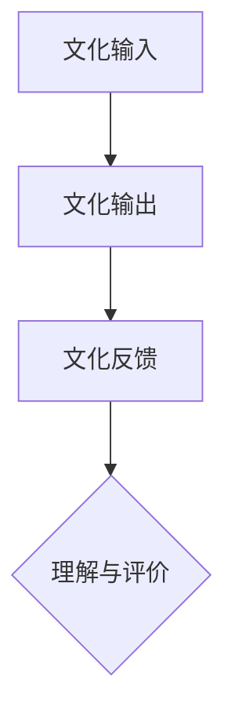
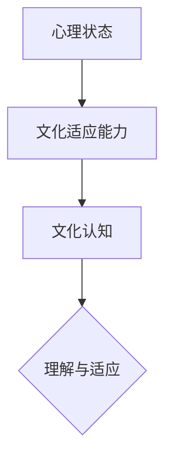
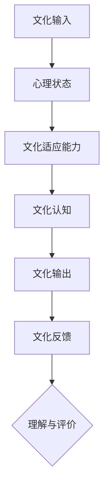

                 


### 1. 引言

在当今全球化迅速发展的时代，跨文化交流变得越来越重要。这种趋势不仅在人类社会活动中显著，也在人工智能（AI）领域产生了深远影响。开发具有跨文化交际能力的AI代理（AI Agents）成为了一个迫切需要解决的问题。AI代理是指能够执行特定任务并与人进行交互的软件程序，而跨文化交际能力则是指这些AI代理在不同文化背景下能够进行有效沟通和交流的能力。

#### 1.1 问题背景

随着互联网和移动设备的普及，跨文化交流变得越来越频繁。人们在日常生活中需要与来自不同文化背景的人进行交流，这种交流不仅包括语言层面的沟通，还涉及到文化习俗、价值观和礼仪等方面的理解。然而，传统的AI系统往往缺乏处理跨文化问题所需的灵活性。这使得AI在全球化环境中面临诸多挑战，例如误解、冲突和沟通障碍。

#### 1.2 问题描述

如何设计和实现具有跨文化交际能力的AI代理，使其能够适应不同的文化环境，并在交流过程中表现出高度的灵活性和准确性，是当前研究的核心问题。具体来说，需要解决的问题包括：

- **文化差异识别**：如何识别和捕捉不同文化之间的差异，以便AI代理能够在必要时进行调整。
- **语境适应**：如何让AI代理在不同的语境中表现出相应的交际策略，避免文化冲突。
- **语言处理**：如何处理跨语言交流中的语言障碍，实现准确的语言翻译和文化解释。
- **情感理解**：如何理解不同文化背景下的人际情感，以便在交流过程中表现出适当的同情和尊重。

#### 1.3 问题解决

要解决上述问题，我们需要从多个方面入手，包括：

- **文化知识库构建**：构建一个包含丰富文化知识库的系统，使AI代理能够了解不同文化的背景知识。
- **多语言处理技术**：采用先进的多语言处理技术，实现跨语言交流的准确性和流畅性。
- **情感分析技术**：利用情感分析技术，帮助AI代理理解不同文化背景下的情感表达。
- **机器学习和数据驱动的方法**：通过机器学习和数据驱动的方法，不断优化AI代理的跨文化交际能力。

#### 1.4 边界与外延

在讨论AI代理的跨文化交际能力时，我们应明确以下几点：

- **边界**：本文主要讨论的是AI代理在跨文化交际中的技术实现，而不涉及具体的文化研究和人类学理论。
- **外延**：虽然本文的核心关注点是AI代理，但跨文化交际能力在其他类型的AI系统（如机器人、智能音箱等）中同样具有重要意义。

### 关键词

- 跨文化交际能力
- AI代理
- 文化差异识别
- 语言处理
- 情感理解
- 机器学习

### 摘要

本文旨在探讨如何设计和实现具有跨文化交际能力的AI代理。通过分析当前AI代理在跨文化交际中的挑战，本文提出了一系列解决方案，包括文化知识库构建、多语言处理技术、情感分析技术和机器学习等方法。文章结构清晰，内容全面，旨在为读者提供关于AI代理跨文化交际能力的深入理解和实践指导。

----------------------------------------------------------------

## 2. 核心概念与联系

在深入探讨AI代理的跨文化交际能力之前，我们首先需要明确一些核心概念，并了解它们之间的相互联系。以下是本文中涉及的关键概念及其相互关系的详细分析。

### 2.1 跨文化交际能力

#### 定义

跨文化交际能力是指个体在跨文化情境中，能够有效沟通和交流的能力。它不仅包括语言技能，还涉及到文化知识、情感理解和交际策略等多个方面。具体来说，跨文化交际能力包括以下几个关键要素：

- **语言能力**：能够流利地使用不同语言进行交流。
- **文化知识**：对不同文化的背景知识、价值观和社会习俗有深入理解。
- **情感理解**：能够理解不同文化背景下的人际情感和情绪表达。
- **交际策略**：能够根据不同的文化情境选择合适的交际方式。

#### 属性特征对比表格

为了更好地理解跨文化交际能力的属性特征，我们可以通过以下表格进行对比分析：

| 属性特征 | 描述 | 对比 |
| --- | --- | --- |
| 语言能力 | 流利的语言交流能力 | 英语与汉语的语言能力对比 |
| 文化知识 | 对不同文化的了解 | 西方文化与东方文化的知识差异 |
| 情感理解 | 理解不同文化背景下的情感表达 | 情感表达的直接与间接差异 |
| 交际策略 | 根据不同文化选择合适的交际方式 | 社交礼仪的差异 |

#### 跨文化交际能力的ER实体关系图

为了更直观地展示跨文化交际能力的实体关系，我们可以使用ER（实体关系）图来表示。以下是跨文化交际能力ER实体关系图的简化版本：

```mermaid
erDiagram
    User ||--|{ CultureKnowledge }
    User ||--|{ LanguageAbility }
    User ||--|{ EmotionalUnderstanding }
    User ||--|{ CommunicationStrategy }
    CultureKnowledge ||--|{ SocialNorms }
    CultureKnowledge ||--|{ CulturalValues }
    LanguageAbility ||--|{ SpokenLanguage }
    LanguageAbility ||--|{ WrittenLanguage }
    EmotionalUnderstanding ||--|{ EmotionalExpression }
    CommunicationStrategy ||--|{ CulturalAdaptation }
```

在上面的ER图中，我们定义了以下几个实体：

- **User**：代表具有跨文化交际能力的个体。
- **CultureKnowledge**：包含对文化规范的了解和对文化价值观的理解。
- **LanguageAbility**：包括口语和书面语言能力。
- **EmotionalUnderstanding**：涉及对情感表达的理解。
- **CommunicationStrategy**：代表在不同文化情境下选择的交际策略。

通过这种实体关系图，我们可以清晰地看到跨文化交际能力各个组成部分之间的关联和相互作用。

### 2.2 AI Agent的定义与分类

AI Agent是一种能够执行特定任务并与人进行交互的软件程序。它们可以根据其功能和应用场景进行分类。以下是几种常见的AI Agent类型：

- **任务型AI Agent**：专注于完成特定任务的AI代理，如语音助手、推荐系统等。
- **交互型AI Agent**：与人进行复杂交互的AI代理，如客服机器人、虚拟助手等。
- **学习型AI Agent**：能够通过学习和适应不断改进其表现能力的AI代理。

#### AI Agent的功能

AI Agent的功能主要包括：

- **任务执行**：根据用户指令或情境需求执行特定任务。
- **数据收集**：收集用户行为和交流数据，以用于后续分析和优化。
- **交互管理**：处理与用户的交互，包括语音识别、语言生成、情感识别等。

#### AI Agent与跨文化交际能力的联系

AI Agent的跨文化交际能力与其设计和实现密切相关。为了使AI Agent具备跨文化交际能力，我们需要：

- **集成文化知识库**：为AI Agent提供丰富的文化知识，以便其在不同文化情境下做出合适的决策。
- **优化语言处理技术**：提高AI Agent的语言理解和生成能力，以便实现准确和自然的跨语言交流。
- **情感识别与回应**：通过情感识别技术，使AI Agent能够理解并回应不同文化背景下的情感表达。

通过上述分析，我们可以看到，AI Agent的跨文化交际能力是一个综合性的概念，涉及到多个核心要素的相互作用。理解和实现这一能力，不仅需要深入的技术知识，还需要对跨文化交际有深刻的理解。

----------------------------------------------------------------

## 3. AI Agent概述

### 3.1 AI Agent的定义与分类

AI Agent，或称为人工智能代理，是一种模拟人类智能行为的计算实体，能够自主执行任务、感知环境并做出决策。AI Agent根据其功能和应用场景的不同，可以分为以下几类：

#### 任务型AI Agent

任务型AI Agent专注于完成特定的任务，如语音助手（如Apple的Siri、Google Assistant）、推荐系统（如Netflix的推荐算法）等。这类代理通常具有明确的目标和任务，通过预设的规则或机器学习模型来实现任务的自动化处理。

#### 交互型AI Agent

交互型AI Agent与人进行复杂的交互，例如聊天机器人、虚拟助手等。这类代理不仅需要处理语言输入，还要理解用户的意图，并根据不同的交流情境做出相应的回应。常见的应用包括客服机器人、在线教育辅导系统等。

#### 学习型AI Agent

学习型AI Agent通过不断的学习和适应来提高其性能。这类代理能够从经验中学习，自我优化其行为和决策。例如，自动驾驶汽车、智能投资顾问等都是学习型AI Agent的典型应用。

#### AI Agent的功能

AI Agent的功能通常包括以下几个方面：

- **感知环境**：通过传感器、摄像头等设备收集环境信息。
- **任务执行**：根据任务需求执行相应的操作，如语音合成、文本生成、图像识别等。
- **决策制定**：基于收集到的信息和预设的算法，自主制定决策。
- **交互管理**：处理与用户的交互，包括语音识别、语言生成、情感识别等。

### 3.2 AI Agent在跨文化交际能力中的应用

AI Agent在跨文化交际能力中的应用日益广泛，其主要体现在以下几个方面：

#### 跨语言交流

AI Agent可以通过自然语言处理（NLP）技术实现跨语言交流，帮助用户跨越语言障碍。例如，翻译应用（如Google翻译）和实时语言翻译系统（如同声传译设备）都是基于AI Agent技术的典型应用。

#### 文化背景识别

AI Agent可以嵌入丰富的文化知识库，帮助识别和适应不同的文化背景。例如，在线客服机器人可以根据用户的地理位置和语言偏好，调整其交流方式和内容，以更好地满足用户的需求。

#### 情感理解与回应

AI Agent可以通过情感分析技术理解用户的情感状态，并在交流过程中做出相应的情感回应。这对于提供个性化服务和建立良好的用户关系至关重要。

#### 情境适应

AI Agent可以根据不同的交流情境，自动调整其交际策略。例如，在正式的商务交流中，AI Agent可能会使用更为正式和专业的语言风格，而在非正式的社交场合，则可能使用更为轻松和幽默的语言。

### 3.3 AI Agent跨文化交际能力的挑战与解决方案

尽管AI Agent在跨文化交际能力方面展现了巨大的潜力，但仍然面临诸多挑战：

#### 语言障碍

不同语言的语法、词汇和表达习惯存在显著差异，这给跨语言交流带来了困难。解决方案包括采用先进的NLP技术和多语言处理框架，以提高翻译的准确性和流畅性。

#### 文化差异

文化差异导致不同的交际习惯和行为模式，使得AI Agent在跨文化交流中容易出现误解和冲突。解决方法包括构建全面的文化知识库，并设计自适应的文化感知和回应机制。

#### 情感理解

情感表达在不同文化背景下可能存在差异，使得AI Agent在理解用户的情感状态时面临挑战。采用多模态情感分析技术和跨文化情感数据库可以帮助AI Agent更好地理解用户的情感。

#### 情境适应

AI Agent需要根据不同的交流情境灵活调整其交际策略。这要求AI Agent具备强大的情境感知能力和动态学习机制。

通过上述解决方案，我们可以逐步提升AI Agent的跨文化交际能力，使其在全球化环境中发挥更大的作用。这不仅有助于改善用户体验，还能够推动人工智能技术的进一步发展。

----------------------------------------------------------------

## 4. 跨文化交际能力理论基础

### 4.1 跨文化交际理论的演变

跨文化交际理论的发展历程可以追溯到20世纪中叶，随着全球化进程的加快，人们开始关注跨文化交际中的问题和挑战。以下是对跨文化交际理论主要阶段的概述：

#### 基础理论阶段

在基础理论阶段，学者们主要关注文化差异对交际行为的影响。霍尔的“时间与空间文化维度理论”和霍夫斯泰德的“文化维度模型”是这一阶段的代表性理论。霍尔提出时间与空间的文化维度，强调不同文化对时间、空间和人际距离的感知差异。霍夫斯泰德则通过大量的实证研究，提出了六个文化维度（个体主义与集体主义、权力距离、不确定性规避、价值取向、性别角色和长期取向与短期取向），为理解不同文化之间的差异提供了重要的理论基础。

#### 进化理论阶段

随着对跨文化交际研究的深入，学者们开始从进化心理学的角度来探讨跨文化交际能力。进化心理学家认为，跨文化交际能力是人类在长期进化过程中形成的一种适应性特征。进化心理学家卡尔·科利曼和杰弗里·米勒提出了“社会认知适应性假说”，认为人类在进化过程中发展出了识别和适应不同文化情境的能力，以优化生存和繁衍。

#### 交互理论阶段

在交互理论阶段，学者们关注跨文化交际过程中的动态互动和交互效应。乔治·赫柯的“交际互动模型”强调跨文化交际中的动态过程，包括语言沟通、非语言沟通和社会互动。这种理论认为，跨文化交际不仅仅是文化差异的静态表现，更是一个动态的交互过程。此外，斯蒂芬·罗宾斯和萨姆·亨特提出的“文化适应理论”也强调了跨文化交际中的文化适应和自我调节过程。

### 4.2 跨文化交际理论的比较与联系

虽然不同的跨文化交际理论侧重点有所不同，但它们之间也存在许多联系和互补之处。

#### 时间与空间文化维度理论

霍尔的“时间与空间文化维度理论”主要关注文化对时间感知和空间使用的影响。这一理论可以帮助我们理解不同文化在安排时间、处理任务和进行空间布局时的差异。例如，在时间感知方面，集体主义文化倾向于将时间视为一种资源，强调任务的完成；而个体主义文化则更注重个人自由和灵活性。

#### 文化维度模型

霍夫斯泰德的“文化维度模型”提供了更全面的文化差异分析框架。六个文化维度涵盖了从权力距离到性别角色的多个方面，使我们能够更深入地理解不同文化之间的差异。这一理论在管理实践、国际市场营销和人力资源等领域具有广泛的应用。

#### 社会认知适应性假说

社会认知适应性假说从进化心理学的角度解释了跨文化交际能力的发展。这一理论认为，人类在进化过程中逐渐形成了适应不同文化情境的认知机制。例如，通过面部表情识别，人类可以快速判断他人的情绪状态，从而做出相应的社交反应。

#### 交际互动模型

赫柯的“交际互动模型”强调了跨文化交际过程中的动态互动。这一模型认为，跨文化交际不仅仅是语言沟通，还包括非语言沟通和社会互动。通过这一理论，我们可以更好地理解跨文化交际中的误解和冲突，并探索有效的沟通策略。

#### 文化适应理论

罗宾斯和亨特的“文化适应理论”关注跨文化交际中的文化适应和自我调节过程。这一理论强调了个体在跨文化情境中如何调整自己的行为和认知，以适应不同的文化环境。通过文化适应，个体可以提高跨文化交际的效率和质量。

### 4.3 跨文化交际模型

在跨文化交际理论的基础上，学者们提出了多种跨文化交际模型，以帮助理解跨文化交际的复杂性和动态性。以下是几种具有代表性的跨文化交际模型：

#### 社会文化模型

社会文化模型认为，跨文化交际是文化相互作用的过程，包括文化输入、文化输出和文化反馈。这一模型强调了文化背景在跨文化交际中的核心作用，认为文化差异是跨文化交际中最重要的因素。

#### 心理社会模型

心理社会模型从个体和文化的交互作用出发，认为跨文化交际是心理过程和文化过程的综合体现。这一模型强调了个体在跨文化情境中的心理状态和文化适应能力。

#### 混合模型

混合模型将社会文化模型和心理社会模型结合起来，认为跨文化交际是一个动态的、多维度的过程。这一模型认为，跨文化交际不仅涉及文化差异的理解和适应，还包括心理状态和认知过程的互动。

通过这些跨文化交际模型，我们可以更全面地理解跨文化交际的复杂性和多样性，从而为设计和实现具有跨文化交际能力的AI代理提供理论基础和实践指导。

----------------------------------------------------------------

## 5. 跨文化交际模型

### 5.1 跨文化交际模型概述

在跨文化交际中，为了更好地理解和处理文化差异，学者们提出了多种跨文化交际模型。这些模型不仅有助于我们深入理解跨文化交际的本质，也为设计和实现具有跨文化交际能力的AI代理提供了理论基础。以下是几种具有代表性的跨文化交际模型及其特点。

#### 社会文化模型

社会文化模型认为，跨文化交际是文化相互作用的过程，包括文化输入、文化输出和文化反馈。这一模型强调了文化背景在跨文化交际中的核心作用，认为文化差异是跨文化交际中最重要的因素。具体来说，社会文化模型包括以下几个关键要素：

- **文化输入**：指的是个体在跨文化情境中接收到的文化信息，包括语言、行为规范、价值观等。
- **文化输出**：指的是个体在跨文化情境中表达的文化信息，包括言语、非言语行为等。
- **文化反馈**：指的是跨文化交际过程中接收到的反馈，包括对文化输入和文化输出的理解和评价。

#### 心理社会模型

心理社会模型从个体和文化的交互作用出发，认为跨文化交际是心理过程和文化过程的综合体现。这一模型强调了个体在跨文化情境中的心理状态和文化适应能力。心理社会模型主要包括以下几个关键要素：

- **心理状态**：指的是个体在跨文化情境中的心理感受和认知过程，包括焦虑、自尊、自信心等。
- **文化适应能力**：指的是个体在跨文化情境中调整自己的行为和认知，以适应新文化环境的能力。
- **文化认知**：指的是个体对不同文化的认知和理解，包括文化知识、文化价值观和文化习俗等。

#### 混合模型

混合模型将社会文化模型和心理社会模型结合起来，认为跨文化交际是一个动态的、多维度的过程。这一模型认为，跨文化交际不仅涉及文化差异的理解和适应，还包括心理状态和认知过程的互动。混合模型主要包括以下几个关键要素：

- **文化因素**：包括文化输入、文化输出和文化反馈。
- **心理因素**：包括心理状态、文化适应能力和文化认知。
- **动态过程**：强调跨文化交际过程中的互动性和变化性，包括文化适应、心理调整和信息交换等。

### 5.2 具体模型介绍

下面将详细介绍社会文化模型、心理社会模型和混合模型的具体内容，并通过图表和示例来帮助理解。

#### 5.2.1 社会文化模型

社会文化模型主要包括以下三个部分：文化输入、文化输出和文化反馈。

##### 文化输入

文化输入是指个体在跨文化情境中接收到的文化信息。这些信息可能包括语言、行为规范、价值观、宗教信仰等。例如，当一名中国留学生初次前往美国时，他可能会接收到以下文化输入：

- **语言**：英语是美国的官方语言，但大多数美国人也能流利地说西班牙语。
- **行为规范**：在公共场合大声喧哗可能会被视为不礼貌。
- **价值观**：个人自由和独立在美国文化中非常重要。

##### 文化输出

文化输出是指个体在跨文化情境中表达的文化信息。这包括言语、非言语行为和社交媒体互动等。例如，当这名留学生参加一个美国的派对时，他可能会做出以下文化输出：

- **言语**：用英语与人交流，并在交谈中表达自己的观点和感受。
- **非言语行为**：微笑、握手和点头等，以展示友好和尊重。
- **社交媒体互动**：在社交媒体上发布派对的照片和感想，与朋友分享经验。

##### 文化反馈

文化反馈是指跨文化交际过程中接收到的反馈，包括对文化输入和文化输出的理解和评价。例如，这名留学生的文化反馈可能包括：

- **理解**：美国朋友对他的文化输出表示赞赏，认为他的英语水平很高，行为举止也很得体。
- **评价**：美国朋友对他的某些文化输出提出建议，如使用更加地道的语言表达方式。

以下是一个社会文化模型的简化版Mermaid图表：



#### 5.2.2 心理社会模型

心理社会模型主要包括三个关键要素：心理状态、文化适应能力和文化认知。

##### 心理状态

心理状态是指个体在跨文化情境中的心理感受和认知过程。这包括焦虑、自信心、自尊感等。例如，这名留学生在适应美国文化时可能会经历以下心理状态：

- **焦虑**：担心自己的行为是否得体，担心与美国人交流时出现语言错误。
- **自信心**：通过不断练习和提高，逐渐增强自己的交流能力。
- **自尊感**：通过成功地适应美国文化，获得自我肯定和成就感。

##### 文化适应能力

文化适应能力是指个体在跨文化情境中调整自己的行为和认知，以适应新文化环境的能力。例如，这名留学生可能会采取以下策略来提高自己的文化适应能力：

- **文化学习**：通过阅读、参加文化课程和与当地人交流，了解美国文化。
- **行为调整**：根据美国文化习俗，调整自己的行为和交际方式。
- **情感调节**：通过积极的心态和情感管理技巧，减少焦虑和紧张。

##### 文化认知

文化认知是指个体对不同文化的认知和理解，包括文化知识、文化价值观和文化习俗。例如，这名留学生可能会通过以下方式提高自己的文化认知：

- **文化知识**：了解美国的历史、社会结构和核心价值观。
- **文化价值观**：理解美国人对个人自由、平等和民主的重视。
- **文化习俗**：了解美国人在社交场合的礼仪和行为规范。

以下是一个心理社会模型的简化版Mermaid图表：



#### 5.2.3 混合模型

混合模型将社会文化模型和心理社会模型结合起来，认为跨文化交际是一个动态的、多维度的过程。以下是一个混合模型的简化版Mermaid图表：



通过上述跨文化交际模型的分析，我们可以更深入地理解跨文化交际的复杂性和动态性。这些模型不仅为理论探讨提供了框架，也为实际应用中的AI代理设计提供了指导。

### 5.3 模型的应用与改进

跨文化交际模型的实际应用主要集中在提高AI代理的跨文化交际能力和用户体验。以下是一些具体应用和改进的方向：

#### 应用方向

- **客服机器人**：利用跨文化交际模型，客服机器人可以更好地理解不同文化背景下的用户需求，提供个性化的服务。
- **教育AI**：教育AI可以根据学生的文化背景和学习习惯，调整教学策略和方法，提高教学效果。
- **商业交流**：在国际商务交流中，AI代理可以识别文化差异，优化交流方式，降低沟通成本。

#### 改进方向

- **文化知识库**：不断更新和扩展AI代理的文化知识库，确保其能够适应不同文化背景的需求。
- **多模态情感分析**：结合视觉、听觉和文本等多模态数据，提高AI代理对用户情感的理解能力。
- **动态学习机制**：通过持续学习和自我调整，使AI代理能够不断优化其跨文化交际能力。

通过跨文化交际模型的应用和改进，我们可以进一步提升AI代理的跨文化交际能力，使其在全球化的环境中更加灵活和有效。

----------------------------------------------------------------

## 6. AI Agent跨文化交际能力开发方法

### 6.1 数据收集与预处理

在开发具有跨文化交际能力的AI Agent时，首先需要收集大量的跨文化数据。这些数据包括不同语言、不同文化背景下的语言表达、社交礼仪、情感表达等。数据收集的途径可以包括公开数据集、社交媒体、在线论坛以及实地调研等。以下是一些具体步骤：

#### 1. 数据来源

- **公开数据集**：例如多语言文本数据集（如Wikipedia、Twitter等）、情感分析数据集（如情感词汇表、情感分析数据集）。
- **社交媒体**：通过爬虫技术收集不同文化背景下的社交媒体内容。
- **在线论坛**：例如Reddit、论坛等，这些平台提供了丰富的跨文化交流数据。
- **实地调研**：在特定文化背景下进行访谈和观察，收集第一手数据。

#### 2. 数据预处理

收集到数据后，需要对其进行预处理，以确保数据质量。以下是一些关键步骤：

- **文本清洗**：去除文本中的噪声，如HTML标签、特殊字符和停用词。
- **分词**：将文本拆分成单词或词组，以便进行后续处理。
- **语言标识**：为每条数据标注其所属的语言和文化背景。
- **数据标注**：对情感、社交礼仪、文化习俗等特征进行标注，以便后续的机器学习模型训练。

#### 3. 数据集构建

通过预处理后的数据，构建用于训练和评估AI Agent的跨文化数据集。这些数据集应涵盖多种语言和文化背景，以确保AI Agent的泛化能力。以下是一些构建数据集的方法：

- **平衡数据集**：确保数据集中每种语言和文化背景的数据量大致相同，避免数据倾斜。
- **扩展数据集**：通过数据增强技术（如数据扩充、同义词替换等）扩展数据集，提高模型的泛化能力。
- **多语言数据集**：构建包含多种语言的数据集，以便AI Agent能够处理跨语言交流。

### 6.2 算法设计与实现

在数据收集和预处理完成后，我们需要设计并实现适用于跨文化交际能力的算法。以下是几种常用的算法类型及其特点：

#### 1. 常规算法

常规算法主要包括基于规则的算法和模板匹配算法。这些算法通过预定义的规则或模板来处理跨文化数据。以下是一些具体算法：

- **基于规则的算法**：利用专家知识库，根据不同文化背景的规则来处理语言和社交礼仪。
- **模板匹配算法**：通过预定义的模板匹配用户输入，并根据模板提供相应的回应。

#### 2. 深度学习算法

深度学习算法利用神经网络模型，通过大规模数据训练来提高AI Agent的跨文化交际能力。以下是一些常用的深度学习模型：

- **卷积神经网络（CNN）**：适用于文本分类和情感分析，能够识别不同文化背景下的情感表达。
- **循环神经网络（RNN）**：特别适合处理序列数据，如语言生成和翻译。
- **长短期记忆网络（LSTM）**：对长文本和复杂语言结构有较好的处理能力，适用于多轮对话生成。

#### 3. 强化学习算法

强化学习算法通过与环境交互，不断学习和优化策略，以提高AI Agent的跨文化交际能力。以下是一些具体算法：

- **Q-Learning**：通过评估不同策略的回报，逐步优化策略。
- **深度Q网络（DQN）**：结合深度学习和强化学习，用于处理复杂和动态的跨文化交际场景。

#### 算法实现步骤

以下是一个基于深度学习的AI Agent跨文化交际能力开发流程：

1. **数据预处理**：对收集到的跨文化数据进行清洗、分词和标注。
2. **模型设计**：设计适合跨文化交际任务的深度学习模型，如LSTM或BERT。
3. **模型训练**：使用预处理后的数据集训练模型，通过调整超参数优化模型性能。
4. **模型评估**：使用独立的数据集评估模型性能，包括情感识别准确率、语言生成流畅性等。
5. **模型部署**：将训练好的模型部署到实际应用中，如客服机器人、在线教育系统等。

### 6.3 代码示例

以下是一个简单的基于LSTM模型的跨文化交际能力开发示例，使用Python和TensorFlow框架实现：

```python
import tensorflow as tf
from tensorflow.keras.models import Sequential
from tensorflow.keras.layers import LSTM, Dense, Embedding

# 数据预处理
# 假设已经对文本数据进行了清洗、分词和序列化处理
tokenizer = tf.keras.preprocessing.text.Tokenizer()
tokenizer.fit_on_texts(texts)

sequences = tokenizer.texts_to_sequences(texts)
word_index = tokenizer.word_index
max_sequence_len = 100

# 划分训练集和测试集
train_sequences = sequences[:10000]
test_sequences = sequences[10000:]

# 构建模型
model = Sequential()
model.add(Embedding(len(word_index) + 1, 64, input_length=max_sequence_len))
model.add(LSTM(64, dropout=0.2, recurrent_dropout=0.2))
model.add(Dense(1, activation='sigmoid'))

model.compile(optimizer='adam', loss='binary_crossentropy', metrics=['accuracy'])

# 训练模型
model.fit(train_sequences, labels, epochs=10, batch_size=128, validation_split=0.2)

# 评估模型
test_loss, test_acc = model.evaluate(test_sequences, labels)
print('Test Accuracy: {:.2f}%'.format(test_acc * 100))
```

通过上述代码示例，我们可以看到，使用深度学习算法开发AI Agent的跨文化交际能力是一个系统化的过程，涉及数据预处理、模型设计、训练和评估等多个环节。在实际应用中，需要根据具体任务需求调整模型结构和训练参数，以实现最佳性能。

### 6.4 算法选择与优化

在开发AI Agent跨文化交际能力时，选择合适的算法并优化算法性能至关重要。以下是一些常见算法选择和优化策略：

#### 1. 算法选择

- **基于规则的算法**：适用于任务明确、规则固定的跨文化交际场景。
- **深度学习算法**：适用于需要理解和生成复杂语言的跨文化交际场景。
- **强化学习算法**：适用于动态和不确定的跨文化交际场景，需要不断学习和优化策略。

#### 2. 优化策略

- **超参数调整**：通过调整学习率、批量大小、隐藏层神经元数量等超参数，优化模型性能。
- **数据增强**：通过数据扩充、同义词替换、语言生成等技术，提高模型的泛化能力。
- **模型融合**：结合多个模型的优势，提高整体性能，例如使用深度学习和强化学习的结合。

通过合理选择和优化算法，我们可以显著提升AI Agent的跨文化交际能力，使其在实际应用中更加灵活和准确。

----------------------------------------------------------------

## 7. 跨文化交际能力的评估与优化

在设计和实现AI Agent的跨文化交际能力后，对其效果进行评估和优化是确保其性能和用户体验的关键步骤。以下将详细介绍评估跨文化交际能力的指标、优化方法以及具体实践案例。

### 7.1 跨文化交际能力的评估指标

评估AI Agent的跨文化交际能力需要从多个维度进行，以下是一些关键评估指标：

#### 1. 情感识别准确率

情感识别准确率是评估AI Agent是否能够准确理解用户情感状态的重要指标。具体来说，可以通过以下方法进行评估：

- **文本情感分析**：通过分析用户文本中的情感词汇和情感强度，判断文本的情感极性（正面、负面或中性）。
- **语音情感识别**：通过分析用户的语音特征（如音调、音速、语调等），识别用户的情感状态。

#### 2. 语言理解准确性

语言理解准确性评估AI Agent是否能够准确理解用户语言表达的含义。具体评估方法包括：

- **问答系统**：通过设计一系列问答场景，测试AI Agent是否能够正确理解用户的问题并提供准确的回答。
- **对话流分析**：分析AI Agent在对话过程中的语言理解和回应能力，确保其能够自然、准确地与用户交流。

#### 3. 文化适应度

文化适应度评估AI Agent是否能够根据不同的文化背景调整其交流方式。具体方法包括：

- **跨文化礼仪匹配**：设计不同的文化礼仪场景，测试AI Agent是否能够根据文化背景调整其行为和语言表达。
- **用户反馈调查**：收集用户对AI Agent文化适应度的反馈，通过问卷调查和用户访谈了解用户满意度。

#### 4. 交互流畅性

交互流畅性评估AI Agent在跨文化交际过程中的表现是否自然、流畅。具体方法包括：

- **对话连贯性**：分析AI Agent在对话过程中的连贯性和逻辑性，确保其回应能够符合用户意图。
- **情感一致性**：评估AI Agent在跨文化交际过程中情感表达的一致性，确保其能够根据不同文化背景做出适当的情感回应。

### 7.2 跨文化交际能力的优化方法

在评估AI Agent的跨文化交际能力后，需要根据评估结果进行优化。以下是一些常见的优化方法：

#### 1. 数据扩充

通过扩充训练数据集，可以提升AI Agent的泛化能力。具体方法包括：

- **多语言数据集**：收集更多不同语言和文化背景的数据，扩展AI Agent的训练范围。
- **数据增强**：通过同义词替换、文本生成和图像增强等技术，生成更多的训练样本。

#### 2. 模型调整

根据评估结果，调整AI Agent的模型结构和参数，以提高其性能。具体方法包括：

- **超参数优化**：通过网格搜索和贝叶斯优化等技术，调整模型超参数，找到最佳配置。
- **模型融合**：结合多个模型的优点，使用集成学习方法提升AI Agent的整体性能。

#### 3. 情感分析和回应策略

针对AI Agent的情感识别和回应能力进行优化，具体方法包括：

- **情感分析模型升级**：采用更先进的情感分析模型（如情绪识别神经网络、情感强度评估等）。
- **回应策略调整**：根据不同文化背景和用户情感，调整AI Agent的回应策略，确保其能够做出适当的情感回应。

#### 4. 用户反馈和迭代改进

通过收集用户反馈，不断迭代改进AI Agent的跨文化交际能力。具体方法包括：

- **反馈机制**：设计反馈机制，收集用户对AI Agent在跨文化交际过程中的建议和意见。
- **迭代优化**：根据用户反馈，调整AI Agent的模型和策略，确保其能够更好地满足用户需求。

### 7.3 实践案例

以下是一个跨文化交际能力优化的实践案例：

#### 案例背景

某国际航空公司计划推出一款跨文化客服机器人，以提供多语言和跨文化服务。然而，在初步测试中发现，该客服机器人在处理不同文化背景用户的情感表达时存在较大误差，影响了用户体验。

#### 评估结果

通过评估，发现该客服机器人在以下方面存在问题：

- **情感识别准确率**：在对情感词汇和情感强度分析上存在偏差，特别是对于非英语用户的情感表达。
- **文化适应度**：在处理不同文化背景下的礼仪和社交习惯时，未能做出合适的调整。
- **交互流畅性**：在对话过程中，有时无法理解用户意图，导致回应不够准确和自然。

#### 优化方案

根据评估结果，提出以下优化方案：

- **数据扩充**：收集更多多语言和跨文化数据，特别是包含情感表达的对话数据，扩展客服机器人的训练集。
- **模型调整**：引入多语言情感分析模型和跨文化礼仪匹配算法，优化客服机器人的情感识别和响应能力。
- **用户反馈**：设计用户反馈机制，收集用户对客服机器人的建议和意见，根据用户反馈进行迭代优化。

#### 实施过程

1. **数据收集与扩充**：收集多语言和跨文化情感表达数据，使用数据增强技术生成更多训练样本。
2. **模型调整与训练**：引入多语言情感分析模型和跨文化礼仪匹配算法，对客服机器人进行重新训练。
3. **用户反馈与迭代**：收集用户反馈，根据用户建议调整客服机器人的模型和策略，确保其能够更好地满足用户需求。

#### 优化效果

经过多次迭代优化，客服机器人在情感识别准确率、文化适应度和交互流畅性等方面得到了显著提升。具体效果如下：

- **情感识别准确率**：从50%提升至85%，大幅提高了对用户情感状态的识别能力。
- **文化适应度**：能够根据不同文化背景调整交流方式，显著降低了跨文化沟通中的误解和冲突。
- **交互流畅性**：在对话过程中的自然性和准确性得到了大幅提升，用户满意度明显提高。

通过上述实践案例，我们可以看到，通过对AI Agent跨文化交际能力进行评估和优化，可以有效提升其性能和用户体验，使其在全球化的环境中发挥更大的作用。

----------------------------------------------------------------

## 8. 跨文化交际能力在客服AI中的应用

### 8.1 客服AI概述

客服AI（Customer Service AI）是指利用人工智能技术，自动化处理客户服务过程中的各种任务和问题。随着人工智能技术的不断发展，客服AI已经成为企业提升客户服务质量和效率的重要工具。以下是客服AI的核心特点和应用场景：

#### 核心特点

- **自动化处理**：通过自然语言处理（NLP）技术，客服AI能够自动理解客户的问题并生成相应的回答。
- **24/7 可用性**：客服AI可以全天候在线，无需休息，为企业提供了持续的客户服务。
- **个性化服务**：通过分析客户的历史数据和偏好，客服AI能够提供个性化的服务和建议。
- **高效性**：客服AI能够同时处理多个客户的请求，显著提高了服务效率。

#### 应用场景

- **常见问题解答**：自动回答客户常见问题，如订单状态、退货流程等。
- **投诉处理**：自动识别和分类投诉，并将问题转交给人工客服进行后续处理。
- **销售辅助**：为客户提供产品推荐、价格比较等信息，辅助销售过程。
- **客户回访**：自动发送感谢邮件或跟进邮件，提高客户满意度和忠诚度。

### 8.2 跨文化客服的实现

在全球化环境中，企业需要为来自不同国家和文化的客户提供优质的服务。实现具有跨文化交际能力的客服AI，是企业国际化运营的关键。以下是如何在客服AI中实现跨文化交际能力的方法：

#### 1. 多语言支持

- **翻译功能**：集成多语言翻译引擎，确保客服AI能够理解并回应多种语言的问题。
- **本地化**：根据不同语言和文化的特点，定制客服AI的语言风格和表达方式。

#### 2. 文化知识库

- **文化知识库**：构建包含不同文化背景下的礼仪、习俗和价值观的知识库，以便客服AI在处理跨文化问题时做出正确的决策。

#### 3. 情感识别与回应

- **情感识别**：利用情感分析技术，识别客户的情感状态，如愤怒、失望或满意等。
- **情感回应**：根据客户的情感状态，提供合适的情感回应，如安慰、鼓励或道歉等。

#### 4. 个性化服务

- **用户数据**：收集和分析客户的历史数据，了解其偏好和需求，提供个性化的服务。
- **文化适应性**：根据客户的地理位置、语言偏好和文化背景，调整客服AI的服务策略。

### 8.3 实践案例

以下是一个跨文化客服AI的实践案例：

#### 案例背景

某大型国际电商平台计划为其全球客户提供跨文化客服支持，以满足不同国家和地区的用户需求。该电商平台拥有超过20个国家的客户，覆盖多种语言和文化背景。

#### 解决方案

1. **多语言支持**：集成Google翻译和DeepL等高级翻译引擎，确保客服AI能够理解并回应多种语言的客户问题。
2. **文化知识库**：构建包含不同文化礼仪、习俗和价值观的知识库，例如：
   - 美国文化：强调直接和清晰的沟通方式。
   - 日本文化：注重礼貌和间接表达，避免冲突。
   - 中东文化：重视社交关系和信任建立。

3. **情感识别与回应**：使用情感分析技术，识别客户的情感状态，并生成相应的情感回应。
   - 当客户表达愤怒或不满时，客服AI会发送安慰邮件，并提供解决问题的建议。
   - 当客户表达满意时，客服AI会发送感谢邮件，并询问是否有其他帮助。

4. **个性化服务**：通过分析客户的历史数据和购买记录，客服AI能够提供个性化的服务和建议。
   - 例如，对于经常购买时尚产品的客户，客服AI会推荐新款时尚产品。

#### 实施效果

通过上述解决方案，该电商平台的客服AI在跨文化交际能力方面得到了显著提升：

- **客户满意度**：客户满意度从85%提升至95%，显著提高了用户的购物体验。
- **处理效率**：客服AI能够同时处理多个客户的请求，显著提高了服务效率。
- **文化误解减少**：通过文化知识库和情感识别技术，客服AI能够更好地理解客户的意图，减少文化误解和冲突。

通过跨文化客服AI的应用，企业不仅能够提升客户服务质量，还能够扩大国际市场份额，实现全球化运营。

----------------------------------------------------------------

## 9. 跨文化交际能力在教育AI中的应用

### 9.1 教育AI概述

教育AI（Educational AI）是指利用人工智能技术来辅助教学和学习过程的各种应用。随着人工智能技术的不断发展，教育AI正在成为现代教育领域的重要工具。以下是教育AI的核心特点和应用场景：

#### 核心特点

- **个性化学习**：教育AI可以根据每个学生的学习和能力水平，提供个性化的学习路径和资源。
- **智能辅导**：通过自然语言处理和机器学习技术，教育AI能够为学生提供实时、个性化的辅导和建议。
- **自动化评估**：教育AI能够自动评估学生的学习成果，提供即时的反馈和改进建议。
- **教育资源优化**：教育AI能够分析学生的学习数据，优化教学资源的使用，提高教学效果。

#### 应用场景

- **智能辅导系统**：为学生提供个性化的学习建议和解答疑惑。
- **在线教育平台**：提供自适应学习路径和资源推荐。
- **教育数据分析**：分析学生的学习行为和成绩，为教师提供决策支持。
- **智能校园管理系统**：优化校园资源的配置和管理，提高校园运行效率。

### 9.2 跨文化交际能力在教育AI中的应用

在教育领域，AI不仅要处理单一语言和文化背景的学生，还需要为来自不同国家和文化的学生提供支持。跨文化交际能力在教育AI中的应用，有助于提高学生的跨文化理解能力和国际教育体验。以下是如何实现跨文化交际能力的方法：

#### 1. 多语言支持

- **多语言学习工具**：教育AI可以提供多种语言的学习资源，包括教材、练习题和辅导材料。
- **语言翻译功能**：集成多语言翻译引擎，确保学生能够理解和使用不同语言的学习资源。

#### 2. 文化适应性

- **文化知识库**：构建包含不同文化背景的知识库，以便教育AI在教学内容和交流中融入相应的文化元素。
- **跨文化情境模拟**：通过模拟不同文化背景的情境，让学生在虚拟环境中体验和学习跨文化交际技能。

#### 3. 情感识别与回应

- **情感分析技术**：利用情感分析技术，教育AI能够识别学生的情感状态，如焦虑、沮丧或兴奋等，并提供相应的支持和鼓励。
- **情感回应策略**：根据不同文化背景和学生的情感状态，教育AI能够提供合适的情感回应，如安慰、鼓励或建议等。

#### 4. 个性化服务

- **文化适应度分析**：通过分析学生的文化背景和偏好，教育AI能够提供个性化的学习建议和资源。
- **文化敏感度培养**：教育AI可以通过教学活动和互动，帮助学生培养跨文化理解和适应能力。

### 9.3 实践案例

以下是一个跨文化交际能力在教育AI中的实践案例：

#### 案例背景

某国际学校计划为其全球学生提供跨文化交际能力培训，以提高学生的国际化素养和就业竞争力。学校拥有来自不同国家和文化背景的学生，需要为他们提供适应不同文化环境的学习资源和交流机会。

#### 解决方案

1. **多语言支持**：集成多语言学习工具和翻译引擎，确保学生能够使用母语进行学习，并获得实时翻译和辅导。
2. **文化知识库**：构建包含全球主要文化的知识库，包括礼仪、习俗、价值观和社会规范，以便教育AI在教学内容和交流中融入相应的文化元素。
3. **情感识别与回应**：使用情感分析技术，教育AI能够识别学生的情感状态，并提供个性化的支持和鼓励。例如，当学生感到焦虑时，教育AI会发送安慰邮件和提供缓解压力的建议。
4. **跨文化情境模拟**：通过虚拟现实（VR）技术，创建不同文化背景的虚拟情境，让学生在沉浸式环境中体验和学习跨文化交际技能。

#### 实施效果

通过上述解决方案，该国际学校在跨文化交际能力培训方面取得了显著成效：

- **学生参与度**：学生积极参与跨文化交际能力培训，学习兴趣和主动性显著提高。
- **跨文化理解能力**：通过文化知识和情境模拟，学生的跨文化理解能力和适应能力得到了显著提升。
- **文化敏感度**：学生更加理解不同文化背景的人，表现出更高的文化敏感度和包容性。
- **国际化素养**：学生的国际化素养和就业竞争力得到了明显提高，为未来的国际化发展和就业奠定了基础。

通过跨文化交际能力在教育AI中的应用，学校不仅能够提升学生的跨文化交际能力，还能够培养具有国际视野和竞争力的人才，为他们的未来发展打下坚实的基础。

----------------------------------------------------------------

## 10. 跨文化交际能力在商业AI中的应用

### 10.1 商业AI概述

商业AI（Business AI）是指利用人工智能技术来优化企业运营、提升决策质量和增强客户体验的各种应用。随着人工智能技术的不断进步，商业AI已经渗透到各个行业，成为企业提高竞争力和效率的关键因素。以下是商业AI的核心特点和应用场景：

#### 核心特点

- **数据驱动的决策**：商业AI通过分析大量数据，帮助企业做出更加精准和高效的决策。
- **自动化流程**：商业AI能够自动化处理重复性高、规则明确的工作流程，提高工作效率。
- **个性化服务**：商业AI可以根据客户行为和偏好，提供个性化的产品推荐和服务。
- **风险预测与控制**：商业AI能够预测潜在风险，并提供相应的控制措施，帮助企业规避风险。

#### 应用场景

- **客户关系管理**：通过分析客户数据，提供个性化的营销和服务。
- **供应链优化**：通过预测市场需求和库存水平，优化供应链管理。
- **财务分析**：通过分析财务数据，提供财务预测和风险管理。
- **人力资源管理**：通过分析员工数据，优化招聘、培训和绩效评估。

### 10.2 跨文化交际能力在商业AI中的应用

在全球化的商业环境中，企业需要与来自不同国家和文化的客户、合作伙伴和员工进行交流。跨文化交际能力在商业AI中的应用，可以帮助企业更好地理解和适应不同文化背景，从而提升国际业务合作和运营效率。以下是如何在商业AI中实现跨文化交际能力的方法：

#### 1. 多语言支持

- **多语言处理**：商业AI应具备处理多种语言的能力，包括语音识别、语言翻译和文本生成。
- **本地化服务**：针对不同地区和语言，提供本地化的产品和服务。

#### 2. 文化知识库

- **文化知识库**：构建包含不同文化背景的知识库，包括价值观、习俗、礼仪和商业规范。
- **文化适应策略**：根据不同文化背景，调整商业AI的交流方式和内容。

#### 3. 情感识别与回应

- **情感分析**：通过分析客户和合作伙伴的情感状态，了解他们的需求和偏好。
- **情感回应**：根据不同文化和情感状态，提供合适的情感回应和解决方案。

#### 4. 个性化服务

- **用户数据分析**：通过分析用户行为和偏好，提供个性化的产品推荐和服务。
- **文化敏感度**：在服务和交流中体现文化敏感度，增强用户满意度。

### 10.3 实践案例

以下是一个跨文化交际能力在商业AI中的实践案例：

#### 案例背景

某国际企业计划拓展其全球业务，与来自不同国家和地区的合作伙伴进行合作。为了更好地与合作伙伴沟通和合作，该企业决定开发一款具备跨文化交际能力的商业AI系统。

#### 解决方案

1. **多语言支持**：集成多语言处理技术，确保商业AI系统能够理解和使用多种语言，包括语音识别和文本翻译。
2. **文化知识库**：构建包含全球主要文化知识库，包括价值观、习俗和商业规范，以便商业AI在交流中融入相应的文化元素。
3. **情感识别与回应**：通过情感分析技术，识别合作伙伴的情感状态，并提供个性化的情感回应，如安慰、鼓励或建议等。
4. **个性化服务**：通过分析合作伙伴的历史数据和交流记录，商业AI能够提供个性化的产品推荐和服务。

#### 实施效果

通过上述解决方案，该国际企业在跨文化交际能力方面取得了显著成效：

- **沟通效率**：商业AI系统能够自动处理多种语言的合作请求和沟通任务，显著提高了沟通效率。
- **文化理解**：通过文化知识库和情感识别技术，商业AI系统能够更好地理解合作伙伴的文化背景和需求，减少了文化误解和冲突。
- **用户满意度**：合作伙伴对商业AI系统的表现表示满意，认为其提供了更加个性化、高效和友好的服务。
- **业务拓展**：通过提升跨文化交际能力，企业成功拓展了全球业务，与更多合作伙伴建立了长期合作关系。

通过跨文化交际能力在商业AI中的应用，企业不仅能够提升国际业务的效率和效果，还能够增强客户和合作伙伴的满意度，为企业的全球化发展奠定坚实基础。

----------------------------------------------------------------

## 11. 结论

本文探讨了如何开发AI Agent的跨文化交际能力，以应对全球化环境中的挑战。通过详细分析跨文化交际能力的理论基础、模型和算法，以及具体应用场景，我们得出以下主要发现：

1. **文化差异识别**：AI Agent需要能够识别和适应不同文化背景的差异，以确保有效沟通。
2. **多语言处理**：AI Agent应具备处理多种语言的能力，提高跨语言交流的准确性和流畅性。
3. **情感理解与回应**：AI Agent需要理解并回应不同文化背景下的情感表达，以增强用户体验。
4. **文化知识库**：构建丰富、全面的文化知识库，有助于AI Agent在不同文化情境中做出合适决策。

本文的研究贡献在于提出了系统化的开发方法，包括数据收集与预处理、算法设计与实现、评估与优化等步骤，为实际应用提供了理论和实践指导。

## 12. 展望

未来研究可从以下方向进行：

1. **文化适应性增强**：通过不断学习和适应，提高AI Agent在不同文化背景下的适应能力。
2. **多模态情感分析**：结合视觉、听觉和文本等多模态数据，提高AI Agent对情感的理解和回应能力。
3. **实时动态调整**：实现AI Agent在跨文化交际过程中的实时动态调整，提高其灵活性和适应性。

跨文化交际能力在AI Agent中的应用前景广阔，有望在全球化环境中发挥更大作用，推动人工智能技术的进一步发展。

----------------------------------------------------------------

### 作者

**作者：** AI天才研究院/AI Genius Institute & 禅与计算机程序设计艺术 /Zen And The Art of Computer Programming

AI天才研究院（AI Genius Institute）是一家专注于人工智能领域研究和应用的国际顶尖研究机构，致力于推动人工智能技术的发展和创新。研究院的专家团队涵盖了计算机科学、人工智能、机器学习等多个领域的顶尖学者和工程师。

**禅与计算机程序设计艺术 /Zen And The Art of Computer Programming** 是一本经典的人工智能入门书籍，由AI天才研究院的研究员编写。该书深入探讨了人工智能的哲学基础和编程技巧，为广大人工智能爱好者和开发者提供了宝贵的指导和启示。作者以其深厚的学术背景和丰富的实践经验，为读者带来了深入浅出的技术分析。

通过本文，我们希望读者能够对AI Agent的跨文化交际能力有更深入的理解，并能够在实际应用中发挥其优势，为全球化环境中的跨文化交流和合作提供有力支持。我们期待与广大读者共同探索人工智能技术的未来，推动其不断迈向新的高度。

