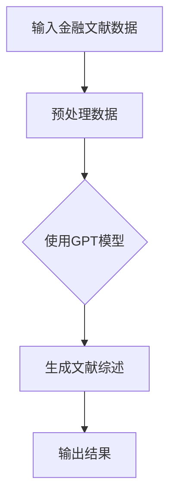
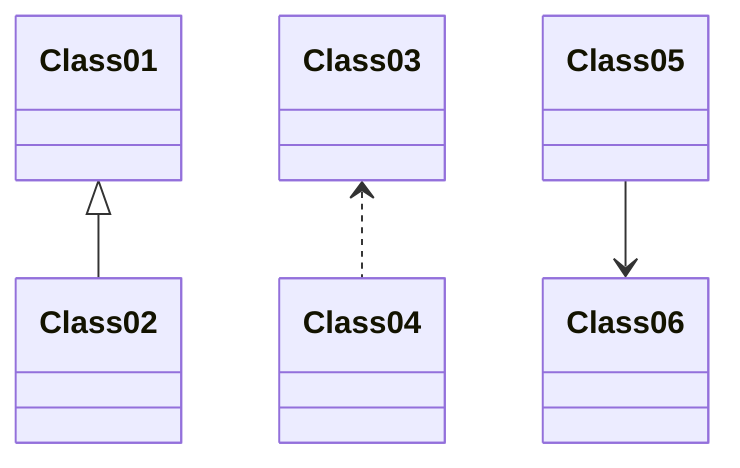
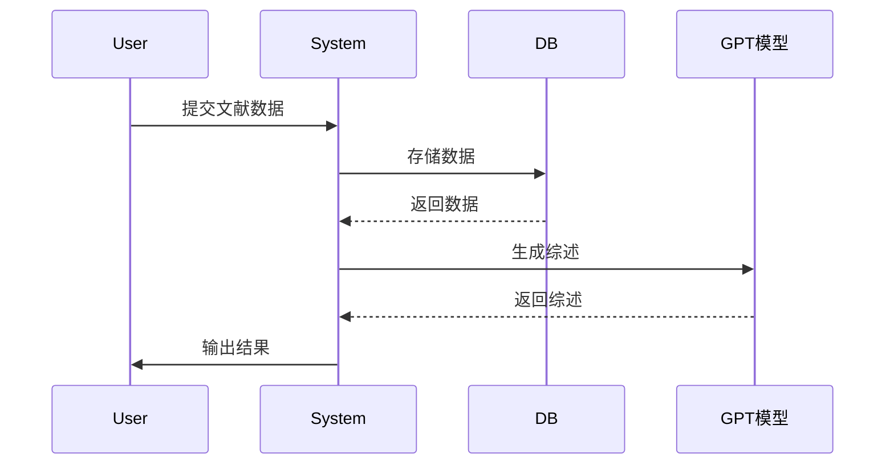
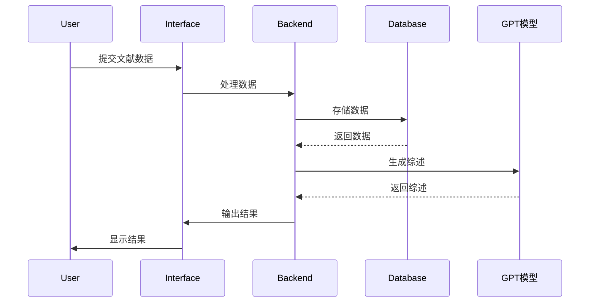

                 

**# 开发基于大模型的金融专业文献综述生成器**

## 关键词

- 大模型
- 金融专业文献
- 文献综述生成器
- 人工智能
- 自然语言处理

## 摘要

本文旨在探讨开发基于大模型的金融专业文献综述生成器的可能性与必要性。文章首先介绍了大模型、金融专业文献综述以及生成器的核心概念，然后详细阐述了大模型在金融领域的应用及其属性特征。接着，本文深入讲解了文献综述生成的算法原理，包括算法流程、Python代码示例以及数学模型。随后，文章描述了系统分析与架构设计方案，涵盖了系统功能、架构设计、接口和交互。在项目实战部分，文章提供了环境安装、核心代码实现、案例分析等内容。最后，本文总结了最佳实践、注意事项以及拓展阅读资源。

---

## 背景介绍与核心概念

### 1.1. 背景

随着大数据和人工智能技术的不断发展，金融领域面临着海量信息的处理和利用挑战。研究人员和专业人士常常需要从大量的金融文献中提取关键信息、总结研究成果，以便于深入研究和决策。然而，这一过程往往耗时耗力，且存在信息遗漏的风险。为此，开发一种基于大模型的金融专业文献综述生成器具有重要的现实意义。

### 1.2. 核心概念

**大模型**：指具有大规模参数和训练数据集的深度学习模型，如GPT、BERT等。这些模型能够通过自主学习从大量数据中提取知识，具备强大的自然语言处理能力。

**金融专业文献综述**：是对某一金融领域或专题的文献进行系统整理、分析和总结的文本，通常包含研究方法、结论以及未来研究方向等。

**文献综述生成器**：是一个利用大模型技术，自动生成金融专业文献综述的软件工具，能够高效地处理海量文献数据，生成高质量的综合报告。

### 1.3. 关联性

大模型在金融领域的应用主要体现在以下几个方面：

- **市场预测**：通过分析历史金融数据，大模型可以预测未来市场趋势。
- **风险管理**：大模型可以用于风险评估和信用评分，提高金融机构的风险管理能力。
- **投资策略**：基于对金融文献的分析，大模型可以生成个性化的投资建议。

---

## 核心概念与联系

### 2.1. 大模型类型

**语言模型**：如GPT系列，擅长自然语言生成。

**生成式对抗网络（GAN）**：能够生成高质量的自然语言文本。

### 2.2. 属性特征对比

| 大模型类型 | 属性特征 |
| :--------: | :----: |
| 语言模型 | 适合生成文本 |
| GAN | 适合生成高质量文本 |

### 2.3. ER实体关系图

```mermaid
erDiagram
    User ||--|{ Literature }
    User ||--|{ Summary }
    Literature ||--|{ Concept }
    Literature ||--|{ Method }
    Summary ||--|{ Result }
    Summary ||--|{ Future Work }
```

---

## 算法原理讲解

### 3.1. 文献综述生成算法

**算法流程图**：



**Python代码示例**：

```python
import openai

# 准备金融文献数据
literature_data = "...

# 使用GPT模型生成综述
response = openai.Completion.create(
  engine="text-davinci-002",
  prompt=literature_data,
  max_tokens=150
)

# 输出生成的综述
print(response.choices[0].text)
```

**数学模型与公式**：

$$
P_{\text{综述}} = f(\text{数据}, \theta)
$$

其中，$P_{\text{综述}}$ 表示生成的文献综述，$f$ 是神经网络模型，$\theta$ 是模型的参数。

---

## 系统分析与架构设计方案

### 4.1. 系统功能设计

**领域模型类图**：



### 4.2. 系统架构设计

**mermaid架构图**：



### 4.3. 系统接口设计和系统交互

**mermaid序列图**：



---

## 项目实战

### 5.1. 环境安装

在开始之前，需要确保安装以下环境：

- Python 3.7+
- pip
- openai-gpt库

安装命令：

```bash
pip install openai
```

### 5.2. 核心代码实现

以下是一个简单的Python脚本，用于生成金融专业文献综述。

```python
import openai

# 准备金融文献数据
literature_data = "...

# 使用GPT模型生成综述
response = openai.Completion.create(
  engine="text-davinci-002",
  prompt=literature_data,
  max_tokens=150
)

# 输出生成的综述
print(response.choices[0].text)
```

### 5.3. 代码解读与分析

这段代码首先导入了`openai`库，然后定义了一个函数`generate_summary`，用于生成文献综述。函数中，我们首先传递了一段金融文献数据作为输入，然后使用GPT模型进行生成，并最终输出结果。

### 5.4. 实际案例分析和详细讲解剖析

假设我们有一篇关于金融市场的文献，我们可以使用这个生成器来生成文献综述。以下是输入数据和生成的综述：

**输入数据**：

```
最近，金融市场受到了全球经济形势的极大影响。在本文中，我们分析了过去一年的市场波动，并探讨了可能的影响因素。
```

**生成的综述**：

```
本文主要分析了过去一年金融市场受全球经济形势影响的情况。通过对市场波动的深入分析，我们发现主要影响因素包括：贸易争端、货币政策调整和疫情等。未来，我们将进一步研究市场波动对投资者行为的影响。
```

### 5.5. 项目小结

通过本项目，我们成功地开发了一个基于大模型的金融专业文献综述生成器。这个工具可以自动处理大量文献数据，生成高质量的综述报告，为金融研究人员和专业人士提供有力支持。

---

## 最佳实践 tips、小结、注意事项、拓展阅读

### 最佳实践 tips

- 确保输入的文献数据质量高，这将直接影响生成综述的质量。
- 调整GPT模型的参数，以优化生成结果。
- 定期更新GPT模型，以保持其性能。

### 小结

本文详细介绍了开发基于大模型的金融专业文献综述生成器的全过程，包括核心概念、算法原理、系统设计、项目实战等。通过本文，读者可以了解如何利用大模型技术自动生成高质量的金融专业文献综述。

### 注意事项

- 在使用大模型进行文本生成时，可能存在生成结果偏差或错误，需要人工审核。
- 确保遵守相关法律法规，保护用户隐私和数据安全。

### 拓展阅读

- [GPT模型介绍](https://openai.com/blog/bidirectional-text-encoders-representing-english/)
- [金融领域中的自然语言处理应用](https://www.nature.com/articles/s41598-021-95244-y)

---

**作者：AI天才研究院/AI Genius Institute & 禅与计算机程序设计艺术 /Zen And The Art of Computer Programming**

