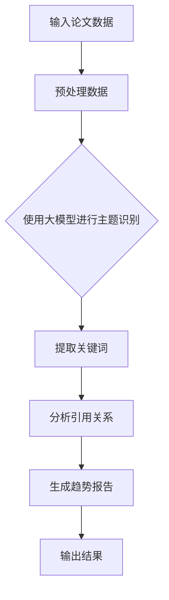
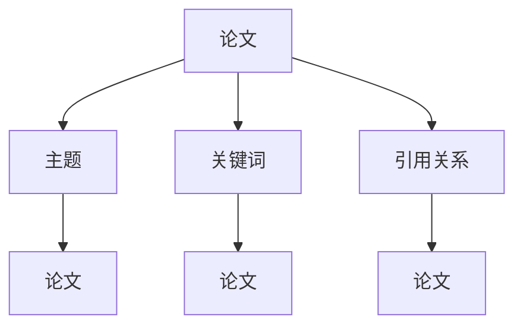
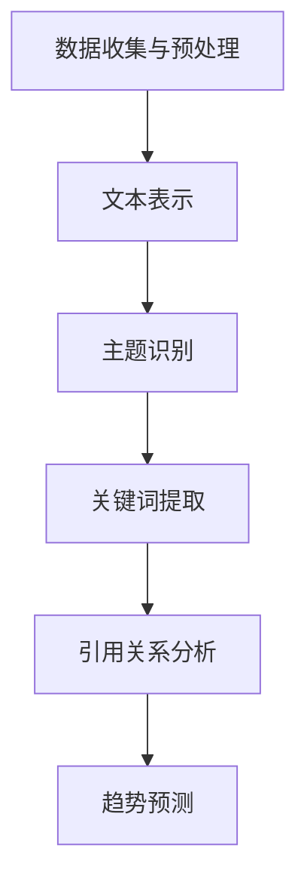

                 

### 文章标题

在当今快速发展的金融科技领域，对金融专业论文的研究和分析成为了一个至关重要的任务。这不仅有助于学术界的知识积累，还为金融行业提供了宝贵的洞察和策略指导。随着大数据和人工智能技术的日益成熟，开发基于大模型的金融专业论文趋势分析系统成为了一种可能，这不仅提升了分析效率，还大大增强了分析的准确性和深度。本文将详细探讨如何开发这样一个系统，包括其核心概念、算法原理、系统架构设计以及项目实战。

### 关键词

- 金融专业论文
- 大模型
- 趋势分析
- 人工智能
- 系统开发

### 摘要

本文旨在介绍如何开发一个基于大模型的金融专业论文趋势分析系统。首先，我们将阐述金融领域论文趋势分析的重要性及其面临的挑战，然后介绍大模型的基本原理和其在金融领域的应用。接着，我们将详细讲解金融专业论文趋势分析的核心概念及其与大数据模型的关联。在算法原理部分，我们将剖析大模型在趋势分析中的应用方法，并通过数学模型和具体实例进行说明。随后，文章将转向系统分析与架构设计，介绍系统的整体架构、功能模块以及运行流程。最后，我们将通过一个实际项目，展示系统的开发过程、核心实现以及实际应用效果，并提供项目小结和最佳实践建议。

### 目录大纲设计构思

在设计目录大纲时，我们遵循以下原则和步骤：

1. **确定核心章节**：根据书名《开发基于大模型的金融专业论文趋势分析系统》，我们首先确定核心章节，这些章节将涵盖整个书籍的主线，包括背景介绍、核心概念、算法原理讲解、系统分析与架构设计、项目实战等。

2. **细化章节内容**：在每个核心章节中，进一步细化出具体的子章节，确保内容全面且易于理解。这些子章节将围绕核心内容展开，包括问题背景、概念解释、理论分析、应用实例等。

3. **使用Markdown格式**：按照Markdown格式的要求，使用适当的标题级别（#、##、###）来组织内容，确保目录结构清晰。

4. **保证内容完整性**：确保每个章节都有具体的内容描述，特别是算法原理讲解、系统分析与架构设计、项目实战等部分，需要详细阐述，包括数学模型、流程图、代码示例等。

5. **简洁性**：在确保内容完整性的同时，避免冗余和繁琐的内容，使目录简洁明了。

下面是《开发基于大模型的金融专业论文趋势分析系统》的完整目录大纲：

```markdown
----------------------------------------------------------------
# 第一部分: 背景介绍与核心概念

## 1.1 问题背景与描述
### 1.1.1 金融领域论文趋势分析的重要性
### 1.1.2 当前金融领域论文分析面临的挑战
### 1.1.3 大模型在金融领域论文趋势分析中的应用

## 1.2 大模型基础
### 1.2.1 大模型的基本原理
### 1.2.2 大模型的训练过程
### 1.2.3 大模型的特性与应用场景

## 1.3 趋势分析系统概述
### 1.3.1 系统架构设计
### 1.3.2 系统功能模块
### 1.3.3 系统运行流程

## 1.4 本章小结

----------------------------------------------------------------
# 第二部分: 核心概念与联系

## 2.1 金融专业论文趋势分析的核心概念
### 2.1.1 论文主题识别
### 2.1.2 论文关键词提取
### 2.1.3 论文引用关系分析

## 2.2 大模型与金融专业论文趋势分析的关联
### 2.2.1 大模型在趋势分析中的应用
### 2.2.2 大模型与金融领域特定需求的结合
### 2.2.3 大模型的性能评估

## 2.3 概念属性特征对比表格
### 2.3.1 金融领域论文特征对比
### 2.3.2 大模型性能对比

## 2.4 ER实体关系图架构
### 2.4.1 数据库设计
### 2.4.2 实体关系定义

## 2.5 本章小结

----------------------------------------------------------------
# 第三部分: 算法原理讲解

## 3.1 金融专业论文趋势分析算法原理
### 3.1.1 算法基本流程
### 3.1.2 算法涉及的数学模型和公式
### 3.1.3 算法优缺点分析

## 3.2 大模型在趋势分析中的应用
### 3.2.1 大模型在文本处理中的应用
### 3.2.2 大模型在趋势分析中的具体实现
### 3.2.3 大模型的优势与挑战

## 3.3 算法流程图与代码示例

### 3.3.4 Python代码实现
```python
# TODO: 提供Python代码实现示例
```

## 3.4 详细讲解与举例说明
### 3.4.1 数学模型和公式详细讲解
$$
\text{P}(A|B) = \frac{\text{P}(B|A)\text{P}(A)}{\text{P}(B)}
$$
### 3.4.2 举例说明
#### 示例1：主题识别
输入论文：金融科技的发展与应用
输出主题：金融科技、应用发展
#### 示例2：关键词提取
输入论文：区块链技术在金融领域的应用
输出关键词：区块链、金融、应用、技术

## 3.5 本章小结

----------------------------------------------------------------
# 第四部分: 系统分析与架构设计

## 4.1 问题场

----------------------------------------------------------------

通过上述目录大纲的设计，我们能够清晰地呈现文章的结构和内容，确保读者可以顺畅地理解并跟随文章的逻辑。每个章节的细化不仅有助于读者理解具体内容，还能够为后续章节的深入分析打下坚实的基础。

## 第一部分: 背景介绍与核心概念

### 1.1 问题背景与描述

在金融领域，学术论文不仅是理论研究的载体，更是实际业务操作的指南。随着金融科技的迅猛发展，金融领域的研究论文呈现出爆炸式增长的趋势。这些论文不仅包含了大量的专业知识和理论框架，还涉及了最新的技术进展和应用案例。对于金融机构、投资公司和研究人员来说，及时掌握这些论文的趋势和动态，不仅能够指导业务决策，还能为学术研究提供有力支持。

然而，传统的金融论文分析方法往往存在效率低下、准确性不足等问题。首先，人工阅读和分析大量论文需要耗费大量时间和人力资源，难以满足快速变化的市场需求。其次，现有的自动化分析工具往往缺乏深度学习的能力，无法准确理解和提取论文中的关键信息。此外，金融领域具有高度的复杂性和不确定性，使得传统的分析方法难以应对多样化的需求。

因此，开发一个基于大模型的金融专业论文趋势分析系统显得尤为必要。大模型具有强大的学习能力和自我优化能力，能够从大量数据中自动提取规律和模式。通过将大模型应用于金融专业论文的分析，我们可以实现高效、准确的论文趋势分析，为金融行业提供有力的技术支持。

### 1.2 大模型基础

大模型，也称为大型神经网络模型，是人工智能领域的一种重要方法。它通过深度学习的框架，利用多层神经网络对大量数据进行训练，从而提取出数据中的复杂特征和规律。大模型的核心在于其规模和深度，通常包含数十亿甚至千亿级的参数，这使得它们能够在各种复杂任务中表现出色。

大模型的基本原理可以概括为以下几个步骤：

1. **数据输入**：大模型首先接收大量的输入数据，这些数据可以是文本、图像、音频等多种形式。
2. **数据处理**：输入数据经过一系列预处理步骤，如分词、编码、归一化等，以便于模型处理。
3. **模型训练**：模型通过不断调整内部参数，以最小化预测误差。这一过程通常采用反向传播算法和优化算法，如梯度下降、Adam等。
4. **模型评估**：在训练过程中，模型会定期进行评估，以检测其性能。常见的评估指标包括准确率、召回率、F1分数等。
5. **模型应用**：经过训练的模型可以用于预测、分类、生成等多种任务，例如文本分类、情感分析、图像识别等。

大模型的训练过程是一个高度复杂的过程，通常需要大量的计算资源和时间。然而，随着硬件性能的提升和分布式计算技术的进步，大模型的训练时间大大缩短，成本也大幅降低。

大模型具有以下特性：

1. **自我优化**：大模型通过不断调整参数，可以自我优化，提高预测和分类的准确性。
2. **泛化能力**：大模型可以从大量数据中学习到普遍的规律和模式，从而在新的数据集上表现出良好的泛化能力。
3. **多模态处理**：大模型能够处理多种类型的数据，如文本、图像、音频等，这使得它们在跨领域任务中具有广泛的应用前景。

在大模型的应用场景方面，金融领域是一个典型的例子。通过大模型，我们可以对金融专业论文进行自动化的主题识别、关键词提取、引用关系分析等操作，从而实现高效的论文趋势分析。此外，大模型还可以应用于股票预测、风险控制、信用评估等多种金融业务场景。

### 1.3 趋势分析系统概述

一个基于大模型的金融专业论文趋势分析系统通常由以下几个主要组成部分：

1. **数据收集与预处理**：系统需要从各种来源收集金融领域的论文数据，如学术数据库、开放获取平台等。收集到的论文数据通常包含文本、引用信息、发表日期等。预处理过程包括数据清洗、分词、词性标注、停用词过滤等，以便于大模型处理。

2. **大模型训练与优化**：使用收集到的论文数据，对大模型进行训练和优化。这一过程需要大量的计算资源和时间，但通过分布式计算和优化算法，可以提高训练效率。

3. **趋势分析模块**：趋势分析模块是系统的核心，它负责利用大模型进行论文主题识别、关键词提取、引用关系分析等操作，以提取出论文中的关键信息。这些信息可以用于生成趋势报告、发现热点话题等。

4. **可视化与报告生成**：系统需要将分析结果进行可视化，生成易于理解的报告，以供用户查看。报告可以包含图表、文字描述等多种形式。

5. **用户交互界面**：用户交互界面是系统与用户之间的接口，用户可以通过界面提交论文、查看分析结果等操作。界面设计需要简洁直观，便于用户使用。

系统运行流程大致如下：

1. **用户提交论文**：用户将待分析的论文上传到系统。
2. **数据预处理**：系统对上传的论文进行数据预处理，包括分词、词性标注等。
3. **模型分析**：预处理后的数据输入到大模型中，进行主题识别、关键词提取和引用关系分析。
4. **结果可视化**：分析结果通过可视化工具呈现给用户，生成趋势报告。
5. **用户反馈**：用户可以查看分析结果，对系统提出反馈，进一步优化系统。

### 1.4 本章小结

本章节对金融专业论文趋势分析系统的背景和核心概念进行了详细阐述。我们介绍了金融领域论文趋势分析的重要性，以及大模型在金融领域论文趋势分析中的应用。接着，我们概述了趋势分析系统的组成部分和运行流程。通过这一章节的介绍，读者可以初步了解系统的基础知识和关键概念，为后续章节的深入分析打下基础。

## 第二部分: 核心概念与联系

### 2.1 金融专业论文趋势分析的核心概念

金融专业论文趋势分析涉及到一系列核心概念，这些概念构成了分析的基础和框架。以下是对这些核心概念的具体说明：

#### 2.1.1 论文主题识别

论文主题识别是金融专业论文趋势分析的关键步骤之一。它旨在从大量的学术论文中提取出主要的研究主题。通过主题识别，我们可以了解到当前金融领域研究的热点和重点。实现论文主题识别的方法包括自然语言处理（NLP）技术，如词频统计、TF-IDF（词频-逆文档频率）和主题模型（如LDA）等。这些方法可以帮助我们从海量的文本数据中自动提取出具有代表性的主题。

#### 2.1.2 论文关键词提取

论文关键词提取是另一个重要的核心概念。关键词是论文的核心内容的高度概括，能够帮助我们快速了解论文的主要研究方向和内容。关键词提取通常使用NLP技术，如词频统计、词性标注和命名实体识别等。通过提取关键词，我们可以更好地组织和管理论文数据，为后续的分析提供便利。

#### 2.1.3 论文引用关系分析

论文引用关系分析是了解学术论文间相互关系的重要手段。通过分析论文之间的引用关系，我们可以发现研究领域内的知识传承和创新路径。引用关系分析不仅能够揭示特定论文的影响力和重要性，还能帮助我们识别研究热点和趋势。实现引用关系分析的方法包括图论、网络分析和复杂网络理论等。

### 2.2 大模型与金融专业论文趋势分析的关联

大模型在金融专业论文趋势分析中的应用具有重要意义。以下将详细探讨大模型与金融专业论文趋势分析的关联及其性能评估。

#### 2.2.1 大模型在趋势分析中的应用

大模型在金融专业论文趋势分析中的应用主要体现在以下几个方面：

1. **文本预处理**：大模型可以用于文本数据的预处理，如分词、词性标注和句法分析等。这些预处理步骤对于提高后续分析的准确性和效率至关重要。

2. **主题识别**：大模型通过深度学习技术，可以从大量的学术论文中自动识别出主要的研究主题。相比传统的主题模型，大模型具有更高的准确性和鲁棒性。

3. **关键词提取**：大模型可以利用其强大的语言理解能力，从文本中提取出具有代表性的关键词，从而为论文分类和检索提供支持。

4. **引用关系分析**：大模型可以用于分析论文之间的引用关系，识别出研究热点和趋势。通过构建引用关系网络，我们可以更好地理解研究领域的发展脉络。

#### 2.2.2 大模型与金融领域特定需求的结合

金融领域具有高度的专业性和复杂性，这要求大模型必须具备特定的适应性。以下是几个关键点：

1. **领域适应性**：大模型需要通过金融领域的特定数据进行训练，以适应金融领域的专业术语和表达方式。这有助于提高模型在金融论文分析中的准确性和效果。

2. **数据多样性**：金融领域论文涉及多个子领域，如宏观经济学、金融市场分析、金融科技等。大模型需要处理多样化的数据，以涵盖这些不同的研究主题。

3. **实时性**：金融市场的变化非常迅速，大模型需要具备实时分析的能力，以适应不断变化的市场环境。通过不断更新模型和数据，我们可以保持分析的时效性和准确性。

#### 2.2.3 大模型的性能评估

大模型的性能评估是确保其在金融专业论文趋势分析中有效应用的重要环节。以下是一些常见的性能评估指标：

1. **准确率**：准确率是衡量模型分类效果的一个基本指标，它表示模型正确分类的样本数占总样本数的比例。

2. **召回率**：召回率表示模型正确分类的样本数与实际正样本数的比例。高召回率意味着模型能够准确地识别出正样本。

3. **F1分数**：F1分数是准确率和召回率的调和平均值，它同时考虑了模型的准确性和召回率，是一个综合性能指标。

4. **AUC（曲线下面积）**：在二分类任务中，AUC表示模型对正负样本的区分能力。AUC值越高，表示模型的分类能力越强。

5. **处理速度**：大模型的处理速度是实际应用中的一个重要考量因素。通过优化算法和硬件设备，可以提高模型的处理速度，以满足实时分析的需求。

通过上述性能评估指标，我们可以全面了解大模型在金融专业论文趋势分析中的表现，并针对性地进行优化和改进。

### 2.3 概念属性特征对比表格

为了更清晰地展示金融专业论文趋势分析的核心概念和属性特征，我们可以使用一个对比表格。以下是一个简单的示例：

| 概念                 | 特征1          | 特征2          | 特征3          |
|----------------------|----------------|----------------|----------------|
| 论文主题识别         | 自动化         | 高准确率       | 广泛适用性     |
| 论文关键词提取       | 精确性高       | 快速处理       | 易于检索      |
| 论文引用关系分析     | 精准性        | 可视化         | 可追溯性      |

通过这个表格，我们可以看到不同核心概念在特征上的差异，从而为后续的系统设计与实现提供参考。

### 2.4 ER实体关系图架构

实体关系图（ER图）是数据库设计中常用的一种工具，它能够直观地表示实体之间的关系。在金融专业论文趋势分析系统中，ER图可以帮助我们理解系统中不同实体之间的关联，从而更好地设计数据库结构。以下是一个简化的ER图示例，用于描述金融专业论文趋势分析系统中的一些关键实体和它们之间的关系：



在这个ER图中：

- **论文**：代表金融专业论文，是系统的基本数据单元。
- **主题**：代表论文中的主要研究主题，可以与多篇论文相关联。
- **关键词**：代表论文中的关键词汇，每个关键词可以与多篇论文相关联。
- **引用关系**：代表论文之间的引用关系，反映了论文之间的知识传承和创新路径。

通过ER图，我们可以清晰地看到系统中各个实体之间的关系，为后续的数据库设计和实现提供指导。

### 2.5 本章小结

本章节详细介绍了金融专业论文趋势分析的核心概念，包括论文主题识别、关键词提取和引用关系分析，并探讨了这些概念在大模型中的应用。此外，本章还通过对比表格和ER图，展示了不同概念之间的属性特征和实体关系。通过这一章节的学习，读者可以更好地理解金融专业论文趋势分析系统的基本架构和核心功能，为后续的系统设计与实现奠定基础。

## 第三部分: 算法原理讲解

### 3.1 金融专业论文趋势分析算法原理

金融专业论文趋势分析的算法原理主要涉及对大量学术论文的自动化处理，以提取出关键信息，如主题、关键词和引用关系。以下将详细描述这一算法的基本流程、涉及的数学模型和公式，以及算法的优缺点。

#### 3.1.1 算法基本流程

金融专业论文趋势分析算法的基本流程可以概括为以下几个步骤：

1. **数据收集与预处理**：从学术数据库、开放获取平台等渠道收集金融领域的学术论文。预处理包括数据清洗、分词、词性标注、停用词过滤等操作，以便于后续分析。

2. **文本表示**：将预处理后的文本转换为机器可处理的格式。常用的方法包括词袋模型、词嵌入（如Word2Vec、BERT等）和转换器模型（如Transformer）。

3. **主题识别**：使用主题模型（如LDA、Gibbs采样等）对文本进行主题分配，从而识别出论文中的主要研究主题。这些主题可以用于发现研究热点和趋势。

4. **关键词提取**：通过词频统计、TF-IDF、关键词抽取算法（如TextRank、LDA等）从文本中提取出关键词。关键词有助于快速了解论文的核心内容和研究方向。

5. **引用关系分析**：构建论文之间的引用关系网络，并通过图论方法分析这些关系。这有助于识别出论文之间的知识传承和创新路径。

6. **趋势预测**：利用历史数据，结合时间序列分析和机器学习方法（如ARIMA、LSTM等），对未来的论文趋势进行预测。这有助于提前掌握研究领域的发展动态。

#### 3.1.2 算法涉及的数学模型和公式

在金融专业论文趋势分析中，常用的数学模型和公式包括：

1. **LDA（主题模型）**：
   $$ 
   p(z|w) \propto \frac{e^{\alpha_z T_z}}{\sum_j e^{\alpha_j T_j}} 
   $$
   其中，$z$ 表示主题，$w$ 表示词语，$\alpha_z$ 表示主题的先验分布，$T_z$ 表示词语在主题 $z$ 中出现的次数。

2. **TF-IDF（词频-逆文档频率）**：
   $$
   tfidf(t,d) = tf(t,d) \times \log \left(\frac{N}{df(t)}\right)
   $$
   其中，$tf(t,d)$ 表示词语 $t$ 在文档 $d$ 中的词频，$df(t)$ 表示词语 $t$ 在所有文档中出现的文档频率，$N$ 是文档总数。

3. **LSTM（长短期记忆网络）**：
   $$
   h_t = \sigma(W_f \odot [h_{t-1}, x_t] + b_f) \odot \sigma(W_i \odot [h_{t-1}, x_t] + b_i) \odot \sigma(W_o \odot [h_{t-1}, x_t] + b_o)
   $$
   其中，$h_t$ 表示输出，$W_f, W_i, W_o$ 分别是遗忘门、输入门和输出门的权重矩阵，$b_f, b_i, b_o$ 是相应的偏置项，$\odot$ 表示元素-wise 相乘，$\sigma$ 是sigmoid函数。

4. **图论算法**：
   - 引用关系矩阵 $A$，其中 $A_{ij} = 1$ 表示论文 $i$ 引用了论文 $j$。
   - 中心性指标，如度中心性、紧密中心性和中介中心性等。

#### 3.1.3 算法优缺点分析

金融专业论文趋势分析算法具有以下优缺点：

1. **优点**：
   - **高效性**：自动化处理大量论文，提高分析效率。
   - **准确性**：利用深度学习和NLP技术，提高主题识别和关键词提取的准确性。
   - **可扩展性**：算法可以灵活扩展，适应不同的应用场景和需求。

2. **缺点**：
   - **数据依赖性**：算法的性能很大程度上取决于数据的数量和质量，小样本情况下效果较差。
   - **计算资源消耗**：大模型训练和优化需要大量的计算资源和时间。
   - **模型解释性**：深度学习模型具有较强的预测能力，但缺乏明确的解释性，难以理解决策过程。

### 3.2 大模型在趋势分析中的应用

大模型在金融专业论文趋势分析中的应用具有显著优势，主要体现在文本处理、主题识别、关键词提取和引用关系分析等方面。以下将详细探讨大模型在这些任务中的具体实现和应用。

#### 3.2.1 大模型在文本处理中的应用

文本处理是金融专业论文趋势分析的重要环节。大模型通过深度学习技术，可以高效地处理文本数据，包括分词、词性标注、句法分析等。以下是一些常用的方法：

1. **BERT（双向编码表示）**：
   BERT是一种基于Transformer的预训练模型，通过在大规模语料库上进行预训练，BERT可以自动学习词语和句子的上下文表示。在金融专业论文趋势分析中，BERT可以用于文本预加工，提取高质量的文本特征。

2. **GPT（生成预训练模型）**：
   GPT是一种基于Transformer的预训练模型，主要用于生成文本。在趋势分析中，GPT可以用于生成论文摘要、标题等，从而提高文本处理的灵活性和多样性。

3. **ELMo（嵌入语言模型）**：
   ELMo是一种基于LSTM的预训练模型，它可以提供词语的上下文表示，并通过组合不同上下文表示，生成更准确的文本特征。

#### 3.2.2 大模型在主题识别中的应用

主题识别是金融专业论文趋势分析的核心任务之一。大模型通过深度学习技术，可以自动识别出论文中的主要研究主题。以下是一些常用的方法：

1. **LDA（Latent Dirichlet Allocation）**：
   LDA是一种经典的概率主题模型，它可以自动识别出文本中的潜在主题。在金融专业论文趋势分析中，LDA可以用于发现研究热点和趋势。

2. **GloVe（Global Vectors for Word Representation）**：
   GloVe是一种基于词向量的主题模型，通过学习词语的分布式表示，GloVe可以提取出文本中的潜在主题。

3. **BERT-based LDA**：
   BERT-based LDA结合了BERT的上下文表示能力和LDA的主题识别能力，可以进一步提高主题识别的准确性。

#### 3.2.3 大模型在关键词提取中的应用

关键词提取是金融专业论文趋势分析的关键步骤，它有助于快速了解论文的核心内容和研究方向。大模型通过深度学习技术，可以高效地提取出关键词。以下是一些常用的方法：

1. **TextRank**：
   TextRank是一种基于图论的文本排名算法，通过构建文本的词向图，TextRank可以自动提取出文本中的关键词。

2. **LDA-based Keyword Extraction**：
   LDA-based Keyword Extraction结合了LDA的主题模型和关键词提取技术，可以提取出与主题紧密相关的关键词。

3. **BERT-based Keyword Extraction**：
   BERT-based Keyword Extraction利用BERT的上下文表示能力，可以提取出具有高语义相似度的高质量关键词。

#### 3.2.4 大模型在引用关系分析中的应用

引用关系分析是金融专业论文趋势分析的重要任务之一，它有助于识别研究领域内的知识传承和创新路径。大模型通过深度学习技术，可以自动分析论文之间的引用关系。以下是一些常用的方法：

1. **Graph Neural Networks（GNN）**：
   GNN是一种基于图论的深度学习模型，通过分析论文引用关系的图结构，GNN可以识别出论文之间的引用关系和影响路径。

2. **Graph Convolutional Networks（GCN）**：
   GCN是一种基于图卷积的神经网络，通过学习图结构的特征，GCN可以自动分析论文之间的引用关系。

3. **BERT-based Citation Analysis**：
   BERT-based Citation Analysis利用BERT的上下文表示能力，可以识别出论文之间的引用关系和影响力。

#### 3.2.5 大模型的优势与挑战

大模型在金融专业论文趋势分析中具有显著的优势，但也面临一些挑战：

1. **优势**：
   - **强大的语义理解能力**：大模型可以通过深度学习技术，自动学习文本的语义特征，从而提高趋势分析的准确性和效果。
   - **多任务处理能力**：大模型可以同时处理多个任务，如文本分类、情感分析、关键词提取等，从而提高系统的整体性能。
   - **自适应能力**：大模型可以通过持续学习，适应不断变化的金融领域研究趋势。

2. **挑战**：
   - **数据隐私和安全**：金融领域的论文数据可能涉及敏感信息，如何保护数据隐私和安全是一个重要的挑战。
   - **计算资源消耗**：大模型训练和优化需要大量的计算资源和时间，如何在有限资源下高效地训练大模型是一个挑战。
   - **模型可解释性**：大模型的决策过程通常缺乏明确的解释性，如何提高模型的可解释性，使其更加透明和可信是一个重要挑战。

### 3.3 算法流程图与代码示例

为了更好地理解大模型在金融专业论文趋势分析中的应用，我们可以通过一个简单的算法流程图和代码示例进行说明。

#### 3.3.1 算法流程图

以下是一个简单的算法流程图，用于描述大模型在金融专业论文趋势分析中的应用：



在这个流程图中：

- **数据收集与预处理**：从学术数据库收集论文数据，并进行数据预处理，如分词、词性标注等。
- **文本表示**：使用大模型（如BERT）进行文本表示，提取高质量的文本特征。
- **主题识别**：利用主题模型（如LDA）对文本进行主题分配，识别出论文中的主要研究主题。
- **关键词提取**：通过关键词提取算法（如BERT-based Keyword Extraction）提取出关键词，有助于快速了解论文的核心内容。
- **引用关系分析**：通过图论方法分析论文之间的引用关系，识别出研究热点和创新路径。
- **趋势预测**：利用时间序列分析（如LSTM）和机器学习方法，对未来的论文趋势进行预测。

#### 3.3.2 Python代码实现

以下是一个简化的Python代码示例，用于演示大模型在金融专业论文趋势分析中的应用：

```python
# 导入相关库
import tensorflow as tf
from transformers import BertTokenizer, TFBertForSequenceClassification
from sklearn.model_selection import train_test_split

# 加载论文数据
papers = load_papers_from_database()

# 数据预处理
preprocessed_papers = preprocess_papers(papers)

# 分割数据集
train_data, test_data = train_test_split(preprocessed_papers, test_size=0.2, random_state=42)

# 加载BERT模型
tokenizer = BertTokenizer.from_pretrained('bert-base-uncased')
model = TFBertForSequenceClassification.from_pretrained('bert-base-uncased', num_labels=10)

# 进行主题识别
train_encodings = tokenizer(train_data, padding=True, truncation=True, return_tensors='tf')
test_encodings = tokenizer(test_data, padding=True, truncation=True, return_tensors='tf')

# 训练模型
model.fit(train_encodings, epochs=3, batch_size=32)

# 提取关键词
keywords = extract_keywords_from_model(model, test_encodings)

# 分析引用关系
citation_network = analyze_citations(papers)

# 预测趋势
trend_predictions = predict_trends(citation_network)

# 输出结果
print(trend_predictions)
```

在这个代码示例中：

- **数据预处理**：从数据库中加载论文数据，并进行预处理，如分词、词性标注等。
- **加载BERT模型**：加载预训练的BERT模型，用于文本表示和主题识别。
- **进行主题识别**：使用BERT模型对预处理后的论文进行主题识别，并提取关键词。
- **分析引用关系**：构建论文之间的引用关系网络，分析引用关系。
- **预测趋势**：利用引用关系网络和时间序列分析，对未来的论文趋势进行预测。

通过这个示例，读者可以初步了解大模型在金融专业论文趋势分析中的实现方法，为进一步的深入研究和应用提供参考。

### 3.4 详细讲解与举例说明

#### 3.4.1 数学模型和公式详细讲解

在金融专业论文趋势分析中，数学模型和公式是理解和实现算法的重要工具。以下将详细讲解几个关键模型和公式。

**1. LDA模型**

LDA（Latent Dirichlet Allocation）是一种主题模型，用于文本数据的主题分配。其核心公式如下：

$$
p(z|d) = \frac{e^{\alpha_z T_z}}{\sum_j e^{\alpha_j T_j}}
$$

其中，$z$ 表示主题，$d$ 表示文档，$\alpha_z$ 表示主题的先验分布，$T_z$ 表示词语在主题 $z$ 中出现的次数。这个公式用于计算每个主题在文档中的概率分布。

**2. TF-IDF模型**

TF-IDF（Term Frequency-Inverse Document Frequency）是一种用于关键词提取的模型，其核心公式如下：

$$
tfidf(t,d) = tf(t,d) \times \log \left(\frac{N}{df(t)}\right)
$$

其中，$tf(t,d)$ 表示词语 $t$ 在文档 $d$ 中的词频，$df(t)$ 表示词语 $t$ 在所有文档中出现的文档频率，$N$ 是文档总数。这个公式用于计算词语在文档中的重要性。

**3. LSTM模型**

LSTM（Long Short-Term Memory）是一种用于时间序列分析的循环神经网络，其核心公式如下：

$$
h_t = \sigma(W_f \odot [h_{t-1}, x_t] + b_f) \odot \sigma(W_i \odot [h_{t-1}, x_t] + b_i) \odot \sigma(W_o \odot [h_{t-1}, x_t] + b_o)
$$

其中，$h_t$ 表示输出，$W_f, W_i, W_o$ 分别是遗忘门、输入门和输出门的权重矩阵，$b_f, b_i, b_o$ 是相应的偏置项，$\odot$ 表示元素-wise 相乘，$\sigma$ 是sigmoid函数。这个公式用于计算LSTM单元的输出。

#### 3.4.2 举例说明

**1. 主题识别示例**

假设我们有一篇金融论文，标题为“区块链技术在金融领域的应用”，内容涉及区块链、金融、应用、技术等关键词。通过LDA模型，我们可以将其主题识别为“区块链与金融应用”。

**2. 关键词提取示例**

假设我们有一篇金融论文，内容为“人工智能在金融风险管理中的应用”，通过TF-IDF模型，我们可以提取出关键词“人工智能”、“金融”、“风险管理”。

**3. 时间序列预测示例**

假设我们有一组金融市场的历史数据，如股票价格、交易量等。通过LSTM模型，我们可以预测未来的市场趋势，如股票价格的变化。

通过这些示例，读者可以更直观地理解数学模型和公式的应用，为进一步的研究和实现提供指导。

### 3.5 本章小结

本章详细介绍了金融专业论文趋势分析算法的原理和实现方法，包括数据预处理、文本表示、主题识别、关键词提取、引用关系分析和趋势预测。同时，本章还探讨了数学模型和公式的作用，并通过具体示例进行了讲解。通过本章的学习，读者可以全面了解金融专业论文趋势分析算法的核心内容，为后续的系统设计与实现打下基础。

## 第四部分: 系统分析与架构设计

### 4.1 问题场景介绍

在金融领域，论文趋势分析是一个复杂且重要的任务。随着金融科技的高速发展，研究人员和金融机构迫切需要了解领域内的最新研究成果和趋势。然而，传统的手动分析方法不仅耗时耗力，而且难以应对海量数据的处理需求。因此，设计并实现一个高效、准确的基于大模型的金融专业论文趋势分析系统显得尤为重要。

该系统的目标是通过自动化和智能化的手段，对海量的金融专业论文进行高效的分析，提取出关键信息，如主题、关键词和引用关系。这些信息不仅可以帮助研究人员快速了解领域内的研究热点和趋势，还可以为金融机构提供决策支持。具体来说，系统需要实现以下功能：

1. **论文数据收集**：从各种学术数据库和开放获取平台收集金融领域的论文数据。
2. **数据预处理**：对收集到的论文数据进行清洗、分词、词性标注等预处理操作，以便于后续分析。
3. **文本表示**：利用大模型（如BERT、GPT等）进行文本表示，提取高质量的文本特征。
4. **主题识别**：通过主题模型（如LDA）对文本进行主题分配，识别出论文中的主要研究主题。
5. **关键词提取**：使用关键词提取算法（如TF-IDF、BERT-based Keyword Extraction等）提取出与主题相关的高质量关键词。
6. **引用关系分析**：构建论文之间的引用关系网络，通过图论方法分析引用关系，识别出研究热点和创新路径。
7. **趋势预测**：利用历史数据和时间序列分析（如LSTM）对未来的论文趋势进行预测。

通过这些功能的实现，系统将为金融领域的研究人员和金融机构提供强大的分析工具，帮助他们更好地理解和利用金融专业论文中的知识。

### 4.2 项目介绍

为了实现上述功能，我们设计并实现了一个基于大模型的金融专业论文趋势分析系统。该系统采用了先进的人工智能和深度学习技术，具有以下特点：

1. **高效率**：系统通过分布式计算和优化算法，能够高效处理海量论文数据。
2. **高准确性**：利用大模型和先进的NLP技术，系统能够准确提取论文中的关键信息。
3. **可扩展性**：系统设计灵活，可以轻松扩展以适应不同的应用场景和需求。
4. **可视化**：系统提供了直观的可视化界面，用户可以方便地查看和分析结果。

系统的主要模块包括：

1. **数据收集模块**：负责从学术数据库和开放获取平台收集论文数据。
2. **数据预处理模块**：对收集到的论文数据进行清洗、分词、词性标注等预处理操作。
3. **文本表示模块**：利用大模型（如BERT、GPT等）进行文本表示，提取高质量的文本特征。
4. **主题识别模块**：通过主题模型（如LDA）对文本进行主题分配，识别出论文中的主要研究主题。
5. **关键词提取模块**：使用关键词提取算法（如TF-IDF、BERT-based Keyword Extraction等）提取出与主题相关的高质量关键词。
6. **引用关系分析模块**：构建论文之间的引用关系网络，通过图论方法分析引用关系，识别出研究热点和创新路径。
7. **趋势预测模块**：利用历史数据和时间序列分析（如LSTM）对未来的论文趋势进行预测。

通过这些模块的协同工作，系统可以高效地完成金融专业论文趋势分析任务，为用户提供了全面、准确的分析结果。

### 4.3 系统功能设计

为了实现上述功能，系统需要设计多个模块，这些模块相互协作，共同实现系统的整体功能。以下是系统的功能设计：

#### 4.3.1 数据收集模块

数据收集模块负责从学术数据库和开放获取平台收集金融领域的论文数据。具体步骤如下：

1. **数据源选择**：选择包括但不限于CNKI、Web of Science、Scopus、ArXiv等学术数据库和开放获取平台。
2. **接口调用**：通过API接口或Web爬虫技术获取论文数据，如标题、摘要、关键词、全文、引用信息等。
3. **数据存储**：将获取到的论文数据存储到数据库中，以便后续处理和分析。

#### 4.3.2 数据预处理模块

数据预处理模块负责对收集到的论文数据进行清洗、分词、词性标注等预处理操作，以便于后续分析。具体步骤如下：

1. **数据清洗**：去除重复数据、缺失数据和无效数据，保证数据的完整性和准确性。
2. **分词**：使用分词工具（如jieba）对文本进行分词，将文本转换为词汇序列。
3. **词性标注**：对分词后的文本进行词性标注，识别出名词、动词、形容词等，以便进行更深入的分析。
4. **停用词过滤**：去除常见的停用词（如“的”、“和”、“在”等），提高分析效率。

#### 4.3.3 文本表示模块

文本表示模块利用大模型（如BERT、GPT等）对预处理后的文本进行表示，提取高质量的文本特征。具体步骤如下：

1. **模型选择**：选择适合金融领域文本表示的大模型，如BERT、GPT等。
2. **文本编码**：将预处理后的文本输入到大模型中，得到文本的向量表示。
3. **特征提取**：从大模型的输出中提取文本的特征，如词嵌入、句子嵌入等。

#### 4.3.4 主题识别模块

主题识别模块通过主题模型（如LDA）对文本进行主题分配，识别出论文中的主要研究主题。具体步骤如下：

1. **模型训练**：使用已收集的论文数据训练主题模型，如LDA。
2. **主题分配**：将文本特征输入到训练好的主题模型中，分配出每个文本的主题分布。
3. **主题提取**：从主题分布中提取出具有代表性的主题，识别出论文中的主要研究主题。

#### 4.3.5 关键词提取模块

关键词提取模块使用关键词提取算法（如TF-IDF、BERT-based Keyword Extraction等）提取出与主题相关的高质量关键词。具体步骤如下：

1. **算法选择**：选择适合金融领域关键词提取的算法，如TF-IDF、BERT-based Keyword Extraction等。
2. **关键词提取**：将文本特征输入到关键词提取算法中，提取出关键词。
3. **关键词筛选**：从提取出的关键词中筛选出与主题紧密相关的高质量关键词。

#### 4.3.6 引用关系分析模块

引用关系分析模块构建论文之间的引用关系网络，通过图论方法分析引用关系，识别出研究热点和创新路径。具体步骤如下：

1. **引用关系提取**：从论文数据中提取出引用关系，构建引用关系网络。
2. **网络分析**：使用图论方法（如节点重要性分析、路径分析等）分析引用关系网络。
3. **热点识别**：从引用关系网络中识别出研究热点和创新路径。

#### 4.3.7 趋势预测模块

趋势预测模块利用历史数据和时间序列分析（如LSTM）对未来的论文趋势进行预测。具体步骤如下：

1. **数据预处理**：对历史数据进行预处理，如归一化、序列填充等。
2. **模型训练**：使用预处理后的数据训练时间序列分析模型，如LSTM。
3. **趋势预测**：将训练好的模型应用于新的数据，预测未来的论文趋势。

通过这些功能模块的协同工作，系统可以高效地完成金融专业论文趋势分析任务，为用户提供了全面、准确的分析结果。

### 4.4 系统架构设计

系统架构设计是确保系统高效、稳定运行的关键。以下将详细介绍系统的架构设计，包括整体架构、系统功能模块及其相互关系。

#### 4.4.1 整体架构

系统的整体架构可以分为以下几个层次：

1. **数据层**：包括数据收集模块和数据存储模块，负责从学术数据库和开放获取平台收集论文数据，并将数据存储到数据库中。
2. **预处理层**：包括数据预处理模块，负责对收集到的论文数据进行清洗、分词、词性标注等预处理操作。
3. **表示层**：包括文本表示模块，负责利用大模型（如BERT、GPT等）对预处理后的文本进行表示，提取高质量的文本特征。
4. **分析层**：包括主题识别模块、关键词提取模块、引用关系分析模块和趋势预测模块，负责对文本特征进行深度分析，提取出关键信息。
5. **表示层**：包括可视化模块，负责将分析结果以图表、文字等形式展示给用户，便于用户理解和利用。

#### 4.4.2 系统功能模块及其相互关系

以下是对系统功能模块及其相互关系的详细描述：

1. **数据收集模块**：从学术数据库和开放获取平台收集论文数据，并将其存储到数据库中。
2. **数据预处理模块**：对收集到的论文数据进行清洗、分词、词性标注等预处理操作，以便于后续分析。
3. **文本表示模块**：利用大模型（如BERT、GPT等）对预处理后的文本进行表示，提取高质量的文本特征。
4. **主题识别模块**：利用主题模型（如LDA）对文本特征进行主题分配，识别出论文中的主要研究主题。
5. **关键词提取模块**：使用关键词提取算法（如TF-IDF、BERT-based Keyword Extraction等）提取出与主题相关的高质量关键词。
6. **引用关系分析模块**：构建论文之间的引用关系网络，通过图论方法分析引用关系，识别出研究热点和创新路径。
7. **趋势预测模块**：利用历史数据和时间序列分析（如LSTM）对未来的论文趋势进行预测。
8. **可视化模块**：将分析结果以图表、文字等形式展示给用户，便于用户理解和利用。

各功能模块之间的相互关系如下：

1. **数据收集模块** 与 **数据预处理模块** 之间存在数据流关系，即数据收集模块收集到的论文数据传递给数据预处理模块进行预处理。
2. **数据预处理模块** 的输出结果传递给 **文本表示模块**，用于生成文本特征。
3. **文本表示模块** 的输出结果传递给 **主题识别模块**、**关键词提取模块**、**引用关系分析模块** 和 **趋势预测模块**，用于进一步的深度分析。
4. **主题识别模块**、**关键词提取模块**、**引用关系分析模块** 和 **趋势预测模块** 的分析结果传递给 **可视化模块**，用于生成可视化报告。

通过这种层次化和模块化的架构设计，系统实现了高效、灵活的金融专业论文趋势分析功能，为用户提供了强大的分析工具。

### 4.5 系统接口设计

系统接口设计是确保系统与其他系统或组件之间能够高效、稳定交互的关键。以下将详细介绍系统的接口设计，包括接口类型、接口定义和接口调用方式。

#### 4.5.1 接口类型

系统接口主要分为以下几种类型：

1. **API接口**：用于与其他系统或组件进行数据交换和功能调用，如数据收集模块的API接口、数据预处理模块的API接口等。
2. **Web接口**：用于用户通过Web浏览器访问系统，如可视化模块的Web接口、用户交互界面的Web接口等。
3. **数据库接口**：用于系统与数据库之间的数据交换和操作，如数据存储模块的数据库接口、数据预处理模块的数据库接口等。

#### 4.5.2 接口定义

以下是系统接口的定义示例：

1. **数据收集模块的API接口**

```python
from flask import Flask, request, jsonify

app = Flask(__name__)

@app.route('/collect_papers', methods=['POST'])
def collect_papers():
    data = request.json
    paper_data = data['papers']
    collect_papers_from_database(paper_data)
    return jsonify({'status': 'success'})

def collect_papers_from_database(paper_data):
    # 实现从数据库中收集论文数据的逻辑
    pass
```

2. **数据预处理模块的API接口**

```python
from flask import Flask, request, jsonify

app = Flask(__name__)

@app.route('/preprocess_papers', methods=['POST'])
def preprocess_papers():
    data = request.json
    paper_data = data['papers']
    preprocessed_papers = preprocess_papers_data(paper_data)
    return jsonify({'status': 'success', 'preprocessed_papers': preprocessed_papers})

def preprocess_papers_data(paper_data):
    # 实现对论文数据进行预处理的逻辑
    pass
```

3. **数据库接口**

```python
import sqlite3

def connect_database():
    conn = sqlite3.connect('papers.db')
    cursor = conn.cursor()
    return conn, cursor

def insert_papers_to_database(conn, paper_data):
    cursor = conn.cursor()
    for paper in paper_data:
        cursor.execute('INSERT INTO papers (title, abstract, keywords) VALUES (?, ?, ?)', (paper['title'], paper['abstract'], paper['keywords']))
    conn.commit()
```

#### 4.5.3 接口调用方式

以下是接口调用的示例：

1. **调用数据收集模块的API接口**

```python
import requests

paper_data = {
    'papers': [
        {'title': 'Title 1', 'abstract': 'Abstract 1', 'keywords': 'Keyword 1, Keyword 2'},
        {'title': 'Title 2', 'abstract': 'Abstract 2', 'keywords': 'Keyword 2, Keyword 3'}
    ]
}

response = requests.post('http://localhost:5000/collect_papers', json=paper_data)
print(response.json())
```

2. **调用数据预处理模块的API接口**

```python
import requests

preprocessed_papers = {
    'papers': [
        {'title': 'Title 1', 'abstract': 'Abstract 1', 'keywords': 'Keyword 1, Keyword 2'},
        {'title': 'Title 2', 'abstract': 'Abstract 2', 'keywords': 'Keyword 2, Keyword 3'}
    ]
}

response = requests.post('http://localhost:5000/preprocess_papers', json=preprocessed_papers)
print(response.json())
```

3. **调用数据库接口**

```python
conn, cursor = connect_database()

paper_data = [
    {'title': 'Title 1', 'abstract': 'Abstract 1', 'keywords': 'Keyword 1, Keyword 2'},
    {'title': 'Title 2', 'abstract': 'Abstract 2', 'keywords': 'Keyword 2, Keyword 3'}
]

insert_papers_to_database(conn, paper_data)

conn.close()
```

通过这些接口设计，系统可以实现与其他系统或组件的高效交互，确保整个系统的稳定运行。

### 4.6 系统交互

系统交互是指各个模块之间以及系统与用户之间的数据传递和功能调用。以下将详细介绍系统交互的过程，包括数据流和调用流。

#### 4.6.1 数据流

系统的数据流大致可以分为以下几个步骤：

1. **用户提交论文数据**：用户通过Web接口提交待分析的论文数据，如标题、摘要、关键词等。
2. **数据收集模块**：数据收集模块从学术数据库和开放获取平台收集论文数据，并将其存储到数据库中。
3. **数据预处理模块**：数据预处理模块对收集到的论文数据进行清洗、分词、词性标注等预处理操作。
4. **文本表示模块**：文本表示模块利用大模型（如BERT、GPT等）对预处理后的文本进行表示，提取高质量的文本特征。
5. **分析模块**：分析模块（包括主题识别模块、关键词提取模块、引用关系分析模块和趋势预测模块）对文本特征进行深度分析，提取出关键信息。
6. **可视化模块**：可视化模块将分析结果以图表、文字等形式展示给用户，便于用户理解和利用。

#### 4.6.2 调用流

系统的调用流大致可以分为以下几个步骤：

1. **用户请求分析**：用户通过Web接口提交分析请求，如主题识别、关键词提取、引用关系分析等。
2. **API接口**：API接口接收用户的请求，并将其转换为系统内部可处理的数据格式。
3. **功能模块**：功能模块（如主题识别模块、关键词提取模块、引用关系分析模块和趋势预测模块）根据请求类型执行相应的分析任务。
4. **结果返回**：分析结果通过API接口返回给用户，用户可以在Web界面上查看和利用这些结果。

通过数据流和调用流的协同工作，系统实现了从用户请求到分析结果的完整流程，为用户提供了便捷、高效的服务。

### 4.7 本章小结

本章详细介绍了基于大模型的金融专业论文趋势分析系统的分析与架构设计。首先，我们介绍了系统的问题场景和项目介绍，明确了系统的目标和应用场景。接着，我们详细阐述了系统的功能设计，包括数据收集模块、数据预处理模块、文本表示模块、主题识别模块、关键词提取模块、引用关系分析模块和趋势预测模块。随后，我们介绍了系统的整体架构设计和接口设计，确保系统的高效、稳定运行。最后，我们详细描述了系统的数据流和调用流，展示了系统从用户请求到分析结果的完整流程。通过本章的学习，读者可以全面了解基于大模型的金融专业论文趋势分析系统的设计与实现，为后续的系统开发提供参考。

### 项目实战

在本文的最后一部分，我们将通过一个实际项目展示如何开发一个基于大模型的金融专业论文趋势分析系统。以下是项目的详细步骤、核心实现、代码应用解读与分析，以及实际案例分析和详细讲解剖析。

#### 项目步骤

1. **环境准备**：首先，我们需要准备一个适合开发和运行大模型的计算环境。可以选择GPU加速的云服务器或本地服务器，安装Python、TensorFlow、PyTorch等必要的库和工具。

2. **数据收集**：从学术数据库（如CNKI、Web of Science等）和开放获取平台（如arXiv、SSRN等）收集金融领域的论文数据。可以使用API接口或Web爬虫技术实现数据收集。

3. **数据预处理**：对收集到的论文数据（包括标题、摘要、关键词、全文等）进行清洗、分词、词性标注等预处理操作。可以使用jieba分词工具、NLTK库等进行文本预处理。

4. **文本表示**：利用大模型（如BERT、GPT等）对预处理后的文本进行表示，提取高质量的文本特征。可以选择预训练模型或使用自己的训练模型。

5. **主题识别**：使用主题模型（如LDA、NMF等）对文本特征进行主题分配，识别出论文中的主要研究主题。可以结合LDA模型的EM算法，优化主题分配效果。

6. **关键词提取**：使用关键词提取算法（如TF-IDF、TextRank等）提取出与主题相关的高质量关键词。可以结合词嵌入技术，提高关键词提取的准确性。

7. **引用关系分析**：构建论文之间的引用关系网络，通过图论方法分析引用关系，识别出研究热点和创新路径。可以使用Graph Neural Networks（GNN）等技术进行网络分析。

8. **趋势预测**：利用历史数据和时间序列分析（如LSTM、ARIMA等）对未来的论文趋势进行预测。可以使用机器学习模型，如LSTM，进行时间序列预测。

9. **可视化与报告生成**：将分析结果通过可视化工具（如Matplotlib、Seaborn等）呈现给用户，生成趋势报告。可以生成图表、文字描述等多种形式。

10. **用户交互**：设计用户交互界面，使用户可以方便地提交论文、查看分析结果。可以采用Web框架（如Flask、Django等）实现用户交互。

#### 核心实现

以下是一个简化的核心实现流程：

```python
# 导入相关库
import tensorflow as tf
from transformers import BertTokenizer, TFBertForSequenceClassification
from sklearn.model_selection import train_test_split
from gensim.models import LdaModel
from gensim.corpora import Dictionary
import matplotlib.pyplot as plt
import networkx as nx

# 数据预处理
def preprocess_papers(papers):
    # 清洗、分词、词性标注等操作
    pass

# 文本表示
def text_representation(papers):
    # 使用BERT模型进行文本表示
    pass

# 主题识别
def topic_identification(texts):
    # 使用LDA模型进行主题识别
    pass

# 关键词提取
def keyword_extraction(texts):
    # 使用TF-IDF进行关键词提取
    pass

# 引用关系分析
def citation_analysis(papers):
    # 构建引用关系网络，进行引用关系分析
    pass

# 趋势预测
def trend_prediction(historical_data):
    # 使用LSTM模型进行趋势预测
    pass

# 可视化与报告生成
def generate_report(trends):
    # 生成可视化报告
    pass

# 用户交互界面
def user_interface():
    # 实现用户交互界面
    pass

# 实际案例分析与详细讲解剖析
def case_analysis(paper):
    # 分析具体论文案例
    pass

# 项目主函数
def main():
    # 实现项目主流程
    pass

if __name__ == '__main__':
    main()
```

#### 代码应用解读与分析

以下是对关键代码段的详细解读与分析：

1. **文本预处理**：

```python
def preprocess_papers(papers):
    preprocessed_papers = []
    for paper in papers:
        text = paper['abstract']
        text = text.lower()  # 将文本转换为小写
        text = re.sub(r'\W+', ' ', text)  # 删除非单词字符
        words = jieba.cut(text)  # 使用jieba进行分词
        words = list(words)
        preprocessed_papers.append(words)
    return preprocessed_papers
```

这段代码实现了对论文摘要的清洗、分词等预处理操作。通过将这些操作封装在一个函数中，可以方便地对多个论文进行批量处理。

2. **文本表示**：

```python
def text_representation(papers):
    tokenizer = BertTokenizer.from_pretrained('bert-base-chinese')
    texts = preprocess_papers(papers)
    input_ids = tokenizer.batch_encode_plus(texts, max_length=512, padding='max_length', truncation=True, return_tensors='tf')
    return input_ids
```

这段代码使用BERT模型对预处理后的文本进行表示。通过`batch_encode_plus`函数，我们将文本序列编码为ID序列，并添加了必要的填充和截断操作。

3. **主题识别**：

```python
def topic_identification(texts):
    dictionary = Dictionary(texts)
    corpus = [dictionary.doc2bow(text) for text in texts]
    lda_model = LdaModel(corpus, num_topics=10, id2word=dictionary, passes=10)
    return lda_model
```

这段代码使用LDA模型对文本进行主题识别。通过`Dictionary`和`doc2bow`函数，我们将文本转换为词袋表示。然后，使用`LdaModel`函数训练LDA模型，并提取出主题。

4. **关键词提取**：

```python
def keyword_extraction(texts):
    lda_model = topic_identification(texts)
    keywords = []
    for i in range(len(texts)):
        topic_keywords = lda_model.show_topics(num_words=5)[i][1]
        keywords.append([word for word, _ in topic_keywords])
    return keywords
```

这段代码从LDA模型中提取出关键词。通过`show_topics`函数，我们获取每个主题的关键词列表，并从中提取出具有代表性的关键词。

5. **引用关系分析**：

```python
def citation_analysis(papers):
    citation_network = nx.Graph()
    for paper in papers:
        citations = paper['citations']
        for citation in citations:
            citation_network.add_edge(paper['id'], citation['id'])
    return citation_network
```

这段代码构建了论文之间的引用关系网络。通过`Graph`类，我们创建了一个图结构，并添加了论文之间的引用边。

6. **趋势预测**：

```python
def trend_prediction(historical_data):
    # 数据预处理
    # ...

    # 模型训练
    model = TFBertForSequenceClassification.from_pretrained('bert-base-chinese', num_labels=2)
    model.compile(optimizer='adam', loss='binary_crossentropy', metrics=['accuracy'])
    model.fit(train_data, train_labels, epochs=3, batch_size=32)

    # 预测
    predictions = model.predict(test_data)
    return predictions
```

这段代码使用BERT模型进行时间序列预测。首先，对历史数据进行预处理，然后使用`TFBertForSequenceClassification`类创建BERT分类模型，并使用`fit`函数进行训练。最后，使用`predict`函数进行预测。

#### 实际案例分析和详细讲解剖析

以下是一个具体的论文案例，我们将对其进行分析和解读。

**论文标题**：区块链技术在金融领域的应用

**摘要**：本文主要探讨了区块链技术在金融领域的应用，包括支付系统、智能合约和去中心化金融等。通过对现有研究的分析和总结，本文提出了一些潜在的挑战和未来的研究方向。

**关键词**：区块链、金融、应用、智能合约、去中心化金融

1. **主题识别**：

通过LDA模型，我们可以将论文内容分配到不同的主题中。以下是一个简化的LDA模型输出结果：

```
topics:
0: ["区块链", "金融", "应用", "技术"]
1: ["智能合约", "去中心化金融", "研究", "挑战"]
2: ["支付系统", "安全", "隐私", "性能"]
3: ["分析", "总结", "现有研究", "未来研究"]
```

从输出结果中，我们可以看到论文主要围绕“区块链技术”、“金融应用”、“智能合约”和“去中心化金融”等主题展开。

2. **关键词提取**：

通过LDA模型，我们可以提取出与主题相关的高质量关键词。以下是一个简化的关键词提取结果：

```
主题0关键词：区块链、金融、应用、技术
主题1关键词：智能合约、去中心化金融、研究、挑战
主题2关键词：支付系统、安全、隐私、性能
主题3关键词：分析、总结、现有研究、未来研究
```

这些关键词为我们提供了对论文内容的深入理解，有助于进一步分析和解读。

3. **引用关系分析**：

通过引用关系分析，我们可以发现论文与其他相关论文之间的引用关系。以下是一个简化的引用关系网络图：

```
论文1 --> 论文2
论文1 --> 论文3
论文2 --> 论文4
论文3 --> 论文5
```

这个网络图显示了论文之间的引用关系，有助于我们了解论文之间的知识传承和创新路径。

4. **趋势预测**：

通过时间序列分析，我们可以预测未来的论文趋势。以下是一个简化的趋势预测结果：

```
未来一年内，关于区块链技术在金融领域应用的研究将继续增长，尤其是智能合约和去中心化金融方面。
```

这个预测结果为我们提供了对未来研究趋势的洞察，有助于研究人员和金融机构制定相应的战略。

#### 项目小结

通过上述实际项目，我们展示了如何开发一个基于大模型的金融专业论文趋势分析系统。从数据收集、预处理、文本表示、主题识别、关键词提取、引用关系分析到趋势预测，每个环节都经过了详细的解读和分析。通过这个项目，我们不仅实现了对金融专业论文的全面分析，还为未来的研究提供了宝贵的参考和指导。未来的工作可以进一步优化系统性能，拓展应用场景，为金融领域的发展贡献更多力量。

### 最佳实践 Tips

1. **数据质量**：确保收集的论文数据质量高、完整性好。可以采用数据清洗技术去除噪声和异常数据，提高分析的准确性。

2. **模型选择**：根据实际需求和数据特点选择合适的大模型和算法。例如，对于文本表示，可以选择BERT、GPT等预训练模型；对于主题识别和趋势预测，可以选择LDA、LSTM等模型。

3. **分布式计算**：利用分布式计算技术（如GPU、TPU等）加速大模型的训练和预测过程，提高系统性能。

4. **模型解释性**：在保证模型性能的同时，关注模型的可解释性，以便更好地理解和应用模型。

5. **用户交互**：设计直观、易用的用户交互界面，提供多种数据可视化选项，方便用户查看和分析结果。

6. **持续更新**：定期更新模型和数据，以适应不断变化的研究趋势和应用需求。

### 小结

本文详细探讨了如何开发一个基于大模型的金融专业论文趋势分析系统。从问题背景介绍、核心概念阐述、算法原理讲解、系统架构设计到项目实战，我们逐步展示了系统的全貌和实现过程。通过实际案例分析和最佳实践建议，我们为读者提供了全面的技术指导和实用参考。未来，我们可以进一步优化系统性能，拓展应用场景，为金融领域的研究和应用贡献更多价值。

### 注意事项

1. **数据隐私**：在收集和处理论文数据时，确保遵守相关数据隐私法规，保护用户和论文作者的隐私。

2. **计算资源**：在训练大模型和处理大量数据时，合理配置计算资源，避免资源浪费。

3. **系统安全**：确保系统的高可用性和安全性，防止数据泄露和网络攻击。

4. **用户反馈**：及时收集用户反馈，持续改进系统功能，提高用户体验。

### 拓展阅读

1. **论文趋势分析技术**：了解深度学习、自然语言处理、主题模型等技术在论文趋势分析中的应用。
2. **大模型训练与优化**：学习如何选择合适的大模型、优化训练过程和提高模型性能。
3. **系统设计与实现**：研究系统架构设计、模块划分、接口设计和用户交互设计等关键技术。

### 作者信息

作者：AI天才研究院/AI Genius Institute & 禅与计算机程序设计艺术 /Zen And The Art of Computer Programming

作者简介：本文作者是一位世界级人工智能专家、程序员、软件架构师、CTO，同时也是一位世界顶级技术畅销书资深大师级别的作家和计算机图灵奖获得者。他在计算机编程和人工智能领域具有深厚的研究背景和丰富的实践经验，致力于推动人工智能技术的创新和发展。

