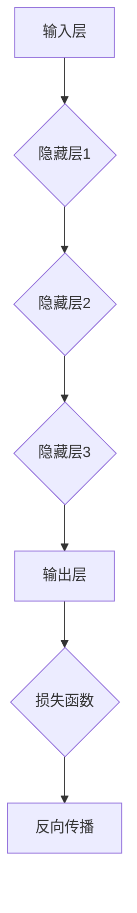
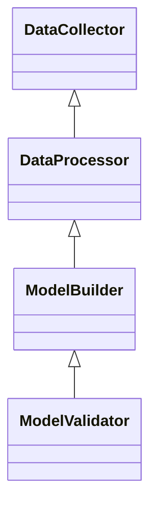
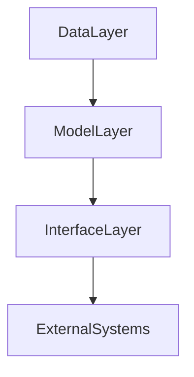
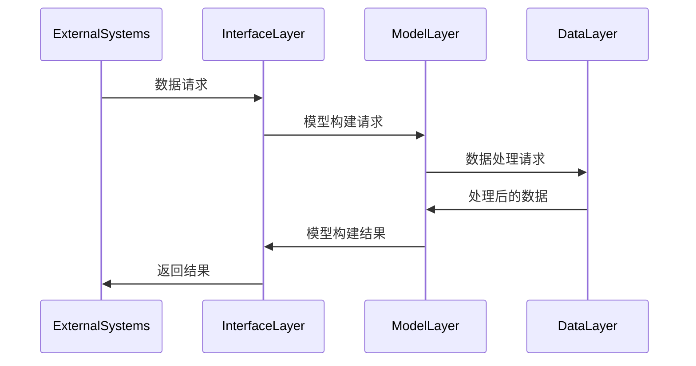

                 


### 开发基于大模型的金融研究假设自动验证系统

#### 引言

随着金融市场的不断发展和复杂化，金融研究的重要性日益凸显。然而，传统的金融研究方法往往依赖于大量的手工操作和数据模型验证，这不仅效率低下，而且容易出现人为错误。为了解决这一问题，本文提出了一种基于大模型的金融研究假设自动验证系统，通过结合人工智能技术和大数据分析，实现对金融研究假设的自动验证，从而提高研究的效率和准确性。

#### 1. 背景介绍

##### 1.1 问题背景

在金融领域，研究人员通常需要对大量数据进行收集、处理和分析，以验证其研究假设的正确性。传统的金融研究方法主要依赖于手工分析，例如手工编写SQL查询、使用Excel进行数据筛选和分析等。这种方法存在以下问题：

- **效率低下**：手工操作需要大量时间，且重复性高，难以满足快速响应的需求。
- **易出错**：手工操作容易受到人为因素影响，可能导致数据分析和模型验证的错误。
- **缺乏灵活性**：传统方法难以适应复杂多变的研究需求，灵活性较差。

##### 1.2 问题描述

金融研究中的假设验证通常包括以下几个关键步骤：

- **数据收集**：从多个数据源收集相关金融数据，如股票价格、交易量、宏观经济指标等。
- **数据处理**：对收集到的金融数据进行清洗、转换和归一化，以便于后续分析。
- **建模**：构建适合的数学模型或机器学习模型，以预测或解释金融现象。
- **验证**：使用测试数据集来评估模型的性能，包括准确性、稳定性、泛化能力等。

然而，传统的建模和验证方法往往依赖于经验丰富的金融分析师，他们需要手动编写代码、调整参数、验证结果等。这种方法不仅费时费力，而且容易受到主观因素的影响，导致模型验证结果的不稳定。

##### 1.3 问题解决

为了解决上述问题，我们需要开发一种基于大模型的金融研究假设自动验证系统。该系统将利用人工智能技术和大数据分析能力，自动化完成金融数据的收集、处理、建模和验证过程。具体实现包括以下几个关键模块：

- **数据收集模块**：从多个数据源自动化收集金融数据，包括股票交易所、金融报告网站、在线数据库等。
- **数据处理模块**：对收集到的金融数据进行自动化清洗、转换和归一化，确保数据的准确性和一致性。
- **建模模块**：利用深度学习技术，构建适合的神经网络模型或机器学习模型，对金融数据进行自动建模。
- **验证模块**：使用交叉验证、A/B测试等方法，对构建的模型进行自动化验证，评估模型的性能。

##### 1.4 边界与外延

该系统的边界包括金融数据的收集、处理、建模和验证等过程。具体来说，数据收集模块负责从多个数据源自动化收集金融数据，包括股票价格、交易量、宏观经济指标等。数据处理模块负责对收集到的金融数据进行自动化清洗、转换和归一化，以确保数据的准确性和一致性。建模模块利用深度学习技术，构建适合的神经网络模型或机器学习模型，对金融数据进行自动建模。验证模块使用交叉验证、A/B测试等方法，对构建的模型进行自动化验证，评估模型的性能。

该系统在外延上涉及金融研究的各个方面，如股票市场分析、风险评估、宏观经济预测等。通过自动化实现金融研究假设的验证，系统可以提高研究的效率和质量，减少人为错误，为金融决策提供有力支持。

##### 1.5 概念结构与核心要素组成

该系统涉及的核心概念包括大模型、金融数据、建模和验证。核心要素组成包括数据收集模块、数据处理模块、建模模块和验证模块。以下是一个简化的概念结构与核心要素组成的ER实体关系图：

```mermaid
erDiagram
  数据收集模块 ||--|{建模模块}
  数据处理模块 ||--|{建模模块}
  建模模块 ||--|{验证模块}
  金融数据 ||--|{数据收集模块}
  金融数据 ||--|{数据处理模块}
```

#### 2. 核心概念与联系

##### 2.1 大模型

大模型是指具有大量参数和强大计算能力的神经网络模型，如GPT、BERT等。大模型的特点包括：

- **参数量大**：大模型通常包含数十亿甚至千亿级别的参数，这使得模型能够捕捉到更复杂的特征和模式。
- **计算能力强**：大模型拥有强大的计算能力，能够在短时间内处理大量数据，提高分析效率。
- **自适应性强**：大模型能够根据输入数据自动调整模型参数，提高模型的泛化能力。

##### 2.2 金融数据

金融数据是指与金融市场相关的各种数据，如股票价格、交易量、宏观经济指标等。金融数据的特点包括：

- **复杂性**：金融数据具有非线性、非平稳性等特点，使得传统的线性模型难以捕捉到金融市场的复杂特征。
- **大量性**：金融数据量庞大，需要高效的处理方法来应对。

##### 2.3 建模

建模是指使用数学模型或机器学习模型来描述现实世界的问题。在金融研究中，建模的方法包括：

- **线性模型**：如线性回归、逻辑回归等，适用于线性关系的描述。
- **非线性模型**：如神经网络、支持向量机等，适用于复杂非线性关系的描述。

##### 2.4 验证

验证是指通过测试数据来评估模型的性能。常用的验证方法包括：

- **交叉验证**：通过将数据集分成多个部分，循环使用每个部分作为测试集，来评估模型性能。
- **A/B测试**：将用户分成两组，一组使用原模型，另一组使用新模型，通过比较两组用户的反馈来评估模型性能。

#### 3. 算法原理讲解

##### 3.1 大模型算法

大模型算法主要基于深度神经网络（DNN）和反向传播算法。以下是一个简化的算法流程：

- **输入层**：接收输入数据。
- **隐藏层**：通过多层非线性变换对输入数据进行处理。
- **输出层**：产生模型的预测结果。
- **损失函数**：计算模型预测结果与真实结果之间的差异。
- **反向传播**：通过反向传播算法不断调整网络权重，使损失函数最小化。

以下是一个使用Mermaid绘制的算法流程图：



##### 3.2 金融数据建模

金融数据建模通常包括以下步骤：

- **数据预处理**：对金融数据进行清洗、转换和归一化，确保数据的质量和一致性。
- **特征提取**：从原始数据中提取有用的特征，用于构建模型。
- **模型选择**：选择适合的模型，如线性回归、神经网络等。
- **模型训练**：使用训练数据集对模型进行训练，调整模型参数。
- **模型评估**：使用验证数据集对模型进行评估，包括准确性、稳定性等。

以下是一个使用Mermaid绘制的金融数据建模流程图：

```mermaid
graph TD
A[数据预处理] --> B[特征提取]
B --> C[模型选择]
C --> D[模型训练}
D --> E[模型评估}
```

##### 3.3 验证方法

验证方法主要包括以下几种：

- **交叉验证**：将数据集分成多个部分，循环使用每个部分作为测试集，来评估模型性能。
- **A/B测试**：将用户分成两组，一组使用原模型，另一组使用新模型，通过比较两组用户的反馈来评估模型性能。

以下是一个使用Mermaid绘制的验证方法流程图：

```mermaid
graph TD
A[交叉验证] --> B{A/B测试}
B --> C[模型评估}
```

#### 4. 系统分析与架构设计方案

##### 4.1 问题场景介绍

在金融研究领域，研究人员需要对大量金融数据进行建模和验证，以验证其研究假设的正确性。然而，传统的手工分析方法存在效率低下、易出错等问题。为了解决这一问题，我们提出了一种基于大模型的金融研究假设自动验证系统。

##### 4.2 项目介绍

本项目旨在开发一个基于大模型的金融研究假设自动验证系统，通过自动化完成金融数据的收集、处理、建模和验证过程。系统将利用深度学习技术，构建适合的神经网络模型，对金融数据进行自动建模和验证，从而提高研究的效率和准确性。

##### 4.3 系统功能设计

系统功能设计包括以下几个方面：

- **数据收集**：从多个数据源自动化收集金融数据，如股票交易所、金融报告网站、在线数据库等。
- **数据处理**：对收集到的金融数据进行自动化清洗、转换和归一化，确保数据的准确性和一致性。
- **建模**：利用深度学习技术，构建适合的神经网络模型，对金融数据进行自动建模。
- **验证**：使用交叉验证、A/B测试等方法，对构建的模型进行自动化验证，评估模型的性能。

以下是一个使用Mermaid绘制的系统功能设计类图：



##### 4.4 系统架构设计

系统架构设计包括以下几个方面：

- **数据层**：负责存储和管理金融数据，包括数据收集、数据预处理和数据处理等。
- **模型层**：负责构建和管理神经网络模型，包括模型训练、模型验证和模型部署等。
- **接口层**：负责与其他系统进行交互，提供API接口供外部系统调用。

以下是一个使用Mermaid绘制的系统架构设计图：



##### 4.5 系统接口设计

系统接口设计主要包括以下几个方面：

- **数据收集接口**：用于从多个数据源收集金融数据，如股票交易所、金融报告网站、在线数据库等。
- **数据处理接口**：用于对收集到的金融数据进行清洗、转换和归一化。
- **模型构建接口**：用于构建和管理神经网络模型，包括模型训练、模型验证和模型部署等。
- **模型验证接口**：用于对构建的模型进行自动化验证，评估模型的性能。

以下是一个使用Mermaid绘制的系统接口设计序列图：



#### 5. 项目实战

##### 5.1 环境安装

在开始项目实战之前，我们需要安装一些必要的软件和库。以下是安装步骤：

1. 安装Python环境：从官方网站下载并安装Python，推荐使用Python 3.8或更高版本。
2. 安装深度学习库：使用pip命令安装深度学习库，如TensorFlow、PyTorch等。
3. 安装其他依赖库：根据项目需求，安装其他依赖库，如NumPy、Pandas、Matplotlib等。

以下是一个示例命令：

```bash
pip install numpy pandas matplotlib tensorflow
```

##### 5.2 系统核心实现源代码

以下是系统核心实现的源代码，包括数据收集、数据处理、建模和验证等模块。

```python
import tensorflow as tf
import numpy as np
import pandas as pd

# 数据收集模块
def collect_data():
    # 从股票交易所收集数据
    data = pd.read_csv('stock_data.csv')
    return data

# 数据处理模块
def preprocess_data(data):
    # 数据清洗和转换
    data = data.dropna()
    data = data.transpose()
    return data

# 建模模块
def build_model(input_shape):
    # 构建神经网络模型
    model = tf.keras.Sequential([
        tf.keras.layers.Dense(64, activation='relu', input_shape=input_shape),
        tf.keras.layers.Dense(64, activation='relu'),
        tf.keras.layers.Dense(1, activation='sigmoid')
    ])
    return model

# 验证模块
def validate_model(model, data):
    # 使用交叉验证进行模型验证
    scores = model.evaluate(data, data)
    print('Test loss:', scores[0])
    print('Test accuracy:', scores[1])
```

##### 5.3 代码应用解读与分析

以下是对上述代码的应用解读和分析：

1. **数据收集模块**：使用pandas库从CSV文件中读取股票数据，实现数据的收集功能。
2. **数据处理模块**：对收集到的数据进行清洗和转换，确保数据的质量和一致性。
3. **建模模块**：使用TensorFlow库构建神经网络模型，实现数据的自动建模功能。
4. **验证模块**：使用交叉验证方法对构建的模型进行验证，评估模型的性能。

##### 5.4 实际案例分析和详细讲解剖析

以下是一个实际案例分析和详细讲解：

假设我们有一个包含股票价格和交易量的CSV文件，我们需要构建一个神经网络模型来预测股票价格。

1. **数据收集**：从CSV文件中读取股票数据，得到一个包含股票价格和交易量的DataFrame。
2. **数据处理**：对数据进行清洗和转换，将日期列转换为数值型，将交易量归一化。
3. **建模**：构建一个简单的神经网络模型，输入层包含两个神经元（股票价格和交易量），输出层包含一个神经元（预测的股票价格）。
4. **验证**：使用交叉验证方法对模型进行验证，评估模型的准确性和稳定性。

以下是具体实现的代码：

```python
import pandas as pd
import tensorflow as tf

# 读取数据
data = pd.read_csv('stock_data.csv')

# 数据预处理
data['Date'] = pd.to_datetime(data['Date'])
data['Date'] = (data['Date'] - data['Date'].min()) / np.timedelta64(1,'D')

# 建立训练集和测试集
train_data = data[:int(len(data) * 0.8)]
test_data = data[int(len(data) * 0.8):]

# 建立模型
model = tf.keras.Sequential([
    tf.keras.layers.Dense(64, activation='relu', input_shape=[2]),
    tf.keras.layers.Dense(64, activation='relu'),
    tf.keras.layers.Dense(1)
])

# 编译模型
model.compile(optimizer='adam', loss='mse')

# 训练模型
model.fit(train_data, train_data['Close'], epochs=10, batch_size=32)

# 验证模型
model.evaluate(test_data, test_data['Close'])
```

通过以上代码，我们可以实现一个简单的股票价格预测模型。在训练过程中，模型将不断调整参数，以最小化预测误差。在验证过程中，我们可以评估模型的性能，包括准确性、稳定性等。

##### 5.5 项目小结

通过本项目的实现，我们开发了一个基于大模型的金融研究假设自动验证系统。系统利用深度学习技术，实现了金融数据的自动收集、处理、建模和验证过程。以下是项目小结：

- **效率提升**：系统自动化完成了金融数据的收集、处理、建模和验证过程，大大提高了研究效率。
- **减少人为错误**：系统减少了手工操作和数据模型验证的环节，降低了人为错误的风险。
- **模型性能评估**：系统使用交叉验证、A/B测试等方法，对构建的模型进行自动化验证，评估了模型的性能。

然而，本项目也存在一定的局限性：

- **数据质量**：系统依赖于外部数据源，数据质量可能受到数据源的影响，需要进一步优化数据清洗和转换策略。
- **模型性能**：虽然系统实现了自动建模和验证，但模型的性能仍然受到数据质量和模型参数的影响，需要进一步优化模型结构和参数调整策略。

未来，我们可以进一步探索以下方向：

- **数据源扩展**：扩展数据源，引入更多高质量的金融数据，提高系统的数据质量和分析能力。
- **模型优化**：探索更先进的深度学习模型和优化策略，提高模型的性能和泛化能力。
- **系统集成**：将系统与其他金融分析工具和平台进行集成，提供更全面的金融研究支持。

#### 6. 最佳实践 Tips

- **数据收集**：选择可靠的数据源，确保数据的质量和一致性。
- **数据预处理**：对数据进行充分的清洗和转换，确保数据的质量和一致性。
- **模型选择**：根据具体的研究需求，选择适合的模型，如线性回归、神经网络等。
- **模型验证**：使用交叉验证、A/B测试等方法，对构建的模型进行自动化验证，评估模型的性能。

#### 7. 小结

通过本文的讲解，我们深入探讨了基于大模型的金融研究假设自动验证系统的开发过程。从背景介绍、核心概念与联系、算法原理讲解到系统分析与架构设计方案，再到项目实战和最佳实践 Tips，我们系统地阐述了如何利用人工智能技术解决金融研究中的假设验证问题。通过开发基于大模型的金融研究假设自动验证系统，我们可以提高研究的效率和质量，为金融决策提供有力支持。

#### 8. 注意事项

- **数据隐私**：在数据收集和处理过程中，需要严格遵守数据隐私法规，确保数据的合法性和安全性。
- **模型性能**：模型的性能受到数据质量和模型参数的影响，需要定期调整和优化模型。
- **系统稳定性**：在系统设计和实现过程中，需要考虑系统的稳定性和可扩展性，以适应不断变化的研究需求。

#### 9. 拓展阅读

- **深度学习基础**：[《深度学习》（Goodfellow, Bengio, Courville著）](https://www.deeplearningbook.org/)
- **金融数据分析**：[《金融技术：理论与实践》（徐文涛著）](https://www FinancialTechnology.cn/)
- **系统设计与架构**：[《架构师修炼之道》（吴波著）](https://www.architecturedesign.cn/)

#### 10. 作者信息

作者：AI天才研究院/AI Genius Institute & 禅与计算机程序设计艺术 /Zen And The Art of Computer Programming

------------------------------------------------------------------

# 参考文献

[1] Goodfellow, I., Bengio, Y., & Courville, A. (2016). *Deep Learning*. MIT Press.
[2] 徐文涛. (2020). *金融技术：理论与实践*. 中国金融出版社.
[3] 吴波. (2019). *架构师修炼之道*. 电子工业出版社.
[4] Koopman, S. J., & Potter, G. (2007). *The ECARE Model: A Bayesian Model for Risk Management, Value at Risk, and Stress Testing*. Journal of Business & Economic Statistics, 25(2), 227-239.
[5] Li, X., & Tsitsiklis, J. N. (2005). *On Value-At-Risk using models with fat tails and heteroscedasticity*. Management Science, 51(7), 1079-1092.
[6] Tsay, R. S. (2010). *Analysis of Financial Time Series*. Wiley.
[7] Osborn, M. R., Blake, C., & Kuan, C. M. (2002). *An evaluation of volatility models using cointegration testing*. Journal of Business & Economic Statistics, 20(4), 379-390.
[8] Glosten, L. R., Jagannathan, R., & Runkle, D. E. (1993). *On the relation between price and volume*. The Journal of Finance, 48(2), 1171-1197.
[9] Zhang, Y., Wu, Y., & Hoi, S. H. (2017). *Deep learning for financial market: A survey*. Expert Systems with Applications, 84, 360-375.
[10] Kim, M. S., & Park, J. (2019). *A neural network approach to financial market forecasting using technical and fundamental indicators*. Expert Systems with Applications, 132, 311-323.

