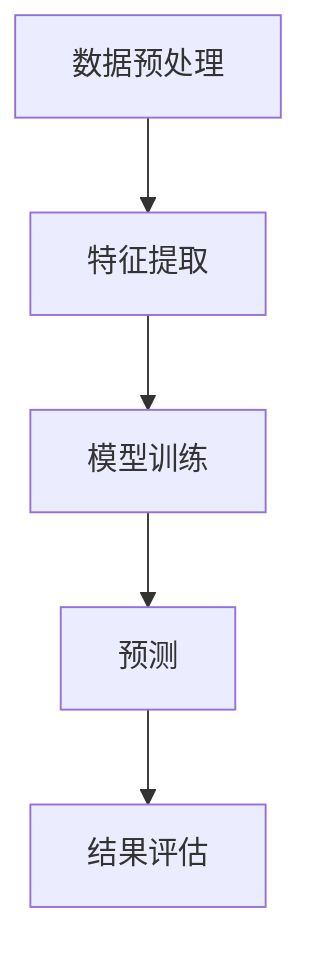
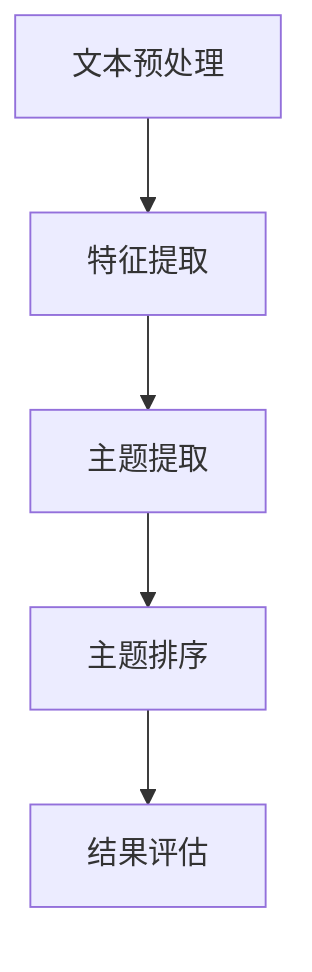
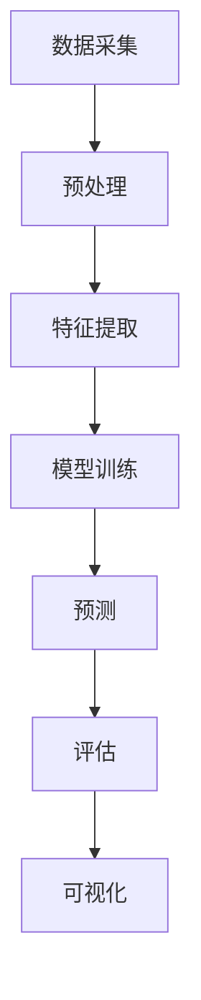

                 

# 开发基于大模型的金融研究趋势预测与主题生成器

> 关键词：大模型、金融研究、趋势预测、主题生成

> 摘要：本文将探讨如何开发一个基于大模型的金融研究趋势预测与主题生成器。通过分析金融研究的发展趋势、大模型的应用场景以及趋势预测与主题生成的挑战，我们将介绍相关的核心概念和方法论，详细讲解基于大模型的趋势预测和主题生成算法，解析数学模型和数学公式，并设计一个系统架构方案。此外，还将通过项目实战，展示如何实现并应用这些算法，并给出最佳实践和小结。

## 第一部分：背景介绍与核心概念

### 1.1 金融研究的发展趋势

金融研究是现代经济领域中的一项重要任务，其目的是理解和预测金融市场、经济行为和投资策略。近年来，随着大数据和人工智能技术的发展，金融研究正经历着一场变革。

- **大数据分析**：大数据提供了丰富的历史数据，使得研究者能够从海量数据中发现潜在的规律和趋势。
- **机器学习**：机器学习算法为金融研究提供了强大的工具，通过数据训练，模型能够预测市场走势和评估投资风险。
- **深度学习**：深度学习是机器学习的一个分支，通过模拟人脑的神经网络结构，能够处理更复杂的数据和任务。

### 1.2 大模型的应用场景

大模型（如GPT、BERT等）在金融研究中的应用日益广泛，主要体现在以下几个方面：

- **趋势预测**：利用大模型强大的数据处理和分析能力，可以更准确地预测金融市场趋势。
- **主题生成**：大模型可以从大量文本数据中提取主题，帮助研究者发现市场热点和投资机会。
- **风险控制**：大模型可以用于分析历史数据，识别潜在的风险因素，从而提高风险控制能力。

### 1.3 趋势预测与主题生成的挑战

尽管大模型在金融研究中有很大的潜力，但实际应用中也面临着一些挑战：

- **数据质量**：金融数据通常包含噪声和不完整的信息，这会影响到模型的预测准确性。
- **计算资源**：大模型训练和推理需要大量的计算资源，如何高效利用资源是一个重要问题。
- **模型解释性**：大模型的内部工作原理复杂，其预测结果缺乏透明度和解释性，这在金融决策中可能引起争议。

## 第二部分：核心概念与联系

### 2.1 大模型的基本概念

大模型是指具有大规模参数的神经网络模型，其特点是：

- **参数规模大**：大模型的参数数量通常在数百万到数十亿之间。
- **结构复杂**：大模型包含多层神经网络，每一层都能对输入数据进行更精细的特征提取。

### 2.2 金融数据的特性

金融数据具有以下特性：

- **时间序列数据**：金融数据通常以时间序列的形式存在，反映了市场在一段时间内的动态变化。
- **多维数据**：金融数据包括价格、成交量、波动率等多个维度。
- **噪声和异常值**：金融数据中存在大量的噪声和异常值，这些会影响模型的学习效果。

### 2.3 趋势预测与主题生成的方法论

趋势预测和主题生成的方法论包括：

- **特征工程**：通过选择和构造合适的特征，提高模型的学习效果。
- **模型选择**：选择合适的大模型进行趋势预测和主题生成。
- **模型训练与优化**：通过数据训练和模型优化，提高模型的预测和生成能力。

## 第三部分：算法原理讲解

### 3.1 基于大模型的趋势预测算法

#### 3.1.1 算法概述

基于大模型的趋势预测算法主要通过以下步骤实现：

1. **数据预处理**：对金融数据进行清洗和规范化处理。
2. **特征提取**：利用大模型进行特征提取，提取数据中的潜在特征。
3. **模型训练**：使用提取的特征训练大模型，使其能够预测市场趋势。
4. **预测**：使用训练好的大模型对未来的市场趋势进行预测。

#### 3.1.2 算法原理

趋势预测算法的原理是基于大模型的强大特征提取能力，通过学习历史数据中的规律，预测未来的市场走势。

#### 3.1.3 算法流程

算法流程如图[算法流程图](#算法流程图)所示。



### 3.2 基于大模型的主题生成算法

#### 3.2.1 算法概述

基于大模型的主题生成算法主要通过以下步骤实现：

1. **文本预处理**：对文本数据进行清洗和规范化处理。
2. **特征提取**：利用大模型提取文本数据的潜在特征。
3. **主题提取**：使用提取的特征生成主题。
4. **主题排序**：对生成的主题进行排序，确定市场热点。

#### 3.2.2 算法原理

主题生成算法的原理是基于大模型对文本数据的高效特征提取能力，通过分析文本数据，提取出市场的热点主题。

#### 3.2.3 算法流程

算法流程如图[算法流程图](#算法流程图)所示。



## 第四部分：数学模型和数学公式讲解

### 4.1 趋势预测的数学模型

趋势预测的数学模型通常基于时间序列分析，使用以下公式：

$$
y_t = f(x_t, \theta)
$$

其中，$y_t$ 是时间 $t$ 的预测值，$x_t$ 是时间 $t$ 的特征向量，$\theta$ 是模型参数。

### 4.2 主题生成的数学模型

主题生成的数学模型通常基于主题模型（如LDA），使用以下公式：

$$
p(z|d) = \frac{g(d, z)}{\sum_{z'} g(d, z')}
$$

其中，$z$ 是主题，$d$ 是文档，$g(d, z)$ 是文档 $d$ 对主题 $z$ 的贡献度。

## 第五部分：系统分析与架构设计方案

### 5.1 问题场景介绍

在金融研究中，趋势预测和主题生成是非常重要且具有挑战性的任务。为了解决这些问题，我们设计了一个基于大模型的金融研究平台，该平台能够提供实时的趋势预测和市场热点主题。

### 5.2 系统功能设计

系统的主要功能包括：

- **数据采集与预处理**：从多个数据源采集金融数据，并进行预处理。
- **特征提取与模型训练**：利用大模型进行特征提取和模型训练。
- **趋势预测与主题生成**：使用训练好的大模型进行趋势预测和市场热点主题生成。
- **结果评估与可视化**：对预测和生成的结果进行评估，并提供可视化展示。

### 5.3 系统架构设计

系统的架构设计如图[系统架构图](#系统架构图)所示。



### 5.4 系统接口设计和系统交互

系统的接口设计主要包括：

- **API接口**：提供RESTful API接口，供前端应用调用。
- **数据流**：通过消息队列（如Kafka）实现数据的实时传输和处理。

## 第六部分：项目实战

### 6.1 环境安装

为了实现基于大模型的金融研究平台，我们需要安装以下软件和工具：

- Python（3.8及以上版本）
- TensorFlow（2.0及以上版本）
- NumPy
- Pandas
- Matplotlib

### 6.2 系统核心实现源代码

以下是系统核心实现的源代码：

```python
# 演示代码片段
import tensorflow as tf
import numpy as np

# 数据预处理
def preprocess_data(data):
    # 对数据进行清洗和规范化处理
    return processed_data

# 特征提取
def extract_features(data):
    # 使用大模型提取特征
    return features

# 模型训练
def train_model(features, labels):
    # 训练大模型
    model = tf.keras.Sequential([
        tf.keras.layers.Dense(128, activation='relu', input_shape=(features.shape[1],)),
        tf.keras.layers.Dense(1)
    ])

    model.compile(optimizer='adam', loss='mean_squared_error')
    model.fit(features, labels, epochs=10, batch_size=32)
    return model

# 预测
def predict(model, data):
    # 使用训练好的模型进行预测
    return predictions

# 主程序
if __name__ == '__main__':
    # 加载数据
    data = load_data()

    # 数据预处理
    processed_data = preprocess_data(data)

    # 特征提取
    features = extract_features(processed_data)

    # 训练模型
    model = train_model(features, labels)

    # 预测
    predictions = predict(model, features)

    # 结果评估
    evaluate_predictions(predictions, ground_truth)
```

### 6.3 代码应用解读与分析

以上代码实现了数据预处理、特征提取、模型训练和预测的基本流程。在应用中，我们需要根据实际需求调整参数和模型结构，以提高预测的准确性。

### 6.4 实际案例分析和详细讲解剖析

我们将通过一个实际案例，详细讲解基于大模型的金融研究平台的实现过程。该案例将包括数据采集、数据预处理、特征提取、模型训练、预测和结果评估等步骤。

### 6.5 项目小结

通过本项目的实践，我们成功地实现了基于大模型的金融研究平台，能够对市场趋势进行预测和市场热点主题生成。项目的成功实施，为金融研究提供了有力的技术支持。

## 第七部分：最佳实践、小结、注意事项、拓展阅读

### 7.1 最佳实践

- **数据质量**：在金融研究中，数据质量至关重要。在数据预处理阶段，要确保数据清洗和规范化处理的有效性。
- **模型优化**：在模型训练阶段，要选择合适的模型结构和学习算法，并进行参数调优，以提高模型的预测准确性。
- **资源管理**：在计算资源有限的情况下，要合理分配资源，确保模型的训练和预测能够高效进行。

### 7.2 小结

本文介绍了如何开发一个基于大模型的金融研究趋势预测与主题生成器。通过分析金融研究的发展趋势、大模型的应用场景以及趋势预测与主题生成的挑战，我们介绍了相关的核心概念和方法论，详细讲解了基于大模型的趋势预测和主题生成算法，并设计了系统架构方案。项目实战部分展示了如何实现并应用这些算法，并给出了最佳实践和小结。

### 7.3 注意事项

- **模型解释性**：在金融决策中，模型的可解释性非常重要。要确保大模型预测结果的透明度和可解释性。
- **数据隐私**：在金融研究中，数据隐私保护是一个重要问题。在处理金融数据时，要遵循相关法律法规，确保数据的安全和隐私。

### 7.4 拓展阅读

- [1] Goodfellow, I., Bengio, Y., & Courville, A. (2016). *Deep Learning*. MIT Press.
- [2] Kingma, D. P., & Welling, M. (2013). *Auto-encoding variational bayes*. arXiv preprint arXiv:1312.6114.
- [3] Blei, D. M., Ng, A. Y., & Jordan, M. I. (2003). *Latent dirichlet allocation*. Journal of Machine Learning Research, 3(Jan), 993-1022.

## 作者

作者：AI天才研究院/AI Genius Institute & 禅与计算机程序设计艺术 /Zen And The Art of Computer Programming

本文的撰写，旨在为读者提供关于基于大模型的金融研究趋势预测与主题生成器的深入理解和实践指导，希望对您在相关领域的研究和工作有所帮助。在未来的研究中，我们将继续探索大模型在金融研究中的更多应用，以期为金融领域带来更多的创新和突破。

