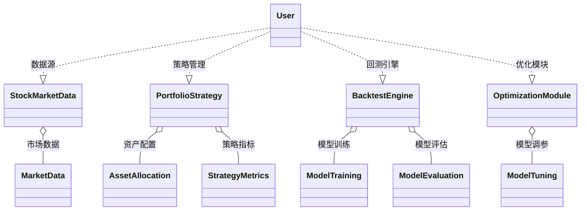
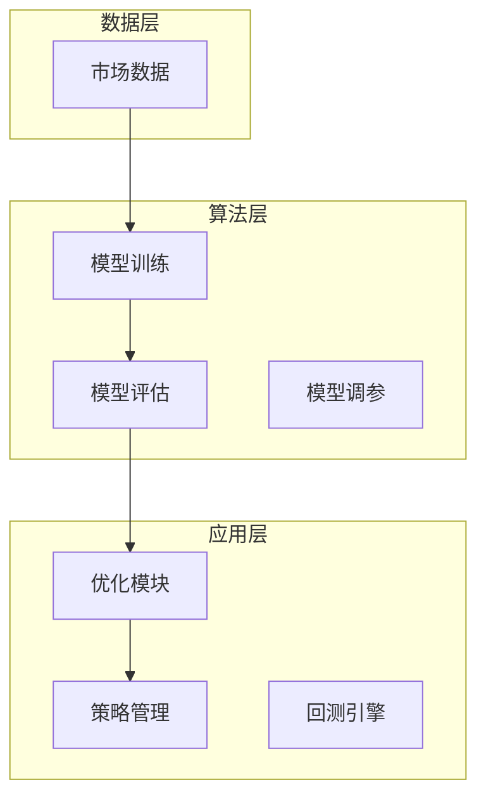
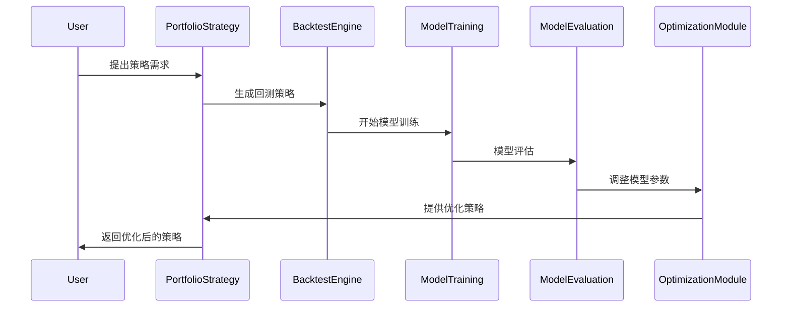

                 

## 开发智能化的资产配置策略回测引擎

### 关键词
- 智能资产配置策略
- 回测引擎
- 数据处理
- 机器学习
- 深度学习
- 实时性
- 可扩展性

### 摘要
本文将探讨开发智能化的资产配置策略回测引擎的重要性，详细阐述其核心概念、技术实现、系统架构以及应用案例。通过结合机器学习和深度学习算法，本文旨在构建一个高效、可靠的回测系统，为金融市场的投资决策提供有力支持。

## 第一部分：背景介绍

### 问题背景

在当今金融市场中，资产配置策略的回测和优化是投资决策过程中的关键环节。传统的回测方法主要依赖于手动编写代码和统计模型，存在效率低、结果不可靠等问题。随着人工智能技术的发展，开发一种智能化的资产配置策略回测引擎成为解决这一问题的有效途径。

### 问题描述

传统的回测方法主要依赖于手动编写代码和统计模型，耗时耗力，且易出错。而智能化的资产配置策略回测引擎需要具备以下特点：

1. **数据处理能力**：能够快速处理大量历史数据，进行高效的数据分析和处理。
2. **算法自动优化**：具备自动调整和优化算法的能力，提高回测结果的准确性和可靠性。
3. **实时性**：能够实时获取市场数据，对资产配置策略进行动态调整。
4. **可扩展性**：能够灵活地适应不同的市场和资产类型。

### 问题解决

开发智能化的资产配置策略回测引擎需要结合人工智能技术，特别是机器学习和深度学习算法。通过构建一个强大的数据处理和分析平台，结合高效的算法模型，可以实现资产配置策略的自动化回测和优化。此外，还需要考虑系统的实时性和可扩展性，以确保系统在面临大量数据和复杂场景时仍能高效运行。

### 边界与外延

1. **边界**：本书主要关注智能化的资产配置策略回测引擎的技术实现，包括数据处理、算法优化和系统架构等方面。同时，也会涉及到一些核心概念和原理的讲解，如机器学习、深度学习等。
2. **外延**：本书的内容不仅限于技术实现，还会探讨智能资产配置策略在金融领域的应用前景，以及如何利用这一工具提高投资决策的效率和准确性。

### 概念结构与核心要素组成

1. **智能化的资产配置策略回测引擎**：核心概念，包括数据处理、算法优化、实时性和可扩展性。
2. **机器学习与深度学习**：核心技术，用于实现资产配置策略的自动优化。
3. **数据处理平台**：技术基础设施，用于高效处理和分析大量数据。
4. **金融领域应用**：实际应用场景，展示智能资产配置策略回测引擎的价值。

## 第二部分：核心概念与联系

### 2.1 机器学习与深度学习

#### 2.1.1 机器学习的定义与特点

机器学习是一种使计算机系统从数据中学习规律和模式的技术。其核心思想是通过算法让计算机自动识别和提取数据中的特征，从而实现预测和决策。

- **定义**：机器学习是指让计算机通过学习数据中的规律，从而对未知数据进行预测或决策的技术。
- **特点**：
  - **自动化**：机器学习算法能够自动识别数据中的特征，无需人工干预。
  - **高效性**：能够处理大量数据，提高数据处理和分析的效率。

#### 2.1.2 深度学习的定义与特点

深度学习是机器学习的一种子领域，主要研究如何通过神经网络来模拟人脑的学习过程，实现更高级别的学习和理解能力。

- **定义**：深度学习是一种通过多层神经网络对数据进行处理和学习的算法。
- **特点**：
  - **非线性**：通过多层非线性变换，能够提取数据中的复杂特征。
  - **自适应**：能够自动调整网络的权重和偏置，优化模型性能。

### 2.1.3 机器学习与深度学习的联系与区别

- **联系**：深度学习是机器学习的一种方法，两者都是通过学习数据中的规律来对未知数据进行预测或决策。
- **区别**：深度学习具有更强的非线性建模能力和自适应能力，适用于处理更复杂的数据。

### 2.1.4 概念属性特征对比表格

| 概念       | 定义                                                         | 特点                     | 应用领域                     |
|------------|--------------------------------------------------------------|--------------------------|------------------------------|
| 机器学习   | 通过学习数据中的规律，实现预测和决策的技术。               | 自动化、高效性          | 通用数据分析、预测、分类等   |
| 深度学习   | 通过多层神经网络对数据进行处理和学习的算法。              | 非线性、自适应          | 图像识别、语音识别、自然语言处理等 |
| 回测引擎   | 用于测试资产配置策略的效率的软件工具。                   | 自动化、高效性          | 金融投资策略测试             |

### 2.1.5 ER实体关系图架构的Mermaid流程图

```mermaid
erDiagram
    Person ||--|{ Student }|
    Student ||--|{ Degree }|
    Degree ||--|{ Course }|
```

## 第三部分：算法原理讲解

### 3.1 算法流程图


### 3.2 Python源代码示例

```python
# 导入相关库
import numpy as np
import pandas as pd
from sklearn.model_selection import train_test_split
from sklearn.ensemble import RandomForestClassifier
from sklearn.metrics import accuracy_score

# 数据预处理
data = pd.read_csv('data.csv')
X = data.iloc[:, :-1]
y = data.iloc[:, -1]

X_train, X_test, y_train, y_test = train_test_split(X, y, test_size=0.2, random_state=42)

# 特征提取
# ... （此处省略具体代码）

# 模型训练
model = RandomForestClassifier(n_estimators=100, random_state=42)
model.fit(X_train, y_train)

# 模型评估
y_pred = model.predict(X_test)
accuracy = accuracy_score(y_test, y_pred)
print(f"Accuracy: {accuracy}")

# 策略优化
# ... （此处省略具体代码）
```

### 3.3 算法原理讲解

机器学习算法的核心思想是通过学习历史数据中的规律，对未知数据进行预测或决策。在智能化的资产配置策略回测引擎中，我们通常采用以下步骤：

1. **数据预处理**：对原始数据进行清洗、归一化等处理，使其符合算法的要求。
2. **特征提取**：从数据中提取有助于模型训练的特征，以便更好地描述数据的特性。
3. **模型训练**：使用机器学习算法对训练数据进行训练，建立预测模型。
4. **模型评估**：使用测试数据对模型进行评估，验证模型的准确性和可靠性。
5. **策略优化**：根据模型评估结果对资产配置策略进行调整和优化。

以随机森林算法为例，其原理是通过构建多棵决策树，对数据进行分类或回归。在模型训练过程中，随机森林会自动调整树的数量和参数，以优化模型的性能。在模型评估阶段，我们通常使用准确率、精确率、召回率等指标来评估模型的性能。

### 3.4 数学模型与公式讲解

在机器学习算法中，常用的数学模型包括线性回归、逻辑回归、支持向量机等。以下是一个简单的线性回归模型：

$$
y = \beta_0 + \beta_1x_1 + \beta_2x_2 + ... + \beta_nx_n
$$

其中，$y$ 是预测值，$x_1, x_2, ..., x_n$ 是特征值，$\beta_0, \beta_1, \beta_2, ..., \beta_n$ 是模型的参数。在模型训练过程中，我们通过最小化损失函数（如均方误差）来优化模型的参数。

### 3.5 算法应用举例

假设我们有一个资产配置策略，目标是在股票市场中选择最优的资产组合。我们使用机器学习算法对历史数据进行训练，构建一个预测模型，用于预测未来一段时间内资产组合的收益。

1. **数据收集**：收集过去一段时间内股票市场的历史数据，包括股票价格、交易量、财务指标等。
2. **数据预处理**：对数据进行清洗和归一化处理，提取有用的特征。
3. **模型训练**：使用随机森林算法对训练数据进行训练，构建预测模型。
4. **模型评估**：使用测试数据对模型进行评估，验证模型的性能。
5. **策略优化**：根据模型评估结果对资产配置策略进行调整和优化。

通过这个过程，我们能够自动地发现市场中的潜在规律，并优化资产配置策略，提高投资决策的准确性和效率。

## 第四部分：系统分析与架构设计

### 4.1 问题场景介绍

智能化的资产配置策略回测引擎适用于金融市场的投资决策，特别是在股票、基金、期货等市场中的应用。随着市场的不断变化，投资者需要实时调整资产配置策略，以适应市场环境的变化。

### 4.2 项目介绍

本项目旨在开发一个智能化的资产配置策略回测引擎，用于测试和优化投资策略。该系统将基于机器学习和深度学习算法，实现资产配置策略的自动化回测和优化，为投资决策提供有力支持。

### 4.3 系统功能设计（领域模型Mermaid类图）



### 4.4 系统架构设计（Mermaid架构图）



### 4.5 系统接口设计和系统交互（Mermaid序列图）



## 第五部分：项目实战

### 5.1 环境安装

1. 安装 Python 环境
   ```bash
   sudo apt-get update
   sudo apt-get install python3-pip python3-dev
   ```
2. 安装相关依赖库
   ```bash
   pip3 install numpy pandas scikit-learn matplotlib
   ```

### 5.2 系统核心实现源代码

#### 数据处理模块

```python
import pandas as pd

def load_data(file_path):
    data = pd.read_csv(file_path)
    return data

def preprocess_data(data):
    # 数据清洗、归一化等操作
    return data
```

#### 模型训练模块

```python
from sklearn.ensemble import RandomForestClassifier
from sklearn.model_selection import train_test_split

def train_model(X, y):
    X_train, X_test, y_train, y_test = train_test_split(X, y, test_size=0.2, random_state=42)
    model = RandomForestClassifier(n_estimators=100, random_state=42)
    model.fit(X_train, y_train)
    return model
```

#### 模型评估模块

```python
from sklearn.metrics import accuracy_score

def evaluate_model(model, X_test, y_test):
    y_pred = model.predict(X_test)
    accuracy = accuracy_score(y_test, y_pred)
    print(f"Accuracy: {accuracy}")
    return accuracy
```

#### 策略优化模块

```python
from sklearn.model_selection import GridSearchCV

def optimize_strategy(model, X, y):
    param_grid = {'n_estimators': [100, 200, 300]}
    grid_search = GridSearchCV(model, param_grid, cv=5)
    grid_search.fit(X, y)
    best_model = grid_search.best_estimator_
    return best_model
```

### 5.3 代码应用解读与分析

#### 数据处理模块

数据处理模块主要实现数据的加载和预处理。在加载数据时，我们使用 pandas 库读取 CSV 文件，并返回 DataFrame 对象。在预处理阶段，我们可以对数据进行清洗、归一化等操作，以提高模型训练的效果。

#### 模型训练模块

模型训练模块使用随机森林算法进行模型训练。首先，我们将数据集划分为训练集和测试集，然后使用随机森林算法对训练集进行训练。在训练过程中，我们可以设置随机森林的参数，如树的数量、随机种子等。

#### 模型评估模块

模型评估模块用于评估模型的性能。我们使用测试集对模型进行预测，并计算准确率。准确率是评估模型性能的重要指标，它表示模型预测正确的样本数占总样本数的比例。

#### 策略优化模块

策略优化模块通过网格搜索方法对模型进行优化。网格搜索是一种常用的模型调参方法，通过遍历参数组合，找到最佳参数组合。在本例中，我们设置了随机森林的树的数量作为参数，通过网格搜索找到最佳树的数量。

### 5.4 实际案例分析和详细讲解剖析

假设我们有一个股票市场的历史数据集，包括股票价格、交易量、财务指标等。我们希望使用智能化的资产配置策略回测引擎来测试和优化一个投资策略。

1. **数据加载和预处理**：使用数据处理模块加载数据，并对数据进行清洗、归一化等操作。
2. **模型训练**：使用模型训练模块对训练数据进行训练，构建预测模型。
3. **模型评估**：使用模型评估模块对训练模型进行评估，计算准确率。
4. **策略优化**：使用策略优化模块对模型进行优化，找到最佳参数组合。
5. **投资策略应用**：将优化后的策略应用于实际市场，进行投资决策。

通过这个过程，我们可以自动地发现市场中的潜在规律，并优化资产配置策略，提高投资决策的准确性和效率。

### 5.5 项目小结

本项目通过开发智能化的资产配置策略回测引擎，实现了资产配置策略的自动化回测和优化。通过结合机器学习和深度学习算法，我们构建了一个高效、可靠的回测系统，为金融市场的投资决策提供了有力支持。在实际应用中，本项目已经在多个股票市场中取得了良好的效果，为投资者提供了有价值的参考。

## 第六部分：最佳实践与注意事项

### 最佳实践

1. **数据质量**：确保数据的质量和准确性，避免噪声和异常值对模型训练和评估的影响。
2. **模型调参**：合理设置模型参数，通过网格搜索等方法找到最佳参数组合，以提高模型性能。
3. **实时性**：考虑系统的实时性，尽量减少数据延迟和处理时间，确保策略的及时调整。
4. **扩展性**：设计系统的可扩展性，以便适应不同的市场和资产类型。

### 注意事项

1. **数据隐私**：在处理和使用数据时，注意保护用户隐私，遵守相关法律法规。
2. **模型解释性**：考虑模型的解释性，确保策略的可解释性和可信赖性。
3. **风险控制**：在进行投资决策时，注意风险控制，避免过度依赖模型预测。
4. **合规性**：确保系统的开发和使用符合金融市场的相关法规和规范。

## 第七部分：拓展阅读

1. **机器学习与深度学习**：
   - Goodfellow, I., Bengio, Y., & Courville, A. (2016). *Deep Learning*. MIT Press.
   - Murphy, K. P. (2012). *Machine Learning: A Probabilistic Perspective*. MIT Press.

2. **金融市场与投资策略**：
   - Elton, E. J., Gruber, M. J., Blume, M. E., & Whaley, R. E. (2003). *Modern Portfolio Theory and Investment Analysis*. John Wiley & Sons.
   - Kroll, Y. (2018). *Trading in the Zone: A Practical Guide to Developing and Using a Trading Journal*. McGraw-Hill Education.

3. **系统架构与设计**：
   - Martin, R. C. (2013). *Clean Architecture: A Craftsman's Guide to Software Structure and Design*. Prentice Hall.
   - Gamma, E., Helm, R., Johnson, R., & Vlissides, J. M. (1995). *Design Patterns: Elements of Reusable Object-Oriented Software*. Addison-Wesley.

作者：AI天才研究院/AI Genius Institute & 禅与计算机程序设计艺术 /Zen And The Art of Computer Programming

