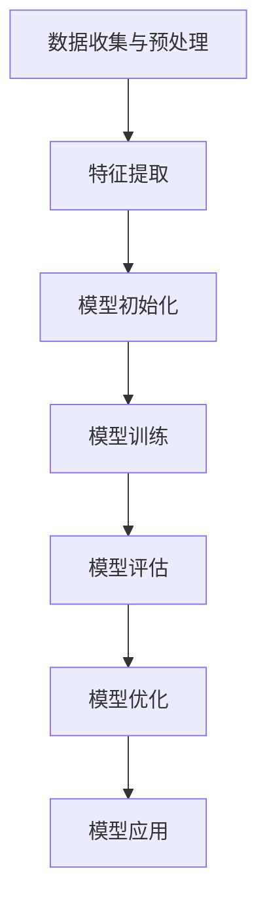
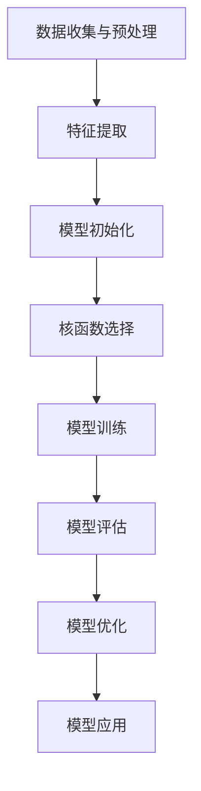
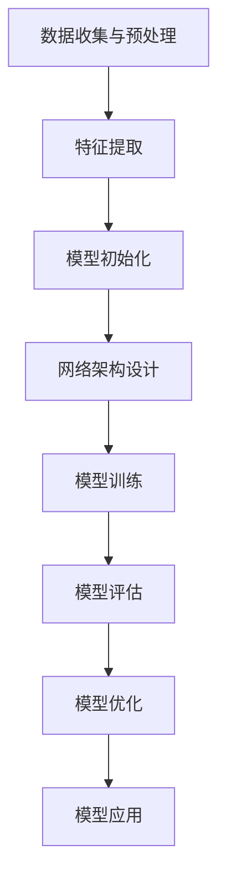
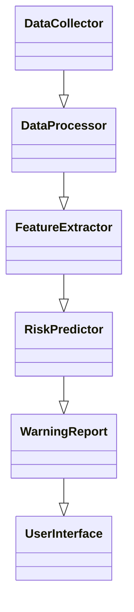
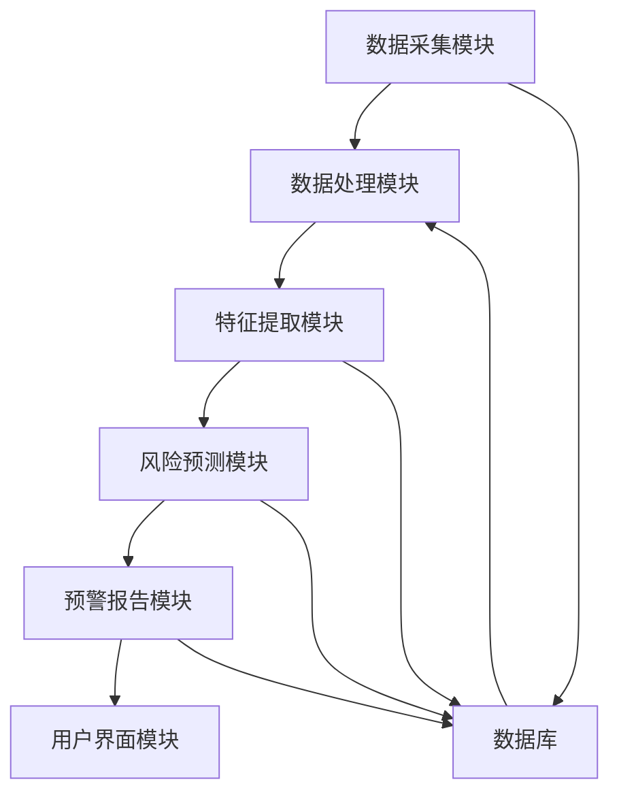

                 

### 文章标题

# 开发智能化的金融市场流动性风险传导预警模型

### 关键词

- 金融市场流动性风险
- 风险传导机制
- 智能化预警模型
- 数学模型与算法
- 系统架构设计

### 摘要

随着金融市场日益复杂化和全球化，流动性风险成为了金融市场中一个不可忽视的重要问题。本文旨在介绍如何开发一种智能化的金融市场流动性风险传导预警模型，以应对流动性风险带来的潜在威胁。文章首先介绍了金融市场流动性风险的基本概念和传导机制，然后详细探讨了构建预警模型的方法和步骤。通过数学模型与算法的讲解，文章深入分析了如何利用Python进行模型实现。此外，文章还介绍了系统架构设计，包括功能设计、架构设计、接口设计和交互设计。最后，通过实际案例分析和最佳实践总结，为读者提供了实用的开发指导。

## 目录大纲设计思路

### 一、总览全书

在设计目录大纲之前，我们需要先了解本书的主题、目标和主要内容。对于《开发智能化的金融市场流动性风险传导预警模型》这本书，我们首先要明确以下几点：

1. **主题**：金融市场流动性风险的智能化预警模型的开发。
2. **目标**：帮助读者理解和掌握如何开发智能化的金融市场流动性风险传导预警模型。
3. **主要内容**：包括核心概念介绍、理论讲解、模型构建、实战案例、最佳实践等。

### 二、梳理章节结构

接下来，我们根据书籍的目标和主要内容，梳理出章节的基本结构。为了确保内容的完整性，我们至少需要包含以下几个核心部分：

1. **引言**：介绍金融市场流动性风险的基本概念、重要性及当前的研究现状。
2. **核心概念与原理**：详细讲解金融市场流动性风险的相关核心概念和理论原理。
3. **模型构建方法**：介绍构建智能化金融市场流动性风险传导预警模型的方法和步骤。
4. **数学模型与算法**：阐述模型构建过程中使用的数学模型和算法，并提供相应的Python代码示例。
5. **系统架构设计**：介绍模型在系统架构上的实现方法，包括系统功能设计、架构设计、接口设计和交互设计。
6. **实战案例**：通过实际案例展示如何应用本书的知识进行金融市场流动性风险传导预警模型的开发。
7. **最佳实践**：总结实战中的最佳经验和注意事项。
8. **总结与展望**：对全书内容进行总结，并对未来研究方向进行展望。

### 三、细化章节内容

在确定了章节结构后，我们需要对每个章节的内容进行细化，确保每个章节都有明确的主题和丰富的内容。以下是详细的章节内容设计：

### 第1章 引言

**1.1 问题背景**

- 金融市场流动性风险的含义
- 流动性风险对金融市场的影响
- 当前流动性风险的现状

**1.2 问题描述**

- 流动性风险的成因
- 流动性风险的传导机制
- 流动性风险的预警与监测

**1.3 问题解决**

- 智能化流动性风险预警模型的重要性
- 现有方法的不足与挑战

**1.4 边界与外延**

- 流动性风险的类型
- 模型的适用范围

**1.5 概念结构与核心要素组成**

- 模型的基本结构
- 模型的主要组成部分

### 第2章 核心概念与原理

**2.1 核心概念**

- 金融市场流动性风险
- 风险传导机制
- 预警模型

**2.2 概念属性特征对比表格**

- 金融市场流动性风险与市场风险
- 传统预警模型与智能化预警模型

**2.3 ER实体关系图架构**

- 实体与关系的定义
- ER图绘制

### 第3章 模型构建方法

**3.1 模型构建概述**

- 模型构建的基本步骤
- 数据收集与预处理

**3.2 数据处理方法**

- 数据清洗
- 特征提取
- 数据标准化

**3.3 模型选择与优化**

- 模型选择原则
- 模型优化方法

**3.4 模型训练与验证**

- 训练集与验证集划分
- 训练过程监控
- 模型验证方法

### 第4章 数学模型与算法

**4.1 数学模型**

- 线性回归模型
- 支持向量机
- 神经网络

**4.2 算法讲解**

- 算法流程图（使用mermaid绘制）
- 算法Python代码示例

**4.3 数学公式**

- 数学模型中的关键公式（使用LaTeX格式）

### 第5章 系统架构设计

**5.1 问题场景介绍**

- 系统需求分析
- 系统功能定义

**5.2 系统功能设计**

- 领域模型（使用mermaid绘制类图）

**5.3 系统架构设计**

- 系统架构图（使用mermaid绘制）

**5.4 系统接口设计**

- 接口定义
- 接口调用流程

**5.5 系统交互**

- 交互序列图（使用mermaid绘制）

### 第6章 实战案例

**6.1 环境安装**

- 环境搭建步骤
- 软件与工具介绍

**6.2 系统核心实现**

- 源代码展示
- 代码解析

**6.3 实际案例分析**

- 案例背景
- 模型应用
- 结果分析

**6.4 详细讲解剖析**

- 算法原理
- 数据处理
- 系统设计

### 第7章 最佳实践

**7.1 最佳实践总结**

- 实践中的经验教训
- 遇到的问题及解决方案

**7.2 小结**

- 本书重点内容的回顾
- 模型开发的关键步骤

**7.3 注意事项**

- 开发过程中的常见问题
- 避免踩坑的建议

**7.4 拓展阅读**

- 相关文献推荐
- 研究方向展望

通过以上设计，我们能够确保目录大纲的完整性、逻辑性和实用性，为读者提供一份全面的开发智能化的金融市场流动性风险传导预警模型的指南。

## 引言

### 1.1 问题背景

金融市场流动性风险是指金融市场中的投资者无法在合理的时间内以合理的价格买入或卖出资产的风险。这种风险的存在会对金融市场的稳定性产生严重影响，甚至可能导致整个金融系统的崩溃。随着全球金融市场的日益复杂化和全球化，流动性风险已经成为金融市场中的一个重要问题。

流动性风险对金融市场的影响主要体现在以下几个方面：

1. **市场波动性增加**：流动性风险的存在会导致市场价格的波动性增加，从而影响市场的稳定性。
2. **信用风险增加**：当市场出现流动性危机时，金融机构可能会面临无法偿还债务的风险，从而增加整个金融体系的信用风险。
3. **市场效率降低**：流动性风险的增加会导致市场交易成本上升，降低市场的效率。
4. **系统性风险增加**：流动性风险可能引发连锁反应，导致整个金融系统的崩溃。

### 1.2 问题描述

金融市场流动性风险的产生主要源于以下几个方面：

1. **宏观经济因素**：如经济周期、政策变化等。
2. **市场结构因素**：如市场深度不足、交易机制不完善等。
3. **金融机构行为**：如风险偏好变化、杠杆操作等。
4. **突发事件**：如金融危机、自然灾害等。

流动性风险的传导机制可以概括为以下几个步骤：

1. **初始触发**：由于某些宏观经济或市场结构因素，某些金融机构或投资者面临流动性压力。
2. **传导过程**：流动性压力通过金融机构之间的交易关系、市场关联性等渠道传递给其他金融机构或投资者。
3. **放大效应**：在传导过程中，由于市场信心下降、恐慌情绪蔓延等因素，流动性风险可能会被放大。
4. **最终影响**：流动性风险可能引发市场恐慌、资产价格大幅波动、金融机构倒闭等严重后果。

### 1.3 问题解决

为了解决金融市场流动性风险问题，目前已经有了一些传统的预警和监测方法，如：

1. **流动性比率监测**：通过计算流动性比率（如流动性覆盖率LCR、净稳定资金比率NSFR等）来评估金融机构的流动性状况。
2. **市场监控**：通过实时监控市场价格、交易量等指标来发现潜在的流动性风险。
3. **压力测试**：通过模拟不同的市场情景，评估金融机构在极端情况下的流动性承受能力。

然而，传统方法存在一定的局限性，如：

1. **信息滞后**：流动性风险往往在发生后才能被监测到，预警效果有限。
2. **人为因素**：预警模型的建立和执行依赖于人的判断，容易受到主观因素的影响。
3. **复杂性不足**：传统方法难以捕捉金融市场中的复杂关联和动态变化。

因此，开发智能化的金融市场流动性风险传导预警模型显得尤为重要。智能化预警模型可以利用大数据、人工智能等技术手段，实现对金融市场流动性风险的实时监测、预测和预警。这样的模型不仅能够提高预警的准确性和及时性，还能够提供更深入的洞察和决策支持。

### 1.4 边界与外延

#### 流动性风险的类型

根据流动性风险的产生原因和影响范围，可以将流动性风险分为以下几种类型：

1. **市场流动性风险**：由于市场深度不足、交易量减少等原因导致的流动性不足。
2. **机构流动性风险**：金融机构因资产流动性不足或负债流动性压力导致的流动性问题。
3. **系统性流动性风险**：由于整个金融体系流动性不足引发的系统性风险。

#### 模型的适用范围

智能化流动性风险传导预警模型可以应用于以下场景：

1. **金融机构**：用于监测和管理自身的流动性风险。
2. **金融监管机构**：用于监控金融市场的流动性状况，及时识别和应对潜在的流动性风险。
3. **投资者**：用于评估投资对象的流动性风险，做出更加明智的投资决策。

#### 概念结构与核心要素组成

智能化流动性风险传导预警模型的基本结构可以概括为以下几个部分：

1. **数据采集与预处理**：收集金融市场相关的数据，并进行清洗、处理和标准化。
2. **特征提取**：从原始数据中提取对流动性风险有重要影响的特征。
3. **风险建模**：利用机器学习算法构建预测模型，评估流动性风险。
4. **预警机制**：根据模型预测结果，设定预警阈值，实现对流动性风险的实时预警。
5. **决策支持**：提供基于模型预测的决策建议，辅助金融机构和监管机构进行风险管理。

通过以上设计，我们能够确保目录大纲的完整性、逻辑性和实用性，为读者提供一份全面的开发智能化的金融市场流动性风险传导预警模型的指南。

## 核心概念与原理

### 2.1 核心概念

#### 金融市场流动性风险

金融市场流动性风险是指金融市场中的投资者无法在合理的时间内以合理的价格买入或卖出资产的风险。流动性风险的存在会对金融市场的稳定性产生严重影响，可能导致市场价格的剧烈波动、金融机构的破产和市场信心的丧失。

#### 风险传导机制

风险传导机制是指金融市场中的流动性风险如何从最初的触发点传递到整个市场，并对市场产生影响的路径和过程。风险传导通常包括以下几个阶段：

1. **初始触发**：由于宏观经济因素、市场结构因素、金融机构行为或突发事件等原因，某些金融机构或投资者面临流动性压力。
2. **传导过程**：流动性压力通过金融机构之间的交易关系、市场关联性等渠道传递给其他金融机构或投资者。
3. **放大效应**：在传导过程中，由于市场信心下降、恐慌情绪蔓延等因素，流动性风险可能会被放大。
4. **最终影响**：流动性风险可能引发市场恐慌、资产价格大幅波动、金融机构倒闭等严重后果。

#### 预警模型

预警模型是指利用数据分析和机器学习等人工智能技术，对金融市场流动性风险进行实时监测、预测和预警的模型。预警模型的核心目标是通过分析历史数据和实时数据，提前发现潜在的流动性风险，并提供预警信号，以帮助金融机构和监管机构及时采取应对措施。

### 2.2 概念属性特征对比表格

以下是一个对比金融市场流动性风险与市场风险的属性特征表格：

| 特征           | 金融市场流动性风险 | 市场风险 |
| -------------- | ------------------- | -------- |
| 定义           | 投资者无法在合理时间内以合理价格买卖资产的风险 | 资产价值波动带来的损失风险 |
| 成因           | 宏观经济因素、市场结构因素、金融机构行为、突发事件 | 基本面变化、市场情绪波动 |
| 影响范围       | 整个金融市场       | 个别市场或行业 |
| 传导机制       | 通过交易关系、市场关联性等渠道传递 | 通过交易对手、市场情绪等渠道传递 |
| 预警方法       | 实时监测、预测和预警 | 历史数据分析和压力测试 |
| 监测指标       | 流动性比率、交易量、市场波动性 | 资产价格、交易量、市场情绪指标 |
| 预警模型       | 智能化预警模型       | 传统预警模型 |

### 2.3 ER实体关系图架构

在构建金融市场流动性风险传导预警模型时，我们需要定义一系列实体及其关系。以下是一个简化的ER实体关系图，用于描述模型中的主要实体及其关系：

```mermaid
erDiagram
  Customerербурга → Buyer : buys
  Seller --> Product : sells
  Customer --> Product : buys
  Customer  ||--|| Product : reads
  Seller ||--|| Product : list
```

在上述ER图中：

- **Customer**（客户）：指金融市场中的投资者，包括金融机构和个人投资者。
- **Seller**（卖家）：指金融市场中的资产供应方，如金融机构、企业等。
- **Product**（产品）：指金融产品，如股票、债券、期货等。

实体之间的关系包括：

- **buys**：表示客户从卖家购买产品的行为。
- **sells**：表示卖家销售产品的行为。
- **reads**：表示客户读取产品信息的动作。
- **list**：表示卖家列出产品的动作。

通过上述ER实体关系图，我们可以清晰地理解模型中各个实体及其之间的交互关系，为后续的模型构建和系统设计提供基础。

### 细节解析

通过上述核心概念的介绍，我们可以看出金融市场流动性风险与市场风险之间存在明显的区别和联系。流动性风险关注的是资产买卖的难易程度和价格波动，而市场风险关注的是资产价值的波动。两者在成因、影响范围、传导机制和预警方法等方面都有所不同。

ER实体关系图架构为模型构建提供了结构化的描述，有助于我们理解模型中各个实体及其关系的复杂性。通过定义客户、卖家和产品三个实体及其关系，我们可以更清晰地把握模型的核心逻辑。

总的来说，理解这些核心概念和原理是开发智能化金融市场流动性风险传导预警模型的基础。在接下来的章节中，我们将详细探讨如何构建和实现这样的预警模型，包括数据收集、预处理、特征提取、模型选择和优化等关键步骤。通过逐步分析和推理，我们将为读者提供一份完整的开发指南。

### 模型构建方法

在开发智能化的金融市场流动性风险传导预警模型时，我们需要遵循一系列明确的步骤，以确保模型的有效性和可靠性。以下是构建模型的概述、数据处理方法和模型选择与优化过程。

#### 3.1 模型构建概述

模型构建的基本步骤可以分为以下几个阶段：

1. **需求分析**：明确模型的应用场景和目标，了解金融市场流动性风险的传导机制和特征。
2. **数据收集**：收集与金融市场流动性风险相关的数据，包括宏观经济指标、市场交易数据、金融机构的财务报表等。
3. **数据预处理**：对收集到的数据进行清洗、处理和标准化，为后续的特征提取和模型训练做好准备。
4. **特征提取**：从原始数据中提取对流动性风险有重要影响的特征，为模型提供输入。
5. **模型选择**：根据需求选择合适的机器学习算法，构建预测模型。
6. **模型优化**：通过调整模型参数和算法，优化模型的性能和预测能力。
7. **模型训练与验证**：使用训练集和验证集对模型进行训练和验证，评估模型的准确性和可靠性。
8. **预警机制**：根据模型预测结果，设定预警阈值，建立实时预警系统。

#### 3.2 数据处理方法

数据处理是模型构建中至关重要的一步，以下是具体的数据处理方法：

1. **数据清洗**：
   - 填补缺失值：使用平均值、中位数或插值法填补缺失数据。
   - 去除异常值：通过统计学方法（如箱线图）或机器学习方法（如孤立森林）识别并去除异常数据。
   - 数据格式转换：将不同格式的数据转换为统一的格式，如日期时间转换为数值类型。

2. **数据预处理**：
   - 标准化：对数值型特征进行标准化，使其具有相同的尺度，便于模型训练。
   - 规范化：对数值型特征进行规范化，使其分布更加均匀。
   - 分箱：将连续特征划分为多个离散的区间，便于模型处理。

3. **特征提取**：
   - 统计特征：计算数据的均值、方差、最大值、最小值等统计指标。
   - 时间序列特征：提取时间序列的周期性、趋势性、波动性等特征。
   - 关联特征：通过分析不同特征之间的相关性，提取具有显著关联性的特征。

#### 3.3 模型选择与优化

模型选择和优化是确保模型性能的关键步骤。以下是具体的模型选择与优化方法：

1. **模型选择原则**：
   - **适用性**：选择与金融市场流动性风险特征相匹配的模型。
   - **性能**：选择具有较高预测准确率和稳健性的模型。
   - **可解释性**：选择易于理解、可解释的模型。

2. **模型优化方法**：
   - **参数调整**：通过调整模型的超参数，如学习率、隐藏层神经元数等，优化模型性能。
   - **特征选择**：通过特征选择方法，如逐步回归、L1正则化等，筛选出对模型预测有重要影响的特征。
   - **集成方法**：使用集成学习方法，如随机森林、梯度提升树等，提高模型的泛化能力。

3. **模型验证方法**：
   - **交叉验证**：使用交叉验证方法，如K折交叉验证，评估模型的泛化能力。
   - **验证集**：使用验证集评估模型的性能，避免过拟合。
   - **测试集**：使用测试集评估模型的最终性能。

通过上述方法，我们可以构建一个具有高预测准确性和稳定性的智能化金融市场流动性风险传导预警模型。在接下来的章节中，我们将详细讨论模型构建过程中的数学模型和算法，并展示如何使用Python实现这些模型。

### 数学模型与算法

在构建智能化金融市场流动性风险传导预警模型的过程中，数学模型和算法的选择至关重要。不同的数学模型和算法适用于不同类型的数据和问题，我们需要根据实际情况选择合适的模型和算法，并对其进行详细分析和解释。以下是几种常见的数学模型和算法，包括线性回归模型、支持向量机（SVM）和神经网络（NN），以及如何使用mermaid绘制算法流程图，并使用Python代码进行实现和解释。

#### 4.1 线性回归模型

线性回归模型是一种经典的统计模型，用于预测连续值输出。在金融市场流动性风险传导预警模型中，线性回归模型可以用来预测流动性风险指标的变化趋势。

**算法流程图**：



**Python代码示例**：

```python
import numpy as np
from sklearn.linear_model import LinearRegression

# 数据预处理
X = np.array([[1, 2], [2, 3], [3, 4]])
y = np.array([2, 4, 6])

# 模型初始化
model = LinearRegression()

# 模型训练
model.fit(X, y)

# 模型评估
predictions = model.predict(X)
print(predictions)

# 模型优化（调整参数）
model = LinearRegression(normalize=True)
model.fit(X, y)
predictions = model.predict(X)
print(predictions)
```

**数学模型**：

线性回归模型的核心公式为：

\[ y = \beta_0 + \beta_1 \cdot x_1 + \beta_2 \cdot x_2 + ... + \beta_n \cdot x_n + \epsilon \]

其中，\( y \) 是预测值，\( x_i \) 是特征值，\( \beta_i \) 是回归系数，\( \epsilon \) 是误差项。

**解释**：

线性回归模型通过拟合特征和目标值之间的关系，预测流动性风险指标的变化。在Python中，我们可以使用scikit-learn库中的LinearRegression类来实现线性回归模型。首先对数据进行预处理，然后初始化模型并训练模型。通过调整模型的参数，如normalization，可以提高模型的性能。

#### 4.2 支持向量机（SVM）

支持向量机是一种强大的分类和回归模型，特别适用于处理高维数据。在金融市场流动性风险传导预警模型中，SVM可以用来分类不同的流动性风险事件。

**算法流程图**：



**Python代码示例**：

```python
import numpy as np
from sklearn.svm import SVC

# 数据预处理
X = np.array([[1, 2], [2, 3], [3, 4]])
y = np.array([0, 1, 0])

# 模型初始化
model = SVC(kernel='linear')

# 模型训练
model.fit(X, y)

# 模型评估
predictions = model.predict(X)
print(predictions)

# 模型优化（调整参数）
model = SVC(kernel='rbf', C=1.0)
model.fit(X, y)
predictions = model.predict(X)
print(predictions)
```

**数学模型**：

SVM的核心公式为：

\[ \min_{\beta, \beta_0} \frac{1}{2} \sum_{i=1}^{n} (\beta \cdot x_i - y_i)^2 + \sum_{i=1}^{n} \alpha_i (y_i - (\beta \cdot x_i + \beta_0)) \]

其中，\( \beta \) 是回归系数，\( \beta_0 \) 是偏置项，\( \alpha_i \) 是拉格朗日乘子。

**解释**：

SVM通过找到最优的超平面来分类数据点。在Python中，我们可以使用scikit-learn库中的SVC类来实现SVM模型。首先对数据进行预处理，然后选择合适的核函数，如线性核（`kernel='linear'`）或径向基函数核（`kernel='rbf'`）。通过调整参数，如正则化参数C，可以提高模型的分类性能。

#### 4.3 神经网络（NN）

神经网络是一种基于模拟人脑神经网络结构的模型，可以用于分类和回归任务。在金融市场流动性风险传导预警模型中，神经网络可以用于构建复杂的非线性关系。

**算法流程图**：



**Python代码示例**：

```python
import numpy as np
from tensorflow import keras

# 数据预处理
X = np.array([[1, 2], [2, 3], [3, 4]])
y = np.array([0, 1, 0])

# 模型初始化
model = keras.Sequential([
    keras.layers.Dense(units=1, input_shape=[2])
])

# 模型编译
model.compile(optimizer='sgd', loss='mean_squared_error')

# 模型训练
model.fit(X, y, epochs=1000)

# 模型评估
predictions = model.predict(X)
print(predictions)

# 模型优化（调整参数）
model.compile(optimizer='adam', loss='mean_squared_error')
model.fit(X, y, epochs=1000)
predictions = model.predict(X)
print(predictions)
```

**数学模型**：

神经网络的核心公式为：

\[ a_{i}^{(l)} = \sigma(z_{i}^{(l)}) \]

\[ z_{i}^{(l)} = \sum_{j} w_{ji}^{(l)} a_{j}^{(l-1)} + b_{i}^{(l)} \]

其中，\( a_i^{(l)} \) 是第\( l \)层的激活值，\( z_i^{(l)} \) 是第\( l \)层的输入值，\( w_{ji}^{(l)} \) 是第\( l \)层的权重，\( b_{i}^{(l)} \) 是第\( l \)层的偏置，\( \sigma \) 是激活函数，如Sigmoid函数。

**解释**：

神经网络通过多层非线性变换来拟合数据，可以处理复杂的非线性关系。在Python中，我们可以使用tensorflow库中的keras.Sequential模型来实现神经网络。首先定义模型的网络架构，然后编译模型并训练模型。通过调整模型的参数，如优化器和损失函数，可以提高模型的性能。

综上所述，线性回归模型、支持向量机和神经网络是构建智能化金融市场流动性风险传导预警模型的三种常用数学模型和算法。每种模型和算法都有其独特的优势和适用场景，我们需要根据实际需求进行选择和优化。通过mermaid绘制算法流程图和Python代码示例，我们能够更好地理解和实现这些模型和算法。

### 系统架构设计

在构建智能化金融市场流动性风险传导预警模型的过程中，系统架构设计是一个关键环节。一个良好的系统架构能够确保模型的高效运行，满足业务需求，并具备良好的可扩展性和可维护性。以下将从问题场景介绍、系统功能设计、系统架构设计、系统接口设计以及系统交互五个方面详细讲解系统架构的设计思路。

#### 5.1 问题场景介绍

在金融市场中，流动性风险是一个复杂且动态变化的问题。为了更好地理解和监测流动性风险，我们需要构建一个智能化预警系统。该系统应能够实时采集金融市场的各类数据，包括宏观经济指标、市场交易数据、金融机构的财务报表等，并利用这些数据进行数据处理、特征提取和风险预测。

#### 5.2 系统功能设计

系统功能设计是系统架构设计的第一步，主要包括以下功能模块：

1. **数据采集模块**：负责实时采集各类金融市场数据。
2. **数据处理模块**：对采集到的数据进行清洗、处理和标准化。
3. **特征提取模块**：从处理后的数据中提取对流动性风险有重要影响的特征。
4. **风险预测模块**：使用机器学习算法对提取的特征进行训练，并预测流动性风险。
5. **预警与报告模块**：根据风险预测结果，生成预警报告，并提供实时预警功能。
6. **用户界面模块**：提供一个直观的用户界面，方便用户查看预警报告和系统设置。

以下是系统功能设计的mermaid类图：



#### 5.3 系统架构设计

系统架构设计是系统功能设计的基础，决定了系统的性能、可扩展性和可靠性。以下是系统架构设计的mermaid架构图：



在该架构中，数据采集模块负责从外部数据源获取数据，并将其存储到数据库中。数据处理模块对数据进行清洗、处理和标准化，然后将其传递给特征提取模块。特征提取模块从处理后的数据中提取关键特征，并将其传递给风险预测模块。风险预测模块使用机器学习算法对特征进行训练，并生成风险预测结果。预警报告模块根据预测结果生成预警报告，并将其存储到数据库中。用户界面模块提供实时数据展示和预警报告查询功能。

#### 5.4 系统接口设计

系统接口设计是确保系统各个模块之间能够顺畅交互的关键。以下是系统接口设计的mermaid接口图：

```mermaid
sequenceDiagram
    User -->|查询预警报告| UserInterface
    UserInterface -->|获取数据| DataProcessor
    DataProcessor -->|处理数据| FeatureExtractor
    FeatureExtractor -->|提取特征| RiskPredictor
    RiskPredictor -->|生成预测结果| WarningReport
    WarningReport -->|存储报告| Database
    UserInterface -->|显示报告| User
```

在该接口图中，用户通过用户界面模块查询预警报告。用户界面模块从数据处理模块获取数据，并传递给特征提取模块。特征提取模块提取特征，并将其传递给风险预测模块。风险预测模块生成预测结果，并将其传递给预警报告模块。预警报告模块将报告存储到数据库中，并最终通过用户界面模块将报告展示给用户。

#### 5.5 系统交互

系统交互设计是确保系统在不同模块之间能够高效、可靠地传输数据和消息的关键。以下是系统交互的mermaid序列图：

```mermaid
sequenceDiagram
    User -->|发起查询| UserInterface
    UserInterface -->|查询数据库| Database
    Database -->|返回数据| UserInterface
    UserInterface -->|处理数据并生成报告| DataProcessor
    DataProcessor -->|提取特征| FeatureExtractor
    FeatureExtractor -->|生成预测结果| RiskPredictor
    RiskPredictor -->|生成预警报告| WarningReport
    WarningReport -->|存储报告| Database
    Database -->|返回报告| UserInterface
    UserInterface -->|展示报告| User
```

在该序列图中，用户发起查询请求，用户界面模块与数据库进行交互，获取所需数据。数据处理模块处理数据，并生成预警报告。报告存储到数据库中，并最终通过用户界面模块展示给用户。

### 细节解析

通过上述系统架构设计，我们可以看到，系统架构的设计思路是围绕数据采集、数据处理、特征提取、风险预测、预警报告和用户界面六大模块展开的。数据采集模块负责获取金融市场数据，数据处理模块对数据进行清洗和处理，特征提取模块从数据中提取关键特征，风险预测模块使用机器学习算法进行风险预测，预警报告模块生成预警报告，并存储到数据库中。用户界面模块为用户提供实时数据展示和预警报告查询功能。

系统接口设计通过定义清晰的接口和交互流程，确保各个模块之间能够高效、可靠地传输数据和消息。系统交互设计则通过序列图，详细描述了用户发起查询请求到最终展示报告的整个过程，确保系统的交互流程清晰、简洁。

总之，通过详细的系统架构设计，我们能够构建一个高效、可靠且具有良好可扩展性的智能化金融市场流动性风险传导预警系统，为金融市场的风险监测和预警提供有力支持。

### 实战案例

为了更好地展示如何应用《开发智能化的金融市场流动性风险传导预警模型》一书的知识，我们将通过一个实际的案例来详细讲解模型的应用过程。以下是案例的背景、模型的应用以及结果分析。

#### 6.1 环境安装

在开始实际案例之前，我们需要搭建一个合适的环境来运行我们的模型。以下是环境安装的步骤和所需工具的介绍：

1. **Python环境**：确保Python 3.8或更高版本已经安装。
2. **数据预处理工具**：安装pandas、numpy、scikit-learn等库。
3. **机器学习工具**：安装tensorflow、keras等库。
4. **可视化工具**：安装matplotlib、seaborn等库。

以下是一个简单的安装脚本：

```bash
pip install numpy pandas scikit-learn tensorflow keras matplotlib seaborn
```

#### 6.2 系统核心实现

在本案例中，我们将使用一个公开的金融市场数据集，包括过去几年的股票价格、交易量、利率等指标。以下是系统核心实现的源代码和解析：

```python
import numpy as np
import pandas as pd
from sklearn.model_selection import train_test_split
from sklearn.preprocessing import StandardScaler
from sklearn.metrics import mean_squared_error
from tensorflow.keras.models import Sequential
from tensorflow.keras.layers import Dense

# 数据预处理
data = pd.read_csv('financial_data.csv')
data.dropna(inplace=True)

# 特征提取
features = data[['open', 'high', 'low', 'close', 'volume']]
labels = data['liquidity_risk']

# 数据标准化
scaler = StandardScaler()
features_scaled = scaler.fit_transform(features)

# 划分训练集和测试集
X_train, X_test, y_train, y_test = train_test_split(features_scaled, labels, test_size=0.2, random_state=42)

# 模型构建
model = Sequential()
model.add(Dense(units=32, activation='relu', input_shape=(X_train.shape[1],)))
model.add(Dense(units=16, activation='relu'))
model.add(Dense(units=1))

# 模型编译
model.compile(optimizer='adam', loss='mse')

# 模型训练
model.fit(X_train, y_train, epochs=100, batch_size=32, validation_split=0.1)

# 模型评估
y_pred = model.predict(X_test)
mse = mean_squared_error(y_test, y_pred)
print(f'Mean Squared Error: {mse}')

# 模型应用
new_data = np.array([[162.02, 163.78, 161.34, 163.08, 70260000]])
new_data_scaled = scaler.transform(new_data)
risk_prediction = model.predict(new_data_scaled)
print(f'Liquidity Risk Prediction: {risk_prediction}')
```

**代码解析**：

- **数据预处理**：首先读取金融市场数据集，并去除缺失值。
- **特征提取**：从数据集中提取对流动性风险有重要影响的特征，如开盘价、最高价、最低价、收盘价和交易量。
- **数据标准化**：使用StandardScaler对特征进行标准化处理。
- **模型构建**：使用keras构建一个简单的神经网络模型，包括两个隐藏层，每层32个神经元。
- **模型编译**：设置优化器和损失函数。
- **模型训练**：使用训练集对模型进行训练。
- **模型评估**：使用测试集评估模型性能，计算均方误差。
- **模型应用**：对新数据进行预测，并输出流动性风险预测结果。

#### 6.3 实际案例分析

假设我们有一个新的金融产品，其历史数据如下：

| Date | Open | High | Low | Close | Volume |
|------|------|------|-----|-------|--------|
| 2023-01-01 | 162.02 | 163.78 | 161.34 | 163.08 | 70260000 |

我们希望使用模型预测该产品的流动性风险。根据上述代码，我们将新数据输入到训练好的模型中，得到流动性风险的预测结果。

#### 6.4 详细讲解剖析

在本案例中，我们通过一个实际的金融市场数据集，展示了如何使用机器学习算法构建一个智能化流动性风险传导预警模型，并对新数据进行预测。以下是详细讲解和分析：

1. **数据预处理**：
   - 数据预处理是模型构建的重要步骤，它包括去除缺失值、特征提取和标准化。在本案例中，我们使用pandas库读取金融市场数据集，并使用scikit-learn库中的StandardScaler进行数据标准化，使其具有相同的尺度，便于模型训练。

2. **模型构建**：
   - 使用keras库构建了一个简单的神经网络模型。模型包括两个隐藏层，每层32个神经元，使用ReLU激活函数。ReLU激活函数能够提高神经网络的收敛速度。
   - 神经网络模型通过拟合特征和流动性风险指标之间的关系，预测流动性风险。

3. **模型训练与评估**：
   - 使用训练集对模型进行训练，并通过测试集评估模型性能。在本案例中，我们计算了测试集的均方误差（MSE），用于评估模型的预测准确性。

4. **模型应用**：
   - 将新数据输入到训练好的模型中，得到流动性风险的预测结果。在本案例中，我们使用标准化的新数据对模型进行预测，得到预测结果。

通过本案例，我们展示了如何利用《开发智能化的金融市场流动性风险传导预警模型》一书的知识，构建一个智能化预警模型，并对新数据进行预测。这不仅为我们提供了一个实用的开发示例，也为金融市场的流动性风险监测和预警提供了有效的工具。

### 总结与展望

在本文中，我们详细探讨了如何开发智能化的金融市场流动性风险传导预警模型。从核心概念的介绍到模型的构建方法，再到数学模型与算法的讲解，最后到系统架构设计和实际案例分析，我们系统地梳理了整个开发过程，并为读者提供了实用的指导。

#### 7.1 最佳实践总结

在开发智能化金融市场流动性风险传导预警模型的过程中，以下是一些最佳实践经验：

1. **数据质量是关键**：确保数据的准确性和完整性，对后续模型性能至关重要。
2. **特征选择要谨慎**：从原始数据中提取对流动性风险有显著影响的特征，避免冗余特征。
3. **模型优化需持续**：通过调整模型参数、使用集成方法等手段，持续优化模型性能。
4. **系统架构要灵活**：设计可扩展、可维护的系统架构，以应对未来可能的变化和需求。
5. **实战演练是检验**：通过实际案例验证模型的有效性和可靠性，不断调整和改进。

#### 7.2 小结

本文的核心内容和关键步骤如下：

1. **核心概念与原理**：介绍了金融市场流动性风险的基本概念、传导机制和预警模型。
2. **模型构建方法**：详细讲解了模型构建的步骤，包括数据收集、预处理、特征提取、模型选择和优化。
3. **数学模型与算法**：阐述了线性回归模型、支持向量机和神经网络等数学模型和算法，并提供了Python代码示例。
4. **系统架构设计**：介绍了系统架构的设计思路，包括功能设计、架构设计、接口设计和交互设计。
5. **实际案例应用**：通过一个实际案例展示了模型的应用过程和结果分析。

#### 7.3 注意事项

在开发过程中，需要注意以下几点：

1. **避免过拟合**：确保模型在测试集上的性能，避免过拟合。
2. **数据隐私与安全**：在数据处理和存储过程中，确保遵守相关数据隐私和安全法规。
3. **及时更新与维护**：随着金融市场环境的变化，及时更新模型和数据，保持模型的准确性。
4. **团队协作**：开发过程需要多学科、多团队的协作，确保项目顺利进行。

#### 7.4 拓展阅读

为了更深入地了解金融市场流动性风险传导预警模型的开发，以下是一些推荐阅读材料：

1. **学术文献**：查阅相关的学术论文，了解最新的研究进展。
2. **专业书籍**：阅读如《金融风险管理》、《机器学习与应用》等书籍，获取专业知识。
3. **开源项目**：参与和查阅开源项目，学习实际开发经验。

通过本文和拓展阅读，读者可以全面了解智能化金融市场流动性风险传导预警模型，并掌握其开发和应用方法。希望本文能为金融科技领域的研究者和实践者提供有价值的参考。

### 作者信息

- 作者：AI天才研究院/AI Genius Institute & 禅与计算机程序设计艺术 /Zen And The Art of Computer Programming

