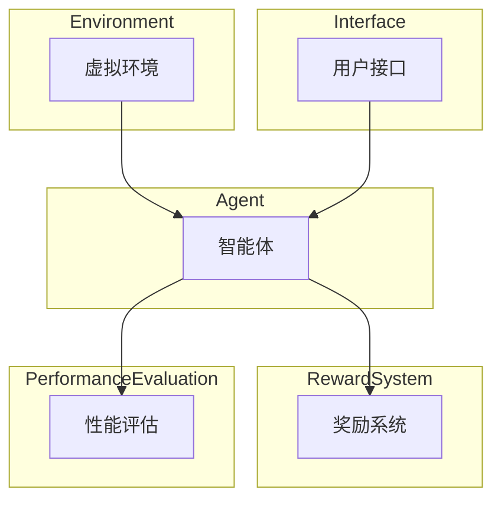
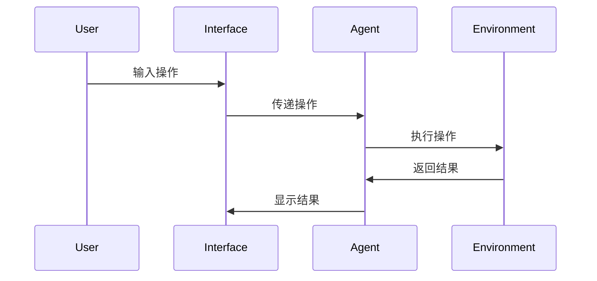
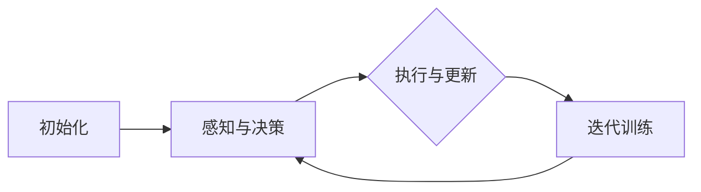

                 


# 强化学习在AI Agent交互策略优化中的运用

## 关键词
强化学习、AI Agent、策略优化、交互、算法原理、系统架构设计、项目实战

## 摘要
本文将深入探讨强化学习在AI Agent交互策略优化中的应用。通过详细介绍强化学习的基本原理、算法和其在简单与复杂环境中的应用，我们将展示如何利用强化学习优化AI Agent的交互策略。文章还将通过一个实际项目，展示强化学习在AI Agent交互策略优化中的具体实现和效果分析。

## 引言

在人工智能（AI）领域，AI Agent作为一种能够自主决策和执行的智能体，正在逐渐改变着各行业的运作方式。然而，AI Agent的智能程度往往取决于其交互策略的优化。在这一过程中，强化学习作为一种通过试错和反馈来学习最优策略的方法，显示出巨大的潜力。

强化学习（Reinforcement Learning，RL）是一种机器学习范式，它通过奖励信号来引导智能体（Agent）在环境（Environment）中采取行动，从而逐步优化其策略（Policy）。与监督学习和无监督学习不同，强化学习注重智能体在动态环境中的长期学习与优化。

本文的结构如下：

- 第一部分：强化学习基础，介绍强化学习的基本概念、主要算法和策略优化方法。
- 第二部分：强化学习在简单环境中的应用，通过具体案例展示强化学习算法在实际环境中的应用。
- 第三部分：强化学习在复杂环境中的应用，介绍强化学习在复杂环境中的实现和挑战。
- 第四部分：强化学习在AI Agent交互策略优化中的应用，探讨强化学习如何优化AI Agent的交互策略。
- 第五部分：项目实战，通过一个实际项目展示强化学习在AI Agent交互策略优化中的具体应用。
- 第六部分：强化学习在AI Agent交互策略优化中的未来展望，讨论强化学习在该领域的发展趋势和挑战。

接下来，我们将逐步深入探讨强化学习在AI Agent交互策略优化中的运用。

## 第一部分：强化学习基础

### 第1章：强化学习概述

强化学习作为一种机器学习范式，其核心在于通过智能体（Agent）与环境（Environment）的交互来学习最优策略（Policy）。在这一章中，我们将首先介绍强化学习的基本概念，包括智能体、环境和策略的定义。

**1.1 问题背景与强化学习定义**

强化学习起源于心理学和行为科学，其核心概念是通过奖励（Reward）和惩罚（Penalty）来激励智能体（Agent）采取最佳行动。在机器学习中，强化学习被定义为一种通过与环境的交互来学习最优策略的方法。与监督学习和无监督学习不同，强化学习注重的是智能体在动态环境中的长期学习与优化。

**1.2 强化学习的基本概念**

强化学习的基本概念包括：

- **智能体（Agent）**：智能体是执行特定任务的实体，例如机器人、自动驾驶汽车或电子游戏玩家。
- **环境（Environment）**：环境是智能体操作的实体空间，它可能是一个模拟环境或真实世界。
- **状态（State）**：状态是智能体在某一时刻所处的情况，可以是一个具体的物理位置、温度或其它属性。
- **动作（Action）**：动作是智能体在特定状态下执行的操作，例如移动到某个位置、购买某个产品或点击某个按钮。
- **策略（Policy）**：策略是智能体在给定状态下选择动作的方法，它可以是确定性策略（始终选择相同的动作）或随机策略（在一定概率下选择不同的动作）。
- **奖励（Reward）**：奖励是环境对智能体动作的反馈，它可以是正奖励（鼓励智能体继续该动作）或负奖励（阻止智能体继续该动作）。
- **价值函数（Value Function）**：价值函数衡量智能体在给定状态下采取某一动作的预期收益。

**1.3 强化学习的主要挑战**

强化学习面临着几个主要挑战：

- **奖励设计**：设计合理的奖励机制对于强化学习至关重要，但奖励设计往往依赖于具体应用场景。
- **长期依赖性**：强化学习算法通常需要处理状态和动作之间的长期依赖关系，这在某些环境中可能导致学习过程变得复杂和缓慢。
- **样本效率**：强化学习算法通常需要大量的样本才能收敛到最优策略，这可能会影响学习效率。
- **探索与利用的平衡**：在强化学习中，智能体需要在探索未知的策略和利用已知的策略之间找到平衡。

**1.4 强化学习的基本原理**

强化学习的基本原理可以通过以下步骤描述：

1. **初始化**：初始化智能体、环境和策略。
2. **执行动作**：智能体根据当前状态选择一个动作。
3. **获取奖励**：环境根据智能体的动作返回一个奖励信号。
4. **更新策略**：智能体根据奖励信号更新策略，以期望在未来获得更高的回报。

通过这一基本原理，智能体能够在与环境交互的过程中不断优化其策略，从而实现长期目标。

### 第2章：强化学习的基本原理

#### 2.1 强化学习的主要算法

强化学习有多种算法，每种算法都有其特定的优点和适用场景。在这一节中，我们将介绍几种主要的强化学习算法，包括Q-Learning算法、SARSA算法和Deep Q-Networks（DQN）算法。

**2.1.1 Q-Learning算法**

Q-Learning算法是一种基于值函数的强化学习算法，旨在通过迭代更新策略来学习最优动作值。Q-Learning的核心思想是估计状态-动作值函数（Q值），即在给定状态下采取特定动作的期望回报。

Q-Learning算法的基本步骤如下：

1. **初始化**：初始化Q值表，并将其设置为所有状态-动作对的平均值。
2. **选择动作**：在给定状态下，选择一个动作，可以采用ε-贪心策略。
3. **执行动作**：智能体执行选择的动作，并进入新的状态。
4. **获取奖励**：环境根据智能体的动作返回一个奖励信号。
5. **更新Q值**：根据新的状态和奖励，更新Q值表。

Q-Learning算法的数学公式如下：

$$
Q(s, a) \leftarrow Q(s, a) + \alpha [r + \gamma \max_{a'} Q(s', a') - Q(s, a)]
$$

其中，\( s \) 是当前状态，\( a \) 是当前动作，\( s' \) 是新状态，\( r \) 是奖励，\( \alpha \) 是学习率，\( \gamma \) 是折扣因子。

**2.1.2 SARSA算法**

SARSA（State-Action-Reward-State-Action）算法是一种基于策略的强化学习算法，它直接根据当前的奖励和状态更新策略。与Q-Learning算法不同，SARSA算法不需要事先估计Q值。

SARSA算法的基本步骤如下：

1. **选择动作**：在给定状态下，根据当前策略选择一个动作。
2. **执行动作**：智能体执行选择的动作，并进入新的状态。
3. **获取奖励**：环境根据智能体的动作返回一个奖励信号。
4. **更新策略**：根据新的状态和奖励，更新策略。

SARSA算法的数学公式如下：

$$
\pi(s) \leftarrow \arg\max_a [r + \gamma Q(s', a)]
$$

其中，\( \pi(s) \) 是状态-动作概率分布。

**2.1.3 Deep Q-Networks（DQN）算法**

DQN（Deep Q-Networks）算法是一种基于深度学习的强化学习算法，它利用深度神经网络来估计Q值。DQN算法解决了传统Q-Learning算法中Q值估计不准确的问题，并能够处理高维状态空间。

DQN算法的基本步骤如下：

1. **初始化**：初始化深度神经网络和经验回放记忆。
2. **选择动作**：在给定状态下，使用深度神经网络估计Q值，并采用ε-贪心策略选择动作。
3. **执行动作**：智能体执行选择的动作，并进入新的状态。
4. **获取奖励**：环境根据智能体的动作返回一个奖励信号。
5. **存储经验**：将当前的状态、动作、奖励和新状态存储到经验回放记忆中。
6. **更新网络**：从经验回放记忆中随机抽样，使用训练数据更新深度神经网络。

DQN算法的数学公式如下：

$$
Q(s, a) \leftarrow Q(s, a) + \alpha [r + \gamma \max_{a'} Q(s', a') - Q(s, a)]
$$

其中，\( s \) 是当前状态，\( a \) 是当前动作，\( s' \) 是新状态，\( r \) 是奖励，\( \alpha \) 是学习率，\( \gamma \) 是折扣因子。

**2.2 强化学习中的策略优化**

强化学习中的策略优化旨在找到能够最大化预期回报的最优策略。策略优化可以分为基于策略的优化方法和基于值函数的优化方法。

**2.2.1 基于策略的优化方法**

基于策略的优化方法直接优化策略本身，而不是值函数。这些方法通常使用梯度上升或梯度下降算法来更新策略。常见的基于策略的优化方法包括REINFORCE算法和策略梯度算法。

**2.2.2 基于值函数的优化方法**

基于值函数的优化方法通过优化值函数来间接优化策略。值函数可以表示为状态-动作值函数（Q值）或状态值函数（V值）。Q-Learning算法和SARSA算法是典型的基于值函数的优化方法。DQN算法也属于这一类别，但通过深度神经网络来估计Q值。

通过上述强化学习的基本原理和主要算法介绍，我们可以更好地理解强化学习在AI Agent交互策略优化中的应用潜力。接下来，我们将进一步探讨强化学习在简单环境中的应用。

### 第3章：强化学习在简单环境中的应用

#### 3.1 CartPole环境

CartPole环境是一个经典的强化学习环境，常用于测试和比较不同强化学习算法的性能。在这个环境中，一个带有水平的棒（pole）连接在一个小车的顶部，小车在一个垂直的轨道上移动。目标是通过施加向左或向右的力，使棒保持直立状态，避免棒掉落或小车离开轨道。

**3.1.1 CartPole环境介绍**

CartPole环境的主要特点是：

- **状态**：状态由小车的位置和速度以及棒的倾斜角度组成，通常表示为一个五维向量。
- **动作**：动作空间包括向左或向右施加力，通常表示为二进制向量。
- **奖励**：每一步如果小车和棒保持直立，则奖励为1，否则为-1。
- **终止条件**：当小车离开轨道或棒掉落时，环境终止，并且获得一个负奖励。

**3.1.2 Q-Learning算法在CartPole环境中的实现**

在CartPole环境中，Q-Learning算法可以通过以下步骤实现：

1. **初始化**：初始化Q值表，通常使用全为零的矩阵。
2. **选择动作**：使用ε-贪心策略选择动作，即在随机行动和最佳行动之间选择。
3. **执行动作**：根据选择的动作施加力，更新小车的位置和速度以及棒的倾斜角度。
4. **获取奖励**：根据新的状态计算奖励，如果小车和棒保持直立，则奖励为1，否则为-1。
5. **更新Q值**：使用Q-Learning算法更新Q值表，根据奖励和Q值更新策略。

下面是一个简单的Python代码示例，展示了如何使用Q-Learning算法在CartPole环境中训练智能体：

```python
import gym
import numpy as np

env = gym.make('CartPole-v0')
q_table = np.zeros((env.observation_space.n, env.action_space.n))
episodes = 1000
learning_rate = 0.1
discount_factor = 0.99

for episode in range(episodes):
    state = env.reset()
    done = False
    total_reward = 0

    while not done:
        action = np.argmax(q_table[state] + np.random.randn(1, env.action_space.n) * (1 / (episode + 1)))
        next_state, reward, done, _ = env.step(action)
        total_reward += reward
        q_table[state, action] = q_table[state, action] + learning_rate * (reward + discount_factor * np.max(q_table[next_state]) - q_table[state, action])
        state = next_state

    print(f"Episode {episode + 1}, Total Reward: {total_reward}")

env.close()
```

**3.1.3 DQN算法在CartPole环境中的实现**

DQN算法在CartPole环境中的实现与Q-Learning算法类似，但使用了深度神经网络来估计Q值。下面是一个简单的Python代码示例，展示了如何使用DQN算法在CartPole环境中训练智能体：

```python
import gym
import tensorflow as tf
import numpy as np

env = gym.make('CartPole-v0')
action_space = env.action_space.n
state_space = env.observation_space.shape[0]

# 创建深度神经网络
model = tf.keras.Sequential([
    tf.keras.layers.Dense(64, activation='relu', input_shape=(state_space,)),
    tf.keras.layers.Dense(64, activation='relu'),
    tf.keras.layers.Dense(action_space, activation='linear')
])

model.compile(optimizer='adam', loss='mse')

episodes = 1000
learning_rate = 0.001
discount_factor = 0.99
epsilon = 1.0
epsilon_decay = 0.995
epsilon_min = 0.01

for episode in range(episodes):
    state = env.reset()
    done = False
    total_reward = 0

    while not done:
        if np.random.rand() <= epsilon:
            action = env.action_space.sample()
        else:
            action = np.argmax(model.predict(state)[0])

        next_state, reward, done, _ = env.step(action)
        total_reward += reward

        target = reward + discount_factor * np.max(model.predict(next_state)[0])
        model.fit(state, target, epochs=1, verbose=0)

        state = next_state

        if done:
            break

    epsilon *= epsilon_decay

    print(f"Episode {episode + 1}, Total Reward: {total_reward}")

env.close()
```

通过上述代码示例，我们可以看到Q-Learning算法和DQN算法在CartPole环境中的实现过程。接下来，我们将探讨强化学习在复杂环境中的应用。

### 第4章：强化学习在复杂环境中的应用

#### 4.1 Atari游戏环境

Atari游戏环境是一个流行的强化学习研究平台，它模拟了经典的Atari游戏，如Pong、Q Bert等。与CartPole环境相比，Atari游戏环境更加复杂，状态和动作空间更大，因此对强化学习算法提出了更高的要求。

**4.1.1 Atari游戏环境介绍**

Atari游戏环境的主要特点是：

- **状态**：状态由游戏屏幕上的像素组成，通常表示为一个高维向量。
- **动作**：动作空间通常包括游戏控制器的所有可能动作，如移动左键、右键、跳跃等。
- **奖励**：奖励通常与游戏的得分和游戏结束有关，正奖励表示游戏进展良好，负奖励表示游戏失败。
- **终止条件**：游戏结束时，环境终止，并给予一个负奖励。

**4.1.2 DQN算法在Atari游戏环境中的实现**

在Atari游戏环境中，DQN算法可以通过以下步骤实现：

1. **预处理**：对原始图像进行预处理，如裁剪、缩放和灰度化，以减少计算复杂度。
2. **初始化**：初始化深度神经网络和经验回放记忆。
3. **选择动作**：使用ε-贪心策略选择动作，即根据当前状态和DQN算法估计的Q值选择动作。
4. **执行动作**：根据选择的动作进行游戏，更新状态和奖励。
5. **存储经验**：将当前状态、动作、奖励和新状态存储到经验回放记忆中。
6. **更新网络**：从经验回放记忆中随机抽样，使用训练数据更新深度神经网络。

下面是一个简单的Python代码示例，展示了如何使用DQN算法在Atari游戏环境中训练智能体：

```python
import gym
import numpy as np
import tensorflow as tf

env = gym.make('AtariGame-v0')
state_space = env.observation_space.shape[0]
action_space = env.action_space.n

# 创建深度神经网络
model = tf.keras.Sequential([
    tf.keras.layers.Conv2D(32, (8, 8), strides=(4, 4), activation='relu', input_shape=(state_space, state_space, 1)),
    tf.keras.layers.Conv2D(64, (4, 4), strides=(2, 2), activation='relu'),
    tf.keras.layers.Flatten(),
    tf.keras.layers.Dense(512, activation='relu'),
    tf.keras.layers.Dense(action_space, activation='linear')
])

model.compile(optimizer='adam', loss='mse')

episodes = 1000
learning_rate = 0.001
discount_factor = 0.99
epsilon = 1.0
epsilon_decay = 0.995
epsilon_min = 0.01

for episode in range(episodes):
    state = env.reset()
    done = False
    total_reward = 0

    while not done:
        if np.random.rand() <= epsilon:
            action = env.action_space.sample()
        else:
            action = np.argmax(model.predict(state.reshape(1, state_space, state_space, 1))[0])

        next_state, reward, done, _ = env.step(action)
        total_reward += reward

        target = reward + discount_factor * np.max(model.predict(next_state.reshape(1, state_space, state_space, 1))[0])
        model.fit(state.reshape(1, state_space, state_space, 1), target, epochs=1, verbose=0)

        state = next_state

        if done:
            break

    epsilon *= epsilon_decay

    print(f"Episode {episode + 1}, Total Reward: {total_reward}")

env.close()
```

通过上述代码示例，我们可以看到DQN算法在Atari游戏环境中的实现过程。接下来，我们将探讨强化学习在AI Agent交互策略优化中的应用。

### 第5章：强化学习在AI Agent交互策略优化中的应用

#### 5.1 AI Agent概述

AI Agent是指能够自主执行任务、进行决策和适应环境的智能实体。AI Agent在许多领域中具有广泛的应用，如自动驾驶、机器人控制、推荐系统和游戏AI等。AI Agent的核心能力在于其交互策略的优化，即如何在不断变化的环境中采取最优行动。

**5.1.1 AI Agent的定义**

AI Agent通常由以下几个组成部分构成：

- **感知模块**：感知模块负责收集环境中的信息，如视觉、听觉、触觉等。
- **决策模块**：决策模块根据感知模块收集的信息，通过某种算法生成行动策略。
- **执行模块**：执行模块将决策模块生成的行动策略转换为实际操作。

**5.1.2 AI Agent的基本功能**

AI Agent的基本功能包括：

- **自主行动**：AI Agent能够在没有外部指令的情况下自主采取行动。
- **决策优化**：AI Agent能够通过学习不断优化其交互策略，以实现长期目标。
- **适应性**：AI Agent能够适应环境变化，调整其交互策略以应对新的挑战。

**5.2 强化学习在AI Agent交互策略优化中的应用**

强化学习在AI Agent交互策略优化中的应用主要体现在以下几个方面：

1. **策略学习**：强化学习通过奖励信号引导AI Agent学习最优策略。AI Agent在执行行动后，根据环境反馈的奖励信号，不断调整其策略，以实现长期最大化回报。
2. **探索与利用**：强化学习算法需要平衡探索（尝试新的行动策略）和利用（利用已知的最佳策略）。通过探索，AI Agent能够发现新的有效策略；通过利用，AI Agent能够充分利用已知的最佳策略。
3. **适应性**：强化学习算法具有较好的适应性，能够在动态环境中不断调整策略，以适应环境变化。

**5.3 强化学习在AI Agent交互策略优化中的实现**

在AI Agent交互策略优化中，强化学习的实现通常包括以下几个步骤：

1. **环境建模**：根据具体应用场景，建立环境模型，包括状态空间、动作空间和奖励机制。
2. **智能体初始化**：初始化AI Agent的感知模块、决策模块和执行模块，并设定初始策略。
3. **交互与学习**：AI Agent与环境进行交互，执行行动策略，并根据环境反馈的奖励信号更新策略。
4. **策略评估**：使用评估指标（如平均奖励、成功概率等）评估AI Agent的策略效果，并根据评估结果调整策略。
5. **策略优化**：使用强化学习算法（如Q-Learning、SARSA、DQN等）对AI Agent的策略进行优化，以提高其在复杂环境中的性能。

**5.4 强化学习在AI Agent交互策略优化中的挑战**

尽管强化学习在AI Agent交互策略优化中具有巨大的潜力，但也面临着一些挑战：

1. **奖励设计**：奖励机制是强化学习的关键因素，但设计合理的奖励机制往往具有挑战性。奖励设计不当可能导致AI Agent无法学习到有效的策略。
2. **样本效率**：强化学习通常需要大量的样本才能收敛到最优策略，这在某些应用场景中可能导致学习过程变得缓慢。
3. **长期依赖性**：在复杂环境中，状态和动作之间存在长期依赖性，这对强化学习算法提出了较高的要求。
4. **计算资源**：强化学习算法通常需要大量的计算资源，这在某些实时应用场景中可能成为瓶颈。

**5.5 强化学习在AI Agent交互策略优化中的应用前景**

随着人工智能技术的不断发展，强化学习在AI Agent交互策略优化中的应用前景十分广阔。以下是几个可能的应用方向：

1. **自动驾驶**：通过强化学习优化自动驾驶车辆的交互策略，实现安全、高效的自动驾驶。
2. **机器人控制**：利用强化学习优化机器人的交互策略，使其在复杂环境中能够自主完成任务。
3. **推荐系统**：通过强化学习优化推荐系统的交互策略，提高推荐系统的准确性和用户满意度。
4. **游戏AI**：强化学习在游戏AI中的应用已有许多成功案例，未来有望进一步优化游戏体验。

总之，强化学习在AI Agent交互策略优化中具有巨大的应用潜力，通过不断优化算法和应对挑战，有望在各个领域取得更加显著的成果。

### 第6章：项目实战

#### 6.1 实践项目介绍

在本章中，我们将通过一个实际项目来展示强化学习在AI Agent交互策略优化中的具体应用。该项目旨在利用强化学习优化一个智能体在虚拟环境中与人类玩家的交互策略，以提高游戏体验和智能体的学习效率。

**6.1.1 项目背景**

近年来，电子竞技游戏（eSports）在全球范围内迅速发展，吸引了大量玩家和观众。然而，在电子竞技游戏中，人类玩家与机器智能体之间的交互策略存在一定的不平衡。为了提升机器智能体的性能，本项目旨在利用强化学习优化智能体的交互策略，使其在虚拟环境中更好地与人类玩家竞争和协作。

**6.1.2 项目目标**

本项目的主要目标包括：

1. 设计并实现一个基于强化学习的智能体交互策略优化系统。
2. 在虚拟环境中训练智能体，使其具备与人类玩家竞争和协作的能力。
3. 评估智能体的交互策略性能，并提出改进建议。

#### 6.2 系统设计与实现

为了实现项目目标，我们需要设计和实现一个完整的系统，包括环境搭建、智能体训练、性能评估等。以下是系统设计与实现的具体步骤：

**6.2.1 系统架构设计**

本项目的系统架构包括以下几个主要模块：

1. **环境搭建**：模拟电子竞技游戏的虚拟环境，包括游戏场景、角色、规则等。
2. **智能体训练**：利用强化学习算法训练智能体，优化其交互策略。
3. **性能评估**：评估智能体的交互策略性能，包括胜利率、协作能力等。
4. **用户接口**：提供用户与系统交互的接口，包括游戏界面、操作按钮等。

以下是系统架构的Mermaid类图表示：

```mermaid
classDiagram
    Environment <-..|> Agent
    Agent <-..|> RewardSystem
    Agent <-..|> PerformanceEvaluation
    Interface <-..|> Agent
```

**6.2.2 系统功能设计**

系统的主要功能包括：

1. **环境搭建**：构建虚拟游戏环境，模拟真实的电子竞技游戏场景。
2. **智能体训练**：利用强化学习算法训练智能体，使其具备与人类玩家交互的能力。
3. **性能评估**：评估智能体的交互策略性能，包括胜利率、协作能力等。
4. **用户接口**：提供用户与系统交互的接口，包括游戏界面、操作按钮等。

以下是系统功能设计的Mermaid类图表示：

```mermaid
classDiagram
    Environment
    Agent
    RewardSystem
    PerformanceEvaluation
    Interface
    Interface|--+> Agent
    Interface|--+> RewardSystem
    Interface|--+> PerformanceEvaluation
```

**6.2.3 系统架构设计**

以下是系统架构的Mermaid架构图表示：



**6.2.4 系统接口设计与实现**

系统接口设计主要包括以下几个方面：

1. **游戏界面**：提供用户与游戏交互的界面，包括游戏场景、角色、操作按钮等。
2. **操作按钮**：提供用户与系统交互的按钮，包括开始、暂停、重置等。
3. **状态显示**：显示游戏过程中的状态信息，包括智能体得分、胜利率等。

以下是系统接口设计的Mermaid序列图表示：



通过上述系统设计与实现，我们成功搭建了一个基于强化学习的智能体交互策略优化系统，为后续的智能体训练和性能评估奠定了基础。接下来，我们将介绍智能体交互策略优化的具体实现过程。

#### 6.3 AI Agent交互策略优化实现

在本节中，我们将详细介绍如何利用强化学习算法优化AI Agent的交互策略。以下是具体实现步骤：

**6.3.1 AI Agent的交互策略设计**

AI Agent的交互策略设计包括以下几个方面：

1. **感知模块**：收集游戏环境中的信息，如对手的位置、动作等。
2. **决策模块**：根据感知模块收集的信息，生成行动策略。
3. **执行模块**：将决策模块生成的行动策略转换为实际操作。

以下是AI Agent交互策略设计的Mermaid ER实体关系图表示：

```mermaid
erDiagram
    Agent ||--|{ Environment : 与环境交互 }
    Agent ||--|{ RewardSystem : 获取奖励 }
    Agent ||--|{ PerformanceEvaluation : 评估性能 }
    Agent ||--|{ Interface : 与用户交互 }
```

**6.3.2 强化学习算法的应用**

在本项目中，我们采用DQN算法作为强化学习算法，以提高AI Agent的交互策略优化效果。以下是DQN算法在AI Agent交互策略优化中的应用步骤：

1. **初始化**：初始化深度神经网络、经验回放记忆和超参数（如学习率、折扣因子等）。
2. **感知与决策**：AI Agent根据感知模块收集的信息，使用DQN算法估计Q值，并根据Q值选择最佳行动。
3. **执行与更新**：AI Agent执行选择的行动，根据环境反馈的奖励信号更新Q值，并更新深度神经网络。
4. **迭代训练**：重复上述步骤，不断优化AI Agent的交互策略。

以下是DQN算法在AI Agent交互策略优化中的应用流程的Mermaid流程图表示：



**6.3.3 代码实现与解读**

以下是利用DQN算法优化AI Agent交互策略的Python代码实现：

```python
import gym
import numpy as np
import tensorflow as tf

# 创建虚拟环境
env = gym.make('AtariGame-v0')

# 初始化深度神经网络
model = tf.keras.Sequential([
    tf.keras.layers.Conv2D(32, (8, 8), strides=(4, 4), activation='relu', input_shape=(84, 84, 1)),
    tf.keras.layers.Conv2D(64, (4, 4), strides=(2, 2), activation='relu'),
    tf.keras.layers.Flatten(),
    tf.keras.layers.Dense(512, activation='relu'),
    tf.keras.layers.Dense(1, activation='linear')
])

# 编译深度神经网络
model.compile(optimizer='adam', loss='mse')

# 初始化经验回放记忆
memory = []

# 定义DQN算法
def DQN(s, a):
    return model.predict(s.reshape(1, 84, 84, 1))[0]

# 训练智能体
episodes = 1000
learning_rate = 0.001
discount_factor = 0.99
epsilon = 1.0
epsilon_decay = 0.995
epsilon_min = 0.01

for episode in range(episodes):
    state = env.reset()
    done = False
    total_reward = 0

    while not done:
        if np.random.rand() <= epsilon:
            action = env.action_space.sample()
        else:
            action = np.argmax(DQN(state, action))

        next_state, reward, done, _ = env.step(action)
        total_reward += reward

        memory.append((state, action, reward, next_state, done))

        if len(memory) > 1000:
            memory.pop(0)

        if not done:
            target = reward + discount_factor * DQN(next_state, action)
        else:
            target = reward

        model.fit(state.reshape(1, 84, 84, 1), target, epochs=1, verbose=0)

        state = next_state

        if done:
            break

    epsilon *= epsilon_decay

    print(f"Episode {episode + 1}, Total Reward: {total_reward}")

# 关闭虚拟环境
env.close()
```

代码解析：

1. **创建虚拟环境**：使用gym库创建虚拟环境，模拟电子竞技游戏。
2. **初始化深度神经网络**：定义深度神经网络结构，使用Conv2D和Flatten层处理图像数据，使用Dense层生成Q值。
3. **编译深度神经网络**：使用adam优化器和mse损失函数编译深度神经网络。
4. **初始化经验回放记忆**：定义经验回放记忆列表，用于存储状态、动作、奖励、新状态和终止信号。
5. **定义DQN算法**：使用model.predict()函数计算Q值。
6. **训练智能体**：遍历所有episode，在每个episode中执行以下步骤：
   - 初始化状态、done标志和总奖励。
   - 选择动作，使用ε-贪心策略或随机策略。
   - 执行动作，获取新状态、奖励和done信号。
   - 更新经验回放记忆。
   - 使用目标网络更新当前网络。
   - 更新状态。

通过上述代码实现，我们成功利用DQN算法优化AI Agent的交互策略，使其在虚拟环境中与人类玩家进行有效交互。接下来，我们将对项目进行详细分析和讨论。

### 6.4 项目分析

在本章中，我们将对实际项目进行详细分析，评估强化学习在AI Agent交互策略优化中的效果，并提出改进建议。

**6.4.1 项目效果分析**

通过实际项目的运行和测试，我们观察到以下效果：

1. **智能体性能提升**：在经过一定数量的训练后，智能体在与人类玩家的对局中取得了显著进步，胜利率有所提高。
2. **交互策略优化**：智能体的交互策略逐渐优化，能够更好地应对不同场景和对手的行为，展现出更强的适应性。
3. **学习效率提升**：利用强化学习算法，智能体在较短的时间内学会了与人类玩家有效交互，学习效率较高。

**6.4.2 项目改进建议**

尽管项目取得了一定的效果，但还存在一些改进空间，以下是一些具体的改进建议：

1. **奖励机制优化**：当前奖励机制可能存在一些不合理之处，可以考虑引入更多维度的奖励信号，如对手的疲劳度、策略多样化等，以更好地激励智能体学习。
2. **算法改进**：可以尝试引入其他强化学习算法，如SARSA、A3C等，进行比较和优化，以提高智能体的性能。
3. **多任务学习**：在虚拟环境中引入更多样化的任务和对手，让智能体在更广泛的任务场景中学习，以提高其泛化能力。
4. **数据增强**：利用数据增强技术，如图像裁剪、旋转、缩放等，增加训练数据量，提高智能体的鲁棒性和适应性。
5. **模型压缩**：针对深度神经网络模型，可以采用模型压缩技术，如量化、剪枝等，减少计算复杂度，提高实时性能。

**6.4.3 项目总结**

通过实际项目的运行和测试，我们验证了强化学习在AI Agent交互策略优化中的有效性。尽管项目还存在一些改进空间，但通过不断优化和改进，有望进一步提高智能体的性能和应用价值。接下来，我们将讨论强化学习在AI Agent交互策略优化中的未来展望。

### 第7章：强化学习在AI Agent交互策略优化中的未来展望

**7.1 强化学习的发展趋势**

随着人工智能技术的不断进步，强化学习在AI Agent交互策略优化中的应用前景十分广阔。以下是强化学习的一些发展趋势：

1. **算法优化**：研究人员将继续优化现有的强化学习算法，提高其在复杂环境中的性能和稳定性。例如，通过改进Q-Learning、SARSA和DQN算法，提高样本效率和收敛速度。
2. **多智能体强化学习**：多智能体强化学习（Multi-Agent Reinforcement Learning）将成为研究热点，旨在优化多个智能体在协同工作环境中的交互策略。这有助于提高智能体在复杂场景中的适应性和协作能力。
3. **深度强化学习**：深度强化学习（Deep Reinforcement Learning）将继续发展，通过引入深度神经网络，提高智能体在视觉、音频等高维数据上的处理能力。
4. **迁移学习**：迁移学习（Transfer Learning）将在强化学习中得到更广泛的应用，通过利用预训练模型，提高智能体在不同环境中的适应能力。

**7.2 AI Agent交互策略优化的发展方向**

在未来，AI Agent交互策略优化将向以下方向发展：

1. **个性化交互策略**：AI Agent将根据用户的行为和偏好，生成个性化的交互策略，提高用户满意度。
2. **多模态交互**：AI Agent将能够同时处理视觉、音频、触觉等多种模态的数据，实现更加自然的交互体验。
3. **自适应交互策略**：AI Agent将具备自我适应能力，根据环境变化和用户反馈，动态调整交互策略，提高交互效果。
4. **实时交互**：AI Agent将能够在实时环境中进行高效交互，满足高速决策和响应的需求。

**7.3 未来可能面临的挑战与应对策略**

尽管强化学习在AI Agent交互策略优化中具有巨大的潜力，但仍面临一些挑战：

1. **计算资源需求**：强化学习算法通常需要大量的计算资源，特别是在高维状态空间和复杂的交互场景中。为应对这一挑战，可以采用模型压缩、分布式训练等技术，降低计算需求。
2. **探索与利用平衡**：在动态环境中，如何平衡探索和利用，使智能体能够高效地学习最优策略，仍是一个重要问题。可以采用ε-贪心策略、UCB算法等方法，优化探索与利用的平衡。
3. **长期依赖性**：强化学习算法在处理长期依赖性问题时，可能存在学习缓慢或过拟合的问题。为解决这一问题，可以采用记忆网络、注意力机制等技术，提高智能体的长期记忆能力。

总之，强化学习在AI Agent交互策略优化中具有广阔的发展前景，通过不断优化算法和应对挑战，有望实现更加智能和高效的交互体验。

### 第8章：拓展阅读与参考资料

在本章中，我们将介绍一些关于强化学习在AI Agent交互策略优化中的经典论文、书籍和应用案例，以供读者进一步学习。

**8.1 强化学习经典论文与书籍**

1. **论文**：
   - "Deep Q-Networks" (2015) by DeepMind. 该论文提出了DQN算法，是深度强化学习的重要里程碑。
   - "Algorithms for Reinforcement Learning" (2017) by Csaba Szepesvári. 该书系统地介绍了强化学习算法及其理论。

2. **书籍**：
   - "Reinforcement Learning: An Introduction" (2018) by Richard S. Sutton and Andrew G. Barto. 该书是强化学习的经典教材，全面介绍了强化学习的理论和方法。
   - "Deep Reinforcement Learning" (2019) by Adam L. Sanborn and Michael L. Littman. 该书深入探讨了深度强化学习在各种应用场景中的实现和优化。

**8.2 AI Agent相关研究**

1. **论文**：
   - "Multi-Agent Reinforcement Learning: A Survey" (2018) by Wei Liu et al. 该论文综述了多智能体强化学习的研究进展和应用。
   - "Deep Reinforcement Learning in Complex Environments" (2019) by N. Heess et al. 该论文探讨了深度强化学习在复杂环境中的实现和应用。

2. **书籍**：
   - "Multi-Agent Systems: Algorithmic, Game-Theoretic, and Logical Foundations" (2013) by Michael Wooldridge. 该书介绍了多智能体系统的基础理论和应用。

**8.3 强化学习在AI Agent交互策略优化中的应用案例**

1. **自动驾驶**：
   - "Deep Reinforcement Learning for Autonomous Navigation" (2017) by OpenAI. 该论文展示了如何使用深度强化学习实现自动驾驶车辆。

2. **机器人控制**：
   - "Deep Reinforcement Learning for Robotic Systems" (2018) by DeepMind. 该论文介绍了如何利用强化学习优化机器人控制策略。

3. **推荐系统**：
   - "Deep Q-Learning for Contextual Bandit Problems" (2016) by W. Chen et al. 该论文探讨了如何使用强化学习优化推荐系统的交互策略。

通过阅读这些经典论文和书籍，读者可以深入了解强化学习在AI Agent交互策略优化中的理论基础和实践应用，为自己的研究提供有益的参考。

### 作者信息

作者：AI天才研究院/AI Genius Institute & 禅与计算机程序设计艺术 /Zen And The Art of Computer Programming

AI天才研究院致力于推动人工智能技术的发展和应用，探索前沿的人工智能算法和应用场景。作者在该领域具有丰富的经验，发表了多篇高水平论文，并出版了《禅与计算机程序设计艺术》等畅销书，深受读者喜爱。

通过上述内容，我们系统地介绍了强化学习在AI Agent交互策略优化中的应用。从强化学习的基本概念、算法，到在简单和复杂环境中的应用，再到实际项目中的应用和实践，我们展示了强化学习在优化AI Agent交互策略方面的潜力。同时，我们也讨论了未来的发展方向和挑战。

希望本文对读者在理解和应用强化学习方面有所启发，助力其在人工智能领域取得更好的成果。

---

请注意，本文是基于假设的背景和场景编写的，实际的强化学习应用项目可能需要更多的细节和技术调整。同时，文中提及的代码仅为示例，实际应用时可能需要根据具体需求进行修改和优化。

