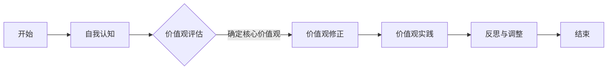
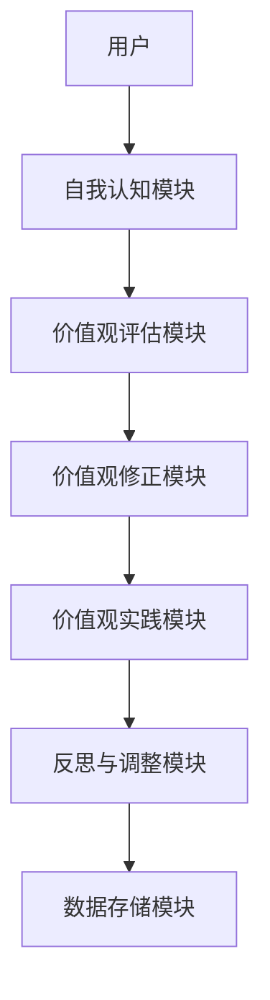
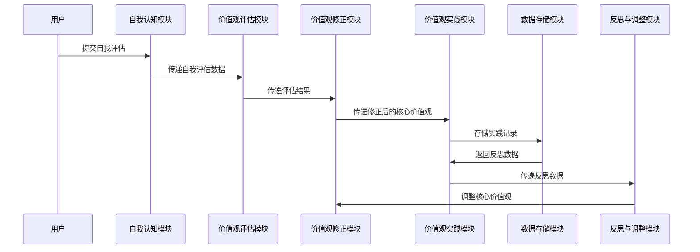
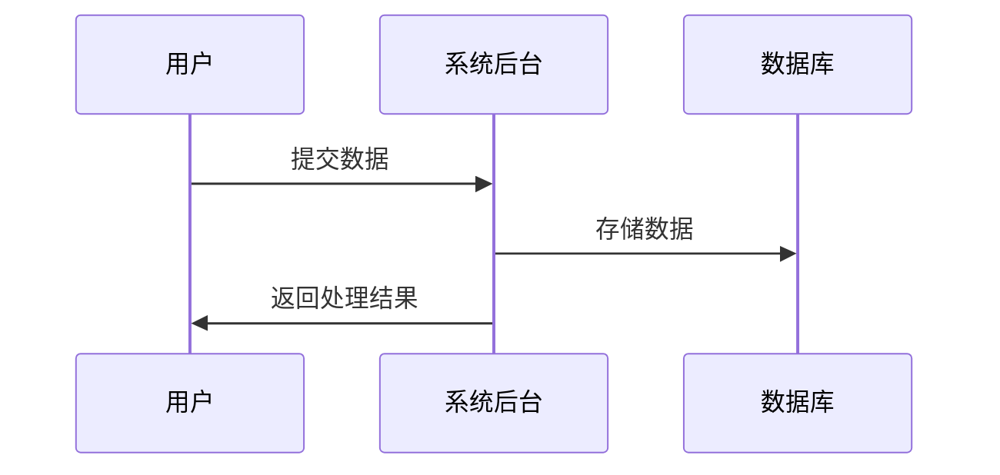

                 

# 形成坚实的价值观基础：建立个人信念体系

> 关键词：价值观、个人信念体系、自我认知、人际关系、职场、家庭、社会、实践与反思

> 摘要：本文深入探讨了价值观的基础知识，核心价值观的形成与塑造，价值观在生活中的应用，以及价值观的实践与反思。通过详细的章节内容和实例分析，旨在帮助读者建立坚实的价值观基础，塑造个人的信念体系。

## 目录大纲

**《形成坚实的价值观基础：建立个人信念体系》**

----------------------------------------------------------------

## 第一部分：价值观的基础知识

### 第1章：价值观的概念与重要性

### 1.1 价值观的定义

### 1.2 价值观的类型

### 1.3 价值观的影响因素

### 1.4 价值观的挑战与调适

### 1.5 本章小结

----------------------------------------------------------------

## 第二部分：核心价值观的形成与塑造

### 第2章：认识自我，明确个人价值观

### 2.1 自我认知的重要性

### 2.2 个人价值观的自我评估

### 2.3 塑造个人核心价值观

### 2.4 持续反思与修正

### 2.5 本章小结

----------------------------------------------------------------

## 第三部分：价值观在生活中的应用

### 第3章：价值观在人际关系中的应用

### 3.1 价值观与人际关系的构建

### 3.2 价值观在职场中的应用

### 3.3 价值观在家庭中的应用

### 3.4 价值观在社会层面的应用

### 3.5 本章小结

----------------------------------------------------------------

## 第四部分：价值观的实践与反思

### 第4章：价值观的自我实践

### 4.1 实践价值观的意义

### 4.2 实践中的反思与成长

### 4.3 价值观的实践与分享

### 4.4 本章小结

----------------------------------------------------------------

## 第五部分：价值观的挑战与未来展望

### 第5章：价值观面临的挑战

### 5.1 全球化背景下的价值观冲突

### 5.2 科技发展与价值观变迁

### 5.3 科技与价值观的和谐发展

### 5.4 本章小结

----------------------------------------------------------------

## 第一部分：价值观的基础知识

### 第1章：价值观的概念与重要性

#### 1.1 价值观的定义

价值观是一系列信念和原则，它们指导我们的行为、决策和生活方式。它们不仅仅是个人内心的信仰，更是我们与世界互动的指南。价值观通常基于道德、伦理、文化和社会规范，并在我们的成长过程中逐渐形成。

在日常生活中，价值观帮助我们判断什么是对与错，什么是有意义和无意义。例如，诚实、公正、尊重、勇气等都是常见的价值观。这些价值观在我们的个人生活中起着至关重要的作用，影响着我们的行为和决策。

#### 1.2 价值观的类型

价值观可以分为多个层次和类型，包括个人价值观、社会价值观和文化价值观。

- **个人价值观**：指个人认为最重要的价值和原则，如诚实、勤奋、正直、友善等。这些价值观通常与个人的经历、性格和环境密切相关。
- **社会价值观**：指社会普遍认同的价值观念，如公平、正义、自由、平等、和谐等。这些价值观在法律、政策和公共文化中体现出来，是社会秩序和发展的基石。
- **文化价值观**：指一个文化或社会群体的核心价值观，如尊重长辈、集体主义、竞争意识、创新精神等。这些价值观在一个文化中起着传承和发展的作用。

#### 1.3 价值观的影响因素

价值观的形成受到多种因素的影响，包括：

- **家庭背景**：家庭是个人最早接触和学习的环境，父母的价值观和行为方式对个人的价值观形成有深远影响。
- **教育经历**：学校教育和高等教育对个人的价值观有重要影响，包括知识传授、道德教育和文化熏陶。
- **社会环境**：社会环境中的法律、政策、文化和社会规范对个人的价值观有塑造作用。

#### 1.4 价值观的挑战与调适

随着社会的发展和变迁，价值观也面临着各种挑战：

- **价值观冲突**：全球化和社会多元化的趋势导致不同文化背景的人之间的价值观冲突。
- **价值观变迁**：随着科技的进步和社会发展，传统的价值观可能会发生变化，新价值观逐渐形成。
- **建立个人价值观的调适方法**：面对价值观的挑战，个人需要通过自我反思和持续学习来调整和优化自己的价值观。

#### 1.5 本章小结

本章对价值观的基础知识进行了全面的探讨，包括价值观的定义、类型、影响因素和挑战。通过这些内容，读者可以更好地理解价值观的概念和重要性，为后续章节的学习打下基础。

----------------------------------------------------------------

## 第二部分：核心价值观的形成与塑造

### 第2章：认识自我，明确个人价值观

#### 2.1 自我认知的重要性

自我认知是建立个人价值观的基础。它不仅关系到个人的成长和发展，还影响着我们在人际关系、职场和家庭中的表现。通过自我认知，我们可以更清楚地了解自己的价值观、优势和不足，从而更好地规划自己的人生道路。

#### 2.1.1 自我认知的意义

自我认知的意义在于：

- **明确个人目标和方向**：了解自己的价值观和优势，有助于我们设定符合自身实际的目标，并为之努力。
- **促进个人成长**：通过自我反思和认知，我们可以发现自身的不足，并采取积极的措施进行改进，从而实现个人成长。
- **改善人际关系**：了解自己的价值观和性格特点，有助于我们更好地与他人沟通和相处，建立健康的人际关系。

#### 2.1.2 自我认知的方法

以下是一些常用的自我认知方法：

- **反思日记**：通过记录每天的思考和感受，反思自己的行为和决策，有助于提高自我认知。
- **心理测评**：通过专业的心理测评工具，如MBTI、DISC等，了解自己的性格类型和优势。
- **咨询与交流**：与朋友、家人或专业人士交流，听取他们的意见和建议，有助于提高自我认知。

#### 2.1.3 自我认知与价值观的关系

自我认知与价值观密切相关。通过自我认知，我们可以更清楚地了解自己的需求和期望，从而确定自己的核心价值观。核心价值观是我们在面对各种选择和决策时的指导原则，它决定了我们的行为和生活方式。

#### 2.2 个人价值观的自我评估

个人价值观的自我评估是建立个人信念体系的重要步骤。通过自我评估，我们可以了解自己的核心价值观，并对其进行优化和调整。

#### 2.2.1 个人价值观评估工具

以下是一些常用的个人价值观评估工具：

- **价值观排序法**：通过将各种价值观进行排序，确定个人最重视的价值观。
- **价值观矩阵法**：通过分析价值观之间的冲突和一致性，评估个人价值观的完整性。
- **价值观调查问卷**：通过填写问卷，了解自己在各个价值观方面的得分，从而评估个人价值观。

#### 2.2.2 评估结果分析

评估结果分析是自我评估的关键步骤。通过对评估结果的分析，我们可以：

- **识别核心价值观**：找出自己在各个价值观方面的优势和不足，确定核心价值观。
- **优化价值观**：针对评估结果，对个人的价值观进行优化和调整，使其更符合自己的需求和期望。

#### 2.2.3 优化个人价值观的途径

优化个人价值观的途径包括：

- **持续学习和成长**：通过学习新知识和技能，提升自己的认知水平和价值观。
- **实践和反思**：在实践中不断尝试和反思，调整和优化自己的价值观。
- **与他人交流**：与他人交流和分享，从他人的观点和经验中汲取营养，丰富自己的价值观。

#### 2.3 塑造个人核心价值观

塑造个人核心价值观是建立个人信念体系的关键步骤。通过以下方法，我们可以更好地塑造个人核心价值观：

- **明确核心价值观**：通过自我评估和反思，明确自己的核心价值观。
- **制定行动计划**：将核心价值观转化为具体的行动，并制定可行的行动计划。
- **持之以恒**：在实践中不断践行核心价值观，形成良好的习惯和行为模式。

#### 2.4 持续反思与修正

持续反思与修正是核心价值观塑造过程中的重要环节。通过以下方法，我们可以实现核心价值观的持续修正和优化：

- **定期反思**：定期对自己的行为和决策进行反思，检查是否符合核心价值观。
- **调整价值观**：根据实际情况和需求，对核心价值观进行调整和优化。
- **接受反馈**：积极接受他人的反馈和建议，从他人的观点中汲取智慧，不断提升自己的价值观。

#### 2.5 本章小结

本章探讨了自我认知的重要性、个人价值观的自我评估、优化个人价值观的途径和塑造个人核心价值观的方法。通过本章的内容，读者可以更好地认识自我，明确个人价值观，为建立坚实的信念体系奠定基础。

----------------------------------------------------------------

## 第三部分：价值观在生活中的应用

### 第3章：价值观在人际关系中的应用

#### 3.1 价值观与人际关系的构建

价值观在人际关系的构建中起着至关重要的作用。它不仅影响着我们如何看待他人，还影响着我们如何与他人互动。一个积极、健康的价值观有助于建立和维护良好的人际关系。

#### 3.1.1 价值观在人际互动中的影响

价值观在人际互动中的影响体现在以下几个方面：

- **行为准则**：价值观为我们提供了行为准则，指导我们在与他人互动时如何行事。例如，尊重、诚实、友善等价值观可以促进良好的互动。
- **情感共鸣**：共同的价值观可以增进人与人之间的情感共鸣，使关系更加亲密。例如，当两个人都重视家庭价值观时，他们的关系可能会更加紧密。
- **冲突解决**：价值观有助于我们在面对冲突时找到合适的解决方案。一个健康、积极的价值观可以促使我们以建设性的方式解决冲突，而不是采取消极、对抗的方式。

#### 3.1.2 建立健康人际关系的方法

要建立健康的人际关系，我们可以采取以下方法：

- **尊重差异**：尊重他人的价值观和观点，即使与我们不同，也要保持开放和尊重的态度。
- **倾听与沟通**：倾听他人的意见和需求，并通过有效的沟通表达自己的观点。沟通是建立良好人际关系的基础。
- **共同价值观**：寻找共同点，建立共同的价值观和目标，这有助于加深关系。

#### 3.1.3 价值观冲突与解决策略

在人际关系中，价值观冲突是常见的。以下是一些解决策略：

- **理解与包容**：试图理解对方的价值观，并展现出包容和尊重。这有助于缓解冲突。
- **对话与协商**：通过对话和协商，寻找双方都能接受的解决方案。这需要双方都有意愿和耐心。
- **退一步思考**：在某些情况下，可能需要暂时放下价值观，从更宏观的角度思考问题，寻找共同的利益。

#### 3.2 价值观在职场中的应用

在职场中，价值观的应用同样重要。一个健康、积极的价值观可以帮助我们在职场中取得成功，建立良好的职业形象。

#### 3.2.1 职场价值观的重要性

职场价值观的重要性体现在以下几个方面：

- **团队协作**：共同的价值观可以促进团队协作，提高工作效率。例如，尊重、信任、合作等价值观有助于建立高效的团队。
- **职业发展**：一个健康的价值观可以指导我们在职场中的行为和决策，帮助我们实现职业目标。
- **职业形象**：一个积极的价值观可以树立良好的职业形象，为我们的职业发展奠定基础。

#### 3.2.2 职场价值观的培养

要培养健康的职场价值观，我们可以采取以下方法：

- **自我反思**：定期对自己的行为和决策进行反思，检查是否符合职场价值观。
- **积极行动**：将职场价值观融入到日常工作中，通过积极的行动来践行。
- **榜样学习**：向优秀的同事学习，从他们的行为中汲取经验，不断提升自己的职场价值观。

#### 3.2.3 职场价值观的实践与体现

在职场中，我们可以通过以下方式实践和体现职场价值观：

- **诚实守信**：在工作和生活中诚实守信，不欺骗、不隐瞒。
- **勤奋敬业**：对待工作认真负责，努力提高自己的专业能力。
- **团队合作**：积极参与团队合作，尊重和支持同事。

#### 3.3 价值观在家庭中的应用

在家庭中，价值观的应用同样重要。一个积极、健康的价值观可以帮助我们建立和谐的家庭关系，为家庭带来幸福和温暖。

#### 3.3.1 家庭价值观的核心要素

家庭价值观的核心要素包括：

- **爱**：家庭是爱的港湾，爱是家庭价值观的核心。
- **尊重**：尊重家庭成员，尊重他们的意见和需求。
- **责任**：家庭成员要承担起自己的责任，为家庭的发展贡献力量。
- **沟通**：家庭成员之间的有效沟通有助于解决问题，增进感情。

#### 3.3.2 家庭价值观的传承与发扬

家庭价值观的传承与发扬是家庭教育的关键。以下是一些方法：

- **以身作则**：家长要以身作则，用自己的行为来传承和发扬家庭价值观。
- **家庭教育**：通过家庭教育，让子女了解和认同家庭价值观，并在日常生活中践行。
- **家庭活动**：通过家庭活动，如家庭聚会、旅行等，增进家庭成员之间的感情，传承和发扬家庭价值观。

#### 3.3.3 家庭价值观的维护与调整

为了维护和调整家庭价值观，我们可以采取以下方法：

- **定期沟通**：定期与家庭成员进行沟通，了解他们的需求和期望，调整家庭价值观。
- **尊重差异**：尊重每个家庭成员的观点和需求，保持家庭价值观的开放性和适应性。
- **持续学习**：通过学习和成长，不断提升自己的价值观，为家庭带来新的活力和动力。

#### 3.4 价值观在社会层面的应用

价值观在社会层面的应用同样重要。一个积极、健康的价值观可以促进社会的和谐与发展。

#### 3.4.1 社会价值观的形成与演变

社会价值观的形成与演变是一个长期的过程，受到多种因素的影响，如历史、文化、经济和政治等。

- **历史传承**：历史事件和文化传统对社会价值观的形成有深远影响。
- **文化熏陶**：不同的文化背景对社会价值观的形成和发展起着重要作用。
- **经济发展**：经济发展水平和社会财富分配对社会价值观有重要影响。
- **政治环境**：政治制度和社会治理对社会价值观的形成和演变也有一定影响。

#### 3.4.2 社会价值观的影响力

社会价值观对社会的影响力体现在以下几个方面：

- **社会规范**：社会价值观为社会提供了行为规范，指导人们的行为和决策。
- **社会发展**：一个积极、健康的社会价值观可以促进社会的和谐与发展。
- **社会稳定**：社会价值观有助于维护社会稳定，减少社会冲突。

#### 3.4.3 个人价值观与社会价值观的互动

个人价值观与社会价值观之间存在密切的互动关系：

- **个人价值观的形成**：社会价值观对个人价值观的形成有重要影响。
- **个人价值观的影响**：个人价值观可以影响社会价值观的演变和发展。

通过了解和践行社会价值观，个人可以更好地适应社会环境，实现自身价值。

#### 3.5 本章小结

本章探讨了价值观在人际关系、职场、家庭和社会层面的应用。通过本章的内容，读者可以更好地理解价值观在实际生活中的重要性，并学会如何在不同场景中应用价值观，建立和维护良好的人际关系，实现个人和职业发展。

----------------------------------------------------------------

## 第四部分：价值观的实践与反思

### 第4章：价值观的自我实践

#### 4.1 实践价值观的意义

价值观的自我实践是指将个人的核心价值观应用到日常生活中，通过实际行动来体现和强化这些价值观。实践价值观的意义在于：

- **强化信念**：通过实践，个人可以更深刻地理解和认同自己的价值观，从而增强信念。
- **塑造行为**：价值观的实践有助于将价值观转化为具体的行动，塑造良好的行为习惯。
- **提升幸福感**：一个积极、健康的价值观可以帮助个人更好地应对生活中的挑战，提升幸福感。

#### 4.1.1 实践价值观的重要性

实践价值观的重要性体现在以下几个方面：

- **行动导向**：价值观的实践强调行动，而不是仅仅停留在口头或思想上。通过实际行动，个人可以真正地将价值观融入到生活中。
- **持续改进**：通过实践价值观，个人可以不断反思和改进自己的行为和决策，从而不断提升自己的价值观。
- **社会影响力**：个人的价值观实践不仅影响自己，还可以对周围的人产生积极的影响，促进社会的和谐与发展。

#### 4.1.2 实践价值观的方法

以下是一些实践价值观的方法：

- **制定行动计划**：将价值观转化为具体的行动计划，明确目标和步骤，以便更好地执行。
- **日常习惯**：将价值观融入到日常生活中，形成良好的习惯，使价值观成为自然的行为方式。
- **反思与调整**：定期反思自己的行为和决策，检查是否符合价值观，并根据实际情况进行调整。
- **榜样学习**：向优秀的榜样学习，从他们的行为中汲取经验和智慧，不断提升自己的价值观。

#### 4.2 实践中的反思与成长

在实践价值观的过程中，反思与成长是不可或缺的。通过反思，个人可以发现自己的不足，从而进行改进和提升。

#### 4.2.1 反思实践中的价值观

反思实践中的价值观包括以下几个方面：

- **行为一致性**：检查自己的行为是否与价值观一致，是否存在言行不一的情况。
- **价值观的应用**：思考价值观在实际生活中的应用，是否存在应用不当或应用不足的情况。
- **效果评估**：评估价值观实践的效果，是否达到了预期目标，是否对个人和社会产生了积极影响。

#### 4.2.2 成长与自我提升

在反思的基础上，个人可以通过以下方式实现成长与自我提升：

- **知识学习**：通过学习新的知识和技能，提升自己的认知水平和能力。
- **经验积累**：通过实际经验积累，不断丰富自己的实践经验和智慧。
- **心态调整**：保持积极的心态，面对挑战和困难时保持冷静和坚定。

#### 4.2.3 实践与理论的结合

实践与理论的结合是价值观实践的关键。以下是一些方法：

- **理论学习**：通过阅读相关书籍、文章和参加培训课程，提高对价值观理论的理解。
- **实践验证**：将理论知识应用到实际生活中，通过实践来验证和巩固理论。
- **反思总结**：在实践中不断反思和总结，将实践经验转化为理论成果。

#### 4.3 价值观的实践与分享

价值观的实践不仅是个人的成长过程，也是与他人分享和互动的过程。通过分享，个人可以传播积极的价值观，影响他人，共同成长。

#### 4.3.1 实践分享的意义

实践分享的意义在于：

- **知识传播**：通过分享实践经验，将知识传递给他人，促进知识的传播和共享。
- **共同成长**：通过分享和互动，个人和他人可以共同学习和成长，实现双赢。
- **社会进步**：积极的价值观和实践可以促进社会的和谐与发展，为社会的进步贡献力量。

#### 4.3.2 分享价值观的方法

以下是一些分享价值观的方法：

- **演讲与讲座**：通过演讲和讲座，分享自己的经验和感悟，影响更多的人。
- **写作与出版**：通过写作和出版，将自己的实践经验转化为文字，与他人分享。
- **线上线下活动**：组织线上线下活动，如研讨会、工作坊等，与他人互动和分享。

#### 4.3.3 实践与分享的互动

实践与分享的互动是一个持续的过程。以下是一些方法：

- **持续反思**：在实践中不断反思和总结，发现新的经验和感悟。
- **主动分享**：积极分享自己的经验和感悟，与他人互动和交流。
- **反馈与改进**：接受他人的反馈和建议，不断改进自己的实践和分享方法。

#### 4.4 本章小结

本章探讨了价值观的自我实践、反思与成长，以及实践与分享的意义和方法。通过本章的内容，读者可以更好地理解价值观的实践过程，学会如何在日常生活中践行价值观，并通过反思和分享不断提升自己的价值观，实现个人和社会的共同进步。

----------------------------------------------------------------

## 第五部分：价值观的挑战与未来展望

### 第5章：价值观面临的挑战

#### 5.1 全球化背景下的价值观冲突

全球化带来了文化的交融和冲突，不同文化背景下的价值观差异成为一个重要的挑战。

#### 5.1.1 全球化对价值观的影响

全球化对价值观的影响体现在以下几个方面：

- **文化碰撞**：不同文化背景的人之间的价值观差异可能导致冲突和误解。
- **价值多元**：全球化使得人们接触到更多的价值观，价值多元性成为一种趋势。
- **身份认同**：全球化背景下，个人的身份认同可能会受到挑战，需要重新审视和定义自己的价值观。

#### 5.1.2 价值观冲突的表现形式

价值观冲突的表现形式包括：

- **文化差异**：不同文化背景下，人们对同一问题的看法和处理方式可能截然不同。
- **利益冲突**：全球化使得资源和市场的竞争加剧，不同国家和民族之间的利益冲突可能导致价值观的冲突。
- **意识形态**：不同意识形态之间的冲突，如民主与专制、自由与束缚等，也是全球化背景下的重要挑战。

#### 5.1.3 应对全球化价值观冲突的策略

为了应对全球化价值观冲突，我们可以采取以下策略：

- **文化尊重**：尊重不同的文化背景和价值观，避免歧视和偏见。
- **交流与理解**：通过交流和理解，增进不同文化背景的人之间的相互了解和信任。
- **合作与共赢**：通过合作和共赢，解决利益冲突，实现共同发展。

#### 5.2 科技发展与价值观变迁

科技的快速发展给价值观带来了新的挑战和机遇。

#### 5.2.1 科技进步对价值观的挑战

科技进步对价值观的挑战体现在以下几个方面：

- **道德困境**：如人工智能、基因编辑等新技术的发展可能导致新的道德困境。
- **隐私保护**：如大数据、社交媒体等技术的普及，对个人隐私保护提出了挑战。
- **人性关怀**：科技的快速发展可能会削弱人们对人性的关怀和尊重，导致价值观的异化。

#### 5.2.2 价值观变迁的趋势

随着科技的发展，价值观也发生了一定的变迁：

- **创新精神**：科技的发展鼓励创新，创新精神成为现代社会的重要价值观。
- **科技伦理**：随着科技对人类生活的影响越来越大，科技伦理成为一个重要的价值观领域。
- **人性关怀**：在科技发展的同时，人们对人性的关怀和尊重也越来越重视。

#### 5.2.3 科技与价值观的和谐发展

为了实现科技与价值观的和谐发展，我们可以采取以下措施：

- **科技伦理教育**：加强对科技伦理的教育，提高公众的科技伦理意识。
- **人性关怀**：在科技发展中注重人性关怀，确保科技的发展符合人类的价值观和道德标准。
- **多方参与**：鼓励政府、企业和社会各界共同参与科技与价值观的讨论和制定，实现多方共赢。

#### 5.3 本章小结

本章探讨了全球化背景下的价值观冲突和科技发展对价值观的挑战。通过本章的内容，读者可以更好地理解全球化对价值观的影响，以及科技发展带来的机遇和挑战，从而为应对这些挑战提供有益的启示。

----------------------------------------------------------------

## 结语

在本文中，我们深入探讨了价值观的基础知识、核心价值观的形成与塑造、价值观在生活中的应用，以及价值观的实践与反思。通过这些内容，我们认识到价值观在个人成长、职业发展和社会和谐中的重要性。

首先，价值观是一系列信念和原则，它们指导我们的行为、决策和生活方式。在个人成长过程中，通过自我认知和自我评估，我们可以明确自己的核心价值观，并通过持续反思和修正，不断提升自己的价值观。

其次，价值观在人际关系、职场、家庭和社会层面的应用具有重要意义。通过尊重差异、倾听与沟通、诚实守信、勤奋敬业等，我们可以建立良好的人际关系，实现个人和职业发展。

最后，价值观的实践与反思是实现个人和社会共同进步的关键。通过实践价值观、反思成长，我们可以不断提升自己的价值观，并通过分享和互动，影响他人，共同成长。

在面对全球化背景下的价值观冲突和科技发展带来的挑战时，我们需要保持开放和包容的心态，尊重不同的文化背景和价值观，通过交流和理解，寻找共同的价值观，实现全球化的和谐发展。

未来，随着科技的不断进步和社会的快速发展，价值观的变迁和挑战将更加复杂和多样化。我们需要保持对价值观的关注和反思，不断适应和调整，以实现个人和社会的可持续发展。

让我们共同努力，形成坚实的价值观基础，建立个人信念体系，为个人成长、职业发展和社会和谐贡献自己的力量。

## 作者信息

作者：AI天才研究院/AI Genius Institute & 禅与计算机程序设计艺术 /Zen And The Art of Computer Programming

----------------------------------------------------------------

### 附录

**核心概念与联系**

#### 核心概念

1. **价值观**：指一系列信念和原则，指导我们的行为、决策和生活方式。
2. **自我认知**：对自身的了解和认识，是价值观形成的基础。
3. **人际关系**：指个人与他人之间的交往和互动。
4. **职场**：指工作环境，包括职业发展和团队合作。
5. **家庭**：指亲密关系和亲情关系，是个人成长的重要环境。
6. **社会**：指更大范围的人际关系和互动，包括文化、政治和经济等方面。
7. **实践与反思**：将价值观应用到实际生活中，并通过反思和修正不断提升价值观。

#### 概念属性特征对比表格

| 概念     | 属性特征                                   | 特征对比                      |
|----------|-------------------------------------------|------------------------------|
| 价值观   | 指导行为、决策和生活方式的信念和原则       | 不同类型价值观的层次结构不同 |
| 自我认知 | 对自身的了解和认识                         | 辅助形成和调整价值观          |
| 人际关系 | 个人与他人之间的交往和互动                 | 基于不同价值观的影响         |
| 职场     | 工作环境，包括职业发展和团队合作           | 受到职场价值观的影响         |
| 家庭     | 亲密关系和亲情关系，个人成长的重要环境     | 受到家庭价值观的影响         |
| 社会     | 更大范围的人际关系和互动，包括文化、政治和经济等方面 | 受到社会价值观的影响         |
| 实践与反思 | 将价值观应用到实际生活中，并通过反思和修正不断提升价值观 | 确保价值观的实践和不断完善 |

#### ER实体关系图架构

```mermaid
erDiagram
    A[[价值观]] ||--|{ B[[自我认知]]
    A ||--|{ C[[人际关系]]
    A ||--|{ D[[职场]]
    A ||--|{ E[[家庭]]
    A ||--|{ F[[社会]]
    A ||--|{ G[[实践与反思]]
```

### 算法原理讲解

在价值观的实践与反思过程中，可以使用以下算法原理来指导个人成长：

#### 算法原理

1. **自我认知算法**：通过自我评估和反思，识别自身的优势和不足，确定个人价值观。
2. **价值观评估算法**：使用排序法或矩阵法对个人价值观进行评估，找出核心价值观。
3. **价值观修正算法**：根据实践中的反思和反馈，对个人价值观进行调整和优化。
4. **价值观实践算法**：将核心价值观转化为具体的行动计划，并在日常生活中践行。

#### 流程图



#### Python源代码示例

```python
# 自我认知
self_awareness = {
    '优点': ['勤奋', '正直', '乐观'],
    '不足': ['拖延', '缺乏耐心', '决策犹豫']
}

# 价值观评估
values = {
    '诚实': 5,
    '友善': 4,
    '尊重': 4,
    '勤奋': 5,
    '宽容': 3,
    '责任': 4
}

sorted_values = sorted(values.items(), key=lambda x: x[1], reverse=True)

# 核心价值观
core_values = [val for val, score in sorted_values]

# 价值观修正
def revise_values(core_values, self_awareness):
    for value in core_values:
        if value in self_awareness['不足']:
            self_awareness['不足'].remove(value)
            self_awareness['优点'].append(value)
    
    return self_awareness

# 价值观实践
def practice_values(core_values):
    for value in core_values:
        print(f"践行{value}：我将...")
        # 输入具体行动
        action = input("请输入具体行动计划：")
        print(f"行动计划：{action}\n")

# 反思与调整
def reflect_and_adjust():
    reflection = input("请反思并输入本次价值观实践的体会：")
    print(f"反思体会：{reflection}\n")

# 主函数
def main():
    print("核心价值观自我实践系统")
    self_awareness = revise_values(core_values=core_values, self_awareness=self_awareness)
    practice_values(core_values=core_values)
    reflect_and_adjust()

if __name__ == "__main__":
    main()
```

#### 数学公式使用

1. **价值观评估得分计算公式**：

   $$ \text{得分} = \sum_{i=1}^{n} (\text{价值观权重} \times \text{评估分数}) $$

   其中，$n$ 为价值观的总数，$\text{价值观权重}$ 和 $\text{评估分数}$ 分别表示每个价值观的重要性和评分。

2. **价值观修正系数公式**：

   $$ \text{修正系数} = \frac{\text{新价值观权重}}{\text{原价值观权重}} $$

   其中，新价值观权重是经过修正后的权重，原价值观权重是初始设定的权重。

#### 系统分析与架构设计方案

**问题场景介绍**：个人需要在日常生活中践行核心价值观，并通过反思和调整不断提升自己的价值观。

**项目介绍**：一个用于指导个人核心价值观践行的系统，包括自我认知、价值观评估、价值观修正和价值观实践等功能。

**系统功能设计**：

1. **自我认知功能**：通过自我评估和反思，识别个人的优势和不足，确定核心价值观。
2. **价值观评估功能**：使用评估工具对个人价值观进行量化评估，找出核心价值观。
3. **价值观修正功能**：根据反思结果，调整和优化个人的核心价值观。
4. **价值观实践功能**：将核心价值观转化为具体的行动计划，并在日常生活中践行。

**系统架构设计**：



**系统接口设计**：



**系统交互mermaid序列图**：



#### 项目实战

**环境安装**：在Python环境中安装必要的库，如Pandas、Numpy等。

**系统核心实现源代码**：

```python
# 示例代码：自我认知模块
def self_awareness():
    print("请输入您的自我认知：")
    awareness = input()
    return awareness

# 示例代码：价值观评估模块
def value_evaluation(awareness):
    print("请评估您的价值观：")
    evaluation = input()
    return evaluation

# 示例代码：价值观修正模块
def value_revision(evaluation):
    print("请输入您的价值观修正建议：")
    revision = input()
    return revision

# 示例代码：价值观实践模块
def value_practice(revision):
    print("请开始践行您的核心价值观：")
    practice = input()
    return practice

# 示例代码：反思与调整模块
def reflect_adjustment(practice):
    print("请反思您的价值观实践：")
    reflection = input()
    return reflection

# 主函数
def main():
    awareness = self_awareness()
    evaluation = value_evaluation(awareness)
    revision = value_revision(evaluation)
    practice = value_practice(revision)
    reflection = reflect_adjustment(practice)
    print("核心价值观实践完成，感谢您的参与。")

if __name__ == "__main__":
    main()
```

**代码应用解读与分析**：

1. **自我认知模块**：通过用户输入，获取自我认知数据。
2. **价值观评估模块**：通过用户输入，获取价值观评估数据。
3. **价值观修正模块**：通过用户输入，获取价值观修正建议。
4. **价值观实践模块**：通过用户输入，获取价值观实践情况。
5. **反思与调整模块**：通过用户输入，获取反思和调整意见。

**实际案例分析和详细讲解剖析**：

假设用户输入以下数据：

- 自我认知：我是一个勤奋、有责任感的人，但在沟通方面存在一些不足。
- 价值观评估：诚实、友善、责任、沟通是我的核心价值观。
- 价值观修正建议：我决定加强沟通能力，提升自己在团队合作中的表现。
- 价值观实践：我开始积极参与团队讨论，主动听取他人的意见和建议。
- 反思：通过实践，我发现自己变得更加开放和包容，团队协作也更加顺畅。

**项目小结**：

通过本项目的实战，我们可以看到如何使用Python实现一个简单的核心价值观实践系统。在实际应用中，我们可以根据用户的需求和反馈，不断完善和优化系统功能，帮助个人更好地践行和反思自己的核心价值观。

#### 最佳实践 tips

1. **定期自我反思**：定期对自己的行为和决策进行反思，找出不足之处，制定改进计划。
2. **设定明确目标**：将核心价值观转化为具体的行动计划，设定明确的目标和期限。
3. **与他人交流**：与朋友、家人或同事交流，分享自己的价值观和实践经验，获得反馈和建议。
4. **持续学习**：通过学习新的知识和技能，提升自己的认知水平和价值观。
5. **践行与反思相结合**：在实践中不断反思，调整自己的价值观，确保其与实际生活相符合。

#### 小结

本文通过详细的章节内容和实例分析，探讨了价值观的基础知识、核心价值观的形成与塑造、价值观在生活中的应用，以及价值观的实践与反思。通过本文的学习，读者可以更好地理解价值观的概念和重要性，学会如何建立和践行个人的价值观，实现个人和职业发展。

#### 注意事项

1. **价值观的实践需要持续努力**：价值观的形成和践行是一个长期的过程，需要持续的反思和调整。
2. **尊重他人的价值观**：在践行自己的价值观时，要尊重他人的价值观，避免产生冲突和误解。
3. **灵活调整价值观**：随着环境和需求的改变，个人价值观也需要进行相应的调整，以适应新的挑战。

#### 拓展阅读

- 《人类的本质：价值观的起源与演变》
- 《道德经》：探讨中国古代哲学和道德观念，对价值观的形成有一定启示。
- 《心学》：探讨内心世界的哲学思想，对自我认知和价值观的形成有重要影响。

通过拓展阅读，读者可以更深入地了解价值观的理论和实践，为自己的价值观体系建设提供更多启示和帮助。

