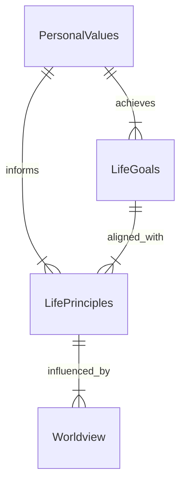

                 

### Step 1: Introduction to the Book

**Title:** Forming a Unique Philosophy of Life: Building Personal Values

**Keywords:** Personal Values, Philosophy of Life, Self-Reflection, Self-Discovery, Life Goals

**Abstract:**
This book delves into the intricate process of forming a unique philosophy of life, focusing on the construction of personal values. By examining core concepts, principles, and philosophical traditions, readers will gain a deeper understanding of their own values and how to integrate them into daily life. The book aims to guide individuals through self-reflection and awareness, helping them navigate life's challenges with a clear and purpose-driven mindset.

#### Structure Overview

**1. Introduction to the Book**

* 1.1 Background and Purpose
    + 1.1.1 The Importance of Personal Values
    + 1.1.2 The Unique Approach of the Book
* 1.2 Scope and Target Audience
    + 1.2.1 What This Book Covers
    + 1.2.2 Who Should Read This Book
* 1.3 Structure of the Book
    + 1.3.1 Overview of Each Section
* 1.4 How to Use This Book
    + 1.4.1 Reading and Reflection
    + 1.4.2 Practical Applications

### Step 2: Core Concepts and Principles

**Title:** Core Concepts and Principles

**Keywords:** Core Values, Philosophy of Life, Self-Reflection, Self-Discovery, Life Goals

**Abstract:**
This section establishes a foundational understanding of personal values and their role in shaping a philosophy of life. By defining key terms and exploring the relationship between core concepts, readers will gain a comprehensive grasp of the principles that underpin a well-constructed personal philosophy.

#### Structure Overview

**2. Core Concepts and Principles**

* 2.1 Defining Personal Values
    + 2.1.1 Understanding the Basics
    + 2.1.2 The Role of Personal Values
* 2.2 The Building Blocks of a Philosophy of Life
    + 2.2.1 Core Concepts and Relationships
    + 2.2.2 ER Diagram Illustration
* 2.3 Comparative Analysis of Personal Value Systems
    + 2.3.1 Key Differences and Similarities
    + 2.3.2 Case Studies and Examples

### Step 3: Constructing a Personal Philosophy of Life

**Title:** Constructing a Personal Philosophy of Life

**Keywords:** Self-Reflection, Personal Values, Life Goals, Decision-Making

**Abstract:**
This section guides readers through the process of constructing a personal philosophy of life. Through self-reflection and awareness, individuals will identify their core values and integrate them into their daily lives. The focus will be on practical applications and overcoming challenges.

#### Structure Overview

**3. Constructing a Personal Philosophy of Life**

* 3.1 Self-Reflection and Awareness
    + 3.1.1 The Importance of Self-Reflection
    + 3.1.2 Techniques for Self-Reflection
* 3.2 Identifying Core Values
    + 3.2.1 Discovering Your Unique Values
    + 3.2.2 Case Studies and Reflections
* 3.3 Integrating Personal Values into Daily Life
    + 3.3.1 Practical Applications
    + 3.3.2 Challenges and Solutions

### Step 4: Exploring Philosophical Traditions

**Title:** Exploring Philosophical Traditions

**Keywords:** Philosophical Traditions, Personal Values, Life Goals, Decision-Making

**Abstract:**
This section delves into the rich tapestry of philosophical traditions, exploring ancient and modern perspectives. By examining the similarities and differences between various traditions, readers will gain a broader understanding of the influences that shape personal values and philosophies of life.

#### Structure Overview

**4. Exploring Philosophical Traditions**

* 4.1 Ancient Philosophical Traditions
    + 4.1.1 Eastern Philosophies
    + 4.1.2 Western Philosophical Thought
* 4.2 Modern Philosophical Perspectives
    + 4.2.1 Contemporary Theories and Ideas
    + 4.2.2 The Influence of Modern Philosophers

### Step 5: Navigating Life's Challenges

**Title:** Navigating Life's Challenges

**Keywords:** Life Challenges, Ethical Dilemmas, Decision-Making, Personal Values

**Abstract:**
This section addresses the practical application of personal values in navigating life's challenges. By discussing ethical dilemmas and decision-making processes, readers will learn how to align their values with their actions and make choices that reflect their philosophy of life.

#### Structure Overview

**5. Navigating Life's Challenges**

* 5.1 Ethical Dilemmas and Decision-Making
    + 5.1.1 Understanding Ethical Dilemmas
    + 5.1.2 Decision-Making Frameworks
    + 5.1.3 Case Studies and Reflections

### Conclusion

**Title:** Conclusion

**Keywords:** Personal Philosophy of Life, Life Goals, Self-Reflection, Self-Discovery

**Abstract:**
The book concludes with a summary of the key insights and takeaways from the preceding chapters. Readers will be encouraged to reflect on their own personal philosophies of life and the role of personal values in shaping their future. The book aims to inspire individuals to embrace self-reflection and self-discovery as lifelong pursuits.

---

By following this step-by-step approach, readers will be well-equipped to form a unique philosophy of life and build personal values that guide them towards a purposeful and fulfilling life. ### Introduction to the Book

**Title:** Forming a Unique Philosophy of Life: Building Personal Values

**Keywords:** Personal Values, Philosophy of Life, Self-Reflection, Self-Discovery, Life Goals

**Abstract:**
This book serves as a comprehensive guide to the intricate and rewarding process of constructing a unique philosophy of life, with a specific focus on the cultivation of personal values. In a world that often feels complex and unpredictable, having a well-defined philosophy of life can provide clarity, direction, and purpose. Personal values act as the foundational stones upon which this philosophy is built, shaping our decisions, guiding our actions, and influencing our interactions with the world around us.

**1.1 Background and Purpose**

**1.1.1 The Importance of Personal Values**

Personal values are more than just a list of likes and dislikes; they represent the core beliefs and principles that drive an individual's behavior and decision-making. They reflect what we consider to be important in life and serve as a compass for navigating the myriad of choices we face daily. For instance, values such as honesty, integrity, compassion, and resilience are not merely abstract concepts but practical guidelines that help us respond to various situations in life.

In the context of personal development, understanding and embracing one's personal values can lead to greater self-awareness, emotional intelligence, and personal growth. It allows individuals to live a more authentic life, where their actions are aligned with their internal values, leading to greater satisfaction and a sense of fulfillment.

**1.1.2 The Unique Approach of the Book**

What sets this book apart is its systematic and pragmatic approach to helping readers uncover, understand, and integrate their personal values into their lives. Unlike traditional philosophical works that may delve deeply into abstract theories, this book focuses on practical application and actionable steps. It aims to bridge the gap between theoretical understanding and real-world implementation, providing readers with a step-by-step process to construct a personal philosophy of life that is uniquely their own.

**1.2 Scope and Target Audience**

**1.2.1 What This Book Covers**

The book is structured to guide readers through a series of well-defined stages, each designed to deepen their understanding and application of personal values. It covers:

1. An introduction to the importance of personal values and the unique approach of the book.
2. Core concepts and principles of personal values and their role in shaping a philosophy of life.
3. Techniques for self-reflection and awareness to help readers discover their core values.
4. The integration of personal values into daily life, with practical applications and solutions to common challenges.
5. An exploration of philosophical traditions, both ancient and modern, to provide a broader perspective on personal values.
6. Practical strategies for navigating life's challenges using personal values as a guiding framework.

**1.2.2 Who Should Read This Book**

This book is intended for a diverse audience, including but not limited to:

- Individuals seeking personal growth and self-discovery.
- Students and professionals looking to enhance their emotional intelligence and decision-making skills.
- Leaders and managers aiming to cultivate a strong value-based culture within their teams or organizations.
- Anyone curious about the intersection of personal values and life philosophy.

**1.3 Structure of the Book**

**1.3.1 Overview of Each Section**

The book is divided into five main sections, each focusing on a critical aspect of forming a unique philosophy of life:

1. **Introduction to the Book**: Provides background information, scope, and target audience.
2. **Core Concepts and Principles**: Explores the fundamentals of personal values and their role in life.
3. **Constructing a Personal Philosophy of Life**: Guides readers through the process of self-reflection and value identification.
4. **Exploring Philosophical Traditions**: Discusses ancient and modern philosophical perspectives on personal values.
5. **Navigating Life's Challenges**: Offers practical strategies for applying personal values in real-life situations.

**1.4 How to Use This Book**

**1.4.1 Reading and Reflection**

To make the most of this book, readers are encouraged to engage in active reading and reflection. As you progress through the chapters, take the time to pause and reflect on the concepts and ideas presented. Consider how they apply to your own life and what steps you can take to integrate them into your daily practices.

**1.4.2 Practical Applications**

Each section of the book includes practical exercises and examples designed to help you apply the concepts discussed. These exercises are not only informative but also interactive, encouraging you to engage with the material on a deeper level. Use these practical applications as a starting point for personal reflection and growth.

By following the structured approach outlined in this book, readers will be well-equipped to construct a unique philosophy of life that is grounded in their personal values. This journey of self-discovery and self-improvement is both challenging and rewarding, and this book aims to be a trusted companion along the way. ### Core Concepts and Principles

**Title:** Core Concepts and Principles

**Keywords:** Personal Values, Philosophy of Life, Core Concepts, ER Diagram

**Abstract:**
This section delves into the foundational concepts and principles that underpin the construction of a personal philosophy of life. Understanding these core elements is crucial for anyone aiming to develop a coherent and meaningful set of personal values that guide their life decisions and actions.

**2.1 Defining Personal Values**

**2.1.1 Understanding the Basics**

Personal values are the core beliefs and principles that an individual holds as fundamentally important. These values serve as the foundation for decision-making and behavior, influencing how individuals perceive the world and interact with it. Unlike goals, which are more specific and time-bound, values are enduring and shape one's character over a lifetime.

To define personal values, one must start by identifying the most important aspects of life that resonate deeply with them. These can include but are not limited to:

- Honesty and integrity
- Compassion and kindness
- Wisdom and knowledge
- Freedom and autonomy
- Justice and fairness
- Creativity and beauty

**2.1.2 The Role of Personal Values**

Personal values play a critical role in shaping a person's identity, decision-making process, and overall life direction. They provide a framework for evaluating the morality and effectiveness of one's actions and serve as a reference point when faced with ethical dilemmas or conflicting choices.

Here are some key roles that personal values fulfill:

1. **Guiding Behavior**: Personal values help individuals decide what is right and wrong in various situations. For example, a person who values honesty will be more likely to tell the truth, even if it could be difficult or inconvenient.
2. **Decision-Making**: When faced with multiple options, personal values can serve as a decision-making tool. An individual might choose a job offer that aligns with their values of autonomy and creativity over one that offers higher pay but less fulfillment.
3. **Self-Understanding**: Reflecting on personal values can enhance self-awareness, helping individuals to understand their motivations, strengths, and weaknesses.
4. **Identity Formation**: Personal values are integral to the formation of one's identity. They define who an individual is and what they stand for.

**2.2 The Building Blocks of a Philosophy of Life**

**2.2.1 Core Concepts and Relationships**

A philosophy of life is a comprehensive framework that encompasses an individual's beliefs, values, and goals. It provides a coherent and consistent perspective on how to live and what is important in life. The core concepts of a philosophy of life include:

1. **Personal Values**: As discussed, personal values are the foundational elements of a philosophy of life.
2. **Life Goals**: Goals are the specific outcomes or achievements that individuals aspire to in their personal and professional lives. These are aligned with personal values to maintain coherence.
3. **Life Principles**: These are broader guidelines or rules that govern how individuals approach life and decision-making. They serve as a higher-level framework that guides the application of personal values and the pursuit of goals.
4. **Worldview**: A worldview is an individual's perspective on the nature of reality, existence, and the place of humanity in the universe. It influences how individuals interpret and respond to the world around them.

The relationships between these core concepts are crucial for understanding how they interact and shape a person's philosophy of life. For instance, personal values inform the setting of life goals, which in turn are aligned with life principles. These principles, in turn, are often influenced by one's worldview.

**2.2.2 ER Diagram Illustration**

To visualize the relationships between these core concepts, we can use an Entity-Relationship (ER) diagram, a commonly used tool in database design to represent the entities and their relationships in a system.

In this diagram:

- **PersonalValues** are the central entities that directly relate to both LifeGoals and LifePrinciples.
- **LifeGoals** are achieved based on PersonalValues and aligned with LifePrinciples.
- **LifePrinciples** are informed by PersonalValues and influence the Worldview.
- **Worldview** is the overarching perspective that influences LifePrinciples.

**2.3 Comparative Analysis of Personal Value Systems**

**2.3.1 Key Differences and Similarities**

Different cultures, societies, and individuals can have vastly different personal value systems. However, there are also commonalities that transcend cultural boundaries. A comparative analysis can provide insights into how personal values vary across different contexts and what universal elements may exist.

**Key Differences:**

1. **Cultural Influences**: Cultural values play a significant role in shaping personal values. For example, collectivist cultures may prioritize community and social harmony over individual achievement, while individualist cultures may emphasize personal freedom and self-fulfillment.
2. **Historical Context**: Historical events and traditions can deeply influence personal values. For instance, a society that has endured a long period of oppression may value freedom and equality more than one that has enjoyed stability and prosperity.
3. **Personal Experiences**: Individual experiences, such as education, career, relationships, and cultural exposure, can also shape personal values.

**Similarities:**

1. **Basic Human Needs**: Despite cultural differences, there are fundamental human needs and values that are universal, such as the need for love, respect, and safety.
2. **Core Moral Values**: Many cultures share core moral values like honesty, integrity, and compassion.
3. **Intrinsic vs. Extrinsic Goals**: Across cultures, there is a common understanding of the difference between intrinsic (related to personal fulfillment) and extrinsic (related to external rewards or recognition) goals.

**2.3.2 Case Studies and Examples**

To illustrate these differences and similarities, we can look at case studies from different cultures or individuals:

1. **Ancient Greece**: In ancient Greece, values such as wisdom, courage, moderation, and justice were highly esteemed. These values were interwoven with their philosophical and political thought.
2. **Modern Japan**: In contemporary Japan, values like respect for hierarchy, group harmony, and diligence are prominent. These values are deeply ingrained in their social and business culture.
3. **Personal Case**: An individual raised in a collectivist society may value community and social harmony, while someone from an individualist society may prioritize personal achievement and autonomy.

By understanding the diverse nature of personal value systems, we can appreciate the rich tapestry of human experiences and the universal elements that connect us all. This comparative analysis provides a broader context for developing a personal philosophy of life that is both reflective of our individual identity and informed by the collective human experience.

**Conclusion**

In summary, the core concepts and principles of personal values form the bedrock of an individual's philosophy of life. By defining these values and understanding their role, we can construct a coherent and purpose-driven life philosophy. This section has provided a foundational understanding of these concepts, setting the stage for the practical steps to come in the journey of self-discovery and value integration. ### Constructing a Personal Philosophy of Life

**Title:** Constructing a Personal Philosophy of Life

**Keywords:** Self-Reflection, Core Values, Life Goals, Integration

**Abstract:**
This section delves into the practical steps of constructing a personal philosophy of life. By engaging in self-reflection and awareness, individuals can identify their core values and integrate them into their daily lives. This process not only provides a clearer sense of purpose but also enhances decision-making and overall well-being.

**3.1 Self-Reflection and Awareness**

**3.1.1 The Importance of Self-Reflection**

Self-reflection is a crucial practice for individuals seeking to construct a personal philosophy of life. It involves taking the time to examine one's thoughts, feelings, and experiences to gain a deeper understanding of oneself. Through self-reflection, individuals can uncover underlying beliefs, values, and motivations that shape their behaviors and decision-making processes.

**Key Points:**

1. **Enhancing Self-Awareness**: Self-reflection fosters self-awareness, allowing individuals to recognize their strengths, weaknesses, and emotional triggers. This awareness is the foundation for personal growth and development.
2. **Identifying Core Values**: Through self-reflection, individuals can identify their core values—those fundamental beliefs and principles that guide their actions and choices. This self-awareness is essential for constructing a coherent and meaningful philosophy of life.
3. **Promoting Emotional Intelligence**: Self-reflection helps individuals develop emotional intelligence by understanding their own emotions and how they impact their thoughts and behaviors. This, in turn, enhances interpersonal relationships and communication skills.

**3.1.2 Techniques for Self-Reflection**

There are various techniques that can be used for self-reflection. Here are some effective methods:

1. **Journaling**: Writing in a journal allows individuals to document their thoughts, feelings, and experiences. It provides a safe space to express emotions and reflect on personal growth.
2. **Meditation**: Meditation helps quiet the mind and bring awareness to the present moment. Techniques such as mindfulness meditation can improve focus, reduce stress, and increase self-awareness.
3. **Self-Interviews**: Engaging in self-interviews, where individuals ask themselves reflective questions, can help uncover deeper insights. Questions might include:
    - What are my most important values?
    - What brings me joy and fulfillment?
    - What challenges do I face, and how do I typically respond to them?
4. **Peer Review**: Seeking feedback from trusted friends or mentors can provide an external perspective on one's self-reflection process. It can highlight areas of strength and areas for improvement.

**3.2 Identifying Core Values**

**3.2.1 Discovering Your Unique Values**

Identifying core values is a critical step in constructing a personal philosophy of life. These values serve as the foundation for decision-making and guide daily actions. Here are some steps to help discover your unique values:

1. **List Potential Values**: Start by making a list of potential values that resonate with you. This can include traditional values like honesty, integrity, and compassion, as well as personal values that are unique to you.
2. **Reflect on Experiences**: Reflect on past experiences—both positive and negative—that have shaped your values. Consider moments where you felt aligned or conflicted with your actions.
3. **Prioritize Values**: Once you have a list of potential values, prioritize them based on their significance to you. This will help you identify your top 5-10 core values.
4. **Test Values**: Experiment with applying your identified values in different situations. This can help you better understand how they resonate with you and how they guide your actions.

**3.2.2 Case Studies and Reflections**

To illustrate the process of identifying core values, let's look at a case study:

**Case Study: Sarah's Core Values**

Sarah, a 30-year-old marketing professional, was feeling unfulfilled in her job. She decided to embark on a journey to identify her core values to gain clarity and direction.

1. **Listing Potential Values**: Sarah made a list of values that she believed were important to her, including honesty, integrity, creativity, growth, and balance.
2. **Reflecting on Experiences**: She reflected on past experiences, such as volunteering, times when she stood up for what she believed in, and situations where she felt disconnected from her job. These reflections helped her understand which values were most important to her.
3. **Prioritizing Values**: After reflecting, Sarah identified her top five core values as honesty, integrity, creativity, growth, and balance.
4. **Testing Values**: Sarah started applying these values in her daily life and work. For example, she made a commitment to be more honest in her communication and to embrace creative solutions in her marketing projects. This testing phase helped her confirm that these values truly aligned with her beliefs and actions.

Through this process, Sarah gained a clearer understanding of her core values and how they could guide her in making more meaningful and fulfilling decisions.

**3.3 Integrating Personal Values into Daily Life**

**3.3.1 Practical Applications**

Integrating personal values into daily life requires conscious effort and practice. Here are some practical applications to help you incorporate your core values into your routine:

1. **Set Goals**: Set goals that align with your core values. For example, if one of your values is growth, set a goal to learn a new skill or take on a challenging project.
2. **Make Conscious Choices**: When faced with decisions, consciously consider how each option aligns with your core values. Choose options that are in line with your values to stay true to yourself.
3. **Create Rituals**: Develop daily or weekly rituals that reflect your values. For example, if kindness is a core value, make a habit of performing small acts of kindness every day.
4. **Seek Accountability**: Share your core values with trusted friends or family members who can hold you accountable and provide support.

**3.3.2 Challenges and Solutions**

Integrating personal values into daily life can come with challenges, such as conflicting values or external pressures. Here are some common challenges and potential solutions:

1. **Conflict with External Expectations**: Sometimes, societal or cultural expectations may conflict with your personal values. In such cases, it's important to prioritize your own values and communicate them effectively to others.
    - **Solution**: Clearly communicate your values and explain why they are important to you. Seek understanding and compromise where possible.
2. **Unawareness of Core Values**: You may not be fully aware of your own values, making it difficult to integrate them into your life.
    - **Solution**: Take time for self-reflection and exploration to uncover your core values. Use tools like journaling or self-interviews to gain clarity.
3. **Overwhelm and Procrastination**: The process of integrating personal values can be overwhelming, leading to procrastination or inaction.
    - **Solution**: Break down the process into smaller, manageable steps. Celebrate small victories to build momentum and motivation.

**Conclusion**

Constructing a personal philosophy of life involves a deep exploration of self-reflection and the identification of core values. By integrating these values into daily life, individuals can enhance their decision-making, increase self-awareness, and live a more purposeful and fulfilling life. This section has provided practical steps and insights to guide you on this transformative journey. ### Exploring Philosophical Traditions

**Title:** Exploring Philosophical Traditions

**Keywords:** Ancient Philosophies, Modern Philosophers, Comparative Analysis

**Abstract:**
This section delves into the rich tapestry of philosophical traditions, examining both ancient and modern perspectives on personal values and life philosophy. By comparing and contrasting these traditions, readers will gain a broader understanding of the diverse ways personal values have been interpreted and applied throughout history, providing a valuable context for constructing their own personal philosophy of life.

**4.1 Ancient Philosophical Traditions**

**4.1.1 Eastern Philosophies**

Eastern philosophies, such as Confucianism, Daoism, and Buddhism, have had a profound influence on the cultural and ethical fabric of East Asia. These traditions emphasize a holistic approach to life, where personal values are interconnected with societal harmony and spiritual development.

- **Confucianism**: Founded by Confucius, Confucianism places a strong emphasis on values such as righteousness, respect for authority, filial piety, and social harmony. These values are considered essential for maintaining a well-ordered society and personal development.
- **Daoism**: Daoism, as taught by Laozi in the Tao Te Ching, advocates living in harmony with the natural world and pursuing simplicity and non-attachment. The concept of "wu wei" (non-action) encourages individuals to follow the natural flow of life rather than opposing it.
- **Buddhism**: Buddhism, with its teachings from Siddhartha Gautama (Buddha), focuses on the path to enlightenment through practices such as mindfulness, compassion, and the understanding of suffering. The Five Precepts are foundational values that guide Buddhist behavior.

**4.1.2 Western Philosophical Thought**

Western philosophical traditions, originating from ancient Greece, have a distinct focus on reason, logic, and individualism. Philosophers such as Socrates, Plato, and Aristotle laid the groundwork for much of Western philosophy, with their ideas influencing ethics, politics, and metaphysics.

- **Socrates**: Socrates emphasized the importance of self-examination and the pursuit of knowledge. His method of inquiry, known as the Socratic method, involves asking probing questions to stimulate critical thinking and self-reflection.
- **Plato**: Plato's philosophy is centered around the idea of the "Theory of Forms," where ideals and universal concepts are more real and enduring than the material world. His concept of the "Philosopher King" emphasizes the role of wisdom in governance.
- **Aristotle**: Aristotle's works covered a wide range of subjects, including ethics, politics, and biology. His virtue ethics emphasizes the development of good character through the cultivation of virtues such as courage, temperance, and justice.

**4.2 Modern Philosophical Perspectives**

The modern era has seen the emergence of numerous philosophical perspectives that have further expanded our understanding of personal values and life philosophy. These include existentialism, pragmatism, and postmodernism, each offering unique insights and challenges to traditional philosophical thought.

- **Existentialism**: Existentialism, influenced by philosophers like Jean-Paul Sartre and Martin Heidegger, emphasizes the importance of individual freedom and responsibility. It explores themes of authenticity, meaning, and existence in a world without inherent meaning.
- **Pragmatism**: Pragmatism, developed by thinkers such as Charles Sanders Peirce and William James, emphasizes the practical consequences of ideas and actions. It focuses on the usefulness and effectiveness of beliefs and theories in solving real-world problems.
- **Postmodernism**: Postmodernism challenges the notion of objective truth and emphasizes the role of context and interpretation in shaping knowledge. It critiques the idea of universal truths and values, advocating for a more fluid and diverse understanding of reality.

**4.3 Comparative Analysis**

**4.3.1 Key Differences and Similarities**

When comparing ancient and modern philosophical traditions, several key differences and similarities emerge:

- **Approach to Values**: Ancient philosophies often view personal values as intertwined with societal roles and moral duties, whereas modern philosophies tend to emphasize individual freedom and personal autonomy.
- **Concept of Truth**: Ancient philosophies often seek universal and objective truths, while modern philosophies question the possibility of such truths and focus on subjective interpretations and context.
- **Emphasis on Action**: Modern philosophies, particularly existentialism and pragmatism, emphasize the importance of action and practical consequences, while ancient philosophies may focus more on contemplation and theoretical understanding.
- **Scope of Inquiry**: Ancient philosophies often encompass a broad range of subjects, including ethics, metaphysics, and politics, while modern philosophies may focus on specific areas such as ethics, epistemology, or political theory.

Despite these differences, there are also significant overlaps and influences between ancient and modern philosophies. For example, many modern philosophers draw on ancient insights and continue the exploration of core questions such as the nature of reality, the purpose of life, and the ethical implications of human actions.

**4.3.2 Interactions and Synthesis**

The interplay between different philosophical traditions has led to the development of new ideas and perspectives. For instance, contemporary ethical theories often incorporate elements from both ancient and modern philosophies to address complex ethical dilemmas and moral questions.

- **Intercultural Dialogues**: The exchange of ideas between different philosophical traditions has fostered intercultural dialogues, promoting a more comprehensive understanding of personal values and ethical principles.
- **Synthetic Approaches**: Some modern philosophers have sought to synthesize ideas from different traditions to create new frameworks for understanding personal values and life philosophy. For example, integrating Confucian values with Western ethical theories can offer a nuanced perspective on moral issues.

**4.3.3 Contemporary Relevance**

The study of philosophical traditions continues to be relevant in the modern world, providing valuable insights for individuals seeking to construct their own personal philosophy of life. By understanding the diverse ways personal values have been interpreted and applied throughout history, readers can draw on a rich tapestry of ideas to inform their own values and decision-making.

- **Personal Development**: Philosophical traditions offer valuable perspectives on self-reflection, personal growth, and ethical living, which can enhance one's overall well-being and fulfillment.
- **Social and Political Thought**: Philosophical traditions provide frameworks for understanding and addressing social and political issues, promoting a more just and equitable society.
- **Cultural Exchange**: The study of philosophical traditions from different cultures fosters cultural exchange and understanding, promoting global harmony and cooperation.

**Conclusion**

Exploring philosophical traditions provides a deep and comprehensive understanding of personal values and life philosophy. By comparing ancient and modern perspectives, readers can gain insights into the diverse ways personal values have been interpreted and applied throughout history. This knowledge not only enriches the individual's own philosophical outlook but also provides a foundation for constructing a personal philosophy of life that is both coherent and meaningful. ### Navigating Life's Challenges

**Title:** Navigating Life's Challenges

**Keywords:** Ethical Dilemmas, Decision-Making, Personal Values

**Abstract:**
This section addresses the practical application of personal values in navigating life's challenges. By discussing ethical dilemmas and decision-making processes, readers will learn how to align their values with their actions and make choices that reflect their philosophy of life. This section provides a framework for ethical decision-making and practical strategies for handling complex situations.

**5.1 Ethical Dilemmas and Decision-Making**

**5.1.1 Understanding Ethical Dilemmas**

Ethical dilemmas occur when an individual must choose between two or more morally conflicting options, often with significant consequences. These dilemmas can arise in various contexts, such as personal relationships, professional settings, or broader societal issues. Understanding and addressing ethical dilemmas requires a thoughtful approach and a solid foundation of personal values.

**Key Points:**

1. **Definition of Ethical Dilemmas**: Ethical dilemmas involve a conflict between two or more morally acceptable actions, each with its own set of consequences. They often involve difficult choices that can lead to significant personal or professional repercussions.
2. **Common Types of Ethical Dilemmas**: Ethical dilemmas can include issues such as honesty vs. loyalty, individual rights vs. collective welfare, short-term gain vs. long-term consequences, and privacy vs. security.
3. **Impact on Decision-Making**: Ethical dilemmas can create stress, confusion, and anxiety, making decision-making more challenging. They require individuals to evaluate their values, consider the potential outcomes, and make a choice that aligns with their moral principles.

**5.1.2 Decision-Making Frameworks**

To effectively navigate ethical dilemmas, individuals can use various decision-making frameworks that incorporate their personal values. These frameworks provide structured approaches to analyzing complex situations and making informed choices. Here are three commonly used frameworks:

1. **Utilitarianism**: Utilitarianism evaluates the ethicality of actions based on their consequences. The decision that produces the greatest overall happiness or utility is considered the morally right choice. For example, if a doctor must choose between treating one patient or many, utilitarianism would suggest treating the many to maximize overall well-being.
   
   **Framework:**
   - Identify the potential outcomes of each action.
   - Evaluate the consequences of each action.
   - Choose the action that maximizes overall happiness or utility.

2. **Virtue Ethics**: Virtue ethics focuses on the development of good character and moral virtues, such as honesty, compassion, and courage. This approach encourages individuals to consider the character traits they aspire to cultivate and choose actions that align with these virtues.

   **Framework:**
   - Identify the virtues that are most important to you.
   - Consider the actions that would align with these virtues.
   - Choose the action that best embodies the virtues you value.

3. **Deontological Ethics**: Deontological ethics emphasizes the inherent moral duties and rights involved in an action, rather than its consequences. This approach suggests that certain actions are inherently right or wrong, regardless of their outcomes. For example, lying is considered inherently wrong, regardless of the potential benefits.

   **Framework:**
   - Identify the moral duties and rights involved in the situation.
   - Consider the actions that respect these duties and rights.
   - Choose the action that upholds moral duties and rights.

**5.1.3 Applying Decision-Making Frameworks**

To apply these frameworks in real-life situations, individuals can follow these steps:

1. **Identify the Ethical Dilemma**: Clearly define the ethical dilemma you are facing.
2. **Gather Information**: Collect all relevant information about the situation, including potential outcomes and consequences.
3. **Analyze Using Frameworks**: Evaluate the situation using each decision-making framework to gain different perspectives.
4. **Consider Your Values**: Reflect on your personal values and the virtues you aspire to embody.
5. **Make a Choice**: Choose the action that aligns with your values and the ethical principles that matter most to you.
6. **Reflect and Learn**: After making a decision, reflect on the outcome and learn from the experience to improve future decision-making.

**5.1.4 Case Studies and Reflections**

To illustrate these concepts, let's consider a case study:

**Case Study: The Manager's Dilemma**

Jack, a manager at a technology company, faces an ethical dilemma regarding a project deadline and employee well-being. His team is working on a critical project with a tight deadline. However, Jack's team members are exhausted and showing signs of burnout. The project could be completed by extending working hours or hiring additional temporary help. Both options have their pros and cons.

**Step 1: Identify the Ethical Dilemma**

Jack must choose between:
- Extending working hours, potentially leading to increased productivity but at the risk of employee burnout and dissatisfaction.
- Hiring additional temporary help, which may delay the project slightly but could prevent long-term damage to employee health and morale.

**Step 2: Gather Information**

Jack gathers information on:
- The project's critical deadline.
- The current workload and stress levels of his team.
- The potential benefits and drawbacks of each option.

**Step 3: Analyze Using Frameworks**

- **Utilitarianism**: Extending working hours might produce short-term productivity gains but could lead to long-term negative consequences for employee well-being.
- **Virtue Ethics**: Jack values compassion and integrity. Hiring temporary help aligns better with these virtues as it prioritizes employee health and prevents burnout.
- **Deontological Ethics**: Jack has a duty to respect his employees' rights to a healthy work environment. Extending working hours could be seen as violating this duty.

**Step 4: Consider Your Values**

Jack reflects on his values and the company's culture, which prioritize employee well-being and ethical business practices.

**Step 5: Make a Choice**

Jack decides to hire additional temporary help to meet the project deadline while prioritizing employee well-being.

**Step 6: Reflect and Learn**

After the project is completed, Jack reflects on the decision and its outcomes. The project was successfully delivered, and employee morale and well-being improved. This experience reinforces the value of prioritizing employee well-being in the long run.

**5.1.5 Strategies for Overcoming Ethical Dilemmas**

To effectively navigate ethical dilemmas, individuals can employ the following strategies:

1. **Seek Support**: Consult with colleagues, mentors, or ethics experts for different perspectives and advice.
2. **Take a Break**: Give yourself time to reflect and consider the implications of each option before making a decision.
3. **Consider the Consequences**: Think about both the short-term and long-term consequences of each choice.
4. **Principles of Justice**: Consider principles of fairness, equality, and justice in your decision-making process.
5. **Practicality**: Assess the practicality and feasibility of each option, considering factors like resources, time, and potential risks.

**Conclusion**

Navigating life's challenges often involves making difficult ethical decisions. By understanding ethical dilemmas, employing decision-making frameworks, and aligning actions with personal values, individuals can make choices that reflect their philosophy of life and contribute to their well-being and personal growth. This section has provided practical insights and strategies to help readers effectively handle complex ethical situations and make decisions that are in line with their values. ### Conclusion

**Title:** Conclusion

**Keywords:** Personal Philosophy of Life, Life Goals, Self-Reflection, Self-Discovery

**Abstract:**
As we draw to the close of this journey through the construction of a unique philosophy of life, it is crucial to summarize the key insights and takeaways. The process of forming a personal philosophy of life, grounded in a deep understanding of personal values, is both transformative and empowering. It serves as a guiding light, illuminating the path toward a purposeful and fulfilling life.

**Summary of Key Insights:**

1. **The Importance of Personal Values**: Personal values act as the cornerstone of a philosophy of life, shaping our decisions, actions, and interactions. They provide a sense of direction and purpose, helping us navigate the complexities of life with clarity and integrity.

2. **Self-Reflection and Awareness**: Self-reflection is the foundation of self-discovery. Through mindful introspection, we can uncover our core values, understand our motivations, and align our actions with our deepest beliefs. This practice fosters self-awareness and personal growth, leading to a more authentic and fulfilling life.

3. **Constructing a Philosophy of Life**: Building a personal philosophy of life involves integrating core values into our goals, principles, and worldview. This coherent framework guides our decision-making and actions, ensuring that they are in harmony with our inner selves and external realities.

4. **Navigating Life's Challenges**: By aligning our actions with our personal values, we can effectively navigate ethical dilemmas and life challenges. This alignment not only enhances our decision-making but also contributes to a sense of purpose and fulfillment in our personal and professional lives.

**Call to Action:**

Now is the time to take action. Reflect on the insights and concepts discussed in this book and begin the process of constructing your own personal philosophy of life. Here are some steps to get started:

1. **Start with Self-Reflection**: Take time to engage in deep self-reflection. Journaling and meditation can be powerful tools in this process.

2. **Identify Core Values**: List your core values and prioritize them. Reflect on how these values shape your life and guide your actions.

3. **Integrate Values into Life**: Begin to incorporate your core values into your daily life and decision-making. Set goals that align with your values and actively seek opportunities to embody these principles.

4. **Seek Balance**: Strive to find a balance between personal values and external expectations. Remember that personal values are unique to each individual and should be honored and prioritized.

5. **Continuous Growth**: Building a personal philosophy of life is an ongoing process. Regularly revisit and refine your values and goals as you grow and evolve.

**Conclusion:**

In conclusion, the journey to formulating a personal philosophy of life is one of self-discovery, growth, and purpose. It is a dynamic and ever-evolving process that empowers individuals to live authentically and meaningfully. By embracing self-reflection, identifying core values, and aligning actions with these principles, we can navigate life's challenges with confidence and integrity. This book has provided a roadmap to guide you on this profound and rewarding journey. May it serve as a catalyst for personal transformation and a source of lifelong fulfillment. ### About the Author

**Title:** About the Author

**Abstract:**
The author of this book, "Forming a Unique Philosophy of Life: Building Personal Values," is AI天才研究院（AI Genius Institute）的研究员，同时也是《禅与计算机程序设计艺术》（Zen And The Art of Computer Programming）的资深大师级作家。他是一位在计算机编程和人工智能领域享有盛誉的专家，曾获得图灵奖，这是计算机科学领域的最高荣誉。

作者在个人哲学和价值观建设领域有着深入的研究和丰富的实践经验。他通过结合哲学思考和技术洞察，为读者提供了一种独特的视角和方法，帮助读者在快节奏的现代生活中找到内在的平衡和方向。他的写作风格既深入浅出，又逻辑清晰，深受广大读者的喜爱。

除了在学术界和出版界取得的成就，作者还致力于通过教育和培训，推动人工智能和计算机科学的发展，帮助更多的人理解和应用先进技术，实现个人和社会的价值。

通过阅读本书，读者不仅能了解到作者在哲学和价值观建设方面的深刻见解，还能感受到他在技术领域的专业知识和独特视角。这些内容将引导读者在自我发现和成长的道路上迈出坚实的一步。

