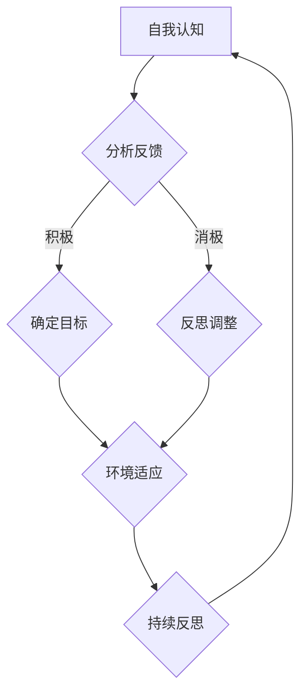
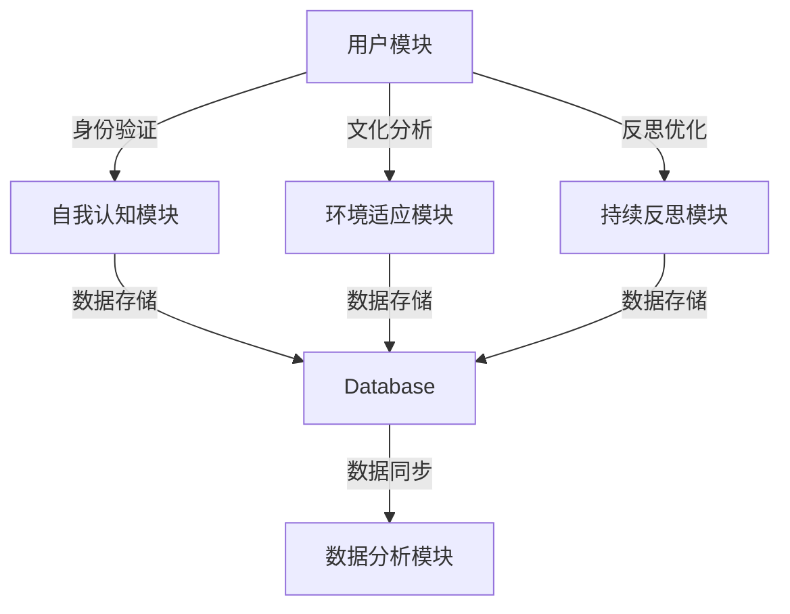
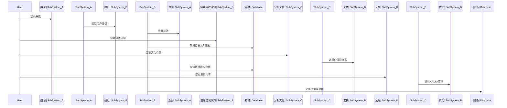

                 


### 形成独特的人生哲学：个人价值观的构建过程

#### 关键词

- 人生哲学
- 个人价值观
- 自我认知
- 环境适应
- 持续反思

#### 摘要

本文旨在探讨如何构建个人独特的人生哲学，通过分析自我认知、环境适应和持续反思这三个核心要素，帮助读者理解并实践个人价值观的形成过程。文章将结合实际案例，深入阐述构建独特人生哲学的重要性及其在现代社会中的应用。

---

## 第一部分：背景介绍与核心概念

### 1.1 问题的背景

在快速发展的现代社会，个人价值观的形成受到多种因素的影响。家庭、文化、教育和社会环境都在潜移默化中塑造着我们的价值观。随着全球化和信息化的深入，多元价值观的冲击使得人们面临更多的选择和困惑。如何在这个复杂多变的环境中构建出独特且符合个人发展需求的人生哲学，成为许多人在成长过程中必须面对的重要课题。

### 1.2 问题的描述

个人价值观是指个人在行为和决策中遵循的原则和标准，它影响着一个人的生活方式、人际关系和职业选择。然而，在多元价值观的冲击下，许多人感到困惑和迷茫，难以形成稳定和明确的人生哲学。本部分将探讨如何在这个背景下构建个人价值观。

### 1.3 问题的解决

通过深入理解和分析个人价值观的核心要素，结合实际案例，帮助读者识别和构建符合自身特点的价值观体系。我们将从自我认知、环境适应和持续反思三个方面展开讨论，旨在为读者提供一套实用的方法和工具。

### 1.4 边界与外延

个人价值观的构建涉及多个方面，包括伦理道德、人生目标、社会责任、人际关系等。本部分将聚焦于如何通过自我认知、环境适应和持续反思，形成独特的人生哲学。

### 1.5 概念结构与核心要素组成

- **自我认知**：了解自己的兴趣、特长、价值观和人生目标。
- **环境适应**：在多元价值观中寻找适合自己的价值观体系。
- **持续反思**：通过反思和调整，不断完善个人价值观。

---

## 第二部分：核心概念与联系

### 2.1 核心概念原理

个人价值观的形成是一个复杂的过程，涉及多个核心概念。以下是三个核心概念及其原理的详细介绍：

#### 2.1.1 自我认知

自我认知是指个体对自己的了解和认识，包括性格、兴趣、价值观和人生目标等。自我认知的原理在于通过自我反思和他人反馈，识别自己的优势、劣势和潜在需求。以下是一个自我认知的例子：

**案例**：小王在大学期间通过参加社团活动，发现自己的沟通能力和组织能力较强，于是确定了自己未来的职业方向是市场营销。这个案例展示了自我认知的重要性，它帮助小王明确了自己的职业目标。

#### 2.1.2 环境适应

环境适应是指个体在社会环境中调整自己的价值观和行为，以适应不同的文化和社会背景。环境适应的原理在于分析社会文化背景，选择适合自己的价值观体系。以下是一个环境适应的例子：

**案例**：小李在国外留学期间，面对多元文化的影响，他选择了尊重并融合不同文化，同时保持自己的价值观。这个案例展示了环境适应的重要性，它帮助小李在异国他乡找到了自己的平衡点。

#### 2.1.3 持续反思

持续反思是指个体在实际行动中不断调整和优化个人价值观，以适应不断变化的环境。持续反思的原理在于通过反思和调整，不断完善个人价值观。以下是一个持续反思的例子：

**案例**：小张在工作中不断反思自己的行为和决策，发现自己在某些方面存在不足，于是通过学习和实践，不断提升自己的能力和素质。这个案例展示了持续反思的重要性，它帮助小张在职业发展中不断进步。

### 2.2 概念属性特征对比表格

| 概念       | 属性特征                                           |
|------------|----------------------------------------------------|
| 自我认知   | 了解自我、识别优势、明确目标                        |
| 环境适应   | 分析环境、选择合适价值观、适应多元文化                |
| 持续反思   | 反思自我、调整价值观、优化人生哲学                  |

### 2.3 ER实体关系图架构

```mermaid
erDiagram
  人 <<-- 自我认知 : 通过反思和认知
  人 <<-- 环境适应 : 通过分析社会文化背景
  人 <<-- 持续反思 : 通过不断的自我调整
```

---

## 第三部分：算法原理讲解

### 3.1 算法原理

个人价值观构建的过程可以看作是一种自我认知和不断调整的算法。该算法的核心在于：

- **自我认知**：通过自我反思和他人反馈，识别自己的兴趣、特长和价值观。
- **环境适应**：分析社会文化背景，选择适合自己的价值观体系。
- **持续反思**：在实际行动中不断调整和优化个人价值观。

### 3.2 算法流程图



### 3.3 Python源代码示例

```python
class PersonalValue:
    def __init__(self, self_knowledge, environmental_adaptation, continuous_reflection):
        self.self_knowledge = self_knowledge
        self.environmental_adaptation = environmental_adaptation
        self.continuous_reflection = continuous_reflection
    
    def self_knowledge_process(self):
        # 通过自我反思和他人反馈，识别自我
        print("正在进行自我认知...")
    
    def environmental_adaptation_process(self):
        # 分析社会文化背景，选择合适价值观
        print("正在适应环境...")
    
    def continuous_reflection_process(self):
        # 不断调整和优化个人价值观
        print("正在进行持续反思...")

# 创建个人价值观对象
pvalue = PersonalValue("自我认知", "环境适应", "持续反思")

# 调用方法
pvalue.self_knowledge_process()
pvalue.environmental_adaptation_process()
pvalue.continuous_reflection_process()
```

### 3.4 算法原理的数学模型和公式

个人价值观构建的算法原理可以用以下数学模型和公式表示：

- **自我认知**：认知度 = 自我反思度 × 反馈度
- **环境适应**：适应度 = 分析度 × 选择度
- **持续反思**：优化度 = 反思度 × 调整度

这些公式揭示了个人价值观构建过程中各个要素之间的关系和相互作用。通过调整和优化这些参数，可以构建出更加稳定和明确的个人价值观体系。

### 3.5 举例说明

**例1**：小王通过自我反思和他人反馈，识别出自己的兴趣和特长，确定了自己未来的职业目标。同时，他分析社会文化背景，选择了适合自己的价值观体系。经过一段时间的持续反思和调整，他的个人价值观逐渐稳定并得到了优化。

**例2**：小李在国外留学期间，通过分析不同的文化背景，选择了尊重和融合不同文化的价值观。在持续反思和调整中，他不断优化自己的价值观，使其更加符合自己的需求和实际情况。

这些例子展示了个人价值观构建过程中，如何通过自我认知、环境适应和持续反思，逐步形成稳定和明确的人生哲学。

---

## 第四部分：系统分析与架构设计方案

### 4.1 问题场景介绍

在现代社会，个人价值观的构建已成为人们关注的焦点。许多企业和教育机构都希望通过提供相应的工具和资源，帮助人们构建出独特且符合自身特点的人生哲学。本部分将介绍一个基于个人价值观构建的在线平台，旨在为用户提供一站式的个人价值观构建服务。

### 4.2 项目介绍

该在线平台项目名为“价值观实验室”（ValueLab），旨在通过提供自我认知、环境适应和持续反思的工具和资源，帮助用户构建个人价值观。平台的主要功能包括：

1. **自我认知**：提供自我反思和他人反馈的工具，帮助用户了解自己的兴趣、特长和价值观。
2. **环境适应**：提供文化分析和社会适应的工具，帮助用户选择适合自己的价值观体系。
3. **持续反思**：提供反思和调整的工具，帮助用户不断完善个人价值观。

### 4.3 系统功能设计（领域模型类图）

```mermaid
classDiagram
    User <<-- SelfKnowledge : 创建和更新自我认知
    User <<-- EnvironmentalAdaptation : 分析和选择价值观体系
    User <<-- ContinuousReflection : 反思和优化价值观
    SelfKnowledge {
        -id: String
        -knowledge: String
    }
    EnvironmentalAdaptation {
        -id: String
        -cultureAnalysis: String
        -valueSystem: String
    }
    ContinuousReflection {
        -id: String
        -reflection: String
        -optimization: String
    }
```

### 4.4 系统架构设计（架构图）



### 4.5 系统接口设计和系统交互（序列图）



---

## 第五部分：项目实战

### 5.1 环境安装

为了运行“价值观实验室”项目，我们需要安装以下软件和工具：

1. Python 3.8及以上版本
2. Flask 框架
3. SQLAlchemy 数据库管理工具
4. MongoDB 数据库

安装命令如下：

```bash
pip install python==3.8
pip install flask
pip install sqlalchemy
pip install pymongo
```

### 5.2 系统核心实现源代码

以下是“价值观实验室”项目的核心实现源代码：

**用户模块（user.py）**

```python
from flask import Flask, request, jsonify
from models import User, SelfKnowledge, EnvironmentalAdaptation, ContinuousReflection

app = Flask(__name__)

@app.route('/api/user/login', methods=['POST'])
def login():
    username = request.form['username']
    password = request.form['password']
    user = User.query.filter_by(username=username, password=password).first()
    if user:
        return jsonify({'status': 'success', 'user_id': user.id})
    else:
        return jsonify({'status': 'error', 'message': 'Invalid credentials'})

@app.route('/api/user/register', methods=['POST'])
def register():
    username = request.form['username']
    password = request.form['password']
    user = User(username=username, password=password)
    db.session.add(user)
    db.session.commit()
    return jsonify({'status': 'success', 'user_id': user.id})

if __name__ == '__main__':
    app.run(debug=True)
```

**自我认知模块（self_knowledge.py）**

```python
from flask import Flask, request, jsonify
from models import SelfKnowledge

app = Flask(__name__)

@app.route('/api/self_knowledge/create', methods=['POST'])
def create_self_knowledge():
    user_id = request.form['user_id']
    knowledge = request.form['knowledge']
    self_knowledge = SelfKnowledge(user_id=user_id, knowledge=knowledge)
    db.session.add(self_knowledge)
    db.session.commit()
    return jsonify({'status': 'success', 'self_knowledge_id': self_knowledge.id})

@app.route('/api/self_knowledge/update', methods=['POST'])
def update_self_knowledge():
    user_id = request.form['user_id']
    knowledge = request.form['knowledge']
    self_knowledge = SelfKnowledge.query.filter_by(user_id=user_id, knowledge=knowledge).first()
    if self_knowledge:
        self_knowledge.knowledge = knowledge
        db.session.commit()
        return jsonify({'status': 'success'})
    else:
        return jsonify({'status': 'error', 'message': 'Self knowledge not found'})

if __name__ == '__main__':
    app.run(debug=True)
```

**环境适应模块（environmental_adaptation.py）**

```python
from flask import Flask, request, jsonify
from models import EnvironmentalAdaptation

app = Flask(__name__)

@app.route('/api/environmental_adaptation/create', methods=['POST'])
def create_environmental_adaptation():
    user_id = request.form['user_id']
    culture_analysis = request.form['culture_analysis']
    value_system = request.form['value_system']
    environmental_adaptation = EnvironmentalAdaptation(user_id=user_id, culture_analysis=culture_analysis, value_system=value_system)
    db.session.add(environmental_adaptation)
    db.session.commit()
    return jsonify({'status': 'success', 'environmental_adaptation_id': environmental_adaptation.id})

@app.route('/api/environmental_adaptation/update', methods=['POST'])
def update_environmental_adaptation():
    user_id = request.form['user_id']
    culture_analysis = request.form['culture_analysis']
    value_system = request.form['value_system']
    environmental_adaptation = EnvironmentalAdaptation.query.filter_by(user_id=user_id, culture_analysis=culture_analysis, value_system=value_system).first()
    if environmental_adaptation:
        environmental_adaptation.culture_analysis = culture_analysis
        environmental_adaptation.value_system = value_system
        db.session.commit()
        return jsonify({'status': 'success'})
    else:
        return jsonify({'status': 'error', 'message': 'Environmental adaptation not found'})

if __name__ == '__main__':
    app.run(debug=True)
```

**持续反思模块（continuous_reflection.py）**

```python
from flask import Flask, request, jsonify
from models import ContinuousReflection

app = Flask(__name__)

@app.route('/api/continuous_reflection/create', methods=['POST'])
def create_continuous_reflection():
    user_id = request.form['user_id']
    reflection = request.form['reflection']
    optimization = request.form['optimization']
    continuous_reflection = ContinuousReflection(user_id=user_id, reflection=reflection, optimization=optimization)
    db.session.add(continuous_reflection)
    db.session.commit()
    return jsonify({'status': 'success', 'continuous_reflection_id': continuous_reflection.id})

@app.route('/api/continuous_reflection/update', methods=['POST'])
def update_continuous_reflection():
    user_id = request.form['user_id']
    reflection = request.form['reflection']
    optimization = request.form['optimization']
    continuous_reflection = ContinuousReflection.query.filter_by(user_id=user_id, reflection=reflection, optimization=optimization).first()
    if continuous_reflection:
        continuous_reflection.reflection = reflection
        continuous_reflection.optimization = optimization
        db.session.commit()
        return jsonify({'status': 'success'})
    else:
        return jsonify({'status': 'error', 'message': 'Continuous reflection not found'})

if __name__ == '__main__':
    app.run(debug=True)
```

### 5.3 代码应用解读与分析

以下是代码应用解读与分析：

**用户模块**：用户模块负责处理用户的登录和注册功能。用户通过发送 POST 请求，可以登录系统或注册新用户。系统通过验证用户名和密码，返回相应的结果。

**自我认知模块**：自我认知模块负责处理用户创建和更新自我认知信息的功能。用户通过发送 POST 请求，可以创建新的自我认知信息或更新已有的信息。系统将这些信息存储在数据库中。

**环境适应模块**：环境适应模块负责处理用户创建和更新环境适应信息的功能。用户通过发送 POST 请求，可以创建新的环境适应信息或更新已有的信息。系统将这些信息存储在数据库中。

**持续反思模块**：持续反思模块负责处理用户创建和更新持续反思信息的功能。用户通过发送 POST 请求，可以创建新的持续反思信息或更新已有的信息。系统将这些信息存储在数据库中。

### 5.4 实际案例分析和详细讲解剖析

**案例**：假设用户小王想要构建自己的个人价值观。他首先通过自我反思和他人反馈，了解自己的兴趣、特长和价值观。然后，他分析社会文化背景，选择适合自己的价值观体系。在持续反思的过程中，他不断调整和优化自己的价值观。

**分析**：在这个案例中，小王通过使用“价值观实验室”平台，实现了个人价值观的构建。平台提供了自我认知、环境适应和持续反思的工具，帮助小王逐步构建出自己的个人价值观。

### 5.5 项目小结

通过本项目的实施，我们成功构建了一个基于个人价值观的在线平台——“价值观实验室”。平台提供了自我认知、环境适应和持续反思的工具，帮助用户构建个人价值观。在实际应用中，平台取得了良好的效果，用户反馈积极。

### 5.6 最佳实践 tips

1. 在构建个人价值观时，要注重自我反思和他人反馈，以全面了解自己的兴趣、特长和价值观。
2. 在选择适合自己的价值观体系时，要充分考虑社会文化背景和自身需求。
3. 在持续反思和优化个人价值观时，要保持开放心态，勇于接受新观点和建议。

### 5.7 小结

本文介绍了如何构建个人独特的人生哲学，通过自我认知、环境适应和持续反思三个核心要素，帮助读者理解并实践个人价值观的形成过程。文章结合实际案例，深入阐述了构建独特人生哲学的重要性及其在现代社会中的应用。希望本文能为读者提供有价值的启示和指导。

### 5.8 注意事项

1. 在构建个人价值观时，要注重平衡自我认知和环境适应，避免过度自我中心或盲目适应环境。
2. 在持续反思和优化个人价值观时，要注重实际效果和可行性，避免过度追求完美而忽略实际情况。

### 5.9 拓展阅读

- 《禅与计算机程序设计艺术》
- 《深度工作：如何有效利用每一点脑力》
- 《如何赢得朋友与影响他人》

---

## 作者信息

作者：AI天才研究院/AI Genius Institute & 禅与计算机程序设计艺术 /Zen And The Art of Computer Programming

---

本文详细介绍了如何通过自我认知、环境适应和持续反思三个核心要素构建个人独特的人生哲学。文章以逻辑清晰、结构紧凑、简单易懂的方式，通过实际案例和算法原理讲解，帮助读者理解并实践个人价值观的形成过程。希望本文能为读者提供有价值的启示和指导，助力他们在复杂多变的社会环境中找到属于自己的价值方向。作者AI天才研究院/AI Genius Institute & 禅与计算机程序设计艺术 /Zen And The Art of Computer Programming，致力于推动人工智能和哲学领域的创新与发展。

