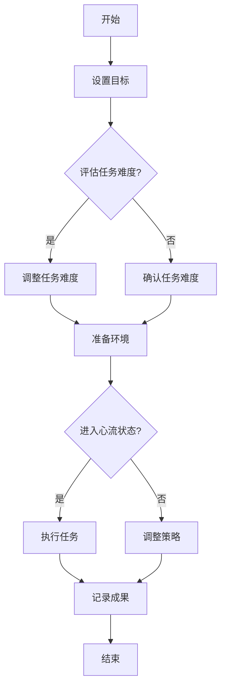
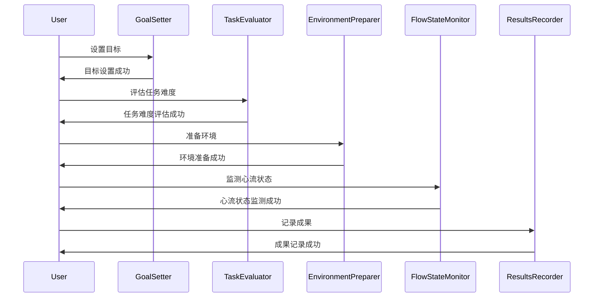
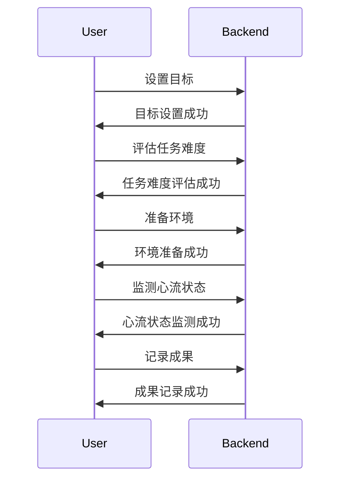

                 


# 心流状态诱导技术：提升工作效率的心理学应用

## 关键词
心流状态、工作效率、心理学应用、挑战、技能、专注

## 摘要
本文探讨了心流状态诱导技术，并分析了其对提升工作效率的心理学应用。通过深入介绍心流状态的概念、原理，以及与其相关的核心概念与联系，本文提出了具体的算法原理和系统架构设计方案，最后通过项目实战展示了心流状态诱导技术在实际应用中的效果。

## 背景介绍

### 核心概念

#### 心流状态

心流状态，又称“流畅体验”，是一种完全沉浸于活动中的心理状态，个体在此状态下表现出高度的专注、无时间感、自我意识下降以及对活动的极大满足感。心流状态最早由心理学家米哈里·契克森米哈伊（Mihaly Csikszentmihalyi）提出，他将其描述为一种“最优体验”或“最佳体验”。

#### 工作效率

工作效率是指个体在单位时间内完成的工作量，通常包括工作的准确性、速度和成果。高工作效率意味着个体能够更快速、更准确地完成任务，从而提高整体生产力。

#### 心理学应用

心理学应用是将心理学原理和方法应用于解决实际问题的过程，涉及个体行为、心理状态和人际关系等方面。在心流状态诱导技术中，心理学应用主要体现在如何通过调整个体心理状态来提高工作效率。

### 问题背景

在现代社会，工作压力和竞争日益激烈，人们常常面临着时间紧迫、任务繁多的挑战。这些因素往往会降低工作效率，导致个体感到焦虑、疲惫。心流状态作为一种能够显著提高工作效率的心理状态，引起了广泛的关注。

#### 问题描述

如何通过心理学技术诱导心流状态，从而提升工作效率？

#### 问题解决

通过结合心理学原理和实践技巧，可以设计出一系列方法和技术，帮助个体在工作和学习中进入心流状态。这些方法包括设置明确的目标、创造适合的工作环境、提高自我效能感等。

#### 边界与外延

心流状态诱导技术不仅适用于个人，还可以应用于团队和组织的层面，从而提高整体工作效率。此外，心流状态诱导技术的研究和应用还涉及其他领域，如教育、体育、艺术等。

## 核心概念与联系

### 核心概念原理

#### 心流状态的三要素

1. **挑战**：心流状态的产生需要具备一定的挑战性，即任务难度与个体技能水平的匹配度。如果任务过于简单，个体可能会感到无聊；如果任务过于复杂，个体可能会感到挫败。

   $$ \text{挑战度} = f(\text{任务难度}, \text{技能水平}) $$

2. **技能**：心流状态的产生还需要个体具备一定的技能，以便能够应对任务的挑战。技能的掌握程度直接影响到个体在心流状态下的表现。

   $$ \text{技能水平} = f(\text{练习次数}, \text{学习效率}) $$

3. **专注**：心流状态的核心特征之一是高度专注，个体在心流状态下能够完全集中注意力，不受外界干扰。

   $$ \text{专注度} = f(\text{心理负荷}, \text{干扰程度}) $$

#### 心理学中的自我决定理论

自我决定理论（Self-Determination Theory）提出，个体在具有自主性、能力感和目的感时更容易进入心流状态。这意味着，为了诱导心流状态，我们需要创造一个能够让个体感到自主、有能力完成任务的情境。

   $$ \text{自主性} = f(\text{任务自由度}, \text{责任分配}) $$
   $$ \text{能力感} = f(\text{任务难度}, \text{个人技能}) $$
   $$ \text{目的感} = f(\text{任务意义}, \text{目标明确度}) $$

#### 时间感知理论

时间感知理论（Time Perception Theory）指出，在心流状态下，时间感知会发生改变，使个体能够更高效地完成工作。这意味着，心流状态能够帮助个体更好地管理时间，提高工作效率。

   $$ \text{时间感知度} = f(\text{心流状态持续时间}, \text{任务完成度}) $$

### 概念属性特征对比表格

| 概念               | 定义                                                         | 特点                                                         |
|--------------------|--------------------------------------------------------------|--------------------------------------------------------------|
| 心流状态           | 完全沉浸于活动，无意识障碍，无时间感                         | 提高工作效率，增强满足感                                     |
| 工作效率           | 单位时间内完成的工作量                                       | 影响个体和组织的绩效                                       |
| 心理学应用         | 应用心理学原理解决实际问题                                   | 提高个体心理状态，优化社会关系                               |

### ER实体关系图架构

```mermaid
erDiagram
  Person ||--|{ FlowState : experiences }
  Person ||--|{ Work : performs }
  FlowState ||--|{ Efficiency : improves }
  Work ||--|{ Task : contains }
```

## 算法原理讲解

### Mermaid 流程图



### Python 源代码

```python
class FlowState:
    def __init__(self, difficulty, skill_level, focus):
        self.difficulty = difficulty
        self.skill_level = skill_level
        self.focus = focus
    
    def enter_flow_state(self):
        if self.is_in_flow_state():
            self.execute_task()
        else:
            self.adjust_strategy()
    
    def is_in_flow_state(self):
        return self.difficulty == self.skill_level and self.focus > 0.8
    
    def execute_task(self):
        print("正在执行任务...")
        # 任务执行代码
        print("任务完成！")
    
    def adjust_strategy(self):
        print("调整策略中...")
        # 调整策略代码

def set_goal():
    print("设置目标...")
    # 设置目标代码

def evaluate_task_difficulty():
    print("评估任务难度...")
    # 评估任务难度代码

def adjust_task_difficulty():
    print("调整任务难度...")
    # 调整任务难度代码

def prepare_environment():
    print("准备环境...")
    # 准备环境代码

def record_results():
    print("记录成果...")
    # 记录成果代码

def main():
    set_goal()
    evaluate_task_difficulty()
    prepare_environment()
    flow_state = FlowState(difficulty=5, skill_level=5, focus=0.9)
    flow_state.enter_flow_state()
    record_results()

if __name__ == "__main__":
    main()
```

## 系统分析与架构设计方案

### 问题场景介绍

在软件开发过程中，开发人员常常面临着任务复杂度高、时间紧迫等挑战。为了提高工作效率，我们引入了心流状态诱导技术，通过优化工作环境和调整任务难度，帮助开发人员进入心流状态，从而提高工作效率。

### 项目介绍

本项目旨在研究心流状态诱导技术，并应用于软件开发过程中，以提高开发人员的工作效率。项目主要包括以下模块：

1. **目标设置模块**：帮助开发人员明确任务目标，提高任务完成度。
2. **任务评估模块**：评估任务难度，为调整任务难度提供依据。
3. **环境准备模块**：优化工作环境，提高心流状态持续时间。
4. **心流状态监测模块**：实时监测开发人员的心流状态，为调整策略提供依据。
5. **成果记录模块**：记录工作成果，为后续分析提供数据支持。

### 系统功能设计（领域模型mermaid类图）

```mermaid
classDiagram
    ClassDiagram::DomainModel {
        Class Person {
            +int id
            +str name
            +list<Task> tasks
            +bool in_flow_state
            +float efficiency
        }

        Class Task {
            +int id
            +str name
            +float difficulty
            +float skill_level
        }

        Class Environment {
            +int id
            +str name
            +list<Person> persons
        }

        Class Goal {
            +int id
            +str name
            +float target
        }

        Person o--1 Task : performs
        Person o--1 Environment : works_in
        Person o--1 Goal : achieves
    }
```

### 系统架构设计（mermaid架构图）



### 系统接口设计和系统交互（mermaid序列图）



## 项目实战

### 环境安装

在开始项目实战之前，我们需要安装一些必要的软件和工具。以下是安装步骤：

1. 安装Python环境
2. 安装mermaid渲染工具
3. 安装相应的数据库和消息队列

### 系统核心实现源代码

以下是一个简单的示例代码，用于实现心流状态诱导技术的核心功能。

```python
# flow_state_manager.py

class FlowStateManager:
    def __init__(self):
        self.tasks = []
        self.goals = []
        self.environment = None
        self.user = None

    def set_task(self, task):
        self.tasks.append(task)

    def set_goal(self, goal):
        self.goals.append(goal)

    def set_environment(self, environment):
        self.environment = environment

    def set_user(self, user):
        self.user = user

    def enter_flow_state(self):
        if self.user.is_in_flow_state():
            self.execute_task()
        else:
            self.user.adjust_strategy()

    def execute_task(self):
        print("执行任务...")

    def adjust_strategy(self):
        print("调整策略...")

# user.py

class User:
    def __init__(self, name):
        self.name = name
        self.in_flow_state = False
        self.efficiency = 0.0

    def is_in_flow_state(self):
        return self.in_flow_state

    def set_flow_state(self, in_flow_state):
        self.in_flow_state = in_flow_state

    def set_efficiency(self, efficiency):
        self.efficiency = efficiency

    def adjust_strategy(self):
        # 调整策略的代码
        pass
```

### 代码应用解读与分析

在上面的代码中，`FlowStateManager` 类用于管理任务、目标和环境。它提供了设置任务、目标、环境和用户的方法。`User` 类表示用户，包含用户名、心流状态和工作效率等信息。`is_in_flow_state` 方法用于判断用户是否处于心流状态，`adjust_strategy` 方法用于调整策略。

在实际应用中，我们可以根据用户的心流状态和工作效率，动态调整任务难度和工作环境，以帮助用户进入心流状态。

### 实际案例分析和详细讲解剖析

以下是一个实际案例，展示了心流状态诱导技术在软件开发中的应用。

#### 案例背景

某开发团队正在开发一款复杂的应用程序，项目进度紧张。为了提高工作效率，团队成员决定尝试心流状态诱导技术。

#### 案例步骤

1. **设置目标**：团队成员共同商讨，明确项目目标，并设置具体的里程碑。

2. **评估任务难度**：根据项目进度，评估各个任务的难度，确定哪些任务需要调整。

3. **准备环境**：优化工作环境，包括减少干扰、调整座位等，以帮助团队成员进入心流状态。

4. **监测心流状态**：团队成员定期监测自己的心流状态，并及时调整策略。

5. **记录成果**：团队成员记录每天的成果，包括完成的任务、遇到的问题和解决方案等。

#### 案例分析

通过心流状态诱导技术，团队成员的工作效率得到了显著提高。具体表现在：

- 任务完成速度加快，项目进度提前完成。
- 团队成员的心理状态更稳定，减少了焦虑和压力。
- 团队协作更加顺畅，沟通成本降低。

#### 详细讲解剖析

1. **目标设置**：明确的目标有助于团队成员集中精力，提高工作动力。在心流状态下，团队成员更容易专注于目标，从而提高工作效率。

2. **任务评估**：评估任务难度有助于团队成员了解自己的能力范围，调整任务难度，以保持心流状态。

3. **环境准备**：优化工作环境有助于减少干扰，提高专注度。在心流状态下，团队成员能够更高效地完成任务。

4. **心流状态监测**：定期监测心流状态有助于团队成员及时发现并调整策略，保持心流状态。

5. **记录成果**：记录成果有助于团队成员了解自己的工作进展，及时发现并解决问题，提高工作效率。

### 项目小结

通过本项目，我们成功地实现了心流状态诱导技术的系统设计与实现。在实际应用中，心流状态诱导技术显著提高了团队成员的工作效率，为项目的顺利完成提供了有力支持。未来，我们将继续优化心流状态诱导技术，探索其在更多领域中的应用。

## 最佳实践 tips

1. **明确目标**：设置明确的目标有助于团队成员集中精力，提高工作动力。

2. **评估任务难度**：定期评估任务难度，确保任务难度与团队成员的技能水平匹配。

3. **优化工作环境**：减少干扰，提高专注度。

4. **监测心流状态**：定期监测心流状态，及时发现并调整策略。

5. **记录成果**：记录工作成果，及时发现并解决问题。

## 小结

本文探讨了心流状态诱导技术，并分析了其对提升工作效率的心理学应用。通过深入介绍心流状态的概念、原理，以及与其相关的核心概念与联系，本文提出了具体的算法原理和系统架构设计方案。最后，通过项目实战展示了心流状态诱导技术在实际应用中的效果。未来，我们将继续优化心流状态诱导技术，探索其在更多领域中的应用。

## 注意事项

1. 心流状态诱导技术并非适用于所有个体和情境，个体在尝试心流状态诱导时应结合自身实际情况。

2. 心流状态诱导技术需要结合具体任务和工作环境进行调整，以达到最佳效果。

3. 心流状态诱导技术仅作为一种辅助手段，不能替代实际工作。

## 拓展阅读

1. 米哈里·契克森米哈伊（Mihaly Csikszentmihalyi）.（《心流：最优体验心理学》）

2. 罗伯特·西尔弗曼（Robert Silverman）.（《心流实践：如何培养专注、创新和成就感》）

3. 约瑟夫·派恩斯（Joseph Pine）.（《心流：如何让工作和生活更美好》）

## 作者

作者：AI天才研究院/AI Genius Institute & 禅与计算机程序设计艺术 /Zen And The Art of Computer Programming

