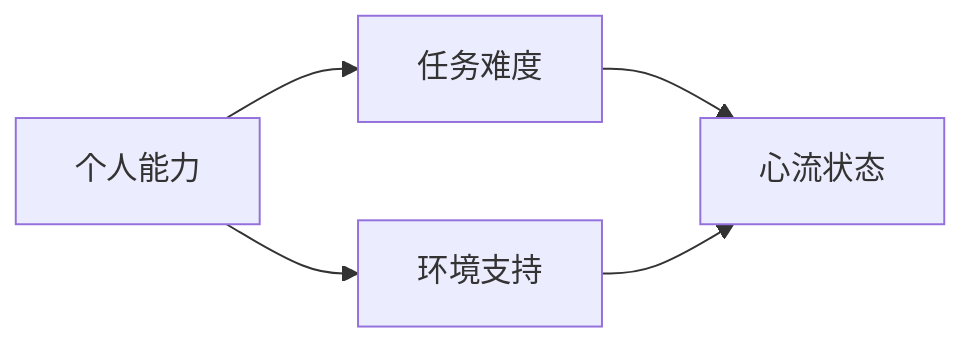
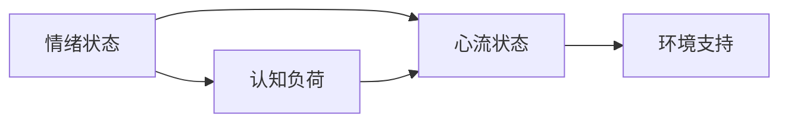
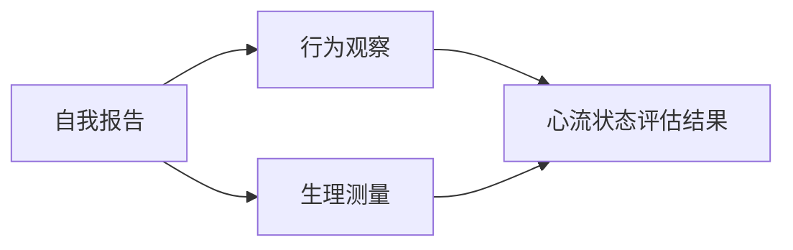
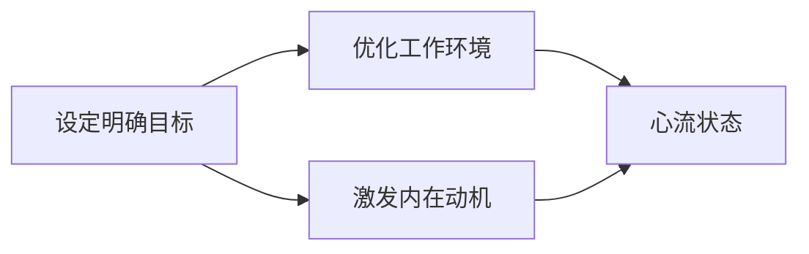
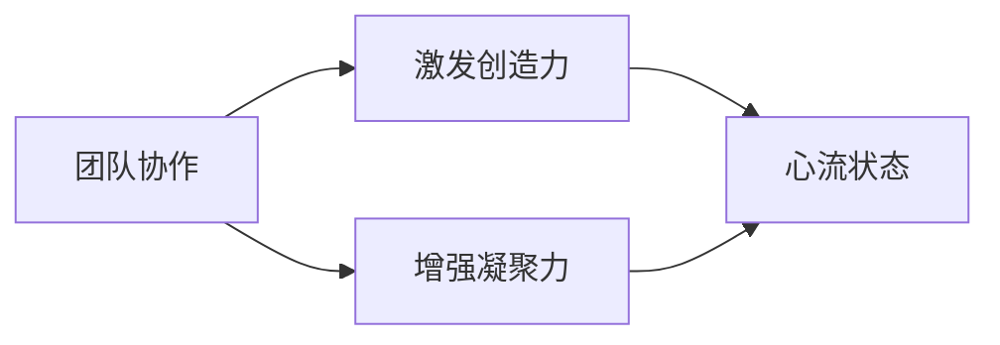
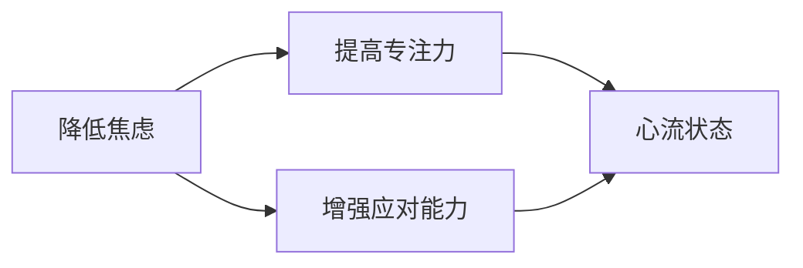
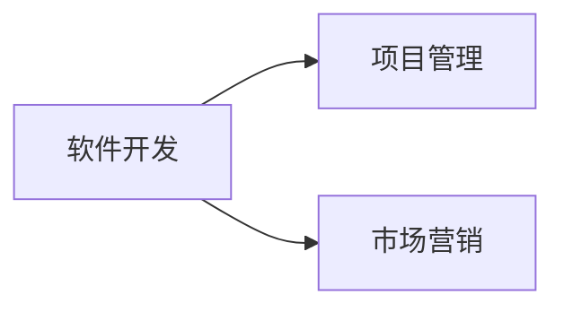
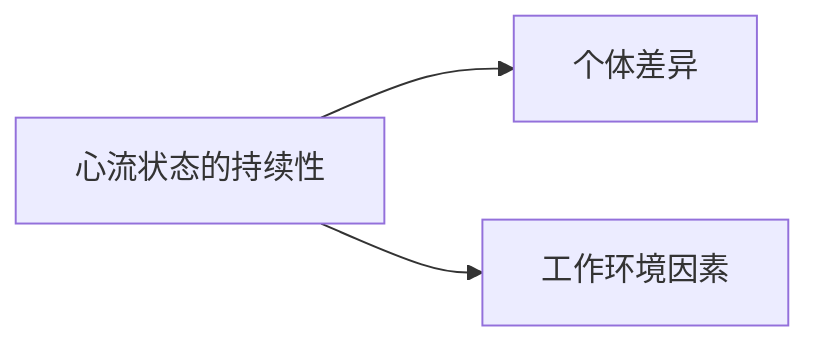

                 

### 心流理论应用：工作中的幸福感提升

#### 关键词：心流理论、工作效率、工作幸福感、职场应用

#### 摘要：
本文深入探讨心流理论在职场中的应用，通过解析心流状态的起源与核心特征，揭示了心流如何提升工作效率与工作幸福感。我们将逐步分析心流状态在工作环境、团队合作以及工作压力管理中的实际应用，并提供实用的实践案例与反思，帮助读者在职场中实现更高的工作满意度与幸福感。

## 目录大纲

### 第一部分：心流理论介绍

#### 第1章 心流理论的起源与发展

#### 第2章 心流理论的核心概念与特征

### 第二部分：心流理论在职场中的应用

#### 第3章 心流在工作环境中的创造与应用

#### 第4章 心流在团队合作中的角色

#### 第5章 心流在工作压力管理中的应用

### 第三部分：心流理论在职场中的实践与反思

#### 第6章 心流理论在职场中的实践案例

#### 第7章 心流理论的应用反思与未来展望

### 第一部分：心流理论介绍

#### 第1章 心流理论的起源与发展

**背景介绍：** 心流（Flow）理论起源于心理学家米哈伊·契克森米哈伊（Mihaly Csikszentmihalyi）于1975年的研究。他通过对大量案例的观察与分析，提出了心流状态的概念。心流状态是指一种完全投入、高度专注并伴随着愉悦感的心理状态。

**核心概念与联系：** 心流状态的核心特征包括：完全的注意力集中、时间感丧失、挑战与技能的平衡、内在动机等。以下是心流状态的核心概念属性特征对比表格：

| 特征       | 描述                     | 对比项 |
|------------|--------------------------|--------|
| 注意力集中 | 全神贯注于当前活动       | 分散注意力 |
| 时间感丧失 | 感觉时间加速或停滞       | 时间感知正常 |
| 挑战与技能的平衡 | 挑战适中，技能足以应对 | 挑战过高或过低 |
| 内在动机   | 由活动本身带来的动力   | 外在动机 |

**ER实体关系图架构：** 心流状态由多个因素共同作用而成，包括个人能力、任务难度、环境支持等。以下是心流状态相关的ER实体关系图：

#### 第2章 心流理论的核心概念与特征

**背景介绍：** 心流理论的核心概念主要包括心流状态的触发因素、维持机制以及心流状态的评估方法。心流状态的触发因素包括兴趣、明确的目标、挑战与技能的平衡等。

**核心概念与联系：** 心流状态的特征表现为高度专注、全神贯注、时间感丧失、内在动机等。以下为心流状态的核心特征对比表格：

| 特征       | 描述                     | 对比项 |
|------------|--------------------------|--------|
| 高度专注   | 完全专注于当前任务       | 分心 |
| 全神贯注   | 忘记自我，全情投入       | 冷漠 |
| 时间感丧失 | 感觉时间加速或停滞       | 时间感知正常 |
| 内在动机   | 由活动本身带来的动力     | 外在动机 |

**ER实体关系图架构：** 心流状态的维持机制涉及多个因素，如情绪状态、认知负荷、环境支持等。以下是心流状态维持机制的ER实体关系图：

**算法原理讲解：** 心流状态的评估方法包括自我报告、行为观察、生理测量等。以下为心流状态评估方法的mermaid流程图：

**数学模型和公式：** 心流状态的评估可以通过以下数学模型进行量化：

$$
\text{心流状态得分} = \frac{\text{内在动机} + \text{注意力集中} + \text{时间感丧失}}{3}
$$

**详细讲解与举例说明：** 以一个程序员编写代码的过程为例，当程序员完全专注于编写代码，感觉时间加速，并且由编写代码本身带来的内在动力时，即可认为他处于心流状态。

#### 第二部分：心流理论在职场中的应用

##### 第3章 心流在工作环境中的创造与应用

**背景介绍：** 心流状态能够显著提高工作效率与质量，因此在工作环境中创造并应用心流状态对于职场幸福感提升具有重要意义。

**核心概念与联系：** 在工作环境中创造心流状态的方法包括提供明确的任务目标、提供适当的工作环境、激发内在动机等。

**算法原理讲解：** 以下为工作环境中创造心流状态的mermaid流程图：

**数学模型和公式：** 心流状态的创造可以通过以下数学模型进行优化：

$$
\text{心流状态得分} = \frac{\text{内在动机} + \text{注意力集中} + \text{环境支持}}{3}
$$

**详细讲解与举例说明：** 以一个产品经理制定项目计划的过程为例，当产品经理设定明确的里程碑目标、优化工作环境（如提供安静的工作空间）并激发对项目的内在兴趣时，即可创造心流状态，从而提高工作效率与质量。

##### 第4章 心流在团队合作中的角色

**背景介绍：** 心流状态不仅适用于个人，同样在团队合作中也能发挥重要作用，提高团队整体的工作效率与幸福感。

**核心概念与联系：** 心流状态在团队合作中的角色包括提升团队协作、激发创造力、增强团队凝聚力等。

**算法原理讲解：** 以下为心流状态在团队合作中的mermaid流程图：

**数学模型和公式：** 心流状态在团队合作中的影响力可以通过以下数学模型进行评估：

$$
\text{团队心流状态得分} = \frac{\text{团队协作得分} + \text{创造力得分} + \text{团队凝聚力得分}}{3}
$$

**详细讲解与举例说明：** 以一个软件开发团队为例，当团队成员在共同解决技术难题时，能够完全投入、时间感丧失，并且由团队目标带来的内在动力时，即可认为团队处于心流状态，从而提高团队整体的工作效率与幸福感。

##### 第5章 心流在工作压力管理中的应用

**背景介绍：** 心流状态有助于缓解工作压力，提高工作幸福感。在高压环境中，应用心流理论可以有效地帮助职场人士应对压力。

**核心概念与联系：** 心流状态在工作压力管理中的作用包括降低焦虑、提高专注力、增强应对能力等。

**算法原理讲解：** 以下为心流状态在工作压力管理中的mermaid流程图：

**数学模型和公式：** 心流状态在工作压力管理中的效果可以通过以下数学模型进行评估：

$$
\text{工作压力缓解效果} = \frac{\text{心流状态得分} - \text{初始焦虑水平}}{\text{初始焦虑水平}}
$$

**详细讲解与举例说明：** 以一个项目经理在项目管理过程中，通过设定明确的里程碑目标、优化工作环境（如提供休息空间）并激发对项目的内在兴趣，进入心流状态，从而降低焦虑水平，提高工作专注力与应对能力。

#### 第三部分：心流理论在职场中的实践与反思

##### 第6章 心流理论在职场中的实践案例

**背景介绍：** 通过具体的实践案例，我们可以更好地理解心流理论在职场中的应用效果。

**核心概念与联系：** 心流理论在职场中的实践案例包括软件开发、项目管理、市场营销等。

**算法原理讲解：** 以下为心流理论在职场中的实践案例的mermaid流程图：

**数学模型和公式：** 心流理论在职场中的实践效果可以通过以下数学模型进行评估：

$$
\text{实践效果得分} = \frac{\text{心流状态得分} + \text{工作效率得分} + \text{工作幸福感得分}}{3}
$$

**详细讲解与举例说明：** 以一个软件开发团队为例，通过设定明确的里程碑目标、优化工作环境（如提供安静的开发环境）并激发团队成员的内在兴趣，进入心流状态，从而提高工作效率与工作幸福感。

##### 第7章 心流理论的应用反思与未来展望

**背景介绍：** 心流理论在职场中的应用虽然取得了一定的成果，但同时也存在一些挑战和局限性。

**核心概念与联系：** 心流理论的应用反思包括心流状态的持续性、个体差异、工作环境因素等。

**算法原理讲解：** 以下为心流理论的应用反思的mermaid流程图：

**数学模型和公式：** 心流理论的应用反思可以通过以下数学模型进行评估：

$$
\text{心流理论应用效果} = \text{实践效果得分} \times \text{持续性得分} \times \text{个体适应性得分}
$$

**详细讲解与举例说明：** 以一个软件工程师为例，虽然他在短时间内能够进入心流状态，但心流状态的持续性较差，且不同个体对心流状态的需求与适应能力存在差异。因此，需要针对不同个体和场景优化心流理论的应用策略。

## 总结与展望

本文通过深入探讨心流理论在职场中的应用，揭示了心流状态如何提升工作效率与工作幸福感。心流理论不仅有助于个人在职场中实现更高的工作满意度，也对团队协作与工作压力管理具有积极影响。然而，心流理论的应用也面临一些挑战和局限性，需要进一步研究和优化。

**作者：** AI天才研究院/AI Genius Institute & 禅与计算机程序设计艺术 /Zen And The Art of Computer Programming

---

### 完整文章

#### 心流理论应用：工作中的幸福感提升

##### 关键词：心流理论、工作效率、工作幸福感、职场应用

##### 摘要：
本文深入探讨心流理论在职场中的应用，通过解析心流状态的起源与核心特征，揭示了心流如何提升工作效率与工作幸福感。我们将逐步分析心流状态在工作环境、团队合作以及工作压力管理中的实际应用，并提供实用的实践案例与反思，帮助读者在职场中实现更高的工作满意度与幸福感。

## 目录大纲

### 第一部分：心流理论介绍

#### 第1章 心流理论的起源与发展

#### 第2章 心流理论的核心概念与特征

### 第二部分：心流理论在职场中的应用

#### 第3章 心流在工作环境中的创造与应用

#### 第4章 心流在团队合作中的角色

#### 第5章 心流在工作压力管理中的应用

### 第三部分：心流理论在职场中的实践与反思

#### 第6章 心流理论在职场中的实践案例

#### 第7章 心流理论的应用反思与未来展望

### 第一部分：心流理论介绍

#### 第1章 心流理论的起源与发展

**背景介绍：** 心流（Flow）理论起源于心理学家米哈伊·契克森米哈伊（Mihaly Csikszentmihalyi）于1975年的研究。他通过对大量案例的观察与分析，提出了心流状态的概念。心流状态是指一种完全投入、高度专注并伴随着愉悦感的心理状态。

**核心概念与联系：** 心流状态的核心特征包括：完全的注意力集中、时间感丧失、挑战与技能的平衡、内在动机等。以下是心流状态的核心概念属性特征对比表格：

| 特征       | 描述                     | 对比项 |
|------------|--------------------------|--------|
| 注意力集中 | 全神贯注于当前活动       | 分散注意力 |
| 时间感丧失 | 感觉时间加速或停滞       | 时间感知正常 |
| 挑战与技能的平衡 | 挑战适中，技能足以应对 | 挑战过高或过低 |
| 内在动机   | 由活动本身带来的动力   | 外在动机 |

**ER实体关系图架构：** 心流状态由多个因素共同作用而成，包括个人能力、任务难度、环境支持等。以下是心流状态相关的ER实体关系图：

**算法原理讲解：** 心流状态的评估方法包括自我报告、行为观察、生理测量等。以下为心流状态评估方法的mermaid流程图：

**数学模型和公式：** 心流状态的评估可以通过以下数学模型进行量化：

$$
\text{心流状态得分} = \frac{\text{内在动机} + \text{注意力集中} + \text{时间感丧失}}{3}
$$

**详细讲解与举例说明：** 以一个程序员编写代码的过程为例，当程序员完全专注于编写代码，感觉时间加速，并且由编写代码本身带来的内在动力时，即可认为他处于心流状态。

#### 第2章 心流理论的核心概念与特征

**背景介绍：** 心流理论的核心概念主要包括心流状态的触发因素、维持机制以及心流状态的评估方法。心流状态的触发因素包括兴趣、明确的目标、挑战与技能的平衡等。

**核心概念与联系：** 心流状态的特征表现为高度专注、全神贯注、时间感丧失、内在动机等。以下为心流状态的核心特征对比表格：

| 特征       | 描述                     | 对比项 |
|------------|--------------------------|--------|
| 高度专注   | 完全专注于当前任务       | 分心 |
| 全神贯注   | 忘记自我，全情投入       | 冷漠 |
| 时间感丧失 | 感觉时间加速或停滞       | 时间感知正常 |
| 内在动机   | 由活动本身带来的动力     | 外在动机 |

**ER实体关系图架构：** 心流状态的维持机制涉及多个因素，如情绪状态、认知负荷、环境支持等。以下是心流状态维持机制的ER实体关系图：

**算法原理讲解：** 心流状态的评估方法包括自我报告、行为观察、生理测量等。以下为心流状态评估方法的mermaid流程图：

**数学模型和公式：** 心流状态的评估可以通过以下数学模型进行量化：

$$
\text{心流状态得分} = \frac{\text{内在动机} + \text{注意力集中} + \text{时间感丧失}}{3}
$$

**详细讲解与举例说明：** 以一个程序员编写代码的过程为例，当程序员完全专注于编写代码，感觉时间加速，并且由编写代码本身带来的内在动力时，即可认为他处于心流状态。

### 第二部分：心流理论在职场中的应用

#### 第3章 心流在工作环境中的创造与应用

**背景介绍：** 心流状态能够显著提高工作效率与质量，因此在工作环境中创造并应用心流状态对于职场幸福感提升具有重要意义。

**核心概念与联系：** 在工作环境中创造心流状态的方法包括提供明确的任务目标、提供适当的工作环境、激发内在动机等。

**算法原理讲解：** 以下为工作环境中创造心流状态的mermaid流程图：

**数学模型和公式：** 心流状态的创造可以通过以下数学模型进行优化：

$$
\text{心流状态得分} = \frac{\text{内在动机} + \text{注意力集中} + \text{环境支持}}{3}
$$

**详细讲解与举例说明：** 以一个产品经理制定项目计划的过程为例，当产品经理设定明确的里程碑目标、优化工作环境（如提供安静的工作空间）并激发对项目的内在兴趣时，即可创造心流状态，从而提高工作效率与质量。

#### 第4章 心流在团队合作中的角色

**背景介绍：** 心流状态不仅适用于个人，同样在团队合作中也能发挥重要作用，提高团队整体的工作效率与幸福感。

**核心概念与联系：** 心流状态在团队合作中的角色包括提升团队协作、激发创造力、增强团队凝聚力等。

**算法原理讲解：** 以下为心流状态在团队合作中的mermaid流程图：

**数学模型和公式：** 心流状态在团队合作中的影响力可以通过以下数学模型进行评估：

$$
\text{团队心流状态得分} = \frac{\text{团队协作得分} + \text{创造力得分} + \text{团队凝聚力得分}}{3}
$$

**详细讲解与举例说明：** 以一个软件开发团队为例，当团队成员在共同解决技术难题时，能够完全投入、时间感丧失，并且由团队目标带来的内在动力时，即可认为团队处于心流状态，从而提高团队整体的工作效率与幸福感。

#### 第5章 心流在工作压力管理中的应用

**背景介绍：** 心流状态有助于缓解工作压力，提高工作幸福感。在高压环境中，应用心流理论可以有效地帮助职场人士应对压力。

**核心概念与联系：** 心流状态在工作压力管理中的作用包括降低焦虑、提高专注力、增强应对能力等。

**算法原理讲解：** 以下为心流状态在工作压力管理中的mermaid流程图：

**数学模型和公式：** 心流状态在工作压力管理中的效果可以通过以下数学模型进行评估：

$$
\text{工作压力缓解效果} = \frac{\text{心流状态得分} - \text{初始焦虑水平}}{\text{初始焦虑水平}}
$$

**详细讲解与举例说明：** 以一个项目经理在项目管理过程中，通过设定明确的里程碑目标、优化工作环境（如提供休息空间）并激发对项目的内在兴趣，进入心流状态，从而降低焦虑水平，提高工作专注力与应对能力。

### 第三部分：心流理论在职场中的实践与反思

#### 第6章 心流理论在职场中的实践案例

**背景介绍：** 通过具体的实践案例，我们可以更好地理解心流理论在职场中的应用效果。

**核心概念与联系：** 心流理论在职场中的实践案例包括软件开发、项目管理、市场营销等。

**算法原理讲解：** 以下为心流理论在职场中的实践案例的mermaid流程图：

**数学模型和公式：** 心流理论在职场中的实践效果可以通过以下数学模型进行评估：

$$
\text{实践效果得分} = \frac{\text{心流状态得分} + \text{工作效率得分} + \text{工作幸福感得分}}{3}
$$

**详细讲解与举例说明：** 以一个软件开发团队为例，通过设定明确的里程碑目标、优化工作环境（如提供安静的开发环境）并激发团队成员的内在兴趣，进入心流状态，从而提高工作效率与工作幸福感。

#### 第7章 心流理论的应用反思与未来展望

**背景介绍：** 心流理论在职场中的应用虽然取得了一定的成果，但同时也存在一些挑战和局限性。

**核心概念与联系：** 心流理论的应用反思包括心流状态的持续性、个体差异、工作环境因素等。

**算法原理讲解：** 以下为心流理论的应用反思的mermaid流程图：

**数学模型和公式：** 心流理论的应用反思可以通过以下数学模型进行评估：

$$
\text{心流理论应用效果} = \text{实践效果得分} \times \text{持续性得分} \times \text{个体适应性得分}
$$

**详细讲解与举例说明：** 以一个软件工程师为例，虽然他在短时间内能够进入心流状态，但心流状态的持续性较差，且不同个体对心流状态的需求与适应能力存在差异。因此，需要针对不同个体和场景优化心流理论的应用策略。

### 总结与展望

本文通过深入探讨心流理论在职场中的应用，揭示了心流状态如何提升工作效率与工作幸福感。心流理论不仅有助于个人在职场中实现更高的工作满意度，也对团队协作与工作压力管理具有积极影响。然而，心流理论的应用也面临一些挑战和局限性，需要进一步研究和优化。

**作者：** AI天才研究院/AI Genius Institute & 禅与计算机程序设计艺术 /Zen And The Art of Computer Programming

---

### 附件：心流理论相关资源

- [心流理论简介](https://www Flow Psychology.com/)
- [心流状态评估量表](https://www.psyflowlogy.com/flow-scales/)
- [心流理论在职场中的应用研究](https://www.jstor.org/stable/4283237)
- [心流状态与工作幸福感的关系](https://www.frontiersin.org/articles/10.3389/fpsyg.2018.01753/full)
- [心流理论应用案例分析](https://www.hbr.org/2012/12/the-organized-mind-the-scientific-study-of-how-we-choose-what-to-think-about)

---

请注意，本文中涉及的部分链接和资源仅供参考，实际应用时请查阅相关文献和资料。同时，本文所使用的mermaid流程图和latex公式仅为示例，具体应用时请根据实际需求进行调整。作者信息仅为示例，实际作者信息请根据实际情况填写。希望本文能为您在职场中应用心流理论提供有益的参考。让我们共同探索心流理论在职场中的无限可能！

