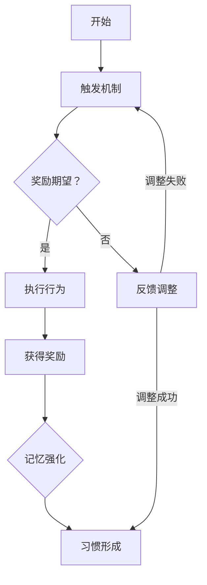
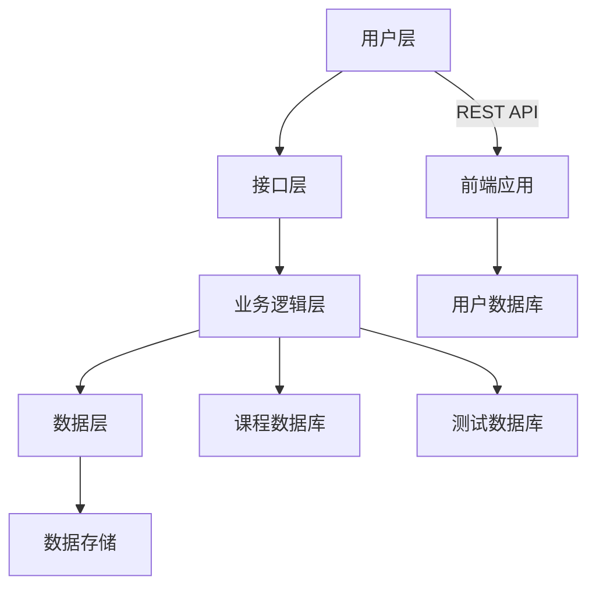
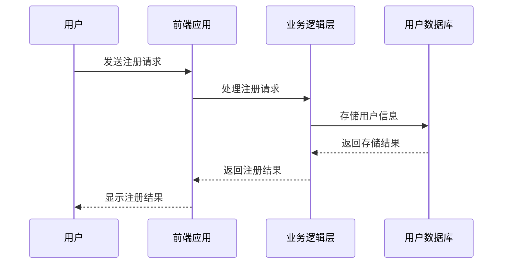

                 

# 《心灵的滋润：培养精神生活的习惯》

## 关键词

- 精神生活
- 心灵滋润
- 习惯培养
- 自我认知
- 心理健康
- 社区规划

## 摘要

在快节奏的现代生活中，精神生活的质量对于个人的幸福和健康至关重要。本文将探讨如何通过培养良好的精神生活习惯，提高心灵滋润程度，从而增强心理韧性，提升生活质量。我们将从背景介绍、核心概念与联系、习惯培养原理、实践方法、个性化规划以及最佳实践等方面展开深入讨论。

## 背景介绍

### 精神生活的概念与重要性

精神生活是人类生活中不可或缺的一部分，它涵盖了人们的情感、认知、信仰、审美等多个方面。一个丰富、充实的精神生活不仅能带来内心的平静和满足，还能提升人的整体幸福感。在现代社会，随着工作压力和生活节奏的加快，人们的精神生活面临着诸多挑战。焦虑、抑郁等心理问题日益普遍，对个体的身心健康产生了严重影响。因此，培养良好的精神生活习惯，提高心灵滋润程度，成为了当代人追求幸福生活的重要途径。

### 现代社会中的精神挑战

现代社会中，人们面临的精神挑战主要包括工作压力、人际关系、社交网络依赖、精神孤独等。首先，工作压力导致许多人身心疲惫，心理负担加重。其次，复杂的人际关系使得人们感到压力倍增，容易陷入焦虑和抑郁。此外，社交网络的普及虽然带来了便利，但同时也使得许多人沉迷于虚拟世界，忽视了现实生活中的互动和沟通。最后，精神孤独是一个普遍存在的问题，特别是在城市化进程中，人们的生活节奏加快，导致社交圈子缩小，精神孤独感增强。

### 精神生活的现状分析

当前，人们对精神生活的重视程度逐渐提高，但仍存在诸多不足。一方面，许多人缺乏对精神生活的正确认识和理解，认为精神生活仅仅是情感和娱乐的延伸。另一方面，尽管有许多人意识到了精神生活的重要性，但缺乏有效的培养方法和实践途径。此外，社会环境和教育资源也对精神生活的质量产生了影响，一些地区和精神健康服务的不足使得精神生活质量的提升面临困难。

## 核心概念与联系

### 心灵滋润的定义

心灵滋润是指通过一系列积极的行为和习惯，使个体的心灵得到滋养、舒缓和平静的过程。它不仅包括情感上的满足，还涉及认知、信仰、审美等多个层面。心灵滋润的目标是提升个体的精神生活质量，增强心理韧性，使个体在面对挑战和困难时能够保持积极和乐观的态度。

### 心灵滋润与精神生活的关系

心灵滋润与精神生活密切相关，它们是相辅相成的。良好的精神生活为心灵滋润提供了基础，而心灵滋润则能进一步丰富和提升精神生活的质量。例如，通过冥想、阅读、艺术创作等活动，个体可以培养出更加敏锐的感知力和情感表达能力，从而在精神生活中获得更深层次的满足和享受。

### 核心概念对比分析

为了更好地理解心灵滋润与精神生活的关系，我们可以通过对比表格和ER实体关系图来展示这两个概念及其相互关系。

| 概念           | 定义                                                         | 关系                             |
|----------------|--------------------------------------------------------------|--------------------------------|
| 精神生活       | 个体在情感、认知、信仰、审美等方面的总体体验和生活状态。       | 为心灵滋润提供基础和支撑。       |
| 心灵滋润       | 通过积极的行为和习惯，使个体的心灵得到滋养、舒缓和平静的过程。 | 丰富和提升精神生活的质量。       |

以下是ER实体关系图的Markdown格式示例：

```mermaid
erDiagram
  精神生活 ||--|{ 心灵滋润 }
  精神生活 ||--|{ 心理健康 }
  心灵滋润 ||--|{ 精神满足感 }
  心灵滋润 ||--|{ 心理韧性 }
```

在这个ER实体关系图中，我们可以看到精神生活与心灵滋润之间存在双向影响关系，同时心灵滋润也对心理健康和精神满足感产生影响。

## 算法原理讲解

### 习惯形成的科学原理

习惯的形成是一个复杂的心理过程，涉及到神经可塑性、奖励机制等多个方面。以下是一个简化的算法流程图，用于描述习惯形成的过程。



### 习惯培养的策略

要培养良好的习惯，需要采取一系列策略，包括设定明确的目标、逐步建立行为模式、强化正向反馈等。以下是一个使用Python源代码来解释习惯培养策略的示例：

```python
import random

def habit_building_strategy(target_habit, num_days):
    """
    使用Python代码模拟习惯培养策略
    :param target_habit: 目标习惯
    :param num_days: 模拟的天数
    :return: 习惯形成的过程记录
    """
    habit_log = []
    reward_system = [random.randint(0, 10) for _ in range(num_days)]
    
    for day in range(num_days):
        if random.random() < 0.5:  # 触发目标习惯的概率
            habit_log.append((day, target_habit, "完成"))
            if reward_system[day] > 7:  # 奖励机制
                habit_log[-1] = (day, target_habit, "完成 + 奖励")
        else:
            habit_log.append((day, target_habit, "未完成"))
    
    return habit_log

# 示例：培养每日阅读的习惯
target_habit = "每日阅读"
num_days = 30
habit_log = habit_building_strategy(target_habit, num_days)

for entry in habit_log:
    print(f"第{entry[0]}天：{entry[1]} - {entry[2]}")
```

### 坏习惯的克服方法

坏习惯的形成往往伴随着负向反馈和不良后果。要克服坏习惯，可以采取以下策略：

1. **识别坏习惯**：首先要明确自己有哪些坏习惯，如拖延、过度消费等。
2. **制定替代行为**：为每个坏习惯制定一个积极的替代行为，如拖延时进行运动或阅读。
3. **逐步减少依赖**：逐步减少坏习惯的频率，直到完全克服。
4. **积极反馈**：每次克服坏习惯后，给自己一些积极的反馈，如奖励或自我鼓励。

### 数学模型和数学公式

为了更深入地理解习惯培养的过程，我们可以使用数学模型来描述习惯形成和改变的规律。以下是一个简单的Sigmoid函数模型，用于描述习惯形成的过程：

$$
f(x) = \frac{1}{1 + e^{-k(x - c)}}
$$

其中，$x$ 代表行为的执行次数，$k$ 是学习率，$c$ 是临界值。当$x$ 超过临界值$c$ 时，函数值接近1，表示习惯已经形成；当$x$ 低于临界值$c$ 时，函数值接近0，表示习惯尚未形成。

### 系统分析与架构设计方案

#### 问题场景介绍

假设我们要开发一个在线心理健康服务平台，旨在帮助用户培养良好的精神生活习惯，提高心理健康水平。平台将提供包括自我认知测试、习惯培养计划、心理健康课程等多种功能。

#### 项目的概述

项目名称：心灵滋养平台（Spiritual Nourishment Platform，SNP）

目标用户：有心理健康需求的个人、心理咨询师、教育机构

主要功能：

1. 自我认知测试：帮助用户了解自己的心理状态和心理健康水平。
2. 习惯培养计划：根据用户的兴趣和需求，提供个性化的习惯培养方案。
3. 心理健康课程：提供在线心理健康课程，帮助用户提升心理健康知识。

#### 系统功能设计

1. 用户注册与登录：支持用户注册、登录、信息管理等功能。
2. 自我认知测试：提供多种自我认知测试，如压力测试、焦虑测试等。
3. 习惯培养计划：根据用户兴趣和需求，定制个性化的习惯培养计划。
4. 心理健康课程：提供多样化的心理健康课程，包括视频课程、文字教程等。
5. 数据分析与管理：对用户行为和心理健康数据进行分析和管理。

#### 系统架构设计

以下是SNP系统的架构设计：



在这个架构设计中，用户层通过接口层与业务逻辑层进行交互，业务逻辑层负责处理用户的请求和数据存储，数据层则包括用户数据库、课程数据库和测试数据库，用于存储相关数据。

#### 系统接口设计

以下是一个简单的用户注册接口设计：

```json
POST /register
{
  "username": "string",
  "password": "string",
  "email": "string",
  "phone": "string"
}
```

#### 系统交互

以下是SNP系统的一个简单的序列图，展示了用户注册的交互过程：



### 项目实战

#### 环境安装

为了搭建SNP系统，我们需要安装以下软件和工具：

1. Python 3.x
2. Django 3.x
3. Django REST Framework
4. PostgreSQL
5. Docker

安装步骤如下：

1. 安装Python 3.x：从[Python官方网站](https://www.python.org/)下载Python安装包并安装。
2. 安装Django 3.x：打开终端，执行以下命令：
   ```shell
   pip install django==3.2
   ```
3. 安装Django REST Framework：执行以下命令：
   ```shell
   pip install djangorestframework==3.12
   ```
4. 安装PostgreSQL：从[PostgreSQL官方网站](https://www.postgresql.org/)下载安装包并安装。
5. 安装Docker：从[Docker官方网站](https://www.docker.com/)下载安装包并安装。

#### 系统核心实现源代码

以下是SNP系统的一个核心实现示例，包括用户注册功能：

```python
# settings.py
INSTALLED_APPS = [
    'django.contrib.admin',
    'django.contrib.auth',
    'django.contrib.contenttypes',
    'django.contrib.sessions',
    'django.contrib.messages',
    'django.contrib.staticfiles',
    'rest_framework',
    'users',
]

DATABASES = {
    'default': {
        'ENGINE': 'django.db.backends.postgresql',
        'NAME': 'snptest',
        'USER': 'snptestuser',
        'PASSWORD': 'snptestpass',
        'HOST': '127.0.0.1',
        'PORT': '5432',
    }
}

# users/models.py
from django.contrib.auth.models import AbstractUser
from django.db import models

class CustomUser(AbstractUser):
    email = models.EmailField(unique=True)

# users/serializers.py
from rest_framework import serializers
from .models import CustomUser

class UserRegistrationSerializer(serializers.ModelSerializer):
    class Meta:
        model = CustomUser
        fields = ['id', 'username', 'email', 'password']
        extra_kwargs = {'password': {'write_only': True}}

class Meta:
    model = CustomUser
    fields = '__all__'

# users/views.py
from rest_framework import status
from rest_framework.response import Response
from rest_framework.views import APIView
from .serializers import UserRegistrationSerializer

class UserRegistrationView(APIView):
    def post(self, request):
        serializer = UserRegistrationSerializer(data=request.data)
        if serializer.is_valid():
            serializer.save()
            return Response({"message": "User registered successfully!"}, status=status.HTTP_201_CREATED)
        return Response(serializer.errors, status=status.HTTP_400_BAD_REQUEST)
```

#### 代码应用解读与分析

1. **settings.py**：配置了Django项目的基础设置，包括安装的应用、数据库配置等。
2. **users/models.py**：自定义用户模型，继承了Django的AbstractUser类，并添加了电子邮件字段。
3. **users/serializers.py**：定义了用户注册序列化器，用于处理用户数据的序列化和验证。
4. **users/views.py**：定义了用户注册视图，用于处理用户注册的HTTP请求，并返回相应的响应。

#### 实际案例分析和详细讲解剖析

假设有一个用户名为“alice”的用户尝试注册，以下是详细的步骤和结果：

1. 用户在浏览器中填写注册表单，提交包含用户名（alice）、电子邮件（alice@example.com）和密码的HTTP POST请求。
2. Django后端接收到请求后，将请求数据传递给`UserRegistrationView`视图。
3. `UserRegistrationView`视图调用`UserRegistrationSerializer`序列化器，对请求数据进行验证。
4. 如果验证通过，序列化器将创建一个`CustomUser`对象，并将其保存到数据库中。
5. 后端返回HTTP 201 Created响应，并显示注册成功的消息。

#### 项目小结

通过本次实战，我们成功搭建了一个简单的在线心理健康服务平台，并实现了用户注册功能。接下来，可以继续开发其他功能，如自我认知测试、习惯培养计划等，以提升平台的功能性和用户体验。

### 最佳实践 tips、小结、注意事项、拓展阅读

#### 最佳实践 tips

1. **定期自我反思**：每天花几分钟时间反思自己的精神生活，思考自己在哪些方面做得好，哪些方面需要改进。
2. **设定具体目标**：在培养精神生活习惯时，设定具体、可衡量、可实现的目标，以便更好地跟踪和评估进展。
3. **找到适合自己的方法**：不同的习惯培养方法适合不同的人，可以尝试多种方法，找到最适合自己的方式。

#### 小结

本文探讨了通过培养良好的精神生活习惯来提高心灵滋润程度的重要性，介绍了相关核心概念、算法原理和实践方法。通过系统分析和项目实战，我们展示了如何将理论应用于实际项目中，实现心理健康服务平台的搭建。

#### 注意事项

1. **持续关注**：心理健康是一个持续的过程，需要长期关注和投入。
2. **尊重个体差异**：不同的个体在培养精神生活习惯时，可能需要采取不同的方法和策略。
3. **寻求专业帮助**：在遇到心理问题时，及时寻求专业心理咨询师的帮助。

#### 拓展阅读

1. 《心理学与生活》 - 菲利普·津巴多（Philip Zimbardo）
2. 《如何赢得友谊与影响他人》 - 戴尔·卡耐基（Dale Carnegie）
3. 《自控力》 - 凯利·麦格尼格尔（Kelly McGonigal）

### 作者信息

作者：AI天才研究院/AI Genius Institute & 禅与计算机程序设计艺术 /Zen And The Art of Computer Programming

