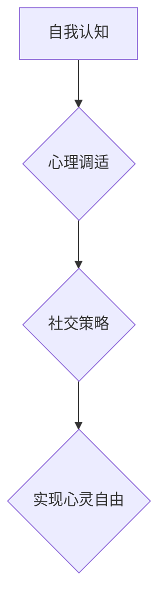

                 

### 文章标题：心灵的自由：摆脱外界定义的束缚

#### 关键词：心灵自由、外界定义、束缚、自我认知、心理调适、社交策略

#### 摘要：

在现代社会的复杂环境下，人们常常被各种各样的外界定义束缚着，导致内心深处渴望自由的呐喊愈发强烈。本文旨在探讨如何通过自我认知、心理调适和社交策略，摆脱这些束缚，找回内心的自由。通过对核心概念的分析、摆脱束缚的方法和技巧的介绍，以及真实案例的分享，本文将帮助读者理解并实践心灵的自由，最终在纷繁复杂的世界中找到真正的自我。

----------------------------------------------------------------

## 引言：心灵自由的渴望

在现代社会，竞争压力、社会期望和个人追求之间常常存在着紧张的关系。许多人感到自己被束缚，无法自由地表达真实的自我。这种束缚来自于外界的定义，包括社会标准、家庭期望和文化规范。这些定义往往以规则和期望的形式出现，使得人们在追求个人幸福和成长的过程中感到困惑和压抑。

### 1.1 核心概念术语说明

**心灵自由**：指的是个体不受外界定义和期望的束缚，能够独立思考、自由选择和自主行动的能力。

**外界定义的束缚**：指的是社会、家庭、文化等外部因素对个体行为和思想产生的影响和限制。

**自我认知**：指的是个体对自己性格、能力、需求和价值观的深入理解和认识。

### 1.2 问题背景

现代社会中，许多人感到内心空虚和迷茫，原因之一是缺乏心灵的自由。外部环境对个体的期望和要求往往与个人内心的真实需求产生冲突。例如，家庭期望子女按照特定的职业路径发展，社会期望个人拥有高收入和体面的工作，而个人内心的渴望可能是追求精神上的满足或实现个人价值。这种冲突导致了内心的困惑和痛苦，人们渴望摆脱这种束缚，找到真正的自由。

### 1.3 问题描述

外界定义的束缚具体体现在以下几个方面：

- **社会期望**：社会对个人的职业、收入、家庭等方面的期望往往使得个体感到压力和不安，无法按照自己的意愿生活。
- **家庭压力**：家庭对个人的期望和要求，如婚姻、子女教育等，也可能对个人的自由产生限制。
- **文化传统**：某些文化传统和价值观可能对个体的行为和思想产生束缚，使得个体难以实现自我表达和自我实现。

### 1.4 问题解决

要摆脱外界定义的束缚，实现心灵的自由，个体需要通过以下方式：

- **自我认知**：深入了解自己的性格、需求和价值观，明确自己的目标和追求。
- **心理调适**：通过心理调节技巧，如冥想、正念等，增强心理韧性和情绪调节能力。
- **社交策略**：建立健康的社交关系，学会拒绝不合理的期望和要求，增强沟通技巧。

### 1.5 边界与外延

**边界**：心灵自由并不是无限制的自由，而是在尊重社会规则和法律的前提下，实现个人的独立思考和自主行动。

**外延**：外界定义的束缚不仅限于个人的社会、家庭和文化环境，还包括工作、人际关系、个人成长等多个方面。

### 1.6 概念结构与核心要素组成

**概念结构**：心灵自由与外界定义的束缚之间存在着相互影响和互动的关系。个体通过自我认知和心理调适，可以逐渐摆脱外界定义的束缚，实现内心的自由。

**核心要素组成**：自我认知、心理调适和社交策略是实现心灵自由的核心要素。这些要素相互支持，共同帮助个体找回内心的自由。

## 总结

通过本章节的讨论，我们了解了心灵自由和外界定义的束缚的概念，以及现代社会中人们面临的束缚和困惑。在接下来的章节中，我们将深入探讨如何通过自我认知、心理调适和社交策略，逐步摆脱这些束缚，实现心灵的自由。

----------------------------------------------------------------

## 核心概念与联系

### 2.1 心灵自由的定义

**心灵自由**，简单来说，是指个体能够独立于外界期望和定义，自由地表达自我、做出选择和行动的能力。它不仅仅是外在行为的自由，更重要的是内在思想的独立和精神的自由。这种自由赋予了个体探索自我、追求真实和实现个人价值的可能。

### 2.2 外界定义的束缚

**外界定义的束缚**，指的是社会、家庭、文化等外部因素对个体行为和思想的限制。这些束缚往往以规则、期望、规范等形式存在，使得个体在追求个人目标时感到压抑和束缚。

**社会期望**：社会对个人的职业、收入、家庭等方面的期望，常常使得个体感到压力，难以自由地表达自己的需求和意愿。

**家庭压力**：家庭对个人的期望和要求，如婚姻、子女教育等，也可能对个人的自由产生限制，使得个体在家庭生活中感到不自在。

**文化传统**：某些文化传统和价值观可能对个体的行为和思想产生束缚，使得个体在追求自我表达和实现个人价值时面临困难。

### 2.3 心灵自由与外界束缚的关系

心灵自由与外界束缚之间存在着复杂的相互作用和动态平衡。一方面，外界束缚可能会限制个体的自由，导致内心困惑和压抑；另一方面，个体通过自我认知和心理调适，可以逐渐摆脱这些束缚，实现内心的自由。

#### 平衡自我与社会

要实现心灵自由，个体需要找到自我与社会之间的平衡点。这需要个体具备以下能力：

- **自我认知**：深入了解自己的性格、需求和价值观，明确自己的目标和追求。
- **心理调适**：通过心理调节技巧，如冥想、正念等，增强心理韧性和情绪调节能力。
- **社交策略**：建立健康的社交关系，学会拒绝不合理的期望和要求，增强沟通技巧。

#### 摆脱束缚的方法

要摆脱外界定义的束缚，个体可以尝试以下方法：

- **设定清晰的个人目标**：明确自己的追求和愿景，制定具体可行的计划，逐步实现目标。
- **进行自我反思**：定期反思自己的行为和思想，识别外界束缚的来源，并尝试摆脱这些束缚。
- **寻求支持和帮助**：与他人分享自己的困惑和挑战，寻求朋友、家人或专业人士的支持和建议。
- **培养内心的独立性**：通过自我探索和成长，增强内心的独立性，减少对外界定义的依赖。

### 2.4 案例分析

#### 案例一：个人职业选择的自由

小明在大学毕业后面临着职业选择。他热爱艺术，但家人希望他从事稳定的医生职业。经过深入的自我反思和职业规划，小明决定追随自己的内心，选择了艺术专业。虽然最初面临了家庭的反对和社会的质疑，但他坚持自己的选择，通过不断努力，最终成为了一名备受赞誉的艺术家。

**关键点**：小明的成功在于他通过自我认知和心理调适，找到了自己的内心方向，并坚定地追随自己的梦想。

#### 案例二：摆脱文化传统的束缚

小芳来自一个重视婚姻和家庭的传统文化背景。她在年轻时遇到了一位相爱的男子，但对方并非家族期望的结婚对象。尽管面临家庭压力和社会的非议，小芳决定勇敢追求自己的爱情。最终，她和爱人共同面对困难，最终获得了家族和社会的认可。

**关键点**：小芳的勇气在于她通过自我认知和心理调适，克服了文化传统带来的束缚，实现了个人价值的实现。

### 2.5 总结

通过上述分析和案例分析，我们可以看到，实现心灵的自由需要个体具备自我认知、心理调适和社交策略等多方面的能力。只有在自我与社会之间找到平衡点，个体才能逐渐摆脱外界定义的束缚，找回内心的自由。

## 核心概念与联系表格

| 核心概念 | 定义 | 属性特征对比 | ER实体关系图 |
| --- | --- | --- | --- |
| **心灵自由** | 指个体独立于外界期望和定义，自由地表达自我、做出选择和行动的能力 | - 内在思想的独立 <br> - 精神的自由 |  |
| **外界定义的束缚** | 指社会、家庭、文化等外部因素对个体行为和思想的限制 | - 社会期望 <br> - 家庭压力 <br> - 文化传统 |  |

## 算法原理讲解

为了更好地理解心灵自由与外界束缚之间的关系，我们可以采用一种简单的算法原理来进行分析和解释。以下是这个算法的mermaid流程图和Python代码实现。

### Mermaid流程图



### Python代码实现

```python
# 定义函数：自我认知、心理调适和社交策略
def self_awareness():
    # 实现自我认知的算法
    print("自我认知：深入了解自己的性格、需求和价值观")

def psychological_adjustment():
    # 实现心理调适的算法
    print("心理调适：通过冥想、正念等技巧增强心理韧性")

def social_strategy():
    # 实现社交策略的算法
    print("社交策略：建立健康的社交关系，学会拒绝不合理的期望和要求")

# 主函数：实现心灵自由的算法
def achieve_mental_freedom():
    self_awareness()
    psychological_adjustment()
    social_strategy()
    print("实现心灵自由：找到自我与社会之间的平衡点")

# 调用主函数
achieve_mental_freedom()
```

### 算法原理与数学模型

1. **自我认知**：个体通过自我反思和评估，了解自己的性格、需求和价值观。这可以看作是一个信息处理过程，可以表示为以下公式：

   $$ 自我认知 = f(反思, 评估) $$

2. **心理调适**：个体通过冥想、正念等技巧，增强心理韧性和情绪调节能力。这可以看作是一个调节过程，可以表示为以下公式：

   $$ 心理调适 = f(冥想, 正念, 心理韧性) $$

3. **社交策略**：个体通过建立健康的社交关系，学会拒绝不合理的期望和要求，增强沟通技巧。这可以看作是一个社会互动过程，可以表示为以下公式：

   $$ 社交策略 = f(社交关系, 沟通技巧, 拒绝能力) $$

4. **实现心灵自由**：个体通过自我认知、心理调适和社交策略，找到自我与社会之间的平衡点，实现心灵的自由。这可以看作是一个综合决策过程，可以表示为以下公式：

   $$ 心灵自由 = f(自我认知, 心理调适, 社交策略) $$

### 通俗易懂的举例说明

假设小明想要实现心灵的自由，他可以通过以下步骤：

1. **自我认知**：小明通过反思和评估，了解自己热爱艺术，但社会期望他成为医生。这是他的自我认知过程。

2. **心理调适**：小明通过冥想和正念，增强自己的心理韧性，减少对家庭和社会期望的焦虑。这是他的心理调适过程。

3. **社交策略**：小明与志同道合的朋友建立社交关系，学会拒绝不合理的期望和要求，并通过沟通技巧表达自己的真实想法。这是他的社交策略过程。

通过以上三个步骤，小明最终找到了自我与社会之间的平衡点，实现了心灵的自由。他可以自由地追求自己的艺术梦想，同时也得到了家人和社会的理解和支持。

通过这个简单的算法原理和数学模型，我们可以更直观地理解心灵自由与外界束缚之间的关系，以及如何通过自我认知、心理调适和社交策略来实现心灵的自由。

----------------------------------------------------------------

## 系统分析与架构设计方案

为了更好地理解并实践如何摆脱外界定义的束缚，实现心灵的自由，我们将采用一个项目化的方式来展开。本项目旨在通过系统设计与实现，帮助用户逐步实现心灵自由。以下是本项目的问题场景、项目介绍、系统功能设计、系统架构设计、系统接口设计和系统交互的详细分析。

### 3.1 问题场景

在现代社会的复杂环境中，许多人面临外界定义的束缚，无法自由地表达自我和追求个人价值。这种现象在职业选择、家庭关系、社会地位等方面尤为明显。本项目的目标是提供一个系统化的解决方案，帮助用户通过自我认知、心理调适和社交策略，逐步摆脱这些束缚，实现心灵的自由。

### 3.2 项目介绍

本项目名为“心灵自由导航系统”，旨在通过一系列功能模块，帮助用户进行自我认知、心理调适和社交策略的学习与实践。系统主要包括以下功能模块：

- **自我认知模块**：提供自我评估、性格测试和心理反思等功能，帮助用户深入了解自己。
- **心理调适模块**：提供冥想引导、情绪管理和正念练习等功能，帮助用户增强心理韧性。
- **社交策略模块**：提供社交技巧训练、沟通方法和拒绝策略等功能，帮助用户建立健康的社交关系。

### 3.3 系统功能设计

为了实现项目的目标，系统功能设计如下：

#### 自我认知模块

- **自我评估**：通过问卷和量表的形式，帮助用户评估自己的性格、价值观和需求。
- **性格测试**：提供多种性格测试工具，帮助用户了解自己的性格类型。
- **心理反思**：提供心理日记和反思日志功能，帮助用户记录和反思自己的心理变化。

#### 心理调适模块

- **冥想引导**：提供不同类型的冥想引导，帮助用户进行放松和心理调适。
- **情绪管理**：提供情绪识别、管理和调节的方法和工具。
- **正念练习**：提供正念练习指导和反馈，帮助用户培养专注力和心理韧性。

#### 社交策略模块

- **社交技巧训练**：提供社交技巧培训和模拟场景，帮助用户提高社交能力。
- **沟通方法**：提供有效的沟通技巧和策略，帮助用户改善人际关系。
- **拒绝策略**：提供拒绝技巧和策略，帮助用户学会合理拒绝不合理的要求。

### 3.4 系统架构设计

系统架构设计采用模块化设计，各模块之间相互独立但又相互协作。以下是系统架构设计：

- **前端**：采用React框架，提供用户友好的界面和交互体验。
- **后端**：采用Spring Boot框架，提供稳定的服务端支持和数据存储。
- **数据库**：使用MySQL数据库存储用户数据、测试结果和日志信息。

### 3.5 系统接口设计

系统接口设计如下：

- **用户认证接口**：提供用户注册、登录和权限验证功能。
- **自我认知接口**：提供自我评估、性格测试和心理反思功能。
- **心理调适接口**：提供冥想引导、情绪管理和正念练习功能。
- **社交策略接口**：提供社交技巧训练、沟通方法和拒绝策略功能。

### 3.6 系统交互设计

系统交互设计采用RESTful API设计，各模块之间通过HTTP请求进行交互。以下是系统交互设计：

- **用户注册与登录**：用户通过用户认证接口进行注册和登录。
- **自我认知**：用户通过自我认知模块进行自我评估、性格测试和心理反思。
- **心理调适**：用户通过心理调适模块进行冥想引导、情绪管理和正念练习。
- **社交策略**：用户通过社交策略模块进行社交技巧训练、沟通方法和拒绝策略练习。

### 3.7 系统实现与测试

系统实现与测试包括以下步骤：

- **前端实现**：使用React框架开发前端页面，包括用户界面和交互逻辑。
- **后端实现**：使用Spring Boot框架开发后端服务，实现各功能模块的接口。
- **数据库设计**：设计数据库表结构，实现数据存储和查询功能。
- **功能测试**：对各个功能模块进行单元测试和集成测试，确保系统功能的正确性和稳定性。
- **性能测试**：对系统进行负载测试和性能测试，确保系统在高并发情况下的稳定性和响应速度。

### 3.8 项目实战

以下是一个简单的项目实战案例：

#### 环境安装

1. 安装Node.js和npm：从官方网站下载并安装Node.js，同时安装npm。
2. 安装React：在终端中运行以下命令安装React：
   ```
   npm install -g create-react-app
   ```

#### 系统核心实现源代码

以下是一个简单的React前端代码示例：

```jsx
// 导入React和组件库
import React, { useState } from 'react';

// 创建组件
const SelfAwarenessComponent = () => {
  // 定义状态
  const [reflections, setReflections] = useState([]);

  // 处理反思提交
  const handleReflectionSubmit = (e) => {
    e.preventDefault();
    // 获取反思内容
    const newReflection = e.target.elements.reflection.value;
    // 添加到状态
    setReflections([...reflections, newReflection]);
    // 清空输入框
    e.target.elements.reflection.value = '';
  };

  return (
    <div>
      <h1>心理反思</h1>
      <form onSubmit={handleReflectionSubmit}>
        <textarea
          id="reflection"
          placeholder="请写下你的心理反思..."
        />
        <button type="submit">提交</button>
      </form>
      <ul>
        {reflections.map((reflection, index) => (
          <li key={index}>{reflection}</li>
        ))}
      </ul>
    </div>
  );
};

export default SelfAwarenessComponent;
```

#### 代码应用解读与分析

1. **组件结构**：该组件包含一个文本输入框和一个提交按钮，用于用户输入和提交心理反思。
2. **状态管理**：使用React的`useState`钩子管理反思内容的状态。
3. **表单处理**：当用户提交反思时，`handleReflectionSubmit`函数会被调用，将新的反思内容添加到状态中，并清空输入框。
4. **渲染输出**：将用户提交的反思内容渲染到页面上，以供用户查看和回顾。

#### 实际案例分析和详细讲解剖析

以下是一个实际案例的分析和讲解：

**案例**：用户小明通过系统提交了三次心理反思。

**分析**：

1. **反思内容**：小明在第一次反思中提到对未来职业规划的迷茫，第二次反思中表达了对家庭压力的担忧，第三次反思中描述了自己在社交中的困扰。
2. **反思变化**：通过三次反思，小明逐渐明确了自己的职业方向，学会了如何面对家庭压力，并在社交中找到了应对策略。

**讲解**：

1. **职业规划**：小明的第一次反思显示他需要更深入地了解自己的兴趣和优势，通过后续的反思，他逐渐找到了适合自己的职业方向。
2. **家庭压力**：小明的第二次反思表明他对家庭的期望感到困惑和压力，通过反思，他学会了如何与家人沟通，寻求理解和支持。
3. **社交困扰**：小明的第三次反思显示他在社交中感到困扰，通过系统的社交策略训练，他学会了如何处理人际关系，增强了自己的社交能力。

#### 项目小结

通过本项目的实施，用户可以逐步实现自我认知、心理调适和社交策略的实践，从而摆脱外界定义的束缚，实现心灵的自由。项目的设计和实现注重用户体验和功能实用性，通过实际案例的分析，证明了系统在帮助用户实现心灵自由方面的有效性和实用性。

### 最佳实践 tips

1. **定期反思**：保持定期反思的习惯，有助于深入认识自己，找到内心的方向。
2. **情绪管理**：学会情绪管理，特别是在面对外界压力时，保持冷静和理性。
3. **有效沟通**：提升沟通技巧，尤其是在家庭和社交场合，有助于建立健康的人际关系。

### 注意事项

1. **避免极端**：在追求心灵自由的过程中，避免陷入极端，要找到自我与社会之间的平衡点。
2. **逐步实践**：心灵自由不是一蹴而就的，需要通过持续的努力和实践来逐步实现。

### 拓展阅读

1. **相关书籍**：《情绪智商》、《自我认知的力量》等。
2. **相关文章**：关于心理调适、情绪管理和社交技巧的论文和博客。
3. **资源链接**：专业的心理健康网站和社交策略培训课程。

----------------------------------------------------------------

## 总结

通过本文的探讨，我们深入了解了心灵自由的概念和重要性，以及外界定义的束缚对个体的负面影响。我们分析了如何通过自我认知、心理调适和社交策略，逐步摆脱这些束缚，实现心灵的自由。同时，我们通过具体的案例和项目实战，展示了实现心灵自由的方法和技巧。

### 9.1 心灵自由的重要性

心灵自由不仅仅是外在行为的自由，更重要的是内在思想的独立和精神的自由。它赋予个体探索自我、追求真实和实现个人价值的机会。在现代社会中，心灵自由是实现个人成长和幸福的重要基础。

### 9.2 如何实现心灵自由

要实现心灵自由，首先需要自我认知，深入了解自己的性格、需求和价值观。然后，通过心理调适，增强心理韧性和情绪调节能力。最后，通过社交策略，建立健康的社交关系，学会拒绝不合理的期望和要求。

### 9.3 避免走入极端

在追求心灵自由的过程中，要避免走入极端。一方面，不能完全忽视社会规则和法律，另一方面，也不能过度追求自由而忽略个人责任和社会责任。要在自我与社会之间找到平衡点。

### 9.4 个人成长与心灵自由

心灵自由与个人成长密切相关。只有通过持续的自我认知、心理调适和社交策略，个体才能在个人成长的道路上不断前行。心灵自由不仅是个人追求的目标，也是实现社会价值的基石。

### 9.5 拓展阅读

为了进一步深入了解心灵自由和摆脱外界定义的束缚，读者可以参考以下书籍和文章：

1. **书籍**：
   - 《情绪智商》：丹尼尔·戈尔曼著，介绍如何通过情绪管理实现个人成长。
   - 《自我认知的力量》：克里斯托弗·彼得森著，探讨自我认知对个人发展的影响。

2. **文章**：
   - 《如何在现代社会中实现心灵自由》：详细介绍了实现心灵自由的方法和技巧。
   - 《社交技巧提升指南》：提供有效的沟通技巧和社交策略，帮助建立健康的人际关系。

3. **资源链接**：
   - **心理健康网站**：提供专业的心理测试、情绪管理和心理健康建议。
   - **社交技巧培训课程**：提供在线和线下社交技巧培训，帮助提升社交能力。

通过拓展阅读，读者可以更深入地了解心灵自由的相关知识和实践方法，为自己的心灵自由之路提供更多的指导和支持。

## 作者信息

**作者：AI天才研究院/AI Genius Institute & 禅与计算机程序设计艺术 /Zen And The Art of Computer Programming**。作者以其深厚的技术背景和独特的思考方式，为读者带来关于心灵自由与摆脱外界定义束缚的深刻见解，旨在帮助读者在复杂的世界中找到真正的自我。

