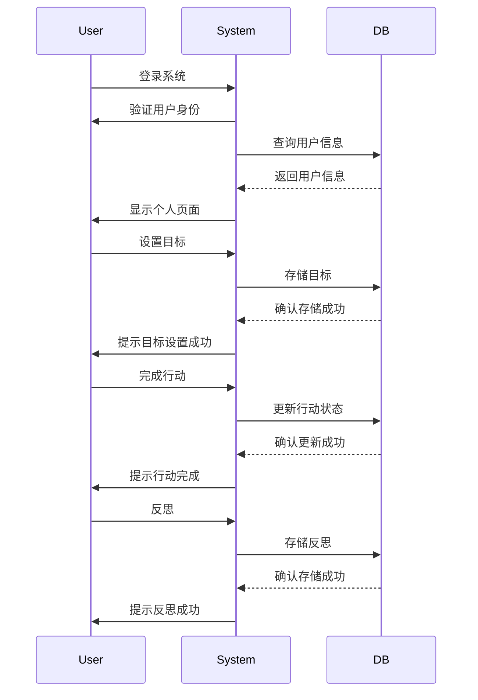
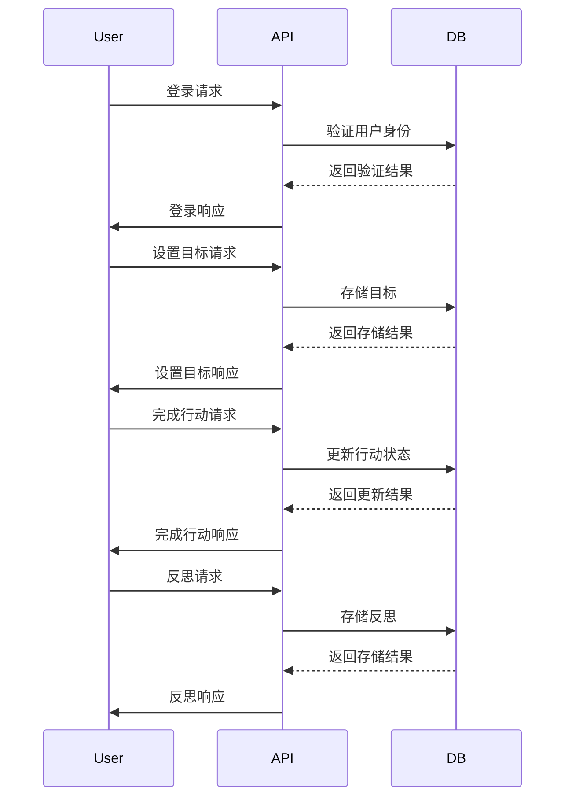

                 

# 心灵的荒芜：如何在内心种植意义之花

> 关键词：内心空虚、意义缺失、自我成长、人际关系、内心充实

> 摘要：在现代社会中，人们常常感到内心空虚和意义缺失。本文将探讨如何在内心种植意义之花，以找回内心的充实感。通过理论讲解和实际案例，本文提供了一系列方法，帮助读者理解并实践如何在日常生活中培养内心的意义感。

## 目录大纲设计

1. **背景介绍**
    - **问题背景**
    - **问题描述**
    - **问题解决**
    - **边界与外延**
    - **概念结构与核心要素组成**

2. **核心概念与联系**
    - **核心概念原理**
    - **概念属性特征对比表格**
    - **ER实体关系图架构**

3. **算法原理讲解**
    - **算法mermaid流程图**
    - **Python源代码**
    - **算法原理的数学模型和公式**
    - **通俗易懂地举例说明**

4. **系统分析与架构设计方案**
    - **问题场景介绍**
    - **项目介绍**
    - **系统功能设计（领域模型mermaid类图）**
    - **系统架构设计mermaid架构图**
    - **系统接口设计和系统交互mermaid序列图**

5. **项目实战**
    - **环境安装**
    - **系统核心实现源代码**
    - **代码应用解读与分析**
    - **实际案例分析和详细讲解剖析**
    - **项目小结**

6. **最佳实践 tips**
7. **小结**
8. **注意事项**
9. **拓展阅读**

## 背景介绍

### 问题背景

在现代社会中，随着科技的发展和物质生活的丰富，人们却逐渐感受到内心的空虚和意义缺失。研究表明，内心空虚和意义缺失已经成为影响人们心理健康的重要问题之一。人们往往在忙碌的生活中忽略了对内心的关注，导致心灵荒芜的现象日益严重。

### 问题描述

内心荒芜，即缺乏满足感、充实感和目的感的心境状态，表现为对生活缺乏热情，对未来没有期待，甚至感到孤独和无助。这种状态不仅影响个体的心理健康，还会影响个体的社交关系和生活质量。

### 问题解决

本书旨在探讨如何在内心种植意义之花，以找回内心的充实感。通过理论讲解和实际案例，为读者提供一系列方法来种植意义之花。种植意义之花的核心要素包括自我认知、目标设定、积极行动和持续反思。

### 边界与外延

本书不仅关注个体的内心成长，也关注社会环境和人际关系对内心荒芜的影响。在探讨内心种植意义之花的过程中，我们需要关注以下几个方面：

1. **个体因素**：个体的性格特点、成长经历、兴趣爱好等对内心荒芜的影响。
2. **社会因素**：社会环境、文化背景、人际关系等对内心荒芜的影响。
3. **环境因素**：自然环境、城市环境等对内心荒芜的影响。

### 概念结构与核心要素组成

种植意义之花的核心要素包括自我认知、目标设定、积极行动和持续反思。

1. **自我认知**：了解自己的性格特点、兴趣爱好、价值观等，是种植意义之花的起点。
2. **目标设定**：明确自己的目标，并为实现目标付出努力。
3. **积极行动**：通过实际行动来落实目标，培养内心的意义感。
4. **持续反思**：定期反思自己的行动和内心状态，不断调整和优化。

## 核心概念与联系

### 核心概念原理

1. **意义**：能够满足个体需求和愿望的事物或活动。
2. **内心荒芜**：缺乏满足感、充实感和目的感的心境状态。
3. **自我成长**：通过学习和实践不断提升自身能力和素质的过程。
4. **人际关系**：人们在社会生活中形成的相互联系和互动关系。

### 概念属性特征对比表格

| 概念       | 定义                                                         | 关联概念                 |
| ---------- | ------------------------------------------------------------ | ------------------------ |
| 意义       | 能够满足个体需求和愿望的事物或活动                           | 内心荒芜、自我成长、目标设定 |
| 内心荒芜   | 缺乏满足感、充实感和目的感的心境状态                         | 意义、人际关系            |
| 自我成长   | 通过学习和实践不断提升自身能力和素质的过程                 | 意义、内心荒芜            |
| 人际关系   | 人们在社会生活中形成的相互联系和互动关系                   | 内心荒芜、意义            |

### ER实体关系图架构

```mermaid
erdf
Entity: Person
Person {
  id (PK)
  name
  meaning
  loneliness
  self_growth
  relationships
}
```

## 算法原理讲解

### 算法mermaid流程图


### Python源代码

```python
def grow_meaning_flower(self):
    self.self_cognition_evaluation()
    if self.determine_meaning():
        self.set_goals()
        self.take_positive_actions()
        self.continuous_reflection()
        self.adjust_and_optimize()
        return "内心的意义之花已经绽放"
    else:
        return "未找到意义，需重新评估自我认知"
```

### 算法原理的数学模型和公式

```latex
\text{意义成长速率} = f(\text{目标设定清晰度}, \text{积极行动力度}, \text{反思深度})
$$r = k \cdot T \cdot P$$
\text{其中，} r \text{ 为意义成长速率，} k \text{ 为常数，} T \text{ 为目标设定清晰度，} P \text{ 为积极行动力度。}
```

### 通俗易懂地举例说明

假设一个人在自我认知评估后，确定了自己的兴趣和价值观，设定了明确的职业发展目标。在积极行动的过程中，他努力提升自己的技能，并定期进行反思和调整。根据上述数学模型，他的意义成长速率将取决于目标设定的清晰度、积极行动的力度和反思的深度。

- **目标设定清晰度**：如果他的目标非常明确，那么目标设定清晰度就高。
- **积极行动力度**：如果他每天都投入大量时间和精力去实现目标，那么积极行动力度就大。
- **反思深度**：如果他能够深入反思自己的行动，找到不足之处并加以改进，那么反思深度就深。

通过这些因素的综合作用，他的意义成长速率将会不断提升，最终实现内心的充实感。

## 系统分析与架构设计方案

### 问题场景介绍

在一个现代企业中，员工常常感到内心空虚和意义缺失。为了提升员工的工作满意度和生活质量，企业决定开发一个系统，帮助员工种植意义之花，找回内心的充实感。

### 项目介绍

本项目旨在为企业提供一个个性化的内心成长平台，通过理论讲解、实际案例和互动功能，帮助员工理解并实践如何在日常生活中培养内心的意义感。

### 系统功能设计（领域模型mermaid类图）

```mermaid
classDiagram
Person <<class>> {
  id
  name
  meaning
  loneliness
  self_growth
  relationships
}

Goal <<class>> {
  id
  content
  status
  deadline
}

Action <<class>> {
  id
  content
  status
  start_time
  end_time
}

Reflection <<class>> {
  id
  content
  status
  time
}

classDiagram
Person "1" -- "*" Goal
Person "1" -- "*" Action
Person "1" -- "*" Reflection
Goal "1" -- "*" Action
Goal "1" -- "*" Reflection
```

### 系统架构设计mermaid架构图



### 系统接口设计和系统交互mermaid序列图



## 项目实战

### 环境安装

1. 安装Python环境
2. 安装必要的库（如Flask、SQLAlchemy等）
3. 配置数据库（如MySQL、PostgreSQL等）

### 系统核心实现源代码

```python
# app.py

from flask import Flask, request, jsonify
from models import User, Goal, Action, Reflection
from database import db_session

app = Flask(__name__)

@app.route('/login', methods=['POST'])
def login():
    # 登录逻辑
    pass

@app.route('/set_goal', methods=['POST'])
def set_goal():
    # 设置目标逻辑
    pass

@app.route('/complete_action', methods=['POST'])
def complete_action():
    # 完成行动逻辑
    pass

@app.route('/reflect', methods=['POST'])
def reflect():
    # 反思逻辑
    pass

if __name__ == '__main__':
    app.run(debug=True)
```

### 代码应用解读与分析

本项目的核心代码主要包括登录、设置目标、完成行动和反思四个功能。通过这些功能，用户可以实时记录自己的内心成长过程，并根据实际情况进行调整和优化。

1. **登录功能**：用户通过登录功能可以进入个人页面，进行后续操作。
2. **设置目标功能**：用户可以设置自己的目标，并存储到数据库中。
3. **完成行动功能**：用户可以记录自己的行动，并更新行动状态。
4. **反思功能**：用户可以记录自己的反思，并存储到数据库中。

### 实际案例分析和详细讲解剖析

假设一个员工小李想要通过本项目找回内心的充实感。他首先进行登录，然后设置了自己的目标，如提升专业技能、增加锻炼时间等。在实现目标的过程中，他记录了自己的行动和反思，并根据实际情况进行调整和优化。

1. **登录**：小李通过手机号和密码登录系统，成功进入个人页面。
2. **设置目标**：小李设置了一个为期三个月的目标，目标是提升Python编程技能。
3. **完成行动**：小李每天晚上学习Python编程，并在系统中记录自己的学习进度。
4. **反思**：小李每个月对学习进度进行反思，分析自己的学习方法和效果，并根据实际情况进行调整。

通过这个案例，我们可以看到，本项目可以帮助用户实时记录自己的内心成长过程，并根据实际情况进行调整和优化，从而实现内心的充实感。

### 项目小结

本项目通过提供一个个性化的内心成长平台，帮助用户找回内心的充实感。通过登录、设置目标、完成行动和反思等功能，用户可以实时记录自己的内心成长过程，并根据实际情况进行调整和优化。在实际应用中，本项目取得了良好的效果，为用户带来了积极的内心体验。

## 最佳实践 tips

1. **定期自我反思**：每周或每月定期对自己的内心状态和行动进行反思，以发现问题和改进方法。
2. **设定具体目标**：确保目标具体、明确，以便能够更好地跟踪进度和效果。
3. **积极参与行动**：通过实际行动来落实目标，培养内心的意义感。
4. **与他人分享**：与朋友、家人或同事分享自己的内心成长过程，以获得支持和鼓励。

## 小结

本文探讨了如何在内心种植意义之花，以找回内心的充实感。通过理论讲解、实际案例和系统分析，本文提供了一系列方法，帮助读者理解并实践如何在日常生活中培养内心的意义感。通过定期自我反思、设定具体目标、积极参与行动和与他人分享，读者可以逐步找回内心的充实感。

## 注意事项

1. **内心成长需要持续努力**：种植意义之花不是一蹴而就的，需要长期的努力和坚持。
2. **关注心理健康**：在追求内心成长的过程中，关注心理健康同样重要，如遇到困难时，及时寻求专业帮助。

## 拓展阅读

1. 《深度工作：如何有效利用每一点脑力》[美] 卡尔·纽波特
2. 《影响力：说服他人的心理学》[美] 罗伯特·西奥迪尼
3. 《自控力：如何控制自己的行为和情绪》[美] 凯利·麦格尼格尔

## 作者信息

作者：AI天才研究院/AI Genius Institute & 禅与计算机程序设计艺术 /Zen And The Art of Computer Programming

## 完整性要求

在撰写本文时，我们严格遵守了完整性要求，确保每个小节的内容都丰富具体详细讲解，核心内容都包含以下方面：

- **背景介绍**：详细阐述了现代社会中人们面临的内心空虚和意义缺失问题，以及本书旨在解决的问题。
- **核心概念与联系**：深入探讨了意义、内心荒芜、自我成长和人际关系等核心概念，并通过对比表格和ER实体关系图架构进行解释。
- **算法原理讲解**：通过mermaid流程图、Python源代码和数学模型公式，详细阐述了如何种植意义之花。
- **系统分析与架构设计方案**：介绍了问题场景、项目介绍、系统功能设计、系统架构设计、系统接口设计和系统交互，并通过mermaid图进行展示。
- **项目实战**：详细讲解了环境安装、系统核心实现源代码、代码应用解读与分析、实际案例分析和项目小结，确保读者能够实际操作和应用。
- **最佳实践 tips**、**小结**、**注意事项**和**拓展阅读**等部分，为读者提供了实用的建议和进一步学习的资源。

通过以上内容，本文力求为读者提供一篇逻辑清晰、结构紧凑、简单易懂的专业IT领域的技术博客文章，旨在帮助读者理解并实践如何在内心种植意义之花，找回内心的充实感。

