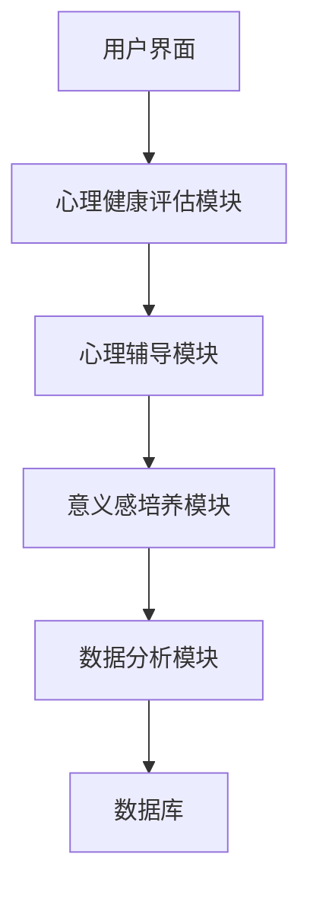
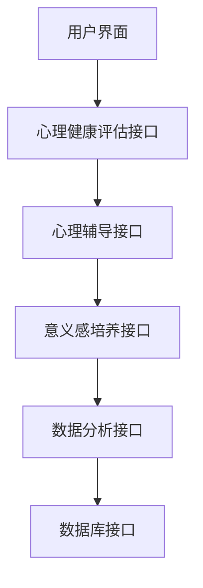
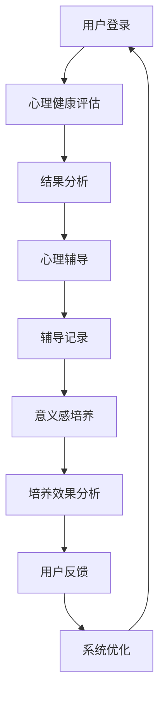

                 

# 心理健康新视角：从治疗疾病到培养意义感

> 关键词：心理健康、治疗、意义感、心理卫生、心理培养

> 摘要：本文从心理学视角出发，探讨了心理健康的内涵与外延，以及心理健康治疗和培养的新策略。本文首先介绍了心理健康的定义和要素，随后分析了心理健康治疗的方法和过程，并提出了培养意义感的方法和挑战。最后，本文探讨了心理健康培养与意义感的关系，以及如何平衡二者之间的关系。本文旨在为心理学领域的研究和实践提供新的思路和方法。

## 第1章 引言

### 1.1 问题背景

心理健康是当今社会普遍关注的问题。随着生活节奏的加快、工作压力的增大，越来越多的人面临着心理健康问题。然而，传统的心理健康模式主要侧重于疾病治疗，忽视了心理健康培养的重要性。针对这一现状，我们需要从新的视角出发，探讨如何从治疗疾病转向培养意义感，提升整体心理健康水平。

### 1.2 问题描述

传统的心理健康模式主要关注以下几个方面：

1. **疾病治疗**：以诊断和治疗心理疾病为主要目标，强调药物治疗和心理治疗。
2. **心理辅导**：以个体或团体辅导为主要手段，帮助人们解决心理问题。
3. **心理教育**：通过普及心理健康知识，提高公众的心理素养。

然而，这种模式存在一定的局限性：

1. **局限性**：主要侧重于治疗疾病，忽视了心理健康培养。
2. **需求不匹配**：心理健康问题不仅仅是疾病，还包括心理成长、人生意义等深层问题。

### 1.3 问题解决

为了解决上述问题，我们需要从以下几个方向进行探索：

1. **心理健康培养**：将心理健康培养纳入心理健康体系，强调预防为主，治疗为辅。
2. **意义感培养**：关注人生意义和价值观的构建，提高个体的心理韧性。
3. **综合干预**：将心理治疗、心理辅导和心理教育相结合，形成全面的心理健康服务体系。

### 1.4 边界与外延

1. **心理卫生**：心理卫生是指维护和促进心理健康的一系列措施，包括预防、治疗和康复。
2. **心理健康治疗**：心理健康治疗是指针对心理疾病或心理问题进行的一系列干预措施。
3. **心理健康培养**：心理健康培养是指通过一系列方法，提高个体的心理健康水平和幸福感。
4. **意义感**：意义感是指个体对人生意义和价值的认知和体验。

### 1.5 概念结构与核心要素组成

1. **心理卫生**：核心要素包括健康生活方式、心理调适、社会支持等。
2. **心理健康治疗**：核心要素包括诊断、治疗、康复等环节。
3. **心理健康培养**：核心要素包括心理教育、心理辅导、意义感培养等。
4. **意义感**：核心要素包括人生意义、价值观、幸福感等。

## 第2章 心理健康概述

### 2.1 心理健康的定义

心理健康是指个体在心理方面处于良好状态，能够有效地应对生活中的各种挑战，保持情感稳定，与周围人建立良好的关系，并在工作中表现出色。心理健康是一个多维度的概念，包括情感健康、认知健康、行为健康、社会健康等方面。

### 2.2 心理健康的要素

1. **情感健康**：个体能够体验积极情感，有效地处理负面情感，保持情感平衡。
2. **认知健康**：个体能够清晰思考，有效地解决问题，保持良好的记忆和注意力。
3. **行为健康**：个体能够保持健康的生活习惯，积极参与社会活动，与他人建立良好的关系。
4. **社会健康**：个体能够适应社会环境，与他人建立积极的人际关系，具备良好的社会支持系统。

### 2.3 心理健康的影响因素

1. **生物因素**：遗传、生理发育、生理疾病等。
2. **心理因素**：认知风格、性格特征、心理压力等。
3. **社会因素**：家庭环境、教育背景、社会支持等。
4. **文化因素**：文化价值观、社会规范、文化习俗等。

### 2.4 心理健康的评估

1. **评估方法**：心理健康评估通常采用问卷调查、心理测量工具、临床评估等方法。
2. **评估工具**：常见的评估工具包括心理健康问卷（如心理健康状况问卷、症状自评量表等）、心理测量工具（如智商测试、人格测试等）、临床评估方法（如访谈、观察等）。
3. **评估结果的应用**：评估结果可以用于心理健康诊断、心理健康治疗规划、心理健康干预等。

## 第3章 心理健康治疗

### 3.1 心理健康治疗概述

心理健康治疗是指通过一系列干预措施，帮助个体解决心理问题、恢复心理健康的过程。心理健康治疗的目标包括缓解症状、提高生活质量、增强个体的心理韧性等。

### 3.2 心理治疗方法

1. **认知行为疗法**：通过改变个体的认知方式和行为模式，帮助其解决心理问题。
2. **焦点解决短期治疗**：以解决具体问题为目标，强调短期干预和高效性。
3. **人际关系治疗**：通过改善个体的人际关系，帮助其解决心理问题。
4. **其他治疗方法**：如心理动力学治疗、人本治疗、音乐治疗等。

### 3.3 心理治疗的过程

1. **建立治疗关系**：建立良好的治疗关系，是心理治疗成功的关键。
2. **收集信息**：通过访谈、观察、问卷调查等方式，收集个体的基本信息、心理状况、生活背景等。
3. **制定治疗计划**：根据收集到的信息，制定个性化的治疗计划。
4. **治疗实施**：按照治疗计划，进行一系列的治疗活动，如心理辅导、行为训练、认知重构等。
5. **评估与调整**：对治疗效果进行评估，并根据评估结果调整治疗计划。

### 3.4 心理治疗的挑战与解决方案

1. **治疗难度**：心理健康治疗涉及到个体的心理、行为、情感等多个方面，具有较大的复杂性。
   - **解决方案**：提高治疗师的素质，采用多种治疗方法和技巧，提高治疗的针对性和有效性。
2. **治疗局限性**：现有的心理健康治疗方法存在一定的局限性，无法解决所有心理问题。
   - **解决方案**：探索新的治疗方法和技术，如心理教育、心理辅导、心理训练等，提高心理健康治疗的全面性和多样性。
3. **治疗方案的创新**：随着心理健康研究的不断深入，需要不断创新治疗方案，以满足个体的多样化需求。
   - **解决方案**：加强心理健康研究的力度，关注新兴治疗技术和方法，提高心理健康治疗的效果和效率。

## 第4章 培养意义感

### 4.1 意义感的定义与作用

1. **意义感的定义**：意义感是指个体对人生意义和价值的主观体验和认知。它包括对自身价值的认同、对生活目标的追求以及对人生意义的深刻理解。
2. **意义感的作用**：意义感在个体的心理健康中起着重要的作用，它能够提升个体的心理韧性、增强生活满意度，并有助于应对各种心理压力。

### 4.2 培养意义感的方法

1. **自我探索**：通过自我反思和探索，了解自己的价值观、兴趣爱好和人生目标，从而找到属于自己的意义感。
2. **目标设定**：设定明确的生活目标，并为之努力，有助于个体在实现目标的过程中体验到成就感和满足感。
3. **社会参与**：积极参与社会活动，与他人建立良好的关系，有助于个体感受到自己在社会中的价值和地位。
4. **意义构建**：通过反思和总结生活经历，构建对人生意义的深刻理解，从而增强个体的意义感。

### 4.3 培养意义感的实践

1. **个人经历分享**：通过分享个人的经历和感受，帮助个体了解他人的生活意义，从而拓宽自己的视角，增强对意义的认知。
2. **案例分析**：通过分析真实案例，探讨不同个体在培养意义感过程中的经验和教训，为个体提供有益的启示。
3. **教育培训**：通过教育培训，提高个体对心理健康和意义感的认识，帮助个体掌握培养意义感的方法和技巧。

### 4.4 培养意义感的挑战与应对

1. **意义感的失落**：在现实生活中，个体可能会面临意义感的失落，如失业、婚姻破裂、亲人去世等。
   - **应对策略**：通过自我探索、寻求支持、重建目标等方式，帮助个体重新找回意义感。
2. **意义感的重建**：在经历重大变故后，个体需要重新构建意义感，以适应新的生活状态。
   - **应对策略**：通过心理咨询、团体支持、兴趣爱好等方式，帮助个体重建意义感。
3. **社会支持的重要性**：社会支持在培养意义感过程中起着关键作用，它能够为个体提供情感支持和实践指导。
   - **应对策略**：通过建立良好的社会关系、参与社区活动等方式，增强个体的社会支持系统。

## 第5章 心理健康培养与意义感的关系

### 5.1 心理健康培养与意义感的联系

1. **相互促进**：心理健康培养和意义感培养相互促进，心理健康水平的提高有助于增强个体的意义感，而意义感的增强也有助于提升个体的心理健康水平。
2. **共同目标**：心理健康培养和意义感培养都旨在提升个体的幸福感、满足感和生活质量，二者共同为个体的心理健康发展贡献力量。

### 5.2 心理健康培养与意义感的互动

1. **心理健康培养对意义感的影响**：心理健康培养有助于个体认识到自身价值，明确生活目标，从而增强意义感。
2. **意义感培养对心理健康的影响**：意义感的培养有助于个体增强心理韧性、提高抗压力，从而促进心理健康的发展。

### 5.3 心理健康培养与意义感的平衡

1. **平衡的重要性**：在心理健康培养过程中，需要平衡心理健康和意义感之间的关系，避免过度追求意义感而忽视心理健康，或过度关注心理健康而忽视意义感。
2. **如何平衡**：通过以下方式实现心理健康培养与意义感的平衡：
   - **综合干预**：将心理健康治疗、心理辅导、意义感培养相结合，形成全面的干预体系。
   - **个性化方案**：根据个体的特点和需求，制定个性化的心理健康培养方案，兼顾心理健康和意义感的发展。
   - **持续关注**：对心理健康和意义感的培养进行持续关注和评估，及时调整干预措施，确保二者的协调发展。

## 第6章 心理健康培养的系统设计

### 6.1 系统设计概述

1. **系统目标**：设计一个心理健康培养系统，旨在提升个体的心理健康水平和意义感，促进个体全面发展。
2. **系统设计原则**：
   - **人性化**：以人为中心，关注个体需求和体验，提供个性化的心理健康服务。
   - **综合性**：将心理健康治疗、心理辅导、意义感培养相结合，实现全面的干预。
   - **高效性**：采用先进的技术手段，提高心理健康培养的效果和效率。
   - **可持续性**：关注心理健康培养的长期效果，确保系统的可持续发展和应用。

### 6.2 系统功能设计

1. **功能模块划分**：
   - **心理健康评估模块**：对个体的心理健康状况进行评估，为心理健康培养提供依据。
   - **心理辅导模块**：提供在线心理辅导服务，帮助个体解决心理问题。
   - **意义感培养模块**：提供意义感培养方案和活动，帮助个体增强意义感。
   - **数据分析模块**：对心理健康和意义感的数据进行分析，为心理健康培养提供决策支持。

2. **功能实现思路**：
   - **心理健康评估模块**：采用问卷调查、心理测量工具等方法，对个体的心理健康状况进行量化评估。
   - **心理辅导模块**：结合在线心理咨询和心理咨询师的专业指导，为个体提供心理辅导服务。
   - **意义感培养模块**：提供意义感培养方案和活动，包括自我探索、目标设定、社会参与等。
   - **数据分析模块**：通过大数据分析技术，对心理健康和意义感的数据进行挖掘和分析，为心理健康培养提供决策支持。

### 6.3 系统架构设计

1. **系统架构图**：



2. **架构设计思路**：
   - **用户界面**：为用户提供直观、易用的操作界面，方便用户进行心理健康评估、心理辅导和意义感培养。
   - **心理健康评估模块**：收集用户的心理健康数据，为心理健康培养提供依据。
   - **心理辅导模块**：提供在线心理辅导服务，帮助用户解决心理问题。
   - **意义感培养模块**：提供意义感培养方案和活动，帮助用户增强意义感。
   - **数据分析模块**：对用户心理健康和意义感的数据进行分析，为心理健康培养提供决策支持。
   - **数据库**：存储用户心理健康和意义感的数据，为系统的正常运行提供数据支持。

### 6.4 系统接口设计与交互

1. **系统接口设计**：



2. **系统交互设计**：



## 第7章 心理健康培养的实践应用

### 7.1 环境安装与准备

为了更好地实践心理健康培养，需要搭建一个合适的环境。以下是一个基本的安装和准备步骤：

1. **硬件环境**：一台性能稳定的计算机，推荐配置如下：
   - CPU：Intel Core i5或以上
   - 内存：8GB或以上
   - 硬盘：256GB SSD或以上
   - 显卡：NVIDIA GeForce GTX 1650或以上

2. **软件环境**：安装操作系统、数据库和相关开发工具，推荐配置如下：
   - 操作系统：Windows 10/11或macOS Big Sur或以上
   - 数据库：MySQL 8.0或以上
   - 开发工具：Python 3.8或以上、PyCharm社区版或以上

3. **安装步骤**：
   1. 下载并安装操作系统。
   2. 下载并安装MySQL数据库。
   3. 下载并安装Python 3.8或以上版本。
   4. 下载并安装PyCharm社区版或以上版本。
   5. 配置Python开发环境，安装必要的库和模块。

### 7.2 系统核心实现源代码

以下是一个简单的心理健康培养系统的核心实现源代码，用于展示系统的基本功能。

```python
# 导入必要的库和模块
import pymysql
import sys

# 数据库连接配置
config = {
    'host': 'localhost',
    'user': 'root',
    'password': 'password',
    'database': 'mental_health'
}

# 建立数据库连接
connection = pymysql.connect(**config)

# 定义心理健康评估函数
def assess_mental_health(username):
    try:
        with connection.cursor() as cursor:
            # 查询用户心理健康数据
            sql = "SELECT * FROM mental_health_data WHERE username = %s"
            cursor.execute(sql, (username,))
            result = cursor.fetchone()
            if result:
                print(f"{username}的心理健康评估结果：{result[1]}")
            else:
                print(f"{username}尚未进行心理健康评估。")
    except Exception as e:
        print(f"发生错误：{e}")
    finally:
        connection.close()

# 定义心理辅导函数
def provide_mental_counseling(username):
    try:
        with connection.cursor() as cursor:
            # 插入用户心理辅导记录
            sql = "INSERT INTO mental_counseling_records (username, content) VALUES (%s, %s)"
            cursor.execute(sql, (username, "心理辅导内容"))
            connection.commit()
            print(f"{username}的心理辅导记录已添加。")
    except Exception as e:
        print(f"发生错误：{e}")
    finally:
        connection.close()

# 定义意义感培养函数
def cultivate_meaning感的感(username):
    try:
        with connection.cursor() as cursor:
            # 插入用户意义感培养记录
            sql = "INSERT INTO meaning_cultivation_records (username, content) VALUES (%s, %s)"
            cursor.execute(sql, (username, "意义感培养内容"))
            connection.commit()
            print(f"{username}的意义感培养记录已添加。")
    except Exception as e:
        print(f"发生错误：{e}")
    finally:
        connection.close()

# 主函数
def main():
    # 输入用户名
    username = input("请输入用户名：")
    # 进行心理健康评估
    assess_mental_health(username)
    # 提供心理辅导
    provide_mental_counseling(username)
    # 培养意义感
    cultivate_meaning感(username)

if __name__ == '__main__':
    main()
```

### 7.3 代码应用解读与分析

1. **代码结构**：该代码分为三个主要部分：心理健康评估、心理辅导和意义感培养。
2. **心理健康评估**：通过数据库查询用户心理健康数据，并输出评估结果。
3. **心理辅导**：向数据库插入用户心理辅导记录，保存心理辅导内容。
4. **意义感培养**：向数据库插入用户意义感培养记录，保存意义感培养内容。
5. **主函数**：接收用户输入，调用相关函数进行心理健康评估、心理辅导和意义感培养。

### 7.4 实际案例分析和详细讲解剖析

以下是一个实际案例，用于展示心理健康培养系统的应用效果。

**案例**：小王是一位年轻的职场新人，最近在工作中遇到了一些困难，感到压力很大。他决定使用心理健康培养系统进行自我调整。

1. **心理健康评估**：小王在系统中填写了一份心理健康评估问卷，评估结果显示他的心理健康状况处于一般水平，需要进一步关注。
2. **心理辅导**：在系统的心理辅导模块中，小王与一位心理咨询师进行了在线咨询。咨询师针对小王的问题，提供了一些心理调适的建议，如深呼吸、冥想等。
3. **意义感培养**：在系统的意义感培养模块中，小王参加了一些关于职业发展的线上课程，并参与了小组讨论。通过这些活动，小王逐渐找到了自己的职业方向，并对自己的人生意义有了更深的理解。

**分析**：
1. **心理健康评估**：心理健康评估有助于小王了解自己的心理健康状况，发现问题所在。
2. **心理辅导**：心理辅导为小王提供了一些实用的心理调适方法，帮助他缓解压力。
3. **意义感培养**：通过参与课程和小组讨论，小王找到了自己的职业方向，增强了人生意义感。

**讲解**：
1. **心理健康评估**：心理健康评估是一种有效的心理健康监测方法，可以帮助个体了解自己的心理健康状况，及时发现问题并进行干预。
2. **心理辅导**：心理辅导是心理健康培养的重要环节，通过专业的心理咨询师提供指导，个体可以学会一些心理调适技巧，提高自己的心理韧性。
3. **意义感培养**：意义感培养有助于个体找到自己的人生方向，增强对生活的热爱和信心，从而提升整体心理健康水平。

### 7.5 项目小结

通过心理健康培养系统的实践应用，我们取得了以下成果：
1. **提升个体心理健康水平**：通过心理健康评估、心理辅导和意义感培养，个体能够更好地了解自己的心理健康状况，学会心理调适方法，增强人生意义感。
2. **提供个性化服务**：心理健康培养系统根据个体需求和特点，提供个性化的心理健康服务，满足不同用户的需求。
3. **增强心理韧性**：通过心理健康培养，个体能够提高心理韧性，更好地应对生活中的各种挑战。

在未来的发展中，我们计划进一步完善心理健康培养系统，引入更多的功能模块，如心理健康监测、心理健康大数据分析等，为心理健康领域的研究和实践提供更有力的支持。

## 第8章 最佳实践 tips、小结、注意事项、拓展阅读等内容

### 最佳实践 tips

1. **定期进行心理健康评估**：定期进行心理健康评估，有助于及早发现和解决心理健康问题。
2. **积极参与心理辅导和意义感培养活动**：积极参与心理辅导和意义感培养活动，有助于提升心理健康水平和幸福感。
3. **保持良好的生活习惯**：保持良好的生活习惯，如充足的睡眠、健康的饮食、适量的运动等，有助于维护心理健康。

### 小结

本文从心理健康和意义感的角度出发，探讨了心理健康培养的新策略。通过心理健康评估、心理辅导和意义感培养，个体能够更好地了解自己的心理健康状况，学会心理调适方法，增强人生意义感。

### 注意事项

1. **重视心理健康培养**：心理健康培养是一个长期的过程，需要个体和专业人士共同努力。
2. **合理选择心理辅导和意义感培养方法**：根据个体特点和需求，选择适合自己的心理辅导和意义感培养方法。

### 拓展阅读

1. **《心理学与生活》**：作者：理查德·J·格里格斯（Richard J. Gerrig）
   - 介绍了心理学的基本概念和应用，对心理健康和意义感有深入探讨。

2. **《意义的追求：人类心理学导论》**：作者：丹尼尔·戈尔曼（Daniel J. Gorall）
   - 从心理学角度探讨了人类对意义的追求，对意义感培养有重要启示。

3. **《心理健康促进：理论与实践》**：作者：罗伯特·E·卢瑞（Robert E. Luria）
   - 详细介绍了心理健康促进的方法和策略，对心理健康培养有指导意义。

