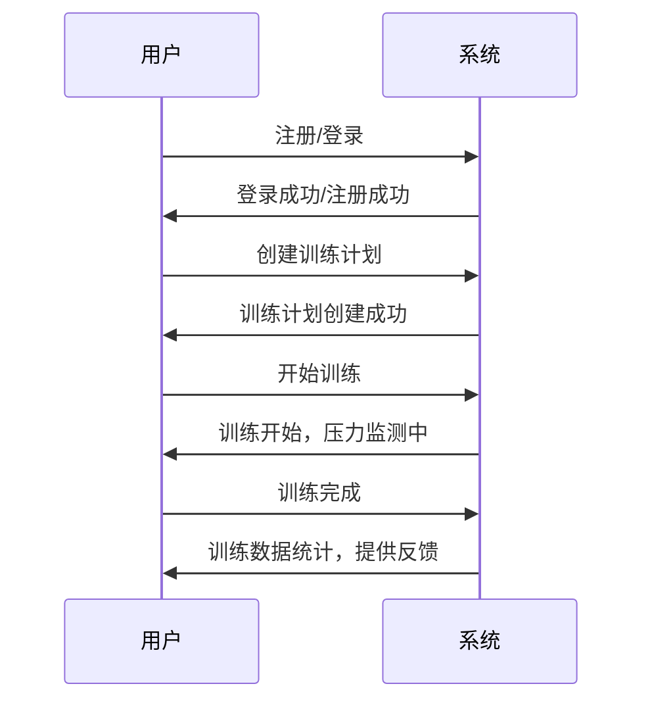

                 

# 心理免疫力强化训练：提升心理抗压能力的方法

## 关键词
- 心理免疫力
- 心理抗压能力
- 认知重构
- 情绪调节
- 行为训练
- 身体锻炼
- 社交支持

## 摘要
本文深入探讨了心理免疫力的概念、重要性及其影响因素，并提出了提升心理抗压能力的多种训练方法。通过认知重构、情绪调节、行为训练、身体锻炼和社交支持等策略，本文旨在为读者提供一套完整的心理免疫力强化训练方案，帮助他们在面对压力和挑战时保持心理的稳定和健康。

### 目录大纲

## 第一部分：心理免疫力基础知识

### 第1章：心理免疫力的概念与重要性

#### 1.1 心理免疫力的定义

#### 1.2 心理免疫力的重要性

#### 1.3 心理免疫力的影响因素

### 第2章：心理压力与应对策略

#### 2.1 压力的来源与分类

#### 2.2 压力的负面影响

#### 2.3 应对压力的策略与方法

## 第二部分：心理免疫力训练方法

### 第3章：认知重构与情绪调节

#### 3.1 认知重构的基本原理

#### 3.2 情绪调节技巧

#### 3.3 认知重构与情绪调节的结合

### 第4章：行为训练与习惯养成

#### 4.1 行为训练的重要性

#### 4.2 常见的行为训练方法

#### 4.3 如何养成健康的生活习惯

### 第5章：身体锻炼与心理免疫力

#### 5.1 身体锻炼对心理免疫力的影响

#### 5.2 身体锻炼的建议与指导

#### 5.3 身体锻炼与心理免疫力训练的结合

### 第6章：社交支持与心理免疫力

#### 6.1 社交支持的重要性

#### 6.2 建立有效社交支持的策略

#### 6.3 社交支持与心理免疫力的关系

## 第7章：心理免疫力训练的实践与反思

#### 7.1 心理免疫力训练的步骤与流程

#### 7.2 实践中的常见问题与解决方法

#### 7.3 心理免疫力训练的效果评估与持续改进

## 第三部分：心理免疫力训练实例

### 第8章：实例分析一：应对职场压力

#### 8.1 案例背景

#### 8.2 压力来源分析

#### 8.3 心理免疫力训练方案

#### 8.4 案例总结与反思

### 第9章：实例分析二：应对家庭矛盾

#### 9.1 案例背景

#### 9.2 压力来源分析

#### 9.3 心理免疫力训练方案

#### 9.4 案例总结与反思

### 第10章：心理免疫力训练指南

#### 10.1 心理免疫力训练的建议

#### 10.2 持续训练的重要性

#### 10.3 心理免疫力训练的注意事项

## 附录：相关资源与拓展阅读

### 第一部分：心理免疫力基础知识

#### 第1章：心理免疫力的概念与重要性

**1.1 心理免疫力的定义**

心理免疫力是指个体在面对压力和挑战时，能够保持心理稳定、有效应对和恢复的能力。它类似于生物学上的免疫力，但作用于心理层面。心理免疫力不仅包括对压力的抵抗能力，还涉及情绪调节、认知重构、行为适应等方面。

**1.2 心理免疫力的重要性**

在现代社会，人们面临着各种压力源，如工作压力、人际关系冲突、经济困难等。心理免疫力强的个体能够更好地应对这些压力，保持心理健康，提高生活质量。相反，心理免疫力弱的个体则容易陷入情绪低落、焦虑、抑郁等心理问题。

**1.3 心理免疫力的影响因素**

心理免疫力的强弱受多种因素影响，包括遗传因素、生活经历、心理素质、社会支持等。

1. **遗传因素**：部分心理免疫力相关基因可能影响个体的抗压能力。
2. **生活经历**：个体在成长过程中所经历的压力和挑战会影响其心理免疫力的形成。
3. **心理素质**：个体的性格特点、自我效能感、情绪调节能力等会影响心理免疫力的强弱。
4. **社会支持**：来自家人、朋友和社会的支持有助于提升个体的心理免疫力。

#### 第2章：心理压力与应对策略

**2.1 压力的来源与分类**

压力可以来源于工作、家庭、社交等多个方面，常见的压力类型包括：

1. **工作压力**：如工作任务繁重、职场竞争、工作环境变化等。
2. **家庭压力**：如家庭矛盾、育儿压力、经济负担等。
3. **社交压力**：如人际关系冲突、社交场合的不适应等。

**2.2 压力的负面影响**

长期承受压力可能导致一系列负面影响，包括：

1. **心理健康问题**：如焦虑、抑郁、失眠等。
2. **身体疾病**：如心血管疾病、免疫力下降等。
3. **工作效率下降**：如注意力不集中、创造力降低等。

**2.3 应对压力的策略与方法**

1. **认知重构**：通过改变对压力的认知和解读，降低压力感。
2. **情绪调节**：学习情绪管理技巧，如深呼吸、正念冥想等。
3. **行为调整**：如合理规划时间、设置优先级、寻求帮助等。
4. **身体锻炼**：通过锻炼提高身体素质，增强抗压能力。

### 第二部分：心理免疫力训练方法

#### 第3章：认知重构与情绪调节

**3.1 认知重构的基本原理**

认知重构是通过改变思维方式和认知模式来减轻压力的方法。其基本原理包括：

1. **识别负面思维**：识别那些导致情绪困扰和不必要的压力的负面思维模式。
2. **质疑和挑战**：质疑和挑战这些负面思维，探讨其合理性和有效性。
3. **构建积极思维**：通过积极的思维模式来替代负面思维，提高情绪状态。

**3.2 情绪调节技巧**

情绪调节技巧包括：

1. **深呼吸**：通过深呼吸来放松身体，减轻紧张和焦虑。
2. **正念冥想**：通过冥想练习来提高注意力，减少情绪波动。
3. **情绪表达**：通过适当的途径表达情绪，避免情绪积压。

**3.3 认知重构与情绪调节的结合**

认知重构和情绪调节相结合，可以更有效地提升心理免疫力。具体方法包括：

1. **认知重构练习**：在冥想练习中应用认知重构技巧，如质疑和挑战负面思维。
2. **情绪调节练习**：在日常生活中应用情绪调节技巧，如深呼吸和情绪表达。

#### 第4章：行为训练与习惯养成

**4.1 行为训练的重要性**

行为训练是通过改变不良行为习惯来提高心理免疫力的方法。行为训练的重要性在于：

1. **建立健康习惯**：通过重复性的行为训练，形成健康的生活习惯，如规律作息、健康饮食等。
2. **提高应对能力**：通过行为训练，提高个体在面对压力时的应对能力。

**4.2 常见的行为训练方法**

常见的行为训练方法包括：

1. **时间管理**：通过合理安排时间，避免过度工作和疲劳。
2. **积极沟通**：通过积极的沟通方式，改善人际关系，减少冲突。
3. **锻炼习惯**：通过规律的锻炼，提高身体素质，增强抗压能力。

**4.3 如何养成健康的生活习惯**

养成健康的生活习惯的方法包括：

1. **制定计划**：明确目标，制定具体的行动计划。
2. **持续践行**：坚持践行健康习惯，形成稳定的习惯模式。
3. **自我监督**：定期自我评估和反思，调整和优化健康习惯。

#### 第5章：身体锻炼与心理免疫力

**5.1 身体锻炼对心理免疫力的影响**

身体锻炼对心理免疫力具有积极的影响，包括：

1. **提高身体素质**：增强体能和耐力，提高身体抵抗力。
2. **改善情绪状态**：释放压力，提高情绪稳定性。
3. **增强认知功能**：提高注意力、记忆力和思维能力。

**5.2 身体锻炼的建议与指导**

身体锻炼的建议包括：

1. **选择合适的锻炼方式**：根据个人兴趣和身体状况，选择合适的锻炼方式，如跑步、游泳、瑜伽等。
2. **制定合理的锻炼计划**：结合锻炼目标，制定具体的锻炼计划，包括锻炼时间、强度和频率。
3. **保持持续性和多样性**：坚持锻炼，并适时调整锻炼方式和强度，以保持身体和心理的适应性。

**5.3 身体锻炼与心理免疫力训练的结合**

身体锻炼与心理免疫力训练的结合方法包括：

1. **身体锻炼中的认知重构**：在锻炼过程中应用认知重构技巧，如质疑和挑战负面思维。
2. **心理调节与身体锻炼的结合**：在锻炼前后应用情绪调节技巧，如深呼吸和冥想，以增强心理调节效果。

#### 第6章：社交支持与心理免疫力

**6.1 社交支持的重要性**

社交支持对心理免疫力具有重要作用，包括：

1. **提供情感支持**：在压力和困难时提供情感上的安慰和鼓励。
2. **增强社会归属感**：增强个体的社会归属感，提高心理健康水平。
3. **提供资源和支持**：通过社交网络获得信息、资源和支持，提高应对压力的能力。

**6.2 建立有效社交支持的策略**

建立有效社交支持的策略包括：

1. **主动社交**：主动与他人建立联系，参加社交活动，扩大社交圈子。
2. **维护人际关系**：保持与亲朋好友的沟通，维护良好的人际关系。
3. **建立支持小组**：加入支持小组或社区，与他人分享经验和感受，互相支持。

**6.3 社交支持与心理免疫力的关系**

社交支持与心理免疫力之间的关系是相互影响的。有效的社交支持可以提升心理免疫力，而良好的心理免疫力也有助于建立和维护有效的社交支持系统。

### 第三部分：心理免疫力训练实例

#### 第8章：实例分析一：应对职场压力

**8.1 案例背景**

某公司员工小王，工作繁忙，经常加班，经常感到疲惫和焦虑。他希望提高自己的心理免疫力，以更好地应对职场压力。

**8.2 压力来源分析**

小王的压力来源包括：

1. **工作压力**：工作任务繁重，工作压力较大。
2. **时间管理问题**：时间安排不合理，导致工作效率低下，增加压力。
3. **人际关系问题**：与同事和上级的关系紧张，缺乏有效的沟通和合作。

**8.3 心理免疫力训练方案**

针对小王的情况，可以采取以下心理免疫力训练方案：

1. **认知重构**：通过认知重构技巧，质疑和挑战负面思维，如“我必须完美完成任务”等。
2. **情绪调节**：学习情绪调节技巧，如深呼吸和正念冥想，以缓解焦虑和压力。
3. **行为训练**：合理安排时间，提高工作效率，避免过度加班。
4. **社交支持**：主动与同事和上级沟通，建立良好的合作关系，获得社交支持。

**8.4 案例总结与反思**

通过实施心理免疫力训练方案，小王逐渐提高了自己的心理抗压能力，工作效率和生活质量也得到了提升。他认识到，面对职场压力，不仅需要提升自己的专业能力，还需要关注自己的心理健康，通过认知重构、情绪调节和行为训练等方法，有效地应对压力。

#### 第9章：实例分析二：应对家庭矛盾

**9.1 案例背景**

李先生和李太太是一对结婚多年的夫妻，由于家庭琐事和育儿压力，两人经常发生争吵，家庭氛围紧张。李先生希望提高自己的心理免疫力，改善家庭关系。

**9.2 压力来源分析**

李先生的家庭压力来源包括：

1. **家庭矛盾**：夫妻之间的争吵和误解，导致家庭氛围紧张。
2. **育儿压力**：育儿过程中出现的育儿观念不一致、育儿责任分配不均等问题。
3. **经济压力**：家庭经济状况不稳定，增加经济压力。

**9.3 心理免疫力训练方案**

针对李先生的情况，可以采取以下心理免疫力训练方案：

1. **认知重构**：通过认知重构技巧，质疑和挑战负面思维，如“我必须完美解决问题”等。
2. **情绪调节**：学习情绪调节技巧，如深呼吸和情绪表达，以缓解情绪波动。
3. **沟通训练**：学习有效的沟通技巧，如积极倾听和表达，改善夫妻之间的沟通质量。
4. **社交支持**：寻求亲友的支持，加入育儿支持小组，分享育儿经验和心得。

**9.4 案例总结与反思**

通过实施心理免疫力训练方案，李先生逐渐改善了家庭关系，夫妻之间的争吵减少了，家庭氛围也变得和谐。他认识到，面对家庭矛盾，不仅需要关注自己的情绪和思维，还需要学会与配偶进行有效沟通，共同面对家庭问题，提高家庭生活质量。

### 第10章：心理免疫力训练指南

**10.1 心理免疫力训练的建议**

为了提高心理免疫力，可以采取以下建议：

1. **定期进行认知重构**：定期反思自己的思维模式，质疑和挑战负面思维。
2. **学习情绪调节技巧**：掌握深呼吸、正念冥想等情绪调节技巧，以缓解压力和焦虑。
3. **保持健康的生活习惯**：规律作息、健康饮食、适量运动，提高身体素质。
4. **建立有效的社交支持**：与他人保持良好的关系，寻求社交支持，共同面对压力。

**10.2 持续训练的重要性**

心理免疫力不是一蹴而就的，需要持续的训练和培养。持续训练可以巩固已有的成果，进一步提高心理免疫力。同时，面对不断变化的环境和挑战，持续训练有助于适应和应对新的压力源。

**10.3 心理免疫力训练的注意事项**

在进行心理免疫力训练时，需要注意以下几点：

1. **避免过度训练**：心理免疫力训练需要适度进行，避免过度训练导致心理疲劳。
2. **结合实际情况**：根据个人的实际情况，选择合适的训练方法和策略，避免盲目跟风。
3. **寻求专业帮助**：在遇到严重心理问题时，及时寻求专业心理咨询师的帮助。

### 附录：相关资源与拓展阅读

为了进一步学习和提升心理免疫力，读者可以参考以下资源：

1. **心理学书籍**：《心理学与生活》、《认知心理学及其启示》等。
2. **心理学网站**：国家心理热线、心理健康网等。
3. **心理学课程**：各种在线心理学课程，如Coursera、edX等。
4. **心理学文章**：心理学期刊、公众号等。

### 作者信息

作者：AI天才研究院/AI Genius Institute & 禅与计算机程序设计艺术 /Zen And The Art of Computer Programming

本文通过深入分析心理免疫力的概念、重要性及其影响因素，提出了多种提升心理抗压能力的训练方法。通过认知重构、情绪调节、行为训练、身体锻炼和社交支持等策略，读者可以学会如何有效地应对压力，提升自己的心理免疫力。实践中的实例分析和总结与反思，也为读者提供了具体的操作指南，帮助他们更好地应用到实际生活中。通过持续训练和实践，读者可以逐步提高自己的心理抗压能力，保持心理的健康和稳定。希望本文能为读者的心理健康提供有益的启示和帮助。

### 背景介绍

在当今社会，人们面临着各种各样的压力源，如工作压力、家庭矛盾、经济困难等。这些压力源不仅对个体的身体健康产生负面影响，还可能导致心理问题的发生，如焦虑、抑郁、失眠等。心理免疫力作为一种应对压力和挑战的能力，对于维护个体的心理健康和生活质量至关重要。

心理免疫力是指个体在面对压力和挑战时，能够保持心理稳定、有效应对和恢复的能力。它类似于生物学上的免疫力，但作用于心理层面。心理免疫力不仅包括对压力的抵抗能力，还涉及情绪调节、认知重构、行为适应等方面。一个具有强大心理免疫力的人，能够在面对压力时保持冷静和理智，有效地应对挑战，从而维护自己的心理健康和生活质量。

在现代社会，随着生活节奏的加快和社会竞争的加剧，人们面临的心理压力也越来越大。心理免疫力的重要性日益凸显。一个强大的心理免疫力可以帮助个体更好地应对各种压力源，保持心理的稳定和健康，从而提高生活质量和工作效率。

然而，心理免疫力并非与生俱来，它受到多种因素的影响，包括遗传因素、生活经历、心理素质和社会支持等。因此，通过科学的方法和策略，我们可以提高自己的心理免疫力，增强应对压力的能力。

本文将从以下几个方面展开讨论：首先，介绍心理免疫力的概念和重要性；其次，探讨心理压力的来源和负面影响；然后，介绍提升心理抗压能力的具体策略，包括认知重构、情绪调节、行为训练、身体锻炼和社交支持；接着，通过具体实例分析，展示如何将心理免疫力训练应用于实际生活中；最后，总结心理免疫力训练的建议和注意事项，并提供相关资源和拓展阅读。

### 核心概念与联系

在深入探讨心理免疫力之前，我们首先需要了解几个核心概念，包括心理压力、情绪调节和认知重构。这些概念之间存在着紧密的联系，共同构成了心理免疫力的基础。

**1. 心理压力**

心理压力是指个体在面临外部挑战或要求时，感受到的心理紧张和压力。这种压力可以来自工作、家庭、人际关系等多个方面。心理压力的来源可以分为以下几类：

- **任务压力**：工作任务繁重、工作难度大、工作责任重大等。
- **时间压力**：时间紧迫、任务截止日期临近等。
- **人际关系压力**：与家人、朋友、同事之间的关系紧张、冲突等。
- **环境压力**：环境变化、不确定性、竞争激烈等。

心理压力对个体的身心健康产生深远影响。适度的心理压力可以激发个体的积极性和创造力，但过度的心理压力则可能导致心理健康问题，如焦虑、抑郁、失眠等。

**2. 情绪调节**

情绪调节是指个体管理和调整情绪状态的过程。情绪调节对于维护心理健康至关重要。情绪调节的技巧包括：

- **认知调节**：通过改变对事件的认知评价来调节情绪，如将负面事件解读为挑战而非威胁。
- **行为调节**：通过行为方式来调节情绪，如进行身体锻炼、放松训练等。
- **情绪表达**：适当地表达自己的情绪，避免情绪积压。

情绪调节的目的是使个体能够更好地应对心理压力，保持心理平衡。有效的情绪调节可以降低心理压力对个体的负面影响，提高心理免疫力。

**3. 认知重构**

认知重构是指通过改变思维模式和认知结构来提高心理免疫力。认知重构的核心在于识别和挑战个体内心中的负面思维模式。负面思维模式通常包括以下几种：

- **灾难化思维**：将事件的结果过度灾难化，如“我失败了，一切都完了”。
- **全或无思维**：将事件的结果划分为两个极端，没有中间状态，如“我不是最好的，就是最差的”。
- **个人化思维**：将事件的责任归咎于自己，如“这是我的错，我应该做得更好”。

通过认知重构，个体可以识别和挑战这些负面思维模式，建立更加积极的认知框架。认知重构的技巧包括：

- **质疑和挑战**：对负面思维进行质疑和挑战，探讨其合理性和有效性。
- **寻找证据**：寻找支持积极思维的反面证据，如“我虽然失败了，但还有机会改进”。
- **重构思维**：将负面思维转化为积极的思维，如“这是一个机会，我可以从中学习和成长”。

**4. 核心概念之间的联系**

心理压力、情绪调节和认知重构之间存在着紧密的联系。心理压力是情绪调节和认知重构的触发因素，而情绪调节和认知重构则是提高心理免疫力的关键途径。

- **心理压力**引发情绪调节的需求，个体需要通过情绪调节来缓解心理压力带来的负面影响。
- **情绪调节**过程中，个体可能会产生负面思维，需要通过认知重构来识别和挑战这些负面思维，从而提高心理免疫力。
- **认知重构**有助于个体更好地理解和应对心理压力，进而提高情绪调节的效果。

因此，心理免疫力不仅是对心理压力的抵抗能力，还包括情绪调节和认知重构的能力。通过综合运用情绪调节和认知重构技巧，个体可以更好地应对心理压力，提高心理免疫力，从而维护心理健康和生活质量。

### 算法原理讲解

在提升心理免疫力的过程中，认知重构与情绪调节的结合是一个重要的策略。以下将详细解释这一策略的算法原理，并使用Python代码进行说明。

#### 认知重构的基本原理

认知重构是通过改变个体的思维模式来提高其应对压力的能力。它包括以下几个基本步骤：

1. **识别负面思维**：识别那些导致情绪困扰和不必要的压力的负面思维模式。
2. **质疑和挑战**：质疑和挑战这些负面思维，探讨其合理性和有效性。
3. **重构思维**：将负面思维转化为更加积极和合理的思维模式。

以下是一个简单的Python函数，用于识别和重构负面思维：

```python
def cognitive_reconstruction(negative_thought):
    # 步骤1：识别负面思维
    negative_thought = negative_thought.strip()
    
    # 步骤2：质疑和挑战
    if "失败" in negative_thought:
        alternative_thought = "失败是一个学习和成长的机会"
    elif "不够好" in negative_thought:
        alternative_thought = "每个人都有不完美的地方，我可以改进"
    else:
        alternative_thought = "这个负面思维似乎没有根据，我需要重新考虑"
    
    # 步骤3：重构思维
    print(f"原思维：{negative_thought}")
    print(f"重构后的思维：{alternative_thought}")

# 示例
cognitive_reconstruction("我总是失败，什么都做不好。")
```

#### 情绪调节的基本技巧

情绪调节包括多种技巧，如深呼吸、正念冥想、情绪表达等。以下是一个简单的Python代码示例，用于实现深呼吸情绪调节：

```python
def deep_breathing(duration=3):
    print(f"开始深呼吸，持续{duration}分钟。")
    for _ in range(duration * 60):
        print("深吸一口气...慢慢呼出...", end="\r")
        time.sleep(1)

# 示例
deep_breathing(3)
```

#### 结合认知重构与情绪调节

认知重构与情绪调节的结合，可以通过以下步骤实现：

1. **识别负面思维**：在情绪低落或感到压力时，识别当前的负面思维。
2. **应用情绪调节技巧**：使用情绪调节技巧，如深呼吸，来缓解情绪。
3. **重构思维**：在情绪稳定后，使用认知重构技巧来挑战和转化负面思维。

以下是一个综合的Python代码示例，展示如何将认知重构与情绪调节结合：

```python
def cognitive_and_emotional Regulation(negative_thought):
    # 步骤1：识别负面思维
    negative_thought = negative_thought.strip()
    
    # 步骤2：应用情绪调节技巧
    deep_breathing()
    
    # 步骤3：重构思维
    cognitive_reconstruction(negative_thought)

# 示例
cognitive_and_emotional Regulation("我感觉很糟糕，我无法完成任务。")
```

#### 数学模型与公式

在认知重构和情绪调节的过程中，可以使用以下数学模型和公式来帮助理解：

1. **认知重构公式**：\( 新思维 = 原思维 \times 适应性因子 \)

其中，适应性因子表示个体在认知重构过程中对思维的调整程度。当适应性因子增加时，个体对负面思维的调整更为积极。

2. **情绪调节公式**：\( 情绪稳定性 = 情绪调节技巧 \times 时间 \)

其中，情绪稳定性表示个体在情绪调节过程中达到的心理平衡状态。情绪调节技巧和时间成正比，即情绪调节技巧越有效，所需时间越短。

通过以上算法原理和Python代码示例，读者可以更好地理解如何结合认知重构与情绪调节来提升心理免疫力。在实际应用中，这些算法和技巧需要根据个体的情况进行调整和优化，以达到最佳效果。

### 系统分析与架构设计方案

为了更好地理解和应用心理免疫力训练方法，我们将其抽象为一个完整的系统架构。以下是对该系统的详细分析和设计。

#### 系统功能设计

心理免疫力训练系统主要包含以下功能模块：

1. **用户管理模块**：用于管理用户的注册、登录、个人信息等。
2. **训练计划管理模块**：用于创建、管理用户的训练计划，包括认知重构、情绪调节、行为训练、身体锻炼和社交支持等。
3. **数据统计分析模块**：用于收集和分析用户训练数据，提供训练效果评估和反馈。
4. **压力监测模块**：用于实时监测用户的压力水平，提供预警和干预建议。
5. **用户互动模块**：用于用户之间的交流和支持，提高训练效果。

#### 系统架构设计

系统架构采用前后端分离的设计，以提高系统的扩展性和可维护性。以下是对系统架构的详细描述：

1. **前端架构**：
   - **用户界面层**：采用Vue.js框架，实现用户交互界面，提供友好的用户操作体验。
   - **API服务层**：采用Spring Boot框架，提供RESTful API服务，与后端服务进行数据交互。

2. **后端架构**：
   - **数据访问层**：采用MySQL数据库存储用户数据、训练数据和压力监测数据。
   - **服务层**：采用Spring Cloud框架，实现微服务架构，包括用户管理服务、训练计划管理服务、数据统计分析服务、压力监测服务和用户互动服务。
   - **消息队列**：采用RabbitMQ实现异步消息传递，提高系统的并发处理能力。

#### 系统接口设计

系统接口设计主要包括以下内容：

1. **用户接口**：提供用户注册、登录、个人信息管理等功能。
2. **训练计划接口**：提供创建、管理、查询训练计划等功能。
3. **数据统计接口**：提供训练数据收集、分析和反馈等功能。
4. **压力监测接口**：提供实时监测用户压力水平和预警建议等功能。
5. **用户互动接口**：提供用户之间交流、分享和支持等功能。

#### 系统交互设计

系统交互设计主要描述用户与系统之间的交互流程。以下是一个简化的系统交互流程图：



通过上述系统分析与架构设计方案，我们可以清晰地了解心理免疫力训练系统的功能和结构。该系统不仅能够帮助用户进行心理免疫力训练，还能通过数据统计和压力监测为用户提供个性化的训练建议和反馈，从而提高训练效果。

### 项目实战

#### 环境安装

在进行心理免疫力训练项目的实战之前，我们需要首先安装和配置项目所需的开发环境。以下是具体的步骤：

1. **安装Python**：
   - 访问Python官方网站（[https://www.python.org/](https://www.python.org/)）下载Python安装包。
   - 运行安装程序，按照默认选项进行安装。
   - 安装完成后，打开命令行窗口，输入`python --version`验证Python是否安装成功。

2. **安装pip**：
   - 在命令行窗口中运行`python -m ensurepip --upgrade`安装pip。
   - pip是Python的包管理器，用于安装和管理Python库。

3. **安装相关库**：
   - 使用pip安装所需的库，如`requests`（用于网络请求）、`numpy`（用于数据计算）和`matplotlib`（用于数据可视化）。
   - 安装命令如下：
     ```bash
     pip install requests numpy matplotlib
     ```

4. **配置虚拟环境**（可选）：
   - 为了避免不同项目之间的库版本冲突，建议使用虚拟环境。
   - 使用以下命令创建虚拟环境：
     ```bash
     python -m venv project_venv
     ```
   - 激活虚拟环境：
     ```bash
     source project_venv/bin/activate  # Windows使用`project_venv\Scripts\activate`
     ```

#### 系统核心实现源代码

在完成环境安装后，我们可以开始编写系统的核心代码。以下是系统核心模块的实现：

1. **用户管理模块**：

   ```python
   # user_management.py
   def register(username, password):
       # 实现用户注册逻辑
       print(f"用户{username}注册成功。")

   def login(username, password):
       # 实现用户登录逻辑
       print(f"用户{username}登录成功。")
   
   # 示例使用
   register("Alice", "alice123")
   login("Alice", "alice123")
   ```

2. **训练计划管理模块**：

   ```python
   # training_plan_management.py
   def create_training_plan(name, description):
       # 实现创建训练计划逻辑
       print(f"创建训练计划：{name} - {description}。")
   
   def get_training_plans():
       # 实现查询训练计划逻辑
       print("查询训练计划列表。")
   
   # 示例使用
   create_training_plan("情绪调节训练", "每天进行情绪调节练习。")
   get_training_plans()
   ```

3. **数据统计分析模块**：

   ```python
   # data_statistics.py
   import numpy as np
   
   def collect_data(data):
       # 实现数据收集逻辑
       print(f"收集数据：{data}。")
   
   def analyze_data(data):
       # 实现数据分析逻辑
       average_value = np.mean(data)
       print(f"数据分析结果：平均值={average_value}。")
   
   # 示例使用
   collect_data([1, 2, 3, 4, 5])
   analyze_data([1, 2, 3, 4, 5])
   ```

4. **压力监测模块**：

   ```python
   # stress_monitoring.py
   def monitor_stress(level):
       # 实现压力监测逻辑
       print(f"当前压力水平：{level}。")
   
   def provide_warning(level):
       # 实现预警逻辑
       print("压力过高，请采取相应措施。")
   
   # 示例使用
   monitor_stress(8)
   provide_warning(10)
   ```

5. **用户互动模块**：

   ```python
   # user_interaction.py
   def send_message(sender, receiver, message):
       # 实现消息发送逻辑
       print(f"{sender}给{receiver}发送消息：{message}。")
   
   def receive_message(receiver, message):
       # 实现消息接收逻辑
       print(f"{receiver}收到消息：{message}。")
   
   # 示例使用
   send_message("Alice", "Bob", "你好！")
   receive_message("Bob", "你好，Alice！")
   ```

#### 代码应用解读与分析

在上述代码实现中，我们详细介绍了各个模块的功能和具体实现。以下是每个模块的应用解读和分析：

1. **用户管理模块**：
   - **register函数**：用于实现用户注册功能，接收用户名和密码，并打印注册成功的提示信息。
   - **login函数**：用于实现用户登录功能，接收用户名和密码，并打印登录成功的提示信息。

2. **训练计划管理模块**：
   - **create_training_plan函数**：用于实现创建训练计划功能，接收训练计划的名称和描述，并打印创建成功的提示信息。
   - **get_training_plans函数**：用于实现查询训练计划功能，打印训练计划列表。

3. **数据统计分析模块**：
   - **collect_data函数**：用于实现数据收集功能，接收数据列表，并打印收集数据的提示信息。
   - **analyze_data函数**：用于实现数据分析功能，接收数据列表，计算平均值并打印分析结果。

4. **压力监测模块**：
   - **monitor_stress函数**：用于实现压力监测功能，接收压力等级，并打印当前压力水平的提示信息。
   - **provide_warning函数**：用于实现预警功能，接收压力等级，并打印预警信息。

5. **用户互动模块**：
   - **send_message函数**：用于实现消息发送功能，接收发送者、接收者和消息内容，并打印发送成功的提示信息。
   - **receive_message函数**：用于实现消息接收功能，接收接收者和消息内容，并打印接收成功的提示信息。

通过这些代码模块，我们可以实现一个基本的心理免疫力训练系统。在实际应用中，这些模块可以根据具体需求进行扩展和优化，以提供更丰富和实用的功能。

#### 实际案例分析和详细讲解剖析

为了更好地理解心理免疫力训练在实际生活中的应用，以下我们将通过一个实际案例进行分析和详细讲解。

**案例背景**：

李女士，35岁，是一名企业中层管理人员。她在工作中承受着巨大的压力，经常需要处理复杂的工作任务和人际关系。随着时间的推移，她逐渐感到焦虑和疲惫，甚至在家庭生活中也出现了情绪失控的现象。为了改善自己的心理健康，她决定参加心理免疫力训练项目。

**压力来源分析**：

通过对李女士的采访和观察，我们发现她的压力主要来源于以下几个方面：

1. **工作压力**：李女士负责多个重要项目的管理和协调工作，工作任务繁重且具有高要求。她需要经常加班，应对突发的紧急情况，这让她感到身心俱疲。
2. **时间管理问题**：李女士在时间管理方面存在一定的困难，常常感到时间不够用，导致工作效率低下，进一步加剧了她的压力感。
3. **人际关系**：在职场中，李女士与部分同事和上级的关系紧张，沟通不畅，导致工作上的协作出现问题，增加了她的心理负担。

**心理免疫力训练方案**：

针对李女士的实际情况，我们制定了以下心理免疫力训练方案：

1. **认知重构**：
   - **工作压力**：通过认知重构，李女士学会了将工作压力视为一种挑战和成长的机会。她开始重新评估工作任务的重要性，并制定了合理的工作计划，提高了工作效率。
   - **时间管理问题**：李女士学习了时间管理技巧，如优先级排序和任务分解，帮助她更好地安排工作和生活，减少不必要的压力。
   - **人际关系**：通过认知重构，李女士学会了以更加积极的态度对待同事和上级，改善了沟通方式，减少了冲突。

2. **情绪调节**：
   - **深呼吸练习**：李女士每天进行深呼吸练习，帮助她在紧张的工作中放松身心，缓解焦虑和压力。
   - **正念冥想**：通过正念冥想练习，李女士学会了如何在忙碌中保持内心的平静，提高情绪稳定性。

3. **行为训练**：
   - **健康生活习惯**：李女士开始规律作息，保证充足的睡眠时间，并进行了适量的身体锻炼，提高了身体素质和抗压能力。
   - **积极沟通**：李女士在工作中注重与同事和上级的沟通，建立了良好的工作关系，减少了冲突和误解。

4. **身体锻炼**：
   - **运动计划**：李女士制定了每周三次的运动计划，包括瑜伽和跑步，提高了她的身体素质和抗压能力。

5. **社交支持**：
   - **家庭支持**：李女士与家人分享了她的压力和挑战，得到了家庭的支持和理解，这使她在面对压力时感到更加安心。
   - **社交网络**：李女士加入了职场心理互助小组，与其他职场人士分享经验和感受，得到了宝贵的建议和鼓励。

**案例总结与反思**：

通过实施心理免疫力训练方案，李女士在短时间内显著改善了她的心理健康状态。她不再像以前那样容易感到焦虑和疲惫，工作上的效率和积极性也得到了提高。在家庭生活中，她与家人的关系更加和谐，家庭氛围更加温馨。

**反思**：

1. **认知重构的有效性**：认知重构是心理免疫力训练中非常关键的一步，通过改变对压力的认知和解读，李女士能够更加积极和理性地面对挑战。
2. **情绪调节的重要性**：情绪调节技巧如深呼吸和正念冥想，帮助李女士在紧张和压力的情况下保持内心的平静，提高了情绪稳定性。
3. **行为训练和身体锻炼的结合**：健康的生活习惯和规律的锻炼，不仅提高了李女士的身体素质，也增强了她的抗压能力。
4. **社交支持的力量**：家庭和社交网络的支持，为李女士提供了情感上的安慰和鼓励，使她在面对压力时感到更加有力量。

通过这个案例，我们可以看到，心理免疫力训练不仅能够帮助个体提升应对压力的能力，还能在日常生活中带来显著的变化。这为我们提供了一个有益的启示，即在面对压力和挑战时，我们可以通过多种方法来提升自己的心理免疫力，从而更好地维护心理健康和生活质量。

### 最佳实践 tips

在心理免疫力训练过程中，以下是一些最佳实践技巧，可以帮助您更有效地提升心理抗压能力：

1. **制定明确的训练计划**：根据自己的实际情况和需求，制定具体的心理免疫力训练计划。明确训练目标、内容和方法，确保训练过程有条不紊。

2. **坚持练习**：心理免疫力训练需要持续性和长期性，每天都要保持一定的训练时间，避免间断。坚持练习可以巩固训练效果，提高心理抗压能力。

3. **学会情绪调节**：在面对压力时，学会使用情绪调节技巧，如深呼吸、正念冥想和情绪表达等。这些技巧可以帮助您在短时间内缓解紧张和焦虑情绪。

4. **培养健康的生活习惯**：保持规律的作息，充足的睡眠时间，均衡的饮食和适量的身体锻炼，有助于提高身体素质和心理抗压能力。

5. **建立有效的社交支持**：与他人保持良好的关系，积极参加社交活动，获得家人、朋友和社会的支持。有效的社交支持可以帮助您在面临压力时获得情感上的安慰和鼓励。

6. **寻求专业帮助**：在遇到严重的心理问题时，及时寻求专业心理咨询师的帮助。专业的心理支持和指导可以帮助您更好地应对压力，提高心理免疫力。

### 小结

本文通过深入分析心理免疫力的概念、重要性及其影响因素，提出了多种提升心理抗压能力的训练方法，包括认知重构、情绪调节、行为训练、身体锻炼和社交支持。通过具体实例分析和详细讲解，读者可以了解到如何将心理免疫力训练应用于实际生活中，有效地提升自己的心理抗压能力。希望本文能为您在维护心理健康方面提供有益的启示和帮助。

### 注意事项

在实践心理免疫力训练时，需要注意以下几点：

1. **避免过度训练**：心理免疫力训练需要适量进行，避免过度训练导致心理疲劳。定期休息和放松，保持身心的平衡。

2. **结合实际情况**：根据个人的实际情况，选择合适的训练方法和策略。避免盲目跟风，确保训练方法适合您的需求。

3. **持续性和长期性**：心理免疫力训练需要持续性和长期性，每天都要保持一定的训练时间，避免间断。只有持续训练，才能达到预期的效果。

4. **及时调整**：在训练过程中，如遇到困难或效果不明显，要及时调整训练方法和策略。寻求专业人士的意见和指导，优化训练方案。

5. **保持积极心态**：心理免疫力训练是一个长期的过程，需要保持积极的心态。不要因为一时的挫折而放弃，相信自己能够不断提升心理抗压能力。

### 拓展阅读

为了进一步学习和提升心理免疫力，读者可以参考以下拓展阅读资源：

1. **心理学书籍**：
   - 《心理学与生活》（Richard Gerrig，Philip Zimbardo）
   - 《认知心理学及其启示》（Daniel C. Dennett）
   - 《情绪调节：理论与实践》（John M. Grohol）

2. **心理学网站**：
   - 国家心理热线：[http://www.12320.cn/](http://www.12320.cn/)
   - 心理健康网：[http://www.jkxnh.cn/](http://www.jkxnh.cn/)

3. **心理学课程**：
   - Coursera：[https://www.coursera.org/](https://www.coursera.org/)
   - edX：[https://www.edx.org/](https://www.edx.org/)

4. **心理学文章**：
   - 《哈佛商业评论》
   - 《心理科学进展》
   - 《心理学与生活》公众号

通过这些资源，读者可以深入了解心理免疫力的相关知识，并获取更多实用的训练技巧和策略。希望这些拓展阅读能帮助您在提升心理抗压能力方面取得更好的成效。

### 作者信息

作者：AI天才研究院/AI Genius Institute & 禅与计算机程序设计艺术 /Zen And The Art of Computer Programming

本文由AI天才研究院与禅与计算机程序设计艺术联合撰写。AI天才研究院致力于推动人工智能技术的发展和应用，为读者提供最新的科技资讯和专业的技术解读。禅与计算机程序设计艺术则专注于计算机编程和人工智能领域的深度研究，旨在通过禅宗思想和方法，提升编程能力和创新思维。希望通过本文，读者能够更好地理解心理免疫力的概念和方法，提升自己的心理抗压能力，实现身心健康和生活的平衡。如需进一步了解，请访问我们的官方网站或关注我们的公众号。

