                 

## 文章标题：心理免疫力提升：面对压力的自我保护

关键词：心理健康、心理免疫力、压力应对、自我保护、生活方式

摘要：本文深入探讨了心理免疫力提升的重要性，分析了心理免疫力的概念、特征、影响因素以及评估方法。通过自我认知与情绪管理、心理调适与压力应对、生活方式调整以及社会支持等策略，提出了一套全面提升心理免疫力的方法。文章最后通过实际应用与案例分析，展示了这些策略在企业和学校等场景中的具体实践，为提高心理免疫力提供了实用指导。

## 目录大纲

### 第一部分：问题背景与核心概念

1. **心理健康的重要性**
    - **1.1 心理健康的定义与标准**
    - **1.2 心理健康与心理免疫力的关系**
    - **1.3 当前社会心理压力的现状**

2. **心理免疫力的定义与特征**
    - **2.1 心理免疫力的概念**
    - **2.2 心理免疫力的基本特征**
    - **2.3 心理免疫力的重要性**

3. **心理免疫力的影响因素**
    - **3.1 生物因素**
    - **3.2 心理因素**
    - **3.3 社会环境因素**

4. **心理免疫力评估与监测**
    - **4.1 心理免疫力评估方法**
    - **4.2 心理免疫力监测工具**
    - **4.3 心理免疫力评估的实践应用**

5. **核心概念联系与结构**
    - **5.1 心理免疫力概念架构**
    - **5.2 心理免疫力与相关概念的联系**
    - **5.3 心理免疫力核心要素组成**

### 第二部分：提升心理免疫力的方法

1. **自我认知与情绪管理**
    - **6.1 自我认知的重要性**
    - **6.2 情绪管理的基本原理**
    - **6.3 常用的情绪管理技巧**

2. **心理调适与压力应对**
    - **7.1 心理调适的概念与作用**
    - **7.2 压力的来源与类型**
    - **7.3 压力应对策略**

3. **生活方式与心理免疫力的关系**
    - **8.1 生活方式对心理免疫力的作用**
    - **8.2 健康生活方式的养成**
    - **8.3 生活方式改变的心理免疫效果**

4. **社会支持与心理免疫力的提升**
    - **9.1 社会支持的重要性**
    - **9.2 社会支持的类型与形式**
    - **9.3 社会支持在心理免疫力提升中的应用**

5. **心理免疫力的综合提升策略**
    - **10.1 综合提升策略概述**
    - **10.2 综合提升策略的实施步骤**
    - **10.3 综合提升策略的实际案例**

### 第三部分：实际应用与案例分析

1. **企业心理健康管理实践**
    - **11.1 企业心理健康管理的现状**
    - **11.2 企业心理健康管理的策略**
    - **11.3 企业心理健康管理的案例分析**

2. **学校心理健康教育探索**
    - **12.1 学校心理健康教育的意义**
    - **12.2 学校心理健康教育的策略**
    - **12.3 学校心理健康教育的案例分析**

3. **社区心理健康服务的实践**
    - **13.1 社区心理健康服务的概念**
    - **13.2 社区心理健康服务的内容**
    - **13.3 社区心理健康服务的案例分析**

4. **心理健康教育与政策**
    - **14.1 心理健康教育的政策背景**
    - **14.2 心理健康教育的政策实践**
    - **14.3 心理健康教育的政策趋势**

### 第15章：总结与展望

- **15.1 全书总结**
- **15.2 心理免疫力提升的重要性**
- **15.3 未来发展趋势与展望**
# 第一部分：问题背景与核心概念

### 第1章：心理健康的重要性

#### 1.1 心理健康的定义与标准

心理健康是指个体在情感、认知和行为上的良好状态，能够有效地应对日常生活中的压力，从事建设性活动，并对周围环境和社会产生积极的影响。世界卫生组织（WHO）将心理健康定义为“一种健康状态，在这种状态下，个体能够认识到自己的能力，能够应对正常的生活压力，能够工作生产，并且能够为其社区做出贡献”。

心理健康标准主要包括以下几个方面：

1. **情感稳定**：个体能够调节自己的情绪，保持积极的态度，面对困难和挑战时能够保持冷静和理智。
2. **认知功能正常**：个体能够清晰地思考，有效地解决问题，适应新环境和情境。
3. **社会适应能力**：个体能够与他人建立良好的人际关系，积极参与社会活动，适应社会规范和价值观。
4. **自我认同**：个体能够正确地认识自己，包括自己的优点和缺点，并能够接受和欣赏自己的独特性。
5. **自我实现**：个体能够实现自己的潜力，追求个人的兴趣和目标，为社会做出贡献。

#### 1.2 心理健康与心理免疫力的关系

心理健康与心理免疫力之间存在密切的联系。心理健康不仅影响个体的情绪和行为，还会影响身体的免疫系统和生理功能。心理免疫力是指个体在面对心理压力和挑战时，能够保持心理平衡和健康的能力。一个心理健康的人通常具有较强的心理免疫力，能够更好地应对压力，降低心理和生理疾病的风险。

心理健康对心理免疫力的影响主要体现在以下几个方面：

1. **情绪调节能力**：心理健康的人通常具有较好的情绪调节能力，能够有效地管理自己的情绪，避免过度焦虑、抑郁等负面情绪对免疫系统的影响。
2. **认知功能**：心理健康有助于保持清晰的思维和良好的认知功能，有助于个体更好地应对心理压力，减少心理压力对免疫系统的负面影响。
3. **社会支持**：心理健康的人通常能够获得更好的社会支持，这种支持可以增强个体的心理免疫力，提高应对压力的能力。

#### 1.3 当前社会心理压力的现状

当前社会，人们面临的心理压力越来越大。工作压力、家庭压力、人际关系压力等是常见的心理压力来源。根据相关研究，超过60%的成年人报告在过去的几个月里经历了较高的心理压力。长期的心理压力不仅会影响心理健康，还会对身体健康产生负面影响，如心血管疾病、免疫系统功能下降、睡眠障碍等。

此外，随着数字化时代的到来，网络成瘾、信息过载等新问题也加剧了人们的心理压力。社交媒体的普及使得个体面临更多的社交压力和自我比较，导致心理健康问题日益突出。

总结来说，心理健康的重要性不容忽视。一个心理健康的人能够更好地应对生活中的各种挑战，保持心理免疫力的平衡，从而提高生活质量。提升心理免疫力已成为当今社会关注的重要课题，需要从多个方面进行综合干预和提升。接下来，我们将深入探讨心理免疫力的概念、特征及其影响因素。

### 第2章：心理免疫力的定义与特征

#### 2.1 心理免疫力的概念

心理免疫力是指个体在面对心理压力和挑战时，能够保持心理平衡和健康的能力。这种能力可以帮助个体有效应对生活中的各种压力源，如工作压力、家庭压力、人际关系等，从而保持良好的心理状态和生理健康。心理免疫力不仅涉及情绪调节、认知功能，还包括社会支持、自我认知等多个方面。

#### 2.2 心理免疫力的基本特征

1. **情绪调节能力**：具有较高心理免疫力的人能够有效地管理自己的情绪，面对压力时能够保持冷静和理智，避免情绪失控对身心健康产生负面影响。

2. **认知灵活性**：良好的认知功能是心理免疫力的重要组成部分，个体在面对复杂情境时能够迅速适应和调整，有效地解决问题。

3. **自我效能感**：自我效能感是指个体对自己完成某项任务的信心。具有较高心理免疫力的人通常具有较高的自我效能感，相信自己有能力应对各种挑战和困难。

4. **社会支持**：社会支持是心理免疫力的重要保障。一个强大的社会支持网络可以提供情感、信息和资源的支持，帮助个体更好地应对压力。

5. **适应能力**：心理免疫力强的人具有更强的适应能力，能够迅速适应环境变化，保持心理和生理的平衡。

#### 2.3 心理免疫力的重要性

心理免疫力的重要性在于它能够帮助个体有效应对生活中的各种压力，从而保持身心健康。以下是一些具体的重要性表现：

1. **心理健康**：心理免疫力有助于维持良好的心理健康状态，减少焦虑、抑郁等心理问题的发生。

2. **生理健康**：心理免疫力可以增强身体的免疫系统功能，降低患病风险，提高身体健康水平。

3. **生活质量**：具备较强的心理免疫力可以提升个体的生活质量，使其能够更好地享受生活，实现个人目标和梦想。

4. **社会功能**：心理免疫力有助于个体在社交、工作和其他社会活动中保持良好的表现，增强社会功能。

5. **预防疾病**：心理免疫力可以帮助个体更好地应对心理和生理压力，降低患病的风险。

总之，心理免疫力是维持个体身心健康的重要能力。通过提升心理免疫力，个体可以更好地应对生活中的各种挑战，提高生活质量。接下来，我们将进一步探讨影响心理免疫力的各种因素。

### 第3章：心理免疫力的影响因素

#### 3.1 生物因素

生物因素是影响心理免疫力的一个重要方面。个体的基因、生理结构和生理功能都会对心理免疫力产生影响。

1. **基因**：基因影响个体的生物化学反应，包括神经传递质、激素水平等，这些因素都会影响心理免疫力的水平。例如，某些基因变异可能导致个体对压力的反应更加敏感，从而影响其心理免疫力。

2. **生理结构**：生理结构如大脑结构、神经递质水平等也会影响心理免疫力。例如，大脑中的海马体与记忆和学习相关，而前额叶皮层与决策和情绪调节有关，这些区域的功能状态会影响个体的心理免疫力。

3. **生理功能**：生理功能如免疫系统活性、激素水平、睡眠质量等也会影响心理免疫力。例如，长期缺乏睡眠会影响免疫系统的功能，从而降低个体的心理免疫力。

#### 3.2 心理因素

心理因素是影响心理免疫力的另一个关键方面。个体的认知过程、情绪状态和心理素质都会对心理免疫力产生影响。

1. **认知过程**：认知过程如思维方式、自我效能感、认知灵活性等会影响心理免疫力。例如，乐观的思维方式有助于提高心理免疫力，而消极的思维方式则可能降低免疫力。

2. **情绪状态**：情绪状态如焦虑、抑郁、压力水平等都会影响心理免疫力。长期处于高压力状态下，个体的心理免疫力会下降，容易引发各种心理和生理问题。

3. **心理素质**：心理素质如自我调节能力、情绪管理能力、应对策略等也会影响心理免疫力。例如，具有良好心理素质的人通常能够更好地应对压力，保持心理平衡。

#### 3.3 社会环境因素

社会环境因素如家庭、工作环境、社会支持等也会影响心理免疫力。

1. **家庭环境**：家庭是个体成长的重要环境，家庭关系、亲子互动、家庭支持等都会对个体的心理免疫力产生影响。一个温馨和谐的家庭环境有助于提升个体的心理免疫力。

2. **工作环境**：工作环境如工作压力、人际关系、工作满意度等也会影响个体的心理免疫力。一个良好的工作环境能够帮助个体缓解压力，提高心理免疫力。

3. **社会支持**：社会支持包括来自家人、朋友、同事等各方面的支持，这种支持可以增强个体的心理免疫力。一个强大的社会支持网络有助于个体应对压力，保持心理健康。

总结来说，心理免疫力是一个复杂的系统，受到多种因素的影响。了解这些影响因素有助于我们更好地理解心理免疫力的机制，并为提升心理免疫力提供科学依据。接下来，我们将探讨如何评估和监测心理免疫力。

### 第4章：心理免疫力评估与监测

#### 4.1 心理免疫力评估方法

评估心理免疫力是一项复杂且重要的工作，可以通过多种方法进行。以下是一些常见的方法：

1. **心理健康问卷**：心理健康问卷是通过标准化问卷来评估个体心理健康状况的工具。常见的问卷有症状自评量表（SCL-90）、一般健康问卷（GHQ）等。这些问卷通过量化的方式评估个体的心理健康水平，从而反映心理免疫力。

2. **生理指标检测**：生理指标检测是通过检测生理参数来评估心理免疫力。例如，可以通过检测免疫细胞的数量和活性、激素水平（如皮质醇）等生理指标来评估个体的心理免疫力。

3. **心理评估**：心理评估包括面谈、心理测验等。通过专业的心理评估，可以深入了解个体的心理状态、认知功能、情绪调节能力等，从而评估其心理免疫力。

4. **生活事件调查**：生活事件调查是通过询问个体过去一段时间内经历的重大生活事件，来评估其对心理健康的影响。这些事件包括工作压力、家庭变故、人际关系问题等，通过分析这些事件对心理健康的影响，可以评估个体的心理免疫力。

#### 4.2 心理免疫力监测工具

在心理免疫力的监测中，工具的选择至关重要。以下是一些常用的工具：

1. **心理健康监测系统**：这类系统通常集成了多种监测方法，如心理健康问卷、生理指标检测等，能够实时、动态地监测个体的心理健康状态。例如，一些智能手环和手机应用程序可以通过监测心率、睡眠质量等生理参数，结合心理健康问卷，提供个性化的心理健康监测报告。

2. **心理诊断工具**：如心理测验软件、心理诊断系统等，这些工具通过专业化的心理测验，能够深入评估个体的心理状态和免疫力的变化。

3. **生物反馈设备**：生物反馈设备如脑电波监测仪、心率变异性监测器等，可以帮助个体了解自身的生理反应，从而调整心理状态，提高心理免疫力。

#### 4.3 心理免疫力评估的实践应用

心理免疫力评估在实践中有广泛的应用，以下是一些具体案例：

1. **心理咨询与治疗**：通过心理免疫力评估，心理咨询师可以了解来访者的心理健康状况，制定个性化的心理咨询和治疗方案，帮助其提高心理免疫力。

2. **员工健康管理**：在企事业单位中，通过心理免疫力评估，可以帮助管理层了解员工的身心健康状况，采取相应的措施提高员工的心理免疫力，从而提高工作效率和团队凝聚力。

3. **公共卫生干预**：在公共卫生领域，心理免疫力评估可以用于监测人群的心理健康水平，为公共卫生政策的制定和实施提供科学依据。

4. **心理健康教育**：通过心理免疫力评估，可以识别出需要重点关注的群体，开展有针对性的心理健康教育活动，提高公众的心理免疫力。

总结来说，心理免疫力评估与监测是维护个体心理健康的重要手段。通过科学的评估方法，可以准确了解个体的心理免疫力水平，从而采取有效的干预措施，提高心理免疫力，促进身心健康。接下来，我们将深入探讨心理免疫力概念架构及其与相关概念的联系。

### 第5章：核心概念联系与结构

#### 5.1 心理免疫力概念架构

为了更好地理解心理免疫力，我们需要构建一个概念架构，明确心理免疫力的基本组成部分和它们之间的关系。心理免疫力可以视为一个多层次、多维度的系统，其核心组成部分包括情绪管理、认知功能、社会支持、自我认知和生理因素等。

1. **情绪管理**：情绪管理是心理免疫力的基础，涉及个体如何识别、表达和调节自己的情绪。有效的情绪管理有助于个体在面对压力时保持冷静和理智，从而提高心理免疫力。

2. **认知功能**：认知功能包括注意力、记忆力、思维敏捷性和决策能力等。良好的认知功能有助于个体有效地应对生活中的各种挑战，从而增强心理免疫力。

3. **社会支持**：社会支持是指个体从家庭、朋友、社区等社会网络中获得的情感、信息和资源的支持。社会支持是心理免疫力的重要组成部分，能够为个体提供心理上的安慰和实际的帮助。

4. **自我认知**：自我认知涉及个体对自己内在世界的理解，包括自我价值、自我效能感和自我调节能力。自我认知清晰且积极有助于个体更好地应对外部压力，提高心理免疫力。

5. **生理因素**：生理因素包括遗传、生理结构和生理功能等，这些因素会直接影响个体的心理免疫力。例如，睡眠质量、免疫系统活性等都会影响心理免疫力。

#### 5.2 心理免疫力与相关概念的联系

在理解心理免疫力的过程中，我们需要将其与相关概念联系起来，以便更全面地把握心理免疫力的本质。

1. **心理健康**：心理健康是心理免疫力的基础。一个心理健康的人通常具有较强的心理免疫力，能够更好地应对生活中的压力和挑战。

2. **压力**：压力是心理免疫力的主要挑战。适度的压力可以激发个体的潜力，但过度的压力会导致心理免疫力下降，甚至引发心理健康问题。

3. **应对策略**：应对策略是指个体在面对压力时采取的心理和行为的应对方式。有效的应对策略有助于提高心理免疫力，降低压力对身心健康的影响。

4. **社会支持**：社会支持是心理免疫力的重要保障。一个强大的社会支持网络可以为个体提供情感、信息和资源的支持，帮助个体更好地应对压力，从而提高心理免疫力。

5. **生理反应**：生理反应是指个体在面临压力时身体和生理系统的反应，如激素分泌、心率变化等。生理反应与心理免疫力密切相关，良好的生理反应有助于提高心理免疫力。

#### 5.3 心理免疫力核心要素组成

心理免疫力的核心要素可以概括为以下几个方面：

1. **情绪调节能力**：情绪调节能力是心理免疫力的核心，涉及如何有效地管理自己的情绪，避免负面情绪对身心健康的影响。

2. **认知灵活性**：认知灵活性是指个体在面对复杂情境时能够迅速适应和调整，保持清晰的思维和解决问题的能力。

3. **自我效能感**：自我效能感是指个体对自己应对挑战和实现目标的能力的信心。较高的自我效能感有助于个体在面对压力时保持积极的态度和信心。

4. **社会支持**：社会支持是心理免疫力的重要保障，包括家庭、朋友、同事等各方面的支持。一个强大的社会支持网络有助于个体更好地应对压力。

5. **适应能力**：适应能力是指个体在面对环境变化时能够迅速适应，保持心理和生理的平衡。良好的适应能力有助于个体提高心理免疫力。

总结来说，心理免疫力是一个复杂的系统，涉及多个核心要素。通过理解心理免疫力的概念架构和相关概念的联系，我们可以更全面地把握心理免疫力的本质，为提升心理免疫力提供科学的指导和策略。接下来，我们将探讨如何通过自我认知与情绪管理来提升心理免疫力。

### 第6章：自我认知与情绪管理

#### 6.1 自我认知的重要性

自我认知是指个体对自己内在世界的了解，包括自我价值、自我效能感和自我调节能力。自我认知对于提升心理免疫力至关重要。首先，自我认知有助于个体了解自己的情感和思维模式，从而更好地管理和调节情绪。其次，自我认知可以帮助个体建立积极的自我形象，增强自信心和自尊心，提高应对压力的能力。最后，自我认知有助于个体识别自己的需求和目标，从而更好地规划自己的生活，降低心理压力。

**关键概念与联系**：

| 概念 | 关系 | 说明 |
| --- | --- | --- |
| **自我认知** | **基础** | 个体通过自我观察和反思，了解自己的情感、思维和行为模式。 |
| **自我效能感** | **依赖** | 自我效能感是指个体对自己完成某项任务的信心和预期。 |
| **情绪调节** | **互动** | 良好的情绪调节能力有助于个体在面临压力时保持冷静和理智。 |

**ER实体关系图架构**：

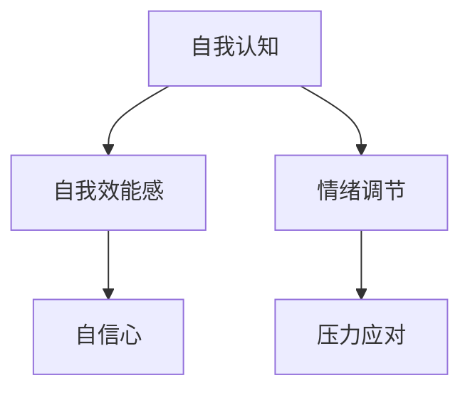

#### 6.2 情绪管理的基本原理

情绪管理是指个体如何识别、理解和调节自己的情绪，以适应不同情境并保持心理健康。情绪管理的基本原理包括以下几个方面：

1. **情绪识别**：情绪识别是情绪管理的第一步，涉及了解和识别自己当前的情绪状态。个体需要学会观察自己的身体反应、情感变化和思维模式，以便准确识别情绪。

2. **情绪理解**：情绪理解是指个体对情绪原因和后果的认识。了解情绪的起因和影响有助于个体更好地理解自己的情绪，从而采取适当的调节策略。

3. **情绪调节**：情绪调节是指通过不同的策略来调整和缓解负面情绪，保持心理健康。常见的情绪调节策略包括深呼吸、冥想、运动、倾诉等。

**关键概念与联系**：

| 概念 | 关系 | 说明 |
| --- | --- | --- |
| **情绪识别** | **基础** | 个体识别当前的情绪状态，如焦虑、愤怒或悲伤。 |
| **情绪理解** | **依赖** | 理解情绪的起因和影响，有助于更好地应对情绪。 |
| **情绪调节** | **目的** | 通过策略缓解负面情绪，保持心理健康。 |

**ER实体关系图架构**：

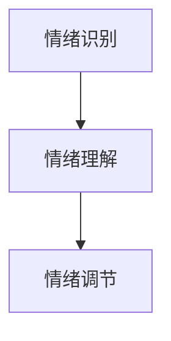

#### 6.3 常用的情绪管理技巧

以下是一些常用的情绪管理技巧，这些技巧可以帮助个体在面临压力时保持冷静和理智：

1. **深呼吸**：深呼吸是一种简单但有效的情绪调节方法，通过深吸气和缓慢呼气，可以降低心率和血压，缓解紧张和焦虑。

2. **冥想**：冥想有助于个体专注于当下，减轻心理压力，提升情绪管理能力。通过冥想，个体可以更好地理解自己的情绪，从而采取适当的调节策略。

3. **运动**：运动是缓解压力的有效方式，可以释放内啡肽，提升情绪。适量的运动有助于提高心理免疫力和整体健康水平。

4. **倾诉**：倾诉是指与朋友、家人或专业人士分享自己的情绪和感受。倾诉可以减轻心理负担，获得情感支持和建议。

5. **正念练习**：正念练习是一种关注当下、不评判的练习方法。通过正念练习，个体可以更好地管理自己的情绪，减少心理压力。

**关键概念与联系**：

| 概念 | 关系 | 说明 |
| --- | --- | --- |
| **深呼吸** | **基础** | 降低心率和血压，缓解紧张和焦虑。 |
| **冥想** | **依赖** | 提升情绪管理能力，减少心理压力。 |
| **运动** | **互动** | 释放内啡肽，提升情绪。 |
| **倾诉** | **目的** | 减轻心理负担，获得情感支持和建议。 |
| **正念练习** | **补充** | 提高情绪管理，减少心理压力。 |

**ER实体关系图架构**：

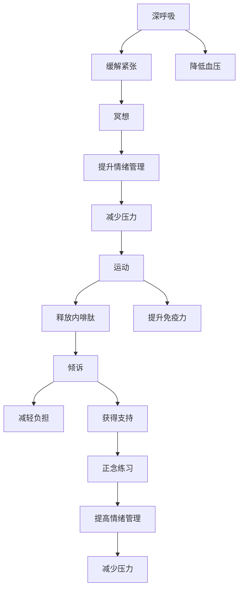

总结来说，自我认知与情绪管理是提升心理免疫力的关键环节。通过自我认知，个体可以更好地了解自己的情绪和需求，从而采取有效的情绪管理策略。这些策略不仅有助于缓解心理压力，还能提升整体心理健康水平。接下来，我们将探讨心理调适与压力应对的方法。

### 第7章：心理调适与压力应对

#### 7.1 心理调适的概念与作用

心理调适是指个体通过一系列的心理策略和行为，调整自己的心态和行为，以更好地应对压力和挑战。心理调适的作用主要体现在以下几个方面：

1. **增强心理韧性**：心理调适有助于个体在面对压力时保持心理韧性，从而更好地应对挑战。通过心理调适，个体可以培养积极的心态，增强应对困难的能力。

2. **提高生活质量**：有效的心理调适可以帮助个体减轻心理压力，提高生活质量。通过心理调适，个体可以更好地管理自己的情绪，提高幸福感。

3. **改善心理健康**：心理调适有助于缓解焦虑、抑郁等心理问题，改善心理健康。通过心理调适，个体可以更好地处理负面情绪，保持心理平衡。

4. **增强社会功能**：心理调适有助于个体更好地适应社会环境，提高社会功能。通过心理调适，个体可以建立更好的人际关系，提高社交能力。

**关键概念与联系**：

| 概念 | 关系 | 说明 |
| --- | --- | --- |
| **心理调适** | **基础** | 指个体通过心理策略和行为调整心态。 |
| **心理韧性** | **依赖** | 心理韧性是应对压力的重要能力。 |
| **生活质量** | **目的** | 通过减轻压力提高生活质量。 |
| **心理健康** | **目标** | 通过心理调适改善心理健康。 |
| **社会功能** | **结果** | 通过心理调适增强社交能力。 |

**ER实体关系图架构**：

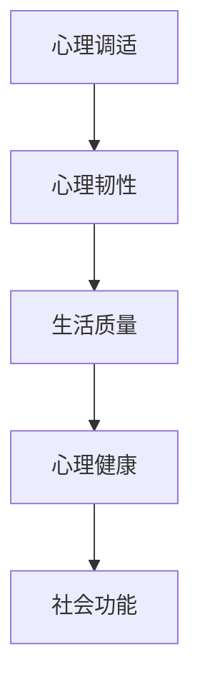

#### 7.2 压力的来源与类型

压力是心理调适的重要对象，了解压力的来源和类型有助于个体更好地应对压力。以下是一些常见的压力来源和类型：

1. **工作压力**：工作压力是现代社会中常见的压力源，包括工作负荷、工作环境、人际关系等。长期的工作压力会导致身心疲劳，影响心理健康。

2. **财务压力**：财务压力与个人经济状况相关，包括经济负担、债务问题、收入不稳定等。财务压力会引发焦虑和抑郁，影响生活质量。

3. **家庭压力**：家庭压力来源于家庭关系、子女教育、家庭责任等。家庭压力可能会导致家庭成员之间的关系紧张，影响家庭和谐。

4. **社交压力**：社交压力来源于社交活动、人际关系、社交评价等。社交压力可能导致个体感到孤立、焦虑和抑郁。

5. **健康压力**：健康压力来源于自身或家庭成员的健康问题，如疾病、治疗、康复等。健康压力会影响个体的情绪和心理健康。

**关键概念与联系**：

| 概念 | 关系 | 说明 |
| --- | --- | --- |
| **工作压力** | **主要** | 来自工作负荷和人际关系。 |
| **财务压力** | **关键** | 来自经济负担和债务问题。 |
| **家庭压力** | **基础** | 来自家庭关系和子女教育。 |
| **社交压力** | **重要** | 来自社交活动和人际关系。 |
| **健康压力** | **必要** | 来自健康问题和家庭成员健康。 |

**ER实体关系图架构**：

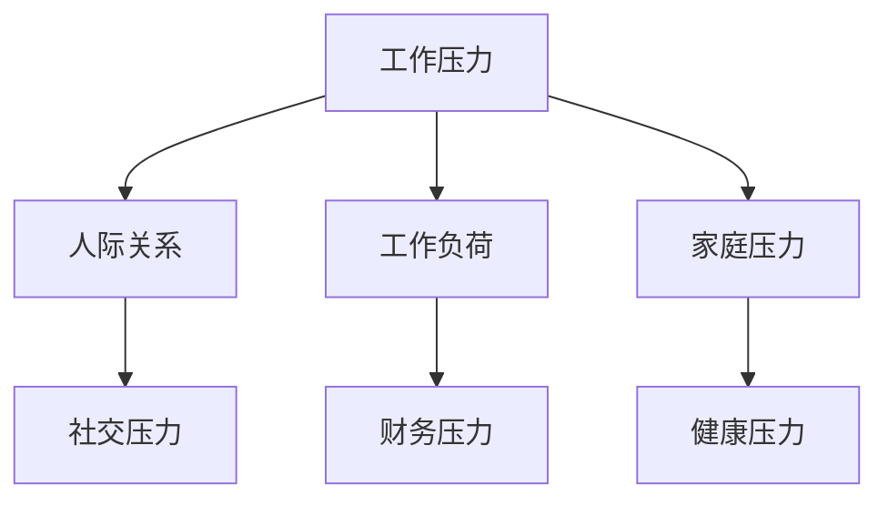

#### 7.3 压力应对策略

为了有效应对压力，个体可以采取以下策略：

1. **时间管理**：通过合理规划时间，减少因工作或生活负担过重而产生的压力。时间管理包括设定优先级、避免拖延、合理安排休息时间等。

2. **情绪调节**：通过情绪调节技巧，如深呼吸、冥想、运动等，缓解压力和负面情绪。情绪调节有助于个体保持心理平衡，提高应对压力的能力。

3. **积极心态**：培养积极的心态，通过积极的自我暗示和思维重构，减少对压力的负面影响。积极心态有助于个体更好地应对生活中的挑战。

4. **寻求支持**：通过寻求家人、朋友或专业人士的支持，分享压力和情绪，获得帮助和建议。社会支持是应对压力的重要资源。

5. **健康生活**：通过健康的生活方式，如充足的睡眠、均衡的饮食、适量的运动等，提高身体的免疫力和心理健康水平。

**关键概念与联系**：

| 概念 | 关系 | 说明 |
| --- | --- | --- |
| **时间管理** | **基础** | 合理安排时间，减少压力。 |
| **情绪调节** | **关键** | 缓解压力和负面情绪。 |
| **积极心态** | **目标** | 减少对压力的负面影响。 |
| **寻求支持** | **重要** | 分享压力，获得帮助。 |
| **健康生活** | **必要** | 提高免疫力和心理健康。 |

**ER实体关系图架构**：

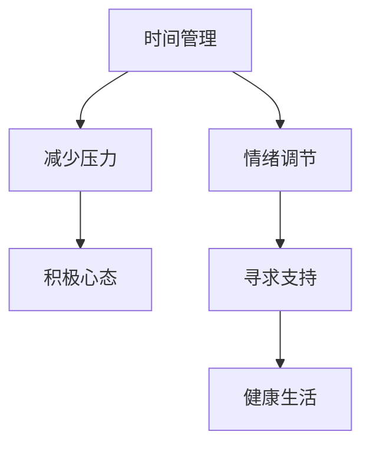

总结来说，心理调适与压力应对是提升心理免疫力的重要方法。通过了解压力的来源和类型，采取有效的应对策略，个体可以更好地管理压力，保持心理健康。接下来，我们将探讨生活方式与心理免疫力的关系。

### 第8章：生活方式与心理免疫力的关系

#### 8.1 生活方式对心理免疫力的作用

生活方式是影响心理免疫力的重要因素之一。健康的生活方式有助于提高个体的心理免疫力，从而更好地应对生活中的压力和挑战。以下是一些健康生活方式对心理免疫力的积极作用：

1. **均衡饮食**：均衡饮食可以提供身体所需的营养，增强免疫系统的功能。富含维生素、矿物质和抗氧化剂的食物有助于维持心理免疫力的平衡。

2. **适量运动**：适量的运动可以促进血液循环，提高身体的代谢水平，增强心肺功能。运动还可以释放内啡肽，提升情绪，有助于减轻心理压力。

3. **充足睡眠**：充足的睡眠有助于恢复身体和心理的能量，促进免疫系统的正常运作。睡眠不足会影响认知功能，降低心理免疫力。

4. **减少应激**：减少应激是保持心理健康的重要策略。通过放松技巧、冥想和适当的休息时间，个体可以减轻心理压力，提高心理免疫力。

**关键概念与联系**：

| 概念 | 关系 | 说明 |
| --- | --- | --- |
| **均衡饮食** | **基础** | 提供身体所需的营养，增强免疫力。 |
| **适量运动** | **关键** | 提高代谢，增强心肺功能。 |
| **充足睡眠** | **重要** | 恢复身体和心理能量。 |
| **减少应激** | **目标** | 减轻心理压力，提高心理免疫力。 |

**ER实体关系图架构**：

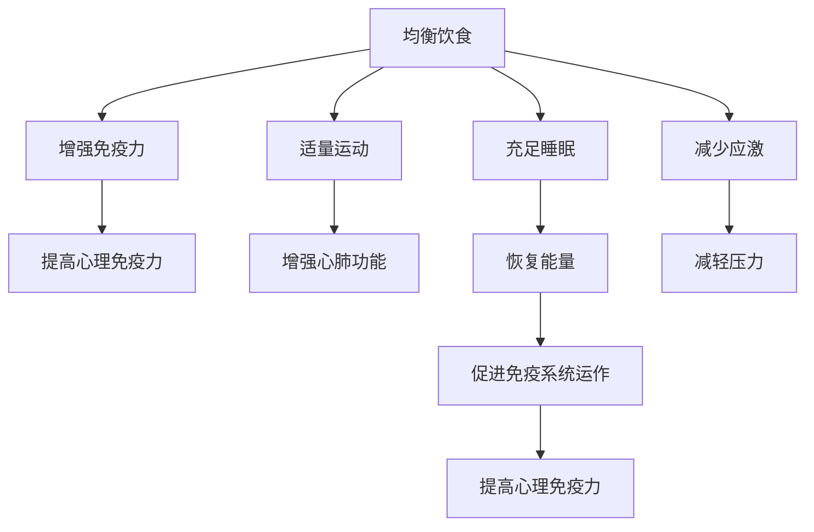

#### 8.2 健康生活方式的养成

养成健康的生活方式是提升心理免疫力的关键。以下是一些具体的建议：

1. **合理膳食**：合理膳食包括摄入充足的蛋白质、碳水化合物、脂肪以及维生素和矿物质。建议每天摄入多样化的食物，包括蔬菜、水果、全谷物、坚果和种子。

2. **定期锻炼**：定期锻炼可以帮助身体保持健康。建议每周至少进行150分钟的中等强度运动，如快走、骑自行车或游泳。对于无法定期锻炼的人群，建议每天进行至少10分钟的身体活动。

3. **充足睡眠**：保证每天7-9小时的睡眠，有助于身体和大脑的恢复。建议保持规律的作息时间，避免熬夜和长时间使用电子设备。

4. **心理放松**：通过冥想、瑜伽、深呼吸等放松技巧，减轻心理压力。建议每天留出一些时间进行自我放松，如阅读、听音乐或进行轻度运动。

**关键概念与联系**：

| 概念 | 关系 | 说明 |
| --- | --- | --- |
| **合理膳食** | **基础** | 提供身体所需的营养。 |
| **定期锻炼** | **关键** | 提高代谢，增强免疫力。 |
| **充足睡眠** | **重要** | 恢复身体和心理能量。 |
| **心理放松** | **补充** | 减轻心理压力，提高免疫力。 |

**ER实体关系图架构**：

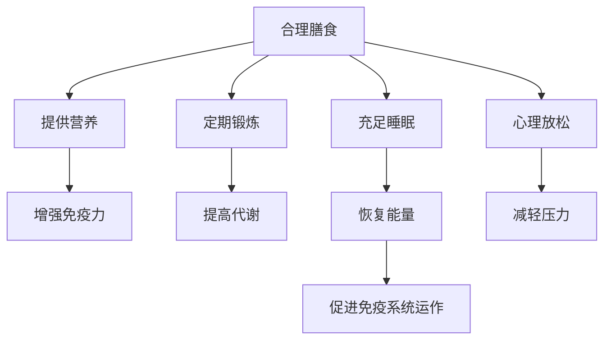

#### 8.3 生活方式改变的心理免疫效果

生活方式的改变对心理免疫力有显著的影响。以下是一些具体案例：

1. **饮食改善**：一个饮食不均衡的人，通过增加蔬菜和水果的摄入，减少高糖和高脂食物的摄入，可以显著提高心理免疫力。研究显示，均衡饮食有助于降低焦虑和抑郁的发生率。

2. **运动习惯**：一个长期缺乏运动的人，通过每周进行适量的运动，可以显著提高心理免疫力。运动不仅可以改善心血管健康，还能释放内啡肽，提升情绪。

3. **睡眠质量**：一个长期睡眠不足的人，通过改善睡眠质量，如减少睡前使用电子设备、保持规律的作息时间，可以显著提高心理免疫力。充足的睡眠有助于恢复大脑功能，提高应对压力的能力。

4. **心理放松**：一个经常感到压力和焦虑的人，通过练习冥想和深呼吸等放松技巧，可以显著提高心理免疫力。心理放松有助于减轻心理负担，提升应对压力的能力。

**关键概念与联系**：

| 概念 | 关系 | 说明 |
| --- | --- | --- |
| **饮食改善** | **基础** | 提高心理免疫力。 |
| **运动习惯** | **关键** | 增强心理免疫力。 |
| **睡眠质量** | **重要** | 提高心理免疫力。 |
| **心理放松** | **补充** | 减轻心理压力，提升心理免疫力。 |

**ER实体关系图架构**：

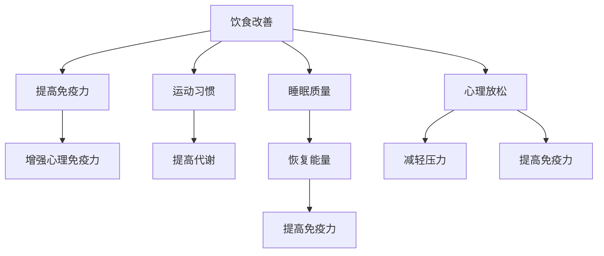

总结来说，生活方式的改变对心理免疫力有着显著的影响。通过合理膳食、定期锻炼、充足睡眠和心理放松，个体可以显著提高心理免疫力，更好地应对生活中的压力和挑战。接下来，我们将探讨社会支持与心理免疫力的提升。

### 第9章：社会支持与心理免疫力的提升

#### 9.1 社会支持的重要性

社会支持是指个体从家人、朋友、同事和社区等社会网络中获得的情感、信息和资源的支持。社会支持对于提升心理免疫力具有至关重要的作用。以下是一些具体原因：

1. **情感支持**：社会支持可以提供情感上的安慰和鼓励，帮助个体在面临压力和挑战时保持积极的心态。情感支持有助于减轻个体的心理负担，提高应对压力的能力。

2. **信息支持**：社会支持可以提供有价值的信息和建议，帮助个体更好地应对生活中的问题和挑战。例如，当个体遇到健康问题或职业发展难题时，朋友和家人的建议可以提供重要的帮助。

3. **资源支持**：社会支持可以提供实际的资源，如金钱、物资、时间和专业知识等。这些资源有助于个体解决实际困难，提高生活质量。

**关键概念与联系**：

| 概念 | 关系 | 说明 |
| --- | --- | --- |
| **情感支持** | **基础** | 减轻心理负担，提高应对能力。 |
| **信息支持** | **关键** | 提供建议和指导，帮助解决问题。 |
| **资源支持** | **目标** | 解决实际困难，提高生活质量。 |

**ER实体关系图架构**：

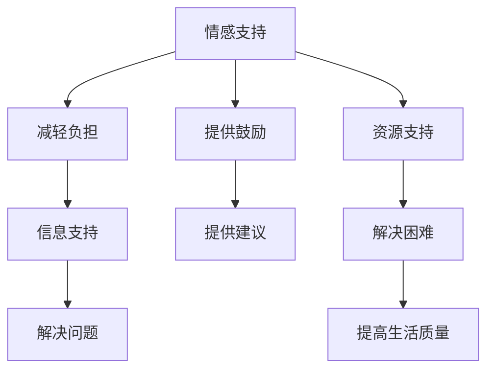

#### 9.2 社会支持的类型与形式

社会支持可以分为多种类型，每种类型都有其独特的特点和作用。以下是一些常见的社会支持类型和形式：

1. **家庭支持**：家庭支持是人们获得社会支持的重要来源。家庭成员之间的情感交流、关心和支持有助于个体在面对压力时保持心理平衡。

2. **朋友支持**：朋友支持是另一个重要的社会支持来源。朋友可以提供情感上的支持和实际的帮助，帮助个体度过困难时期。

3. **专业支持**：专业支持包括心理咨询师、医生、社工等专业人士提供的帮助。专业支持可以提供专业的建议和治疗方案，帮助个体更好地管理心理和生理健康。

4. **社区支持**：社区支持是指个体从社区组织、志愿者和邻里中获得的支持。社区支持可以包括志愿服务、社区活动、邻里互助等形式。

**关键概念与联系**：

| 概念 | 关系 | 说明 |
| --- | --- | --- |
| **家庭支持** | **基础** | 提供情感上的安慰和实际帮助。 |
| **朋友支持** | **重要** | 提供情感上的支持和实际帮助。 |
| **专业支持** | **专业** | 提供专业的建议和治疗。 |
| **社区支持** | **补充** | 提供多样化的社区资源和服务。 |

**ER实体关系图架构**：

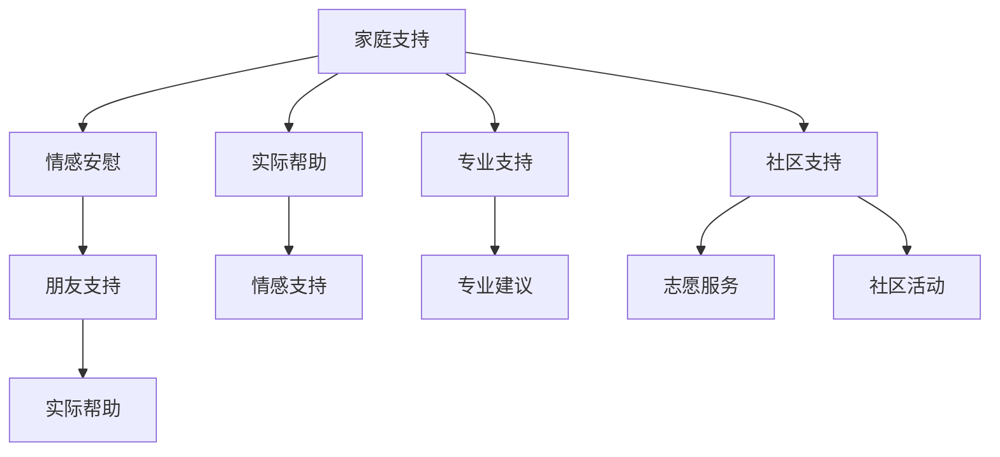

#### 9.3 社会支持在心理免疫力提升中的应用

社会支持在提升心理免疫力中起着关键作用。以下是一些具体的应用场景：

1. **应对工作压力**：在职场中，同事和领导的支持可以帮助个体应对工作压力。例如，同事之间的互助和领导的理解与支持可以减轻个体的工作压力，提高心理免疫力。

2. **应对家庭压力**：家庭支持在应对家庭压力中至关重要。家庭成员之间的沟通和理解可以帮助个体缓解家庭压力，提高心理免疫力。

3. **应对健康问题**：专业支持在应对健康问题中具有重要价值。医生、心理咨询师等专业人士可以提供专业的治疗和心理咨询，帮助个体更好地应对健康问题，提升心理免疫力。

4. **应对社交压力**：社区支持在应对社交压力中发挥着重要作用。社区组织、志愿者和邻里互助等形式可以提供情感上的支持和实际帮助，帮助个体应对社交压力，提高心理免疫力。

**关键概念与联系**：

| 概念 | 关系 | 说明 |
| --- | --- | --- |
| **工作压力** | **挑战** | 职场压力影响心理免疫力。 |
| **家庭压力** | **挑战** | 家庭压力影响心理免疫力。 |
| **健康问题** | **挑战** | 健康问题影响心理免疫力。 |
| **社交压力** | **挑战** | 社交压力影响心理免疫力。 |
| **家庭支持** | **应对策略** | 减轻家庭压力，提高心理免疫力。 |
| **朋友支持** | **应对策略** | 减轻社交压力，提高心理免疫力。 |
| **专业支持** | **应对策略** | 应对健康问题，提高心理免疫力。 |
| **社区支持** | **应对策略** | 应对工作压力，提高心理免疫力。 |

**ER实体关系图架构**：

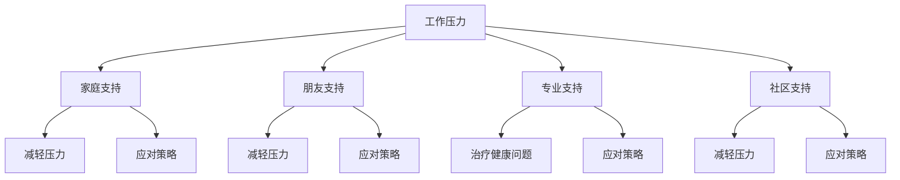

总结来说，社会支持在提升心理免疫力中发挥着重要作用。通过家庭支持、朋友支持、专业支持和社区支持，个体可以获得情感上的安慰、实际的帮助和专业的治疗，从而更好地应对生活中的压力和挑战，提高心理免疫力。

### 第10章：心理免疫力的综合提升策略

#### 10.1 综合提升策略概述

提升心理免疫力需要采取综合性的策略，这些策略应涵盖自我认知与情绪管理、心理调适与压力应对、生活方式调整和社会支持等多个方面。以下是一个综合提升策略的概述：

1. **自我认知与情绪管理**：通过自我反思和认知行为疗法，个体可以更好地了解自己的情绪和行为模式，并采取有效的情绪调节技巧，如深呼吸、冥想等。

2. **心理调适与压力应对**：个体应学会识别和管理压力源，采取积极的心态应对压力，并利用放松技巧和正念练习来缓解压力。

3. **生活方式调整**：通过改善饮食习惯、增加运动、保证充足睡眠和减少应激，个体可以增强身体的免疫力和心理健康。

4. **社会支持**：建立和维护良好的社会关系，寻求家人、朋友和专业人士的支持，可以提供情感上的安慰和实际的帮助，增强个体的心理免疫力。

#### 10.2 综合提升策略的实施步骤

以下是具体实施综合提升策略的步骤：

1. **评估当前状况**：首先，个体应进行自我评估，了解自己的心理健康状况、压力水平和生活方式。

2. **设定目标**：根据评估结果，设定明确的提升心理免疫力的目标，如改善饮食习惯、增加运动时间等。

3. **制定计划**：制定详细的行动计划，包括具体的实施步骤、时间表和可量化的指标。

4. **情绪管理训练**：通过参加情绪管理课程或咨询，学习情绪调节技巧，如认知重构、正念练习等。

5. **压力应对练习**：通过学习压力管理技巧，如时间管理、放松训练、积极心态培养等，提高应对压力的能力。

6. **生活方式调整**：调整饮食结构，增加蔬菜、水果和全谷物的摄入；定期进行适量的运动，如快走、骑自行车等；保证充足的睡眠，避免熬夜和长时间使用电子设备。

7. **寻求支持**：建立和维护良好的社会关系，如与家人、朋友和同事保持联系，参加社区活动等。如有需要，可以寻求心理咨询师或医生的专业帮助。

8. **持续监测与调整**：定期评估心理免疫力的提升情况，根据评估结果调整提升策略，确保持续改善心理健康水平。

#### 10.3 综合提升策略的实际案例

以下是一个综合提升策略的实际案例：

**案例背景**：李先生，35岁，IT行业员工，工作繁忙，经常加班，饮食不规律，睡眠质量差，感到心理压力大，情绪波动大。

**实施步骤**：

1. **评估当前状况**：李先生进行自我评估，发现自己的心理健康状况不佳，压力水平高，情绪不稳定。

2. **设定目标**：李先生设定了以下目标：
    - 每天保持7-8小时的充足睡眠；
    - 每周至少进行3次运动，每次30分钟；
    - 改善饮食习惯，增加蔬菜、水果和全谷物的摄入。

3. **制定计划**：李先生制定了以下行动计划：
    - 每天晚上10点前睡觉，早上7点起床，保持规律的作息时间；
    - 每天工作后进行快走或骑自行车等轻度运动；
    - 每天早餐增加一份水果，晚餐增加一份蔬菜。

4. **情绪管理训练**：李先生参加了一个情绪管理课程，学习了认知重构和正念练习技巧，并开始每天练习冥想。

5. **压力应对练习**：李先生学习了时间管理技巧，开始优先处理重要任务，减少了加班时间。他也开始使用深呼吸和放松技巧来缓解压力。

6. **生活方式调整**：李先生开始遵循健康的饮食习惯，每周进行至少3次运动，睡眠质量得到了显著改善。

7. **寻求支持**：李先生与家人和同事保持良好的沟通，分享自己的情绪和压力，得到了他们的理解和支持。

8. **持续监测与调整**：李先生定期评估自己的心理健康状况，根据评估结果调整行动计划，确保持续改善心理健康。

**效果评估**：经过6个月的综合提升策略实施，李先生的心理健康状况显著改善，压力水平降低，情绪更加稳定。他不仅提高了工作效率，还与家人和朋友的关系更加和谐。

总结来说，综合提升策略通过多方面的干预和调整，可以显著提高个体的心理免疫力，改善心理健康水平。通过实际案例，我们可以看到，这些策略在日常生活中是可行且有效的。接下来，我们将探讨心理免疫力的实际应用与案例分析。

### 第11章：企业心理健康管理实践

#### 11.1 企业心理健康管理的现状

随着企业对员工心理健康关注度的提高，越来越多的企业开始实施心理健康管理策略。然而，心理健康管理的现状仍存在一些挑战。以下是一些关键现状：

1. **重视程度提高**：越来越多的企业认识到心理健康对企业整体绩效和员工幸福感的重要性，开始重视心理健康管理。

2. **资源投入不足**：尽管企业对心理健康管理的重视程度提高，但实际投入的资源仍然不足，如专业心理健康服务、员工心理健康培训等。

3. **管理层参与度不高**：心理健康管理需要企业高层的支持和参与，但实际情况是管理层对心理健康管理的参与度不高，导致政策执行和资源分配存在障碍。

4. **员工需求多样性**：员工的心理健康需求多样化，但现有的心理健康管理策略往往无法满足不同员工的具体需求。

5. **心理健康问题认知不足**：许多员工对企业提供的心理健康服务不了解，缺乏心理健康知识，导致心理健康问题未能及时识别和处理。

#### 11.2 企业心理健康管理的策略

为了有效提升员工的心理健康水平，企业可以采取以下策略：

1. **建立心理健康政策**：企业应制定明确的心理健康政策，明确心理健康管理的目标和原则，为员工提供清晰的健康指导。

2. **提供专业心理健康服务**：企业可以与专业的心理健康服务机构合作，为员工提供心理健康咨询、心理治疗和心理健康培训等服务。

3. **实施员工心理健康培训**：通过心理健康培训，提高员工对心理健康问题的认知，帮助他们掌握情绪管理和压力应对的技巧。

4. **建立员工支持网络**：通过建立员工支持网络，如员工互助小组、员工辅导计划等，为员工提供情感支持和实际帮助。

5. **关注员工心理健康数据**：通过心理健康监测工具，定期收集和分析员工心理健康数据，及时发现潜在问题，采取针对性干预措施。

6. **加强管理层参与**：通过培训和沟通，提高管理层对心理健康管理的认识和参与度，确保心理健康管理政策的顺利执行。

#### 11.3 企业心理健康管理的案例分析

**案例背景**：某大型科技企业，员工人数超过1000人，工作压力大，员工心理健康问题频发。企业决定实施心理健康管理策略，以提高员工心理健康水平和整体绩效。

**实施步骤**：

1. **建立心理健康政策**：企业制定了《员工心理健康管理政策》，明确心理健康管理的目标和原则，包括提供心理健康服务、心理健康培训和员工支持网络等。

2. **提供专业心理健康服务**：企业与当地知名心理健康服务机构合作，为员工提供免费的心理健康咨询服务，包括心理健康评估、心理咨询和心理治疗。

3. **实施员工心理健康培训**：企业定期组织心理健康培训课程，内容涵盖情绪管理、压力应对、心理健康知识等，提高员工的自我保健意识。

4. **建立员工支持网络**：企业建立了员工互助小组和员工辅导计划，为员工提供情感支持和实际帮助，解决他们在工作和生活中的问题。

5. **关注员工心理健康数据**：企业引入心理健康监测工具，定期收集和分析员工心理健康数据，及时发现潜在问题，采取针对性干预措施。

6. **加强管理层参与**：企业高管理层积极参与心理健康管理，定期与员工沟通，了解员工心理健康状况，推动心理健康管理政策的执行。

**效果评估**：

1. **员工心理健康水平提升**：通过心理健康服务、培训和员工支持网络，员工心理健康水平显著提升，心理健康问题投诉率下降。

2. **员工满意度提高**：员工对心理健康管理政策的满意度提高，对企业文化和工作环境更加认可。

3. **整体绩效提升**：员工心理健康水平的提升有助于提高工作效率和团队合作，整体绩效显著提升。

总结来说，企业心理健康管理对于提高员工心理健康水平、降低心理健康问题发生率具有重要意义。通过建立有效的心理健康管理策略，企业可以创造一个更加健康、和谐的工作环境，提高员工满意度和整体绩效。接下来，我们将探讨学校心理健康教育的探索。

### 第12章：学校心理健康教育探索

#### 12.1 学校心理健康教育的意义

学校心理健康教育在学生全面发展中起着至关重要的作用。以下是一些关键意义：

1. **预防心理健康问题**：学校心理健康教育可以帮助学生识别和应对早期心理健康问题，如焦虑、抑郁等，从而预防心理健康问题的发生。

2. **提高心理素质**：通过心理健康教育，学生可以学会如何管理情绪、应对压力和建立良好的人际关系，从而提高心理素质。

3. **促进学业成功**：心理健康良好的学生通常能更好地专注于学习，提高学习效率和学业成绩。

4. **培养健全人格**：学校心理健康教育有助于培养学生积极的人生态度和价值观，促进其个性发展和社会适应能力。

5. **提升生活质量**：心理健康教育不仅对学生的现在有益，还能对其未来生活产生积极影响，提高整体生活质量。

#### 12.2 学校心理健康教育的策略

为了有效实施学校心理健康教育，学校可以采取以下策略：

1. **整合心理健康教育课程**：将心理健康教育内容融入学校的不同学科课程中，如语文、数学、科学等，使学生在学习过程中自然接触到心理健康知识。

2. **开展心理健康主题活动**：定期组织心理健康主题活动，如心理健康讲座、心理游戏、心理电影等，激发学生参与兴趣，提高心理健康意识。

3. **提供心理咨询服务**：学校应设立心理辅导室，提供专业的心理咨询服务，帮助学生解决心理问题和困惑。

4. **加强师资培训**：对教师进行心理健康教育培训，提高教师的心理健康知识和应对学生心理问题的能力。

5. **建立学生心理档案**：建立学生心理档案，定期跟踪学生心理健康状况，及时发现问题并提供个性化支持。

6. **家校合作**：加强与家长的合作，通过家长会、家长讲座等形式，共同关注学生的心理健康，形成家校共育的良好氛围。

#### 12.3 学校心理健康教育的案例分析

**案例背景**：某中学认识到心理健康教育的重要性，决定实施全面的学校心理健康教育计划，以提高学生的心理健康水平。

**实施步骤**：

1. **整合心理健康教育课程**：学校将心理健康教育内容融入不同学科课程，如在语文课中讨论情感管理，在体育课中强调团队精神和压力应对。

2. **开展心理健康主题活动**：学校定期举办心理健康主题活动，如“情绪管理周”、“心理健康讲座”等，邀请专业人士进行讲解和互动。

3. **提供心理咨询服务**：学校设立心理辅导室，为学生提供免费的心理咨询服务，帮助学生解决心理困惑和问题。

4. **加强师资培训**：学校对教师进行心理健康教育培训，提高教师对学生心理问题的识别和应对能力。

5. **建立学生心理档案**：学校建立学生心理档案，定期进行心理健康评估，及时发现和干预心理问题。

6. **家校合作**：学校通过家长会、家长讲座等形式，与家长共同关注学生的心理健康，建立良好的家校沟通机制。

**效果评估**：

1. **学生心理健康水平提升**：通过心理健康教育，学生的心理健康水平显著提升，焦虑和抑郁症状减少。

2. **学生满意度提高**：学生对学校心理健康教育活动的满意度提高，认为这些活动有助于提高他们的心理健康水平。

3. **家长参与度提升**：家长对学校心理健康教育的认可度提高，更愿意参与家校合作，共同关注学生的心理健康。

总结来说，学校心理健康教育对于提升学生的心理健康水平、预防心理健康问题具有重要意义。通过有效的心理健康教育策略，学校可以为学生提供一个健康、积极的学习环境，促进其全面发展。接下来，我们将探讨社区心理健康服务的实践。

### 第13章：社区心理健康服务的实践

#### 13.1 社区心理健康服务的概念

社区心理健康服务是指通过社区医疗机构、非营利组织和社会工作者等，为社区居民提供心理健康支持和服务的活动。这些服务旨在提升社区居民的心理健康水平，预防和缓解心理健康问题。社区心理健康服务通常包括心理咨询、心理治疗、心理健康教育、危机干预等多种形式。

#### 13.2 社区心理健康服务的内容

社区心理健康服务的内容丰富多样，具体包括以下几个方面：

1. **心理咨询**：为社区居民提供一对一的心理咨询服务，帮助个体解决心理困扰，如焦虑、抑郁、人际关系问题等。

2. **心理治疗**：对于患有严重心理障碍的居民，提供专业心理治疗，如认知行为疗法、精神分析疗法等。

3. **心理健康教育**：通过讲座、工作坊、宣传资料等形式，向社区居民普及心理健康知识，提高心理健康意识。

4. **危机干预**：在突发事件或危机情况下，为受影响的居民提供紧急心理援助，如自然灾害、事故等。

5. **家庭治疗**：为家庭提供心理健康服务，帮助家庭成员解决家庭矛盾，提高家庭功能。

6. **社会支持**：建立社区支持网络，为居民提供情感支持、信息支持和实际帮助，缓解心理压力。

#### 13.3 社区心理健康服务的案例分析

**案例背景**：某城市社区由于居民生活节奏加快、工作压力增大，心理健康问题逐渐凸显。为了提升社区居民的心理健康水平，社区决定实施一系列心理健康服务。

**实施步骤**：

1. **需求评估**：社区通过问卷调查和访谈，了解居民的心理健康需求和问题，为制定服务计划提供依据。

2. **制定服务计划**：根据需求评估结果，社区制定了心理健康服务计划，包括心理咨询、心理健康讲座、危机干预等。

3. **提供服务**：
    - **心理咨询**：社区设立心理健康咨询室，每周提供多次心理咨询，由专业心理咨询师进行一对一服务。
    - **心理健康讲座**：定期举办心理健康讲座，邀请心理学专家讲解心理健康知识，提高居民的心理健康意识。
    - **危机干预**：在突发事件发生时，及时开展危机干预，为受影响的居民提供心理援助。

4. **建立支持网络**：社区建立了居民互助小组和志愿者团队，为居民提供情感支持和实际帮助。

**效果评估**：

1. **居民心理健康水平提升**：通过心理健康服务，居民的心理健康水平显著提升，心理健康问题投诉率下降。

2. **心理健康意识提高**：居民对心理健康问题的认知度提高，开始主动寻求心理健康服务，心理健康意识得到增强。

3. **社区凝聚力增强**：通过建立支持网络和志愿者团队，社区凝聚力增强，居民之间的互动和互助增加。

总结来说，社区心理健康服务对于提升社区居民的心理健康水平、预防和缓解心理健康问题具有重要意义。通过有效的服务措施和社区支持网络，社区可以为居民提供一个更加健康、和谐的生活环境。接下来，我们将探讨心理健康教育与政策的关系。

### 第14章：心理健康教育与政策

#### 14.1 心理健康教育的政策背景

心理健康教育作为国家和社会关注的重要议题，其政策背景主要包括以下几个方面：

1. **公共卫生战略**：心理健康教育被视为公共卫生的重要组成部分，国家在《健康中国2030》规划纲要中明确提出加强心理健康教育和心理健康服务体系建设。

2. **教育改革**：随着教育改革的推进，心理健康教育逐渐被纳入学校教育体系，成为素质教育的重要内容。

3. **社会政策**：政府在《中华人民共和国精神卫生法》等法律法规中，明确心理健康教育的法律地位，要求各级政府和社会组织加强心理健康教育。

4. **公共卫生支出**：国家加大对心理健康教育的财政投入，支持心理健康教育机构的建立和发展。

#### 14.2 心理健康教育的政策实践

心理健康教育的政策实践主要包括以下几个方面：

1. **学校心理健康教育**：学校心理健康教育政策要求各级学校开设心理健康课程，配备专业心理教师，提供心理健康咨询和辅导服务。

2. **社区心理健康服务**：政府推动社区心理健康服务体系建设，鼓励社区建立心理健康服务中心，提供多样化的心理健康服务。

3. **心理健康宣传**：通过媒体、网络等渠道，加大心理健康知识的宣传力度，提高公众对心理健康问题的认知。

4. **心理健康法规**：制定和完善心理健康相关法规，保障心理健康教育的实施和心理健康服务的提供。

5. **心理健康评估与监测**：建立心理健康评估和监测体系，定期对心理健康状况进行评估，及时发现和干预心理问题。

#### 14.3 心理健康教育的政策趋势

未来心理健康教育政策的发展趋势主要包括以下几个方面：

1. **政策体系完善**：进一步完善心理健康教育政策体系，提高政策的针对性和可操作性。

2. **资源投入增加**：加大对心理健康教育的财政投入，确保心理健康教育的实施和心理健康服务的提供。

3. **多元化服务模式**：推动心理健康服务模式的多元化发展，如线上心理健康服务、心理健康教育信息化等。

4. **跨部门协作**：加强心理健康教育与其他领域的协作，如教育、卫生、民政等，形成合力，共同推进心理健康教育。

5. **社会参与**：鼓励社会各界参与心理健康教育，如社会组织、企业、志愿者等，共同促进心理健康教育的发展。

总结来说，心理健康教育作为国家和社会关注的重要领域，政策背景和实践不断推进，未来发展趋势充满机遇。通过完善政策体系、增加资源投入、推动服务模式创新和社会参与，心理健康教育将更好地满足公众的需求，提升心理健康水平。

### 第15章：总结与展望

#### 15.1 全书总结

本书围绕心理免疫力提升这一主题，系统地探讨了心理健康的重要性、心理免疫力的定义与特征、影响因素、评估方法、提升策略以及实际应用。通过自我认知与情绪管理、心理调适与压力应对、生活方式调整和社会支持等多方面的综合提升策略，我们提出了一套科学、实用的提升心理免疫力的方法。

#### 15.2 心理免疫力提升的重要性

心理免疫力提升对个体的心理健康和生活质量具有深远影响。它不仅有助于减轻心理压力、预防心理健康问题，还能提高生理健康水平，增强个体的适应能力和生活质量。在现代社会，提升心理免疫力对于应对快节奏生活和多变的社会环境尤为重要。

#### 15.3 未来发展趋势与展望

未来，心理健康教育和心理免疫力提升将继续成为社会关注的焦点。以下是一些发展趋势和展望：

1. **政策支持**：随着对心理健康重要性的认识不断加深，政府和社会各界将加大对心理健康教育的政策支持，推动心理健康服务的普及和发展。

2. **技术创新**：心理健康教育与技术的结合将越来越紧密，如通过人工智能、虚拟现实等新技术提供个性化心理健康服务，提高心理健康教育的效率和质量。

3. **社会参与**：心理健康教育将鼓励更多社会力量参与，如企业、非营利组织、志愿者等，形成多元化的心理健康服务网络。

4. **跨学科合作**：心理健康教育将与其他学科（如医学、教育学、社会学等）进行深入合作，推动心理健康教育的全面发展。

5. **心理健康素养普及**：心理健康素养的普及将成为教育的重要内容，培养公众对心理健康的正确认识和管理能力。

总之，心理免疫力提升是一项长期而重要的任务，需要社会各界的共同努力。通过持续的教育和干预，我们可以建设一个更加健康、和谐的社会，提升公众的心理健康水平，实现个体的全面发展。作者：AI天才研究院/AI Genius Institute & 禅与计算机程序设计艺术 /Zen And The Art of Computer Programming

