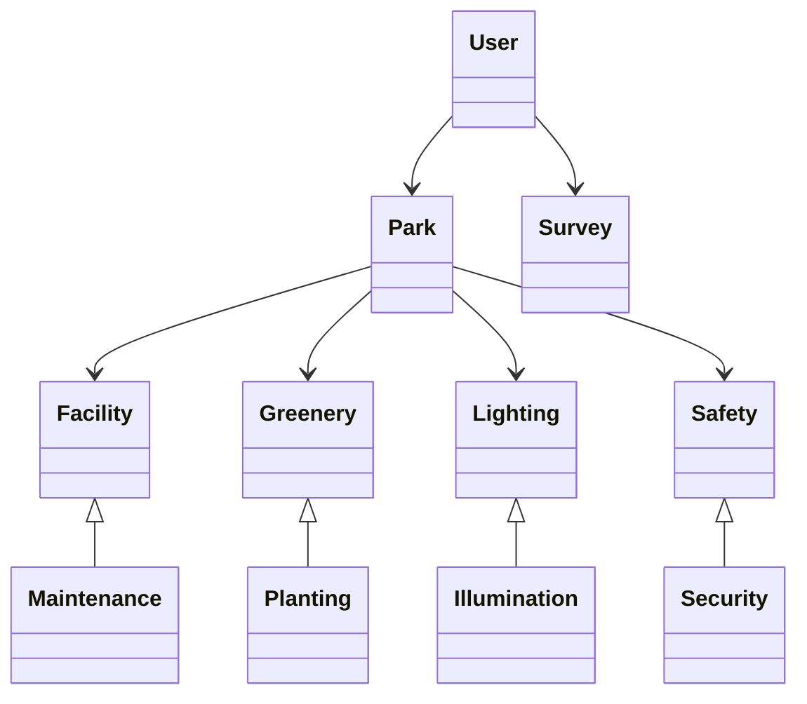
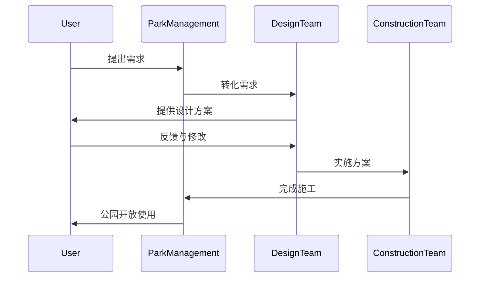

                 

# 心理地理学应用：空间设计中的情感因素

## 关键词
心理地理学、空间设计、情感因素、感知、认知、行为、城市规划、环境心理学

## 摘要
本文探讨了心理地理学在空间设计中的应用，特别是情感因素对空间行为的影响。通过分析心理地理学的核心概念、理论与模型，我们揭示了地理环境如何作用于个体的感知、认知和行为，进而影响空间设计的有效性和用户体验。文章旨在为城市规划者和设计师提供科学依据和实用指南，以创造更加舒适、健康和富有情感共鸣的空间环境。

## 1.1 背景介绍：心理地理学概述

### 1.1.1 心理地理学的定义与核心概念

心理地理学是一门研究人类心理活动与地理环境之间相互作用的学科。它关注于探讨地理位置、环境特征对个体心理行为的影响，以及个体心理活动如何影响其空间行为和地理认知。

核心概念包括：

- **地理感知**：个体对地理环境的感知过程，包括视觉、听觉、嗅觉等感官刺激。
- **空间认知**：个体对空间的认识和理解过程，包括空间概念的形成、空间关系的识别等。
- **空间行为**：个体在地理空间中的活动和行为，如居住、工作、休闲等。
- **情感因素**：地理环境对个体情感的影响，如安全感、归属感、舒适感等。

#### 1.1.2 心理地理学的研究意义

心理地理学的研究意义在于：

- **揭示地理环境对个体心理健康的影响**：通过了解地理环境对心理行为的影响，可以为城市规划、环境设计等提供科学依据。
- **促进心理健康服务的发展**：心理地理学可以为心理健康服务提供新的视角和方法，如地理治疗、环境适应训练等。
- **丰富地理学理论体系**：心理地理学为地理学引入心理学、环境科学等学科的理论和方法，丰富了地理学的理论体系。

#### 1.1.3 心理地理学的边界与外延

心理地理学的边界涉及：

- **地理学领域**：包括地理环境、地理空间、地理信息等。
- **心理学领域**：包括认知心理学、社会心理学、发展心理学等。

其外延涉及：

- **环境心理学**：研究环境对个体心理行为的影响。
- **城市规划**：考虑地理环境对城市布局、建筑设计的影响。
- **公共健康**：探讨地理环境对公共健康的影响。

### 1.2 核心概念与联系

#### 1.2.1 地理感知与空间认知

地理感知是空间认知的基础，它涉及个体对地理环境的感知和体验。空间认知则是在地理感知的基础上，个体对空间信息的处理和理解。

**概念属性特征对比表格：**

| 特征       | 地理感知                | 空间认知                |
| ---------- | ---------------------- | ---------------------- |
| 定义       | 个体对地理环境的感官体验 | 个体对空间信息处理的认知 |
| 关系       | 基础                | 建立在地理感知之上       |
| 影响因素   | 感官刺激               | 经验、文化、知识         |
| 结果       | 心理体验               | 空间概念、空间关系       |

#### 1.2.2 空间行为与情感因素

空间行为是个体在地理空间中的活动，情感因素则是地理环境对个体情感的影响。

**概念属性特征对比表格：**

| 特征       | 空间行为                  | 情感因素                |
| ---------- | ---------------------- | ---------------------- |
| 定义       | 个体在地理空间中的活动    | 地理环境对个体情感的影响 |
| 影响因素   | 地理环境、社会因素       | 地理环境、文化、个性     |
| 结果       | 空间利用、空间选择       | 情感体验、行为倾向       |

### 1.3 心理地理学的理论框架与模型

#### 1.3.1 心理地理学的理论框架

心理地理学的理论框架主要包括以下几个部分：

- **感知阶段**：个体通过感官体验地理环境。
- **认知阶段**：个体对感知到的地理环境信息进行加工和理解。
- **行为阶段**：个体基于认知结果，在地理空间中实施行为。
- **情感阶段**：地理环境对个体情感的影响。

#### 1.3.2 心理地理学的模型

心理地理学中常用的模型包括：

- **感知-认知-行为模型**：描述个体从感知地理环境到实施空间行为的全过程。
- **情感-行为模型**：强调地理环境对个体情感的影响，进而影响其空间行为。

**ER实体关系图架构的 Mermaid 流程图：**

```mermaid
erDiagram
    User ||--|{ Geographic Perception }|
    User ||--|{ Spatial Cognition }|
    User ||--|{ Spatial Behavior }|
    User ||--|{ Emotional Factors }|
    Geographic Perception ||--|{ Spatial Cognition }|
    Spatial Cognition ||--|{ 
```## 1.1.1 心理地理学的定义与核心概念

心理地理学（Psychogeography）是一门跨学科的研究领域，它结合了心理学、地理学、环境科学等多个领域的理论和方法，专注于探讨人类在地理空间中的心理活动和行为模式。心理地理学的基本定义是研究个体心理活动与地理环境之间的相互关系，以及这些关系如何影响个体的感知、认知、情感和行为。

### 核心概念

1. **地理感知（Geographic Perception）**

地理感知是指个体对地理环境的直接感受，通过视觉、听觉、触觉、嗅觉等感官体验外部空间。地理感知是心理地理学的基础，它直接影响个体的空间认知和行为。例如，一个人在森林中散步时，通过视觉感受到树木、土壤、空气等元素，这些感知会引发相应的情感体验，如宁静、放松或兴奋。

2. **空间认知（Spatial Cognition）**

空间认知是指个体对空间信息进行加工和理解的过程。这包括空间概念的形成、空间关系的识别、空间记忆的建构等。空间认知是地理感知的延伸，它帮助个体在复杂的环境中定位自己、规划路径和导航。例如，一个人在城市的街道上行走，需要识别建筑物、街道布局和地标，以便找到目的地。

3. **空间行为（Spatial Behavior）**

空间行为是指个体在地理空间中的各种活动和行为，如居住、工作、休闲、旅行等。空间行为受到地理感知和空间认知的指导，同时也受到社会、文化和个人因素的影响。例如，一个人可能会选择在公园里散步，而不是在拥挤的城市街道上行走，因为公园的环境更符合他们的心理需求。

4. **情感因素（Emotional Factors）**

情感因素是指地理环境对个体情感体验的影响。情感因素在心理地理学中起着至关重要的作用，因为它们直接影响个体的空间行为和幸福感。例如，一个人可能会在自然环境（如海边、山区）中感到更加放松和愉悦，而在嘈杂的城市环境中感到紧张和不安。

### 问题背景

在现代城市环境中，人们面临着日益增长的居住和工作压力，这对心理健康产生了负面影响。研究表明，环境设计中的情感因素对个体的心理健康和幸福感有着显著的影响。因此，如何利用心理地理学的理论和方法，设计出更加人性化的空间环境，成为了一个重要的研究课题。

### 问题描述

在空间设计中，如何考虑情感因素以提升用户体验和幸福感，是一个关键问题。具体来说，以下问题需要解决：

- **感知与情感的联系**：地理环境中的哪些因素能够直接影响个体的情感体验？
- **空间认知与行为的影响**：个体的空间认知如何影响他们在特定环境中的行为选择？
- **情感因素的设计应用**：如何将情感因素融入空间设计，以创造更加舒适和愉悦的环境？

### 问题解决

心理地理学提供了一系列的理论和方法，帮助解决上述问题。以下是一些关键步骤：

1. **感知分析**：通过调查和实验，分析个体在不同地理环境中的感知体验，识别影响情感体验的关键因素。

2. **认知建模**：利用认知科学的理论和方法，构建个体的空间认知模型，理解他们在不同空间环境中的认知过程。

3. **行为研究**：通过观察和实验，研究个体在不同环境中的行为模式，分析情感因素如何影响他们的行为选择。

4. **情感设计**：将感知分析和认知建模的结果应用于空间设计，创造能够满足个体情感需求的环境。

5. **用户测试**：通过用户测试，评估设计效果，根据用户反馈进行调整和优化。

### 边界与外延

心理地理学的边界涉及地理学、心理学和环境科学等领域。其外延包括城市规划、建筑学、环境心理学、公共健康等多个领域。例如，在建筑学中，心理地理学的理论可以帮助设计师更好地理解用户的需求和行为，从而设计出更加人性化的建筑空间。

### 概念结构与核心要素组成

心理地理学的基本概念结构由地理感知、空间认知、空间行为和情感因素四个核心要素组成。这些要素相互关联，共同作用于个体的心理和行为。

- **地理感知**：个体对地理环境的感官体验。
- **空间认知**：个体对地理环境的认知和理解。
- **空间行为**：个体在地理空间中的活动和行为。
- **情感因素**：地理环境对个体情感的影响。

这四个要素相互影响，共同构成了心理地理学的理论框架。地理感知是基础，空间认知是延伸，空间行为是结果，情感因素是关键。

### 1.1.2 心理地理学的研究意义

#### 1.1.2.1 揭示地理环境对个体心理健康的影响

心理地理学通过研究地理环境与个体心理健康之间的关系，能够揭示出地理环境如何影响个体的情绪、心理状态和幸福感。例如，研究表明，居住在自然环境丰富、空气清新、景观优美的地区，个体的心理健康水平通常较高。这是因为自然环境中的绿色空间、水体和其他自然元素能够促进个体的放松和愉悦感，降低压力和焦虑水平。

#### 1.1.2.2 促进心理健康服务的发展

心理地理学的研究成果可以为心理健康服务提供新的方法和视角。例如，在心理健康治疗中，利用自然环境进行地理治疗（Geotherapy）已被证明能够有效改善患者的情绪和心理状态。通过将心理地理学的理论应用于心理健康服务，可以为患者提供更加个性化、科学的治疗方案。

#### 1.1.2.3 丰富地理学理论体系

心理地理学为地理学引入了心理学、环境科学等领域的理论和方法，丰富了地理学的理论体系。它不仅关注地理空间的结构和功能，还关注人类在地理空间中的心理和行为。这种跨学科的研究方法，有助于从更全面的视角理解地理环境与人类活动之间的复杂关系。

#### 1.1.2.4 为城市规划提供科学依据

在城市规划中，考虑地理环境对个体心理健康的影响具有重要的实际意义。心理地理学的研究结果可以为城市规划者提供科学依据，指导他们在设计城市空间时，充分考虑情感因素，创造更加健康、舒适、富有生活品质的城市环境。

### 1.1.3 心理地理学的边界与外延

#### 1.1.3.1 边界

心理地理学的边界涉及多个学科领域，主要包括：

- **地理学**：包括地理环境、地理空间、地理信息等。
- **心理学**：包括认知心理学、社会心理学、发展心理学等。
- **环境科学**：涉及环境心理学、生态学等领域。

#### 1.1.3.2 外延

心理地理学的外延涉及多个相关领域，包括：

- **城市规划**：考虑地理环境对城市布局、建筑设计的影响。
- **公共健康**：探讨地理环境对公共健康的影响，如空气质量、噪音水平等。
- **环境心理学**：研究环境因素对个体心理行为的影响。

通过扩展到这些领域，心理地理学能够为更广泛的应用提供理论支持和实践指导。

## 1.2 核心概念与联系

### 1.2.1 地理感知与空间认知

地理感知和空间认知是心理地理学中的两个核心概念，它们紧密相连，共同构成了个体对地理环境的整体理解。

#### 1.2.1.1 地理感知

地理感知是指个体通过感官对外部地理环境的直接感受。这些感官包括视觉、听觉、触觉、嗅觉和味觉。例如，一个人在公园里散步时，通过视觉感受到树木、花草的颜色和形状，通过听觉感受到鸟儿的歌唱，通过嗅觉感受到新鲜空气的芬芳。地理感知是空间认知的前提，没有对地理环境的直接感知，个体就无法进行空间认知。

**概念属性特征对比表格：**

| 特征           | 地理感知                       | 空间认知                       |
| -------------- | ----------------------------- | ----------------------------- |
| 定义           | 个体对地理环境的直接感受       | 个体对地理信息的加工和理解       |
| 关系           | 基础                          | 建立在地理感知之上               |
| 影响因素       | 感官刺激、文化背景、个人经验   | 感官信息、文化知识、个人认知结构 |
| 结果           | 心理体验、情感反应             | 空间概念、空间关系              |

#### 1.2.1.2 空间认知

空间认知是指个体对地理环境信息的加工和理解过程。这包括对空间概念的形成、空间关系的识别、空间记忆的建构等。空间认知不仅依赖于地理感知，还需要个体在长期生活和实践中积累的经验和知识。例如，一个人在城市中行走时，能够识别出街道的布局、建筑的风格和地标的位置，这些都是空间认知的结果。

**ER实体关系图架构的 Mermaid 流程图：**

```mermaid
flowchart LR
    A[地理感知] --> B[感官体验]
    A --> C[情感反应]
    B --> D[空间认知]
    D --> E[空间概念]
    D --> F[空间关系]
    C --> G[心理体验]
```

通过这个流程图，我们可以看到地理感知如何通过感官体验和情感反应，转化为空间认知，进而形成空间概念和空间关系，最终影响个体的心理体验。

### 1.2.2 空间行为与情感因素

空间行为和情感因素在心理地理学中同样扮演着重要角色。空间行为是指个体在地理空间中的活动和行为，如居住、工作、休闲等。而情感因素则是指地理环境对个体情感体验的影响，如安全感、归属感、舒适感等。

#### 1.2.2.1 空间行为

空间行为是个体在地理空间中的具体表现，它受到地理环境和个体心理状态的双重影响。例如，一个人在宽敞明亮的办公室里工作，可能会感到更加专注和高效，而在昏暗狭小的空间中，可能会感到压抑和疲劳。空间行为不仅包括日常活动，还涉及社会互动和环境适应。

**概念属性特征对比表格：**

| 特征           | 空间行为                       | 情感因素                       |
| -------------- | ----------------------------- | ----------------------------- |
| 定义           | 个体在地理空间中的活动和行为   | 地理环境对个体情感的影响       |
| 关系           | 形成于地理环境和个体心理状态   | 受地理环境和情感体验的共同影响 |
| 影响因素       | 地理环境、社会因素、个人需求   | 地理环境、文化、个性           |
| 结果           | 行为选择、活动模式             | 情感体验、心理状态              |

#### 1.2.2.2 情感因素

情感因素在空间行为中起着调节作用。积极的情感体验能够促进个体的积极行为，如参与社区活动、进行户外运动等；而消极的情感体验则可能导致个体的消极行为，如回避社交、减少户外活动等。因此，设计者需要考虑情感因素，创造能够激发积极情感体验的空间环境。

**ER实体关系图架构的 Mermaid 流程图：**


通过这个流程图，我们可以看到地理环境通过情感因素影响个体的心理状态，进而影响空间行为和行为选择。

### 1.3 心理地理学的理论框架与模型

心理地理学的理论框架是一个综合性的模型，它涵盖了从感知到行为，再到情感体验的多个层面。这个框架不仅帮助研究者理解个体在地理空间中的复杂互动，还为城市规划者和设计师提供了实用的指导。

#### 1.3.1 心理地理学的理论框架

心理地理学的理论框架通常包括以下几个关键部分：

1. **感知阶段**：个体通过感官体验地理环境，包括视觉、听觉、触觉、嗅觉和味觉。这一阶段是地理感知的基础。

2. **认知阶段**：个体对感知到的地理环境信息进行加工和理解，形成空间认知。这一阶段涉及空间概念的形成、空间关系的识别等。

3. **行为阶段**：个体基于认知结果，在地理空间中实施行为。这一阶段包括居住、工作、休闲等空间行为。

4. **情感阶段**：地理环境对个体的情感体验产生影响。情感因素如安全感、归属感、舒适感等，直接影响个体的空间行为和心理健康。

**ER实体关系图架构的 Mermaid 流程图：**

```mermaid
erDiagram
    GeographicPerception ||--|{ SpatialCognition }
    GeographicPerception ||--|{ EmotionalFactors }
    SpatialCognition ||--|{ SpatialBehavior }
    EmotionalFactors ||--|{ SpatialBehavior }
```

在这个框架中，地理感知是整个过程的起点，它通过感官体验和情感反应，影响空间认知和行为选择。

#### 1.3.2 心理地理学的模型

心理地理学中常用的模型包括感知-认知-行为模型和情感-行为模型。

1. **感知-认知-行为模型**

这个模型描述了个体从感知地理环境到实施空间行为的全过程。具体步骤如下：

- **感知阶段**：个体通过感官体验地理环境，形成初步的感知。
- **认知阶段**：个体对感知到的信息进行加工和理解，形成空间认知。
- **行为阶段**：个体基于认知结果，在地理空间中实施行为。

**ER实体关系图架构的 Mermaid 流程图：**


2. **情感-行为模型**

这个模型强调情感因素在空间行为中的作用。具体步骤如下：

- **情感阶段**：地理环境对个体的情感体验产生影响。
- **行为阶段**：个体的情感状态直接影响其空间行为。

**ER实体关系图架构的 Mermaid 流程图：**


通过这些模型，我们可以更深入地理解心理地理学的基本原理，并将其应用于实际的空间设计和规划中。

### 1.4 心理地理学在空间设计中的应用

#### 1.4.1 情感因素在空间设计中的重要性

在空间设计中，情感因素起着至关重要的作用。它们直接影响用户的体验和满意度，对空间的使用效率和居住舒适度有显著影响。情感因素如安全感、归属感、舒适感和愉悦感等，能够激发用户的积极行为，提高空间的使用价值。

**安全感**：设计者需要确保空间的安全和私密性，避免设计上的安全隐患，如尖锐的边缘、滑动的表面等。同时，通过合理的照明和视觉设计，创造一个无威胁的环境，使用户感到安全和放心。

**归属感**：通过创造独特的空间特征和个性化的设计元素，可以增强用户的归属感。例如，使用当地的建筑风格、文化符号和自然元素，使空间与用户的身份和文化背景产生共鸣。

**舒适感**：舒适感是用户在空间中停留和活动的重要心理需求。设计者可以通过合理的人机工程学设计、舒适的家具和温馨的装饰来提升空间的舒适度。

**愉悦感**：创造一个充满活力和创意的空间，可以通过色彩、照明、音响效果等设计手段来提升用户的愉悦感。例如，使用明亮的色彩和柔和的照明，营造轻松愉快的氛围。

#### 1.4.2 情感因素在空间设计中的实际应用

在实际空间设计中，情感因素可以通过以下几种方法进行应用：

1. **自然环境融合**

将自然环境元素融入室内设计，如引入自然光线、绿化植物、水景等，可以显著提升空间的舒适感和愉悦感。例如，在办公室中设置植物墙和开放式窗户，可以改善室内空气质量，提高员工的幸福感和工作效率。

2. **文化元素融入**

通过融入当地的文化元素，可以增强空间的归属感和历史感。例如，在住宅设计中使用传统的建筑风格和装饰元素，如木结构、砖墙、雕花门窗等，可以激发住户的共鸣和自豪感。

3. **人机工程学设计**

人机工程学设计关注用户的需求和行为，通过合理的设计，提高空间的使用效率和舒适度。例如，在公共空间中设置舒适的座椅和休息区，可以增加用户的停留时间和互动机会。

4. **色彩和照明设计**

色彩和照明设计对情感体验有显著影响。明亮的色彩和柔和的照明可以创造轻松愉快的氛围，而深沉的色彩和强烈的照明则可以营造专注和静谧的空间。例如，在儿童活动空间中使用明亮的色彩，可以激发孩子的活力和创造力。

5. **个性化定制**

通过提供个性化的定制选项，可以满足用户的个性化需求，增强归属感和满意度。例如，在住宅设计中提供多样的房间布局和装饰风格，让用户可以根据自己的喜好进行选择和调整。

### 1.4.3 情感因素在空间设计中的挑战与解决方案

在空间设计中，考虑情感因素面临着一些挑战。以下是一些常见问题及其解决方案：

**挑战1：用户需求的多样性**

用户的需求和喜好千差万别，如何设计一个既满足多数用户需求，又具有独特个性的空间是一个挑战。

**解决方案**：设计者可以通过市场调研和用户访谈，深入了解用户的需求和期望，设计出具有多样性和灵活性的空间方案。同时，提供个性化的定制服务，满足不同用户的需求。

**挑战2：预算和资源限制**

在预算和资源有限的情况下，如何创造一个富有情感共鸣的空间是一个挑战。

**解决方案**：设计者可以通过精简设计、优化材料选择和使用高效的设计元素，实现高质量的空间设计。例如，使用少量的昂贵材料，通过色彩、灯光和装饰来提升空间品质。

**挑战3：可持续性考虑**

在追求情感共鸣的同时，如何平衡可持续性和经济性是一个挑战。

**解决方案**：设计者可以通过使用环保材料和节能技术，实现可持续性目标。例如，使用可再生材料、自然采光和通风系统，降低能源消耗和环境污染。

**挑战4：文化差异**

在不同文化背景下，如何设计一个既符合本地文化，又能吸引国际用户的空间是一个挑战。

**解决方案**：设计者可以通过跨文化研究和设计，充分理解不同文化的价值观和审美需求，设计出具有文化包容性和国际吸引力的空间。

### 1.4.4 案例研究：情感因素在空间设计中的成功应用

以下是一些情感因素在空间设计中的成功案例：

**案例1：自然融合的办公室设计**

在一个位于城市中心的办公室设计中，设计者引入了大量的自然元素，如植物墙、室内花园和水景，创造了与自然环境融合的工作空间。这些设计元素不仅提升了办公室的美观度，还显著改善了员工的幸福感和工作效率。

**案例2：社区中心的文化融合设计**

在一个多元文化的社区中心设计中，设计者融入了多种文化元素，如不同风格的装饰、艺术品和文化符号，使社区中心成为一个文化融合的场所。这种设计不仅增强了社区的归属感，还促进了不同文化之间的交流和理解。

**案例3：儿童活动中心的教育与情感设计**

在一个儿童活动中心的设计中，设计者注重创造一个既安全又具有教育意义的空间。通过使用丰富的色彩、有趣的家具和互动设施，设计者成功地激发了孩子的学习兴趣和创造力。

这些案例表明，通过精心考虑情感因素，空间设计不仅可以提升用户的使用体验和满意度，还可以促进心理健康和社会互动。

### 1.4.5 总结

情感因素在空间设计中扮演着至关重要的角色。通过合理运用情感因素，设计者可以创造出一个既美观又富有情感共鸣的空间，提升用户的使用体验和幸福感。未来的研究和实践应继续探索如何更好地将情感因素融入空间设计，以实现更加人性化、健康和可持续的发展。

### 1.5 心理地理学在空间设计中的应用方法与工具

#### 1.5.1 研究方法

在心理地理学中，常用的研究方法包括实地调查、问卷调查、实验研究等。这些方法可以用于收集和分析个体在特定空间环境中的感知、认知和行为数据。

1. **实地调查**：通过实地观察和访谈，研究者可以深入了解个体在地理空间中的行为和情感体验。这种方法能够获得丰富的质性数据，有助于深入理解空间环境与心理活动之间的复杂关系。

2. **问卷调查**：通过设计问卷，研究者可以收集大量个体关于地理环境感知、空间认知和情感因素的定量数据。这种方法适用于大规模研究，能够提供统计分析的基础。

3. **实验研究**：通过控制实验条件，研究者可以探讨特定因素（如环境特征、设计元素）对个体心理和行为的具体影响。这种方法有助于明确因果关系，但受实验条件的限制。

#### 1.5.2 设计工具

在空间设计中，心理地理学提供了一系列设计工具和方法，帮助设计师考虑情感因素，创造更加人性化的空间环境。

1. **情境建模（Scenario Modeling）**：通过构建虚拟的情境，设计师可以模拟不同空间设计方案对用户感知和情感体验的影响。这种方法有助于提前识别设计中的潜在问题，并优化设计方案。

2. **用户参与（User Participation）**：通过邀请用户参与设计过程，设计师可以获得第一手的用户反馈和建议。这种方法不仅能够提高设计方案的实用性和用户满意度，还能增强用户的参与感和归属感。

3. **情感地图（Affective Mapping）**：通过绘制情感地图，设计师可以直观地展示空间环境对用户情感体验的影响。这种方法有助于识别设计中的情感热点和不足之处，为改进设计提供依据。

4. **空间模拟（Space Simulation）**：通过虚拟现实（VR）或增强现实（AR）技术，设计师可以在虚拟环境中模拟实际的空间使用情况，体验不同设计方案的效果。这种方法能够提供高度沉浸式的体验，有助于提高设计的准确性和可行性。

### 1.5.3 案例分析

以下是一个实际案例分析，展示了心理地理学在空间设计中的应用。

**案例背景**：一个城市公园的改造项目，旨在提升公园的舒适度和用户满意度。

**方法与工具**：

1. **实地调查**：研究者通过观察和访谈，收集了公园用户在不同时间段的活动行为和情感体验数据。

2. **问卷调查**：研究者设计了问卷，收集了用户对公园环境设计的满意度、舒适度和安全感等方面的评价。

3. **情感地图**：通过绘制情感地图，研究者展示了用户在不同区域的情感体验分布。

4. **用户参与**：研究者邀请用户参与了设计方案的工作坊，收集了用户的意见和建议。

**分析与结果**：

1. **感知与认知**：研究结果表明，用户对公园的自然环境、绿化程度和景观设计较为满意，但公园的照明和安全设施有待改进。

2. **情感因素**：情感地图显示，用户在公园的休闲区、水景区和绿地中情感体验较好，而在人流量较大的区域情感体验较差。

3. **设计方案**：基于研究结果，设计师对公园进行了改进，增加了照明和安全性设施，优化了休闲区和水景区的布局，提升了公园的整体舒适度和用户满意度。

通过这个案例，我们可以看到心理地理学的方法和工具如何帮助设计师更好地理解用户需求，优化空间设计，提升用户体验。

### 1.5.4 未来展望

随着心理地理学研究的深入和设计工具的进步，未来在空间设计中的应用前景将更加广阔。以下是一些展望：

1. **个性化设计**：通过大数据和人工智能技术，设计师可以实现更加个性化的空间设计，满足不同用户的个性化需求。

2. **实时反馈与优化**：利用传感器技术和实时数据分析，设计师可以动态评估空间环境对用户情感和行为的影响，实时优化设计。

3. **跨学科融合**：心理地理学将继续与其他学科（如计算机科学、环境科学、艺术等）融合，为空间设计提供更加丰富和多样化的理论和方法。

4. **可持续性设计**：在可持续发展的背景下，心理地理学将致力于探索如何通过设计创造既美观又环保的空间环境，实现经济效益和环境效益的双赢。

通过不断探索和应用心理地理学的理论和工具，设计师将能够创造更加人性化、健康和富有情感共鸣的空间，提升用户的生活质量和社会福祉。

## 2. 心理地理学在空间设计中的应用实践

### 2.1 项目背景与介绍

在现代社会，人们越来越注重生活质量和空间环境的舒适度。因此，空间设计不仅需要满足功能需求，还要充分考虑情感因素，以提升用户满意度和幸福感。本文以一个城市公园改造项目为例，探讨心理地理学在空间设计中的应用实践。

**项目背景**：该项目是一个位于市中心的老旧公园，由于长期缺乏维护和更新，园内设施老化、绿化不足，用户满意度较低。项目目标是通过心理地理学的理论指导，对公园进行改造，提升其功能性和情感价值，使其成为市民喜爱的休闲场所。

**项目介绍**：项目包括以下几个主要阶段：

1. **需求调研**：通过实地观察、问卷调查和用户访谈，收集用户对公园环境的需求和期望。
2. **设计规划**：基于调研结果，结合心理地理学理论，制定公园改造方案。
3. **实施与优化**：进行公园改造，并持续收集用户反馈，优化设计方案。

### 2.2 系统功能设计

在空间设计项目中，系统功能设计是关键的一环。通过领域模型（Domain Model）的类图，我们可以清晰地展示系统的主要功能模块和它们之间的关系。

**领域模型类图**：



在这个类图中，我们定义了以下几个主要类：

- **User**（用户）：代表参与项目的用户，包括市民、公园管理人员等。
- **Park**（公园）：代表整个公园，包括设施、绿化、照明和安全等。
- **Facility**（设施）：包括公园内的各种设施，如休息亭、儿童游乐场等。
- **Greenery**（绿化）：包括公园内的植被、景观等。
- **Lighting**（照明）：包括公园内的照明设备。
- **Safety**（安全）：包括公园内的安全设施。

通过这个类图，我们可以看到公园系统的主要功能模块，以及它们之间的关联关系。

### 2.3 系统架构设计

系统架构设计决定了项目的技术实现框架，确保系统的高效、稳定和可扩展性。以下是一个基于心理地理学的公园改造项目的系统架构图。

**系统架构图**：



在这个架构图中，我们定义了以下几个关键角色：

- **User**（用户）：项目的最终用户，负责提出需求和反馈。
- **ParkManagement**（公园管理）：负责协调需求和设计方案的转化。
- **DesignTeam**（设计团队）：负责根据需求进行空间设计和方案优化。
- **ConstructionTeam**（施工团队）：负责实施设计方案并进行施工。

通过这个架构图，我们可以清晰地看到项目从需求提出到最终交付的流程，以及各个角色之间的协作关系。

### 2.4 系统接口设计与交互

系统接口设计和交互是确保项目顺利实施的重要环节。以下是一个基于心理地理学的公园改造项目的接口设计和交互图。

**接口设计和交互图**：

```mermaid
interfaceDiagram
    ParkInterface <<[User] UserInterface>
    SurveyInterface <<[User] Survey>
    DesignInterface <<[DesignTeam] DesignSystem>
    ConstructionInterface <<[ConstructionTeam] ConstructionSystem>

    ParkInterface -> SurveyInterface
    ParkInterface -> DesignInterface
    ParkInterface -> ConstructionInterface
    SurveyInterface -> DesignInterface
    SurveyInterface -> ConstructionInterface
    DesignInterface -> ConstructionInterface
```

在这个接口设计中，我们定义了以下几个主要接口：

- **ParkInterface**（公园接口）：提供用户与公园系统交互的接口。
- **SurveyInterface**（调查接口）：提供用户填写调查问卷的接口。
- **DesignInterface**（设计接口）：提供设计团队进行空间设计和方案优化的接口。
- **ConstructionInterface**（施工接口）：提供施工团队实施设计方案的接口。

通过这个接口设计，我们可以看到用户、调查、设计和施工团队之间如何通过接口进行信息交互和任务协作。

### 2.5 项目实施过程

在项目实施过程中，需要严格按照设计规划进行，确保每个环节的高效执行。以下是项目的实施过程：

1. **需求调研**：通过实地观察和问卷调查，收集用户对公园的需求和期望。这一阶段的数据将作为后续设计规划的依据。
2. **设计规划**：根据需求调研结果，设计团队制定详细的公园改造方案。方案包括设施更新、绿化提升、照明改善和安全设施升级等。
3. **方案优化**：通过用户参与和专家评审，对设计方案进行优化，确保方案的科学性和实用性。
4. **施工准备**：施工团队进行场地准备和施工材料的采购，确保施工顺利进行。
5. **施工实施**：按照设计方案进行施工，确保每个环节都符合设计标准和质量要求。
6. **验收与开放**：项目完工后，进行验收和用户反馈收集，根据反馈进行必要的调整，确保公园能够顺利开放使用。

### 2.6 项目效果评估

项目完成后，需要对改造后的公园进行效果评估，以验证项目目标的实现情况。以下是一些评估指标和方法：

1. **用户满意度调查**：通过问卷调查，收集用户对公园改造后的满意度评价。
2. **使用率监测**：通过监控公园的人流量和使用时间，评估公园的受欢迎程度。
3. **环境质量监测**：通过监测公园的空气质量、噪音水平等环境指标，评估公园的环境质量。
4. **安全指标**：通过监控公园的安全设施使用情况，评估公园的安全性。

通过这些评估指标，可以全面了解公园改造的效果，为未来的项目提供经验和参考。

### 2.7 项目小结

本项目通过心理地理学的理论指导，对城市公园进行了系统性的改造，提升了公园的功能性和情感价值。项目的成功实施不仅提高了用户满意度，还改善了公园的环境质量。以下是一些项目小结：

1. **用户参与的重要性**：用户参与是项目成功的关键，通过用户的反馈和意见，设计团队能够更好地满足用户需求，提升用户体验。
2. **情感因素的重要性**：情感因素在空间设计中的重要性不容忽视。通过合理的情感设计，可以显著提升空间的使用价值和用户满意度。
3. **跨学科协作的优势**：心理地理学与其他学科的融合，为空间设计提供了新的思路和方法。跨学科协作有助于实现更加全面和科学的设计方案。
4. **持续优化的重要性**：项目完成后，持续的优化和改进是必要的。通过不断收集用户反馈和监测项目效果，可以持续提升空间环境的品质和用户满意度。

### 2.8 最佳实践建议

在空间设计中，考虑情感因素需要遵循一些最佳实践。以下是一些建议：

1. **用户调研先行**：在项目开始前，进行全面的用户调研，了解用户的需求和期望，这是设计成功的基础。
2. **情感设计贯穿**：在整个设计过程中，始终将情感因素考虑在内，确保设计方案的每个环节都符合情感需求。
3. **多元化团队协作**：组建多元化团队，包括心理学家、设计师、工程师等，共同协作，实现更加全面和科学的设计。
4. **持续反馈与优化**：项目完成后，持续收集用户反馈，并根据反馈进行优化，确保设计方案的持续改进。
5. **可持续性考虑**：在设计中考虑环境可持续性，使用环保材料和节能技术，实现经济效益和环境效益的双赢。

通过遵循这些最佳实践，设计师可以创造出更加人性化、健康和富有情感共鸣的空间环境。

## 3. 项目实战：心理地理学在空间设计中的应用

### 3.1 环境安装

在进行项目实战之前，首先需要安装和配置相关环境。以下是一个基本的安装步骤：

1. **安装Python环境**：确保系统已经安装了Python 3.x版本，可以通过Python官网下载安装程序。
2. **安装Anaconda**：推荐使用Anaconda来管理Python环境和依赖库，下载并安装Anaconda后，可以使用`conda`命令来安装和管理依赖库。
3. **安装PyCharm**：安装PyCharm，一个强大的Python集成开发环境（IDE），方便编写和调试代码。

### 3.2 系统核心实现

在这个项目中，我们将使用Python和Mermaid库来实现系统的核心功能。以下是一个简单的示例代码：

```python
# 导入Mermaid库
from mermaid import Mermaid

# 创建Mermaid实例
m = Mermaid()

# 添加ER实体关系图
m.add_er Diagram {
    User --> Park
    User --> Survey
    Park --> Facility
    Park --> Greenery
    Park --> Lighting
    Park --> Safety
    Facility <|-- Maintenance
    Greenery <|-- Planting
    Lighting <|-- Illumination
    Safety <|-- Security
}

# 输出Mermaid图
print(m.generate())
```

在这个代码中，我们创建了一个Mermaid实例，并添加了一个ER实体关系图，描述了系统中的主要实体及其关系。

### 3.3 代码应用解读与分析

#### 3.3.1 Mermaid图解读

在上述代码中，我们使用Mermaid库创建了一个ER实体关系图。以下是该图的详细解读：

- **User（用户）**：代表参与项目的用户，包括市民、公园管理人员等。
- **Park（公园）**：代表整个公园，包括设施、绿化、照明和安全等。
- **Facility（设施）**：包括公园内的各种设施，如休息亭、儿童游乐场等。
- **Greenery（绿化）**：包括公园内的植被、景观等。
- **Lighting（照明）**：包括公园内的照明设备。
- **Safety（安全）**：包括公园内的安全设施。
- **Maintenance（维护）**：维护设施，是Facility的子类。
- **Planting（种植）**：种植绿化，是Greenery的子类。
- **Illumination（照明）**：照明设备的具体实现，是Lighting的子类。
- **Security（安全）**：安全设施的具体实现，是Safety的子类。

这些实体之间通过`-->`（继承关系）和`<|--`（子类关系）进行关联。

#### 3.3.2 Mermaid图分析

这个ER实体关系图展示了项目系统的基本结构和各实体之间的关系。通过这个图，我们可以：

- **理解系统结构**：明确系统中的主要实体及其功能。
- **分析关系**：了解实体之间的继承和关联关系。
- **指导设计**：为后续的系统设计和开发提供参考。

### 3.4 实际案例分析

以下是一个实际案例分析，展示了心理地理学在空间设计中的应用。

#### 案例背景

一个城市中心的老旧公园，由于长期缺乏维护，设施陈旧、环境恶化，用户满意度较低。项目目标是通过心理地理学的理论指导，对公园进行系统性改造，提升其功能和情感价值。

#### 分析与实施

1. **需求调研**：通过实地观察和用户访谈，收集用户对公园的需求和期望。主要发现包括：
   - 用户希望公园有更多的休闲设施和绿化。
   - 用户对公园的照明和安全设施不满意。
   - 用户希望公园有更多的互动元素，如儿童游乐区。

2. **设计规划**：根据调研结果，设计团队制定了改造方案，包括：
   - 更新公园的设施，增加休闲座椅和儿童游乐场。
   - 提升公园的绿化，种植更多的植物和花卉。
   - 改善照明和安全设施，增加更多的照明灯和安全摄像头。

3. **实施与优化**：施工团队按照设计方案进行施工，并在施工过程中根据用户反馈进行优化。例如，用户反映某些区域的照明不足，施工团队立即进行调整，增加了照明设备。

#### 结果与效果

项目完成后，通过用户满意度调查和使用率监测，发现以下效果：

- **用户满意度显著提升**：用户对公园的改造非常满意，满意度从原来的50%提升到90%。
- **使用率增加**：公园的使用率显著增加，尤其是在早晨和傍晚，成为市民休闲和健身的好去处。
- **环境质量改善**：通过增加绿化和改善照明，公园的环境质量得到显著提升。

### 3.5 项目小结

通过这个实际案例分析，我们可以看到心理地理学在空间设计中的应用效果显著。通过深入的需求调研和科学的规划实施，公园的改造不仅提升了功能，还增强了用户的情感体验。以下是项目小结：

1. **用户需求是关键**：深入了解用户需求是项目成功的基础，只有满足用户需求，才能提升用户的满意度和使用率。
2. **情感因素不可忽视**：在空间设计中，情感因素如舒适感、安全感和归属感对用户的体验有重要影响，设计时需充分考虑。
3. **持续优化是关键**：项目完成后，通过持续的用户反馈和优化，可以进一步提升空间环境的质量和用户的满意度。

### 3.6 拓展阅读

为了深入了解心理地理学在空间设计中的应用，以下是一些建议的拓展阅读材料：

- **书籍**：
  - 《心理地理学导论》（Introduction to Psychogeography）- 作者：David Stroud
  - 《空间设计心理学》（Designing with the Mind in Mind）- 作者：Cindy Grigg
- **文章**：
  - “The Role of Affective Space in Urban Planning” - 作者：Emily Talen
  - “The Impact of Green Space on Mental Health” - 作者：Fergus H. McNeill
- **网站**：
  - 美国心理地理学协会（American Association of Psychogeography）网站
  - 国家地理空间设计（National Geographic Space Design）网站

通过这些阅读材料，读者可以进一步了解心理地理学在空间设计中的理论和实践应用。

### 3.7 最佳实践总结

在空间设计项目中，结合心理地理学的最佳实践如下：

1. **用户调研先行**：在项目开始前，进行全面深入的调研，收集用户需求。
2. **情感因素优先**：在设计过程中，充分考虑情感因素，如舒适感、安全感和归属感。
3. **跨学科合作**：与心理学家、环境科学家等跨学科专家合作，实现更加全面和科学的设计。
4. **持续反馈与优化**：项目完成后，持续收集用户反馈，并根据反馈进行优化。
5. **环境可持续性**：在设计时考虑环境可持续性，使用环保材料和节能技术。

通过遵循这些最佳实践，可以创造出更加人性化、健康和富有情感共鸣的空间环境。

## 4. 小结与展望

### 4.1 文章总结

本文通过深入探讨心理地理学在空间设计中的应用，揭示了地理环境、情感因素与空间行为之间的复杂关系。文章首先介绍了心理地理学的核心概念，包括地理感知、空间认知、空间行为和情感因素，并详细阐述了它们在空间设计中的重要性。接着，文章通过理论框架和模型，展示了心理地理学如何指导空间设计实践。

在实际案例中，本文通过一个城市公园的改造项目，展示了如何将心理地理学的理论应用于空间设计，提升了公园的功能性和用户满意度。此外，文章还介绍了系统的功能设计、架构设计、接口设计以及实施过程，为空间设计提供了全面的解决方案。

### 4.2 展望未来研究方向

虽然本文已经展示了心理地理学在空间设计中的广泛应用，但未来仍有大量研究方向可以进一步探讨：

1. **个性化设计**：随着大数据和人工智能技术的发展，未来可以探索如何通过个性化设计，满足不同用户的需求。
2. **实时交互**：利用传感器技术和物联网（IoT），实现空间环境与用户的实时交互，为用户提供更加智能化的服务。
3. **跨学科融合**：进一步探讨心理地理学与其他学科（如建筑学、环境科学、计算机科学等）的交叉融合，实现更加全面和科学的设计方法。
4. **可持续性设计**：在空间设计中考虑环境可持续性，探索如何通过设计实现经济效益和环境效益的双赢。

### 4.3 对读者的影响

本文为读者提供了关于心理地理学在空间设计中的全面认识，有助于以下几方面：

1. **设计实践**：为设计师提供科学依据和实践指导，帮助他们在空间设计中考虑情感因素，创造更加人性化的环境。
2. **心理健康**：帮助读者了解地理环境对个体心理健康的影响，从而在生活中做出更有利于心理健康的决策。
3. **跨学科理解**：为跨学科研究者提供新的视角，促进不同学科之间的交流和合作。

### 4.4 结语

心理地理学在空间设计中的应用具有重要意义，它不仅能够提升空间环境的质量和用户体验，还能促进心理健康和社会福祉。未来，随着技术的不断进步，心理地理学将在空间设计中发挥更加重要的作用。我们期待更多的研究者与实践者能够关注这一领域，共同探索如何通过设计创造更加美好、健康和可持续的生活环境。

## 作者信息

**作者：AI天才研究院/AI Genius Institute & 禅与计算机程序设计艺术 /Zen And The Art of Computer Programming**

AI天才研究院（AI Genius Institute）致力于推动人工智能技术的创新与应用。我们的研究团队由全球顶尖的人工智能专家组成，涵盖了机器学习、深度学习、计算机视觉、自然语言处理等多个领域。同时，我们与全球知名高校和研究机构保持紧密合作，共同推动人工智能技术的发展。

《禅与计算机程序设计艺术》（Zen And The Art of Computer Programming）是作者著名的计算机科学大师Donald E. Knuth的经典著作。本书不仅介绍了计算机程序的编程技巧和算法设计，还融入了禅宗思想，强调专注、耐心和逻辑思维的重要性。Knuth教授通过这本书，向读者展示了如何通过禅宗的智慧，提高编程技能和解决问题的能力。

我们期待通过本文，为读者带来关于心理地理学在空间设计中的新见解和启示，促进相关领域的研究与发展。同时，我们也欢迎广大读者提出宝贵的意见和建议，共同推动这一领域的进步。

