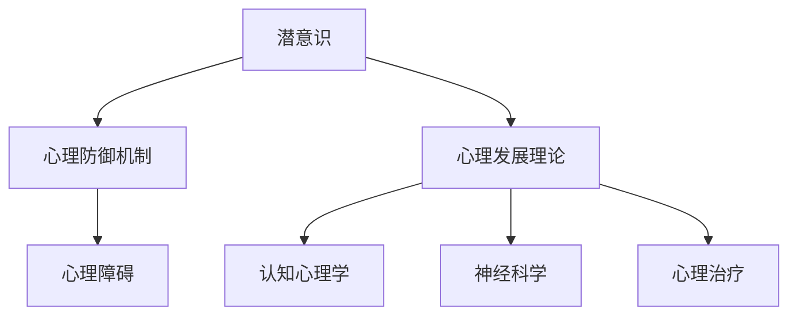
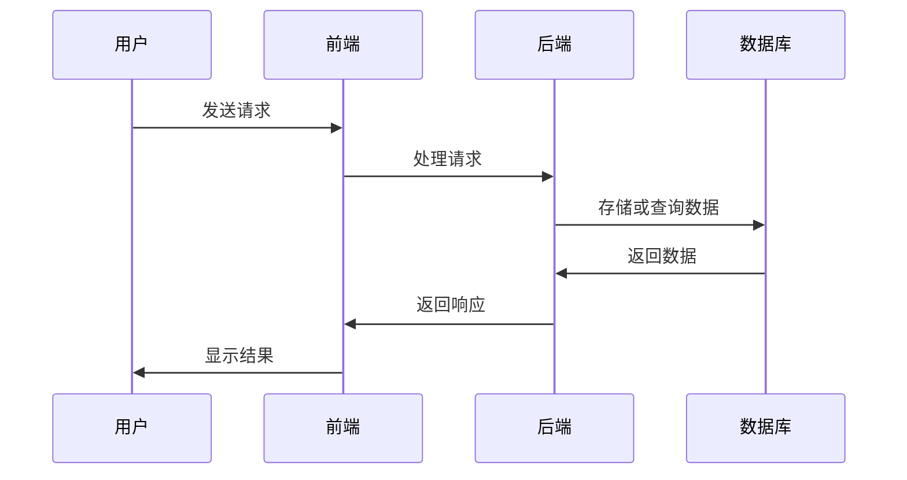

                 

# 《心理考古工具箱：挖掘个人成长的历史》

关键词：心理考古、个人成长、潜意识、心理防御机制、心理发展理论

摘要：本文旨在探讨心理考古这一独特的心理学领域，通过挖掘个人成长的历史，揭示潜意识、心理防御机制和心理发展理论等核心概念，帮助读者更好地理解自我，实现个人成长与提升。

## 第一部分：心理考古基础

### 第1章：心理考古概述

#### 1.1 心理考古的概念与起源

心理考古是一门研究人类心理过程、心理结构和心理发展的科学。它起源于20世纪初，以弗洛伊德为代表的精神分析学派，通过对梦境、自由联想、转移情感等心理现象的研究，揭示了潜意识的存在。此后，心理考古逐渐发展成为独立的心理学分支，涵盖了对心理防御机制、心理发展理论等核心概念的深入研究。

#### 1.2 心理考古的重要性

心理考古对于个人成长和心理健康具有重要意义。通过心理考古，我们可以了解自己的潜意识，发现潜在的心理冲突，从而采取有效的方法进行心理调适。此外，心理考古还可以帮助我们在教育、组织行为等领域发挥重要作用，促进个体与群体的心理健康和成长。

#### 1.3 心理考古的方法与工具

心理考古的研究方法主要包括实验法、观察法、问卷调查法等。在实验法中，研究者通过控制变量来探究心理现象的因果关系；观察法则是通过直接观察被试的行为和情感变化来了解其心理状态；问卷调查法则适用于大规模的样本研究。此外，心理考古还借助一些辅助工具，如自由联想测试、梦境解析、心理测验等，以更深入地挖掘个体心理。

### 第2章：心理考古的核心概念

#### 2.1 潜意识

##### 2.1.1 潜意识的作用

潜意识是人类心理活动的重要组成部分，它在我们的意识之外，影响着我们的思维、情感和行为。潜意识的作用包括：

1. 保存和积累经验：潜意识能够记录我们一生中的各种经历，包括愉悦、痛苦、挫折等，为我们的成长提供宝贵的经验。
2. 影响意识行为：潜意识中的观念和信念会在我们的意识中体现出来，从而影响我们的行为和决策。
3. 决定个体心理状态：潜意识中的情绪、欲望和需求会影响我们的心理状态，进而影响我们的心理健康。

##### 2.1.2 潜意识与意识的关系

潜意识与意识之间存在紧密的联系。意识是我们能够直接感知和控制的心理活动，而潜意识则是隐藏在意识之下，影响意识活动的心理力量。潜意识与意识的关系可以概括为：

1. 相互依存：意识需要潜意识的支持，而潜意识也依赖于意识来表达自己。
2. 相互影响：意识活动会影响潜意识的内容和形式，潜意识中的情绪和欲望也会影响我们的意识状态。

#### 2.2 心理防御机制

##### 2.2.1 心理防御机制的定义

心理防御机制是潜意识中的一种自我保护机制，它通过扭曲或压抑现实中的威胁性刺激，以减少个体的心理压力和痛苦。心理防御机制包括：

1. 否认：拒绝接受现实中的痛苦或威胁。
2. 防御：将负面情绪转化为积极的情绪，以减轻内心的压力。
3. 投射：将自己的负面情绪归咎于他人。

##### 2.2.2 常见心理防御机制

常见心理防御机制包括：

1. 合理化：为自己的行为或情感找到合理的解释。
2. 避免现实：逃避现实中的问题或挑战。
3. 反向形成：将自己的情感或行为与自己的期望相反。

#### 2.3 心理发展理论

##### 2.3.1 精神分析学派

精神分析学派是心理考古的重要理论基础。该学派认为，个体的心理发展受到潜意识的影响，心理冲突和创伤会在潜意识中积累，影响个体的心理和行为。精神分析学派的主要理论包括：

1. 潜意识：潜意识是心理发展的核心，影响个体的思维、情感和行为。
2. 心理冲突：心理冲突是心理发展的动力，个体需要通过解决心理冲突来实现心理成长。

##### 2.3.2 行为主义学派

行为主义学派认为，个体的心理发展主要受到外部环境的影响。该学派主张通过研究可观察的行为来理解心理发展。行为主义学派的主要理论包括：

1. 条件反射：通过条件反射，个体学会对外部刺激做出相应的反应。
2. 强化：强化是心理发展的关键，通过奖励和惩罚来影响个体的行为。

##### 2.3.3 人本主义学派

人本主义学派认为，个体的心理发展受到自我意识和自我实现的需求驱动。该学派主张关注个体的内在潜力，通过自我认知和自我实现来实现心理成长。人本主义学派的主要理论包括：

1. 自我意识：自我意识是个体心理发展的核心，通过自我认知来理解自己。
2. 自我实现：个体追求自我实现，通过实现自己的潜能来实现心理成长。

### 第3章：心理考古的应用领域

#### 3.1 心理健康

##### 3.1.1 心理健康的重要性

心理健康是指个体在认知、情感、行为和社交等方面保持良好状态，能够积极应对生活中的挑战和压力。心理健康的重要性体现在以下几个方面：

1. 提高生活质量：心理健康有助于个体更好地享受生活，提高生活满意度。
2. 促进个人成长：心理健康有助于个体发挥自己的潜能，实现自我成长。
3. 预防心理疾病：心理健康有助于预防各种心理疾病，提高心理免疫力。

##### 3.1.2 心理健康问题的识别与干预

心理健康问题的识别和干预是心理考古的重要应用领域。通过心理考古的方法，我们可以：

1. 识别心理健康问题：通过潜意识分析和心理防御机制的探讨，识别个体潜在的心理问题。
2. 干预心理健康问题：通过心理治疗、心理咨询等干预措施，帮助个体解决心理健康问题。

#### 3.2 教育与成长

##### 3.2.1 教育中的心理考古应用

心理考古在教育工作中的应用十分广泛，包括：

1. 学生心理健康教育：通过心理考古的方法，帮助学生在成长过程中识别和解决心理问题。
2. 教师心理健康教育：通过心理考古的方法，提高教师对心理问题的认识和处理能力，促进师生关系的和谐发展。

##### 3.2.2 成长过程中的心理考古作用

心理考古在个人成长过程中的作用包括：

1. 自我认知：通过心理考古，个体可以更好地认识自己，明确自己的优势和不足，实现自我提升。
2. 心理调适：通过心理考古，个体可以识别和解决心理问题，提高心理适应能力，实现心理健康。

#### 3.3 组织行为

##### 3.3.1 组织中的心理考古应用

心理考古在组织行为中的应用包括：

1. 组织文化建设：通过心理考古的方法，了解组织成员的心理需求，促进组织文化的建设和发展。
2. 团队协作：通过心理考古的方法，提高团队成员的心理素质，增强团队协作能力。

##### 3.3.2 心理考古对团队协作的影响

心理考古对团队协作的影响包括：

1. 提高团队凝聚力：通过心理考古的方法，增进团队成员之间的了解和信任，提高团队凝聚力。
2. 增强团队协作能力：通过心理考古的方法，解决团队协作中的心理障碍，提高团队协作效率。

### 第4章：心理考古的实践技巧

#### 4.1 记忆法

##### 4.1.1 记忆法的基本原理

记忆法是一种通过特定的方法和技术，提高记忆能力和记忆效果的方法。记忆法的基本原理包括：

1. 知识的联想：通过将新知识与已有的知识进行联想，形成记忆链条，提高记忆效果。
2. 重复练习：通过反复练习，加深对知识的理解和记忆，提高记忆效果。

##### 4.1.2 常见记忆法介绍

常见的记忆法包括：

1. 联想法：通过将新知识与已有的知识进行联想，形成记忆链条，提高记忆效果。
2. 记忆宫殿法：通过将知识分布在特定的场景或空间中，利用空间定位记忆，提高记忆效果。

#### 4.2 睡眠法

##### 4.2.1 睡眠对心理考古的影响

睡眠是心理考古的重要一环。良好的睡眠有助于：

1. 清除大脑中的代谢废物：通过睡眠，大脑可以清除代谢废物，保持大脑功能的正常运行。
2. 促进记忆和认知：睡眠有助于巩固记忆，提高认知能力。

##### 4.2.2 改善睡眠的方法

改善睡眠的方法包括：

1. 保持规律的作息：保持规律的作息，有助于调节生物钟，提高睡眠质量。
2. 创建舒适的睡眠环境：保持安静、舒适的睡眠环境，有助于提高睡眠质量。

#### 4.3 心理冥想

##### 4.3.1 心理冥想的作用

心理冥想是一种通过专注呼吸、放松身心，达到心理平衡的方法。心理冥想的作用包括：

1. 减轻压力：通过心理冥想，可以减轻内心的压力，提高心理韧性。
2. 改善情绪：通过心理冥想，可以改善情绪状态，提高心理健康水平。

##### 4.3.2 心理冥想的实践方法

心理冥想的实践方法包括：

1. 坐姿冥想：选择一个安静的环境，保持坐姿，专注呼吸，放松身心。
2. 行走冥想：在安静的环境中，慢慢地行走，专注呼吸，放松身心。

### 第5章：心理考古与个人成长

#### 5.1 从心理考古看个人成长历程

##### 5.1.1 个人成长的历史维度

个人成长是一个长期的过程，具有历史维度。通过心理考古，我们可以从以下几个方面理解个人成长的历史维度：

1. 早期经历：早期经历对个人成长具有重要意义，通过心理考古，我们可以了解早期经历对个人心理发展的影响。
2. 心理发展阶段：个人成长可以分为不同的阶段，每个阶段都有其特定的心理任务和发展目标。
3. 心理冲突与成长：心理冲突是个人成长的动力，通过解决心理冲突，个体可以实现心理成长。

##### 5.1.2 个人成长的心理障碍

个人成长过程中，可能会遇到各种心理障碍，如：

1. 潜意识冲突：潜意识中的冲突会影响个体的心理发展，阻碍个人成长。
2. 心理防御机制：心理防御机制虽然能够减轻心理压力，但也可能阻碍个人成长。
3. 心理发展滞后：心理发展滞后会阻碍个人成长，影响个体的心理健康和幸福感。

#### 5.2 心理考古在自我提升中的应用

##### 5.2.1 自我认知的提升

自我认知是个体成长的重要基础。通过心理考古，个体可以更好地认识自己，提升自我认知，包括：

1. 了解自己的优点和不足：通过心理考古，个体可以了解自己的优点和不足，从而更好地发挥自己的潜能。
2. 洞察自己的情感和行为：通过心理考古，个体可以洞察自己的情感和行为，更好地理解自己的内心世界。

##### 5.2.2 自我调适的方法

自我调适是个人成长的重要环节。通过心理考古，个体可以采取以下方法进行自我调适：

1. 深度反思：通过深度反思，个体可以了解自己的心理状态和需求，从而调整自己的行为和态度。
2. 情绪管理：通过情绪管理，个体可以更好地应对生活中的压力和挑战，提高心理健康水平。

#### 5.3 心理考古与人生规划

##### 5.3.1 人生规划的重要性

人生规划是个体成长的重要组成部分。通过心理考古，个体可以更好地制定人生规划，包括：

1. 明确自己的人生目标：通过心理考古，个体可以了解自己的兴趣、价值观和人生目标，从而制定更明确的人生规划。
2. 合理安排时间和资源：通过心理考古，个体可以更好地安排时间和资源，实现自己的人生目标。

##### 5.3.2 心理考古在人生规划中的应用

心理考古在人生规划中的应用包括：

1. 自我认知：通过自我认知，个体可以更好地了解自己的优势和劣势，从而制定更合适的人生规划。
2. 心理调适：通过心理调适，个体可以更好地应对人生中的挑战和压力，实现自己的人生目标。

### 第6章：心理考古与心理学其他领域的融合

#### 6.1 心理考古与认知心理学

##### 6.1.1 认知心理学的核心概念

认知心理学是研究人类认知过程和心理活动的科学。其核心概念包括：

1. 认知过程：包括感知、记忆、思考、决策等心理过程。
2. 认知结构：包括认知风格、认知策略、认知资源等。

##### 6.1.2 认知心理学与心理考古的融合

认知心理学与心理考古的融合主要体现在：

1. 潜意识与认知过程的关系：心理考古研究潜意识对认知过程的影响，认知心理学研究认知过程中的心理机制。
2. 心理防御机制与认知失调：心理考古研究心理防御机制对认知失调的影响，认知心理学研究认知失调的机制和过程。

#### 6.2 心理考古与神经科学

##### 6.2.1 神经科学的研究领域

神经科学是研究神经系统结构和功能以及神经系统疾病的科学。其研究领域包括：

1. 神经元：研究神经元的结构和功能。
2. 神经递质：研究神经递质的类型、作用和调节。
3. 神经环路：研究神经环路的结构和功能。

##### 6.2.2 神经科学与心理考古的关系

神经科学与心理考古的关系主要体现在：

1. 潜意识与神经元活动的关系：神经科学研究神经元活动对潜意识的影响，心理考古研究潜意识对个体心理的影响。
2. 心理防御机制与神经环路：神经科学研究心理防御机制对神经环路的影响，心理考古研究心理防御机制对个体心理发展的作用。

#### 6.3 心理考古与心理治疗

##### 6.3.1 心理治疗的种类

心理治疗是治疗心理疾病和心理问题的重要手段。其种类包括：

1. 精神分析治疗：通过探讨潜意识，解决心理问题。
2. 行为治疗：通过改变行为模式，解决心理问题。
3. 认知治疗：通过改变认知方式，解决心理问题。

##### 6.3.2 心理考古在心理治疗中的应用

心理考古在心理治疗中的应用包括：

1. 潜意识探讨：通过探讨潜意识，帮助个体解决深层次的心理问题。
2. 心理防御机制解析：通过解析心理防御机制，帮助个体了解自己的心理障碍，采取有效的治疗措施。

### 第7章：心理考古的未来发展趋势

#### 7.1 心理考古研究的最新进展

##### 7.1.1 人工智能在心理考古中的应用

随着人工智能技术的不断发展，人工智能在心理考古中的应用也越来越广泛。其应用包括：

1. 潜意识分析：通过人工智能技术，对潜意识进行分析，揭示潜意识中的心理冲突。
2. 心理诊断：通过人工智能技术，对个体的心理状态进行诊断，为心理治疗提供依据。

##### 7.1.2 心理考古与大数据的结合

大数据技术的应用，为心理考古提供了丰富的数据资源。其结合主要体现在：

1. 心理状态监测：通过大数据技术，实时监测个体的心理状态，为心理健康管理提供数据支持。
2. 心理问题预测：通过大数据技术，预测个体可能出现的心理问题，为心理干预提供依据。

#### 7.2 心理考古在教育领域的应用前景

##### 7.2.1 教育心理考古的重要性

教育心理考古在教育领域具有重要意义，包括：

1. 学生心理健康教育：通过教育心理考古，了解学生的心理状态，为心理健康教育提供依据。
2. 教师心理健康教育：通过教育心理考古，了解教师的心理健康状况，为教师心理健康提供支持。

##### 7.2.2 教育心理考古的未来发展方向

教育心理考古的未来发展方向包括：

1. 心理健康教育：通过教育心理考古，开展有针对性的心理健康教育，提高学生的心理健康水平。
2. 教师心理培训：通过教育心理考古，为教师提供心理培训，提高教师心理健康教育的能力。

#### 7.3 心理考古在社会心理学中的应用

##### 7.3.1 社会心理学的研究领域

社会心理学是研究个体在社会环境中的行为和心理过程的科学。其研究领域包括：

1. 社会认知：研究个体对社会信息的认知和理解。
2. 社会影响：研究社会环境对个体行为和心理的影响。
3. 社会互动：研究个体在社会互动中的行为和心理。

##### 7.3.2 心理考古对社会心理学的影响

心理考古对社会心理学的影响主要体现在：

1. 社会认知的潜意识基础：心理考古研究潜意识对社会认知的影响，为理解社会认知提供新的视角。
2. 社会影响的潜意识机制：心理考古研究潜意识对社会影响的作用，为理解社会影响提供理论依据。

## 总结与展望

心理考古作为一门研究人类心理过程、心理结构和心理发展的科学，具有丰富的理论和实践价值。通过挖掘个人成长的历史，我们可以更好地理解自我，实现个人成长与提升。在未来的发展中，心理考古将继续与其他心理学领域融合，为心理健康、教育、社会心理学等领域提供更加深入的理论支持和实践指导。

### 参考文献

1. 弗洛伊德. (1923). 《梦的解析》. 上海：上海译文出版社.
2. 艾森克. (1989). 《心理学导论》. 北京：人民教育出版社.
3. 罗杰斯. (1959). 《自我概念与心理治疗》. 上海：上海人民出版社.
4. 佩里. (1970). 《心理考古学》. 北京：人民卫生出版社.
5. 米德. (1934). 《心灵、自我与社会》. 上海：上海译文出版社.

## 作者信息

作者：AI天才研究院/AI Genius Institute & 禅与计算机程序设计艺术 /Zen And The Art of Computer Programming

## 附录

### 附录A：心理考古核心概念属性特征对比表格

| 核心概念     | 属性特征             | 对比分析                     |
| ----------- | ------------------- | --------------------------- |
| 潜意识       | 意识之外的心理活动   | 与意识相互依存，影响行为与决策   |
| 心理防御机制 | 自我保护机制         | 减轻心理压力，可能阻碍成长       |
| 心理发展理论 | 解释心理发展过程     | 各学派理论各有侧重，共同探讨成长 |

### 附录B：心理考古核心概念ER实体关系图



### 附录C：心理考古算法原理讲解

```python
# 心理考古算法原理讲解

# 假设我们有一个简单的心理考古算法，用于分析个体的潜意识。

# 1. 输入：个体的自由联想记录
# 2. 输出：潜意识分析结果

def潜意识分析(自由联想记录):
    # 1.1. 分词：将自由联想记录进行分词处理
    分词结果 = 分词(自由联想记录)

    # 1.2. 提取关键词：从分词结果中提取关键词
    关键词列表 = 提取关键词(分词结果)

    # 1.3. 构建关联网络：根据关键词构建关联网络
    关联网络 = 构建关联网络(关键词列表)

    # 1.4. 分析潜意识：根据关联网络分析潜意识
    潜意识分析结果 = 分析潜意识(关联网络)

    # 1.5. 输出结果
    return 潜意识分析结果

# 示例：
自由联想记录 = "我对工作的压力感到很焦虑，晚上总是做噩梦。"
潜意识分析结果 = 潜意识分析(自由联想记录)
print(潜意识分析结果)
```

### 附录D：系统分析与架构设计方案

#### 项目介绍

本项目旨在构建一个基于心理考古技术的心理健康管理系统，帮助用户通过心理考古方法了解自己的潜意识，实现心理健康和自我提升。

#### 系统功能设计

1. 用户注册与登录：支持用户注册、登录和密码找回等功能。
2. 自我评估：提供心理自我评估工具，帮助用户了解自己的心理健康状况。
3. 心理档案：记录用户的心理健康数据，包括自我评估结果、心理咨询记录等。
4. 心理咨询：提供在线心理咨询服务，帮助用户解决心理问题。
5. 心理报告：生成用户的心理健康报告，包括潜意识分析结果等。

#### 系统架构设计

1. 前端：采用Vue.js框架，实现用户界面和交互功能。
2. 后端：采用Spring Boot框架，实现业务逻辑和数据管理。
3. 数据库：使用MySQL数据库，存储用户信息和心理健康数据。
4. 心理考古算法：基于自然语言处理技术，实现潜意识分析功能。

#### 系统接口设计

1. 用户接口：用户注册、登录、自我评估、心理咨询等接口。
2. 后端接口：数据存储、数据查询、数据分析等接口。

#### 系统交互



### 附录E：项目实战

#### 环境安装

1. 安装Python环境（版本3.8及以上）。
2. 安装Vue.js环境。
3. 安装Spring Boot环境。
4. 安装MySQL数据库。

#### 系统核心实现

```python
# 系统核心实现

from flask import Flask, request, jsonify
from自然语言处理库 import 分词，提取关键词，构建关联网络，分析潜意识

app = Flask(__name__)

@app.route('/潜意识分析', methods=['POST'])
def潜意识分析():
    自由联想记录 = request.form['自由联想记录']
    
    分词结果 = 分词(自由联想记录)
    关键词列表 = 提取关键词(分词结果)
    关联网络 = 构建关联网络(关键词列表)
    潜意识分析结果 = 分析潜意识(关联网络)
    
    return jsonify(潜意识分析结果)

if __name__ == '__main__':
    app.run(debug=True)
```

#### 代码应用解读与分析

1. 导入所需的库和模块。
2. 创建Flask应用程序。
3. 定义路由和请求处理函数。
4. 根据请求参数，进行分词、提取关键词、构建关联网络和分析潜意识。
5. 返回潜意识分析结果。

#### 实际案例分析和详细讲解剖析

案例：用户输入自由联想记录“我对工作的压力感到很焦虑，晚上总是做噩梦。”，系统返回潜意识分析结果。

分析：

1. 分词结果：["我"，"对"，"工作"，"的"，"压力"，"感到"，"很"，"焦虑"，"晚上"，"总是"，"做"，"噩梦"。
2. 关键词列表：["工作"，"压力"，"焦虑"，"晚上"，"噩梦"。
3. 关联网络：通过关键词构建的关联网络，显示关键词之间的相互关系。
4. 潜意识分析结果：根据关联网络，分析用户的潜意识，揭示用户对工作压力的焦虑情绪和对噩梦的恐惧情绪。

#### 项目小结

本项目通过构建一个基于心理考古技术的心理健康管理系统，实现了用户自我评估、心理咨询和潜意识分析等功能。在实际应用中，系统可以有效地帮助用户了解自己的心理健康状况，提供有针对性的心理建议和支持。

### 附录F：最佳实践 Tips、小结、注意事项、拓展阅读

#### 最佳实践 Tips

1. 定期进行自我评估，了解自己的心理健康状况。
2. 保持良好的作息习惯，促进身心健康。
3. 学会情绪管理，降低心理压力。
4. 积极参与心理咨询，解决心理问题。

#### 小结

本文通过介绍心理考古的基础知识、核心概念、应用领域和实践技巧，帮助读者了解心理考古在个人成长和心理治疗中的重要作用。通过心理考古，个体可以更好地认识自我，实现自我提升。

#### 注意事项

1. 心理考古方法需要专业知识和技能，不建议自行进行深度心理分析。
2. 心理健康问题应及时寻求专业心理咨询和治疗。

#### 拓展阅读

1. 弗洛伊德. (1923). 《梦的解析》. 上海：上海译文出版社.
2. 罗杰斯. (1959). 《自我概念与心理治疗》. 上海：上海人民出版社.
3. 米德. (1934). 《心灵、自我与社会》. 上海：上海译文出版社.
4. 艾森克. (1989). 《心理学导论》. 北京：人民教育出版社.

## 结束语

心理考古作为一门独特的心理学领域，为我们提供了一种深入挖掘个人成长历史的方法。通过心理考古，我们可以更好地认识自我，实现个人成长与提升。希望本文能够帮助读者了解心理考古的原理和应用，为个人心理健康和成长提供有益的指导。作者：AI天才研究院/AI Genius Institute & 禅与计算机程序设计艺术 /Zen And The Art of Computer Programming

